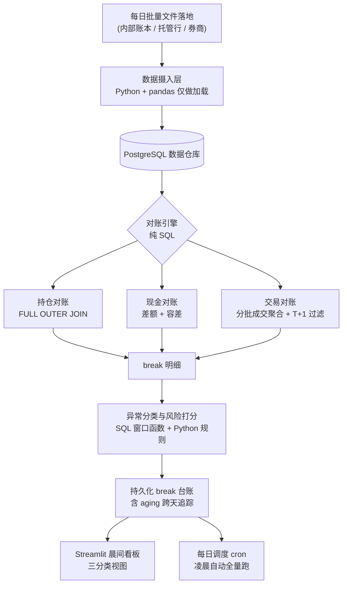
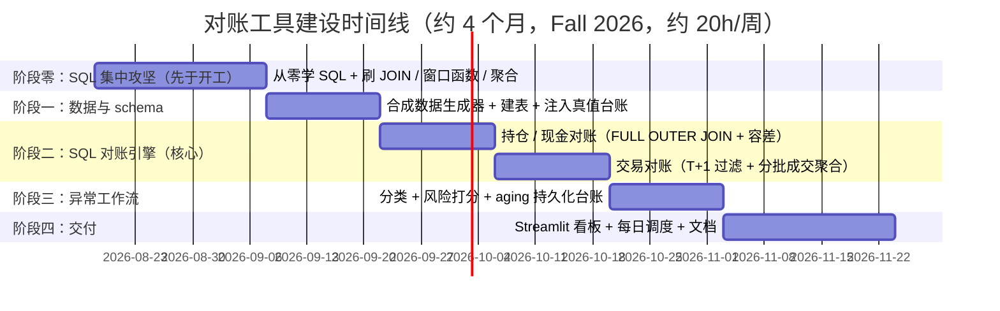

# 案例：自动化对账与异常（Break）管理工具

> **本文是一份前瞻性设计文档（forward-looking design），非既成事实记录。** 全文用"我计划 / 我将"的语气描述一个 Wesley Rao（学生化名，一望即知的占位假名）将在未来约 4 个月内真实构建的项目。项目执行完成后，可另行沉淀一份过去式的 `executed-case-cn.md` 到经历文件夹根部，本文是它的种子。
>
> **关于 venue 与数据的诚实声明。** 本项目的执行 venue 是一份基金行政 / 中后台运营方向的实习，学生**正在坐实中**：本设计先行完成，学生随后落实这份实习作为真实执行场地（设计先于获得）。文中的 Meridian Fund Services 是一个**类别化名**，代表"基金行政 / 中后台运营外包（fund administrator / middle-office services）"这一大类真实存在、且在市场上数量众多的雇主（如 SS&C、Citco、State Street、Apex 及大量中型同类公司）。之所以不直接对标 Virtu 或某个精确竞品，是因为 100% 精确对标只能编造一个易被证伪的假身份；选一个"日常主业就是对账 / 结算"的相邻真实岗位类别，既能提供项目所需的业务环境，又诚实、好验证。项目数据为**合成数据**，挂在真实业务结构下，本文全程明确标注。**venue 坐实后，写给内部流转 / 简历 / mock-interview 的版本会用真实公司名 + 可验证联系人供真实性核验；本设计文档用化名保护隐私。** 这个背景框架的作用是帮助学生理解项目的 setup，不是用来向任何人虚构事实。venue 尚未落实这一前提风险，见第 10 节遗留六。
>
> **对齐比例：约 70% 对口目标岗位（对账 / 结算 / break / T+1 / 托管行），约 30% 是 Wesley Rao 从"数据支持"本职往运营工程方向的自我延伸。**

---

## 1. 一句话总结

在 Meridian Fund Services（一家中型基金行政公司）中后台对账团队兼职实习期间，我将独立构建一个基于 PostgreSQL 的自动化对账与异常（break）管理工具，把原本靠 Excel 手工抽查的每日持仓 / 现金 / 交易三方对账，变成一条可复算、能追踪 break aging、并按风险排序待人工复核的 SQL 流水线。

这句话通过"去面试路上电梯里讲得完"的测试：它说清了做什么（对账工具）、在哪做（Meridian 对账团队）、带来什么改变（手工 Excel 抽查，变成可复算的 SQL 对账流水线）。

---

## 2. 业务背景与公司

**Meridian Fund Services 是做什么的。** 它是一家中型基金行政公司，替一批对冲基金和资管客户提供中后台外包服务。核心业务之一是**每日对账（daily reconciliation）**：基金自己有一套内部账本（shadow accounting ledger，记录基金"应该"持有什么、有多少现金、做了哪些交易），而真实世界里，钱和证券的权威记录在**托管行（custodian）**和**执行券商（executing broker）**手上。这两套记录每天都可能对不平，对不平的地方就叫 **break**。Meridian 的对账团队每天早上要在客户基金开盘 / 估值之前，把前一日的 break 找出来、分类、判断严重程度、追着托管行和券商去核实和修正。

**为什么这个环境对目标岗位是对口的。** 目标 JD（Virtu Financial, Trading Operations Analyst）的核心职责原文是 "managing the clearance, settlement, and reconciliation of all trades and positions"，要和 "traders, finance, compliance, brokers, custodians" 协作，保证 "Timely settlement of trades / Accuracy of books and records"。基金行政对账团队的日常，就是这段话的具体版本：一样要对持仓、对现金、对交易，一样要理解 T+1 交收、一样要追 break、一样要和托管行 / 券商打交道。词汇和机制高度重合，这是 70% 对口的来源。

**诚实的距离在哪（30% 延伸，也是面试要能桥接的点）。** 基金行政是 **agency-side**（代客户做中后台服务），而 Virtu 是 **principal / 做市商**（对自己做市产生的头寸做对账）。对账的机制（break、T+1、托管行、settlement）是共通的、可迁移的；不同的是背后的风险和 P&L 语境：Virtu 的 break 直接关系自营头寸和风控，语境更紧。这个差异我在第 10 节明确列为遗留项，Wesley Rao 需要在面试里能主动说清"机制我做过，Virtu 这边的 principal 语境有什么不同"。

**我在这里的身份。** 我是对账团队里唯一的数据 / Python 兼职实习生（Operations Data Analyst Intern），大四在读，学期内每周投入约 20 小时。团队里其余是全职对账分析师，他们是 domain 权威、我是"那个能写代码的人"。我的价值定位不是替他们做对账判断，而是把他们每天手工重复的那部分自动化掉。

---

## 3. 触发事件

项目不是凭空立项的，是三股力量在实习前两周撞到一起：

**触发一：一个 break 在手工抽查里漏了 3 天。** 团队现有做法是每天把部分账户的持仓从内部系统导出到 Excel，和托管行的持仓报告逐行肉眼核对。因为是"抽查"（人手有限，没法每天全量核对），有一个中等金额的持仓 break 连续 3 天没被抽到，直到托管行主动来问才发现。这件事让团队 lead 意识到：抽查覆盖不全，是结构性风险，不是谁不小心。

**触发二：数据其实已经在数据库里，对账却在 Excel 里做。** Meridian 的内部账本和每日导入的托管行 / 券商文件，本来就落在团队共用的一个 PostgreSQL 数据仓库里。但对账动作是"从库里导出成 Excel，再手工比"。我作为数据实习生第一周就注意到这个落差：数据在库里，比对却离开了库，等于放着 SQL 不用、用肉眼。

**触发三：我的 onboarding 任务本身就是"帮忙整理对账表"。** 我入职的头号任务是清理和维护那张手工对账 Excel。正是这个任务让我一行一行看清了：哪些比对是纯机械的（完全可以交给 SQL）、哪些才真正需要人的判断（追不追、怎么追）。我想把前者从后者里剥出来。

这三件事合起来，指向同一个结论：**把"找 break"这一步从手工 Excel 抽查，改成数据库里的全量 SQL 对账**，让人把省下的时间放到真正需要判断的 break 上。

---

## 4. 项目范围（In Scope / Out of Scope）

**In Scope（我要做的）：**

- 三类对账：**持仓对账**（内部持仓 vs 托管行持仓）、**现金对账**（内部现金账 vs 银行 / 托管现金记录）、**交易对账**（内部成交记录 vs 券商成交确认）。
- 覆盖对账里三个真实的难点：**T+1 结算时间错配**、**分批成交的一对多匹配**、**容差（materiality）判定**。
- break 的**自动分类**（Position / Cash / Trade）、**风险打分与排序**、**aging 追踪**（同一个 break 跨天累计存在了几天）。
- 一个给对账团队早上用的**轻量看板**（今日 break 三分类：可自动核销 / 待人工复核 / 新增高风险）。
- 一个**每日调度**：凌晨文件落地后自动跑全量对账，刷新 break 台账。

**Out of Scope（我刻意不做的，这是纪律所在）：**

- **不做 break 的实际处置。** 工具只负责"找出来、分好类、排好序"；追托管行、追券商、改账，是全职分析师的判断和动作，我不碰。
- **不回写源系统。** 工具对内部账本和源文件**只读**，绝不写回，避免任何"自动改账"的风险。
- **不做机器学习。** 打分用透明规则，不用黑盒模型（理由见第 7 节决策 7）。
- **不做实时 / 日内对账。** 只做每日批量（T+1 场景本身就是隔夜结算），不追日内撮合级别的实时性。
- **不覆盖复杂衍生品。** 只做股票 + 现金，不碰期权 / 掉期 / 多币种 FX（容差里只做简单的舍入处理，不做全套多币种）。
- **不做生产级部署。** 它是跑在团队开发机上的内部工具，不是全公司级生产系统（这条也界定了我的 ownership 边界，见第 5 节）。

Out of Scope 的这几条，比 In Scope 更能体现判断力：一个实习生如果声称自己"端到端负责了全公司对账自动化"，面试官一追就穿；诚实地把处置、回写、生产部署划在外面，反而站得住。

---

## 5. 团队与我的角色

| 角色 | 人 | 负责什么 | 我与之的关系 |
|---|---|---|---|
| 对账团队 Lead | 1 位全职 | 对账口径、materiality 阈值最终签字、对客户负责 | 我的汇报对象，工具需求和阈值都要她过目 |
| 全职对账分析师 | 约 5 位 | 每日 break 的判断、追托管行 / 券商、处置和修正 | 工具的**使用者**；他们定义"什么算重要"，我把它翻译成规则 |
| 数据 / Python 实习生（我） | 1 位兼职 | 构建对账工具本身：SQL 引擎 + Python 异常工作流 + 看板 + 调度 | 唯一的代码承担者，但只做"找和分"，不做"判和追" |
| 上游 IT / 数据团队 | 另一个部门 | 维护 PostgreSQL 仓库、托管行 / 券商文件的导入管道 | 我**消费**他们给的数据，不拥有 schema |

**我明确 NOT 拥有的东西（面试要能主动讲清）：**

- **我不拥有源数据 schema。** 托管行文件格式、内部账本导出结构，都是上游系统和 IT 团队定的，我只能接受并适配。
- **我不拥有 materiality 阈值的定义权。** 容差阈值是我根据数据分布**提议**的，最终由团队 Lead 签字确认；不是我一个人拍板。
- **我不拥有 break 的处置决策。** 工具把 break 排到分析师面前，追不追、怎么追、是不是真错，是他们的专业判断。
- **我不拥有生产环境。** 工具跑在团队开发机 / 内部环境，不是经过完整生产加固（告警、容错、SLA）的系统。

诚实划清这四条边界，是这个 case 能扛住深挖的关键：我做的是一个**真实但有边界**的工具，不是一个被吹大的"平台"。

**一处真实的跨团队协作接点（对应 JD "work closely with software engineers to further automate"）。** 每日对账要接在上游 IT 的文件导入管道之后跑，所以文件何时落地、字段格式若变更如何提前通知我、我的对账调度串在他们管道的哪一步，这些都需要我和上游 IT / 数据工程师对齐口径，而不是"我一个人闷头写完就算"。把我的对账 + 调度嵌进他们已有的数据管道，是一次真实的、面向自动化的工程协作，也是这个岗位 JD 里"和工程师一起把运营流程自动化"那句话的具体落点。

---

## 6. 我做了什么

这是全文最长的一节。我把系统架构、每一块背后的业务需求、和执行细节揉在一起讲。

### 6.1 系统全貌

**一句话读懂这张图：** 数据用 Python 加载进 PostgreSQL 后，**对账的核心逻辑全部用 SQL 在库里完成**（这是刻意的，见决策 1），break 找出来后由 Python 做分类打分和 aging 台账，最后落到看板和每日调度。整个设计的重心是中间那个 SQL 对账引擎，不是任何一层外壳。

### 6.2 数据层：先把"两套要对平的账"建出来

对账的前提是有两套（或多套）本应一致、但现实中会不一致的数据。我会写一个**合成数据生成器**，造出贴近真实结构的几张表：

- `internal_positions`（内部持仓：账户、证券、数量、日期）
- `custodian_positions`（托管行持仓：同结构，但会有差异）
- `internal_trades`（内部成交：订单号、证券、方向、数量、价格、成交日、结算日）
- `broker_confirmations`（券商成交确认：会把一个内部订单拆成多笔分批成交）
- `internal_cash` / `custodian_cash`（现金两侧）
- `counterparty_stats`（对手方主数据 + 历史 break 统计：托管行 / 券商实体、过去 N 个交易日的 break 次数与 fail 频率；专供风险打分里"对手方历史 fail 率"分项取数，不参与 break 检测本身）

关键设计：**生成器会按已知规则注入 break**（比如故意让某账户某证券的托管行数量少 200 股、故意制造一笔 T+1 未交收的交易、故意把一个订单拆成 3 笔分批成交且其中一笔金额舍入不同），并把这些注入记录进一张"真值台账"。这张真值台账是我后面**测量召回率**的标尺（见第 8 节）。数据是合成的，但注入的 break 类型全部照着真实对账场景设计。

生成器还会专门造一类**"跨天未完全成交"样本**：某订单当天只成交了一部分、余量转天再成交。这类样本用来验证决策 5 的 as-of 聚合口径不会把"还没成交完"误判成 break，也是真实对账里最容易踩的坑之一。

这一步也是我复用 C++ 旧项目的第一个接点：我在"银行交易处理系统"里写过交易的合法性校验和结构化读取，这里造合成交易数据、定义字段和约束，是同一种"想清楚一笔交易由哪些字段构成、哪些组合是非法的"的思维，只是换到了关系型表结构上。

### 6.3 对账引擎：项目的心脏（纯 SQL）

**持仓对账。** 内部持仓和托管行持仓，按 (账户, 证券, 日期) 对齐。核心是一句 `FULL OUTER JOIN`：

- 两边都有、数量相同：对平，无 break。
- 两边都有、数量不同：**数量 break**。
- 只有内部有（托管行侧 NULL）：**内部多记 / 托管行漏记**。
- 只有托管行有（内部侧 NULL）：**内部漏记**。

用 `FULL OUTER JOIN` 而不是 `INNER JOIN` 是有意的（决策 2）：break 的本质常常就是"一边有、另一边没有"，`INNER JOIN` 会把这些只存在于单侧的记录**悄悄丢掉**，等于把要找的东西过滤没了。

**交易对账（最难的一块，集中了三个真实难点）：**

- **难点 A，T+1 结算时间错配。** 一笔今天（T 日）成交的交易，要到 T+1 才在托管行交收出现。如果不处理，naive 对账会把所有"今天刚成交、还没到交收日"的交易全部误报成 break。我用 `WHERE settle_date <= as_of_date` 把未到交收日的交易排除在对账口径外。这一条是"domain 理解"直接变成"SQL 条件"的典型：不懂 T+1，就写不出这句 WHERE，报表就会 90% 是假 break。

- **难点 B，分批成交的一对多匹配。** 一个内部订单（买 10000 股）在券商侧可能是 3 笔分批成交（4000 + 3000 + 3000）。逐行匹配会对不上、还会重复计数。我的做法是**先按订单号 `GROUP BY` 聚合券商侧的分批成交（`SUM(quantity)`、加权价格），再和内部订单 JOIN**。这一块是我复用 C++ 旧项目的第二个接点：我在"动态事件驱动撮合系统"里就处理过"双边匹配 + 部分成交（partial fill）"，那时是在内存里用优先队列撮合，这次是在 SQL 里用聚合再 JOIN，是同一个问题换了一种表达。

- **难点 C，容差（materiality）。** 舍入、碎股会造成分 / 厘级别的微小差异，如果要求精确相等，报表会被无意义的噪音淹没。我加一个可配置的容差：`WHERE ABS(internal_amt - broker_amt) > tolerance` 才算 break。阈值按资产类别设，并交团队 Lead 签字（我不拥有这个阈值，见第 5 节）。

**现金对账。** 结构上最简单：两侧现金按 (账户, 币种, 日期) 比，超容差即 break。

### 6.4 异常分类、打分与 aging（Python + SQL 窗口函数）

break 找出来后，要让人能"先看最危险的"：

- **分类**：按来源自动标为 Position / Cash / Trade break。
- **风险打分（透明规则，0-100）**：四个分项相加，每项都是明写的分档，不是黑盒：
  - **金额**：> $1M 记 40，$100K-1M 记 20，< $100K 记 5；
  - **aging**：每存在 1 个交易日 +10，上限 35；
  - **类型**：Position 15 / Cash 10 / Trade 5（持仓错配通常最紧）；
  - **对手方历史 fail 率**：0-10，取数自 §6.2 的 `counterparty_stats` 表，按该托管行 / 券商在滚动历史窗口内的 fail 频率映射到 0-10。MVP 早期若历史样本不足，先用一个中性占位默认值（全体记 5），积累够历史后再切到真实统计，避免冷启动时这一分项无依据。
  举两个算例：break A（$2.3M 持仓 break、aging 3 天、对手方历史 fail 率高记 8）= 40 + 30 + 15 + 8 = **93**；break B（$250K 交易 break、aging 1 天、对手方记 3）= 20 + 10 + 5 + 3 = **38**。所以 A 排在 B 前面，且每一分的来源都能向分析师和面试官讲清（决策 7）。这套权重是我提议、团队 Lead 签字的（我不拥有这个口径，见第 5 节）。
- **排序**：用窗口函数 `ROW_NUMBER() OVER (PARTITION BY account ORDER BY risk_score DESC)` 给每个账户内的 break 排名，让看板能"每个账户先看最高风险那个"。
- **aging 追踪与 break 状态机**：这是我最想讲的一块。break 不是一次性的，同一个 break 可能连续几天存在。我建一张**持久化 break 台账**，每天把新算出的 break 和昨天的台账比对，给"同一个 break"一个稳定身份（按 账户+证券+类型 做匹配键），从而算出它已经存在了几天。这本身又是一个小的匹配问题（决策 6）：怎么判断"今天这个 break 和昨天那个是同一个"。这一步把触发一里"break 漏了 3 天没人发现"的痛，直接变成"任何 break 一旦 aging 超过阈值就自动置顶"。
  break 还有**状态**、不只有 aging：如果某个 key 的 break 今天不在了，我不会直接当"已解决"，而是**先校验当天源数据是否完整导入**（防止"托管行文件没到"被误读成"break 修好了"），确认数据完整后才标为 `resolved` 并记下解决日期；如果一个已 `resolved` 的 key 隔几天又出现，我把它记成一次**新的 occurrence**（保留历史发生记录），而不是接着老 aging 继续算。这样才能区分"同一个 break 一直没修"和"修好后又复发"，也能回答面试官那句"你怎么知道这个 break 是被修好了、而不是数据没导进来"。

### 6.5 看板与调度（20 小时 / 周预算允许的交付层）

- **Streamlit 看板**：对账团队早上打开就能看到今日三分类（可自动核销 / 待人工复核 / 新增高风险），以及按风险排序的 break 列表，点开能看某个 break 的两侧数据和 aging。刻意做得克制，它是给内部团队用的运营界面，不是要炫的产品。
- **每日调度**：用 cron / APScheduler，凌晨源文件落地后自动跑一遍全量对账、刷新台账。这一层把"自动化叙事"落地（对应 gap 分析里的 Gap 5）。

### 6.6 项目时间线

**为什么先有阶段零。** gap 分析把 SQL 列为第一优先、建议第一周就上、约 2-3 周聚焦攻坚（它是 OA 的硬闸）。所以我把"从零学 SQL 到能写 FULL OUTER JOIN / 窗口函数 / 聚合"单独**前置成阶段零**（约 3 周，8 月中起），先于项目开工。这样阶段一（9 月）开工时我已经有基础 SQL 手感，不用在同一个 2 周窗口里既学语法又做生产级判断。SQL 刷题轨也从这里启动，之后与项目并行贯穿全程。

**分阶段投递（按月份对齐当下真实进度）。** 我自述"1-3 个月内启动求职"（约 8-10 月），而项目完整交付要到 11 月下旬，两者有时间差。关键是**面试里讲的进度必须和当下日历对得上**，不能把 10 月才成立的进度提前搬到 8 月讲（面试官一句"具体现在跑到哪一步了"就能拆穿）。所以按月切：

- **8 月（阶段零）**：诚实讲"我在集中攻 SQL、在设计对账的 schema 和合成数据"，故事是"起步中"。
- **9 月（阶段一 + 阶段二上半）**：可以讲"持仓 / 现金对账的核心 JOIN 逻辑已跑通、边界情况还在补"（此时阶段二上半约完成六成，别把"全部跑通"提前讲）。
- **10 月下旬起（阶段二完成）**：才可以讲"交易对账 + T+1 过滤 + 分批成交聚合都完成了"，这也是面试最能深挖的部分。
- **11 月后**：看板 + 调度 + 文档齐活，用完整故事。

项目不必 100% 完工才能进面试对话，但每个月能讲什么要严格对齐那个月真实做到哪；核心 SQL 对账引擎（阶段一、二）要尽早跑通，因为那才是面试真正深挖的部分。

---

## 7. 关键技术决策回放

每条都用"选 X 不选 Y，因为 Z，代价是 A 和 B"的形式。这些是面试深挖时我必须能自圆其说的地方。

**决策 1：对账逻辑写成 SQL 跑在 PostgreSQL 里，不用我更熟的 pandas。**
选 SQL 不选 pandas，因为（a）对账本质是集合匹配（两张表找差异），这正是关系型数据库和 SQL 的主场；（b）团队数据本来就在 PostgreSQL 里；（c）诚实地说，这也是我刻意给自己制造的学习机会，我原本习惯用 DataFrame 思维，而目标岗位的硬门槛就是 SQL，用 pandas 做对账等于回避了要补的能力。代价：起步时我用 SQL 比用 pandas 慢，FULL OUTER JOIN、窗口函数这些要现学；且纯 SQL 的复杂逻辑可读性不如 Python，我用 CTE（`WITH` 分步）来缓解。

**决策 2：持仓对账用 FULL OUTER JOIN，不用 INNER JOIN。**
选 FULL OUTER 不选 INNER，因为 break 的一大类就是"一边有、另一边没有"，INNER JOIN 会把单侧存在的记录悄悄丢掉，恰好过滤掉了要找的 break。代价：FULL OUTER JOIN 要小心处理两侧的 NULL（哪边 NULL 意味着哪边漏记，逻辑要写对）；且 SQLite 不支持 FULL OUTER JOIN，这也反过来推动我选 PostgreSQL（决策 3）。

**决策 3：用 PostgreSQL，不用 SQLite。**
选 PostgreSQL 不选 SQLite，因为需要 FULL OUTER JOIN、丰富的窗口函数和日期函数，SQLite 支持不全；也更贴近真实运营环境的数据库。代价：本地要多起一个 Postgres（我用 Docker 起一个本地实例），比 SQLite 单文件重一些。我明确不引入 Spark / 云数仓，那是 JD 没要求的重型基础设施，加噪音不加分。

**决策 4：交易对账做结算日过滤（settle_date <= as_of_date），不对所有未平仓交易一视同仁。**
选做时间过滤不选全量比对，因为 T+1 意味着今天成交的交易明天才在托管行出现，不过滤会让报表 90% 是"其实没错、只是还没到交收日"的假 break。代价：需要正确理解并实现每类交易的结算周期（股票 T+1，其它可能不同），过滤条件写错会漏真 break；我用注入真值集来验证过滤没误伤（第 8 节）。

**决策 5：分批成交先聚合到订单级再匹配，不做逐笔行对行匹配。**
选"先 GROUP BY 聚合券商分批成交、再和内部订单 JOIN"，不选逐行匹配，因为一个内部订单对多笔券商成交，逐行匹配会对不齐且重复计数。代价：对账视图里丢了单笔成交的粒度（我在 drill-down 里保留可下钻）；聚合时加权价格的算法要和业务口径一致。另外聚合口径是"**截至某个 as-of 日已成交的量**"，不假设订单最终一定被填满：一笔订单可能当天只部分成交、余量转天，所以对账要按 as-of 时点比"到今天为止内部记的量 vs 券商确认的量"，而不是拿订单终态去比，否则会把"还没成交完"误判成 break（对应 §6.2 那类"跨天未完全成交"样本）。

**决策 6：break 台账做持久化 + 跨天 aging，不做无状态的每日快照。**
选持久化台账不选每天重算丢弃，因为触发一的痛正是"break 存在了 3 天没人注意"，只有跨天追踪才能让 aging 变成排序权重、让老 break 自动置顶。代价：需要给"同一个 break"定义稳定身份键（账户+证券+类型），这本身是个小匹配问题，key 设计不好会把"同一个 break"当成每天新出现的；还要处理 break 的"消失"：得先分清"break 真被修复了"和"当天源数据没导进来所以看不到了"，否则会误报"已解决"，且已 `resolved` 的 key 再出现要记成新 occurrence、不能续算旧 aging（状态机细节见 §6.4）。

**决策 7：风险打分用透明规则，不用机器学习模型。**
选规则不选 ML，因为（a）对账团队需要能解释"为什么这个 break 排第一"，黑盒模型没法向分析师和审计交代；（b）没有带标注的历史 break 训练数据；（c）我能为每一分的来源负责，面试深挖时每个数字都讲得清。代价：规则要人工调权重、没法自动学到隐藏模式；但对这个场景，可解释性远比"更聪明"重要。

---

## 8. 产出与指标

> 说明：本文是前瞻性设计，以下为**设计目标 + 明确的测量方法**。项目执行后，这些方法会产出真实数值填入 `executed-case-cn.md`。每条都写清"怎么测"，是为了避免拍脑袋的假指标。

| 指标 | 目标 | 怎么测（测量方法） |
|---|---|---|
| break 召回率 | 注入的已知 break 中，引擎捕获 ≥ 95% | 合成数据集里按规则注入 N 个 break 并记入真值台账；把引擎输出按 (账户, 证券, 日期, 类型) 主键和真值台账比对，捕获数 / 注入数 |
| 假阳性下降（T+1 过滤前后） | 结算日过滤把因 T+1 造成的假 break 降到接近 0 | 取某测试日，记录过滤前标记的疑似 break 数 M、过滤后 K；用真值集验证被过滤掉的 M-K 条是否全部为未交收假阳性、是否误伤真 break |
| 对账运行时长 | 约 5 万行数据全量对账在数秒级完成 | 本地 PostgreSQL 上用 Python `time` 计时，跑 5 次取中位数，记录数据规模 |
| 覆盖率（相对手工抽查） | 从"部分账户抽查"到"全部账户每日全量" | 记录手工做法每日覆盖的账户占比 vs 工具的 100% 账户覆盖 |

**关于"省时间"的诚实处理。** 团队现有手工做法是把某账户持仓导出 Excel、和托管行报告逐行核对。我计划在实习中给其中 3 个账户各计时一次，单账户手工核对约 12-18 分钟；工具对全部账户跑一遍产出同一份 break 清单约数秒。**必须诚实标注：这是 n=3 的非正式计时，只说明量级、不是严格的时间节省研究。** 我不会写"每天省 3 小时"这种没有测量支撑的数字，那种数字一被面试官追问"怎么算的"就崩。真正的价值不在某个夸张的省时数字，而在覆盖率从"抽查"变成"全量"，以及 break 不再因为没被抽到而漏掉。

---

## 9. 技术栈

| 类别 | 选型 | 说明 |
|---|---|---|
| 语言 | Python 3.12、SQL | 精确匹配 JD 的 "SQL and Python" 栈 |
| 数据库 | PostgreSQL | 需要 FULL OUTER JOIN、窗口函数、日期函数；本地用 Docker 起实例 |
| 数据处理 | pandas、NumPy | **仅用于数据摄入 / 加载和合成数据生成**，刻意不用于对账逻辑本身 |
| 看板 | Streamlit | 给对账团队的轻量晨间运营界面 |
| 调度 | cron / APScheduler | 每日凌晨自动全量对账 |
| 开发工具 | Git / GitHub、VSCode、Docker | GitHub 用户名 wesleyrao（占位） |

刻意不含：Spark、云数仓、任何 ML 框架、Bloomberg 终端。这些要么是 JD 没要求的重型基础设施、要么是学生拿不到且仅加分的东西，加进来是噪音不是亮点。

---

## 10. 反思与遗留

诚实列出我知道的边界和没做的部分，这些恰恰是面试里主动讲出来会加分、被动被挖出来会扣分的地方。

**遗留一，venue 的 agency 与 principal 距离（最重要）。** 基金行政是 agency-side 的中后台对账，Virtu 是 principal / 做市商对自营头寸对账。对账的机制（break、T+1、托管行、settlement、分批成交）是共通、可迁移的；不同的是背后的风险与 P&L 语境。面试里我要能主动说："三方对账的机制我真做过，Virtu 这边是对自营做市头寸、语境更贴风控，我理解这个差异。" 不假装天衣无缝。

**遗留二，合成数据的边界。** 注入的 break 是我自己按规则造的，所以召回率描述的是"引擎逻辑在已知 case 上的正确性"，不是"真实世界 break 检测的准确率"。真实数据会有我没预料到的脏情况（文件缺列、格式漂移、跨时区日期）。这是合成数据项目的固有局限，我不夸大它。

**遗留三，没做生产级加固。** 没有完善的异常文件容错、没有告警基础设施、没有 SLA。它是团队内部工具，不是全公司生产系统。

**遗留四，只做每日批量，没碰日内 / 实时。** T+1 场景本身适合隔夜批量，但真实运营里也有日内的实时对账需求，我这版没覆盖。

**遗留五，QD 兴趣与 ops 岗位的叙事张力（来自 gap 分析）。** 我自述的长期兴趣是 QD，而这是一个 middle/back office 的 trading operations 岗。这个项目其实是我诚实处理这个张力的方式：它让我在 post-trade ops 的真实语境里，做我确实喜欢的系统 / 规则 / 匹配类工程（这正是我三个 C++ 项目一贯的口味）。面试被问"为什么是 ops 不是 quant"时，我要能真诚回答，而不是回避。这不是项目本身的技术缺口，但是必须提前想清的叙事遗留。

**遗留六，venue 尚在坐实中（当前最大的执行前提风险）。** 本设计先行完成，作为执行场地的基金行政实习学生仍在落实中。诚实说：如果这份实习最终没到位，这个"在实习里搭工具"的叙事就需要降级成"我独立构建的个人 / 作品集项目"（技术内核 §6-9 完全可以照搬，只是去掉团队与汇报线）。缓解方式是学生优先落实实习，或在落实前就以个人项目形态先把同一套 SQL 对账内核构建出来，两条路都能保住这个项目的技术价值。这是必须**最先解决**的前提，不是可以拖到最后的收尾项。

---

## 附：与已有 C++ 项目的复用关系（面试谈资锚点）

这个新项目不是凭空长出来的，它站在我已有两个 C++ 项目的肩膀上，这条 through-line 让我的背景显得一以贯之，而不是东一榔头西一棒子：

- **银行交易处理系统（C++）** → 我做过交易的合法性校验、执行调度、结算、和历史交易的审计查询。这次我把"审计查询 + 对账"这部分，从 C++ 里手写的 hash table / binary search，搬到真实关系型数据库上用 SQL 重做。同一个问题（在大量交易记录里做结构化查询和比对），换了工业界真正在用的工具。
- **动态事件驱动撮合系统（C++）** → 我处理过双边匹配和部分成交（partial fill）。这次交易对账里"分批成交的一对多聚合匹配"，是同一个问题在 SQL 里的表达。

面试里我可以这样串："我之前用 C++ 从零写过交易处理和撮合，理解交易生命周期和匹配逻辑；这个对账项目是我把那套理解，用工业界真正在用的 SQL + PostgreSQL 落到 post-trade operations 的真实场景里。"
