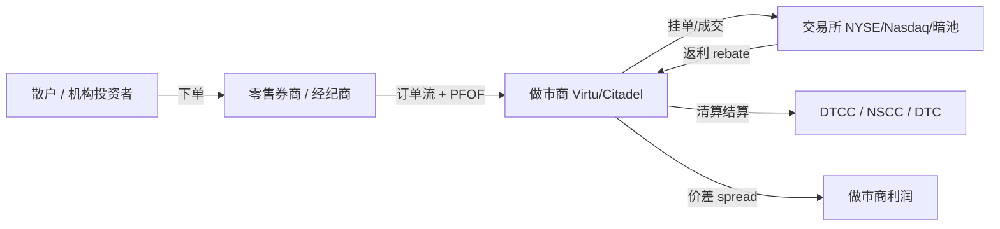
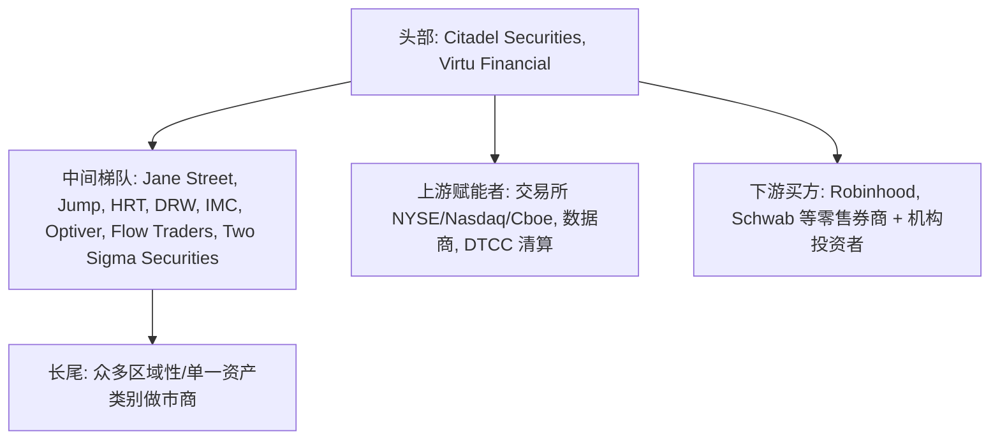
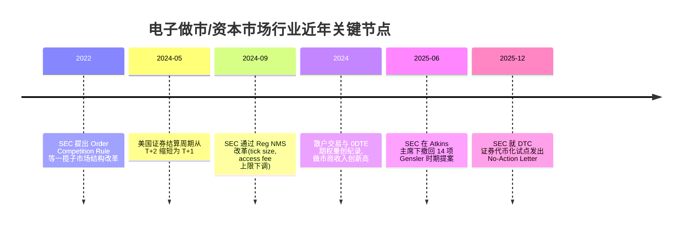

# 行业维度研究报告：电子做市 / 资本市场（Virtu Financial × Trading Operations Analyst）

生成日期：2026-07-03。本文只讲行业，不讲 Virtu 这家公司的具体财务与文化（那属于 Company 维度），也不讲这个岗位每天具体做什么、薪资多少（那属于 Role 与 Market 维度）。本文的最高原则是：只陈述事实，不做任何"值得/不值得""适合/不适合"的判断。学生现状是 Q1=B（已有方向但不确定），所以本文会对行业的顺风面和逆风面给予同等篇幅，把牛市逻辑和熊市逻辑都摆出来，让判断权留给读者。

## 1. 一句话定位与一个类比

先用大白话说清楚这个行业到底是什么。想象一个巨大的二手车市场，市场里永远站着几个"车贩子"：你想卖车，他立刻按一个价（bid，买入报价）从你手里收；别人想买车，他立刻按一个略高的价（ask，卖出报价）卖出去。他不赌某辆车会涨会跌，他赚的是每一笔买进卖出之间那一点点差价，靠的是"量大"。把二手车换成股票、期权、债券、外汇、加密货币，把车贩子换成用超低延迟计算机系统报价的公司，这就是电子做市（electronic market making，用自动化系统在买卖两端同时报价、为市场提供流动性并赚取价差的业务）。

这个行业属于一级行业"资本市场 / 证券交易与经纪（capital markets / securities trading & brokerage）"，细分赛道是"电子做市 / 自营与量化交易 / 流动性提供"。Virtu Financial 就是这个赛道里的上市公司之一，它在 36 个国家、235 个以上交易场所、19,000 多种证券上提供流动性。

一个学生更熟悉的类比：这个行业很像"高频、低毛利、拼技术基础设施"的电商物流仓储环节，而不是拼品牌营销的消费品公司。它不直接面向大众消费者做广告，而是嵌在金融市场的管道里，靠规模、速度和自动化在每一笔交易上抽取极薄的一层价值。它跟你可能听说过的"投行"（帮公司上市、并购）和"资产管理"（帮你炒股赚收益）是两回事，下一节会区分。

## 2. 这个行业到底卖什么，边界在哪里

这一节说清楚这个行业卖的是什么、和哪些容易混淆的行业不同。做市商卖的不是某只股票会涨会跌的判断，卖的是"流动性（liquidity，市场上随时能以合理价格买到或卖出资产的能力）"这项服务。它承诺：任何时候你想交易，我都在另一边接单，代价是你付出一点点买卖价差。它的核心资产是三样东西，技术系统（超低延迟的下单、风控、定价软件与硬件）、资本（用来临时持有大量证券库存的自有资金）、以及一套定量模型。

做市商（market maker）是"报出买价和卖价、持有库存、赚取买卖价差"的机构 [14 - Market maker - Wikipedia](https://en.wikipedia.org/wiki/Market_maker)。它的利润主要来自两部分：一是捕获买卖价差（bid-ask spread），二是从交易所拿到的流动性回扣（rebate，交易所为了鼓励机构挂单提供流动性而支付的返利）[14 - Market maker - Wikipedia](https://en.wikipedia.org/wiki/Market_maker)。

行业的边界需要和三个相邻概念区分开。第一，做市商不是投资银行（investment bank）。投行帮企业发行股票、发债、做并购顾问，赚的是承销费和顾问费；做市商赚的是交易价差。第二，做市商不是对冲基金（hedge fund）或多数自营方向性交易，后者靠"押对方向"赚钱，而纯做市理论上对市场涨跌保持中性，靠"两边都接、赚价差"赚钱。第三，做市商不是零售券商（retail broker，如 Robinhood、Charles Schwab），零售券商是面向散户的账户入口，做市商站在券商背后真正执行成交。事实上二者高度绑定：散户在 Robinhood 下的单，很大比例被路由给 Virtu、Citadel Securities 这样的批发做市商（wholesaler）去成交。

需要说明的是，Virtu 这类公司往往横跨两块业务：一块是自有资本做市（Market Making），另一块是代理执行服务（agency execution / Execution Services，用技术帮机构客户把大单拆分、寻找最优价格成交，收取佣金而不承担库存风险）。前者赚价差，后者赚服务费，二者的盈利逻辑不同，但共用同一套技术底座。

中英文语境的命名差异值得一提。中文里常把这一大类笼统叫"量化交易"或"高频交易（HFT）"，但英文行业内部会细分为 market making（做市）、proprietary trading（自营）、agency execution（代理执行）、liquidity provision（流动性提供）等，含义并不完全等同。本文统一用"电子做市"指代 Virtu 所处的核心赛道。

## 3. 钱怎么流动：做市商的盈利逻辑

这一节讲这个行业的钱到底从谁的口袋来、以什么方式来。最终付钱的是所有参与交易的人：散户、机构投资者、其他交易方，每个人在买卖时付出的那一点点价差，累加起来就是做市商的收入。因为单笔价差极薄，所以整个模式的命脉是"成交量"和"波动率"。成交量越大、市场波动越剧烈，做市机会越多，收入越高。

收入来源可以拆成三条主线。第一条是价差本身。做市商用低于市场的价买入、高于市场的价卖出，这个差在正常大盘股上可能只有几分之一美分，但一天成交上百亿股，规模效应就出来了。SIFMA 数据显示，2024 年美国股票市场日均成交量达到 122 亿股，同比增长 24% [25 - Top 10 Takeaways from SIFMA's 2024 Capital Markets Fact Book](https://www.sifma.org/resources/news/blog/top-10-takeaways-from-sifmas-2024-capital-markets-fact-book/)。

第二条是交易所回扣。很多交易所采用"maker-taker"定价：挂单提供流动性的一方（maker）拿返利，吃单消耗流动性的一方（taker）付费。做市商靠海量挂单赚取这层返利 [14 - Market maker - Wikipedia](https://en.wikipedia.org/wiki/Market_maker)。

第三条，也是最有争议的一条，是 payment for order flow（PFOF，做市商为换取散户订单流而付给零售券商的费用）。散户在零售券商"免佣金"下单，券商把订单卖给批发做市商，做市商在自己的库存里成交（internalization，内部化），并把一部分收益作为 PFOF 返给券商 [2 - Payment for Order Flow: The SEC Proposes Reforms | Congress.gov](https://www.congress.gov/crs-product/IF12332)。零售散户订单被认为"信息含量低、风险小"，是做市商最优质的收入来源之一。据 SEC 与业界数据，前三大批发做市商 Citadel Securities、Virtu Financial 和 G1 Execution Services 合计处理了美国 80% 以上的散户股票订单 [4 - Payment for Order Flow (PFOF): Definition and How It Works](https://www.sofi.com/learn/content/payment-for-order-flow/)。作为具体量级参照，Robinhood 的 SEC 文件显示，2024 年第二季度 Virtu Americas 接收了 Robinhood 非定向订单流的约 60.86% [41 - Robinhood Markets, Inc. Form 8-K FY2024](https://www.sec.gov/Archives/edgar/data/0001783879/000178387924000125/a606-crfnx2024q1xfinal.htm)。

价值链上利润的分布可以用下面的图示意。上游是交易所、数据供应商与清算机构（它们向做市商收取交易费和数据费），中游是做市商（赚价差与回扣），下游是零售券商与机构投资者（把订单交给做市商执行）。

这个模式有没有护城河（moat，让竞争者难以进入或超越的结构性壁垒）？有几层。一是技术与延迟壁垒，把成交速度做到微秒级需要多年工程积累与巨额基础设施投入；二是规模效应，成交量越大、单笔成本越低、越能报出更窄的价差，进而吸引更多订单，形成正循环；三是资本壁垒，持有海量库存并承担风险需要雄厚自有资金。但这些护城河并非绝对，价差被行业竞争持续压薄，市场平静、波动率低的年份收入会明显收缩，这是这个行业最核心的周期性风险，下文会展开。

## 4. 行业规模与增长

这一节用数字回答"这个行业到底多大、长得多快"。需要先分清两个尺度：一个是它嵌入的整个资本市场有多大（决定了流动性需求的天花板），另一个是"电子/算法交易"这项具体业务本身有多大。

从整个资本市场看，美国是全球最大的资本市场。SIFMA 2024 年数据显示，美国股票市值 49.0 万亿美元，占全球股票总市值 115.0 万亿美元的 42.6%，是第二大市场（欧盟）的 3.9 倍；美国固定收益市场规模 55.3 万亿美元，占全球 39.3% [25 - Top 10 Takeaways from SIFMA's 2024 Capital Markets Fact Book](https://www.sifma.org/resources/news/blog/top-10-takeaways-from-sifmas-2024-capital-markets-fact-book/)。整个美国证券业 2024 年就业约 1,135,500 人，同比增长 1.6% [25 - Top 10 Takeaways from SIFMA's 2024 Capital Markets Fact Book](https://www.sifma.org/resources/news/blog/top-10-takeaways-from-sifmas-2024-capital-markets-fact-book/)。这说明做市商所处的"母体市场"庞大、成熟且流动性极深。

从具体业务尺度看，需要区分几个口径，因为不同研究机构的"行业边界"不一致，这一点在引用市场规模时必须谨慎。Grand View Research 估算，全球算法交易（algorithmic trading，用计算机程序按预设规则自动下单的交易方式）市场 2024 年约 210.6 亿美元，预计到 2030 年达到 429.9 亿美元，2025-2030 年 CAGR（compound annual growth rate，复合年增长率）约 12.9%，其中北美占 2024 年收入的 33.6% [40 - Algorithmic Trading Market Size, Share, Growth Report, 2030](https://www.grandviewresearch.com/industry-analysis/algorithmic-trading-market-report)。另有研究给出 16.7% 与 13.2% 的 CAGR 区间，口径差异较大 [40 - Algorithmic Trading Market Size, Share, Growth Report, 2030](https://www.grandviewresearch.com/industry-analysis/algorithmic-trading-market-report)。取这些独立来源的中位数，行业年增速大致落在 13% 上下。需要提醒的是，这类"市场规模"数字统计的是交易软件与技术解决方案的市场，而非做市商的交易收入本身，两者不是一回事。

更贴近做市商收入的口径是高频交易收入。有行业教育机构援引数据称，2024 年高频交易算法产生了约 104 亿美元收入，预计到 2030 年增至约 160 亿美元 [20 - State of Algorithmic Trading Education 2025](https://www.quantinsti.com/articles/state-of-algorithmic-trading-education-2025/)。此外，围绕交易所生态的"美国资本市场交易所生态系统"被 Mordor Intelligence 估算 2025 年约 6,166.5 亿美元，到 2030 年约 8,466.5 亿美元，CAGR 约 6.54% [26 - US Capital Exchange Ecosystem Market Size & Share Analysis](https://www.mordorintelligence.com/industry-reports/us-capital-market-exchange-ecosystem)。

把这些数字放在一起看：母体资本市场巨大而低速增长（个位数），而"电子化/算法化"这一具体技术趋势的渗透仍在两位数增长，说明行业增长主要来自"存量交易向电子化、自动化迁移"，而不是市场本身在爆发式扩张。

## 5. 竞争格局与玩家分层

这一节回答"这个行业里都有谁、谁大谁小、Virtu 站在哪"。这个赛道的特点是玩家数量不多、集中度高、且多数是私人公司（不上市），因此外部很难看到完整财务，Virtu 作为少数上市公司反而是行业里透明度最高的样本之一。

头部梯队（top tier，3 到 5 家）是 Citadel Securities 和 Virtu Financial。多份行业梳理把 Citadel Securities 列为最大的做市商，Virtu 列第二，Virtu 约占美国股票交易量的 20% [11 - Top 10 Largest Market Makers: Global Liquidity Leaders](https://turnkeyinside.com/top-10-largest-market-makers/)。Citadel Securities 被称处理约 25% 的美国股票、并在超过 4,000 只美股期权上做市、覆盖 99% 的期权成交量，同时是纽交所最大的指定做市商（DMM）[29 - Citadel Secures $1.15B Investment, Increasing Its Valuation to $22B](https://www.builtinchicago.org/articles/citadel-1b-funding-22b-valuation)。值得注意的是，在纽交所现场，指定做市商已从当年的数百家萎缩到如今只剩四家：Citadel、Global Trading Systems、IMC Financial Markets 和 Virtu [13 - Potential Virtu, KCG merger could create high-frequency trading powerhouse | S&P Global](https://www.spglobal.com/marketintelligence/en/news-insights/trending/mu-wzqzozctw1eygxrwtba2)。

中间梯队（middle tier）是一批实力强劲但各有侧重的私人公司：Jane Street（ETF 与固定收益强项）、Jump Trading（微波网络与 FPGA 硬件、延迟约 90 微秒）、Hudson River Trading（高频与中频混合、约 15% 美股份额）、DRW（跨资产、含加密货币与碳信用）、IMC Financial Markets、Two Sigma Securities、Optiver、Flow Traders 等 [10 - What is Competitive Landscape of Virtu Financial Company?](https://portersfiveforce.com/blogs/competitors/virtu)。这些公司大多不上市，规模却极大。Jane Street 2025 年交易收入达 396 亿美元，超过摩根大通，其单季（2025 年某季度）交易收入约 103 亿美元，仅约 3,000 名员工 [32 - Jane Street Made $10.3 Billion Last Quarter - More Than Goldman](https://fourweekmba.com/jane-street-ai-wall-street-10-billion-quarter/)。

集中度方面，前三大批发做市商合计处理 80% 以上的美国散户股票订单 [4 - Payment for Order Flow (PFOF): Definition and How It Works](https://www.sofi.com/learn/content/payment-for-order-flow/)。这是一个 CR3（前三名合计份额）极高的市场，属于典型的寡头结构。

估值水位可作参照（注意这些是私人公司最近一次可见的定价，未必代表当前）。Citadel Securities 在 2022 年 1 月从 Sequoia Capital 和 Paradigm 融资 11.5 亿美元，估值 220 亿美元 [29 - Citadel Secures $1.15B Investment, Increasing Its Valuation to $22B](https://www.builtinchicago.org/articles/citadel-1b-funding-22b-valuation)。这些做市商还在把利润投向外部：2025 年 11 月，Citadel Securities 与 Fortress 领投 Ripple 5 亿美元、后者估值 400 亿美元 [30 - Ripple Announces $500 Million Strategic Investment Led by Fortress and Citadel Securities](https://ripple.com/ripple-press/ripple-announces-500-million-strategic-investment-led-by-fortress-citadel-securities-valuing-the-company-at-40-billion-following-record-growth/)；Jane Street 建起了约 200 亿美元的私人投资组合，锚定其对 Anthropic 的持股 [31 - Jane Street's private company portfolio reaches $20B](https://cryptobriefing.com/jane-street-private-portfolio-20-billion/)。

用图表示玩家分层如下。

Virtu 在这个结构里的位置：它是头部两强之一、且是其中唯一的上市公司（NASDAQ: VIRT），与最大玩家 Citadel Securities 的差距主要体现在规模与私有资本的灵活度上。

## 6. 行业历史与过去五年关键事件

这一节讲这个行业从哪来、过去几年发生了什么大事。电子做市这个形态是"市场从人工喊价转向电子撮合"的产物。Virtu 本身的诞生就是一个缩影：2008 年 4 月由 Vincent Viola（前纽约商品交易所主席）和 Douglas Cifu 创立，抓住的正是交易从"交易池喊价"转向"电子场所"的窗口，走的是高成交量、低毛利、技术优先的路线 [38 - Virtu Financial - Wikipedia](https://en.wikipedia.org/wiki/Virtu_Financial)。2015 年 4 月 16 日 Virtu 上市，IPO 募资约 3.36 亿美元、估值约 26 亿美元，其招股书里"1,238 个交易日里只有 1 天净亏损"的披露一度成为行业标志性事件 [38 - Virtu Financial - Wikipedia](https://en.wikipedia.org/wiki/Virtu_Financial)。

更早的行业周期也值得记住。2010 年代中期，高频交易行业曾因波动率低迷、数据成本上升、竞争加剧而利润承压，触发一波并购整合 [13 - Potential Virtu, KCG merger could create high-frequency trading powerhouse | S&P Global](https://www.spglobal.com/marketintelligence/en/news-insights/trending/mu-wzqzozctw1eygxrwtba2)。2017 年 4 月，Virtu 以每股 20 美元、约 14 亿美元收购竞争对手 KCG Holdings（KCG 本身是 2012 年 Knight Capital 与 Getco 合并而来）[12 - Trading firm Virtu Financial to buy KCG for about $1.4 billion](https://www.cnbc.com/2017/04/20/two-high-speed-trading-firms-merge-in-1-4-billion-deal.html)。这段历史直接说明了行业的周期性：平静市场会挤压利润、逼出整合。

过去五年的关键事件按时间线大致如下。

逐项来看。2024 年 5 月 28 日，美国证券结算周期从 T+2 缩短为 T+1（trade date 后一个工作日完成交割）[7 - T+1 Settlement Cycle to Take Effect on May 28, 2024 | White & Case](https://www.whitecase.com/insight-alert/t1-settlement-cycle-take-effect-may-28-2024)。2024 年 9 月 18 日，SEC 通过 Reg NMS（Regulation National Market System，规范美国全国市场系统的核心监管框架）改革，新增 0.005 美元的最小报价单位（tick size），并把 Rule 610 的接入费上限从每股 0.003 美元下调到 0.001 美元 [5 - SEC Adopts Rules to Amend Minimum Pricing Increments and Access Fee Caps](https://www.sec.gov/newsroom/press-releases/2024-137)。2024 年散户交易与 0DTE（zero days to expiration，当日到期期权）需求激增，把做市商收入推向历史高位，两大衍生品做市商 Jane Street 与 Citadel Securities 上半年合计收入约 302 亿美元，同比增长约 80% [1 - Citadel Securities, Jane Street on Track for Record Revenue Haul - Bloomberg](https://www.bloomberg.com/news/articles/2024-09-03/citadel-securities-jane-street-on-track-for-record-revenue-haul)。

头部座次过去五年没有发生颠覆性重排，Citadel Securities 与 Virtu 稳居前二，但收入体量随波动率和成交量剧烈起伏。2025 年市场竞争进一步加剧，Citadel Securities 与 Jane Street 交易收入仍在创纪录轨道上，同时开始侵蚀传统华尔街银行的交易份额 [33 - Citadel Securities on Track for Record Trading Revenue - Bloomberg](https://www.bloomberg.com/news/articles/2025-12-01/citadel-securities-trading-revenue-jumps-9-amid-competition)。

## 7. 生命周期阶段

这一节判断行业处在"新兴、成长、成熟、衰退"哪个阶段，并给出依据，而不是凭感觉。判断需要三个变量：市场规模、增速、头部集中度。

从规模看，这是一个嵌在数十万亿美元资本市场里的巨大行业，母体成熟。从增速看，具体的算法交易技术市场以约 13% 的 CAGR 增长 [40 - Algorithmic Trading Market Size, Share, Growth Report, 2030](https://www.grandviewresearch.com/industry-analysis/algorithmic-trading-market-report)，而交易所生态系统以约 6.5% 增长 [26 - US Capital Exchange Ecosystem Market Size & Share Analysis](https://www.mordorintelligence.com/industry-reports/us-capital-market-exchange-ecosystem)。从集中度看，前三大批发做市商占散户订单 80% 以上，头部格局锁定、新进入者极少 [4 - Payment for Order Flow (PFOF): Definition and How It Works](https://www.sofi.com/learn/content/payment-for-order-flow/)。

综合这三点，按 Gartner 式的生命周期划分标准（成熟期特征为市场大、增速 5%-15%、头部锁定、新进入者少），电子做市/资本市场交易行业整体处在成熟期（mature），但内部存在若干仍在高速增长的子赛道，包括加密货币做市、0DTE 期权做市、以及交易向 AI/自动化迁移的技术层。换句话说，这是一个"母体成熟、局部仍有成长口"的行业。它已经经历过繁荣与萧条的完整周期（2010 年代中期的低波动率萧条与随后的整合，以及 2020-2024 年散户潮带来的繁荣），并非没有周期的行业。

## 8. 监管环境：这个行业最大的外生变量

这一节单独讲监管，因为对做市商而言，监管是仅次于市场波动率的第二大外生变量，且方向直接影响盈利模式。用大白话说，做市商赚钱的两条关键管道（PFOF 与价差）恰恰是监管者最想动的地方，所以这个行业永远在和 SEC（Securities and Exchange Commission，美国证券交易委员会）博弈。

第一条战线是 PFOF。批发商用 PFOF 换取散户订单流的模式长期被批评存在利益冲突。2022 年 12 月，时任 SEC 主席 Gensler 推出一揽子市场结构改革，其中 Order Competition Rule（订单竞争规则）拟要求把散户订单在内部成交前先送入"合格拍卖"竞价，直接冲击批发商的内部化利润 [36 - SEC Proposes Rule to Enhance Competition for Individual Investor Order Execution](https://www.sec.gov/newsroom/press-releases/2022-225)。但风向在 2025 年逆转。2025 年 6 月 12 日，SEC 在新主席 Paul Atkins 领导下正式撤回了包括 Order Competition Rule 在内的 14 项 Gensler 时期提案 [35 - A Deep Dive Into 14 Nixed Gensler-Era SEC Rule Proposals | Dechert](https://www.dechert.com/knowledge/publication/2025/7/a-deep-dive-into-14-nixed-gensler-era-sec-rule-proposals.html)[37 - SEC Order Competition Rule withdrawal](https://www.sec.gov/rules-regulations/2025/06/order-competition-rule)。此外，2024 年针对 PFOF 出台的执行质量披露新规（Rule 605 相关）后来也在 Atkins 任内被撤回，作为放松市场结构监管的一部分 [2 - Payment for Order Flow: The SEC Proposes Reforms | Congress.gov](https://www.congress.gov/crs-product/IF12332)。对做市商而言，这一轮监管态度从"收紧"转向"放松"，短期是顺风。

第二条战线是 Reg NMS 改革，方向偏中性偏逆风。2024 年 9 月通过的新规下调了最小报价单位与接入费上限：tick size 新增 0.005 美元档，Rule 610 接入费上限从每股 0.003 美元砍到 0.001 美元 [5 - SEC Adopts Rules to Amend Minimum Pricing Increments and Access Fee Caps](https://www.sec.gov/newsroom/press-releases/2024-137)。更窄的 tick size 会压缩做市商可捕获的价差空间，接入费与返利下调也直接影响做市商靠回扣赚钱的那条管道，这对利润是结构性挤压。这些规则的合规日期主要落在 2025 年 11 月，odd-lot 信息定义则到 2026 年 5 月 [6 - SEC Adopts New Regulation NMS Rules on Tick Sizes, Access Fees, and Market Data | WilmerHale](https://www.wilmerhale.com/en/insights/client-alerts/20240923-sec-adopts-new-regulation-nms-rules-on-tick-sizes-access-fees-and-market-data)。2025 年 10 月，华盛顿特区巡回法院维持了该 tick size/费用上限规则，但其最终命运仍存不确定性 [6 - SEC Adopts New Regulation NMS Rules | WilmerHale](https://www.wilmerhale.com/en/insights/client-alerts/20240923-sec-adopts-new-regulation-nms-rules-on-tick-sizes-access-fees-and-market-data)。

第三条战线是结算改革 T+1，对做市商偏中性、但对交易运营（Trading Operations）这条职能线影响巨大。2024 年 5 月 28 日起，美国证券结算从 T+2 压缩到 T+1，交易执行到最终交割之间的时间被砍掉一半 [7 - T+1 Settlement Cycle | White & Case](https://www.whitecase.com/insight-alert/t1-settlement-cycle-take-effect-may-28-2024)。监管机构 OCC 要求各机构在 2024 年 5 月 28 日合规日前做好准备 [8 - Securities Operations: Shortening the Standard Settlement Cycle | OCC](https://www.occ.gov/news-issuances/bulletins/2024/bulletin-2024-3.html)。压缩的时间窗意味着对账、确认、交割必须更快、更自动化，任何错过截止时间的交易都会触发半自动或人工流程，降低直通处理率（STP，straight-through processing，交易全流程无人工干预自动完成）并推高单笔成本 [9 - How T+1 settlement will impact 4 key operational processes | AutoRek](https://www.autorek.com/how-t1-settlement-will-impact-4-key-operational-processes/)。这直接抬升了对交易运营与流程自动化人才的需求，也解释了为什么这类岗位强调 SQL、Python 和自动化能力。

## 9. Trading Operations 在行业价值链中的位置

这一节从行业视角说明"交易运营"这条职能线在整个市场管道里处于什么位置，不涉及具体岗位职责（那属于 Role 维度）。做市商每天在几十个市场成交海量交易，但"成交"只是开始，成交之后每一笔都要经过清算（clearance，核对并轧差买卖双方的应收应付）、结算（settlement，实际完成资金与证券的交割）、对账（reconciliation，核对本方记录与清算机构记录是否一致）。这套中后台流程就是交易运营的战场，它是让交易真正"落地"的管道，一旦断裂，交易就无法完成或产生风险敞口。

美国这套管道的中枢是 DTCC（Depository Trust & Clearing Corporation，存托与清算公司）。它旗下的 NSCC（National Securities Clearing Corporation）自 1976 年起充当几乎所有券商间股票、公司债、市政债、ETF 交易的中央对手方（CCP，central counterparty，插在买卖双方之间、对每一笔交易做担保的机构），DTC 则作为中央证券存管机构以电子簿记形式持有证券并提供结算 [23 - A Guide to Clearance & Settlement | DTCC](https://www.dtcc.com/clearance-settlement-guide/index.html)。清算的核心机制是 CCP"成为每个卖家的买家、每个买家的卖家"，从而消除对手方违约风险 [23 - A Guide to Clearance & Settlement | DTCC](https://www.dtcc.com/clearance-settlement-guide/index.html)。

对账是这条线里最日常、也最依赖自动化的环节。它通常是一种回溯性控制，用来确认前一日交易是否被准确处理，任何本方活动与持仓与 DTC 报表之间的差异都必须由参与方立即上报并尽快解决 [23 - A Guide to Clearance & Settlement | DTCC](https://www.dtcc.com/clearance-settlement-guide/index.html)。整个交易生命周期从下单、执行、确认、清算到结算是一条链，中后台负责其中"成交之后"的所有环节 [24 - Trade Life Cycle in Investment Banking and Its Stages | IBCA](https://www.investmentbankingcouncil.org/blog/trade-life-cycle-in-investment-banking-and-its-stages)。T+1 改革之后，这条链的时间预算被大幅压缩，自动化对账成为满足压缩时限、同时保持准确性的关键 [9 - How T+1 settlement will impact 4 key operational processes | AutoRek](https://www.autorek.com/how-t1-settlement-will-impact-4-key-operational-processes/)。这解释了为什么行业内这条职能线正从"人工核对"向"用 SQL/Python 做流程自动化"迁移。

## 10. 未来 3-5 年的关键变量

这一节把未来几年会左右这个行业走向的主要变量逐一摆出来，每个变量标注对行业是顺风、逆风还是中性，并附来源。由于学生 Q1=B，这里对顺风与逆风给予同等篇幅。

变量一，AI 与自动化，判定为顺风为主、但会重塑内部分工。有行业数据称 AI 已驱动美国超过 70% 的股票交易，2024 年高频交易算法产生约 104 亿美元收入、预计 2030 年增至约 160 亿美元 [20 - State of Algorithmic Trading Education 2025](https://www.quantinsti.com/articles/state-of-algorithmic-trading-education-2025/)。业界主流观点是"AI 增强而非取代"人：最聪明的公司把 AI 当成副驾驶，执行层极致高效，但策略仍在人的掌控下 [19 - The Rise of Algorithmic Trading: How AI Is Reshaping Financial Markets | Forbes](https://www.forbes.com/sites/delltechnologies/2025/12/02/the-rise-of-algorithmic-trading-how-ai-is-reshaping-financial-markets/)。对做市这个天生就靠算法的行业，AI 是核心竞争力的延伸而非颠覆者，但它会持续把中后台的人工环节自动化掉，这对纯人工操作岗是逆风、对懂自动化的岗位是顺风。

变量二，监管，判定为短期顺风、中长期不确定。如前所述，2025 年 SEC 在 Atkins 主席下撤回 Order Competition Rule 等一揽子提案，PFOF 与内部化模式短期压力解除 [35 - A Deep Dive Into 14 Nixed Gensler-Era SEC Rule Proposals | Dechert](https://www.dechert.com/knowledge/publication/2025/7/a-deep-dive-into-14-nixed-gensler-era-sec-rule-proposals.html)。但监管钟摆会随政治周期摆动，PFOF 的争议并未消失，未来的政府换届可能重新收紧，这是行业头上长期悬着的尾部风险。同时 Reg NMS 的窄 tick size 与低接入费改革仍在压缩价差与回扣空间，属于持续的结构性逆风 [5 - SEC Adopts Rules to Amend Minimum Pricing Increments and Access Fee Caps](https://www.sec.gov/newsroom/press-releases/2024-137)。

变量三，周期性，判定为最大的内在风险。做市收入与成交量、波动率高度正相关，量与波动又互相关联 [13 - S&P Global](https://www.spglobal.com/marketintelligence/en/news-insights/trending/mu-wzqzozctw1eygxrwtba2)。2020-2024 年的高波动、散户潮、0DTE 爆发把行业推向历史高位（Virtu 2025 年交易收入同比增长 33.7% 至 24.367 亿美元 [17 - Virtu Financial Reports Strong Fourth Quarter and Full Year 2025 Results](https://www.quiverquant.com/news/Virtu+Financial,+Inc.+Reports+Strong+Fourth+Quarter+and+Full+Year+2025+Financial+Results)），但历史证明，一旦进入低波动率的平静市场，利润会迅速收缩，甚至触发整合，正如 2010 年代中期发生的那样 [13 - S&P Global](https://www.spglobal.com/marketintelligence/en/news-insights/trending/mu-wzqzozctw1eygxrwtba2)。当前行业处在周期高位，这是判断未来走向时最需要警惕的逆风信号。

变量四，替代技术与市场结构变化，判定为顺风（新赛道）叠加中性（既有价差被压）。0DTE 期权在 2025 年占美国上市期权总量的 24.1%（2024 年为 21.5%，几乎是 2022 年份额的两倍），日均约 1,400 万张、同比增长 41%，散户约占 SPX 0DTE 成交的 53%-54% [21 - VOL REPORT: 0DTE, FLEX Options Are 2025 Heroes | Traders Magazine](https://www.tradersmagazine.com/vol-report/vol-report-0dte-flex-options-are-2025-heroes/)[22 - How retail traders drive record options volumes | Fintech Global](https://fintech.global/2025/10/23/how-retail-traders-drive-record-options-volumes/)。这类高频、短久期的新产品为做市商开辟了新的量与新的价差来源。

变量五，加密货币与代币化，判定为高不确定性的高影响变量。DTCC 于 2025 年 12 月 11 日获得 SEC 的 No-Action Letter，启动一个为期三年的证券代币化试点，覆盖 Russell 1000 股票、主要指数 ETF 与美国国债 [27 - How DTCC tokenization actually works | Ledger Insights](https://www.ledgerinsights.com/how-dtcc-tokenization-actually-works/)。代币化的一个核心承诺是把结算推向 T+0 甚至链上原子结算（atomic settlement，资金与资产同时、瞬时交割），并支持 7×24 交易 [27 - How DTCC tokenization actually works | Ledger Insights](https://www.ledgerinsights.com/how-dtcc-tokenization-actually-works/)。DTCC 计划 2026 年 7 月开始有限量生产交易、10 月更广泛推出，并已宣布与 Stellar 区块链集成 [28 - DTCC Advances Development of New Tokenization Service](https://www.dtcc.com/news/2026/may/04/dtcc-advances-development-of-new-tokenization-service)。这既是做市新机会（新资产类别需要流动性），也可能重构清算结算这条价值链本身。

变量六，资本环境，判定为顺风。做市商盈利丰厚且现金流强，头部公司不仅不缺钱，还在把利润投向外部投资（Citadel Securities 参与 Ripple 40 亿美元估值轮 [30 - Ripple $40B round](https://ripple.com/ripple-press/ripple-announces-500-million-strategic-investment-led-by-fortress-citadel-securities-valuing-the-company-at-40-billion-following-record-growth/)，Jane Street 建起约 200 亿美元私人组合 [31 - Jane Street's private portfolio reaches $20B](https://cryptobriefing.com/jane-street-private-portfolio-20-billion/)）。这个行业不依赖外部融资续命，抗资本寒冬能力强。

变量七，人才供给，判定为偏紧张。这个行业对定量与工程人才需求持续旺盛，头部公司在争夺同一批量化研究、软件工程、机器学习人才，形成"AI 军备竞赛"式的用人竞争 [39 - What Is a Quant? Types of Quant Graduate Roles and Career Paths | QuantInsti](https://www.quantinsti.com/articles/quant-roles/)。

## 11. 五年后行业最可能的样子

这一节把上面的变量收敛成一个对五年后的整体判断，并标注置信度。预测本身有不确定性，以下每条都附置信标签。

第一，头部格局大概率延续而非重排（置信度 high）。多份独立来源都显示 Citadel Securities 与 Virtu 稳居前二、且过去五年座次未被颠覆，新进入者被技术、资本、规模三重壁垒挡在门外 [11 - Top 10 Largest Market Makers](https://turnkeyinside.com/top-10-largest-market-makers/)[13 - S&P Global](https://www.spglobal.com/marketintelligence/en/news-insights/trending/mu-wzqzozctw1eygxrwtba2)。更可能的变化是头部继续向传统银行的交易业务扩张，蚕食华尔街份额 [33 - Citadel Securities on Track for Record Trading Revenue - Bloomberg](https://www.bloomberg.com/news/articles/2025-12-01/citadel-securities-trading-revenue-jumps-9-amid-competition)。

第二，业务模式向"更多资产类别 + 更多自动化"演进（置信度 high）。做市商正从股票扩张到固定收益、期权、外汇、大宗商品、加密货币，Virtu 的做市段本就横跨全球股票、固收、货币、加密与商品。AI 会继续渗透信号研究与执行优化 [19 - Forbes](https://www.forbes.com/sites/delltechnologies/2025/12/02/the-rise-of-algorithmic-trading-how-ai-is-reshaping-financial-markets/)，中后台运营会继续自动化。

第三，结算与清算这条价值链可能被代币化改写（置信度 medium）。DTCC 的三年试点若成功，2026-2029 年可能出现 T+0/原子结算与 7×24 交易的局部落地 [27 - Ledger Insights](https://www.ledgerinsights.com/how-dtcc-tokenization-actually-works/)[28 - DTCC tokenization news](https://www.dtcc.com/news/2026/may/04/dtcc-advances-development-of-new-tokenization-service)。但监管、法律互操作性与行业协调都是变数，全面落地时间高度不确定，因此置信度只能给 medium。

第四，行业收入大概率经历一次周期回落（置信度 medium）。当前收入处在由高波动率与散户潮驱动的历史高位，历史规律显示波动率终将回归常态，届时价差与成交机会收缩、利润下滑。这一判断方向明确，但具体时点无法预测，因此 medium。

第五，一个低概率高影响的尾部情景是监管重新收紧 PFOF（置信度 low）。2025 年的放松是政治周期的产物，若未来政府换届重新推动 Order Competition Rule 一类改革，散户内部化这条利润管道可能被削弱 [35 - Dechert](https://www.dechert.com/knowledge/publication/2025/7/a-deep-dive-into-14-nixed-gensler-era-sec-rule-proposals.html)。这属于概率不高但一旦发生冲击很大的情景。

综合以上，基于现有预测，五年后这个行业最可能出现的图景是：头部两强格局延续并继续侵蚀传统银行交易份额；做市覆盖的资产类别更广、内部流程更自动化；清算结算链在代币化推动下向更快结算演进；行业收入在经历当前高位后大概率回落一轮；而 PFOF 的监管命运随政治周期摆动，构成长期悬顶的不确定性。

## 12. 进入这个行业意味着什么（客观描述，不做建议）

这一节客观描述这个行业当前处于什么阶段、里面的人是什么背景、多年后一般去哪，不做任何"适不适合"的判断。

行业当前处于"运营成熟期"而非"基础设施初建期"。电子做市的核心基础设施（交易所电子化、DTCC 清算体系、低延迟网络）早已建成，行业更多是在成熟管道上做效率优化、资产类别扩张和自动化升级。这与二十年前"把交易从交易池搬上电脑"的建设期不同。当前的增量主要来自 AI/自动化对既有流程的改造、以及加密与代币化等新资产类别。

行业里人的背景总体偏技术与定量。量化交易公司普遍要求应用数学、工程、统计建模、计算机科学、物理等定量学科背景，强编程能力（Python、C++、R）是标配 [39 - What Is a Quant? | QuantInsti](https://www.quantinsti.com/articles/quant-roles/)。这也解释了为什么这类公司（包括中后台运营岗）常用 HackerRank 之类的编程测试筛选、并强调 SQL/Python，即便岗位标注"无需金融经验"。行业整体偏"技术驱动的私人公司/上市自营公司"，而非"大型稳态官僚机构"，多数头部玩家是不上市的合伙制或私人公司，Virtu 是少数上市样本。

行业内的人五到十年后的去向存在几条典型路径（此处仅客观描述行业普遍现象，个体差异大）：在头部做市/自营公司内部沿技术或交易线晋升；横向流动到其他做市商、对冲基金或交易科技公司；或进入交易所、清算机构、金融科技创业公司。由于头部公司薪酬丰厚且高度依赖技术人才，行业内的人才流动更多发生在同类公司之间，而非流出到传统银行。需要强调，具体到某个岗位的晋升路径与出口，属于 Role 与 Market 维度，本文不展开。

## 13. 无法验证的事项

以下是本轮研究中未能用可靠公开来源确认的关键点，列出以便后续补充。

第一，Virtu 精确的美国股票成交量份额与散户订单份额的当期数字无法从独立权威来源精确验证。二手来源给出"约 20% 美股成交量"[11 - Top 10 Largest Market Makers](https://turnkeyinside.com/top-10-largest-market-makers/)，但缺乏官方口径；SEC 的 10-K 原文因 sec.gov 对本工具返回 403 无法直接抓取，只能依赖转述来源 [15 - Virtu Financial's Total Revenues Rose 25.4% in 2024 | Markets Media](https://www.marketsmedia.com/virtu-financials-total-revenues-rose-25-4-in-2024/)。

第二，Citadel Securities 与 Jane Street 的最新（2025 年）自身估值无法确认。可查到的 Citadel Securities 估值仍是 2022 年的 220 亿美元 [29 - Built In Chicago](https://www.builtinchicago.org/articles/citadel-1b-funding-22b-valuation)；关于 2025 年更高估值的二级市场传闻未能在本轮找到权威确认。

第三，行业级别的整体"做市商总收入"缺乏统一权威口径。不同机构对"算法交易市场""高频交易收入""交易所生态系统"的边界定义不一致，数字从百亿到数千亿美元不等，本文已分别标注口径，但无法归并为单一 TAM 数字。

第四，暗池与内部化的精确占比来自非权威来源（约 44% off-exchange、其中暗池 ATS 约 15%-18%）[34 - Dark Pool Volume | TradeAlgo（匿名/非权威来源，谨慎参考）](https://www.tradealgo.com/trading-guides/tools/dark-pool-volume)，需要以 SEC 或 FINRA 官方数据进一步核实。

第五，AI"驱动 70% 美股交易""HFT 2024 年 104 亿美元收入"等数字来自行业教育机构转述 [20 - State of Algorithmic Trading Education 2025](https://www.quantinsti.com/articles/state-of-algorithmic-trading-education-2025/)，原始出处与统计口径未能追溯到一手研究，属于方向性参考。

## 附录：Sources

1. [Citadel Securities, Jane Street on Track for Record Revenue Haul - Bloomberg](https://www.bloomberg.com/news/articles/2024-09-03/citadel-securities-jane-street-on-track-for-record-revenue-haul)
2. [Payment for Order Flow: The SEC Proposes Reforms | Congress.gov CRS](https://www.congress.gov/crs-product/IF12332)
3. [How Does Payment for Order Flow Influence Markets? SEC DERA Working Paper](https://www.sec.gov/files/dera_wp_payment-order-flow-2501.pdf)
4. [Payment for Order Flow (PFOF): Definition and How It Works | SoFi](https://www.sofi.com/learn/content/payment-for-order-flow/)
5. [SEC Adopts Rules to Amend Minimum Pricing Increments and Access Fee Caps | SEC Press Release 2024-137](https://www.sec.gov/newsroom/press-releases/2024-137)
6. [SEC Adopts New Regulation NMS Rules on Tick Sizes, Access Fees, and Market Data | WilmerHale](https://www.wilmerhale.com/en/insights/client-alerts/20240923-sec-adopts-new-regulation-nms-rules-on-tick-sizes-access-fees-and-market-data)
7. [T+1 Settlement Cycle to Take Effect on May 28, 2024 | White & Case](https://www.whitecase.com/insight-alert/t1-settlement-cycle-take-effect-may-28-2024)
8. [Securities Operations: Shortening the Standard Settlement Cycle | OCC Bulletin 2024-3](https://www.occ.gov/news-issuances/bulletins/2024/bulletin-2024-3.html)
9. [How T+1 settlement will impact 4 key operational processes | AutoRek](https://www.autorek.com/how-t1-settlement-will-impact-4-key-operational-processes/)
10. [What is Competitive Landscape of Virtu Financial Company? | PortersFiveForce](https://portersfiveforce.com/blogs/competitors/virtu)
11. [Top 10 Largest Market Makers: Global Liquidity Leaders | Turnkey Inside](https://turnkeyinside.com/top-10-largest-market-makers/)
12. [Trading firm Virtu Financial to buy KCG for about $1.4 billion | CNBC](https://www.cnbc.com/2017/04/20/two-high-speed-trading-firms-merge-in-1-4-billion-deal.html)
13. [Potential Virtu, KCG merger could create high-frequency trading powerhouse | S&P Global Market Intelligence](https://www.spglobal.com/marketintelligence/en/news-insights/trending/mu-wzqzozctw1eygxrwtba2)
14. [Market maker - Wikipedia](https://en.wikipedia.org/wiki/Market_maker)
15. [Virtu Financial's Total Revenues Rose 25.4% in 2024 | Markets Media](https://www.marketsmedia.com/virtu-financials-total-revenues-rose-25-4-in-2024/)
16. [Virtu Financial's Adjusted Net Trading Income Jumps 34% | Finance Magnates](https://www.financemagnates.com/forex/virtu-financials-adjusted-net-trading-income-jumps-34-as-market-volatility-spurs-activity/)
17. [Virtu Financial Reports Strong Fourth Quarter and Full Year 2025 Financial Results | QuiverQuant](https://www.quiverquant.com/news/Virtu+Financial,+Inc.+Reports+Strong+Fourth+Quarter+and+Full+Year+2025+Financial+Results)
18. [Virtu Announces Fourth Quarter 2025 Results | Virtu IR](https://ir.virtu.com/news-releases/news-release-details/virtu-announces-fourth-quarter-2025-results)
19. [The Rise of Algorithmic Trading: How AI Is Reshaping Financial Markets | Forbes](https://www.forbes.com/sites/delltechnologies/2025/12/02/the-rise-of-algorithmic-trading-how-ai-is-reshaping-financial-markets/)
20. [State of Algorithmic Trading Education 2025 | QuantInsti](https://www.quantinsti.com/articles/state-of-algorithmic-trading-education-2025/)
21. [VOL REPORT: 0DTE, FLEX Options Are 2025 Heroes | Traders Magazine](https://www.tradersmagazine.com/vol-report/vol-report-0dte-flex-options-are-2025-heroes/)
22. [How retail traders drive record options volumes | Fintech Global](https://fintech.global/2025/10/23/how-retail-traders-drive-record-options-volumes/)
23. [A Guide to Clearance & Settlement | DTCC](https://www.dtcc.com/clearance-settlement-guide/index.html)
24. [Trade Life Cycle in Investment Banking and Its Stages | IBCA](https://www.investmentbankingcouncil.org/blog/trade-life-cycle-in-investment-banking-and-its-stages)
25. [Top 10 Takeaways from SIFMA's 2024 Capital Markets Fact Book | SIFMA](https://www.sifma.org/resources/news/blog/top-10-takeaways-from-sifmas-2024-capital-markets-fact-book/)
26. [US Capital Exchange Ecosystem Market Size & Share Analysis | Mordor Intelligence](https://www.mordorintelligence.com/industry-reports/us-capital-market-exchange-ecosystem)
27. [How DTCC tokenization actually works | Ledger Insights](https://www.ledgerinsights.com/how-dtcc-tokenization-actually-works/)
28. [DTCC Advances Development of New Tokenization Service | DTCC](https://www.dtcc.com/news/2026/may/04/dtcc-advances-development-of-new-tokenization-service)
29. [Citadel Secures $1.15B Investment, Increasing Its Valuation to $22B | Built In Chicago](https://www.builtinchicago.org/articles/citadel-1b-funding-22b-valuation)
30. [Ripple Announces $500 Million Strategic Investment Led by Fortress and Citadel Securities | Ripple](https://ripple.com/ripple-press/ripple-announces-500-million-strategic-investment-led-by-fortress-citadel-securities-valuing-the-company-at-40-billion-following-record-growth/)
31. [Jane Street's private company portfolio reaches $20B | Crypto Briefing](https://cryptobriefing.com/jane-street-private-portfolio-20-billion/)
32. [Jane Street Made $10.3 Billion Last Quarter - More Than Goldman | FourWeekMBA](https://fourweekmba.com/jane-street-ai-wall-street-10-billion-quarter/)
33. [Citadel Securities on Track for Record Trading Revenue This Year | Bloomberg](https://www.bloomberg.com/news/articles/2025-12-01/citadel-securities-trading-revenue-jumps-9-amid-competition)
34. [Dark Pool Volume | TradeAlgo（匿名/非权威来源）](https://www.tradealgo.com/trading-guides/tools/dark-pool-volume)
35. [A Deep Dive Into 14 Nixed Gensler-Era SEC Rule Proposals | Dechert](https://www.dechert.com/knowledge/publication/2025/7/a-deep-dive-into-14-nixed-gensler-era-sec-rule-proposals.html)
36. [SEC Proposes Rule to Enhance Competition for Individual Investor Order Execution | SEC Press Release 2022-225](https://www.sec.gov/newsroom/press-releases/2022-225)
37. [Order Competition Rule (withdrawal) | SEC](https://www.sec.gov/rules-regulations/2025/06/order-competition-rule)
38. [Virtu Financial - Wikipedia](https://en.wikipedia.org/wiki/Virtu_Financial)
39. [What Is a Quant? Types of Quant Graduate Roles and Career Paths | QuantInsti](https://www.quantinsti.com/articles/quant-roles/)
40. [Algorithmic Trading Market Size, Share, Growth Report, 2030 | Grand View Research](https://www.grandviewresearch.com/industry-analysis/algorithmic-trading-market-report)
41. [Robinhood Markets, Inc. - Form 8-K FY2024 (order routing) | SEC EDGAR](https://www.sec.gov/Archives/edgar/data/0001783879/000178387924000125/a606-crfnx2024q1xfinal.htm)
