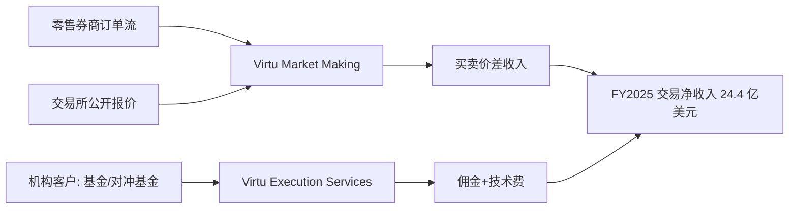
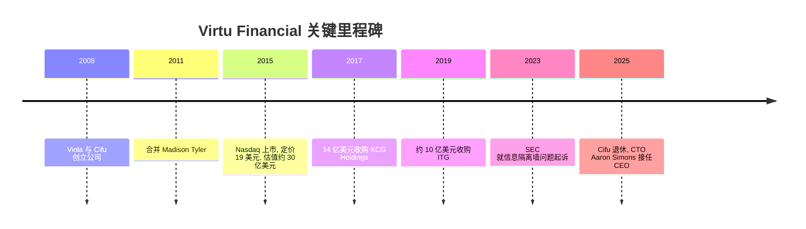
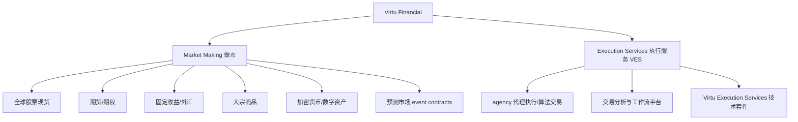

# Virtu Financial 公司维度研究报告（Company Scout）

本报告只研究一件事：Virtu Financial 这家公司本身。它靠什么赚钱、钱从哪里来、历史与收购、财务与规模、过去 12 个月发生了什么、内部文化与工作强度、稳定性信号（裁员/冻结/流失）、领导层，以及未来 3 到 5 年最可能的走向。行业大势请看 `01-industry.md`，岗位日常职责请看 `03-role.md`，全美招聘量与薪资请看 `04-market.md`。本报告只给事实，不给建议，不做个人化判断。

面向对象：一名已有方向但仍不确定的大二学生（Q1=B，Q2=B）。因此本报告会把"能降低不确定性的事实"、"稳定性信号"、"工作强度"和"未来走向"写得更细。

## 一句话定位与类比

先用大白话说清楚 Virtu 是干什么的。你在手机 App 上按一下"买入 100 股苹果"，几乎瞬间就成交了，成交价和你看到的价格几乎一样。你从来不需要等某个"想卖苹果给你的人"出现，因为背后有一类公司随时挂着买价和卖价、随时接你的单，它们叫做 market maker（做市商，即同时对同一个证券报出"我愿意买的价"和"我愿意卖的价"，靠中间那点差价赚钱的机构）。Virtu Financial 就是全球最大的电子做市商之一。它用极快的计算机系统，在全球市场对超过 19,000 种证券持续报出买卖价，覆盖 36 个国家、超过 235 个交易场所 [1 - Market Making, VIRTU Financial](https://www.virtu.com/market-making/)。

它赚钱的核心逻辑很朴素：每一笔成交，买价和卖价之间有一个极小的差（bid-ask spread，买卖价差）。单笔可能只有几分之一美分，但当你一天在全球做几千万笔、几亿笔交易时，这些碎屑加起来就是巨额收入 [2 - How Virtu Financial Works, CanvasBusinessModel](https://canvasbusinessmodel.com/blogs/how-it-works/virtu-financial-how-it-works)。

给你一个熟悉的类比：如果说 Citadel Securities、Jane Street 是这个行业里"更大、更神秘"的玩家，那么 Virtu 就像其中一家"已经上市、财报公开、规模略小但更透明"的同类公司。它和高盛那种投行不一样，它不做 IPO 承销、不做并购顾问；它更像一台"全球流动性发动机"，本质是一家把数学、物理和软件工程用到极致的科技公司，只不过产品是"报价和成交" [3 - Virtu Financial, Wikipedia](https://en.wikipedia.org/wiki/Virtu_Financial)。在行业分层里，Virtu 处于第一梯队（top tier）电子做市商之列，但在规模上通常被认为排在未上市的 Citadel Securities 和 Jane Street 之后（行业格局详见 `01-industry.md`）。

## 商业模式：钱从哪里来

Virtu 的收入几乎全部来自"交易"本身，而不是收管理费或订阅费。它把业务分成两大板块（segment，即公司对外披露财报时划分的经营分部）。

第一个板块叫 Market Making（做市），这是绝对的收入主引擎。Virtu 在全球股票、期货、期权、固定收益、外汇、加密货币和大宗商品上同时挂买价和卖价，赚取价差 [1 - Market Making, VIRTU Financial](https://www.virtu.com/market-making/)。做市又分两种：一种是给零售券商的订单流做对手方（客户端做市），比如你在券商 App 下的单，可能就被路由给了 Virtu 成交；另一种是在公开交易所里做纯粹的电子做市 [4 - Client Market Making, VIRTU Financial](https://www.virtu.com/market-making/client-market-making/)。这里涉及一个关键词 PFOF（payment for order flow，为订单流付费，即做市商向零售券商付钱以换取处理其客户订单的权利），Virtu 是 PFOF 生态里的主要参与者之一 [5 - Virtu Financial competitive landscape, PortersFiveForce](https://portersfiveforce.com/blogs/competitors/virtu)。

第二个板块叫 Execution Services（执行服务，简称 VES），主要面向机构客户，例如养老基金、资产管理公司、对冲基金。Virtu 不再是"用自己的钱做对手方"，而是作为 agency broker（代理经纪商，即只帮客户把单执行好、收一笔手续费，不拿自营头寸）帮客户把大额订单在市场里"切碎、慢慢成交"，并把自己的交易算法、路由技术和分析平台卖给客户，收取佣金和技术费 [6 - Virtu Financial business model SWOT, PitchGrade](https://pitchgrade.com/companies/virtu-financial)。这块业务是 2019 年收购 ITG 后大幅增强的。

从数字上看两块的悬殊：FY2025 全年，公司交易净收入（trading income, net，即两块业务贡献的做市与执行净收入合计）为 $2,436.7M，其中 Market Making 贡献约 $2,408M，Execution Services 仅约 $28.7M（注：$28.7M 为该口径下 Execution Services 的 trading income，其真实经济贡献要看 Adjusted Net Trading Income 口径，下文说明）[7 - Virtu Q4 2025 slides, Investing.com](https://in.investing.com/news/company-news/virtu-financial-q4-2025-slides-reveal-recordhigh-trading-income-strong-margin-growth-93CH-5210873)。

之所以两个口径差这么多，是因为行业更常看 Adjusted Net Trading Income（ANTI，调整后净交易收入，即扣掉交易所费用、清算费、经纪费后真正落到公司口袋里的收入）。以 ANTI 口径衡量，两块业务的差距就没那么夸张：FY2025 全年 Market Making 段 ANTI 约为每天 $6.7M，Execution Services（VES）约为每天 $1.9M [7 - Virtu Q4 2025 slides, Investing.com](https://in.investing.com/news/company-news/virtu-financial-q4-2025-slides-reveal-recordhigh-trading-income-strong-margin-growth-93CH-5210873)。也就是说，做市贡献了大约七成多的净收入，执行服务贡献了接近两成，后者虽小但增长更稳。在 2025 年三季度，VES 的 ANTI 达到 $122.9M，同比增长 22.8%，且是连续第七个季度环比上升 [8 - Virtu Q3 Earnings Beat on Execution Services, Yahoo Finance](https://finance.yahoo.com/news/virtu-financial-q3-earnings-beat-173400167.html)。

客户结构方面：Market Making 的"对手方"其实是整个市场，包括零售券商的订单流和交易所里的其他参与者；Execution Services 的客户是机构（买方基金、对冲基金、银行、其他经纪商）[6 - Virtu Financial business model SWOT, PitchGrade](https://pitchgrade.com/companies/virtu-financial)。地域上，公司收入以美国为主，同时通过爱尔兰、英国、加拿大、澳大利亚、香港、新加坡等主要海外子公司在各自区域做市 [9 - Virtu Financial company profile, ZoomInfo](https://www.zoominfo.com/c/virtu-financial-inc/344954239)。

关于单笔经济性（unit economics）：做市这门生意没有传统意义上的 CAC（customer acquisition cost，获客成本）或 LTV（lifetime value，客户终身价值）概念，因为收入来自海量微小价差而非签约客户，这两个指标在此 N/A（不适用，原因：做市收入按交易笔数而非客户合同计）。但盈利能力可以看利润率：FY2025 全年净利润率约 25%（净利 $912.3M ÷ 营收 $3,632.1M）[10 - Virtu Financial FY2025 results, StockTitan/SEC](https://www.stocktitan.net/news/VIRT/virtu-announces-fourth-quarter-2025-6qfdnnimqveu.html)。四季度单季净利润率进一步升到 28.9% [11 - Virtu Q4 2025 record results, Yahoo Finance](https://finance.yahoo.com/news/virtu-financial-virt-reports-highest-223036057.html)。

一个结构性特点需要点出：这门生意高度依赖市场波动（volatility）。市场越动荡、成交量越大，价差和做市机会就越多，Virtu 就越赚钱；市场平静时收入下滑。这意味着它的收入天然带有周期性和不可预测性，这一点在"未来 3-5 年"一节会展开。

## 公司历史与收购

先讲一个大背景。Virtu 的故事本质是"一个华尔街老兵 + 一群搞技术的人，把电子做市从边缘做成主流"的故事。

公司由 Vincent Viola（文森特·维奥拉）和 Douglas Cifu（道格拉斯·西富）于 2008 年在纽约创立 [3 - Virtu Financial, Wikipedia](https://en.wikipedia.org/wiki/Virtu_Financial)。Viola 背景很硬：他是美国陆军退役军人、西点军校毕业，2001 到 2004 年担任纽约商品交易所（NYMEX）主席，"9·11"后主导了 NYMEX 的重新开市 [12 - Vincent Viola, Wikipedia](https://en.wikipedia.org/wiki/Vincent_Viola)。

关键里程碑按时间线如下：

2011 年，Virtu 合并了 Madison Tyler，把做市能力扩展到全球 [3 - Virtu Financial, Wikipedia](https://en.wikipedia.org/wiki/Virtu_Financial)。2014 年公司原计划 IPO，但因当年 Michael Lewis 出版《Flash Boys》引发对高频交易（HFT，high-frequency trading）的公众质疑而推迟。2015 年 4 月 15 日最终在 Nasdaq 定价，发行价每股 $19，融资超过 $300M，估值约 $30 亿美元，Viola 也因此被称为"第一个高频交易亿万富翁" [13 - Vincent Viola brief history, SWOTAnalysisExample](https://swotanalysisexample.com/blogs/brief-history/virtu-brief-history)。

两笔改变公司体量的收购：2017 年 7 月，Virtu 以约 $14 亿美元现金收购 KCG Holdings，一举成为美股零售订单流做市的头部玩家；2019 年 3 月，以约 $10 亿美元收购 Investment Technology Group（ITG），这才有了今天的 Execution Services 板块 [3 - Virtu Financial, Wikipedia](https://en.wikipedia.org/wiki/Virtu_Financial)。换句话说，Virtu 今天"做市 + 执行服务"的双板块结构，是靠两次大并购拼出来的，而不是一开始就有的。值得注意的是，现任 CEO Aaron Simons 当年正是主导 KCG 和 ITG 技术整合的人 [14 - Aaron Simons, MarketsWiki](https://www.marketswiki.com/wiki/Aaron_Simons)。

关于战略转向（pivot）：Virtu 没有发生过"从 A 业务彻底转到 B 业务"的剧烈转向，它的主线一直是做市，只是通过并购不断把资产类别（股票→固收→外汇→期权→加密→大宗商品→预测市场）和地域一步步铺开。这是一种"沿着同一条主轴横向扩张"的路径，而不是转型。

## 财务与规模

先说人数。Virtu 是一家"营收巨大但人很少"的公司，这在做市行业很典型，因为赚钱的是机器和算法，不是人头。截至 2025 年底/2026 年 2 月申报口径，公司约有 1,027 名员工，同比增加约 58 人（+5.99%），说明过去 12 个月是净招聘、而非裁员 [15 - Virtu Financial employees, StockAnalysis](https://stockanalysis.com/stocks/virt/employees/)。用营收除以人头，人均创收远超 $300 万美元，有媒体测算其人均产出/薪酬水平在电子交易行业里名列前茅 [16 - Virtu pays above 500k per head, eFinancialCareers](https://www.efinancialcareers-gulf.com/news/electronic-trader-virtu-financial-now-seemingly-pays-above-500k-per-head)。

再说财务（这些是 public 数据，因为 Virtu 是 NASDAQ 上市公司，代码 VIRT，需按季度提交 10-K/10-Q/8-K 等 SEC 文件，10-K 即美股上市公司的年度报告）：

- FY2025 全年总营收（total revenue）$3,632.1M，同比 +26.2%（2024 为 $2,876.9M）[10 - Virtu FY2025 results, StockTitan/SEC](https://www.stocktitan.net/news/VIRT/virtu-announces-fourth-quarter-2025-6qfdnnimqveu.html)。
- FY2025 净利润（net income）$912.3M，几乎是 2024 年 $534.5M 的 1.7 倍 [10 - Virtu FY2025 results, StockTitan/SEC](https://www.stocktitan.net/news/VIRT/virtu-announces-fourth-quarter-2025-6qfdnnimqveu.html)。
- FY2025 摊薄 EPS（earnings per share，每股收益）$5.13，2024 为 $2.97 [10 - Virtu FY2025 results, StockTitan/SEC](https://www.stocktitan.net/news/VIRT/virtu-announces-fourth-quarter-2025-6qfdnnimqveu.html)。
- FY2025 调整后 EBITDA $1,399.2M，同比 +52.3% [10 - Virtu FY2025 results, StockTitan/SEC](https://www.stocktitan.net/news/VIRT/virtu-announces-fourth-quarter-2025-6qfdnnimqveu.html)。
- 2025 年四季度是自 2021 年初以来最强的一个季度：交易净收入 $664.9M，单季净利 $280.6M，normalized adjusted EPS $1.85，相当于每天赚约 $9.7M [11 - Virtu Q4 2025 record, Yahoo Finance](https://finance.yahoo.com/news/virtu-financial-virt-reports-highest-223036057.html)。

融资阶段（funding stage）在此 N/A，原因：Virtu 已于 2015 年上市，不再走 Series A/B/C 私募轮次，融资靠公开市场和发债。

市值（market cap）方面，不同数据源差异较大，原因是 Virtu 采用双层股权结构（Class A 公众流通股 + 由创始团队持有的 Class C/D 股）。2026 年年中，Class A 股价约 $61.77，Class A 流通股约 8,700 万股，对应约 $5.4B [17 - Virtu market cap, StockAnalysis](https://stockanalysis.com/stocks/virt/market-cap/)；若把创始人持有的全部股份也算进来，部分数据源给出的整体股权价值高达 $9B 左右 [18 - Virtu market cap history, MacroTrends](https://www.macrotrends.net/stocks/charts/VIRT/virtu-financial/market-cap)。请把这两个数字理解为"公众部分"与"含内部股的整体"两个口径，不要直接相加。

现金流与资本回报：Virtu 是持续盈利、持续给股东发钱的公司，不存在初创公司那种"烧钱找 runway"的问题。它按季派息 $0.24/股，2025 年董事会批准了新的 $5 亿美元股票回购授权，替代此前的计划；据 Simply Wall St 统计，公司自 2021 年以来已回购了接近三分之一的流通股 [19 - Virtu dividend and buyback, Simply Wall St](https://simplywall.st/stocks/us/diversified-financials/nyse-virt/virtu-financial)。派息率（payout ratio）约 16%，账面上由现金流充分覆盖 [19 - Virtu dividend and buyback, Simply Wall St](https://simplywall.st/stocks/us/diversified-financials/nyse-virt/virtu-financial)。

负债方面，截至 2026 年一季度末，长期借款本金合计约 $2.05B，总资产升至约 $25.1B（2025 年底约 $20.2B），资产扩张主要反映交易头寸和应收增加，这是做市公司随市场活跃度放大资产负债表的正常现象 [20 - Virtu Q1 2026 record earnings, Investing.com](https://www.investing.com/news/transcripts/earnings-call-transcript-virtu-financial-q1-2026-reports-record-earnings-93CH-4645035)。

## 产品线与业务板块

Virtu 的"产品"不是软件商店里那种一个个 App，而是"在哪些资产、哪些市场提供流动性"以及"卖给机构什么工具"。可以这样理解它的产品谱系：

主力产品线是 Market Making，它贡献了大部分交易净收入；旗舰级增长点则是 VES，公司公开把 VES 的目标设为"穿越周期稳定实现每天 $2M ANTI" [21 - Virtu Q4 2025 slides, Quartr](https://quartr.com/events/virtu-financial-virt-q4-2025_3PJTjRMs)。

用户量指标（MAU/DAU）在此 N/A，原因：Virtu 是 B2B/机构与做市业务，没有面向消费者的活跃用户概念。

## 过去 12 个月发生了什么

过去一年是 Virtu 的"大年"，既有创纪录的财务，也有一次重量级的领导层更替，还有监管落地和新业务上线。按倒序梳理最重要的几件事：

第一，创纪录的业绩连续兑现。2025 全年营收 +26.2%、净利近乎翻倍（见上一节）[10 - Virtu FY2025 results, StockTitan/SEC](https://www.stocktitan.net/news/VIRT/virtu-announces-fourth-quarter-2025-6qfdnnimqveu.html)；进入 2026 年，一季度净利再翻倍至 $346.6M，交易收入同比 +34%，EPS $2.24 大幅超预期 [22 - Virtu Q1 profit nearly doubles, Finance Magnates](https://www.financemagnates.com/forex/virtu-financial-q1-profit-nearly-doubles-to-3466-million-as-trading-income-climbs-34/)。背后主因是 2025 年的市场波动放大了做市机会。

第二，CEO 更替（最重要的稳定性事件）。2025 年 7 月 30 日，联合创始人、执掌 18 年的 CEO Douglas Cifu 宣布退休，公司任命长期担任 CTO 的 Aaron Simons 出任新 CEO 并进入董事会 [23 - Virtu names Aaron Simons CEO, Finance Magnates](https://www.financemagnates.com/executives/virtu-financial-promotes-cto-aaron-simons-to-ceo-reports-nearly-1-billion-revenue-in-q2/)。这是一次内部继任，而非外部空降，下文"领导层"一节详述。

第三，SEC 案件在 2025 年底以和解收场。围绕 Virtu 信息隔离墙（information barriers，即防止自营交易员滥用机构客户成交数据的内部隔离制度）的披露问题，SEC 早在 2023 年 9 月提起诉讼；2025 年 12 月，Virtu Americas LLC 同意支付 $2.5M 民事罚款和解 [24 - SEC Charges Virtu, SEC press release 2023-176](https://www.sec.gov/newsroom/press-releases/2023-176) [25 - SEC Settles with Virtu over MNPI Controls, Alston & Bird](https://www.alston.com/en/insights/publications/2025/12/sec-virtu-customer-mnpi-controls)。罚款金额相对其利润体量很小，但这类监管标签是这家公司长期背景风险的一部分。

第四，加密与数字资产扩张。2025 年 7 月，Virtu 推出 EDXM International，一个面向美国境外机构客户的数字资产期货交易所，支持 44 个加密货币对的永续合约交易；公司同时扩大了做市覆盖的币种、现货、永续和 ETF [26 - Virtu Q2 2025 crypto strategy, AInvest](https://www.ainvest.com/news/virtu-q2-2025-key-contradictions-crypto-strategy-tech-growth-regulatory-landscape-2507/)。Citadel Securities 与 Virtu 都在搭建加密交易基础设施 [27 - Citadel Securities Virtu crypto platform, Blockworks](https://blockworks.com/news/citadel-securities-virtu-financial-building-crypto-trading-platform)。

第五，进入预测市场（prediction markets）。2026 年，Virtu 开始在 Kalshi 和 CME 等平台对事件合约（event contracts）做市定价，并指派一名纽约交易员牵头、配合全球交易员实现 7×24 小时（含周末）覆盖 [28 - Virtu starts trading prediction markets, Seeking Alpha](https://seekingalpha.com/news/4593104-virtu-financial-starts-trading-on-prediction-markets-report)。

第六，资本回报持续。新的 $5 亿美元回购授权、按季 $0.24 派息、2025 年内还有单季 $135.3M（约 350 万股）的回购动作 [19 - Virtu dividend and buyback, Simply Wall St](https://simplywall.st/stocks/us/diversified-financials/nyse-virt/virtu-financial)。

一个值得学生注意的信号：过去 12 个月没有出现公开的裁员、招聘冻结记录，反而是净增约 58 人（见财务一节）[15 - Virtu Financial employees, StockAnalysis](https://stockanalysis.com/stocks/virt/employees/)。

## 文化与工作强度

先说这家公司文化的底色：它是一家"小而紧凑、技术密度极高、节奏很快"的高频交易公司，员工普遍是数学/物理/CS 背景的"聪明脑袋"。CEO 本人就是 Caltech 数学本科 + Harvard 物理博士出身（见领导层一节），这决定了公司偏"工程师和量化"的气质。

公开的量化评分（截至 2026 年中）：

- Glassdoor 综合评分约 4.1/5，基于约 224-271 条评价，约 78% 的员工愿意推荐朋友来工作 [29 - Virtu Financial Reviews, Glassdoor](https://www.glassdoor.com/Reviews/Virtu-Financial-Reviews-E337434.htm)。
- 分项：文化与价值观约 4.3/5，职业发展机会约 3.9/5，而 work-life balance（工作与生活平衡）明显偏低，约 3.2/5（不同页面在 2.9-3.3 之间波动）[29 - Virtu Financial Reviews, Glassdoor](https://www.glassdoor.com/Reviews/Virtu-Financial-Reviews-E337434.htm)。
- Blind 上综合约 3.7/5（43 条已验证评价），其中"公司文化"最高约 3.9/5，而 work-life balance 最低约 2.9/5，职业成长约 3.5/5 [30 - Virtu Financial Reviews, Blind](https://www.teamblind.com/company/Virtu-Financial/reviews)。[anonymous community, small sample]

工作强度的具体描述（来自匿名评价，需谨慎）：多条评论提到长工时是常态。有人写"12-15 小时在线、没有加班费"，"60-80+ 小时、周末工作相当常见"[29 - Virtu Financial Reviews, Glassdoor](https://www.glassdoor.com/Reviews/Virtu-Financial-Reviews-E337434.htm)。Blind 上较近的说法是"开发岗典型 55 小时/周"，并称"WLB 以前更糟，现在在努力改善"[30 - Virtu Financial Reviews, Blind](https://www.teamblind.com/company/Virtu-Financial/reviews)。[anonymous community, small sample] 这些是自我报告，样本小、且投诉者更爱发帖，只能作为方向性参考。

高频关键词（正面）：collaborative（协作）、best and brightest（聪明同事）、good comp/benefits（薪酬福利不错）、tight-knit（团队紧凑）[30 - Virtu Financial Reviews, Blind](https://www.teamblind.com/company/Virtu-Financial/reviews)。[anonymous community, small sample]

高频关键词（负面）：long hours（长工时）、politics（内部政治）、limited upside（上升空间有限）、有评论称部分团队"过度追求速度、缺乏稳定的软件工程规范"，还有人提到"绩效沟通与奖金关联度低""管理层解雇人时理由不清"[31 - Best people good perks poor management, Glassdoor](https://www.glassdoor.com/Reviews/Employee-Review-Virtu-Financial-E337434-RVW93435886.htm)。[anonymous community, small sample]

薪酬的社区口径（供文化背景参考，正式薪资数据见 `04-market.md`）：Blind 上有人称实习转正 offer 为 $150K base + $150K 保底绩效奖金 + $50K 签字费，并普遍认为"薪酬相当好，只输给 JS/Citadel/HRT 这类顶级自营"[30 - Virtu Financial Reviews, Blind](https://www.teamblind.com/company/Virtu-Financial/reviews)。[anonymous community, small sample]

远程/RTO 政策：作为交易公司，Virtu 属于强线下坐班（in-office）为主的机构，交易与运营岗需要贴近交易系统和交易员现场协作；未能查到 2025-2026 明确的每周到岗天数官方公告，此处标注"未能验证具体到岗天数"。

关于 Trading Operations 团队的组织语境（只写公司层面，日常职责见 `03-role.md`）：多份面试帖显示 TradeOps 是一个规模不大、与交易员和工程师紧密协作的团队，技术电话面聚焦 Python 和 SQL，并有大量数学脑筋急转弯 [32 - Trade Operations Analyst Interview, Wall Street Oasis](https://www.wallstreetoasis.com/company/virtu-financial/interview/trade-operations-analyst)。这与 JD 里"用软件自动化清算、结算、对账工作流"的定位一致。

跨 BU 文化差异：Virtu 整体只有约 1,000 人、两大板块，规模远小于亚马逊那种巨头，因此不存在"AWS 与零售是两个世界"式的巨大跨事业部文化割裂，但交易/做市侧与执行服务/技术侧在节奏上仍有差别，前者更贴近市场波动、强度更集中。

## 稳定性信号

对一名"已有方向但不确定"的学生，稳定性是关键。把几类信号摆在一起看：

裁员记录（Layoffs.fyi 与新闻）：在本轮检索中，未在 Layoffs.fyi 或主流新闻里查到 Virtu 在过去 24 个月有公开的规模性裁员事件；公开数据反而显示 2025 年净增约 58 人 [15 - Virtu Financial employees, StockAnalysis](https://stockanalysis.com/stocks/virt/employees/)。需要提醒：做市公司有时会做"基于绩效"的小规模、不公开的人员调整，这类不会出现在 Layoffs.fyi 上，社区评论里"管理层解雇人理由不清"的说法可能与此相关 [31 - poor management, Glassdoor](https://www.glassdoor.com/Reviews/Employee-Review-Virtu-Financial-E337434-RVW93435886.htm)。[anonymous community, small sample]

招聘冻结：未查到 2024-2026 年 Virtu 有公开的 hiring freeze（招聘冻结）记录，标注"未能验证存在冻结"。

员工流失与在职时长（attrition/tenure）：未查到公司官方公布的年度流失率，标注"未能验证具体流失率"。从 LinkedIn/Glassdoor 零散信息看，存在不少 5 年、8 年、10 年以上的长期在职者，说明核心岗位有相当的留存 [33 - Virtu Financial employee reviews tenure, Glassdoor](https://www.glassdoor.com/Reviews/Employee-Review-Virtu-Financial-E337434-RVW84532728.htm)。

领导层更替（关键席位）：过去 12 个月最大的变动是 CEO 换人（Cifu → Simons）。同时，原 CTO 升任 CEO，意味着 CTO 席位本身也会/已经出现继任安排；本轮未查到明确的新任 CTO 姓名，标注"未能验证新任 CTO"。创始人 Cifu 在离任前于 2025 年 4 月出售了 355,881 股（约 $13.78M），有零售投资者将其解读为信心信号，但高管在离任窗口出售股票也可能只是常规安排，两种解读都存在 [34 - CEO Doug Cifu retirement, FrankNez](https://franknez.com/massive-market-maker-now-announces-retirement-of-ceo-doug-cifu/)。

财务稳定性：持续盈利、连续派息、持续回购、账上现金流覆盖派息，长期负债约 $2.05B 且被庞大交易资产对应，这些是偏稳的信号 [19 - dividend and buyback, Simply Wall St](https://simplywall.st/stocks/us/diversified-financials/nyse-virt/virtu-financial) [20 - Q1 2026 earnings, Investing.com](https://www.investing.com/news/transcripts/earnings-call-transcript-virtu-financial-q1-2026-reports-record-earnings-93CH-4645035)。真正的不稳定来源不是资产负债表，而是收入对市场波动的依赖：波动大年利润暴增，波动小年利润会明显回落。

## 领导层

先讲创始人。Vincent Viola 现为公司创始人兼名誉主席（Chairman Emeritus）。他 1956 年生于布鲁克林，西点军校毕业、陆军退役、曾任 NYMEX 主席，2013 年以约 $2.5 亿美元买下 NHL 佛罗里达美洲豹队（Florida Panthers），并在 2024、2025 连续两年拿下斯坦利杯 [12 - Vincent Viola, Wikipedia](https://en.wikipedia.org/wiki/Vincent_Viola)。据 2025 年公开估计，其净资产约 $62 亿美元，Virtu 是其主要财富来源 [35 - Vincent Viola profile, Forbes](https://www.forbes.com/profile/vincent-viola/)。Viola 如今更多是股东与董事会层面的存在，日常经营早已交给管理层。

再讲原 CEO。Douglas Cifu 与 Viola 一起创立公司，掌舵 18 年，把 Virtu 从一家做市新公司做成上市的全球做市与执行服务巨头，2025 年 7 月退休 [23 - Virtu names Aaron Simons CEO, Finance Magnates](https://www.financemagnates.com/executives/virtu-financial-promotes-cto-aaron-simons-to-ceo-reports-nearly-1-billion-revenue-in-q2/)。Cifu 过去在公开场合多次为 PFOF 辩护，2021 年 CNBC 的一次采访让他成为零售投资者争议的焦点 [34 - Doug Cifu retirement, FrankNez](https://franknez.com/massive-market-maker-now-announces-retirement-of-ceo-doug-cifu/)。

现任 CEO 是 Aaron Simons，这是理解公司未来走向的关键人物。他 2002 年获 Caltech 数学学士，2007 年获 Harvard 物理博士，做过理论物理博士后，2008 年公司创立不久即加入，从技术岗一路做到 CTO（2019 年起任 CTO），主导了 KCG 与 ITG 两笔收购的技术整合，2025 年 7 月出任 CEO [14 - Aaron Simons, MarketsWiki](https://www.marketswiki.com/wiki/Aaron_Simons) [23 - Aaron Simons CEO, Finance Magnates](https://www.financemagnates.com/executives/virtu-financial-promotes-cto-aaron-simons-to-ceo-reports-nearly-1-billion-revenue-in-q2/)。董事会主席公开表示，"与 Aaron 共事十余年，相信他具备继续推进势头的领导力、判断力和远见" [36 - Virtu appoints Aaron Simons, LiquidityFinder](https://liquidityfinder.com/news/virtu-financial-appoints-chief-technology-officer-aaron-simons-as-new-chief-executive-39a71)。

Simons 对 2026 战略的公开表态偏"不押注单点、全面增长"：在 Q4 2025 电话会上他说"我们不聚焦于极少数增长项目，而是在公司内部到处寻找增长、动态响应市场机会" [37 - Virtu Q4 2025 earnings transcript, Motley Fool](https://www.fool.com/earnings/call-transcripts/2026/01/29/virtu-financial-virt-q4-2025-earnings-transcript/)。

一个必须给学生点出的 counter-signal（反向信号）：第三方研究机构 Paragon Intel 对 Simons 的评估指出，他的技术背景对 VES 增长是资产，但他在资本配置（capital allocation）和应对监管风险方面缺乏经验，作为"首次担任 CEO"的技术型高管，能否管好这家收入高度周期性公司的财务纪律与监管风险，是市场关注的未知数 [38 - Aaron Simons CEO analysis, Paragon Intel](https://paragonintel.com/aaron-simons-ceo-analysis-virt/)。同期 Virtu 还上调了 Simons 的薪酬协议 [39 - Virtu increases CEO Simons compensation, Investing.com](https://www.investing.com/news/sec-filings/virtu-financial-increases-ceo-aaron-simons-compensation-in-new-agreement-93CH-4269441)。这构成本报告中最需要留意的不确定点之一：新 CEO 是技术强、但在资本与监管维度未经周期考验。

## 未来 3 到 5 年最可能的走向

先说方法：以下判断基于公司自身的公开表态、最近几个季度的财报、管理层战略、以及第三方分析，并给出置信度标签（high/medium/low）。这是本报告的核心价值。

第一，业务模式不会剧变，但会继续横向铺开新资产类别（置信度 high）。管理层反复强调"到处增长、动态响应"，并在过去 12 个月落地了加密永续（EDXM International）和预测市场（Kalshi/CME 事件合约）两条新战线 [26 - crypto strategy, AInvest](https://www.ainvest.com/news/virtu-q2-2025-key-contradictions-crypto-strategy-tech-growth-regulatory-landscape-2507/) [28 - prediction markets, Seeking Alpha](https://seekingalpha.com/news/4593104-virtu-financial-starts-trading-on-prediction-markets-report)。可预期未来 3-5 年，做市这条主轴不变，新增资产（数字资产、tokenization、预测市场）是主要扩张方向。

第二，Execution Services（VES）是明确的结构性增长引擎（置信度 medium-high）。公司公开把 VES 目标定为"穿越周期每天 $2M ANTI"，并连续多个季度环比增长 [21 - Q4 2025 slides, Quartr](https://quartr.com/events/virtu-financial-virt-q4-2025_3PJTjRMs) [8 - Q3 earnings beat, Yahoo Finance](https://finance.yahoo.com/news/virtu-financial-q3-earnings-beat-173400167.html)。VES 收入比做市更稳定、更少依赖波动，公司有动机继续把资源往这块倾斜。这对偏后台/运营/技术协作的岗位是相对利好的组织背景。

第三，扩张而非收缩，但扩张会很克制（置信度 high）。过去一年是净招聘（+58 人）、持续回购、持续派息、总资产扩张 [15 - employees, StockAnalysis](https://stockanalysis.com/stocks/virt/employees/) [20 - Q1 2026, Investing.com](https://www.investing.com/news/transcripts/earnings-call-transcript-virtu-financial-q1-2026-reports-record-earnings-93CH-4645035)。但做市行业的常态是"营收翻倍、人头只增个位数百分比"，因为增长靠技术杠杆而非扩招。所以未来几年人员大概率温和增长、而非爆发式扩招。

第四，收入的周期性是最大变量（置信度 high）。Virtu 的利润与市场波动强相关，2025 和 2026 年初的创纪录业绩正是波动放大的结果 [22 - Q1 profit doubles, Finance Magnates](https://www.financemagnates.com/forex/virtu-financial-q1-profit-nearly-doubles-to-3466-million-as-trading-income-climbs-34/)。如果未来某年市场进入长时间的低波动状态，利润会明显回落。这不代表公司会亏损（它有极强的成本纪律和多资产分散），但会体现在奖金池和扩张节奏上。行业层面的波动/交易量趋势详见 `01-industry.md`。

第五，监管是持续的背景风险（置信度 medium）。PFOF 长期处于监管审视之下，Virtu 又刚以 $2.5M 和解了 SEC 的信息隔离墙案 [24 - SEC charges Virtu](https://www.sec.gov/newsroom/press-releases/2023-176) [25 - SEC settles, Alston & Bird](https://www.alston.com/en/insights/publications/2025/12/sec-virtu-customer-mnpi-controls)。若未来出现针对 PFOF 或市场结构的重大改革，会直接影响做市板块的经济性。这是一个"低概率但高影响"的尾部变量。

第六，关键人员留存与治理（置信度 medium）。创始人 Viola 已退居名誉主席、Cifu 已退休，公司进入"第二代职业管理层"阶段。CEO 由技术出身的 Simons 接任是一次平稳内部继任，但其资本配置与监管应对能力尚未经周期检验 [38 - Simons analysis, Paragon Intel](https://paragonintel.com/aaron-simons-ceo-analysis-virt/)。新任 CTO 人选与核心交易/工程团队的留存，是需要持续观察的信号。

第七，保持上市、并购可选（置信度 medium）。Virtu 已是成熟上市公司，短期内没有再次 IPO 的问题（N/A）；它历史上是"并购整合的一方"（KCG、ITG），未来更可能是继续做买方而非被收购。当前市值约 $5-9B（口径见财务一节），持续回购缩股，短期私有化或被并购的公开信号未见，标注为"未见明确并购/私有化信号"。

综合以上：未来 3-5 年 Virtu 最可能的画面是：业务主轴（做市）不变，沿数字资产与预测市场等新资产继续横向扩张，VES 作为更稳的增长引擎被持续加码，人员温和增长而非爆发扩招，利润随市场波动上下起伏，监管与新 CEO 的周期考验是两大不确定源。整体置信度 medium-high，因为多数判断有公司公开表态与近期财报支撑，但周期与监管这两个变量本质不可预测。

## 未能验证或存疑的事项

1. 新任 CTO 是谁：Simons 升任 CEO 后，CTO 席位的继任者姓名未在本轮检索中查到。可在下一份 10-K 的高管名单中确认。
2. 官方员工流失率（attrition）与平均在职时长：公司未公开披露，社区只有零散长期在职案例，无法给出精确数字。
3. 2025-2026 明确的 RTO/远程到岗天数：未查到官方口径，只能从"交易公司偏线下"做定性判断。
4. Execution Services 的真实经济贡献口径：trading income 口径（$28.7M）与 ANTI 口径（约每天 $1.9M）差异很大，全年 ANTI 绝对额需以 SEC 正式 10-K 分部披露为准（sec.gov 本次因访问策略被拦截，未能直接调取原文）。
5. 市值口径：Class A 流通口径约 $5.4B 与含内部股口径约 $9B 并存，精确的完全稀释市值需以最新代理声明/10-K 股本结构为准。
6. Trading Operations 团队的确切人数与近一年增减：仅有面试帖描述"团队不大"，无官方人数。

## 附录：Sources

1. [Market Making, VIRTU Financial](https://www.virtu.com/market-making/)
2. [How Virtu Financial Works, CanvasBusinessModel](https://canvasbusinessmodel.com/blogs/how-it-works/virtu-financial-how-it-works)
3. [Virtu Financial, Wikipedia](https://en.wikipedia.org/wiki/Virtu_Financial)
4. [Client Market Making, VIRTU Financial](https://www.virtu.com/market-making/client-market-making/)
5. [Virtu Financial competitive landscape, PortersFiveForce](https://portersfiveforce.com/blogs/competitors/virtu)
6. [Virtu Financial business model SWOT, PitchGrade](https://pitchgrade.com/companies/virtu-financial)
7. [Virtu Q4 2025 slides record trading income, Investing.com](https://in.investing.com/news/company-news/virtu-financial-q4-2025-slides-reveal-recordhigh-trading-income-strong-margin-growth-93CH-5210873)
8. [Virtu Financial Q3 Earnings Beat on Execution Services, Yahoo Finance](https://finance.yahoo.com/news/virtu-financial-q3-earnings-beat-173400167.html)
9. [Virtu Financial company profile, ZoomInfo](https://www.zoominfo.com/c/virtu-financial-inc/344954239)
10. [Virtu Announces Fourth Quarter 2025 Results, StockTitan/SEC](https://www.stocktitan.net/news/VIRT/virtu-announces-fourth-quarter-2025-6qfdnnimqveu.html)
11. [Virtu Reports Highest Quarterly Net Income Since 2021, Yahoo Finance](https://finance.yahoo.com/news/virtu-financial-virt-reports-highest-223036057.html)
12. [Vincent Viola, Wikipedia](https://en.wikipedia.org/wiki/Vincent_Viola)
13. [Brief History of Virtu Financial, SWOTAnalysisExample](https://swotanalysisexample.com/blogs/brief-history/virtu-brief-history)
14. [Aaron Simons, MarketsWiki](https://www.marketswiki.com/wiki/Aaron_Simons)
15. [Virtu Financial Number of Employees, StockAnalysis](https://stockanalysis.com/stocks/virt/employees/)
16. [Virtu pays above 500k per head, eFinancialCareers](https://www.efinancialcareers-gulf.com/news/electronic-trader-virtu-financial-now-seemingly-pays-above-500k-per-head)
17. [Virtu Financial Market Cap, StockAnalysis](https://stockanalysis.com/stocks/virt/market-cap/)
18. [Virtu Financial Market Cap 2013-2026, MacroTrends](https://www.macrotrends.net/stocks/charts/VIRT/virtu-financial/market-cap)
19. [Virtu Financial Stock Analysis dividend and buyback, Simply Wall St](https://simplywall.st/stocks/us/diversified-financials/nyse-virt/virtu-financial)
20. [Virtu Financial Q1 2026 earnings call transcript, Investing.com](https://www.investing.com/news/transcripts/earnings-call-transcript-virtu-financial-q1-2026-reports-record-earnings-93CH-4645035)
21. [Virtu Financial Q4 2025 Summary, Quartr](https://quartr.com/events/virtu-financial-virt-q4-2025_3PJTjRMs)
22. [Virtu Q1 Profit Nearly Doubles, Finance Magnates](https://www.financemagnates.com/forex/virtu-financial-q1-profit-nearly-doubles-to-3466-million-as-trading-income-climbs-34/)
23. [Virtu Promotes CTO Aaron Simons to CEO, Finance Magnates](https://www.financemagnates.com/executives/virtu-financial-promotes-cto-aaron-simons-to-ceo-reports-nearly-1-billion-revenue-in-q2/)
24. [SEC Charges Virtu for Misleading Disclosures on Information Barriers, SEC press release 2023-176](https://www.sec.gov/newsroom/press-releases/2023-176)
25. [SEC Settles with Virtu over Customer MNPI Controls, Alston & Bird](https://www.alston.com/en/insights/publications/2025/12/sec-virtu-customer-mnpi-controls)
26. [Virtu Q2 2025 crypto strategy and regulatory landscape, AInvest](https://www.ainvest.com/news/virtu-q2-2025-key-contradictions-crypto-strategy-tech-growth-regulatory-landscape-2507/)
27. [Citadel Securities, Virtu Financial Building Crypto Trading Platform, Blockworks](https://blockworks.com/news/citadel-securities-virtu-financial-building-crypto-trading-platform)
28. [Virtu Financial starts trading on prediction markets, Seeking Alpha](https://seekingalpha.com/news/4593104-virtu-financial-starts-trading-on-prediction-markets-report)
29. [Virtu Financial Reviews, Glassdoor](https://www.glassdoor.com/Reviews/Virtu-Financial-Reviews-E337434.htm)
30. [Virtu Financial Company Reviews, Blind](https://www.teamblind.com/company/Virtu-Financial/reviews)
31. [Best people good perks poor management, Glassdoor](https://www.glassdoor.com/Reviews/Employee-Review-Virtu-Financial-E337434-RVW93435886.htm)
32. [Trade Operations Analyst Interview, Wall Street Oasis](https://www.wallstreetoasis.com/company/virtu-financial/interview/trade-operations-analyst)
33. [Virtu Financial employee review tenure, Glassdoor](https://www.glassdoor.com/Reviews/Employee-Review-Virtu-Financial-E337434-RVW84532728.htm)
34. [Massive Market Maker Announces Retirement of CEO Doug Cifu, FrankNez](https://franknez.com/massive-market-maker-now-announces-retirement-of-ceo-doug-cifu/)
35. [Vincent Viola, Forbes](https://www.forbes.com/profile/vincent-viola/)
36. [Virtu Appoints CTO Aaron Simons as New Chief Executive, LiquidityFinder](https://liquidityfinder.com/news/virtu-financial-appoints-chief-technology-officer-aaron-simons-as-new-chief-executive-39a71)
37. [Virtu Financial Q4 2025 Earnings Transcript, Motley Fool](https://www.fool.com/earnings/call-transcripts/2026/01/29/virtu-financial-virt-q4-2025-earnings-transcript/)
38. [CEO Simons Tech Skills vs Capital and Regulatory Risks, Paragon Intel](https://paragonintel.com/aaron-simons-ceo-analysis-virt/)
39. [Virtu Financial increases CEO Aaron Simons compensation, Investing.com](https://www.investing.com/news/sec-filings/virtu-financial-increases-ceo-aaron-simons-compensation-in-new-agreement-93CH-4269441)
