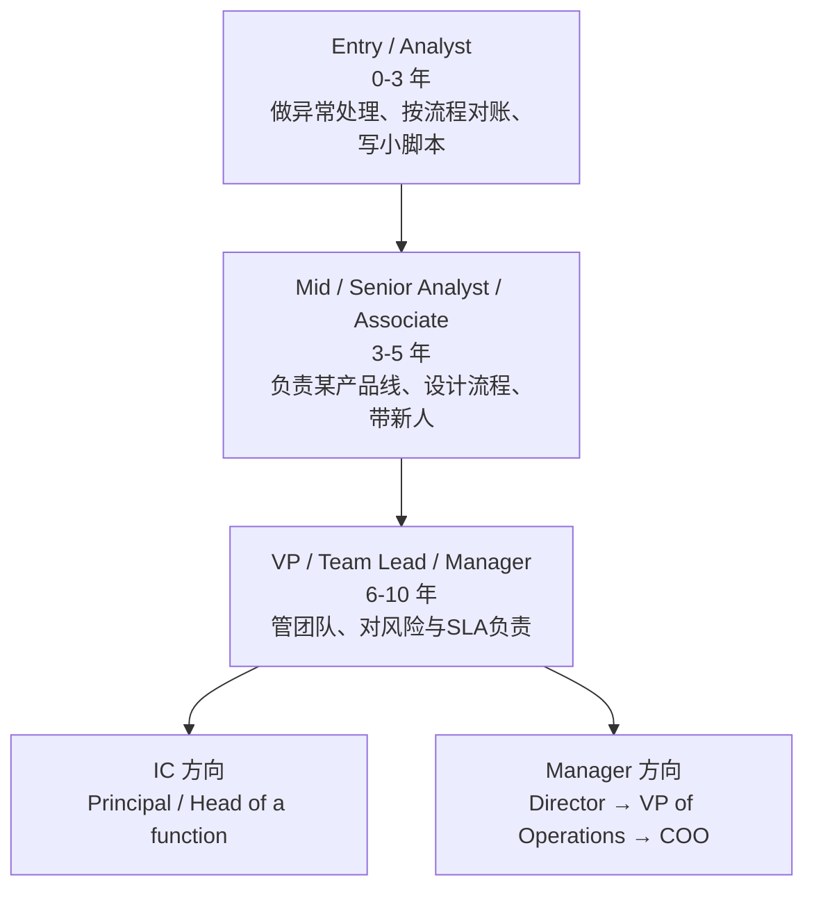
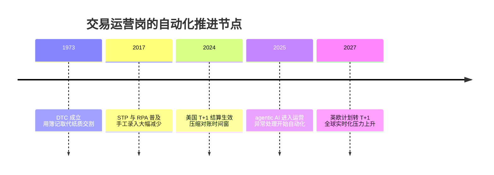

# Trading Operations Analyst @ Virtu Financial：角色维度研究报告

本文只陈述事实，不做任何"适不适合你"的判断。所有薪资、招聘量、地域数据属于市场维度（见 04-market），公司文化与财务属于公司维度（见 02-company），本文只负责回答一件事：这个岗位到底是做什么的、不同级别差在哪、以及未来 3 到 5 年它会怎么变。

## 这个岗位到底在做什么

先用一个大二学生能懂的画面。想象一家很大的餐厅，前厅的服务员（trader，交易员）不停地接单、下单、把菜卖出去。你不是服务员，你是后厨和收银台之间那个"把账对平的人"。每一单卖出去之后，得有人确认这单到底卖了什么、卖给了谁、钱什么时候到、货（也就是证券）什么时候交割、账本上的数字和银行、券商、托管行那边的数字是不是一分不差。如果对不上（这在行业里叫一个 break，指两边账目不匹配的差异项），得有人去追查是谁记错了、在哪一步错了、并在当天的截止时间前解决掉。这就是 Trading Operations Analyst（交易运营分析师）的核心工作。

用金融行业的术语说，这个岗位属于 middle office 和 back office（中后台，指不直接产生收入、但支撑交易顺利完成与结算的支持职能）。它管三件事：clearance（清算，指交易达成后确认双方义务、把买卖双方对上的过程）、settlement（结算，指到期日证券与资金真正易手、完成交收的过程）、以及 reconciliation（对账，指把公司内部账本与外部对手方、托管行、券商的记录逐笔核对、找出并消除差异）[1 - Virtu Trading Operations Analyst](https://job-boards.greenhouse.io/virtu/jobs/5830844002)。Virtu 官方对这个职能的描述是：代表公司各交易台，管理所有交易与头寸的清算、结算与对账，与交易员、财务、合规、券商、托管行以及客户协作，确保交易按时交收、账本准确、避免意外风险[3 - Virtu Trading Operations Analyst - Fixed Income](https://www.linkedin.com/jobs/view/trading-operations-analyst-fixed-income-at-virtu-financial-3790639773)。

和一个更常见的职业类比：它有点像医院里的"医保结算与病历核对员"，不是给你看病的医生（trader），但如果没有这个角色，医生开的每一张单子最后收不收得到钱、记录对不对得上，全是一团乱。区别在于，金融里的这套核对是以"天"甚至"分钟"为单位跑的，错一笔可能对应几百万美元的资金错付。

需要先厘清这个 job family（岗位家族）里几个容易混的相邻角色，因为它们经常互相串门。front office（前台）指直接产生收入的岗位，比如投行的并购顾问、销售交易，负责为公司赚钱[6 - Front Office vs. Back Office](https://corporatefinanceinstitute.com/resources/career/front-office-vs-back-office-key-differences/)。middle office（中台）夹在前后台之间，做风险监控、交易簿记校验、合规，靠近交易流程但不直接创收[6 - Front Office vs. Back Office](https://corporatefinanceinstitute.com/resources/career/front-office-vs-back-office-key-differences/)。back office（后台）处理信息、核对准确性、完成结算、更新记录，operations analyst（运营分析师）就属于这一层[6 - Front Office vs. Back Office](https://corporatefinanceinstitute.com/resources/career/front-office-vs-back-office-key-differences/)。同一个 job family 在不同公司会挂不同 title：Trade Support Analyst、Trade Settlement Analyst、Settlement Analyst、Clearing & Settlement Analyst、Operations Specialist、Middle Office Trade Support、Investment Operations Analyst，做的事高度重叠[12 - Trade Operations Analyst jobs](https://www.efinancialcareers.com/jobs/trade-operations-analyst)。其中 Settlement Analyst 更聚焦"匹配交易确认、与托管行和对手方交收、追踪 failed trades（交割失败的交易）"这一段[32 - Settlement Analyst Job Description](https://www.velvetjobs.com/job-descriptions/settlement-analyst)；而 Virtu 这个 Trading Operations Analyst 把清算、结算、对账、数据分析、乃至参与新系统设计都装进了同一个 title 里，覆盖面比纯 settlement 岗更宽[1 - Virtu Trading Operations Analyst](https://job-boards.greenhouse.io/virtu/jobs/5830844002)。

值得强调一点：这个岗位并不是"新物种"。它的历史可以追溯到 1960 年代末华尔街的 Paperwork Crisis（纸面危机）。1968 年美股日均成交量冲到超过 1200 万股，当时没有电子化交易、没有中央证券交割系统，券商后台被纸质股票凭证淹没，靠人工手递股票交割，导致大量交易结算延迟甚至彻底失败、股息错付、券商倒闭[7 - The Paperwork Crisis](https://optimizeronline.com/the-paperwork-crisis/)。纽交所一度被迫每周只交易四天、周三停市来消化积压[7 - The Paperwork Crisis](https://optimizeronline.com/the-paperwork-crisis/)。这场危机直接催生了 1973 年成立的 DTC（Depository Trust Company，中央证券存管机构），用 book-entry（簿记记账，指所有权变更只在账本上记录、实体凭证不再易手）取代纸质交割，1999 年 DTC 与 NSCC 合并成今天的 DTCC[8 - Spotlight: DTCC's Important Role in US Capital Markets](https://www.sifma.org/research/insights/sifma-insights-spotlight-dtcc)。换句话说，trade operations 这个岗位存在的根本原因，就是"交易越快、量越大，越需要有人在后面把账对平、把风险控住"。这条主线，会一直贯穿到本文最后讲的 AI 部分。

## JD 拆解：这份职位描述在要什么

这一节把 Virtu 这份 JD 拆成几块，方便看清"硬门槛""加分项""每天干的活""和谁打交道"分别是什么。整体读下来，这是一个明确面向应届或 1 到 3 年经验、技术底子（SQL、Python）比金融背景更重要的入门岗。

先说 must-have（硬性要求）。学历上要求本科，偏好带定量色彩的专业，JD 列出了 Business、Finance、Economics、Engineering，Virtu 在其他版本招聘中把范围放得更宽，明确写"所有专业都欢迎，但偏好带定量倾向的，如计算机、数学、理科、经济及相关领域"[3 - Virtu Trading Operations Analyst - Fixed Income](https://www.linkedin.com/jobs/view/trading-operations-analyst-fixed-income-at-virtu-financial-3790639773)。经验上是 1 到 3 年，且明确"应届可考虑""无需金融从业经验"，这在中后台岗里属于门槛偏低、对转行友好的设定[1 - Virtu Trading Operations Analyst](https://job-boards.greenhouse.io/virtu/jobs/5830844002)。真正卡人的是技术栈：强 SQL（Structured Query Language，用来查询和处理数据库的标准语言）加 Python，Virtu 说明大多数 Operations Analyst 都用 SQL 和 Python 来提高效率，事先具备这些或其他编程语言经验是必需的[3 - Virtu Trading Operations Analyst - Fixed Income](https://www.linkedin.com/jobs/view/trading-operations-analyst-fixed-income-at-virtu-financial-3790639773)。招聘流程本身也印证了技术权重：候选人会先做一个在线编程测试（社区报告有的走 Codility、有的走 HackerRank，5 道题，对有编程经验的人偏简单），再进 recruiter 电话初筛，然后是 TradeOps 团队成员的技术电面，考 Python 和 SQL，并夹带若干 math brain teaser（数学脑筋急转弯，用来测快速定量推理）[4 - Operations Analyst Interview - Virtu Financial](https://www.wallstreetoasis.com/company/virtu-financial/interview/trade-operations-analyst)[5 - Virtu Financial Interview Questions](https://www.glassdoor.com/Interview/Virtu-Financial-Interview-Questions-E337434.htm)。

nice-to-have（加分项）在这个岗位上并不是一堆证书。JD 强调的软性能力是 quantitative problem-solving（定量问题解决）和 communication（沟通），因为这个角色一天要在交易台、财务、合规、外部券商与托管行之间来回传话对数[1 - Virtu Trading Operations Analyst](https://job-boards.greenhouse.io/virtu/jobs/5830844002)。行业里同类岗常见的加分项包括 Excel 熟练、Bloomberg 终端使用经验、VBA，以及对某类资产（固定收益、衍生品）的了解[12 - Trade Operations Analyst jobs](https://www.efinancialcareers.com/jobs/trade-operations-analyst)。注意 Virtu 不同 title 版本的经验门槛不一样：这个招应届的 Trading Operations Analyst 要 1 到 3 年，而它的 Fixed Income 版本要求 2 到 5 年交易支持经验[3 - Virtu Trading Operations Analyst - Fixed Income](https://www.linkedin.com/jobs/view/trading-operations-analyst-fixed-income-at-virtu-financial-3790639773)，说明同一家公司里 title 相同、级别不同是常态。

day-to-day（日常职责）从 JD 的动词就能读出来：管理所有交易与头寸的清算、结算、对账；解决未匹配项（unmatched items）带来的问题并为高频问题设计长期方案；做数据分析；和软件工程师合作把运营流程自动化、优化；参与新系统与控制机制的架构设计[1 - Virtu Trading Operations Analyst](https://job-boards.greenhouse.io/virtu/jobs/5830844002)[2 - Clearing and Settlement Analyst](https://mentormecareers.com/clearing-and-settlement/)。这里有个隐含信号很重要：JD 里同时出现了"participates in architecture of new systems and controls"（参与新系统与控制的架构）这种偏建设性的措辞，而不只是"process trades"（处理交易）这种纯执行措辞。这说明 Virtu 把这个入门岗定位成"既做运营、又参与自动化建设"的复合角色，而不是纯手工对账工。

team 与 collaborators（团队与协作对象）在 JD 里写得很直白：与 traders、finance、compliance、brokers、custodians、customers 协作，同时与 software engineers 合作自动化流程[1 - Virtu Trading Operations Analyst](https://job-boards.greenhouse.io/virtu/jobs/5830844002)。这是一个横向连接极广的位置，同一个人一天里可能既要回交易员的紧急消息，又要给合规发报表，还要给工程师提自动化需求。

从措辞里读 level signal（级别信号）：JD 用的是"manages"（管理清算结算对账，指对流程负责但不一定管人）、"collaborates""performs""participates"这类词，没有出现"lead a team""mentor juniors""drive strategy""own the roadmap"这种资深级才会有的动词。这与 1 到 3 年、接受应届的定位一致，属于 individual contributor（个人贡献者，指不带下属、靠自己产出的岗位）里的入门层。

## 真实的一天：从业者实际在忙什么

抛开 JD 的抽象动词，看真实从业者一天是怎么过的。这一节的画面主要来自公开的 day-in-the-life 记录和从业者社区，帮你把"清算结算对账"这几个词还原成具体动作。

这类岗位的节奏是被"截止时间"驱动的，而且往往很早。行业里 trade support / operations 的经典一天从盘前对账开始：有的对冲基金要求分析师清晨 5 点上班，为的是赶在 8 点前完成对账，把当天开盘时的现金和头寸核准[11 - A day in the life of a Trade Support Analyst](https://www.goodmanmasson.com/the-insights-hub/a-day-in-the-life-of-a-trade-support-analyst)。每天以"确认过的现金和持仓"开局，是很多基金最核心的运营挑战，因为手工流程会每天产生大量 break，留给复核的时间很少[11 - A day in the life of a Trade Support Analyst](https://www.goodmanmasson.com/the-insights-hub/a-day-in-the-life-of-a-trade-support-analyst)。全球盘则意味着时区切换：早上盯 APAC（亚太），随后 EMEA（欧洲中东非洲），再到 Americas（美洲），一天里按市场和监管截止时间安排轻重缓急[11 - A day in the life of a Trade Support Analyst](https://www.goodmanmasson.com/the-insights-hub/a-day-in-the-life-of-a-trade-support-analyst)。

主要的交付物（deliverable）不是漂亮的 PPT，而是"对平的账"和"被解决掉的异常"。典型动作包括：SOD/EOD（start of day / end of day，日初与日终）头寸对账、定价与结算、PnL（profit and loss，盈亏）计算与报表、日内实时监控[12 - Trade Operations Analyst jobs](https://www.efinancialcareers.com/jobs/trade-operations-analyst)。一旦出现 break，就要立刻升级并推动解决，和交易台、更广的运营团队、以及对手方或客户一起排查[11 - A day in the life of a Trade Support Analyst](https://www.goodmanmasson.com/the-insights-hub/a-day-in-the-life-of-a-trade-support-analyst)。同类岗还会准备 pending trades（挂起交易）报表、联系托管代理排查结算问题、找出现金或其他与账本的差异、支持客服团队解决结算纠纷[2 - Clearing and Settlement Analyst](https://mentormecareers.com/clearing-and-settlement/)。

工具与技术栈方面，传统上这是一个 Excel 加 Bloomberg 终端的岗位，但过去几年明显在往编程迁移。当前同类招聘普遍把 Excel 与 SQL 列为必需，Python 和 Bloomberg 作为加分[12 - Trade Operations Analyst jobs](https://www.efinancialcareers.com/jobs/trade-operations-analyst)。财务与运营岗的技能重心从"纯 Excel"转向"Python 做数据自动化 + 用 pandas、numpy 秒级清洗大数据集 + 自动化重复任务"，因为数据量变大、报表周期变短，Excel 单独已经扛不住大规模数据与实时报表[29 - Finance Analytics Skills 2026](https://www.thewallstreetschool.com/blog/finance-analytics-skills-excel-python-power-bi-2026/)。Virtu 这份 JD 直接把"和工程师一起做自动化"写进职责，说明在这里，写脚本把自己每天的手工对账干掉，本身就是工作的一部分，而不是额外加分[1 - Virtu Trading Operations Analyst](https://job-boards.greenhouse.io/virtu/jobs/5830844002)。

时间分配上，这个岗位是"技术性执行 + 大量跨部门沟通"的混合体。相当一部分时间花在监控、对账、查异常这类偏技术执行的活上，另一部分花在沟通协调：给交易员回消息、和券商托管行打电话追一笔交割、给合规出报表。工作强度方面，从业社区对这类做市/交易公司的运营岗普遍反馈是"节奏快、盘中不能松、遇到月末季末和交割高峰会加班"，Virtu 员工在匿名社区里对协作氛围评价偏正面、但把 work-life balance 列为相对弱项[25 - Virtu Financial Reviews](https://www.teamblind.com/company/Virtu-Financial/reviews)[anonymous community, small sample]。这条只作为工作节奏的参考，公司文化的完整评分见 02-company。

## entry、mid、senior 的实质差异（本报告重点）

这一节是整份报告最关键的部分。只看 JD，你会以为这个岗位在每个级别做的事都一样，都是"清算结算对账"。事实完全不是。级别之间的区别，本质是"你处理的异常有多难、你要不要设计流程、你对多少钱和多少人负责"。下面把三档拆开讲清楚。

先给一个整体的级别阶梯图，帮助建立框架。

entry level（0 到 3 年，Analyst）做的是"在既定流程里把活干对"。具体是：执行日常清算、结算、对账；处理未匹配项、逐笔追 break、按规则升级；准备挂起交易报表、联系托管行排查；做数据分析、写一些 SQL 查询和 Python 脚本来提效[1 - Virtu Trading Operations Analyst](https://job-boards.greenhouse.io/virtu/jobs/5830844002)[2 - Clearing and Settlement Analyst](https://mentormecareers.com/clearing-and-settlement/)。这一档明确不做的事：不定义新的对账流程、不决定用什么系统、不对整个交易台的运营风险负责、不带人。它的能力要求是准确、细心、能扛截止时间压力、SQL/Python 够用、沟通清楚。行业里 associate 级别常见门槛是 2 年经验起[12 - Trade Operations Analyst jobs](https://www.efinancialcareers.com/jobs/trade-operations-analyst)。

mid level（3 到 5 年，Senior Analyst / Associate）的关键跃迁，是从"处理异常"变成"减少异常"。这一档开始为某一条产品线或某一类资产负责（比如固定收益、衍生品的整套运营），处理的是升级上来的、更复杂的 break，并且要为"经常出现的问题设计长期方案"[2 - Clearing and Settlement Analyst](https://mentormecareers.com/clearing-and-settlement/)。他们开始牵头小型自动化项目、优化对账流程、给初级分析师做复核和培训。投资运营路径里，Senior Operations Analyst 通常被描述为"有 3 到 5 年以上经验、带项目和带人"[16 - Investment Operations Analyst Salary](https://www.vintti.com/blog/investment-operations-analyst-salary-decoding-earnings-in-investment-operations)。和 entry 的核心区别在于：entry 被动接活，mid 主动改流程、并对流程结果负责。

senior level（6 到 10 年，VP / Team Lead / Operations Manager）的核心是"对风险、对 SLA、对人负责"。这一档不再自己逐笔对账，而是负责整个运营团队的产出：设计控制机制、把关操作风险、对结算失败率和及时性这类指标负责、管理团队并对外代表运营职能与交易台、合规、外部机构谈判。行业里同类高级岗要求 4 到 6 年中后台交易支持经验起步[14 - Trading Operations, Associate/VP - Galaxy](https://www.builtinnyc.com/job/trading-operations-associatevp/272941)。从 mid 到 senior 的关键 delta 是从"我把我这块做好"变成"我让一群人和一套系统把这块做好"，判断力（哪些异常该升级、哪些风险该拦）和管理开始压过手工技能。

再往上，很多公司会拆出 IC track（个人贡献者路线）和 manager track（管理路线）的分叉。运营职能里，manager 方向是 Operations Manager → Director of Operations → VP of Operations → 乃至 COO，负责越来越大的团队和运营战略[15 - Operations Analyst Career Path](https://4dayweek.io/career-path/operations-analyst)。IC 方向则通向某一细分职能的资深专家或负责人（比如某类资产的结算专家、或运营自动化的技术负责人）。需要注意，运营条线的 IC 天花板通常不如工程条线清晰：在有成熟双通道的科技公司，Staff/Principal 级 IC 能和 Director 拿到相当的薪酬，但在传统金融机构，越往高层，纯 IC 的上升空间越窄，多数人最终要转向带团队才能继续升[30 - IC vs Management Track in 2026](https://jobsbyculture.com/blog/individual-contributor-vs-management-track-2026)。

晋升节奏方面，公开信息给出的区间是：entry 到 mid 大约 2 到 4 年（对应 associate 到 senior associate 的经验跳档），mid 到 senior（VP/Manager）通常要 5 到 10 年以上总经验，从入门分析师到 VP 级往往横跨 10 到 15 年，且越往上越依赖领导力和相关证书（如 CFA、FRM、CAIA）而非纯操作熟练度[16 - Investment Operations Analyst Salary](https://www.vintti.com/blog/investment-operations-analyst-salary-decoding-earnings-in-investment-operations)。这些是行业通例，具体到 Virtu 的内部晋升节奏无法从公开信息核实。

## 在职者背景画像

这一节回答"什么样的人在做这个岗位"。因为公开的 LinkedIn 个人主页在未登录状态下只能看到 title 和时间、看不到详细职责，下面的画像来自 Virtu 官方 JD 的用人偏好、同类岗招聘要求、以及从业社区的自述，作为模式而非个体呈现。

学历与专业分布上，这个 job family 对专业相当开放，但技术定量底子越来越吃重。Virtu 明确写"所有专业欢迎，偏好定量倾向的，如计算机、数学、理科、经济及相关领域"[3 - Virtu Trading Operations Analyst - Fixed Income](https://www.linkedin.com/jobs/view/trading-operations-analyst-fixed-income-at-virtu-financial-3790639773)。同类岗则普遍接受 Finance、Economics、Engineering、Mathematics、Computer Science 等本科或硕士[12 - Trade Operations Analyst jobs](https://www.efinancialcareers.com/jobs/trade-operations-analyst)。学历以本科为主，硕士不是硬门槛，PhD 在这个层级罕见。这与它作为入门岗、且"无需金融经验"的定位一致[1 - Virtu Trading Operations Analyst](https://job-boards.greenhouse.io/virtu/jobs/5830844002)。

经验中位数上，Virtu 这个具体 title 的目标区间是 0 到 3 年，明确接受应届[1 - Virtu Trading Operations Analyst](https://job-boards.greenhouse.io/virtu/jobs/5830844002)。同一家公司的 Fixed Income 版本则要 2 到 5 年[3 - Virtu Trading Operations Analyst - Fixed Income](https://www.linkedin.com/jobs/view/trading-operations-analyst-fixed-income-at-virtu-financial-3790639773)。所以在职者是"应届新人 + 几年经验的中坚"混合，而非清一色资深。

常见的前一份工作与入行路径，有两类。一类是 CS-native / 技术背景直接进来的：本身会写 SQL、Python，把这个岗位当成"进入交易公司、既能碰金融又能写自动化"的入口。另一类是金融科班或从其他中后台岗（另一家银行的 trade support、middle office、fund accounting、risk）平移过来的[12 - Trade Operations Analyst jobs](https://www.efinancialcareers.com/jobs/trade-operations-analyst)。因为 Virtu 这个岗"无需金融经验"，它对第一类技术背景的应届相当友好，这也是它和传统投行 ops 岗（更看重金融实习）的一个差异点。需要说明，具体到 Virtu 现任在职者的院校分布、前雇主构成，无法从公开 LinkedIn 数据在本轮核实，这里只能给出岗位家族层面的模式。

一个从业社区反复出现的定性判断值得如实记录：中后台运营岗在金融圈内被普遍认为"离创收远、上手内容偏流程化、向上和向前台的通道有限"。有从业者描述后台/中台的风控类岗"比其他后台岗没那么无聊，但没有 upside，学习和接触创收、接触高管的机会有限"[26 - Difference Between Middle Office and Back Office Roles](https://www.wallstreetoasis.com/forum/investment-banking/difference-between-middle-office-finance-and-back-office-roles)[anonymous community, small sample]。这是理解这个岗位"天花板"问题绕不开的行业共识，下一节展开。

## Cross-company level mapping：同一档在不同公司叫什么

这一节把 Virtu 这个入门岗放到同类公司的级别体系里对照。因为 Virtu 是电子做市商、不是标准科技大厂，它没有 Google L3-L6、Meta E3-E6 那种公开的工程级别阶梯，Levels.fyi 上 Virtu 的运营岗样本也很稀薄，所以这里用"职能级别"而非"数字级别"来映射，置信度标注为 medium。

在券商/做市商的运营条线里，通用的级别语言是 Analyst → Associate → VP → Director → Managing Director。Virtu 这个招应届、1 到 3 年的 Trading Operations Analyst，对应的是最底层的 Analyst/Associate 档[1 - Virtu Trading Operations Analyst](https://job-boards.greenhouse.io/virtu/jobs/5830844002)。横向看几家同类公司：

- Citadel Securities 的 Trade Operations Analyst，职责几乎和 Virtu 一一对应：支持销售交易台的日常，做 trade booking（交易簿记）、trade reconciliation（交易对账）、PnL 分析、新交易台功能上线，与销售交易台一起管理 risk break 和中台职能、并把运营流程自动化[13 - Trade Operations Analyst - Citadel Securities](https://www.citadelsecurities.com/careers/details/trade-operations-analyst/)。它同样强调细节、分析力和自动化，是这个 job family 在顶级做市商的对标版本。
- Galaxy（加密金融）的 Trading Operations 岗直接标成 Associate/VP，要求 4 到 6 年中后台交易支持经验，属于比 Virtu 这个入门岗高一到两档的位置[14 - Trading Operations, Associate/VP - Galaxy](https://www.builtinnyc.com/job/trading-operations-associatevp/272941)。
- 传统资管/银行（BlackRock、JPMorgan、德意志银行等）会把同一档拆成 Trade Settlement Analyst、Clearing & Settlement Analyst - Associate、Trade Support Analyst 等更细的 title，级别语言仍是 Analyst/Associate 起步[12 - Trade Operations Analyst jobs](https://www.efinancialcareers.com/jobs/trade-operations-analyst)[32 - Settlement Analyst Job Description](https://www.velvetjobs.com/job-descriptions/settlement-analyst)。

如果一定要粗略对到科技大厂的数字级别，Virtu 这个入门 Analyst 大致相当于 new-grad 到 L3 层的"独立干活、不带人、在既定范围内负责"的定位，置信度 low，因为运营岗和工程岗的职责结构差异太大，数字映射只能作方向性参考。JD 未标注具体内部 level，本文据"1 到 3 年、接受应届、措辞无带人信号"推断为入门 IC 层，置信度 high。

## 天花板与下一步

这一节回答两个学生最关心的问题：从这个岗位往上，正常能走到哪；往外跳，通常跳去哪。把内部晋升和外部流动分开看。

内部晋升（同一条运营线往上）的路径相对清晰但有明确天花板。顺着 manager track 走是 Operations Analyst → Senior Analyst / Associate → Operations Manager / VP → Director of Operations → VP of Operations，理论上一路可以通到运营条线的最高层乃至 COO（Chief Operating Officer，首席运营官）[15 - Operations Analyst Career Path](https://4dayweek.io/career-path/operations-analyst)。投资运营的公开职业阶梯也是 Senior Analyst → Operations Manager → Operations Director → VP of Investment Operations 这样一层层往上，需要 5 到 10 年以上经验和证明过的专长[16 - Investment Operations Analyst Salary](https://www.vintti.com/blog/investment-operations-analyst-salary-decoding-earnings-in-investment-operations)。IC 天花板（不带人的资深专家）在运营条线不如工程条线清晰，越往上纯 IC 空间越窄，多数人要转带团队才能继续升[30 - IC vs Management Track in 2026](https://jobsbyculture.com/blog/individual-contributor-vs-management-track-2026)。

外部流动（跳出运营、换赛道）是这个岗位真正有想象空间、也真正有阻力的地方。几个公开可查的方向：

第一，往数据/自动化/工程方向转。因为这个岗每天在写 SQL、Python、和工程师一起做自动化，积累的技术资产可以支撑转 data analyst、operations engineer、或偏工具建设的岗位。运营出身转分析类岗是有公开路径的[15 - Operations Analyst Career Path](https://4dayweek.io/career-path/operations-analyst)。Virtu 把"参与新系统架构"写进入门岗 JD，客观上放大了这条路的可行性[1 - Virtu Trading Operations Analyst](https://job-boards.greenhouse.io/virtu/jobs/5830844002)。

第二，往前台（交易/销售交易）转。这是很多人进中后台的隐藏动机，但业内共识是这条路窄而难。有系统梳理指出，从 middle office 转到真正的 sales & trading 是可能的、但并不容易，需要主动争取、且越早跳越好，因为在后台待久了标签会固化[27 - From Middle Office Operations to Real Trading](https://mergersandinquisitions.com/middle-office-to-sales-trading/)。销售交易本身的层级是 Analyst → Associate → VP → Director → Managing Director，越往上越看创收[28 - Sales and Trading Career Path](https://www.wallstreetprep.com/knowledge/sales-and-trading-career-path/)。

第三，横向平移到其他中后台专业职能，比如 risk、treasury、compliance、fund accounting，这些平移在金融机构内部相对常见，因为底层的"懂交易生命周期、会对账"能力可迁移[26 - Difference Between Middle Office and Back Office Roles](https://www.wallstreetoasis.com/forum/investment-banking/difference-between-middle-office-finance-and-back-office-roles)。

需要如实标注的天花板事实：从业社区对中后台运营岗的高频判断是"薪酬 upside 有限、离创收和高管远、向前台通道窄"[26 - Difference Between Middle Office and Back Office Roles](https://www.wallstreetoasis.com/forum/investment-banking/difference-between-middle-office-finance-and-back-office-roles)[anonymous community, small sample]。这不是对 Virtu 一家的评价，而是对整个 job family 的行业共识。具体到 Virtu 现任在职者跳槽后普遍去了哪里，无法从公开信息在本轮核实。

## 未来 3 到 5 年：AI 与自动化对这个岗位是替代还是增强

这一节是本报告对未决定方向的学生最关键的部分。中后台运营、结算、对账，恰好是 AI 和自动化冲击最直接的一类工作。下面把"结构性趋势""学术与智库观点""替代 vs 增强的净判断"三层讲清楚，每个判断都带置信度标签。先给一个时间线。

结构性趋势一：T+1 结算把时间窗压死，逼着流程实时化、自动化。2024 年 5 月 28 日，美国正式从 T+2 缩短到 T+1 结算（交易达成后第二个工作日缩短到第一个工作日交收），英国、欧盟、瑞士计划 2027 年 10 月跟进[9 - SEC Adopts T+1 Settlement](https://equilend.com/news/insight/sec-adopts-t1-settlement-effective-may-2024-will-you-be-ready-for-t1-a-year-from-now/)。这件事对岗位的直接影响是：历史上后台靠隔夜或日内的 batch processing（批处理，指攒一批交易统一跑）来对账，T+1 之下"批处理已死，处理必须变实时"[10 - The middle office revolution to support T+1](https://blogs.torstonetechnology.com/the-middle-office-revolution-to-support-t1)。自动化成为应对 T+1 的关键，从 pre-trade 到 middle office 的手工流程被持续自动化，运营的重心转向 exception management（异常管理，指只处理自动化流程处理不了的那部分）[10 - The middle office revolution to support T+1](https://blogs.torstonetechnology.com/the-middle-office-revolution-to-support-t1)。换句话说，T+1 不是消灭这个岗位，而是把它从"手工对每一笔"逼成"只管机器搞不定的异常"。这个判断置信度 high，因为 T+1 已经落地、监管时间表明确、多家机构口径一致。

结构性趋势二：STP 与 agentic AI 把"处理量"里的大头吃掉。STP（straight-through processing，直通式处理，指交易从发起到结算全程无需人工介入）本就是行业二十年来的目标，异常型管理意味着只有通不过自动校验的交易才需人工复核，实践中这部分通常占 30% 到 75% 的量[23 - What Is Straight Through Processing](https://www.intellectdesign.com/resources/blog/what-is-straight-through-processing-and-how-it-works/)。而 AI 对 STP 的关键增益在于处理非结构化数据：能读邮件、PDF、手写件并用自然语言理解，从而把直通率推得比纯规则系统更高[24 - What Is Straight-Through Processing](https://www.ibm.com/think/topics/straight-through-processing)。McKinsey 对银行运营的判断更激进：运营是 AI 和 agentic AI 最能发力的领域，视银行不同，50% 到 60% 的 FTE（full-time equivalent，全职人力当量）绑在运营上；账户对账这类任务在 agent 接手协调后可以几分钟完成，团队只管需要人判断的异常[17 - The paradigm shift: How agentic AI is redefining banking operations](https://www.mckinsey.com/capabilities/operations/our-insights/the-paradigm-shift-how-agentic-ai-is-redefining-banking-operations)。McKinsey 估计在中等采用的最可能情景下，银行能实现 15% 到 20% 的成本削减，KYC 这类人力密集运营可能用现有 50% 到 70% 的人力来跑，员工的时间从 80% 花在协调和规则执行，转向 80% 花在决策、创新和与相关方沟通[17 - The paradigm shift](https://www.mckinsey.com/capabilities/operations/our-insights/the-paradigm-shift-how-agentic-ai-is-redefining-banking-operations)。这条对"人力总量"是明确的收缩信号，置信度 medium（McKinsey 单一来源给出激进数字，尚未大规模兑现）。

学术与智库观点：这类岗位在 AI 暴露度排名里位置偏高。OpenAI 的 "GPTs are GPTs" 研究发现约 80% 的美国劳动力至少 10% 的工作任务会被 LLM 影响，约 19% 的人可能有至少 50% 的任务被影响，且文书/事务性（clerical）职业暴露度尤其高[19 - GPTs are GPTs](https://arxiv.org/pdf/2303.10130)。BLS 官方口径也指向同一方向：金融事务类岗（financial clerks，含 brokerage clerks 券商事务员）2023 到 2033 年就业预计下降 4%，提效技术被明确点名为压制 brokerage clerks 等岗位需求的原因，尽管因退休和转岗每年仍有约 11.25 万个空缺[21 - Financial Clerks: Occupational Outlook Handbook](https://www.bls.gov/ooh/office-and-administrative-support/financial-clerks.htm)。2023 年全美 brokerage clerks 从业约 4.8 万人[22 - Brokerage Clerks OES](https://www.bls.gov/oes/2023/may/oes434011.htm)。需要注意的是，Virtu 这个岗位并不等于 brokerage clerk：它要求 SQL/Python、参与系统架构，任务结构比纯事务员更偏"建设自动化的人"而非"被自动化的人"，这是它和 BLS 那条下降曲线的关键区别。

替代 vs 增强的净判断：这个岗位面临的不是"整体消失"，而是"任务重构 + 人力密度下降 + 技能门槛上移"，置信度 medium 到 high。三条依据。第一，纯手工对账、逐笔核对、录入这类任务，替代风险 high，这正是 STP、RPA、agentic AI 直接吃掉的部分[17 - The paradigm shift](https://www.mckinsey.com/capabilities/operations/our-insights/the-paradigm-shift-how-agentic-ai-is-redefining-banking-operations)[21 - Financial Clerks](https://www.bls.gov/ooh/office-and-administrative-support/financial-clerks.htm)。第二，增强潜力（把人变成生产力放大器）high：McKinsey 描述一个从业者可以监督 20 个以上 AI agent、把合规类工作流跑成自主端到端，人只做异常和监督，理论上带来 200% 到 2000% 的生产率提升[17 - The paradigm shift](https://www.mckinsey.com/capabilities/operations/our-insights/the-paradigm-shift-how-agentic-ai-is-redefining-banking-operations)。这意味着能"驾驭自动化"的运营人产出被放大，而只会手工的人被挤出。第三，AI 目前对纯商业运营任务的渗透反而慢于对知识合成任务的渗透：Anthropic Economic Index 观察到 business and financial operations 类任务在 Claude 使用中的占比从 6% 降到 3%，AI 使用更集中在软件开发、技术写作这类推理密集任务[20 - Introducing the Anthropic Economic Index](https://www.anthropic.com/news/the-anthropic-economic-index)。这条给"完全替代"泼了冷水，说明短期内运营岗更可能是被增强而非被清空。综合看，McKinsey 也强调 AI 不会替代真正需要判断的部分，只会让那些把团队从"不需要判断的活"里解放出来的机构占优[18 - How finance teams are putting AI to work](https://www.mckinsey.com/capabilities/strategy-and-corporate-finance/our-insights/how-finance-teams-are-putting-ai-to-work-today)。

过去五年这个岗位已经怎么变了，能帮你外推未来。五年前它是 Excel 加 Bloomberg 加大量人工的岗位；今天 SQL 是硬门槛、Python 从加分变必需、"和工程师一起做自动化"被直接写进 JD[1 - Virtu Trading Operations Analyst](https://job-boards.greenhouse.io/virtu/jobs/5830844002)[29 - Finance Analytics Skills 2026](https://www.thewallstreetschool.com/blog/finance-analytics-skills-excel-python-power-bi-2026/)。DTCC 也在 T+1 落地后公开讨论下一步的进一步自动化与实时化[31 - US T+1 Settlement Is Here: What's next](https://www.dtcc.com/dtcc-connection/articles/2024/september/17/us-t1-settlement-is-here-whats-next)。这条演化轨迹指向一个明确方向：岗位不消失，但"只会手工对账"的版本在消失，"会用代码和 AI 管一堆自动化、只碰复杂异常"的版本在增多。

未来 5 到 10 年最可能的演化路径（置信度 medium）：这个 job family 大概率从"处理量"型转为"管异常 + 建控制 + 驭 AI"型。同一个团队处理同样甚至更大的交易量，但人数更少、每个人更偏"半运营半技术"。对个体而言，能写自动化、能设计控制、能判断哪些异常和风险该拦的人，被 AI 放大；只做重复手工的人，被 STP 和 agentic AI 挤出。Virtu 这个 JD 把"自动化"和"参与系统架构"写进入门岗，本身就是这个方向的一个具体信号，而不是巧合[1 - Virtu Trading Operations Analyst](https://job-boards.greenhouse.io/virtu/jobs/5830844002)。行业层面的宏观走向（做市与电子交易本身的扩张或收缩）见 01-industry，本文只负责岗位这一层。

## 无法验证的事项

以下几点在本轮公开检索中未能确证，如实列出，供后续通过学长学姐、信息面谈或实习进一步填补。

1. Virtu 现任 Trading Operations Analyst 的具体院校分布、前雇主构成、平均在职时长。未登录状态下 LinkedIn 个人主页只可见 title 和时间，无法批量提取详细背景，本文只能给出 job family 层面的模式。
2. Virtu 内部从 Analyst 到 Associate 再到 VP 的实际晋升节奏与内部 level 命名。公开信息只给出行业通例（entry 到 mid 约 2 到 4 年、到 VP 常需 10 到 15 年），Virtu 具体节奏无法核实。
3. Virtu 现任在职者离职后普遍去向（跳去哪些公司、哪些 title）。需要 LinkedIn 登录态的 "Past company" 过滤才能统计，本轮未能获取。
4. McKinsey 给出的 15% 到 20% 成本削减、单人监督 20+ agent 等数字属于单一权威来源的前瞻预测，尚未在做市商运营岗大规模兑现，实际落地程度无法验证。
5. Virtu 的编程测试到底是 Codility 还是 HackerRank、题量与难度，社区报告不一致，属于小样本，未能交叉确证[4 - Operations Analyst Interview - Virtu Financial](https://www.wallstreetoasis.com/company/virtu-financial/interview/trade-operations-analyst)[anonymous community, small sample]。

## 附录：Sources

1. [Virtu Trading Operations Analyst (Greenhouse JD)](https://job-boards.greenhouse.io/virtu/jobs/5830844002)
2. [Clearing and Settlement Analyst: Interview Preparation Guide - MENTOR ME CAREERS](https://mentormecareers.com/clearing-and-settlement/)
3. [Virtu Financial hiring Trading Operations Analyst - Fixed Income (LinkedIn)](https://www.linkedin.com/jobs/view/trading-operations-analyst-fixed-income-at-virtu-financial-3790639773)
4. [Operations Analyst Interview - Virtu Financial (Wall Street Oasis)](https://www.wallstreetoasis.com/company/virtu-financial/interview/trade-operations-analyst)
5. [Virtu Financial Interview Questions (Glassdoor)](https://www.glassdoor.com/Interview/Virtu-Financial-Interview-Questions-E337434.htm)
6. [Front Office vs. Back Office: What's the Difference? (Corporate Finance Institute)](https://corporatefinanceinstitute.com/resources/career/front-office-vs-back-office-key-differences/)
7. [The Paperwork Crisis (Optimizer Online)](https://optimizeronline.com/the-paperwork-crisis/)
8. [SIFMA Insights Spotlight: DTCC's Important Role in US Capital Markets](https://www.sifma.org/research/insights/sifma-insights-spotlight-dtcc)
9. [SEC Adopts T+1 Settlement Effective May 2024 (EquiLend)](https://equilend.com/news/insight/sec-adopts-t1-settlement-effective-may-2024-will-you-be-ready-for-t1-a-year-from-now/)
10. [The middle office revolution to support T+1 (Torstone)](https://blogs.torstonetechnology.com/the-middle-office-revolution-to-support-t1)
11. [A day in the life of a Trade Support Analyst (Goodman Masson)](https://www.goodmanmasson.com/the-insights-hub/a-day-in-the-life-of-a-trade-support-analyst)
12. [Trade Operations Analyst jobs (eFinancialCareers)](https://www.efinancialcareers.com/jobs/trade-operations-analyst)
13. [Trade Operations Analyst - Citadel Securities careers](https://www.citadelsecurities.com/careers/details/trade-operations-analyst/)
14. [Trading Operations, Associate/VP - Galaxy (Built In NYC)](https://www.builtinnyc.com/job/trading-operations-associatevp/272941)
15. [Operations Analyst Career Path (4dayweek.io)](https://4dayweek.io/career-path/operations-analyst)
16. [Investment Operations Analyst Salary (Vintti)](https://www.vintti.com/blog/investment-operations-analyst-salary-decoding-earnings-in-investment-operations)
17. [The paradigm shift: How agentic AI is redefining banking operations (McKinsey)](https://www.mckinsey.com/capabilities/operations/our-insights/the-paradigm-shift-how-agentic-ai-is-redefining-banking-operations)
18. [How finance teams are putting AI to work today (McKinsey)](https://www.mckinsey.com/capabilities/strategy-and-corporate-finance/our-insights/how-finance-teams-are-putting-ai-to-work-today)
19. [GPTs are GPTs: An Early Look at the Labor Market Impact Potential of LLMs](https://arxiv.org/pdf/2303.10130)
20. [Introducing the Anthropic Economic Index](https://www.anthropic.com/news/the-anthropic-economic-index)
21. [Financial Clerks: Occupational Outlook Handbook (BLS)](https://www.bls.gov/ooh/office-and-administrative-support/financial-clerks.htm)
22. [Brokerage Clerks - Occupational Employment and Wage Statistics (BLS OES 2023)](https://www.bls.gov/oes/2023/may/oes434011.htm)
23. [What Is Straight Through Processing (Intellect Design)](https://www.intellectdesign.com/resources/blog/what-is-straight-through-processing-and-how-it-works/)
24. [What Is Straight-Through Processing? (IBM)](https://www.ibm.com/think/topics/straight-through-processing)
25. [Virtu Financial Reviews (Teamblind)](https://www.teamblind.com/company/Virtu-Financial/reviews)
26. [Difference Between Middle Office Finance and Back Office Roles (Wall Street Oasis)](https://www.wallstreetoasis.com/forum/investment-banking/difference-between-middle-office-finance-and-back-office-roles)
27. [From Middle Office Operations to Real Trading (Mergers & Inquisitions)](https://mergersandinquisitions.com/middle-office-to-sales-trading/)
28. [Sales and Trading Career Path (Wall Street Prep)](https://www.wallstreetprep.com/knowledge/sales-and-trading-career-path/)
29. [Finance Analytics Skills 2026: Excel, Python & Power BI (The WallStreet School)](https://www.thewallstreetschool.com/blog/finance-analytics-skills-excel-python-power-bi-2026/)
30. [Individual Contributor vs Management Track in 2026 (JobsByCulture)](https://jobsbyculture.com/blog/individual-contributor-vs-management-track-2026)
31. [US T+1 Settlement Is Here: What's next? (DTCC)](https://www.dtcc.com/dtcc-connection/articles/2024/september/17/us-t1-settlement-is-here-whats-next)
32. [Settlement Analyst Job Description (Velvet Jobs)](https://www.velvetjobs.com/job-descriptions/settlement-analyst)
33. [Day in the Life of Trading Analyst (Financial Edge)](https://www.fe.training/free-resources/careers-in-finance/day-in-the-life-of-trading-analyst/)
