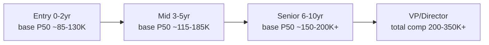

# Trading Operations Analyst 美国就业市场研究报告

本文只研究美国就业市场（United States only），不涉及中国大陆、欧洲、印度或东南亚的数据。研究对象是 Trading Operations Analyst（交易运营分析师，负责交易的清算、结算、对账等中后台工作）这一"岗位家族"（role family），而不是 Virtu Financial 一家公司的单个职位。参考雇主 Virtu 只是这个家族里的一个坐标点。学生状态为 Q1=B（有方向但还在权衡）、Q2=B（国际学生，需要 sponsorship），因此本文把薪资曲线、城市分布、公司类型讲得更细，并对 H1B 章节做扩展处理。

全文遵守一条铁律：只陈述事实与百分位数字，不做"值不值得""适不适合"的判断。判断权完全交给读者。

## 一、这个市场现在有多少岗位：存量与温度

先用大白话说清楚"存量"是什么。存量就是"此时此刻美国的招聘网站上，挂着多少个这类岗位在招人"。它像一个水池的当前水位，反映市场当下的冷热。要注意，一个岗位家族在招聘网站上的名字五花八门，同一份工作可能叫 Trading Operations Analyst、Trade Support Analyst、Trade Operations Analyst、Settlements Analyst、Middle Office Analyst 或 Operations Analyst，所以看存量不能只盯一个精确 title，要看整个家族。

截至 2026 年 7 月初的检索，LinkedIn 上美国的 "Trading Operations" 岗位显示为 2,000+ 个，其中纽约都会区 493 个 [5 - Trading Operations jobs in United States | LinkedIn](https://www.linkedin.com/jobs/trading-operations-jobs)。如果把范围放宽到相邻家族，"Trading Analyst" 显示 18,000+ 个，"Sales And Trading Analyst" 6,000+ 个，"Trade Analyst" 7,000+ 个，"Trading Desk Analyst" 5,000+ 个 [6 - Trading Analyst jobs in United States | LinkedIn](https://www.linkedin.com/jobs/trading-analyst-jobs)。需要提醒的是，LinkedIn 的岗位计数存在重复挂牌、过期未撤、以及"一个 JD 招多人"等噪声，所以这些数字只能读作"数量级"，不能当精确统计。精确 title "Trading Operations Analyst" 的纯净存量小于千级，属于一个相对窄的细分；但把它放回中后台运营的大家族里，则是一个数万级的常年招聘池。

要把这个数字放回官方口径校准，需要借助 BLS（Bureau of Labor Statistics，美国劳工统计局，美国就业与薪资数据的权威来源）的 SOC 职业编码。这个岗位家族横跨三个 SOC 编码：最贴近中后台清算结算的是 Brokerage Clerks（经纪事务文员，SOC 43-4011），2024 年全美约 40,800 人 [4 - Financial Clerks, Occupational Outlook Handbook](https://www.bls.gov/ooh/office-and-administrative-support/financial-clerks.htm)；偏交易与销售一侧的是 Securities, Commodities, and Financial Services Sales Agents（证券、商品与金融服务销售代理，SOC 41-3031），2024 年约 514,500 人 [2 - Securities, Commodities, and Financial Services Sales Agents, OOH](https://www.bls.gov/ooh/sales/securities-commodities-and-financial-services-sales-agents.htm)；偏分析一侧的是 Financial and Investment Analysts（金融与投资分析师，SOC 13-2051），2024 年约 368,500 人 [3 - Financial Analysts, Occupational Outlook Handbook](https://www.bls.gov/ooh/business-and-financial/financial-analysts.htm)。真实的 Trading Operations Analyst 散落在这三个桶里，其中做市商/自营的技术型运营更靠近分析师桶，银行/券商的传统清算结算更靠近 Brokerage Clerks 桶。

用百分位语言描述当前温度：finance 大类 2025 年全年共发布约 181,600 个职位，其中 business analyst 与 financial analyst 两类占了一半以上 [30 - Top Hiring Trends In Financial Services & Banking 2026 | talentMSH](https://www.talentmsh.com/insights/hiring-trends-statistics-financial-services-banking)。相对于软件工程师动辄数十万的存量，交易运营是一个"窄而稳"的市场：总量不大，但常年有人招。

## 二、招聘趋势：过去 12-24 个月是涨还是跌

存量是水位，趋势（flow）是水龙头的进水速度，看的是过去一到两年招聘在加速还是放缓。对一个要在三五年后才兑现的职业选择来说，趋势比存量更重要。

整体信号是"温和降温、结构分化"。2024 年金融服务业只有 49% 的招聘团队完成了招聘目标，低于 2023 年的 52%；65% 的机构报告 time-to-hire（从开岗到入职的周期）在拉长 [31 - Financial Services Hiring Trends 2025 | GoodTime](https://goodtime.io/blog/recruiting/financial-services-recruiting/)。更关键的一个结构性信号是初级岗位在收缩：2025 年 finance 每发布 1 个 entry-level 岗位，就发布 3 个 senior 岗位；同时新人第一年离职率从 2020 届的 26% 升到 2024 届的 33% [30 - Top Hiring Trends In Financial Services & Banking 2026 | talentMSH](https://www.talentmsh.com/insights/hiring-trends-statistics-financial-services-banking)。对刚毕业、要找 entry-level 交易运营的学生来说，这意味着"入口在变窄、竞争在变紧"。

行业景气和岗位景气不是一回事，这一点要专门点出。做市商（Citadel Securities、Jane Street、Jump、HRT 等）过去两年营收屡创新高，但他们扩张的主力是 quant researcher、trader、software engineer，中后台运营岗的扩张速度远低于交易与技术岗（做市商的 quant/trader H1B 中位数普遍在 $200,000 上下，见第三节）。也就是说，"行业在膨胀"不等于"这个岗位在膨胀"。运营岗位更多是随着交易量和监管复杂度被动增长，而不是被公司当作利润引擎主动堆人。

季节性方面，投行与券商的运营岗跟随 campus recruiting 周期，秋招（每年 9 月至 11 月）是新毕业生 analyst 岗位的投放高峰，做市商的 new grad 岗位则更早，很多在毕业前一年的夏秋就锁定。经验型（experienced hire）运营岗则全年滚动招聘，波动更平缓。这一段的判断置信度为中，主要因为公开的、按 title 细分的月度招聘指数难以获取（LinkedIn Workforce Report 未对该细分单列，属"无法核实"，见第九节）。

## 三、薪资曲线：entry / mid / senior 的 base 与 total

这一节是全文最关键的部分。先讲清楚薪酬的构成。一个 offer 通常包含四块：base（基本工资，每月固定发）、bonus（年终奖金，与个人和公司业绩挂钩，交易类岗位波动很大）、equity/RSU（股权，多为四年 vest 即分四年归属，折算年化要除以 4，做市商和银行的运营岗多为现金奖金而非股权）、sign-on（签字费，一次性，不能年化摊进每年）。BLS 的口径只含 base+bonus、不含股权，因此对高奖金岗位系统性偏低；Levels.fyi 与 Glassdoor 含更多总包；myvisajobs 与 h1bdata 的 LCA（Labor Condition Application，劳工条件申请，雇主在申请 H1B 前必须先向劳工部提交的工资承诺文件）只登记 base，是政府备案、绝对真实的底薪。理解了这几个口径的差异，下面的数字才不会打架。

这个岗位家族有一个必须先讲的事实：它内部是"两个世界"。一个是银行/券商/托管清算机构（Goldman Sachs、Morgan Stanley、Citi、DTCC、BNY、State Street）的传统交易处理岗，薪资偏文员区间；另一个是做市商/自营（Citadel Securities、Jane Street、Jump、HRT、DRW、IMC）的技术型交易运营岗，薪资显著更高。参考雇主 Virtu 的 base $125K-$140K，坐落在第二个世界。

### Entry level（0-2 年）

跨平台交叉验证 entry 段的 base：BLS 口径下 Brokerage Clerks 2024 年全美中位数（P50）$62,940，属于传统文员一侧的锚点 [1 - Brokerage Clerks, OEWS 43-4011 | BLS](https://www.bls.gov/oes/current/oes434011.htm)。Salary.com 2025 年 7 月对 Trading Operations Analyst 给出 P25 $68,253 / P50 $74,784 / P75 $79,015，方法上更偏传统运营样本 [8 - Trading Operations Analyst Salary | Salary.com](https://www.salary.com/research/salary/position/trading-operations-analyst-salary)。ZipRecruiter 2026 年 2 月给出 P25 $55,000 / P75 $88,500 / P90 $108,000 [9 - Trading Operations Analyst Salary | ZipRecruiter](https://www.ziprecruiter.com/Salaries/Trading-Operations-Analyst-Salary)。银行侧的 LCA base 佐证：Goldman Sachs 的 Associate Trade Processing 中位数 $81,150、Senior Analyst Trade Processing $86,000 [15 - Goldman Sachs H1B LCA filings | h1bgrader](https://h1bgrader.com/h1b-sponsors/goldman-sachs-bank-usa-dvk4yvnykw/lca/2025)。做市商侧的 entry 佐证：Virtu 在 Austin 的 Trading Operations Analyst，H1B LCA 共 9 条记录，base 中位数 $87,402 [13 - Trading Operations Analyst @ Virtu Financial, Austin | h1bdata](https://h1bdata.info/index.php?em=virtu+financial+operating+llc&job=trading+operations+analyst&city=austin)。综合看，entry base 的 P50 在传统机构约 $62K-$85K，在做市商约 $85K-$130K，纽约会明显高于其他城市。

### Mid level（3-5 年）

中段的最佳锚点是各家做市商的 LCA base 中位数，因为这些数字是政府备案、样本清晰：DRW Holdings 2024 年 37 条记录，base 中位数 $115,461 [16 - DRW Holdings LLC H1B Salary 2024 | h1bdata](https://h1bdata.info/index.php?year=2024&em=drw+holdings+llc)；Virtu 2025 年 21 条记录，base 中位数 $131,997 [11 - Virtu Financial Operating Employer Overview | myvisajobs](https://www.myvisajobs.com/employer/virtu-financial-operating/)；Jane Street 的 Trading Desk Operations 2024 年 24 条记录，base 中位数 $169,686（其中 29% 在 $200K 以上、42% 在 $150K-$200K）[14 - Trading Desk Operations @ Jane Street H1B Salary 2024 | h1bdata](https://h1bdata.info/index.php?em=jane+street&job=trading+desk+operations)；Hudson River Trading 2024 年 27 条记录，base 中位数 $185,000，全公司 H1B 中位数约 $170,000 [18 - Hudson River Trading LLC H1B LCA filings 2024 | h1bgrader](https://h1bgrader.com/h1b-sponsors/hudson-river-trading-llc-4l0ynolq2x/lca/2024)。银行侧的 mid 参考：Glassdoor 对 Trading Operations Analyst 全美给出平均 base $104,683、P25 $81,294 / P75 $136,354 / P90 $171,704（样本 51 条，截至 2026 年 5 月）[7 - Trading Operations Analyst Salary & Pay Trends | Glassdoor](https://www.glassdoor.com/Salaries/trading-operations-analyst-salary-SRCH_KO0,26.htm)。把这些叠起来看，mid base 的 P50 在做市商约 $115K-$185K，在银行/券商约 $90K-$140K。

### Senior level（6-10 年及以上）

高段公开、按 title 细分的样本较薄，只能用相邻家族与总包区间勾勒。跨公司口径下，Trading Analyst 家族在 h1bdata 有 60 条记录，base 中位数 $110,000（48% 落在 $100K-$150K）[20 - Trading Analyst H1B Salary 2024 | h1bdata](https://h1bdata.info/index.php?job=trading+analyst)。做市商的资深运营/交易台一侧，Jump Operations 2024 年 34 条记录，base 中位数高达 $200,000（85% 在 $200K 以上）[17 - Jump Operations LLC H1B Salary 2024 | h1bdata](https://h1bdata.info/index.php?year=2024&em=jump+operations+llc)，不过这个桶混入了偏交易的岗位，读作"运营与交易台上限"更准确。Levels.fyi 上 Financial Analyst 家族的跨公司中位数总包约 $127,250，做市商如 Chicago Trading 的 Financial Analyst 总包区间 $196K-$267K，投行如 Morgan Stanley $108K-$250K（L3 到 L5）[10 - Financial Analyst Salary | Levels.fyi](https://www.levels.fyi/t/financial-analyst)。可以这样理解上限：传统机构的运营岗晋升到 VP/Director 后 base 常在 $150K-$200K，加奖金总包 $200K-$300K；做市商的资深运营总包上探 $300K 甚至更高，但样本稀薄、波动巨大，属"数量级"而非"精确值"。

下面用图勾勒这条 base 曲线（做市商一侧，中位数量级，单位千美元）：

关于 Virtu 在同行中的位置：其 base $125K-$140K 与 21 条 LCA 记录的 base 中位数 $131,997 高度吻合 [11 - Virtu Financial Operating Employer Overview | myvisajobs](https://www.myvisajobs.com/employer/virtu-financial-operating/)。放在做市商同级里，这落在 DRW（$115K）与 Jane Street/HRT（$170K-$185K）之间，大致处于做市商运营 base 的 P25-P50 区间；放在整个岗位家族（含银行文员一侧）里，则明显处于 P50 以上。这是对坐标位置的客观描述，不含任何"高薪/划算"的评价。

## 四、谁在招人：公司类型与 top hirers

先讲清楚"谁在招"为什么重要。同一个 title，在不同类型的公司里，薪资、签证态度、工作强度、成长天花板都完全不同。这个岗位家族的招聘方大致可分为四类。

第一类是做市商与自营交易公司（proprietary trading / market makers）：Citadel Securities、Jane Street、Jump Trading、Hudson River Trading、DRW、IMC、Flow Traders、Belvedere、CTC 等。它们是薪资最高的一档，运营岗普遍要求 SQL、Python 等技术栈，招聘门槛偏量化，Virtu 属于这一类（上市代码 NASDAQ: VIRT）。第二类是投行与券商（bulge bracket / broker-dealer）：Goldman Sachs、Morgan Stanley、JPMorgan、Citi、Bank of America。它们体量大、岗位多、层级清晰（analyst → associate → VP → director），是 entry-level 运营岗的最大批量入口。JPMorgan 一家 2025 财年就提交了 3,534 份 H1B LCA，在全美所有雇主中排名第 12 [21 - JPMorgan Chase & CO H1B LCA filings 2024 | h1bgrader](https://h1bgrader.com/h1b-sponsors/jpmorgan-chase-and-co-5g2r7gdekl/lca/2024)。第三类是清算与托管机构（clearing / custody）：DTCC、BNY、State Street。它们是市场的"基础设施"，运营岗数量多但薪资偏文员区间，且 H1B 赞助明显偏保守（DTCC 主体 2025 财年 LCA 申报为 0，见第六节）。第四类是交易所与金融科技（exchanges / fintech）：Tradeweb、The Trade Desk 等，Tradeweb 2024 年 H1B 中位数 $165,000、The Trade Desk $150,200 [20 - Trading Analyst H1B Salary 2024 | h1bdata](https://h1bdata.info/index.php?job=trading+analyst)。

按公司规模看分布：万人以上的大银行（10,000+ headcount）贡献了最大批量的 entry-level 运营岗；做市商多为 1,000-10,000 人规模，岗位精、薪资高、门槛严；纯 startup（<100 人）在这个家族里占比很低，因为交易运营天然依附于有实盘交易量的成熟机构。按行业看，几乎 100% 集中在 fintech/金融本身，跨界到 healthtech、通用科技的极少。这与软件工程师"遍地开花"的分布形成鲜明对比。

按 top hirers 的活跃度排序（以公开招聘与 H1B 申报量为代理指标），批量最大的是 JPMorgan、Goldman Sachs、Morgan Stanley、Citi 等大行，其次是 Citadel Securities、Jane Street、Jump、HRT、DRW 等做市商，再次是 DTCC、BNY、State Street 等清算托管机构。对国际学生而言，这个排序还要叠加"是否 sponsor"这一维度重新洗牌（见第六节）。

## 五、地理分布与 remote 政策

先说地理为什么集中。交易运营必须贴近交易台、清算系统和监管注册地，天然向金融中心聚拢，不像纯软件岗可以分散到全国。这个岗位家族的城市高度集中在少数几个金属圈。

第一梯队是纽约都会区（New York / Jersey City）：它是绝对核心，LinkedIn 上纽约的 Trading Operations 岗位 493 个，占全美该 title 的相当比例 [5 - Trading Operations jobs in United States | LinkedIn](https://www.linkedin.com/jobs/trading-operations-jobs)。投行总部、做市商、DTCC 均在此，且很多运营岗设在河对岸的 Jersey City 以降低成本。第二梯队是芝加哥（Chicago）：衍生品与期货重镇，DRW、Jump、IMC、CBOE 生态集中，很多岗位要求每周至少 4 天在交易楼层。第三梯队是德州（Austin / Dallas / Plano）：近年金融业务西迁的主要承接地，Virtu 的运营中心即设在 Austin，JPMorgan 在 Plano 的 641 名 H1B 员工中位数 $150,000 [22 - Goldman Sachs & JPMorgan H1B pay | eFinancialCareers](https://www.efinancialcareers.com/news/h1b-visa-pay-banking)。其他分布点包括盐湖城（Salt Lake City，Goldman 的成本中心）、夏洛特、坦帕等。

同一级别在不同城市的 base 有明显差异。以 JPMorgan 的 H1B 样本为例，纽约的 490 人 base 中位数 $175,000，而 Plano 的 641 人为 $150,000，差约 17% [22 - Goldman Sachs & JPMorgan H1B pay | eFinancialCareers](https://www.efinancialcareers.com/news/h1b-visa-pay-banking)。纽约名义薪资最高，但生活成本（cost of living）也最高，Austin/Dallas 名义薪资略低但无州所得税、房租更低，实际可支配收入的差距小于名义差距。这是对薪资-成本比的客观描述，不含取舍建议。

remote 政策方面，这是这个家族与软件岗最大的不同之一：交易运营几乎是全行业最"回办公室"的岗位。原因有二。一是技术与合规：交易员和运营需要低延迟系统、受监管的通讯留痕，FINRA（Financial Industry Regulatory Authority，美国金融业监管局）自 2025 年起要求远程办公点登记并每三年检查一次，直接推动银行把人叫回 [29 - Wall Street Tug-of-War over RTO | Cohesion](https://www.cohesionib.com/post/finance-industry-return-to-office)。二是雇主政策：JPMorgan 2025 年初要求所有 hybrid 员工恢复每周 5 天到岗，Goldman、Citi 对交易等强监管岗位普遍要求 5 天，芝加哥的做市商运营岗要求每周至少 4 天在交易楼层 [28 - Why Banks Are Ordering Workers Back to Office | Forbes](https://www.forbes.com/sites/jackkelly/2024/06/03/banks-brokerage-firms-return-to-office/)。因此这个家族里 fully remote 的岗位占比极低，主流是 fully in-office 或 4 天 hybrid。对需要在特定城市落地的国际学生来说，这意味着"必须搬到金融中心"。

## 六、H1B 与签证友好度（扩展版）

由于学生为 Q2=B（国际学生，需要 sponsorship），本节做扩展处理。先讲清楚整条链路。国际学生毕业后通常先用 OPT（Optional Practical Training，F-1 签证毕业后的实习工作许可，STEM 专业可延长至 36 个月）合法工作，之后雇主需为其申请 H1B（针对 specialty occupation 的工作签证，需先抽签中签再由雇主提交 petition），而在提交 H1B 之前，雇主必须先向劳工部提交 LCA（Labor Condition Application，登记承诺工资）。整个能否留下的关键，是雇主"愿不愿意 sponsor"。

先看整体大盘。H1B 在 FY2025 的整体批准率约 97.9%（USCIS 审结 415,275 份，批准 406,349 份，拒绝 8,926 份）[23 - H-1B filings rise 7% in FY2025 but approvals drop | Business Standard](https://www.business-standard.com/immigration/h-1b-filings-rise-7-in-fy2025-but-approvals-drop-17-8-uscis-data-126022600421_1.html)。也就是说，一旦雇主愿意提交且岗位符合专业要求，被拒的概率很低。真正的门槛不在批准率，而在"抽签中签"和"雇主是否愿意出手"。

再看这个岗位家族过去 12 个月的申报量与 top sponsors（按 LCA 中位 base，均为政府备案的真实底薪）。做市商一侧普遍友好且薪资高：Jane Street 的 Trading Desk Operations 2024 年 24 条 LCA，中位 $169,686 [14 - Trading Desk Operations @ Jane Street | h1bdata](https://h1bdata.info/index.php?em=jane+street&job=trading+desk+operations)；Hudson River Trading 27 条、中位 $185,000 [18 - Hudson River Trading H1B LCA 2024 | h1bgrader](https://h1bgrader.com/h1b-sponsors/hudson-river-trading-llc-4l0ynolq2x/lca/2024)；Jump Operations 34 条、中位 $200,000 [17 - Jump Operations LLC H1B 2024 | h1bdata](https://h1bdata.info/index.php?year=2024&em=jump+operations+llc)；DRW Holdings FY2022-2024 共 92 份 LCA、2024 年 37 条中位 $115,461 [16 - DRW Holdings LLC H1B 2024 | h1bdata](https://h1bdata.info/index.php?year=2024&em=drw+holdings+llc)；IMC Americas 11 条、中位 $150,000 [19 - IMC Americas Inc H1B Salary | h1bdata](https://h1bdata.info/index.php?em=imc+americas+inc)。参考雇主 Virtu FY2022-2024 共提交 91 份 LCA、11 份绿卡 LC，FY2025 提交 32 份 I-129 petition（30 批准、2 拒绝），Trading Operations Analyst 在 Austin 的 9 条 LCA 中位 $87,402 [11 - Virtu Financial Operating Overview | myvisajobs](https://www.myvisajobs.com/employer/virtu-financial-operating/)，可见 Virtu 会为该 title 直接 sponsor，是明确的正向信号。

银行一侧是最大批量的 sponsor，但运营岗底薪偏低。JPMorgan 2025 财年提交 3,534 份 LCA、全美排名第 12，2024 年 2,131 条记录中位 $153,600 [21 - JPMorgan Chase & CO H1B LCA 2024 | h1bgrader](https://h1bgrader.com/h1b-sponsors/jpmorgan-chase-and-co-5g2r7gdekl/lca/2024)；Goldman Sachs & Co. LLC 2025 财年 1,346 份 LCA、批准率约 99%、中位 $120,000，且有 100 多个 H1B 岗位 base 在 $100K 以下，多为纽约、盐湖城、达拉斯的 entry-level analyst [39 - Goldman Sachs Employer Overview | myvisajobs](https://www.myvisajobs.com/employer/goldman-sachs/)。Goldman 与 JPMorgan 合计在 2025 年为至少 3,933 人申报 H1B，超过 Morgan Stanley、BofA、Citi、Barclays、Deutsche Bank、UBS 之和 [22 - Goldman Sachs & JPMorgan H1B pay | eFinancialCareers](https://www.efinancialcareers.com/news/h1b-visa-pay-banking)。这说明大行是国际学生进入运营岗的最大门，但底薪相对做市商低一档。

有一类机构要专门警示：清算托管一侧的 sponsor 意愿明显偏弱。DTCC 的一个主体 2025 财年 LCA 申报为 0 [搜索来源见附录，属"无法核实其它主体口径"]，读作 DTCC/BNY/State Street 这类基础设施机构对国际新人的 sponsor 通道较窄，需逐一核实具体法人实体后再判断。

哪些板块基本不 sponsor，必须明确点出。任何要求 security clearance（安全许可）的岗位，几乎都要求美国公民身份，绿卡持有者通常也无法获得 Secret / Top Secret 级别 [26 - Security Clearances and Immigration | OpenSphere](https://opensphere.ai/immigration-resources/security-clearances-and-immigration-what-defense-government-and-contractor-workers-need-to-know)。受 ITAR（International Traffic in Arms Regulations，国际武器贸易条例，管制军民两用与国防技术出口）约束的岗位只允许 "U.S. Persons"（公民、绿卡、难民、庇护者）接触 [27 - Aerospace Jobs and the ITAR Citizenship Wall | F1Jobs](https://www.f1jobs.io/resources/blog/aerospace-jobs-international-students-itar)。国防承包商、政府合同、涉密岗位因此对国际学生基本关闭。所幸交易运营多在商业金融机构，绝大多数不涉密、不受 ITAR，这是该家族对国际学生相对友好的一面；但个别为政府或军方做清算的岗位仍可能要求公民身份，投递前需看 JD 中的 "US citizenship required" 字样。

按公司类型总结签证友好度：做市商（Jane Street、HRT、Jump、DRW、IMC、Virtu）friendly 且薪资高，但岗位少、门槛高；大投行（Goldman、JPMorgan、Morgan Stanley、Citi）friendly 且批量大，是最现实的入口，但运营岗底薪偏低；清算托管（DTCC、BNY、State Street）通道偏窄，需个案核实；国防/涉密板块基本关闭。

最后是一个必须知道的重大政策变量。2025 年 9 月 19 日，总统签署 Proclamation "Restriction on Entry of Certain Nonimmigrant Workers"，要求 2025 年 9 月 21 日之后提交的"新" H1B petition 附带 10 万美元费用 [24 - Presidential Proclamation on Nonimmigrant Workers | USCIS](https://www.uscis.gov/newsroom/alerts/presidential-proclamation-on-restriction-on-entry-of-certain-nonimmigrant-workers)。关键细节对国际学生极其重要：该费用主要针对"从美国境外入境"的新申请，而在美国境内由 F-1/OPT 身份 change of status 转 H1B 的人，以及现有 H1B 的续签，通常不适用此费 [25 - $100,000 H-1B Fee Causes Chaos | American Immigration Council](https://www.americanimmigrationcouncil.org/blog/100000-h1b-fee-unaffordable-companies/)。该框架有效期 12 个月、可续，且已被多起诉讼挑战，最终执行口径仍在变动中，属于中低置信度的移动目标。它对愿意 sponsor 的雇主构成新的成本与不确定性，但对"在美国境内从 OPT 转 H1B"的典型路径影响相对可控。

## 七、未来 3-5 年招聘量预测

先说清楚这一节和"行业前景"的区别。行业可以营收翻倍，同一个岗位却因为自动化吸收了人力而缩编。这里只谈这个岗位家族的招聘量走向。

官方十年口径给出的是"分化下行"。BLS 的 Occupational Outlook Handbook（职业展望手册，美国官方十年职业预测）显示：最贴近中后台清算的 Brokerage Clerks，2024-2034 年就业预计从约 40,800 降到 36,900，约 -9.5%，明确写明"productivity-enhancing technology 将限制该岗位需求" [4 - Financial Clerks, OOH | BLS](https://www.bls.gov/ooh/office-and-administrative-support/financial-clerks.htm)。整个 Financial Clerks 大类 2024-2034 预计 -5%，但因退休与转岗，每年仍有约 102,200 个空缺 [4 - Financial Clerks, OOH | BLS](https://www.bls.gov/ooh/office-and-administrative-support/financial-clerks.htm)。偏销售一侧的 Securities/Commodities Sales Agents 预计 +3%（约平均水平），每年约 38,100 个空缺 [2 - Securities, Commodities Sales Agents, OOH | BLS](https://www.bls.gov/ooh/sales/securities-commodities-and-financial-services-sales-agents.htm)。偏分析一侧的 Financial Analysts 预计 +6%（快于平均），每年约 29,900 个空缺 [3 - Financial Analysts, OOH | BLS](https://www.bls.gov/ooh/business-and-financial/financial-analysts.htm)。

把这三条线合成一个判断：Trading Operations Analyst 家族的走向取决于它更靠哪一端。纯手工清算结算（Brokerage Clerks 一侧）在净收缩（约 -5% 到 -10%），而带 SQL/Python、能做异常处理与自动化的技术型运营（更靠 Analyst 一侧）持平到小幅增长（约 0% 到 +6%）。Virtu 这类做市商的运营岗要求编程，属于后者。综合三个官方序列，未来五年该家族的总招聘量最可能是"零增长到温和下行"，且内部结构从"多人做重复处理"转向"少人做例外与建设"。这个合成判断的置信度为中：三条 BLS 序列方向一致（重复性文员降、分析型稳增），但该 title 横跨编码、无单一官方序列，且 BLS 数据本身滞后 1-2 年。

短期市场信号与长期口径一致。前述 2025 年 finance"每 1 个 entry 岗对 3 个 senior 岗"的结构 [30 - talentMSH](https://www.talentmsh.com/insights/hiring-trends-statistics-financial-services-banking)，以及有分析称金融人才存在"泡沫破裂风险"[38 - The Finance Talent Bubble | BambooHR](https://www.bamboohr.com/resources/data-at-work/data-stories/april-finance-2026)，都指向初级运营岗入口收窄。因此对刚毕业的国际学生，"入口竞争加剧"这一短期信号，与"重复性运营长期缩编"这一长期信号，方向是叠加的。

## 八、AI 与自动化替代风险

先用大白话定义两个词。displacement（替代）是"AI 把整个岗位吃掉、人被裁掉"；augmentation（增强）是"AI 帮人把活干得更快、人还在，只是一个人顶原来几个人"。对交易运营这种以重复流程为主的岗位，两种力量同时存在，谁占主导决定了岗位命运。

学术与智库的基线判断。OpenAI 的 "GPTs are GPTs"（Eloundou 等，2023/2024，发表于 Science）用 O*NET 任务清单评估 LLM 的暴露度，以"节省 50% 时间"为阈值，发现 GPT-4 能影响 80% 美国劳动力至少 10% 的任务，而以文书处理为主的职业暴露度处于最高一档 [34 - GPTs are GPTs | arXiv 2303.10130](https://ar5iv.labs.arxiv.org/html/2303.10130)。Anthropic Economic Index（基于约百万条真实 Claude 对话映射到 O*NET 任务）给出的整体结构是 57% 任务为增强、43% 为自动化 [35 - Introducing the Anthropic Economic Index | Anthropic](https://www.anthropic.com/news/the-anthropic-economic-index)。这两项研究都说明：交易运营的核心任务（对账、确认、结算、异常排查、报表）正是 LLM 与 RPA（Robotic Process Automation，机器人流程自动化）暴露度最高的那类。

行业侧的结构性推手是 T+1 与 STP。2024 年美国证券结算周期从 T+2 缩短到 T+1（交易后第二天变为第一天完成结算），把中后台的处理时间压缩了约 50%，跨境结算的时间压力更是减少约 80%，直接倒逼机构上 STP（straight-through processing，直通式处理，交易从下单到结算全程无人工干预）与 RPA [32 - Navigating T+1 settlement | HCLTech](https://www.hcltech.com/blogs/post-tplus1-go-live-reduction-in-trade-settlement-cycle-calls-for-agility-and-resilience)。DTCC 要求至少 90% 的交易在交易日晚 9 点前完成 affirmation，把人工确认往自动化逼。这意味着"人守着屏幕手工对账"的工作正在被系统吞掉，留下的是"处理系统吐不出来的例外"和"搭建/维护自动化流程"。

替代规模的两种声音要并列呈现。看多替代一侧：Bloomberg Intelligence 调研估计华尔街未来 3-5 年可能削减约 200,000 个岗位，中后台与运营是首当其冲的高风险区，任何重复性任务都在射程内 [36 - How AI Is Driving 200,000 Layoffs on Wall Street | Forbes](https://www.forbes.com/sites/chriswestfall/2025/01/13/how-ai-revolution-is-driving-200000-layoffs-on-wall-street/)；Citi 分析称银行业约 54% 的岗位有高自动化潜力，是所有行业中最高 [36 - Forbes](https://www.forbes.com/sites/chriswestfall/2025/01/13/how-ai-revolution-is-driving-200000-layoffs-on-wall-street/)。看空一侧：Fortune 引述多位专家认为，华尔街的 AI 裁员"炒作大于实际"，很多被归因于 AI 的裁员其实是周期与成本因素，且部分岗位会被悄悄转到离岸低薪地重新雇人（Forrester 预测约一半 AI 裁员会被离岸回补）[37 - Is AI really killing finance jobs? | Fortune](https://fortune.com/2025/12/21/is-ai-killing-finance-and-banking-jobs-experts-say-wall-street-layoffs-hype-than-takeover/)。

综合打分（均附置信度）。displacement 替代风险：对纯手工清算结算一侧为"高"（BLS 官方已给出净收缩，任务与 LLM/RPA 高度重叠，置信度高）；对带编程、做例外处理与自动化建设的技术型运营为"中"（工具吃掉重复劳动，但异常判断、监管沟通、系统搭建仍需人，置信度中）。augmentation 增强潜力：为"高"。掌握 SQL、Python、能驾驭自动化工具的人，生产力乘数明显，一个人管的交易量与流程会大幅增加。未来五到十年最可能的形态是：岗位总量温和收缩，单个岗位的技术含量上升，"运营文员"逐步演化为"运营工程师 / 自动化与异常管理者"，人数更少、单价更高、编程与数据能力成为硬门槛（与 03-role.md 的演化判断相互印证）。这一合成判断置信度为中，因为看多与看空两派并存，且离岸外包这一变量会稀释"AI 直接替代"的净效应。

## 九、无法核实的部分

以下几项在本轮检索中未能用权威来源坐实，列明供读者进一步向学长、招聘方或职业顾问求证。

- LinkedIn Workforce Report 未对 "Trading Operations Analyst" 这一细分单列月度 hiring rate 指数，第二节的同比趋势主要用 finance 大类与结构性信号推断，属中置信度。
- 精确 title "Trading Operations Analyst" 在全美的实时开放存量，各招聘平台口径不一（LinkedIn 显示 2,000+ 的是更宽的 "Trading Operations"），窄口径的精确数字未能锁定。
- DTCC、BNY、State Street 具体法人实体的 H1B sponsor 口径存在多主体、易混淆的问题，本文只核实到"DTCC 某主体 2025 财年 LCA 为 0"，不能据此判定整个集团完全不 sponsor，需逐一核实实体名。
- Senior 段（6-10 年）按精确 title 的总包 P25/P75 样本稀薄，第三节高段区间用相邻家族与做市商桶推断，属"数量级"。
- Levels.fyi 对纯 "Trading Operations Analyst" 这一非工程 title 的样本覆盖薄，comp 主要借 Financial Analyst 家族与 LCA base 交叉推断，股权/奖金的年化拆分对该家族多为现金奖金、股权占比低。
- 2025 年 9 月的 10 万美元 H1B 新费仍在诉讼与指引调整中，最终对金融雇主 sponsor 意愿的净影响属移动目标，置信度中低。

## 附录：Sources

1. [Brokerage Clerks, OEWS 43-4011 | BLS](https://www.bls.gov/oes/current/oes434011.htm)
2. [Securities, Commodities, and Financial Services Sales Agents, Occupational Outlook Handbook | BLS](https://www.bls.gov/ooh/sales/securities-commodities-and-financial-services-sales-agents.htm)
3. [Financial Analysts, Occupational Outlook Handbook | BLS](https://www.bls.gov/ooh/business-and-financial/financial-analysts.htm)
4. [Financial Clerks, Occupational Outlook Handbook | BLS](https://www.bls.gov/ooh/office-and-administrative-support/financial-clerks.htm)
5. [Trading Operations jobs in United States | LinkedIn](https://www.linkedin.com/jobs/trading-operations-jobs)
6. [Trading Analyst jobs in United States | LinkedIn](https://www.linkedin.com/jobs/trading-analyst-jobs)
7. [Trading Operations Analyst: Average Salary & Pay Trends 2026 | Glassdoor](https://www.glassdoor.com/Salaries/trading-operations-analyst-salary-SRCH_KO0,26.htm)
8. [Trading Operations Analyst Salary | Salary.com](https://www.salary.com/research/salary/position/trading-operations-analyst-salary)
9. [Trading Operations Analyst Salary | ZipRecruiter](https://www.ziprecruiter.com/Salaries/Trading-Operations-Analyst-Salary)
10. [Financial Analyst Salary | Levels.fyi](https://www.levels.fyi/t/financial-analyst)
11. [Virtu Financial Operating - Employer Overview, H1B Visas, Salaries | MyVisaJobs](https://www.myvisajobs.com/employer/virtu-financial-operating/)
12. [Virtu Financial Operating LLC Trading Operations Analyst LCA 2025 | h1bgrader](https://h1bgrader.com/h1b-sponsors/virtu-financial-operating-llc-6g065gnqkq/lca/trading-operations-analyst-okprryon24/c/2025)
13. [Trading Operations Analyst @ Virtu Financial, Austin H1B Salary | h1bdata](https://h1bdata.info/index.php?em=virtu+financial+operating+llc&job=trading+operations+analyst&city=austin)
14. [Trading Desk Operations @ Jane Street H1B Salary 2024 | h1bdata](https://h1bdata.info/index.php?em=jane+street&job=trading+desk+operations)
15. [Goldman Sachs Bank USA H1B LCA filings for year 2025 | h1bgrader](https://h1bgrader.com/h1b-sponsors/goldman-sachs-bank-usa-dvk4yvnykw/lca/2025)
16. [DRW Holdings LLC H1B Salary 2024 | h1bdata](https://h1bdata.info/index.php?year=2024&em=drw+holdings+llc)
17. [Jump Operations LLC H1B Salary 2024 | h1bdata](https://h1bdata.info/index.php?year=2024&em=jump+operations+llc)
18. [Hudson River Trading LLC H1B LCA filings for year 2024 | h1bgrader](https://h1bgrader.com/h1b-sponsors/hudson-river-trading-llc-4l0ynolq2x/lca/2024)
19. [IMC Americas Inc H1B Salary | h1bdata](https://h1bdata.info/index.php?em=imc+americas+inc)
20. [Trading Analyst H1B Salary 2024 | h1bdata](https://h1bdata.info/index.php?job=trading+analyst)
21. [JPMorgan Chase & CO H1B LCA filings for year 2024 | h1bgrader](https://h1bgrader.com/h1b-sponsors/jpmorgan-chase-and-co-5g2r7gdekl/lca/2024)
22. [Goldman Sachs & JPMorgan barely pay H1B holders $145k on average | eFinancialCareers](https://www.efinancialcareers.com/news/h1b-visa-pay-banking)
23. [H-1B filings rise 7% in FY2025 but approvals drop 17.8%: USCIS data | Business Standard](https://www.business-standard.com/immigration/h-1b-filings-rise-7-in-fy2025-but-approvals-drop-17-8-uscis-data-126022600421_1.html)
24. [Presidential Proclamation on Restriction on Entry of Certain Nonimmigrant Workers | USCIS](https://www.uscis.gov/newsroom/alerts/presidential-proclamation-on-restriction-on-entry-of-certain-nonimmigrant-workers)
25. [$100,000 H-1B Fee Causes Chaos, Likely Unaffordable for Many Companies | American Immigration Council](https://www.americanimmigrationcouncil.org/blog/100000-h1b-fee-unaffordable-companies/)
26. [Security Clearances and Immigration | OpenSphere](https://opensphere.ai/immigration-resources/security-clearances-and-immigration-what-defense-government-and-contractor-workers-need-to-know)
27. [Aerospace Jobs and the ITAR Citizenship Wall | F1Jobs](https://www.f1jobs.io/resources/blog/aerospace-jobs-international-students-itar)
28. [Why Banks And Brokerage Firms May Be Ordering Workers To Return To The Office | Forbes](https://www.forbes.com/sites/jackkelly/2024/06/03/banks-brokerage-firms-return-to-office/)
29. [Wall Street Tug-of-War: The Battle Over Remote, Hybrid, and RTO | Cohesion](https://www.cohesionib.com/post/finance-industry-return-to-office)
30. [Top Hiring Trends In Financial Services & Banking In 2026 | talentMSH](https://www.talentmsh.com/insights/hiring-trends-statistics-financial-services-banking)
31. [Financial Services Hiring Trends and Stats for 2025 | GoodTime](https://goodtime.io/blog/recruiting/financial-services-recruiting/)
32. [Navigating T+1 settlement: Agility and resilience in finance | HCLTech](https://www.hcltech.com/blogs/post-tplus1-go-live-reduction-in-trade-settlement-cycle-calls-for-agility-and-resilience)
33. [Agentic AI for Middle Office: Reshaping Trade Processing | Tredence](https://www.tredence.com/blog/agentic-ai-middle-office-trade-processing)
34. [GPTs are GPTs: An Early Look at the Labor Market Impact Potential of LLMs | arXiv 2303.10130](https://ar5iv.labs.arxiv.org/html/2303.10130)
35. [Introducing the Anthropic Economic Index | Anthropic](https://www.anthropic.com/news/the-anthropic-economic-index)
36. [How AI Revolution Is Driving 200,000 Layoffs On Wall Street | Forbes](https://www.forbes.com/sites/chriswestfall/2025/01/13/how-ai-revolution-is-driving-200000-layoffs-on-wall-street/)
37. [Is AI really killing finance and banking jobs? | Fortune](https://fortune.com/2025/12/21/is-ai-killing-finance-and-banking-jobs-experts-say-wall-street-layoffs-hype-than-takeover/)
38. [The Finance Talent Bubble Is at Risk of Bursting in 2026 | BambooHR](https://www.bamboohr.com/resources/data-at-work/data-stories/april-finance-2026)
39. [Goldman, Sachs - Employer Overview, H1B Visas, Salaries | MyVisaJobs](https://www.myvisajobs.com/employer/goldman-sachs/)
40. [H-1B visa fees rise to US$100,000, Goldman and JPMorgan most affected | IDNFinancials](https://www.idnfinancials.com/news/57403/h-1b-visa-fees-rise-to-us100-000-goldman-and-jpmorgan-most-affected)
