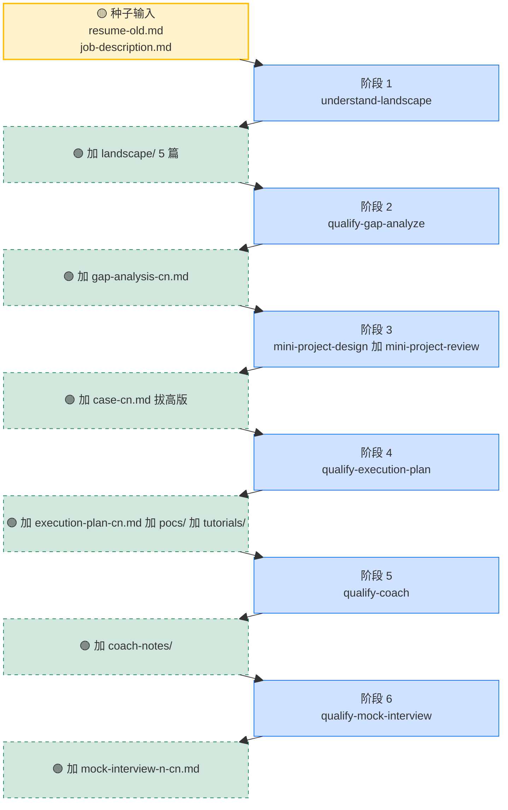
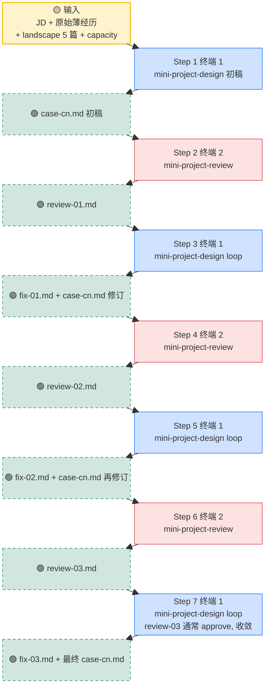

# 从薄简历到面试就绪: 项目设计与 Gap 填充工作流

> 这是 examples 系列里的第七篇. 上一篇 06 把"准备项目素材"分成了三条路, 这一篇专门展开方法二: 把已有项目拔高精修, 并且把整个工作流的链路说清楚.

## 1. 课程导读

06 里我们讲了项目素材准备的三条路. 其中方法二 (拔高已有项目) 是大多数大三大四以上学生最常用的路径. 你已经实习过, 做过项目, 只是这些经历的深度不够撑起你想投的岗位.

这一篇专门展开方法二的工作流. 它的本质是 **"以终为始"地重新设计已有经历**: 拿一份薄简历加一个目标 JD 作为起点, 把简历上**已有的那段薄经历**按"3 到 6 个月能够得着的程度"重新设计成一个新的, 更深的项目版本, 让它**对得上目标岗位的要求**.

注意这一节我们还**没在写任何 bullet**, 那是后面 [09-write-bullets](../09-write-bullets/README-cn.md) 才教的内容. 这一节做的事是**把项目 case 给拔高**, 相当于以"我要 qualify 这个 JD"为终点, 反过来设计一个新版本的项目经历. case 拔高完之后, 它一份顶两份用: 往前是后面写拔高版 bullet 的素材, 往后是你接下来 3 到 6 个月**要么在脑子里把它做一遍, 要么真动手把它做出来**的施工蓝图.

听起来抽象, 但这个流程是有具体形状的. 我们用 John Doe 的实际产出走一遍.

---

## 2. 工作流的本质: 输入叠加

> **本节先做什么的小提示**: 这一节是产物清单加一张架构图, 信息密度大. 第一遍读不需要把 9 类产物的每个文件名都记住, 跑通一遍工作流之后再回头看会更顺. 这一节就当"链路整体形状"的 catalog, 后面 §4 会一阶段一阶段把它讲透.

先说核心机制. 这个工作流不是一个黑盒, 它是 **6 个阶段的链路**, 起点是"一份薄简历加一个目标 JD", 终点是"面试就绪的全套素材". 每一阶段都遵循同一条规则:

- 拿前面所有阶段累积下来的产物当输入
- 在它们的基础上多产出一些新信息
- 把"前面的产物加上新产物"打包, 传给下一阶段

走完 6 个阶段, 你手上会累积 9 类"产物"文件. 在看下面那张图之前, 先把每个产物是什么, 放在哪过一遍, 不然图里突然冒出来的文件名容易让人懵:

- [`resume-old.md`](../../students/john-doe/resume-old.md): 学生进入工作流之前那份"写得不太行"的薄简历.
- [`job-description.md`](../../students/john-doe/experiences/from-2025-06-to-2025-09-CedarRidge-maternity-bi-agent/qualify-for-Cascadia-Health-Insights-AI-Solutions-Engineer/job-description.md): 学生选中的目标岗位招聘描述, 后面所有阶段反向校准的锚点.
- 原始薄经历 [`...sql-reporting-cn.md`](../../students/john-doe/experiences/from-2025-06-to-2025-09-CedarRidge-maternity-sql-reporting-cn.md): 简历上那段薄实习或项目的展开文档, 是 07 工作流要拔高的原材料.
- [`landscape/`](../../students/john-doe/experiences/from-2025-06-to-2025-09-CedarRidge-maternity-bi-agent/qualify-for-Cascadia-Health-Insights-AI-Solutions-Engineer/landscape/) 5 篇: 用做风投尽调的力气调研"行业 / 公司 / 角色 / 市场"4 篇深篇加 1 篇 index, 让 AI 真正"懂"这个岗位背后的世界 (这一篇 skill 来自前置课程 career_planning).
- [`gap-analysis-cn.md`](../../students/john-doe/experiences/from-2025-06-to-2025-09-CedarRidge-maternity-bi-agent/qualify-for-Cascadia-Health-Insights-AI-Solutions-Engineer/gap-analysis-cn.md): 拿 JD 加 landscape 跟当前简历比对的诚实差距诊断, 每条 gap 按 🔴 Core / 🟡 Important / 🟠 Nice-to-have 三档拆开.
- [`case-cn.md`](../../students/john-doe/experiences/from-2025-06-to-2025-09-CedarRidge-maternity-bi-agent/qualify-for-Cascadia-Health-Insights-AI-Solutions-Engineer/case-cn.md) 拔高版: 把原始薄经历重新设计成够得着 JD 的项目设计文档. **整套工作流最核心的产物**, 既是后续写拔高版 bullet 的素材, 也是接下来 3 到 6 个月真去施工时的设计蓝图.
- [`execution-plan-cn.md`](../../students/john-doe/experiences/from-2025-06-to-2025-09-CedarRidge-maternity-bi-agent/qualify-for-Cascadia-Health-Insights-AI-Solutions-Engineer/execution-plan-cn.md) 加 [`pocs/`](../../students/john-doe/experiences/from-2025-06-to-2025-09-CedarRidge-maternity-bi-agent/qualify-for-Cascadia-Health-Insights-AI-Solutions-Engineer/pocs/) 加 [`tutorials/`](../../students/john-doe/experiences/from-2025-06-to-2025-09-CedarRidge-maternity-bi-agent/qualify-for-Cascadia-Health-Insights-AI-Solutions-Engineer/tutorials/): 拆 gap 得到的"填补差距"三件套, 学习计划加每个 gap 一个 mini-POC 加配套教程.
- `coach-notes/`: 跟 AI coach 一起学概念时产出的笔记加进度表, 动态生成于 [qualify-for 目录](../../students/john-doe/experiences/from-2025-06-to-2025-09-CedarRidge-maternity-bi-agent/qualify-for-Cascadia-Health-Insights-AI-Solutions-Engineer/) 下, 本仓库示例里没展开.
- `mock-interview-{n}-cn.md`: 跟 AI 模拟面试官问答的转录加 debrief, 同样动态生成于上面那个 qualify-for 目录下.

**为什么这堆产物加在一起能撑起"面试就绪"?** 这 9 类产物一层一层堆出了"这个项目我真懂"的证据链: landscape 让你看 JD 的眼光跟别人不一样, gap 分析让你知道自己差在哪, 拔高 case 描述你这段经历真正长什么样, POC 让你掏得出代码 demo, coach notes 让你能在白板前讲清每个技术选型, mock 让你提前在压测里暴露弱点. 9 份摞起来, 等于一个能坐进面试间, 被任何角度追问都接得住的求职者. **信息密度的累积是非线性的**, 这就是这套工作流的真正杠杆.

下面这张图把这种累积过程画出来. 整张图分成两列:

- **左列"累积产物"**: 从上往下越积越厚. 最上面那个**实线方框**是初始的种子输入 (薄简历 + 目标 JD), 下面每一行的**虚线方框**是阶段跑完后新增进来的产物.
- **右列"阶段"**: 从上往下依次是 6 个阶段, 每行一个.

每一行的逻辑都一样: **左列当前累积的所有产物**斜着指向**右列这一行的阶段**当输入, 阶段跑完后斜着指回**左列下一行**新增一份产物. 所以左列从上到下越来越长, 最底下落下来的就是 case 拔高版加全套实操文档.



阶段 6 的 mock 面试官手里其实拿着完整的一整套资料 (简历 + JD + landscape 5 篇 + gap 分析 + 拔高 case + fill plan + POC + 学习笔记), 跟一个真正"很了解你"的面试官没本质区别.

> 注: 这个 6 阶段, 输入叠加的形状不是"为目标岗位拔高项目"这条路独有的. 后面 [08-design-new-project](../08-design-new-project/README-cn.md) 教"从 0 开始设计项目"时, 你会看到几乎一样的链路, 只是起点不同 (没有现有经历, 但目标 JD 一样). 一个工作流, 两种用法.

---

## 3. John 的起点: 薄简历加目标 JD

John 在 2025 年秋天的状态是这样的.

他的简历是 [resume-old.md](../../students/john-doe/resume-old.md), 里面只有一段 Cedar Ridge SQL 报表实习 (薄到几乎没有亮点) 和三个课程项目 (标准 CS 学生水平). Summary 是泛泛的"对数据系统和应用 ML 感兴趣", 没有定位, 没有故事线.

2026 年 2 月, John 看到 Cascadia Health Insights 招 AI Solutions Engineer (New Grad), 岗位描述在 [job-description.md](../../students/john-doe/experiences/from-2025-06-to-2025-09-CedarRidge-maternity-bi-agent/qualify-for-Cascadia-Health-Insights-AI-Solutions-Engineer/job-description.md). 看上去对口 (医疗加 AI Agent 加 Snowflake 加客户向工程), 但他自己心里清楚: 直接把现有简历投过去, 几乎肯定石沉大海.

他需要在 4 到 8 周内做完这些事:

- 搞清楚 Cascadia 到底要什么
- 诊断自己离要求差多远
- 把 Cedar Ridge 那段薄经历重新设计成够得着这个 JD 的形态
- 学会重新设计后的项目里他原本不懂的技术
- 在脑子里把项目"做完一遍"
- 用 mock 面试验证学到了

这就是后面 6 个阶段做的事.

---

## 4. 6 个阶段一步步推: 干什么加怎么调用

这一节把 6 个阶段从"干什么"一路讲到"在 Claude Code 里具体怎么调用". 先用一张表把整条链路放在一起做参照, 再分小节展开每个阶段的保姆级用法.

| 阶段 | 解释 | 输入文档 | 输出文档 |
|---|---|---|---|
| 阶段 1 `understand-landscape` | 把目标 JD 当尽调对象, 调研行业加公司加角色加市场 | [`job-description.md`](../../students/john-doe/experiences/from-2025-06-to-2025-09-CedarRidge-maternity-bi-agent/qualify-for-Cascadia-Health-Insights-AI-Solutions-Engineer/job-description.md) | [`landscape/`](../../students/john-doe/experiences/from-2025-06-to-2025-09-CedarRidge-maternity-bi-agent/qualify-for-Cascadia-Health-Insights-AI-Solutions-Engineer/landscape/) 5 篇 |
| 阶段 2 `qualify-gap-analyze` | 对照 JD 和 landscape 诚实诊断当前简历的差距 | 上面所有加 [`resume-old.md`](../../students/john-doe/resume-old.md) 加[原始薄经历](../../students/john-doe/experiences/from-2025-06-to-2025-09-CedarRidge-maternity-sql-reporting-cn.md) | [`gap-analysis-cn.md`](../../students/john-doe/experiences/from-2025-06-to-2025-09-CedarRidge-maternity-bi-agent/qualify-for-Cascadia-Health-Insights-AI-Solutions-Engineer/gap-analysis-cn.md) |
| 阶段 3 `mini-project-design` 加 `mini-project-review` | 拿 gap analysis 当指南, 把原始薄经历重新设计成既够得着 JD, 又能让学生补齐 gap 的拔高版, 3 轮迭代 | 上面所有加 gap analysis | [`case-cn.md`](../../students/john-doe/experiences/from-2025-06-to-2025-09-CedarRidge-maternity-bi-agent/qualify-for-Cascadia-Health-Insights-AI-Solutions-Engineer/case-cn.md) 拔高版 |
| 阶段 4 `qualify-execution-plan` | 拿 gap analysis 加 case 当输入, 把 gap 拆成跟 case 决策一一对应的 POC + 教程 + 周计划表 | 上面所有加 case | [`execution-plan-cn.md`](../../students/john-doe/experiences/from-2025-06-to-2025-09-CedarRidge-maternity-bi-agent/qualify-for-Cascadia-Health-Insights-AI-Solutions-Engineer/execution-plan-cn.md) 加 [`pocs/`](../../students/john-doe/experiences/from-2025-06-to-2025-09-CedarRidge-maternity-bi-agent/qualify-for-Cascadia-Health-Insights-AI-Solutions-Engineer/pocs/) 加 [`tutorials/`](../../students/john-doe/experiences/from-2025-06-to-2025-09-CedarRidge-maternity-bi-agent/qualify-for-Cascadia-Health-Insights-AI-Solutions-Engineer/tutorials/) |
| 阶段 5 `qualify-coach` | 一个 gap 一个 gap 地学概念加写 POC, 顺便感受 case 难度 | 上面所有 | `coach-notes/` 动态生成于 [qualify-for 目录](../../students/john-doe/experiences/from-2025-06-to-2025-09-CedarRidge-maternity-bi-agent/qualify-for-Cascadia-Health-Insights-AI-Solutions-Engineer/) |
| 阶段 6 `qualify-mock-interview` | 用 AI 扮演陌生面试官真刀真枪压测 | 上面所有 | `mock-interview-{n}-cn.md` 动态生成于 [qualify-for 目录](../../students/john-doe/experiences/from-2025-06-to-2025-09-CedarRidge-maternity-bi-agent/qualify-for-Cascadia-Health-Insights-AI-Solutions-Engineer/) |

每个阶段产出的文件都直接落在同一个 `qualify-for-<JD-slug>/` 文件夹下. 这个文件夹本身就是这次"qualify 这个岗位"全部工作的容器. **每个产出文件都有且只有一个产生它的 skill, 阶段之间不会互相覆盖**: 阶段 2 写 `gap-analysis-cn.md`, 阶段 3 写 `case-cn.md`, 阶段 4 写 `execution-plan-cn.md` + `pocs/` + `tutorials/`. 唯一例外是阶段 5 / 6 反馈说 case 难度不合理, 触发 `mini-project-design` 的 case-difficulty-rollback, 那时候 case 会被重写, 阶段 4 也要重跑 (因为 POCs 要跟新 case 决策对齐). 正常流程下没有覆盖.

> 注: 表里 `understand-landscape` 这一个 skill 来自前置课程 **career_planning**, 不是本仓库实现, 本节假设你已经会用它. 其他 5 个本仓库的 skill (`qualify-gap-analyze` / `mini-project-design` / `mini-project-review` / `qualify-execution-plan` / `qualify-coach` / `qualify-mock-interview`, 算上 review 实际是 6 个) 都已经在 `.claude/skills/` 下了, 在 Claude Code 终端里直接说"请调用 /<skill 名>"就能调起来, 每个 skill 会主动问你索要它需要的输入, 不用你背命令行参数. 跟改简历有关的 skill 全套是 10 个: 上面 6 个是 06 / 07 / 08 教的"准备项目素材"工作流主干, 剩下 4 个 (`bullet-writer` / `bullet-reviewer` / `summary-writer` / `summary-reviewer`) 是 09 和 10 教的"写 bullet 加 Summary"工具.

POC 这个词后面会反复出现, 先在这里说一次: **POC 是 Proof of Concept 的缩写, 就是"概念验证小项目"**. 在这套工作流里, 一个 POC 等于一个"为了学会某个具体技能而写的极小项目", 不是假装的业务项目. 例如"用 Strand Agents 写一个查 50 篇维基百科的小 QA agent"就是一个 POC, 目的是让你以后被问到 Strand Agents 时能说"我写过一个小 demo, 代码长这样".

下面 6 节按阶段顺序展开.

### 4.1 阶段 1: understand-landscape (理解目标岗位的世界, 来自前置课程)

`understand-landscape` 不是本课程实现的 skill, 它来自前置课程 **career_planning**. 本节假设你在进入本课程之前已经会用它, 这里只简单提一嘴它在本工作流里扮演什么角色, 详细用法去前置课程看.

**它做什么**: 以做风投尽调的力气, 调研一个目标岗位背后的"行业加公司加岗位族加市场"4 个维度, 产出 4 篇深篇加 1 篇 index, 把目标 JD 反向解构出来. 从此你看 JD 的眼光不再是"关键词匹配", 而是"这家公司处在行业生命周期哪个阶段, 为什么这个时点要招这个岗, 岗位族在这家公司里的真实定位".

**什么时候用**: 阶段 0, 先于本工作流的其它所有阶段. 把 JD 路径给它就开跑, 几个小时内产出 5 篇文档落到 `qualify-for-<JD-slug>/landscape/` 下.

**产出**:

- [`landscape/00-title-cn.md`](../../students/john-doe/experiences/from-2025-06-to-2025-09-CedarRidge-maternity-bi-agent/qualify-for-Cascadia-Health-Insights-AI-Solutions-Engineer/landscape/00-title-cn.md): index 加未核实事项清单 (备问 hiring manager 用)
- [`landscape/01-industry-cn.md`](../../students/john-doe/experiences/from-2025-06-to-2025-09-CedarRidge-maternity-bi-agent/qualify-for-Cascadia-Health-Insights-AI-Solutions-Engineer/landscape/01-industry-cn.md): 行业研究
- [`landscape/02-company-cn.md`](../../students/john-doe/experiences/from-2025-06-to-2025-09-CedarRidge-maternity-bi-agent/qualify-for-Cascadia-Health-Insights-AI-Solutions-Engineer/landscape/02-company-cn.md): 公司研究
- [`landscape/03-role-cn.md`](../../students/john-doe/experiences/from-2025-06-to-2025-09-CedarRidge-maternity-bi-agent/qualify-for-Cascadia-Health-Insights-AI-Solutions-Engineer/landscape/03-role-cn.md): 岗位族研究
- [`landscape/04-market-cn.md`](../../students/john-doe/experiences/from-2025-06-to-2025-09-CedarRidge-maternity-bi-agent/qualify-for-Cascadia-Health-Insights-AI-Solutions-Engineer/landscape/04-market-cn.md): 市场研究

**为什么本工作流非要先跑 landscape**: 后面阶段 2 算 gap, 阶段 3 设计拔高 case 时, AI 的输出质量直接取决于"它对这个岗位的真实理解有多深". 没有 landscape 当上下文, AI 就只能基于 JD 字面意义猜, gap 和 case 都会比较浅.

### 4.2 阶段 2: qualify-gap-analyze (诚实诊断 gap)

**什么时候用**: 你已经选好了一个目标 JD, 跑完了 landscape 研究, 手里有一份当前的薄简历. 还没开始设计项目.

**用之前准备什么**:

- 当前简历的文件路径 (例如 `students/john-doe/resume-old.md`)
- 目标 JD 的文件路径 (例如 `.../qualify-for-.../job-description.md`)
- landscape 5 篇的目录路径 (如果跑过; 没跑也能进, 但产出会弱一档)
- (可选) 你简历里那段薄经历的展开文档 (例如 [`...sql-reporting-cn.md`](../../students/john-doe/experiences/from-2025-06-to-2025-09-CedarRidge-maternity-sql-reporting-cn.md)), 让 skill 更精准判断你 "现状到 JD" 的差距

**怎么调用**: 在 Claude Code 终端里直接说人话. 例如:

```
请调用 /qualify-gap-analyze skill.
我的简历在 students/john-doe/resume-old.md.
我那段薄经历的展开文档在 students/john-doe/experiences/.../sql-reporting-cn.md.
目标 JD 在 .../qualify-for-Cascadia-Health-Insights-AI-Solutions-Engineer/job-description.md.
landscape 在同目录的 landscape/ 下.
请输出中文 (-cn.md).
```

**过程中会发生什么**: skill 读完所有输入, 对照 JD 的每一条 must-have 加 nice-to-have 跟你的现状比对, 输出一份诚实的 gap 诊断. 每个 gap 按 🔴 Core / 🟡 Important / 🟠 Nice-to-have 三档分类, 每条 gap 都附 JD 原文引用作证据, 不模糊不美化.

**产出**: 1 个文件:

- [`gap-analysis-cn.md`](../../students/john-doe/experiences/from-2025-06-to-2025-09-CedarRidge-maternity-bi-agent/qualify-for-Cascadia-Health-Insights-AI-Solutions-Engineer/gap-analysis-cn.md): 诚实的 gap 诊断, 每个 gap 按 🔴 / 🟡 / 🟠 三档拆开, 每个 🔴 Core gap 还附 "什么样算 closed 到面试可信级别" 的具体目标态描述.

**这一步不产 POC / 教程 / 周计划表**. 那些都是阶段 4 (`qualify-execution-plan`) 在 case 设计完之后再做, 因为 POC 应该跟 case 里的具体技术决策一一对应, 而不是对着 JD 抽象出来. 阶段 2 只负责 "诊断"; 阶段 4 负责 "对症下药".

**翻车点**: 想让 skill 顺便把 fill plan 加 POC 加教程也产了, 这不行. gap-analyze 只产诊断. 想要 POC 加教程, 先去阶段 3 设计 case, 再回阶段 4 调 `qualify-execution-plan`.

### 4.3 阶段 3: mini-project-design 加 mini-project-review (双终端加磁盘 handshake 配对使用)

这是整个工作流里最关键, 也最复杂的一步. 两个 skill 配套使用, **开两个独立的 Claude Code 会话**, 通过磁盘上的 `review-NN.md` 和 `fix-NN.md` 文件来回握手, 至少 3 轮往返迭代, 直到 review 给出 `approve`.

为什么要这么麻烦? 因为这里在用一种很通用的技巧: **当你自己的判断力不足以审清自己写出来的东西时, 让另一个完全没有前置上下文的 AI 实例来扮演独立评审者, 把你看不出来的问题挑出来**.

你自己写完一份东西, 再回头读它, 几乎一定看不出深层问题. 原因不复杂: 你脑子里已经把所有理由都圆好了. 每一个技术选型"为什么这样"你都有答案, 因为这些答案就是你写之前想清楚的. 你再去读自己的产物, 那些理由会自动浮起来, 把潜在的漏洞合理化. 这是人之常情, AI 单实例做这件事也一样.

破局点在于: 把这份产物扔给**另一个完全陌生的 AI 实例**, 在另一个会话里, 没有你脑子里那套圆好的理由, 它只能按"这份东西本身写得通不通, 设计本身经不经得起追问"来评判. 这个技巧是非常通用的 AI 协作模式, 不只能用在项目设计上: 写代码可以让另一个 AI 实例当 code reviewer, 写文章可以让另一个 AI 实例当编辑, 做决策可以让另一个 AI 实例当反对方. 本课程把这个模式专门工业化成 `mini-project-design` 加 `mini-project-review` 这一对 skill.

为了让这两个 AI 实例真正"互不知情", 它们必须在两个独立的 Claude Code 会话里跑, 状态完全留在磁盘上. `case-cn.md` 是 design 端的产物, `review-NN.md` 是 review 端的产物, `fix-NN.md` 是 design 在 Loop 模式下回应 review 的产物. 任一终端关掉或换模型重开都不影响, 下一次启动只要看磁盘上的文件就知道当前是哪一轮, 上一轮 review 说了什么, 设计端接受了哪些, 拒绝了哪些.

整个 3 轮的流程是 7 步的序列. 下面这张图沿用 §2 的两列布局: **左列是磁盘上累积的文件** (黄色实线是初始输入, 绿色虚线是每一步新增的产物), **右列是 7 个步骤** (蓝色在终端 1 跑 `mini-project-design`, 粉色在终端 2 跑 `mini-project-review`), 左右之间的箭头还原 input → step → produces 的 zig-zag:



注意这里没有任何"内容复制粘贴"环节. 你这边唯一要做的是在两个终端之间通知一下"我这边那一步跑完了, 到你那边了", 每次都让对应 skill 自己去磁盘上读最新的文件, 自己算当前是 NN 几, 自己写下一个文件. 状态由文件名编号自然驱动.

**Round 1 准备什么** (终端 1, design 端):

- 目标 JD 的路径
- 原始薄经历的文件 (例如 `experiences/.../sql-reporting-cn.md`)
- **阶段 2 产出的 `gap-analysis-cn.md`** (可选但强烈推荐, 这是 design 知道学生缺什么的唯一渠道; 没有它 design 只能对着 JD 抽象设计, 设计出的 case 可能跟学生实际差距对不上)
- landscape 5 篇 (可选但强烈推荐)
- 你的 capacity 信息

**Round 1 调用 design (终端 1) **:

```
请调用 /mini-project-design skill, elevate 模式, initial 子模式.
项目目录: students/john-doe/experiences/.../qualify-for-Cascadia-.../
JD: <绝对路径>
原始薄经历: <绝对路径>
gap analysis: <绝对路径, 阶段 2 产出的 gap-analysis-cn.md>
landscape: <绝对路径>
capacity: 12 周, 每周 10 小时.
输出 case-cn.md.
```

skill 确认 elevate + initial 模式后, 按章节顺序生成 case-cn.md: 一句话总结, 业务背景, 触发事件, In/Out of Scope, 团队角色, 我做了什么 (含 mermaid 架构图), 关键技术决策回放, 产出与指标, 技术栈, 反思与遗留. 中间可能问你一些它不确定的事实 (mentor 名字, reporting line), 如实回答. 写完它告诉你: "Round 1 case 写好了, 去另开一个 terminal 跑 mini-project-review 拿 review-01.md".

**Round 1 调用 review (终端 2, 另开一个 Claude Code 会话) **:

```
请调用 /mini-project-review skill.
项目目录: students/john-doe/experiences/.../qualify-for-Cascadia-.../
```

review skill 会自己 `ls` 目录, 发现现有 `case-cn.md` 加 0 个 review 文件, 算出 `NN = 01`, 然后**只读**地读 case-cn.md 加所有上下文, 沿三条轴打分 (可行性, 深度, JD 对齐) 加 mode-specific check, 写出 `review-01.md`. 它不会动 case-cn.md 一个字符.

review 写完告诉你: "review-01.md 写好了, 回终端 1 让 mini-project-design 处理它生成 fix-01.md".

**Round 1 → Round 2 之间, design 切 Loop 模式** (终端 1):

```
请调用 /mini-project-design skill, loop 模式.
项目目录: students/john-doe/experiences/.../qualify-for-Cascadia-.../
处理 review-01.md.
```

design 检测到目录里有 `case-cn.md` 加 `review-01.md` 但没有 `fix-01.md`, 自动进 Loop 模式. 它**先**写 `fix-01.md` (列出接受/拒绝清单加每条理由), **再**对 case-cn.md 做精修 Edit (不重写整篇). 写完告诉你: "fix-01 done, 回终端 2 让 review 跑下一轮".

**Round 2** (终端 2 再跑一次 review):

同样的 invocation. review 这次发现目录里 `case-cn.md` 加 `review-01.md` 加 `fix-01.md` 都齐了, 算出 `NN = 02`, 它会同时读 case-cn.md 加 fix-01.md (看 design 接受了哪些, 拒绝了哪些), 写出 `review-02.md` 只挑还没解决的问题.

**Round 3 + 收敛**: 同样的协议. 一般 3 轮后 review 会给 `approve` 判决, 你就可以进阶段 4 了.

**翻车点**:

- 想在同一个会话里跑 design 和 review. 技术上不会自动报错 (skill 不再做 session 检测), 但等于自己批改自己作业, review 的判决会自动偏松. 强烈建议两个独立会话.
- 跳过迭代, Round 1 case 就拿去用. 第一版的"关键技术决策回放"几乎一定有 1 到 2 个决策经不起追问, review 就是来抓这个的.
- 第 1 轮收到 `approve-with-revisions` 就当作通过了. 这个判决的意思是"主干没问题, 但有具体几个坑要补", 不补就进下一阶段, 到 mock 面试时一定原形毕露.
- 不写 `fix-NN.md` 直接改 case. Loop 模式硬约束是先写 fix 再改 case, 这样万一终端崩了决策仍然留在磁盘上.

### 4.4 阶段 4: qualify-execution-plan (从 gap + case 推出周计划 + POC + 教程)

**什么时候用**: 阶段 3 出来的 case 已经被 review approve 了, 现在你需要把"你缺什么"加"case 里要用什么技术"两个输入合在一起, 推出"接下来 12 周怎么具体学". 这一步不再做诊断 (诊断在阶段 2 做完了), 也不再设计项目 (项目在阶段 3 设计完了); 它做的是 "在已有诊断和已有 case 之上, 排具体的周计划 + 每个 gap 配一个 POC + 占位教程".

**用之前准备什么** (3 个必须 + 几个可选):

- 阶段 2 产出的 [`gap-analysis-cn.md`](../../students/john-doe/experiences/from-2025-06-to-2025-09-CedarRidge-maternity-bi-agent/qualify-for-Cascadia-Health-Insights-AI-Solutions-Engineer/gap-analysis-cn.md) (必须)
- 阶段 3 产出的 [`case-cn.md`](../../students/john-doe/experiences/from-2025-06-to-2025-09-CedarRidge-maternity-bi-agent/qualify-for-Cascadia-Health-Insights-AI-Solutions-Engineer/case-cn.md) (必须)
- JD 文件 (必须, 拿来核对 case 仍服务 JD)
- 当前简历, landscape, capacity profile (可选但强烈推荐, 缺了周计划会拍脑袋)

**怎么调用**:

```
请调用 /qualify-execution-plan skill.
项目目录: students/john-doe/experiences/.../qualify-for-Cascadia-.../
gap analysis: 同目录 gap-analysis-cn.md
case: 同目录 case-cn.md
JD: 同目录 job-description.md
capacity: 12 周, 每周 12 到 15 小时.
请输出中文 (-cn.md).
```

**过程中会发生什么**: skill 读 gap analysis 加 case, 把 gap analysis 里每个 gap 对应到 case 里的某个具体技术决策 (例如 "Strand Agents 这个 gap 对应 case 里用 Strand Agents 而不是 LangGraph 的决策"), 然后为每个 gap 起草一个 mini-POC, 写一个 tutorial stub, 排一张周计划表.

**产出**: 3 类文件:

- [`execution-plan-cn.md`](../../students/john-doe/experiences/from-2025-06-to-2025-09-CedarRidge-maternity-bi-agent/qualify-for-Cascadia-Health-Insights-AI-Solutions-Engineer/execution-plan-cn.md): 主计划文档, 含 case 决策映射, POC 优先级矩阵, 跨 POC 复用矩阵, 12 周周计划表
- `pocs/poc-NN-<slug>/README-cn.md`: 每个 gap 一个 POC 脚手架, 本仓库示例展开了 [`poc-01-strand-agents/`](../../students/john-doe/experiences/from-2025-06-to-2025-09-CedarRidge-maternity-bi-agent/qualify-for-Cascadia-Health-Insights-AI-Solutions-Engineer/pocs/poc-01-strand-agents/README-cn.md) 和 [`poc-05-semantic-yaml/`](../../students/john-doe/experiences/from-2025-06-to-2025-09-CedarRidge-maternity-bi-agent/qualify-for-Cascadia-Health-Insights-AI-Solutions-Engineer/pocs/poc-05-semantic-yaml/README-cn.md)
- `tutorials/NN-<slug>-cn.md`: 每个 gap 一个教程占位, 本仓库示例展开了 [`01-strand-agents-quickstart-cn.md`](../../students/john-doe/experiences/from-2025-06-to-2025-09-CedarRidge-maternity-bi-agent/qualify-for-Cascadia-Health-Insights-AI-Solutions-Engineer/tutorials/01-strand-agents-quickstart-cn.md) 和 [`05-semantic-layer-yaml-design-cn.md`](../../students/john-doe/experiences/from-2025-06-to-2025-09-CedarRidge-maternity-bi-agent/qualify-for-Cascadia-Health-Insights-AI-Solutions-Engineer/tutorials/05-semantic-layer-yaml-design-cn.md)

**不会覆盖阶段 2 的 gap-analysis-cn.md**. execution-plan 是个独立文件, 是 gap analysis 加 case 的下游, 不替换 gap analysis. 阶段 2 的诊断永远留着, 给你以后回看"我当初到底差在哪".

**翻车点**:

- 跳过阶段 4 直接进阶段 5, coach 没有周计划和 POC 索引, 学起来散乱.
- 没提供 capacity profile, 周计划表是 AI 拍脑袋的"假周计划", 一定告诉它你每周几小时.
- POC 是技能习题, 不是简历级项目, 别误读成"我要从头做 9 个完整业务项目".

> 注: 这里有个很多人没意识到的重点. **`qualify-execution-plan` 产出的 mini-POC 加教程, 主要目的不是让你"学完所有东西再投简历"**. 主要目的之一是: 让你**在 AI 陪伴下小成本地试一下**, 感受一下阶段 3 的 case-cn.md 设计出来的项目在 3 到 12 个月里到底**能不能做出来**. 如果你一上手做某个 POC 就发现"完全无从下手", 说明项目设计的难度对你来说太高了, 应该立刻退回阶段 3 调用 `mini-project-design` 的 case-difficulty-rollback 模式, 让 AI 把难度降下来重新设计 case. case 重写后, 阶段 4 也要重跑一次 (POCs 跟旧 case 决策对不上了). 这就是"小步快跑, 快速验证"的工作哲学, 先动手, 不行就赶紧调, 比一路硬撑, 最后到 mock 面试才发现项目设计不现实, 再回头重做要便宜得多. (这条 case-difficulty-rollback 路径是阶段 3 / 4 / 5 之间的唯一例外回流, 正常流程下三个阶段单向往下走不互相覆盖.)

### 4.5 阶段 5: qualify-coach (学概念加写 POC 代码, 顺便感受 case 难度)

> 注: 本节用"写 POC 代码"举例只是因为 07 的 John Doe 是 SWE 类岗位 (AI Solutions Engineer). 这套 skill 本质上是"为每个 gap 配一个练手作业", 作业的形态完全取决于你的目标工种: SWE 写代码 demo, 数据科学家做小型数据分析, 产品经理写产品 case 拆解, 设计师做现成产品 UX teardown, 分析师做行业图表复刻, 等等. **核心机制是"学一个概念 → 用一个小练习去内化它 → 答对验证问题才标 ✅ 进度"**, "写代码"只是这条机制在 SWE 岗位上的具体落地. 读后面段落时把"POC 代码"自动替换成你这个工种对应的练习就行.

**什么时候用**: fill plan 在手, POC 脚手架建好了, 你开始按计划一个一个 gap 学.

**用之前准备什么**: fill plan, POC 脚手架 (`pocs/poc-NN-*/README-cn.md`), case 文件, (可选) gap 分析, landscape. 这些全在同一个 `qualify-for-<JD-slug>/` 文件夹下, 调用时把文件夹路径给它就行.

**怎么调用**:

```
请调用 qualify-coach skill.
fill plan: .../qualify-for-.../execution-plan-cn.md
POC 脚手架在 .../qualify-for-.../pocs/ 下.
case 文件: .../qualify-for-.../case-cn.md
我想用"代码走读 + 类比"的方式学. 先从 🔴 Core 优先级最高的 gap 开始.
```

**过程中会发生什么**: 这个 skill 是**对话模式**, 不是讲座模式. 它会用 2 到 5 段话解释一个概念 (用你 case 里的具体场景做例子), 然后停下来问你 2 到 3 个验证问题. **它不会自己往下讲**. 你必须回答, 它根据你的回答判断你是真懂还是装懂, 再决定下一步. 答好了就立刻给你写一份 `coach-notes/concept-<slug>-cn.md` 笔记并把进度表标 ✅; 答得弱就换个角度再讲一次 (绝不重复同一段话); 连续答弱就标 ❌ 跳过, 本节后面或下次会话再补.

每次会话的进度都写在 `coach-notes/_progress.md` 里. 你可以随时问"我学到哪了", 它就给你看进度表.

**产出**:

- `coach-notes/concept-<slug>-cn.md`: 每个学会的概念一份笔记, 含"这个概念是什么, 在你 case 里怎么用, 为什么用这个不用替代品, 3 到 5 个会被深挖的面试问题加草稿答案, 关键代码片段"
- `coach-notes/_progress.md`: 实时进度跟踪表

**翻车点**:

- 把 AI 当搜索引擎用. 它只讲一遍, 问完问题就停. 你不答它就不动, 别等它自己往下吐.
- 跳过验证问题. 验证问题答得敷衍, 等于这个概念没学会, 但进度表上是 ✅, 到了 mock 面试就崩.
- 在同一个会话里既跑 coach 又想做 mock 面试. 后面 §4.6 节会专门讲, 这是另一条硬约束.

**如果发现 case 难度超出你的吸收能力, 怎么反向调整**: 这一段是 §4.4 末尾"试一下看够不够得着"哲学的具体操作落地. 如果你学到某个 🔴 Core gap 反复学不进去 (不是"难", 是连 coach 换 3 种讲法你都接不住), 不要硬扛, 反向操作:

1. 在当前 coach 会话里直接说: "我感觉这个 case 的难度对我太高了, 请输出一段简短反馈, 描述具体卡在哪个技能, 为什么够不着, 给 `mini-project-design` 重新设计 case 用. "coach 会写一段结构化的反馈片段.
2. **不要关掉原来的 design 终端 1**, 原 case 还在那个窗口里你随时可以回看比较, **也不要在那个旧 design 会话里继续**: 那个会话已经被你之前的 3 轮迭代污染了. **重新打开一个全新的 Claude Code 终端**, 按 §4.3 里 Round 1 的方式重新调用 `mini-project-design` (elevate + initial 模式), 把 coach 那段反馈作为新约束直接喂进去: "学生反馈说原 case 里的 X 技术他够不着, 请把 X 换成 Y 这种他够得着的替代方案, 其它部分保持. "
3. 新 design 终端走 3 轮 review 循环, 产出新版 `case-cn.md`. 然后回到 §4.4 跑一遍新的 `qualify-execution-plan`, 再回 §4.5 重学新版 case 对应的 🔴 Core gap.

这就是"小步快跑, 快速验证"工作哲学的具体落地: **让 case 来迁就你的吸收能力, 不是你硬扛 case**. case 是死的, 你的吸收能力是活的. 你越早把这种反馈喂回 design 端, 下游 coach 和 mock 阶段的痛苦就越小.

### 4.6 阶段 6: qualify-mock-interview (压力测试, 现阶段知其存在即可)

`qualify-mock-interview` 这个 skill **现阶段你只要知道它的存在就行**, 先不急于第一时间用. 它和 §4.5 的 `qualify-coach` 是相辅相成的两面: coach 是"陪你学", mock 是"装陌生面试官真刀真枪问你一遍", 两者一起形成"学 → 考 → 学 → 考"的闭环循环. 名义上是 mock interview, 本质也是帮你巩固提升.

**什么时候真用它**: 等你在 §4.5 里把 🔴 Core 优先级的 gap 全部学到能用嘴讲清楚之后, 再回头跑 mock. 这时候 debrief 才有诊断价值; 学得太浅就跑, 会出一份全是 ❌ 的 debrief, 你也不知道该补哪. 具体怎么调用 (必须开新会话, 为什么要用语音输入, debrief 里写什么) 写在 `.claude/skills/qualify-mock-interview/SKILL.md` 里, 等你真要用的时候去那里看就行.

**注意定位**: 本节的 `qualify-mock-interview` 是"针对你这段拔高经历对照目标 JD"的压测, 本质还是工作流内的一环, 目的是验证你 §4.3 设计出来的拔高 case 你自己讲不讲得清. 等 3 到 6 个月后你真要去这家公司面试的时候, **不会再从 project design 这个角度 mock 自己**, 因为那时候项目已经做完, case 反复迭代过, 你能讲的故事已经远超本节产出. 真面试前的压测我们用别的方式做 (脱离这套拔高过程的纯压力测试), 那是后续课程的内容.

John 自己实际跑下来, §4.5 和 §4.6 这一对循环走了 2 到 3 轮 (学 → 考 → 学 → 考), 直到核心的 4 个 🔴 Core gap 都能"看 JD 立刻能讲". 这是个迭代过程, 不是一次过.

---

## 5. 看一眼这些产物的细节: 密度有多大

§2 列了产物清单加链接, §4 表格也给了链接, 但只看文件名感受不到产物的密度. 这一节带你点进几个关键文件具体看一眼: 一份 landscape 5 篇有多重, 拔高 case 跟原始薄经历差距有多大, POC 加教程怎么具体到能直接动手.

**阶段 1 产物**: 打开 [00-title-cn.md](../../students/john-doe/experiences/from-2025-06-to-2025-09-CedarRidge-maternity-bi-agent/qualify-for-Cascadia-Health-Insights-AI-Solutions-Engineer/landscape/00-title-cn.md), 这是一份"以做风投尽调的力气调研一个岗位背后的公司, 行业, 岗位族, 市场"的报告首页. 里面有另外 4 篇深篇的索引, 6 条"还没核实的事项加下次怎么问 hiring manager". 如果你点进 [01-industry-cn.md](../../students/john-doe/experiences/from-2025-06-to-2025-09-CedarRidge-maternity-bi-agent/qualify-for-Cascadia-Health-Insights-AI-Solutions-Engineer/landscape/01-industry-cn.md) 这种深篇, 你会看到 5000 字以上中文, 20 个以上 citation, mermaid 图, 行业生命周期判断. 这不是"看几篇博客写两段总结"的水平, 是把一个岗位背后的世界看透的力气. **JD 是被 landscape 反向解构出来的, 不是被孤立读的**.

**阶段 2 产物**: 打开 [gap-analysis-cn.md](../../students/john-doe/experiences/from-2025-06-to-2025-09-CedarRidge-maternity-bi-agent/qualify-for-Cascadia-Health-Insights-AI-Solutions-Engineer/gap-analysis-cn.md), 看 9 个 gap 是怎么按 🔴 / 🟡 / 🟠 拆出来的, 每个 gap 后面附"为什么这个 gap 对这个岗位重要"和"closing 这个 gap 后你能讲什么". 不掺水, 不美化, 是诚实审计.

**阶段 3 产物**: 把 [拔高版 case-cn.md](../../students/john-doe/experiences/from-2025-06-to-2025-09-CedarRidge-maternity-bi-agent/qualify-for-Cascadia-Health-Insights-AI-Solutions-Engineer/case-cn.md) 和 [原始薄经历 sql-reporting-cn.md](../../students/john-doe/experiences/from-2025-06-to-2025-09-CedarRidge-maternity-sql-reporting-cn.md) 两份对照着打开看, 你立刻能直观感受到"拔高"具体是什么意思. 同一段时间, 同一家公司, 同一个 mentor, 但是技术栈, 产出, 决策密度都是另一个数量级. 这是后面写拔高版 bullet 的源头.

**阶段 4 产物**: 打开 [execution-plan-cn.md](../../students/john-doe/experiences/from-2025-06-to-2025-09-CedarRidge-maternity-bi-agent/qualify-for-Cascadia-Health-Insights-AI-Solutions-Engineer/execution-plan-cn.md), 看 9 个 gap 怎么变成 9 个 mini-POC 的设计稿. 每个 POC 是一个**学技能的小项目**, 不是假装的业务项目. 然后翻一下示例 [POC-01](../../students/john-doe/experiences/from-2025-06-to-2025-09-CedarRidge-maternity-bi-agent/qualify-for-Cascadia-Health-Insights-AI-Solutions-Engineer/pocs/poc-01-strand-agents/README-cn.md) 加配套教程 [tutorial 01](../../students/john-doe/experiences/from-2025-06-to-2025-09-CedarRidge-maternity-bi-agent/qualify-for-Cascadia-Health-Insights-AI-Solutions-Engineer/tutorials/01-strand-agents-quickstart-cn.md), 是不是非常具体?

**阶段 5, 6 产物**: 这一节没展开示例. `qualify-coach` 输出的是按概念组织的学习笔记, `qualify-mock-interview` 输出的是面试薄弱点报告. 两者形成"学 → 考 → 学 → 考"循环, 直到 John 自信能讲完整套故事.

---

## 6. 这套工作流为什么是 AI 时代的杠杆

这一段是 06 §8 的进一步展开.

第一, **每个阶段的 skill 都是有约束的执行者, 不是创作者**. landscape skill 不写故事, 它收集事实. gap-analysis skill 不编差距, 它对比 JD 和简历. project-design skill 不无中生有, 它在你给的约束 (同一家公司, 同一段时间) 内重新组织已有事实. AI 干的全是"基于已有素材做有约束的延伸", 这正是它最擅长的事.

第二, **创造力留给了流程设计本身, 不是某一步**. 谁决定的 landscape 要分 industry / company / role / market 四个维度? 谁决定的 gap 要按 🔴 / 🟡 / 🟠 三档拆? 谁决定的 POC 要分"全新栈"和"既有知识扩展"两类? 这些都是工作流的人类设计者决定的, 不是 AI. AI 只是在每一格里高效填东西.

第三, **输入叠加机制让产出指数级增值**. 单看 landscape 5 篇, 价值有限. 叠加 gap 分析, 你知道"为什么这个差距对这个岗位重要". 再叠加拔高设计, 你能讲"我是怎么补这个差距的故事". 再叠加 POC 加教程, 你真的能写代码, 能讲取舍. 一层一层堆上去, 到最后这套上下文进面试间的时候, 跟那些"从模板开始改两行"的求职者完全不在一个段位.

第四, **同样的工作流跑别的目标也好用**. 把 Cascadia 换成另一家公司, 另一个岗位, 整个工作流重新跑一遍, 产出全在同一份简历经历的另一个 `qualify-for-<job>/` 文件夹下. 一段经历可以为多个目标做多次 qualify, 互不打架. 这是"1 段经历加 N 个目标等于 N 套 qualify 产物"的并行能力, 比 1+N 简历法又深了一层.

---

## 7. 导师寄语

我经常碰到学生说"我简历上没什么亮点, 不知道怎么改". 然后他们花一周时间反复改 bullet 措辞, 觉得改完应该会好一点, 结果投出去还是石沉大海.

问题不是 bullet 措辞. 问题是他们简历背后的项目本身没有想清楚.

这一节告诉你的工作流, 表面看是 6 个阶段, 6 个本仓库 skill (加上 understand-landscape 一共 7 个), 实际上是一个非常朴素的命题: **想清楚目标, 看清楚差距, 把差距填掉, 然后才有资格说"我应该简历就要往那个方向写"**. AI 时代之前, 这个流程也是对的, 只是没人有耐心走完. 读 4 篇 5000 字行业研究, 写 9 个学技能小项目, 跑 2 到 3 轮 mock 面试, 怎么也得 3 个月.

AI 把每个阶段的执行成本压缩到了原来的 1/5 到 1/10. 同样的工作流, 12 周能跑完. 这才是真正的杠杆.

下一节我们会展开方法三, 教你如果手头**没有**已有项目, 怎么从一个 JD 加 landscape 反推出一个值得做的项目设计. 整个工作流的形状几乎一样, 只是起点是空白.
