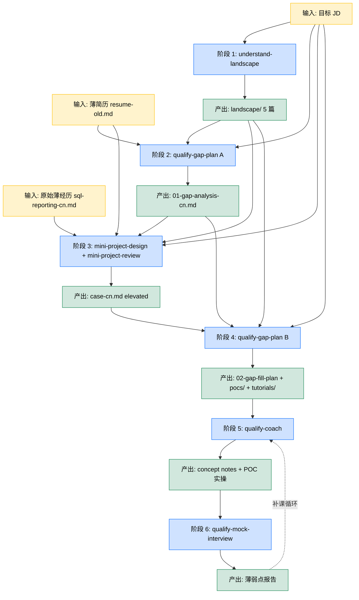

# 从薄简历到面试就绪：项目设计与 Gap 填充工作流

> 这是 examples 系列里的第七篇。上一篇 06 把「准备项目素材」分成了三条路，这一篇专门展开方法二：把已有项目拔高精修，并且把整个工作流的链路说清楚。

## 1. 课程导读

06 里我们讲了项目素材准备的三条路。其中方法二（拔高已有项目）是大多数大三大四以上学生最常用的路径。你已经实习过、做过项目，只是这些经历的深度不够撑起你想投的岗位。

这一篇专门展开方法二的工作流。它的本质不是「把简历改得更漂亮」，而是把「一份薄简历加一个目标 JD」作为起点，一步步推进到「可以走进面试间、能用嘴讲清每一个技术决策」这个终点。

听起来抽象，但这个流程是有具体形状的。我们用 John Doe 的实际产出走一遍。

> 注：这一节本身还不教你怎么实现这个工作流里的每个 agent skill（那是后续 examples）。这一节教你**这个工作流的逻辑**。理解逻辑后，每个 skill 该长什么样、产出什么、需要什么输入，你自己就能推。

---

## 2. 工作流的本质：输入叠加

先说核心机制。这个工作流不是一个黑盒。你扔进去一份简历和一个 JD，它直接吐出一份打磨好的最终简历。它是 **6 个阶段的链路**，每个阶段都做这件事：

- 拿前面所有阶段的输出当输入
- 在它的基础上多产出一些新信息
- 把「前面的输出加上新产物」打包，传给下一阶段

随着阶段推进，**上下文越积越厚**。第一阶段只有简历和 JD，第六阶段已经有简历加 JD 加 landscape 4 篇加 gap 分析加 elevated 项目设计加填 gap 的学习计划加 9 个 POC 的实操产出加一轮 mock 面试的薄弱点报告。所有这些都是给最后写 bullet、写 cover letter、走进面试间用的弹药。

这就是为什么这套工作流即便每一步看起来都很简单，整体的杠杆却非常大。**信息密度的累积是非线性的**。

下面这张图把 6 个阶段的输入累积过程画出来。每一个新阶段（蓝色）拿前面所有阶段的产出（绿色）当输入，自己再吐出新的绿色块。绿色块越往下越多，这就是「输入累积」具体长什么样。

阶段 6 的 mock 面试官手里其实拿着完整的 8 份资料（简历 + JD + landscape 5 篇 + gap 分析 + elevated case + fill plan + POC + 学习笔记），跟一个真正「很了解你」的面试官没本质区别。

> 注：这个 6 阶段、输入叠加的形状不是 deepen 独有的。后面 08 教「从 0 开始设计项目」时，你会看到几乎一样的链路，只是起点不同（没有现有经历，但目标 JD 一样）。一个工作流，两种用法。

---

## 3. John 的起点：薄简历加目标 JD

John 在 2025 年秋天的状态是这样的。

他的简历是 [resume-old.md](../../students/john-doe/resume-old.md)，里面只有一段 Cedar Ridge SQL 报表实习（薄到几乎没有亮点）和三个课程项目（标准 CS 学生水平）。Summary 是泛泛的「对数据系统和应用 ML 感兴趣」，没有定位、没有故事线。

2026 年 2 月，John 看到 Cascadia Health Insights 招 AI Solutions Engineer (New Grad)，岗位描述在 [job-description.md](../../students/john-doe/experiences/from-2025-06-to-2025-09-CedarRidge-maternity-bi-agent/qualify-for-Cascadia-Health-Insights-AI-Solutions-Engineer/job-description.md)。看上去对口（医疗加 AI Agent 加 Snowflake 加客户向工程），但他自己心里清楚：直接把现有简历投过去，几乎肯定石沉大海。

他需要在 4 到 8 周内做完这些事：

- 搞清楚 Cascadia 到底要什么
- 诊断自己离要求差多远
- 把 Cedar Ridge 那段薄经历重新设计成够得着这个 JD 的形态
- 学会重新设计后的项目里他原本不懂的技术
- 在脑子里把项目「做完一遍」
- 用 mock 面试验证学到了

这就是后面 6 个阶段做的事。

---

## 4. 6 个阶段, 一步一步推

下面这张表是 John 实际走过的链路。每一行是一个阶段，每行的「输入」就是上面所有行的「产出」合起来。

| 阶段 | 用什么 skill | 输入 | 新产出 | 产出存在哪 |
|---|---|---|---|---|
| 1. 理解目标 | `understand-landscape` | JD | landscape 4 篇加 index | `qualify-for-.../landscape/` |
| 2. 诊断 gap | `qualify-gap-plan` 第一部分 | JD 加 landscape 加当前简历 | gap 分析 | `qualify-for-.../01-gap-analysis-cn.md` |
| 3. 设计拔高 | `mini-project-design` 加 `mini-project-review` | 上面所有加原始薄经历 | 整合版 elevated case | `qualify-for-.../case-cn.md` |
| 4. 拆 gap 为学习计划 | `qualify-gap-plan` 第二部分 | 上面所有 | gap 填充计划加 9 个 mini-POC 设计加教程目录 | `qualify-for-.../02-gap-fill-plan-cn.md` 加 `pocs/` 加 `tutorials/` |
| 5. 练（学概念加写代码） | `qualify-coach` | 上面所有 | 概念学习笔记加 POC 代码加实操记录 | `pocs/poc-*/` 各文件夹 |
| 6. 验（mock interview） | `qualify-mock-interview` | 上面所有 | 面试转录加薄弱点报告加下一轮补课清单 | `qualify-for-.../mock-interview-{n}-cn.md` |

注意每个阶段产出的文件直接进同一个 `qualify-for-<job>/` 文件夹。这个文件夹本身就是这次「qualify 这个岗位」全部工作的容器。

> 注：上面这 5 个 skill 现在都已经在仓库的 `.claude/skills/` 下了。在 Claude Code 终端里直接调用对应的 skill（例如 `mini-project-design`、`qualify-gap-plan`、`qualify-coach`）就能跑通对应阶段；每个 skill 会问你索要它需要的输入，输出文件直接落到 `qualify-for-<JD-slug>/` 文件夹下。不知道当前应该用哪个 skill，看上面的表第 2 列。

5、6 阶段的产出 John 自己跑过 2 到 3 轮（学 → 考 → 学 → 考），直到核心的 4 个 🔴 Core gap 都能「看 JD 立刻能讲」。

---

## 5. 每个阶段实际长什么样

抽象的工作流讲完了。下面我们带你打开 John 实际跑出来的几个文档看一眼。

**阶段 1 产物**：打开 [00-title-cn.md](../../students/john-doe/experiences/from-2025-06-to-2025-09-CedarRidge-maternity-bi-agent/qualify-for-Cascadia-Health-Insights-AI-Solutions-Engineer/landscape/00-title-cn.md)，这是一份「以做风投尽调的力气调研一个岗位背后的公司、行业、岗位族、市场」的报告首页。里面有 4 个文件索引、6 条「还没核实的事项加下次怎么问 hiring manager」。如果你点进 [01-industry-cn.md](../../students/john-doe/experiences/from-2025-06-to-2025-09-CedarRidge-maternity-bi-agent/qualify-for-Cascadia-Health-Insights-AI-Solutions-Engineer/landscape/01-industry-cn.md) 这种深篇，你会看到 5000 字以上中文、20 个以上 citation、mermaid 图、行业生命周期判断。这不是「看几篇博客写两段总结」的水平，是把一个岗位背后的世界看透的力气。**JD 是被 landscape 反向解构出来的，不是被孤立读的**。

**阶段 2 产物**：打开 [01-gap-analysis-cn.md](../../students/john-doe/experiences/from-2025-06-to-2025-09-CedarRidge-maternity-bi-agent/qualify-for-Cascadia-Health-Insights-AI-Solutions-Engineer/01-gap-analysis-cn.md)，看 9 个 gap 是怎么按 🔴 / 🟡 / 🟠 拆出来的，每个 gap 后面附「为什么这个 gap 对这个岗位重要」和「closing 这个 gap 后你能讲什么」。不掺水，不美化，是诚实审计。

**阶段 3 产物**：打开 [case-cn.md](../../students/john-doe/experiences/from-2025-06-to-2025-09-CedarRidge-maternity-bi-agent/qualify-for-Cascadia-Health-Insights-AI-Solutions-Engineer/case-cn.md)。这是 John 把 Cedar Ridge 薄实习重新设计成的「如果再多 6 个月做深，项目长什么样」的版本。同一段时间、同一家公司、同一个 mentor，但是技术栈、产出、决策密度都另一个数量级。这是 bullet 写作的源头。

**阶段 4 产物**：打开 [02-gap-fill-plan-cn.md](../../students/john-doe/experiences/from-2025-06-to-2025-09-CedarRidge-maternity-bi-agent/qualify-for-Cascadia-Health-Insights-AI-Solutions-Engineer/02-gap-fill-plan-cn.md)，看 9 个 gap 怎么变成 9 个 mini-POC 的设计稿。每个 POC 是一个**学技能的小项目**，不是假装的业务项目。然后翻一下示例 [POC-01](../../students/john-doe/experiences/from-2025-06-to-2025-09-CedarRidge-maternity-bi-agent/qualify-for-Cascadia-Health-Insights-AI-Solutions-Engineer/pocs/poc-01-strand-agents/README-cn.md) 加配套教程 [tutorial 01](../../students/john-doe/experiences/from-2025-06-to-2025-09-CedarRidge-maternity-bi-agent/qualify-for-Cascadia-Health-Insights-AI-Solutions-Engineer/tutorials/01-strand-agents-quickstart-cn.md)，是不是非常具体？

**阶段 5、6 产物**：这一节没展开示例。`qualify-coach` 输出的是按概念组织的学习笔记，`qualify-mock-interview` 输出的是面试薄弱点报告。两者形成「学 → 考 → 学 → 考」循环，直到 John 自信能讲完整套故事。这两个 skill 后续 examples 会专门讲。

---

## 6. 这套工作流为什么是 AI 时代的杠杆

这一段是 06 §8 的进一步展开。

第一，**每个阶段的 skill 都是有约束的执行者，不是创作者**。landscape skill 不写故事，它收集事实。gap-analysis skill 不编差距，它对比 JD 和简历。project-design skill 不无中生有，它在你给的约束（同一家公司、同一段时间）内重新组织已有事实。AI 干的全是「基于已有素材做有约束的延伸」，这正是它最擅长的事。

第二，**创造力留给了流程设计本身，不是某一步**。谁决定的 landscape 要分 industry / company / role / market 四个维度？谁决定的 gap 要按 🔴 / 🟡 / 🟠 三档拆？谁决定的 POC 要分「全新栈」和「既有知识扩展」两类？这些都是工作流的人类设计者决定的，不是 AI。AI 只是在每一格里高效填东西。

第三，**输入叠加机制让产出指数级增值**。单看 landscape 4 篇，价值有限。叠加 gap 分析，你知道「为什么这个差距对这个岗位重要」。再叠加 elevated 设计，你能讲「我是怎么补这个差距的故事」。再叠加 POC 加教程，你真的能写代码、能讲取舍。一层一层堆上去，到最后这套上下文进面试间的时候，跟那些「从模板开始改两行」的求职者完全不在一个段位。

第四，**同样的工作流跑别的目标也好用**。把 Cascadia 换成另一家公司、另一个岗位，整个工作流重新跑一遍，产出全在同一份简历经历的另一个 `qualify-for-<job>/` 文件夹下。一段经历可以为多个目标做多次 qualify，互不打架。这是「1 段经历加 N 个目标等于 N 套 qualify 产物」的并行能力，比 1+N 简历法又深了一层。

---

## 7. 导师寄语

我经常碰到学生说「我简历上没什么亮点，不知道怎么改」。然后他们花一周时间反复改 bullet 措辞，觉得改完应该会好一点，结果投出去还是石沉大海。

问题不是 bullet 措辞。问题是他们简历背后的项目本身没有想清楚。

这一节告诉你的工作流，表面看是 6 个阶段、5 个 skill，实际上是一个非常朴素的命题：**想清楚目标，看清楚差距，把差距填掉，然后才有资格说「我应该简历就要往那个方向写」**。AI 时代之前，这个流程也是对的，只是没人有耐心走完。读 4 篇 5000 字行业研究、写 9 个学技能小项目、跑 2 到 3 轮 mock 面试，怎么也得 3 个月。

AI 把每个阶段的执行成本压缩到了原来的 1/5 到 1/10。同样的工作流，12 周能跑完。这才是真正的杠杆。

下一节我们会展开方法三，教你如果手头**没有**已有项目，怎么从一个 JD 加 landscape 反推出一个值得做的项目设计。整个工作流的形状几乎一样，只是起点是空白。
