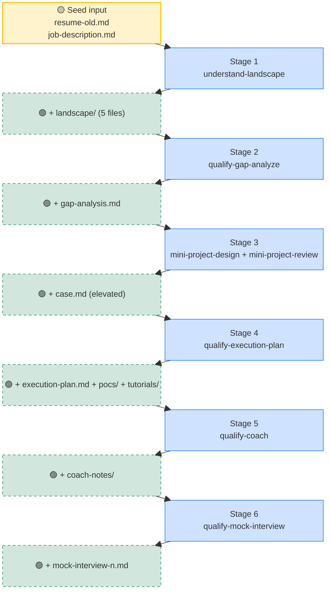
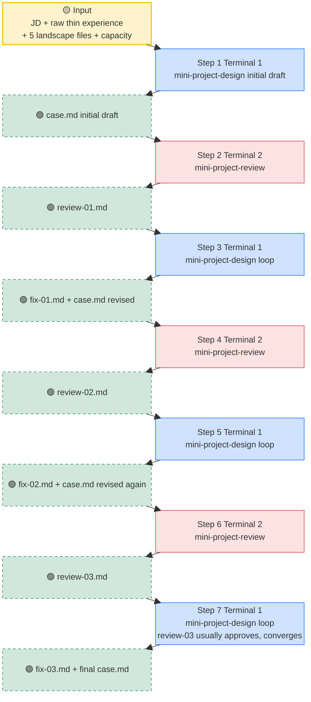

# From Thin Resume to Interview Ready, the Project Design and Gap Filling Workflow

> This is the seventh post in the examples series. The previous post (06) broke "preparing project material" into three paths. This one zooms in on path two: take an existing project and elevate it, then walk through the whole workflow end to end.

## 1. Course Introduction

In 06 we covered three paths for preparing project material. Path two (elevate an existing project) is the one most juniors, seniors, and beyond will actually use. You have done an internship and shipped some projects, but the depth of those experiences is not enough to support the roles you want to apply for.

This post unpacks the workflow for path two. The core idea is to **redesign an existing experience by working backward from the target**. You start with a thin resume plus a target JD, and you take the **thin experience already on the resume** and redesign it into a deeper version that you could realistically build (or deeply understand) over 3 to 6 months, so that it **lines up with what the target role wants**.

Note that in this section we are **not writing any bullets yet**. Bullet writing comes later in [09-write-bullets](../09-write-bullets/README.md). What this section does is **elevate the project case**. The target is "I want to qualify for this JD," and we work backward from there to design a new version of the project experience. Once the case is elevated, it pulls double duty: looking forward, it becomes the source material for the elevated bullets you will write later. Looking backward, it becomes the construction blueprint for the next 3 to 6 months, during which you will **either mentally walk through it or actually build it out**.

That sounds abstract, but the workflow has a concrete shape. Let's walk through it using John Doe's actual output.

---

## 2. The Heart of the Workflow, Input Stacking

> **A quick heads up about this section**: this section is a catalog of artifacts plus one architecture diagram. The information density is high. On a first read, you don't need to memorize all 9 artifact filenames. After you have run the workflow once and come back, it will feel much smoother. Treat this section as a map of "what the overall pipeline looks like." Section 4 will walk through each stage in detail.

First, the core mechanism. This workflow is not a black box. It is a **6-stage pipeline** that starts with "a thin resume plus a target JD" and ends with "a complete interview-ready package." Every stage follows the same rule:

- Take everything produced by the previous stages as input
- Add some new information on top of it
- Bundle "previous artifacts plus the new artifact" and pass it to the next stage

After all 6 stages, you accumulate 9 categories of artifact files. Before looking at the diagram below, let's walk through what each artifact is and where it lives, otherwise the filenames popping up in the diagram will be confusing:

- [`resume-old.md`](../../students/john-doe/resume-old.md): the "not great" thin resume the student starts with before entering the workflow.
- [`job-description.md`](../../students/john-doe/experiences/from-2025-06-to-2025-09-CedarRidge-maternity-bi-agent/qualify-for-Cascadia-Health-Insights-AI-Solutions-Engineer/job-description.md): the target job posting the student picked. Every later stage calibrates against it.
- The raw thin experience [`...sql-reporting.md`](../../students/john-doe/experiences/from-2025-06-to-2025-09-CedarRidge-maternity-sql-reporting.md): the expanded write-up of that thin internship or project on the resume. This is the raw material the 07 workflow will elevate.
- [`landscape/`](../../students/john-doe/experiences/from-2025-06-to-2025-09-CedarRidge-maternity-bi-agent/qualify-for-Cascadia-Health-Insights-AI-Solutions-Engineer/landscape/) with 5 files: do VC due diligence on the role. Research industry, company, role, and market in 4 deep reports plus 1 index report, so that the AI actually "gets" the world behind the role. (This skill comes from the prerequisite course career_planning.)
- [`gap-analysis.md`](../../students/john-doe/experiences/from-2025-06-to-2025-09-CedarRidge-maternity-bi-agent/qualify-for-Cascadia-Health-Insights-AI-Solutions-Engineer/gap-analysis.md): an honest gap diagnosis comparing the current resume against JD plus landscape. Each gap is sorted into 🔴 Core, 🟡 Important, or 🟠 Nice-to-have.
- [`case.md`](../../students/john-doe/experiences/from-2025-06-to-2025-09-CedarRidge-maternity-bi-agent/qualify-for-Cascadia-Health-Insights-AI-Solutions-Engineer/case.md) (elevated version): the raw thin experience redesigned into a project that reaches the JD. **This is the single most important artifact in the whole workflow.** It is the source material for elevated bullets later, and it is also the design blueprint for what you will actually build over the next 3 to 6 months.
- [`execution-plan.md`](../../students/john-doe/experiences/from-2025-06-to-2025-09-CedarRidge-maternity-bi-agent/qualify-for-Cascadia-Health-Insights-AI-Solutions-Engineer/execution-plan.md) plus [`pocs/`](../../students/john-doe/experiences/from-2025-06-to-2025-09-CedarRidge-maternity-bi-agent/qualify-for-Cascadia-Health-Insights-AI-Solutions-Engineer/pocs/) plus [`tutorials/`](../../students/john-doe/experiences/from-2025-06-to-2025-09-CedarRidge-maternity-bi-agent/qualify-for-Cascadia-Health-Insights-AI-Solutions-Engineer/tutorials/): the "fill the gap" trio that comes out of breaking down each gap. A learning plan, plus one mini-POC per gap, plus a matching tutorial.
- `coach-notes/`: notes and progress tracker produced while learning concepts with the AI coach. Generated dynamically under the [qualify-for folder](../../students/john-doe/experiences/from-2025-06-to-2025-09-CedarRidge-maternity-bi-agent/qualify-for-Cascadia-Health-Insights-AI-Solutions-Engineer/). Not shown in the repo example.
- `mock-interview-{n}.md`: transcripts and debriefs from mock interview sessions with the AI interviewer. Also generated dynamically under the same qualify-for folder.

**Why does this stack add up to "interview ready"?** These 9 categories of artifacts build up a layered evidence chain that says "I really understand this project." Landscape gives you a sharper read on the JD than other candidates. Gap analysis tells you where you are short. The elevated case shows what this experience really looks like. The POCs let you actually pull up code demos. Coach notes let you explain every technical choice at the whiteboard. Mocks let you surface weaknesses under pressure ahead of time. Stack all 9, and you have a candidate who can sit in the interview room and field hard follow-ups from any angle. **The information density compounds non-linearly**, and that is the real leverage of this workflow.

The diagram below shows that stacking process. It has two columns:

- **Left column "accumulated artifacts"**: gets thicker from top to bottom. The solid yellow box at the top is the seed input (thin resume + target JD). Each dashed box below is a new artifact added once a stage finishes.
- **Right column "stages"**: the 6 stages from top to bottom, one per row.

Every row follows the same logic. **All accumulated artifacts in the left column** feed diagonally into **the stage in this row on the right**. When the stage finishes, it produces a new artifact that lands diagonally on the **next row of the left column**. So the left column grows longer top to bottom, and what falls out at the bottom is the elevated case plus the full hands-on package.



The mock interviewer at stage 6 actually holds the full package (resume + JD + 5 landscape files + gap analysis + elevated case + fill plan + POCs + learning notes). There is no real difference between that and an interviewer who genuinely "knows you well."

> Note: this shape of 6 stages with input stacking is not unique to the "elevate an existing project for a target role" path. Later in [08-design-new-project](../08-design-new-project/README.md), which teaches "design a project from scratch," you will see almost the same pipeline. Only the starting point differs (no existing experience, but the target JD is the same). One workflow, two ways to use it.

---

## 3. John's Starting Point, Thin Resume Plus Target JD

This is where John was in fall 2025.

His resume is [resume-old.md](../../students/john-doe/resume-old.md). It has one Cedar Ridge SQL reporting internship (so thin there is barely any highlight) and three course projects (standard CS student fare). The Summary is a generic "interested in data systems and applied ML," with no positioning and no story line.

In February 2026, John spotted that Cascadia Health Insights was hiring an AI Solutions Engineer (New Grad). The posting is at [job-description.md](../../students/john-doe/experiences/from-2025-06-to-2025-09-CedarRidge-maternity-bi-agent/qualify-for-Cascadia-Health-Insights-AI-Solutions-Engineer/job-description.md). It looked like a fit (healthcare + AI Agent + Snowflake + customer-facing engineering), but he knew the truth. If he submitted his current resume as-is, it would almost certainly go nowhere.

In the next 4 to 8 weeks, he needs to:

- Figure out what Cascadia actually wants
- Diagnose how far he is from the bar
- Redesign the Cedar Ridge thin experience into something that reaches the JD
- Learn the technologies in the redesigned project that he doesn't yet know
- Mentally "ship" the project end to end
- Use mock interviews to verify he actually learned it

That is exactly what the 6 stages below cover.

---

## 4. The 6 Stages, Step by Step, What They Do and How to Invoke Them

This section walks through the 6 stages, from "what each one does" all the way down to "how to invoke it in Claude Code." First, here is a reference table showing the entire pipeline in one place. Then each stage gets its own walk-through.

| Stage | What it does | Input docs | Output docs |
|---|---|---|---|
| Stage 1 `understand-landscape` | Treat the target JD as a due-diligence subject. Research industry, company, role, and market | [`job-description.md`](../../students/john-doe/experiences/from-2025-06-to-2025-09-CedarRidge-maternity-bi-agent/qualify-for-Cascadia-Health-Insights-AI-Solutions-Engineer/job-description.md) | [`landscape/`](../../students/john-doe/experiences/from-2025-06-to-2025-09-CedarRidge-maternity-bi-agent/qualify-for-Cascadia-Health-Insights-AI-Solutions-Engineer/landscape/) (5 files) |
| Stage 2 `qualify-gap-analyze` | Honestly diagnose where the current resume falls short against JD + landscape | All of the above plus [`resume-old.md`](../../students/john-doe/resume-old.md) plus the [raw thin experience](../../students/john-doe/experiences/from-2025-06-to-2025-09-CedarRidge-maternity-sql-reporting.md) | [`gap-analysis.md`](../../students/john-doe/experiences/from-2025-06-to-2025-09-CedarRidge-maternity-bi-agent/qualify-for-Cascadia-Health-Insights-AI-Solutions-Engineer/gap-analysis.md) |
| Stage 3 `mini-project-design` + `mini-project-review` | Use the gap analysis as a guide. Redesign the raw thin experience into an elevated version that reaches the JD and closes the student's gaps. Iterate 3 rounds | All of the above plus gap analysis | [`case.md`](../../students/john-doe/experiences/from-2025-06-to-2025-09-CedarRidge-maternity-bi-agent/qualify-for-Cascadia-Health-Insights-AI-Solutions-Engineer/case.md) (elevated version) |
| Stage 4 `qualify-execution-plan` | Take gap analysis + case as input. Break each gap into a POC + tutorial + weekly schedule that maps 1:1 to the case's decisions | All of the above plus case | [`execution-plan.md`](../../students/john-doe/experiences/from-2025-06-to-2025-09-CedarRidge-maternity-bi-agent/qualify-for-Cascadia-Health-Insights-AI-Solutions-Engineer/execution-plan.md) plus [`pocs/`](../../students/john-doe/experiences/from-2025-06-to-2025-09-CedarRidge-maternity-bi-agent/qualify-for-Cascadia-Health-Insights-AI-Solutions-Engineer/pocs/) plus [`tutorials/`](../../students/john-doe/experiences/from-2025-06-to-2025-09-CedarRidge-maternity-bi-agent/qualify-for-Cascadia-Health-Insights-AI-Solutions-Engineer/tutorials/) |
| Stage 5 `qualify-coach` | Learn each concept gap by gap, write POCs, get a feel for whether the case difficulty fits you | All of the above | `coach-notes/` generated dynamically under the [qualify-for folder](../../students/john-doe/experiences/from-2025-06-to-2025-09-CedarRidge-maternity-bi-agent/qualify-for-Cascadia-Health-Insights-AI-Solutions-Engineer/) |
| Stage 6 `qualify-mock-interview` | AI plays a stranger interviewer. Real stress test | All of the above | `mock-interview-{n}.md` generated dynamically under the [qualify-for folder](../../students/john-doe/experiences/from-2025-06-to-2025-09-CedarRidge-maternity-bi-agent/qualify-for-Cascadia-Health-Insights-AI-Solutions-Engineer/) |

Every artifact a stage produces lands directly under the same `qualify-for-<JD-slug>/` folder. That folder itself is the container for all the work to "qualify for this role." **Every output file has exactly one skill that produces it, and stages do not overwrite each other.** Stage 2 writes `gap-analysis.md`, stage 3 writes `case.md`, stage 4 writes `execution-plan.md` + `pocs/` + `tutorials/`. The only exception is when stage 5 or 6 says the case difficulty is wrong and triggers `mini-project-design`'s case-difficulty-rollback. In that case the case gets rewritten, and stage 4 has to be rerun (because the POCs need to align with the new case decisions). Under the normal flow there is no overwriting.

> Note: in the table, the `understand-landscape` skill comes from the prerequisite course **career_planning**, not from this repo. This section assumes you already know how to use it. The other 5 skills from this repo (`qualify-gap-analyze`, `mini-project-design`, `mini-project-review`, `qualify-execution-plan`, `qualify-coach`, `qualify-mock-interview` — counting review separately it is actually 6) all live under `.claude/skills/`. In the Claude Code terminal you just say "please invoke /<skill name>" and it kicks off. Each skill will proactively ask you for the inputs it needs, so you don't have to memorize command-line flags. The full set of resume-related skills is 10. The 6 above are the backbone of the "prepare project material" workflow taught in 06 / 07 / 08. The remaining 4 (`bullet-writer`, `bullet-reviewer`, `summary-writer`, `summary-reviewer`) are the "write bullets and Summary" tools taught in 09 and 10.

The term POC will keep coming up, so let's pin it down once. **POC stands for Proof of Concept, basically "a tiny project that proves a concept."** In this workflow, one POC equals one "very small project written to learn one specific skill." It is not a pretend business project. For example, "use Strand Agents to write a tiny QA agent that queries 50 Wikipedia articles" is a POC. The goal is so that when you get asked about Strand Agents later, you can say "I built a small demo and the code looked like this."

The 6 sections below cover each stage in order.

### 4.1 Stage 1, understand-landscape (understand the world the target role sits in, from the prerequisite course)

`understand-landscape` is not a skill implemented in this course. It comes from the prerequisite course **career_planning**. This section assumes you learned how to use it before arriving here, and just briefly covers what role it plays in this workflow. For detailed usage, go see the prerequisite course.

**What it does**: with the rigor of VC due diligence, research the 4 dimensions behind a target role (industry, company, job family, market). Produce 4 deep reports plus 1 index report and reverse-engineer the target JD. From then on, when you look at a JD it is no longer "keyword matching." It is "where in the industry life cycle this company sits, why they are hiring this role right now, and what the true place of this job family is inside the company."

**When to use**: stage 0, before everything else in this workflow. Hand it the JD path and it gets going. Within a few hours, 5 docs land under `qualify-for-<JD-slug>/landscape/`.

**Outputs**:

- [`landscape/00-title.md`](../../students/john-doe/experiences/from-2025-06-to-2025-09-CedarRidge-maternity-bi-agent/qualify-for-Cascadia-Health-Insights-AI-Solutions-Engineer/landscape/00-title.md): index plus a list of unverified items (questions to ask the Hiring Manager)
- [`landscape/01-industry.md`](../../students/john-doe/experiences/from-2025-06-to-2025-09-CedarRidge-maternity-bi-agent/qualify-for-Cascadia-Health-Insights-AI-Solutions-Engineer/landscape/01-industry.md): industry research
- [`landscape/02-company.md`](../../students/john-doe/experiences/from-2025-06-to-2025-09-CedarRidge-maternity-bi-agent/qualify-for-Cascadia-Health-Insights-AI-Solutions-Engineer/landscape/02-company.md): company research
- [`landscape/03-role.md`](../../students/john-doe/experiences/from-2025-06-to-2025-09-CedarRidge-maternity-bi-agent/qualify-for-Cascadia-Health-Insights-AI-Solutions-Engineer/landscape/03-role.md): Job Family research
- [`landscape/04-market.md`](../../students/john-doe/experiences/from-2025-06-to-2025-09-CedarRidge-maternity-bi-agent/qualify-for-Cascadia-Health-Insights-AI-Solutions-Engineer/landscape/04-market.md): market research

**Why does this workflow insist on running landscape first**: later, when stage 2 computes gaps and stage 3 designs the elevated case, the quality of the AI output depends directly on "how deeply it understands this role." Without landscape as context, the AI is reduced to guessing from the literal text of the JD, and both the gap analysis and the case will be relatively shallow.

### 4.2 Stage 2, qualify-gap-analyze (honest gap diagnosis)

**When to use**: you have picked a target JD, finished the landscape research, and you hold your current thin resume. You have not started designing the project yet.

**What to prepare beforehand**:

- The file path to your current resume (e.g., `students/john-doe/resume-old.md`)
- The file path to the target JD (e.g., `.../qualify-for-.../job-description.md`)
- The folder path for the 5 landscape files (if you ran it; you can proceed without it, but the output will be a notch weaker)
- (Optional) the expanded write-up of the thin experience on your resume (e.g., [`...sql-reporting.md`](../../students/john-doe/experiences/from-2025-06-to-2025-09-CedarRidge-maternity-sql-reporting.md)) so the skill can more precisely judge your "current state to JD" gap

**How to invoke**: just talk to it in plain language in the Claude Code terminal. For example:

```
Please invoke the /qualify-gap-analyze skill.
My resume is at students/john-doe/resume-old.md.
The expanded write-up of my thin experience is at students/john-doe/experiences/.../sql-reporting.md.
The target JD is at .../qualify-for-Cascadia-Health-Insights-AI-Solutions-Engineer/job-description.md.
landscape is in the landscape/ folder in the same directory.
Please output in English (.md).
```

**What happens during**: the skill reads all the inputs, compares your current state to every must-have and nice-to-have line in the JD, and outputs an honest gap diagnosis. Each gap gets classified into 🔴 Core, 🟡 Important, or 🟠 Nice-to-have, with a JD quote attached as evidence. No softening, no sugarcoating.

**Output**: 1 file:

- [`gap-analysis.md`](../../students/john-doe/experiences/from-2025-06-to-2025-09-CedarRidge-maternity-bi-agent/qualify-for-Cascadia-Health-Insights-AI-Solutions-Engineer/gap-analysis.md): an honest gap diagnosis, sorted into 🔴 / 🟡 / 🟠. Each 🔴 Core gap also includes a concrete description of what "closed to interview-credible level" actually looks like.

**This step does NOT produce POCs, tutorials, or a weekly plan.** Those all come from stage 4 (`qualify-execution-plan`), after the case is designed, because POCs should correspond 1:1 to the specific technical decisions in the case rather than be abstracted directly from the JD. Stage 2 only "diagnoses." Stage 4 "prescribes."

**Where people trip up**: trying to get the skill to also produce a fill plan, POCs, and tutorials in one go. That doesn't work. gap-analyze only produces a diagnosis. For POCs and tutorials, go through stage 3 to design the case first, then come back to stage 4 and invoke `qualify-execution-plan`.

### 4.3 Stage 3, mini-project-design + mini-project-review (two terminals plus on-disk handshake, used as a pair)

This is the most important and most involved step in the whole workflow. The two skills are used together. **Open two independent Claude Code sessions** and have them hand off through `review-NN.md` and `fix-NN.md` files on disk, iterating back and forth for at least 3 rounds until review issues an `approve` verdict.

Why go through all this trouble? Because we are using a very general technique here. **When your own judgment isn't strong enough to critically evaluate what you wrote, get another AI instance with zero prior context to play the role of an independent reviewer, and have it surface problems you cannot see.**

After you finish writing something, if you go back and read it yourself, you almost certainly cannot see the deep problems. The reason is simple. Your head already has rationalizations for everything. For every technical choice, you already have an answer for "why this way," because those answers are what you thought through before writing it. When you re-read your own output, those reasons surface automatically and rationalize away any potential holes. This is just human nature, and a single AI instance behaves the same way.

The way out is to hand the artifact to a **totally unfamiliar second AI instance** in another session. Without the rationalizations in your head, that instance can only judge based on "does this piece stand on its own and does the design hold up under questioning." This is a very general AI collaboration pattern, not just useful for project design. When writing code you can have another AI instance act as code reviewer. When writing an essay, another instance can be the editor. When making a decision, another instance can play the opposition. This course productizes that pattern specifically as the `mini-project-design` plus `mini-project-review` pair.

For the two AI instances to genuinely "not know about each other," they have to run in two separate Claude Code sessions, with all state living on disk. `case.md` is the design side's output. `review-NN.md` is the review side's output. `fix-NN.md` is the design side's response (in Loop mode) to a review. Either terminal can be closed or restarted with a different model. The next launch just looks at the files on disk to figure out which round you are on, what the last review said, what the design side accepted, and what it rejected.

The 3-round flow is a 7-step sequence. The diagram below uses the same two-column layout as section 2. **Left column shows files accumulating on disk** (yellow solid box is the initial input, green dashed boxes are artifacts added at each step). **Right column shows the 7 steps** (blue runs `mini-project-design` in terminal 1, pink runs `mini-project-review` in terminal 2). The arrows between them trace the input → step → produces zig-zag.



Notice there is no "copy and paste the content" step anywhere. The only thing you have to do is notify the other terminal "the step on my side is done, your turn." Each skill reads the latest files on disk by itself, figures out which NN it is on by itself, and writes the next file by itself. State is driven naturally by file name numbering.

**Round 1 preparation** (terminal 1, design side):

- Target JD path
- Raw thin experience file (e.g., `experiences/.../sql-reporting.md`)
- **The `gap-analysis.md` produced by stage 2** (optional but strongly recommended. This is the only way design knows what the student is missing. Without it, design can only abstract a design from the JD, and the resulting case may not match the student's actual gap.)
- 5 landscape files (optional but strongly recommended)
- Your capacity information

**Round 1 invoke design (terminal 1)**:

```
Please invoke the /mini-project-design skill in elevate mode, initial submode.
Project folder: students/john-doe/experiences/.../qualify-for-Cascadia-.../
JD: <absolute path>
Raw thin experience: <absolute path>
gap analysis: <absolute path, the gap-analysis.md produced by stage 2>
landscape: <absolute path>
capacity: 12 weeks, 10 hours per week.
Output case.md.
```

Once the skill confirms elevate + initial mode, it generates case.md section by section. One-line summary, business context, trigger event, In/Out of Scope, team roles, what I did (with mermaid architecture diagram), key technical decision replay, output and metrics, tech stack, reflection, and open items. Along the way it may ask you about facts it isn't sure of (mentor name, reporting line). Answer honestly. When it's done it tells you, "Round 1 case is ready. Open another terminal and run mini-project-review to get review-01.md."

**Round 1 invoke review (terminal 2, a brand new Claude Code session)**:

```
Please invoke the /mini-project-review skill.
Project folder: students/john-doe/experiences/.../qualify-for-Cascadia-.../
```

The review skill `ls`'s the folder itself, sees an existing `case.md` and 0 review files, computes `NN = 01`, then **read-only** reads case.md plus all context. It scores along three axes (feasibility, depth, JD alignment) plus a mode-specific check and writes out `review-01.md`. It does not touch a single character of case.md.

After review finishes it tells you, "review-01.md is ready. Go back to terminal 1 and have mini-project-design process it to generate fix-01.md."

**Between Round 1 and Round 2, design switches to Loop mode** (terminal 1):

```
Please invoke the /mini-project-design skill in loop mode.
Project folder: students/john-doe/experiences/.../qualify-for-Cascadia-.../
Process review-01.md.
```

Design detects that the folder has `case.md` and `review-01.md` but no `fix-01.md`, and automatically enters Loop mode. It **first** writes `fix-01.md` (with accept/reject lists and reasons for each), **then** makes precise Edit operations on case.md (not a full rewrite). When done it tells you, "fix-01 done. Back to terminal 2 for review's next round."

**Round 2** (run review again in terminal 2):

Same invocation. This time review sees that the folder has `case.md`, `review-01.md`, and `fix-01.md` all in place. It computes `NN = 02`, reads both case.md and fix-01.md (to see what design accepted and what it rejected), and writes `review-02.md` picking only at issues that are still unresolved.

**Round 3 + convergence**: same protocol. Generally after 3 rounds review issues an `approve` verdict and you can move on to stage 4.

**Where people trip up**:

- Running design and review in the same session. The skill no longer hard-checks the session, so this won't auto-fail. But it is the equivalent of grading your own homework. The review verdict will skew lenient. Strongly recommend two independent sessions.
- Skipping the iteration and using the Round 1 case as-is. The "key technical decision replay" in the first version almost always has 1 or 2 decisions that don't hold up under follow-up questioning, and review is the one designed to catch them.
- Treating `approve-with-revisions` from round 1 as a pass. That verdict means "the trunk is fine but there are a few specific holes to patch." If you don't patch them and move on, the mock interview will absolutely surface them.
- Not writing `fix-NN.md` and editing the case directly. Loop mode has a hard constraint: write fix first, then edit case. That way, if the terminal crashes, the decisions are still preserved on disk.

### 4.4 Stage 4, qualify-execution-plan (derive the weekly plan + POCs + tutorials from gap + case)

**When to use**: the case from stage 3 has been approved by review. Now you need to combine "what you lack" and "what tech the case uses" into one input, and derive "how to concretely learn it over the next 12 weeks." This step is no longer doing diagnosis (that was finished in stage 2). It is no longer designing a project (that was finished in stage 3). It builds on top of the existing diagnosis and existing case to lay out a concrete weekly plan plus one POC per gap plus tutorial placeholders.

**What to prepare beforehand** (3 required + a few optional):

- The [`gap-analysis.md`](../../students/john-doe/experiences/from-2025-06-to-2025-09-CedarRidge-maternity-bi-agent/qualify-for-Cascadia-Health-Insights-AI-Solutions-Engineer/gap-analysis.md) produced by stage 2 (required)
- The [`case.md`](../../students/john-doe/experiences/from-2025-06-to-2025-09-CedarRidge-maternity-bi-agent/qualify-for-Cascadia-Health-Insights-AI-Solutions-Engineer/case.md) produced by stage 3 (required)
- JD file (required, used to verify the case still serves the JD)
- Current resume, landscape, capacity profile (optional but strongly recommended. Without these the weekly plan is guesswork)

**How to invoke**:

```
Please invoke the /qualify-execution-plan skill.
Project folder: students/john-doe/experiences/.../qualify-for-Cascadia-.../
gap analysis: gap-analysis.md in the same folder
case: case.md in the same folder
JD: job-description.md in the same folder
capacity: 12 weeks, 12 to 15 hours per week.
Please output in English (.md).
```

**What happens during**: the skill reads gap analysis plus case, maps each gap from the gap analysis to a specific technical decision in the case (e.g., "the Strand Agents gap maps to the case's decision to use Strand Agents instead of LangGraph"), drafts a mini-POC for each gap, writes a tutorial stub, and lays out a weekly schedule.

**Outputs**: 3 categories of files:

- [`execution-plan.md`](../../students/john-doe/experiences/from-2025-06-to-2025-09-CedarRidge-maternity-bi-agent/qualify-for-Cascadia-Health-Insights-AI-Solutions-Engineer/execution-plan.md): main plan doc, including case-decision mapping, POC priority matrix, cross-POC reuse matrix, and a 12-week schedule
- `pocs/poc-NN-<slug>/README.md`: one POC scaffold per gap. The repo example expands [`poc-01-strand-agents/`](../../students/john-doe/experiences/from-2025-06-to-2025-09-CedarRidge-maternity-bi-agent/qualify-for-Cascadia-Health-Insights-AI-Solutions-Engineer/pocs/poc-01-strand-agents/README.md) and [`poc-05-semantic-yaml/`](../../students/john-doe/experiences/from-2025-06-to-2025-09-CedarRidge-maternity-bi-agent/qualify-for-Cascadia-Health-Insights-AI-Solutions-Engineer/pocs/poc-05-semantic-yaml/README.md)
- `tutorials/NN-<slug>.md`: one tutorial placeholder per gap. The repo example expands [`01-strand-agents-quickstart.md`](../../students/john-doe/experiences/from-2025-06-to-2025-09-CedarRidge-maternity-bi-agent/qualify-for-Cascadia-Health-Insights-AI-Solutions-Engineer/tutorials/01-strand-agents-quickstart.md) and [`05-semantic-layer-yaml-design.md`](../../students/john-doe/experiences/from-2025-06-to-2025-09-CedarRidge-maternity-bi-agent/qualify-for-Cascadia-Health-Insights-AI-Solutions-Engineer/tutorials/05-semantic-layer-yaml-design.md)

**Does NOT overwrite stage 2's gap-analysis.md.** execution-plan is its own file, downstream of gap analysis and case. It does not replace gap analysis. The stage 2 diagnosis is preserved forever, so you can later look back and see "where I was actually short at the time."

**Where people trip up**:

- Skipping stage 4 and jumping into stage 5. Without a weekly plan and POC index, coach feels scattered and disorganized.
- Not providing a capacity profile. The weekly schedule becomes the AI's guess at a "pretend weekly plan." Always tell it how many hours per week you have.
- POCs are skill exercises, not resume-level projects. Don't misread this as "I have to ship 9 full business projects from scratch."

> Note: there is a key point a lot of people miss here. **The mini-POCs and tutorials produced by `qualify-execution-plan` are not primarily so you can "finish learning everything before submitting your resume."** One of the main goals is to let you **try things out cheaply with the AI by your side** and feel out whether the project designed in the stage 3 case.md is actually **buildable for you over 3 to 12 months**. If you start one POC and immediately realize "I have no idea where to even start," that means the project design is too hard for you. You should immediately go back to stage 3 and invoke `mini-project-design`'s case-difficulty-rollback mode to have the AI dial down the difficulty and redesign the case. After the case is rewritten, stage 4 has to be rerun (POCs no longer match the old case decisions). This is the "small steps, fast verification" work philosophy. Get hands-on, and if it isn't working, adjust right away. That is much cheaper than gritting it out to the mock interview only to discover the project design is unrealistic and having to redo everything. (This case-difficulty-rollback path is the one and only exception in the back-flow between stages 3 / 4 / 5. Under the normal flow, the three stages go strictly one-way and don't overwrite each other.)

### 4.5 Stage 5, qualify-coach (learn concepts and write POC code, and feel out the case difficulty along the way)

> Note: this section uses "write POC code" as the example only because John Doe in 07 is going for a SWE-style role (AI Solutions Engineer). The skill itself is "give each gap a practice exercise." The form of that exercise depends entirely on your target job type. SWE writes code demos, a data scientist does a small data analysis, a PM writes a product case teardown, a designer does a UX teardown on a real product, an analyst recreates an industry chart, and so on. **The core mechanism is "learn one concept → use a small exercise to internalize it → only mark ✅ on the progress tracker after passing the verification questions."** "Writing code" is just how that mechanism lands for SWE roles. As you read the paragraphs below, just mentally substitute "POC code" with the practice exercise that fits your job type.

**When to use**: fill plan in hand, POC scaffolds built, and you are starting to work through the gaps one at a time on plan.

**What to prepare beforehand**: fill plan, POC scaffolds (`pocs/poc-NN-*/README.md`), case file, (optional) gap analysis, landscape. All of these live in the same `qualify-for-<JD-slug>/` folder. When invoking, just hand the folder path to the skill.

**How to invoke**:

```
Please invoke the qualify-coach skill.
fill plan: .../qualify-for-.../execution-plan.md
POC scaffolds are under .../qualify-for-.../pocs/.
case file: .../qualify-for-.../case.md
I want to learn through "code walk-through + analogy" style. Start with the highest-priority 🔴 Core gap.
```

**What happens during**: this skill runs in **dialogue mode**, not lecture mode. It will explain a concept in 2 to 5 paragraphs (using a concrete scenario from your case as the example), then pause to ask you 2 to 3 verification questions. **It will not push forward on its own.** You have to answer, and it judges from your answer whether you really get it or are faking it before deciding what comes next. Answer well and it immediately writes a `coach-notes/concept-<slug>.md` note and marks the progress tracker ✅. Answer weakly and it tries another angle (never repeats the same paragraph). Several weak answers in a row and it marks ❌ and skips, to come back to it later in the section or in the next session.

The progress for each session is tracked in `coach-notes/_progress.md`. You can ask "where am I" at any time and it will show you the progress table.

**Outputs**:

- `coach-notes/concept-<slug>.md`: one note per learned concept, covering "what this concept is, how it shows up in your case, why this choice over the alternatives, 3 to 5 interview questions that will probe deep with draft answers, and the key code snippets"
- `coach-notes/_progress.md`: real-time progress tracking table

**Where people trip up**:

- Using the AI like a search engine. It explains once and stops after the questions. If you don't answer, it doesn't move. Don't expect it to keep talking on its own.
- Phoning in the verification questions. A weak answer means the concept isn't learned, but the tracker says ✅, and the mock interview will expose it.
- Running both coach and mock interview in the same session. Section 4.6 will cover this. It is another hard constraint.

**If you find the case difficulty is beyond your absorption rate, how do you walk it back**: this paragraph is the concrete operational landing of the "try things to see if you can reach it" philosophy from the end of 4.4. If you find yourself stuck on a 🔴 Core gap and unable to absorb it (not "it is hard," but "coach has tried 3 different angles and you still can't follow"), don't grind through. Reverse course:

1. In the current coach session, say it directly: "I feel the case difficulty is too high for me. Please output a short structured feedback describing which specific skill I'm blocked on and why I can't reach it, so `mini-project-design` can redesign the case." Coach will write a structured feedback snippet.
2. **Do not close the original design terminal 1.** The original case is still in that window so you can refer back to it. **Also do not continue in that old design session**, because that session has been polluted by your previous 3 rounds of iteration. **Open a brand new Claude Code terminal** and re-invoke `mini-project-design` the way Round 1 in 4.3 describes (elevate + initial mode). Feed in coach's feedback as a new constraint: "The student says they can't reach technology X in the original case. Please swap X for an alternative Y that they can reach, and keep everything else."
3. The new design terminal runs 3 rounds of the review loop and produces a new `case.md`. Then go back to 4.4 and run a fresh `qualify-execution-plan`. Then back to 4.5 to relearn the 🔴 Core gaps corresponding to the new case.

This is the operational landing of the "small steps, fast verification" philosophy. **Let the case bend to your absorption rate, don't force yourself to grind through the case.** The case is dead. Your absorption rate is alive. The sooner you feed this kind of feedback back to the design side, the less painful the downstream coach and mock stages will be.

### 4.6 Stage 6, qualify-mock-interview (stress test, for now just know it exists)

For the `qualify-mock-interview` skill, **for now you just need to know it exists**. There is no rush to use it on day one. It is the complement of `qualify-coach` from 4.5. Coach is "learn with you." Mock is "play a stranger interviewer and grill you for real." Together they form a "learn → test → learn → test" feedback loop. Nominally it's a mock interview, but in essence it's also helping you consolidate and level up.

**When to actually use it**: once you have learned all the 🔴 Core priority gaps in 4.5 well enough to explain them out loud, then come back and run mock. Only then does the debrief have diagnostic value. If you learn shallowly and jump in, the debrief will be all ❌, and you won't know what to patch. The how-to (must use a fresh session, why use voice input, what goes in the debrief) is written in `.claude/skills/qualify-mock-interview/SKILL.md`. Check that when you are actually ready to use it.

**Watch the positioning**: the `qualify-mock-interview` in this section is the stress test "for your elevated experience against the target JD." It is still part of the workflow. The goal is to verify that you can clearly articulate the elevated case you designed in 4.3. When you actually interview at this company 3 to 6 months later, **you won't mock yourself from the project design angle anymore**, because by then the project is already shipped, the case has gone through many iterations, and the story you can tell has far exceeded what this section produced. The pre-real-interview stress test is done in a different way (a pure stress test detached from this elevation process), and that is covered in a later course.

In John's actual run, the loop of 4.5 and 4.6 ran 2 to 3 rounds (learn → test → learn → test) until all 4 of the core 🔴 Core gaps reached "see the JD and immediately articulate." This is an iterative process, not a one-shot.

---

## 5. A Peek at the Density of These Artifacts

Section 2 listed the artifacts with links. Section 4's table also gave links. But just looking at filenames doesn't convey the density of these outputs. This section walks you into a few key files so you can see for yourself: how heavy 5 landscape files actually are, how big the gap is between the elevated case and the raw thin experience, and how concrete the POCs and tutorials really get.

**Stage 1 output**: open [00-title.md](../../students/john-doe/experiences/from-2025-06-to-2025-09-CedarRidge-maternity-bi-agent/qualify-for-Cascadia-Health-Insights-AI-Solutions-Engineer/landscape/00-title.md). This is the title page of a "VC due-diligence rigor" report on the company, industry, Job Family, and market behind one role. It has the index for the other 4 deep reports and 6 unverified items (with how to ask the Hiring Manager next time). If you click into a deep report like [01-industry.md](../../students/john-doe/experiences/from-2025-06-to-2025-09-CedarRidge-maternity-bi-agent/qualify-for-Cascadia-Health-Insights-AI-Solutions-Engineer/landscape/01-industry.md), you'll see 5000+ words, 20+ citations, mermaid diagrams, and an industry-life-cycle judgment. This is not the depth of "read a couple of blog posts and write two paragraphs." This is the depth of seeing through the world behind a role. **The JD is reverse-engineered by the landscape, not read in isolation.**

**Stage 2 output**: open [gap-analysis.md](../../students/john-doe/experiences/from-2025-06-to-2025-09-CedarRidge-maternity-bi-agent/qualify-for-Cascadia-Health-Insights-AI-Solutions-Engineer/gap-analysis.md) and see how 9 gaps get sorted into 🔴 / 🟡 / 🟠, each one followed by "why this gap matters for this role" and "what you can talk about once it's closed." No softening, no sugarcoating. It's an honest audit.

**Stage 3 output**: open the [elevated case.md](../../students/john-doe/experiences/from-2025-06-to-2025-09-CedarRidge-maternity-bi-agent/qualify-for-Cascadia-Health-Insights-AI-Solutions-Engineer/case.md) and the [raw thin experience sql-reporting.md](../../students/john-doe/experiences/from-2025-06-to-2025-09-CedarRidge-maternity-sql-reporting.md) side by side. You will instantly feel what "elevated" actually means. Same time period, same company, same mentor, but the tech stack, output, and decision density are an order of magnitude higher. This is the source for the elevated bullets you write later.

**Stage 4 output**: open [execution-plan.md](../../students/john-doe/experiences/from-2025-06-to-2025-09-CedarRidge-maternity-bi-agent/qualify-for-Cascadia-Health-Insights-AI-Solutions-Engineer/execution-plan.md) and see how 9 gaps turn into 9 mini-POC design briefs. Each POC is a **small project for learning a skill**, not a pretend business project. Then flip through the example [POC-01](../../students/john-doe/experiences/from-2025-06-to-2025-09-CedarRidge-maternity-bi-agent/qualify-for-Cascadia-Health-Insights-AI-Solutions-Engineer/pocs/poc-01-strand-agents/README.md) and matching [tutorial 01](../../students/john-doe/experiences/from-2025-06-to-2025-09-CedarRidge-maternity-bi-agent/qualify-for-Cascadia-Health-Insights-AI-Solutions-Engineer/tutorials/01-strand-agents-quickstart.md). Pretty concrete, right?

**Stage 5 and 6 outputs**: this section doesn't include examples for them. `qualify-coach` outputs learning notes organized by concept. `qualify-mock-interview` outputs an interview-weakness report. Together they form the "learn → test → learn → test" loop, until John can confidently tell the full story.

---

## 6. Why This Workflow Is the Lever for the AI Era

This part expands on 06's section 8.

First, **every stage's skill is a constrained executor, not a creator**. The landscape skill doesn't make up stories. It collects facts. The gap-analysis skill doesn't invent gaps. It compares JD and resume. The project-design skill doesn't fabricate from nothing. It reorganizes existing facts within the constraints you provide (same company, same time period). What the AI does is "do constrained extension on top of existing material," and that is exactly what it is best at.

Second, **the creativity is in the workflow design itself, not in any one step**. Who decided that landscape should split into industry / company / role / market across 4 dimensions? Who decided gaps should be sorted into 🔴 / 🟡 / 🟠 three tiers? Who decided POCs should split into "all-new stack" and "extension of existing knowledge" categories? All of these are decided by the human designer of the workflow, not by the AI. The AI is just efficiently filling in each cell.

Third, **the input-stacking mechanism makes output compound exponentially**. The 5 landscape files alone have limited value. Stack the gap analysis on top, and you know "why this gap matters for this role." Stack the elevated design on top, and you can tell the story of "how I closed this gap." Stack the POCs and tutorials on top, and you can actually write the code and articulate the trade-offs. Layer by layer it accumulates. By the time this context walks into the interview room, you are in a completely different tier from candidates who "tweaked two lines off a template."

Fourth, **the same workflow works for other targets too**. Swap Cascadia for another company, another role, run the whole workflow again, and the outputs all live in another `qualify-for-<job>/` folder inside the same resume experience. One experience can qualify for multiple targets in multiple passes, without conflict. This is the parallelism of "1 experience + N targets = N sets of qualify outputs," which goes one layer deeper than the 1+N resume approach.

---

## 7. A Note from the Mentor

I often run into students who say "my resume has nothing notable on it, and I don't know how to fix it." Then they spend a week rewording bullets, figure things should be a little better, and the submissions still go nowhere.

The problem is not the bullet wording. The problem is the project behind the resume hasn't been thought through.

The workflow this section gave you looks on the surface like 6 stages and 6 skills in this repo (7 with understand-landscape). It is actually a very plain proposition. **Get clear on the target, see the gap clearly, fill the gap, and only then are you in a position to say "the resume should point in that direction."** Before the AI era, this process was just as correct. People just didn't have the patience to walk through it. Reading 4 deep 5000-word industry reports, writing 9 skill-learning mini projects, and running 2 to 3 mock interview rounds, all that takes at least 3 months.

AI compresses the execution cost of each stage to 1/5 to 1/10 of what it was. The same workflow can be run in 12 weeks. That is the real leverage.

The next post will unpack path three, teaching you what to do if you **don't have** an existing project on hand. How do you reverse-engineer a project worth building from a JD plus landscape? The shape of the workflow is almost identical. The only difference is the starting point is blank.
