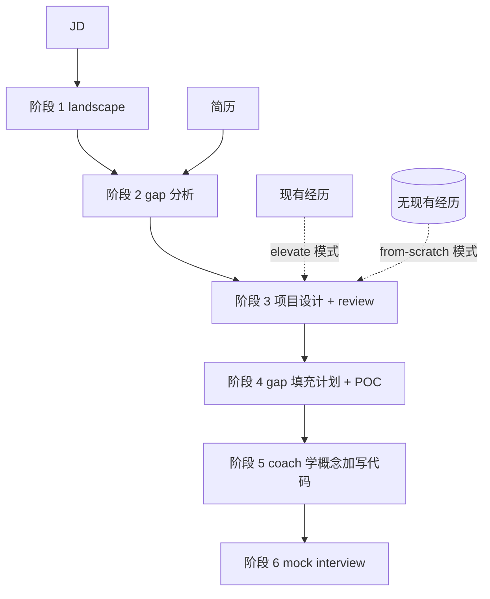

# 从 0 设计项目：起点是 JD, 终点是面试就绪

> 这是 examples 系列的第八篇。前置：先读 [07-elevate-existing-project](../07-elevate-existing-project/README-cn.md)。这一篇沿用 07 的同一套工作流，只在第 3 阶段换了个模式。如果 07 你读懂了，这一篇大半内容你已经会了。

## 1. 课程导读

06 把准备项目素材分成了三条路。方法二（拔高已有项目）是 07 讲的：你有一段薄经历，把它重新设计深一些。方法三（从 0 自己设计一个 mini project）就是这一篇 08 讲的：你**没有**任何相关经历，但你看上了一个具体的 JD，那就以这个 JD 为锚，反推一个你将要去做的项目。

这一篇的关键命题非常简单：07 的 6 阶段工作流，原封不动也适用于 08。改的只是第 3 阶段 `mini-project-design` 的调用模式。07 里它跑的是 `elevate` 模式（在已有经历的约束下重写），08 里它跑的是 `from-scratch` 模式（没有已有经历，前瞻性地设计一个全新项目）。

换句话说，如果 07 你已经读懂了链路是怎么累积上下文的，08 你只需要看清楚一件事：起点没有现成经历的时候，整个链路依然成立，只是第 3 阶段的输入和输出形态变了一点。

> 注：这一节同样不教你具体怎么实现每个 skill。它教你**起点不同的时候**这个工作流长什么样、需要你额外注意什么。

---

## 2. 工作流的本质：跟 07 一样, 只是起点不同

先把 07 §2 的那张图复述一下。这是 6 个阶段输入累积的样子。

链路完全没变。每一阶段都是「拿前面所有产出 + 一点新输入 → 新产出」。第 6 阶段拿到的上下文厚度跟 07 一样：简历加 JD 加 landscape 4 篇加 gap 分析加 case 加学习计划加 POC 实操加 mock 转录。

唯一的差异在第 3 阶段。07 里 `mini-project-design` 的输入里有一项「locked business context」：同一家公司、同一段时间、同一个 mentor，project-design skill 只能在这些约束里重组事实。08 里没有这一项。skill 切到 `from-scratch` 模式，产出的 case 是前瞻性的：它描述的是「你**将要**做什么」，不是「你做过什么」。

骨架同源，参数不同。这就是 06 + 07 + 08 之间的关系。

---

## 3. John 的起点：JD 加 capacity profile, 没有现有经历

我们换一个 John 的时间切片。这次是 2026 年 1 月底到 2 月初，离他要找 Summer 2026 实习只剩最后一波窗口。

他手里的简历还是 [resume-old.md](../../students/john-doe/resume-old.md)。Cedar Ridge 那段薄 SQL 报表实习刚做完，加上几个课程项目。Summary 写着「对数据系统和应用 ML 感兴趣」，泛泛得跟同期 99% 的 CS 硕士没区别。

但他这次想换方向。Cedar Ridge 走的是数据加 BI，他更想做后端工程。2026 年 1 月 15 日 Pulse Social 放出了 Backend Engineer Intern 的招聘，岗位描述在 [job-description.md](../../students/john-doe/experiences/from-2026-04-to-2026-09-pulse-social-feed-ranker/qualify-for-Pulse-Social-Backend-Engineer-Intern/job-description.md)。JD 里写得很直接：Go、SQL、微服务、gRPC、Kubernetes、Redis、消息队列。

John 摸一下自己的家底：Go 没写过，分布式系统只上过课没碰过工业实践，gRPC 没用过，Kubernetes 只在本地起过 minikube 玩过一次。一句话，**这个 JD 上要求的几乎所有东西他都没做过**。

07 的玩法在这里失效。他没有任何「Pulse 类的后端实习」可以拿来 elevate。他只能反过来问：**假设我 6 月真的能拿到 Pulse 这个实习，我打算在那 12 周里做什么，才能让这段经历回头看跟这个 JD 完全咬合？** 这就是 08 的起点。

---

## 4. 6 个阶段, 跟 07 同骨架

下面这张表跟 07 §4 的那张几乎完全一样。唯一不同的是第 3 行多了一个「`from-scratch` 模式」的标注。

| 阶段 | 用什么 skill | 输入 | 新产出 | 产出存在哪 |
|---|---|---|---|---|
| 1. 理解目标 | `understand-landscape` | JD | landscape 4 篇加 index | `qualify-for-.../landscape/` |
| 2. 诊断 gap | `qualify-gap-plan` 第一部分 | JD 加 landscape 加当前简历 | gap 分析 | `qualify-for-.../01-gap-analysis-cn.md` |
| 3. 设计项目 (**from-scratch** 模式) | `mini-project-design` 加 `mini-project-review` | 上面所有加 capacity profile, **不带现有经历** | 前瞻性的 case | `qualify-for-.../case-cn.md` |
| 4. 拆 gap 为学习计划 | `qualify-gap-plan` 第二部分 | 上面所有 | gap 填充计划加 mini-POC 设计加教程目录 | `qualify-for-.../02-gap-fill-plan-cn.md` 加 `pocs/` 加 `tutorials/` |
| 5. 练（学概念加写代码） | `qualify-coach` | 上面所有 | 概念学习笔记加 POC 代码加实操记录 | `pocs/poc-*/` 各文件夹 |
| 6. 验（mock interview） | `qualify-mock-interview` | 上面所有 | 面试转录加薄弱点报告加下一轮补课清单 | `qualify-for-.../mock-interview-{n}-cn.md` |

放在 Pulse 这个例子上，全部产出都进 `students/john-doe/experiences/from-2026-04-to-2026-09-pulse-social-feed-ranker/qualify-for-Pulse-Social-Backend-Engineer-Intern/` 这个文件夹。文件夹名字编码了「这次 qualify 的是哪段经历、对哪个岗位」。注意：经历文件夹用的是项目执行的时段（2026-04 到 2026-09），即便 John 在 2 月就开始设计，文件夹名字也已经为执行期预留好了位置。

> 注：表里第 1 阶段用的 `understand-landscape` skill 是**前置课程 career_planning 里教过的内容**，不在本仓库教学里展开。本课假设你已经会用它，把一个 JD 反向解构成 4 篇 industry / company / role / market 调研报告。如果还没学过，回头补一下那门课再继续。本课从第 2 阶段开始展开。

---

## 5. 每个阶段实际长什么样

抽象工作流讲完了。下面带你看 John 在 Pulse 这个例子里实际跑出来的几个文档。

**阶段 1 产物**：landscape 4 篇 (industry / company / role / market) 跟 07 同样的力气。Pulse 是一家 200 人、800 万 MAU 的消费社交，主战场是 Home Feed。这些细节、它的工程文化、它在消费社交细分赛道里的位置，都是 landscape 阶段挖出来的。挖出来之后你才知道：JD 里那句「we treat the feed as a craft」不是空话，他们在 Feed 工程上是真的下重注。

**阶段 2 产物**：gap analysis。John 把自己的 resume-old.md 跟 Pulse 的 JD 一比，9 个 gap 按 🔴 / 🟡 / 🟠 拆开。🔴 Core 里至少有 Go 工程能力、gRPC、Redis 实战、微服务设计、Kubernetes 真部署这 5 项。这一步跟 07 完全同形态：诚实审计，不掺水。

**阶段 3 产物**：[case-cn.md](../../students/john-doe/experiences/from-2026-04-to-2026-09-pulse-social-feed-ranker/qualify-for-Pulse-Social-Backend-Engineer-Intern/) 里的 case 文件 (`mini-project-design` 在 `from-scratch` 模式下产出)。这是这一篇最关键的一个文件。它跟 07 的 case 长得很像 (业务背景 / 触发事件 / 范围 / 团队 / 我做了什么 / 决策回放 / 产出 / 反思)，但语气是前瞻的。它写的是：「假设我在 Pulse 拿到这个实习，我打算这样做这个 feed-ranking 微服务」。它就是 John 用来「在拿到这个实习之前就把它在脑子里跑一遍」的设计稿。后面这个文件在执行结束后会成熟成 [executed-case-cn.md](../../students/john-doe/experiences/from-2026-04-to-2026-09-pulse-social-feed-ranker/executed-case-cn.md)，记录真正发生了什么。这两份对照看一眼，你就明白「设计版」和「执行版」分别是什么形态。

**阶段 4 产物**：gap-fill-plan 跟 07 同形态。把 🔴 / 🟡 gap 各对应一个 mini-POC。比如 Go 工程能力就是一个 Go 写的小 Wikipedia QA 服务；gRPC 就是用 protobuf 定义一个 3-RPC 的契约自己起客户端服务端打通；Redis 实战就是用 Sorted Set 实现「最近见过」过滤。注意：每个 POC 是**学技能的小项目**，不是假装的业务项目。这一条 07 已经讲过, 08 同样适用。

**阶段 5、6 产物**：跟 07 一样，2 到 3 轮「学 → 考 → 学 → 考」直到 4 到 5 个 🔴 Core gap 都能「看 JD 立刻能讲」。这一节同样不展开了。

---

## 6. 从「设计」到「执行后总结」: 这段时间发生了什么

这一节是 08 独有的。07 里 John 永远不会再去重做 Cedar Ridge 那段实习；他做的是把它在脑子里**重新理解**得更深，简历和面试就靠这层重新理解撑住。08 里完全不一样：**John 真的会去做这个项目**。

时间线大概是这样：

| 时间 | 发生了什么 | case 文件状态 |
|---|---|---|
| 2026-01 中下旬 | Pulse JD 放出, John 锁定它当目标 | 还不存在 |
| 2026-02 | 跑完阶段 1 到 4：landscape, gap, case 设计, 学习计划 | **前瞻版** `case-cn.md` 产出, 描述「我打算这样做」 |
| 2026-03 到 04 | 跑阶段 5、6：POC 实操加 2 到 3 轮 mock interview | 前瞻 case 不动, 学习产物在 `pocs/` 累积 |
| 2026-04 | Pulse 面试, 拿到 offer | 前瞻 case 在面试间里被反复讲 |
| 2026-06 到 09 | 真的去 Pulse 执行 12 周实习 | 前瞻 case 是 mentor 第一周对齐用的设计稿 |
| 2026-09 之后 | 项目结束, 复盘 | case 成熟成 [`executed-case-cn.md`](../../students/john-doe/experiences/from-2026-04-to-2026-09-pulse-social-feed-ranker/executed-case-cn.md), 记录真正发生的事 |

理解这一段对 08 学生很重要。**一份「设计稿」如果没有真正的执行落地，就是 fantasy**。这是 08 比 07 多出来的、必须提醒的事。

执行的「venue」（场地）是关键。 08 设计出来的项目必须有一个可信的执行通道：拿到对应实习、跟一个开源项目长期 contribute、找一个 apprenticeship。Pulse 这个例子里 John 的 venue 就是 Pulse 实习本身。没有 venue 就不要写。一个你 6 个月内 100% 不会有机会做的项目，不管设计得多漂亮，回头投出去都没有任何说服力。面试官只要问一句「你这是真的做了, 还是只是想了一遍」, 整套故事立刻崩。

也正是因为 venue 的存在很苛刻，08 阶段 3 在 review 的时候必须问一个 07 不需要问的问题：**这个项目, 你有渠道真的去做吗?** 如果没有，要么换 venue（找一个能真正执行的小一点的开源切片），要么把 scope 砍到 mentorless 也能 6 个月做出来的程度。这是 08 特有的可行性约束。

---

## 7. 导师寄语

06 + 07 + 08 三篇，是一个三角形。

- **方法一 (mentor designed)**: 项目是别人塞给你的。你只需要好好执行就行，比如 John 那段 NovaRisk 冬季 contractor。
- **方法二 (elevate, 07)**: 你已经有一段薄经历, 你的工作是**把它重新理解深**。Cedar Ridge → Cascadia 那条线就是这条。
- **方法三 (from-scratch, 08)**: 你什么都没有, 只有一个想去的 JD, 你的工作是**从 JD 反推一个值得做的设计**, 然后真的去做。Pulse 这条线就是这条。

三条路最后都汇到同一个下游：用同一套 6 阶段工作流, 跑同样的 `qualify-gap-plan`、`qualify-coach`、`qualify-mock-interview`, 最后走进同样的面试间。`mini-project-design` 这一个 skill 就是 elevate 和 from-scratch 两种模式的合体, 它把这三条路在工程上统一了。

我常碰到学生问「我没有实习也没有项目, 怎么办」。半数人的反应是「那我就再去刷一遍 LeetCode 吧」, 这是错答案。正确答案是：选一个具体的 JD, 跑一遍 08 的链路, 把设计跑通, 然后想办法找到执行 venue。即便你最后没拿到那个 JD 对应的实习, 你跑出来的 landscape、gap 分析、case 设计、POC 实操, 都是真东西, 都能搬到下一个目标 JD 上再跑一次。

工作流的杠杆在于它**对起点宽容, 对终点严格**。起点你可以是「什么都没有」, 终点必须是「能进面试间说清每一个决策」。08 教的就是从最难的那个起点出发, 怎么走到同样严格的那个终点。

到这里你已经有了完整的项目素材库（一份 elevated case 或 from-scratch case 加配套的 landscape、gap 分析、fill plan、POC 实操、mock 面试转录）。下一节 09-write-bullets 教你**怎么从这份万字 case 文档压缩出简历上的 3 到 4 条 bullet**, 而且保证这些 bullet 经得起面试官追问。
