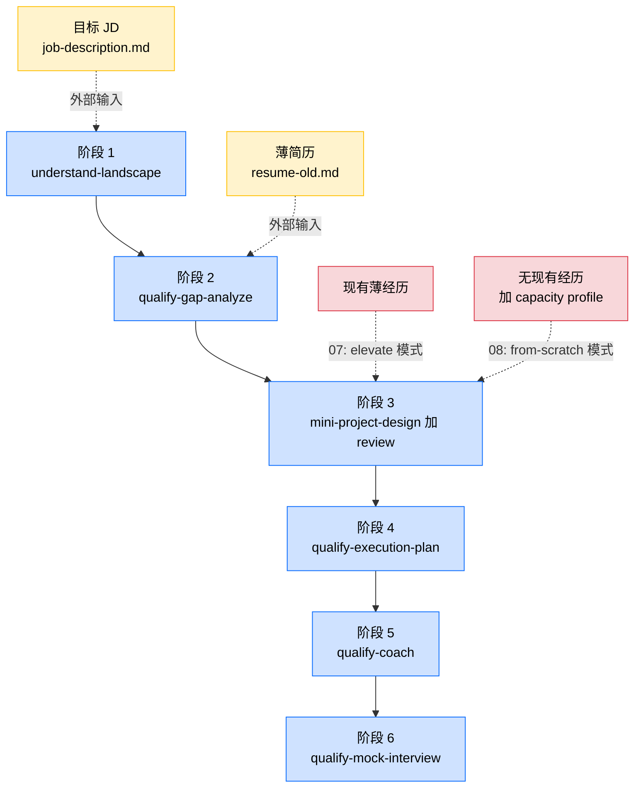

# 从 0 设计项目: 起点是 JD, 终点是面试就绪

> 这是 examples 系列的第八篇. 前置: 先读 [07-elevate-existing-project](../07-elevate-existing-project/README-cn.md). 这一篇沿用 07 的同一套工作流, 只在第 3 阶段换了个模式. 如果 07 你读懂了, 这一篇大半内容你已经会了.

## 1. 课程导读

06 把准备项目素材分成了三条路. 方法二 (拔高已有项目) 是 07 讲的: 你有一段薄经历, 把它重新设计深一些. 方法三 (从 0 自己设计一个 mini project) 就是这一篇 08 讲的: 你**没有**任何相关经历, 但你看上了一个具体的 JD, 那就以这个 JD 为锚, 反推一个你将要去做的项目.

这一篇的关键命题非常简单: 07 的 6 阶段工作流, 原封不动也适用于 08. 改的只是第 3 阶段 `mini-project-design` 的调用模式. 07 里它跑的是 `elevate` 模式 (在已有经历的约束下重写), 08 里它跑的是 `from-scratch` 模式 (没有已有经历, 前瞻性地设计一个全新项目).

换句话说, 如果 07 你已经读懂了链路是怎么累积上下文的, 08 你只需要看清楚一件事: 起点没有现成经历的时候, 整个链路依然成立, 只是第 3 阶段的输入和输出形态变了一点.

---

## 2. 工作流的本质: 跟 07 一样, 只是起点不同

复述一遍 [07 §2](../07-elevate-existing-project/README-cn.md#2-工作流的本质输入叠加) 那条 6 阶段链路: landscape → gap 分析 → 项目 case → fill plan → coach → mock. 08 沿用这同一条链路, 只在第 3 阶段换了个调用模式 (从 `elevate` 切成 `from-scratch`).

看图之前先快速过一遍 08 这条路上的产物. 这一节假设你**先读过** [07 §2](../07-elevate-existing-project/README-cn.md#2-工作流的本质输入叠加) (那里展开讲了 9 类产物分别是什么). 08 的产物清单跟 07 几乎完全一样, 只有 3 处不同:

- **没有"原始薄经历"文件**: 起点是白纸, 没有任何相关现有经历可以拔高. 第 3 阶段的输入里相应也少了这一份.
- **[`case-cn.md`](../../students/john-doe/experiences/from-2026-04-to-2026-09-pulse-social-feed-ranker/qualify-for-Pulse-Social-Backend-Engineer-Intern/case-cn.md) 是"前瞻版"** (forward-looking): 文档语气用"我计划 / 我将要", 而不是 07 那种"我做了 / 我建了", 因为这是写在执行之前的设计稿.
- **多一份 [`executed-case-cn.md`](../../students/john-doe/experiences/from-2026-04-to-2026-09-pulse-social-feed-ranker/executed-case-cn.md)**: 项目真去执行 12 周后回头写的"成熟版"case, 记录真正发生的事. 08 比 07 多这一份, 因为这条路径是"真去执行", 设计 → 执行 → 成熟是有形态变化的, 详情见 §6.

下面这张图把整套工作流画成"主干加旁路输入"的形态: 阶段 1 到阶段 6 是从上到下的主干 (蓝色), 旁边伸进来的虚线箭头是各阶段需要的外部输入. 其中**阶段 3 是 07 和 08 唯一形态不同的地方**, 所以画了两条候选输入: 07 走"现有经历" (`elevate` 模式), 08 走"无现有经历加 capacity profile" (`from-scratch` 模式).

链路本身完全没变. 每一阶段都是"拿前面所有产出加一点新输入产出新东西". 第 6 阶段累积到手的资料厚度跟 07 一样: 简历加 JD 加 landscape 5 篇加 gap 分析加 case 加学习计划加 POC 实操加 mock 转录.

唯一的形态差异在第 3 阶段. 07 里 `mini-project-design` 的输入里有一项"locked business context": 同一家公司, 同一段时间, 同一个 mentor, design skill 只能在这些约束里重组事实. 08 里没有这一项. skill 切到 `from-scratch` 模式, 产出的 case 是前瞻性的: 它描述的是"你**将要**做什么", 不是"你做过什么".

骨架同源, 参数不同. 这就是 06 + 07 + 08 之间的关系.

---

## 3. John 的起点: JD 加 capacity profile, 没有现有经历

我们换一个 John 的时间切片. 这次是 2026 年 1 月底到 2 月初, 离他要找 Summer 2026 实习只剩最后一波窗口.

他手里的简历还是 [resume-old.md](../../students/john-doe/resume-old.md). Cedar Ridge 那段薄 SQL 报表实习刚做完, 加上几个课程项目. Summary 写着"对数据系统和应用 ML 感兴趣", 泛泛得跟同期 99% 的 CS 硕士没区别.

但他这次想换方向. Cedar Ridge 走的是数据加 BI, 他更想做后端工程. 2026 年 1 月 15 日 Pulse Social 放出了 Backend Engineer Intern 的招聘, 岗位描述在 [job-description.md](../../students/john-doe/experiences/from-2026-04-to-2026-09-pulse-social-feed-ranker/qualify-for-Pulse-Social-Backend-Engineer-Intern/job-description.md). JD 里写得很直接: Go, SQL, 微服务, gRPC, Kubernetes, Redis, 消息队列.

John 摸一下自己的家底: Go 没写过, 分布式系统只上过课没碰过工业实践, gRPC 没用过, Kubernetes 只在本地起过 minikube 玩过一次. 一句话, **这个 JD 上要求的几乎所有东西他都没做过**.

07 的玩法在这里失效. 他没有任何"Pulse 类的后端实习"可以拿来 elevate. 他只能反过来问: **假设我 6 月真的能拿到 Pulse 这个实习, 我打算在那 12 周里做什么, 才能让这段经历回头看跟这个 JD 完全咬合?** 这就是 08 的起点.

---

## 4. 6 个阶段, 跟 07 同骨架

下面这张表跟 [07 §4](../07-elevate-existing-project/README-cn.md) 的那张几乎完全一样, 差异是第 3 行 skill 切到 `from-scratch` 模式, 输入不带"现有经历", 输出是"前瞻版"case. 文件路径全部指向 Pulse 这个例子的实际位置.

| 阶段 | 解释 | 输入文档 | 输出文档 |
|---|---|---|---|
| 阶段 1 `understand-landscape` | 把目标 JD 当尽调对象, 调研行业加公司加角色加市场 | [`job-description.md`](../../students/john-doe/experiences/from-2026-04-to-2026-09-pulse-social-feed-ranker/qualify-for-Pulse-Social-Backend-Engineer-Intern/job-description.md) | [`landscape/`](../../students/john-doe/experiences/from-2026-04-to-2026-09-pulse-social-feed-ranker/qualify-for-Pulse-Social-Backend-Engineer-Intern/landscape/) 5 篇 (本仓库示例只展开了 `00-title-cn.md`) |
| 阶段 2 `qualify-gap-analyze` | 对照 JD 和 landscape 诚实诊断当前简历的差距 | 上面所有加 [`resume-old.md`](../../students/john-doe/resume-old.md) | [`gap-analysis-cn.md`](../../students/john-doe/experiences/from-2026-04-to-2026-09-pulse-social-feed-ranker/qualify-for-Pulse-Social-Backend-Engineer-Intern/gap-analysis-cn.md) (stub) |
| 阶段 3 `mini-project-design` 加 `mini-project-review` (**from-scratch 模式**) | 拿 gap analysis 当指南, 在无现有经历约束下前瞻性地设计 case, 3 轮迭代 | 上面所有加 gap analysis 加 capacity profile (**不带现有经历**) | [`case-cn.md`](../../students/john-doe/experiences/from-2026-04-to-2026-09-pulse-social-feed-ranker/qualify-for-Pulse-Social-Backend-Engineer-Intern/case-cn.md) 前瞻版 |
| 阶段 4 `qualify-execution-plan` | 拿 gap analysis 加前瞻 case 当输入, 推出周计划 + POC + 教程 | 上面所有加 [`case-cn.md`](../../students/john-doe/experiences/from-2026-04-to-2026-09-pulse-social-feed-ranker/qualify-for-Pulse-Social-Backend-Engineer-Intern/case-cn.md) | [`execution-plan-cn.md`](../../students/john-doe/experiences/from-2026-04-to-2026-09-pulse-social-feed-ranker/qualify-for-Pulse-Social-Backend-Engineer-Intern/execution-plan-cn.md) 加 [`pocs/`](../../students/john-doe/experiences/from-2026-04-to-2026-09-pulse-social-feed-ranker/qualify-for-Pulse-Social-Backend-Engineer-Intern/pocs/) 加 [`tutorials/`](../../students/john-doe/experiences/from-2026-04-to-2026-09-pulse-social-feed-ranker/qualify-for-Pulse-Social-Backend-Engineer-Intern/tutorials/) |
| 阶段 5 `qualify-coach` | 一个 gap 一个 gap 地学概念加写 POC, 顺便感受 case 难度 | 上面所有 | `coach-notes/` 动态生成于 [qualify-for 目录](../../students/john-doe/experiences/from-2026-04-to-2026-09-pulse-social-feed-ranker/qualify-for-Pulse-Social-Backend-Engineer-Intern/) |
| 阶段 6 `qualify-mock-interview` | 用 AI 扮演陌生面试官真刀真枪压测 | 上面所有 | `mock-interview-{n}-cn.md` 动态生成于 [qualify-for 目录](../../students/john-doe/experiences/from-2026-04-to-2026-09-pulse-social-feed-ranker/qualify-for-Pulse-Social-Backend-Engineer-Intern/) |

全部产出都进 [`from-2026-04-to-2026-09-pulse-social-feed-ranker/qualify-for-Pulse-Social-Backend-Engineer-Intern/`](../../students/john-doe/experiences/from-2026-04-to-2026-09-pulse-social-feed-ranker/qualify-for-Pulse-Social-Backend-Engineer-Intern/) 这个文件夹. 文件夹名字编码了"这次 qualify 的是哪段经历, 对哪个岗位". 注意: 经历文件夹用的是项目执行的时段 (2026-04 到 2026-09), 即便 John 在 2 月就开始设计, 文件夹名字也已经为执行期预留好了位置.

> 注: 表里第 1 阶段用的 `understand-landscape` skill 是**前置课程 career_planning 里教过的内容**, 不在本仓库教学里展开. 本课假设你已经会用它, 把一个 JD 反向解构成 4 篇 industry / company / role / market 调研报告加 1 篇 index. 如果还没学过, 回头补一下那门课再继续. 本课从第 2 阶段开始展开. 如果你的目标是一整个 Job Family 而不是一家具体公司, 阶段 1 该怎么把多份 JD 综合成一份 landscape 再往下走, 见 [07 §4.1 "当目标是一整个 Job Family, 而不是一家具体公司时"](../07-elevate-existing-project/README-cn.md#当目标是一整个-job-family-而不是一家具体公司时), 08 沿用同一套做法.

---

## 5. 看一眼这些产物的细节: 08 特有的几处长什么样

§2 列了产物清单和差异, §4 表格也给了链接, 但只看文件名感受不到 08 跟 07 的具体落差. 这一节带你点进 08 几个**跟 07 形态不同**的关键文件具体看一眼, 体会 from-scratch 模式的特殊之处.

**[landscape `00-title-cn.md`](../../students/john-doe/experiences/from-2026-04-to-2026-09-pulse-social-feed-ranker/qualify-for-Pulse-Social-Backend-Engineer-Intern/landscape/00-title-cn.md)** (本仓库示例只展开了 index 这一篇): 跟 07 同样的力气. Pulse 是一家 200 人, 800 万 MAU 的消费社交, 主战场是 Home Feed. 这些细节, 它的工程文化, 它在消费社交细分赛道里的位置, 都是 landscape 阶段挖出来的. 挖出来之后你才知道: JD 里那句"we treat the feed as a craft"不是空话, 他们在 Feed 工程上是真的下重注.

**阶段 2 gap analysis** (本仓库为 stub): John 把自己的 resume-old.md 跟 Pulse 的 JD 一比, 9 个 gap 按 🔴 / 🟡 / 🟠 拆开. 🔴 Core 里至少有 Go 工程能力, gRPC, Redis 实战, 微服务设计, Kubernetes 真部署这 5 项. 这一步跟 07 完全同形态: 诚实审计, 不掺水.

**[前瞻版 `case-cn.md`](../../students/john-doe/experiences/from-2026-04-to-2026-09-pulse-social-feed-ranker/qualify-for-Pulse-Social-Backend-Engineer-Intern/case-cn.md) vs [成熟版 `executed-case-cn.md`](../../students/john-doe/experiences/from-2026-04-to-2026-09-pulse-social-feed-ranker/executed-case-cn.md)**: 这是 08 最值得对照打开的一对. 前瞻版用"我计划""我将要"语气, 写的是"假设我在 Pulse 拿到这个实习, 我打算这样做 feed-ranking 微服务", 是 John 在执行前"在脑子里把项目跑一遍"的设计稿. 成熟版用"我做了""我建了"语气, 是 4 个月内 Pulse 实习真做完后回头写的回顾. 两份对照看, 你就明白 from-scratch 这条路上"设计稿 → 执行 → 成熟 case"的弧线长什么样. 这一对是 08 独有的, 07 没有对应物.

**阶段 4 产物** (本仓库 fill plan 和 POC 也是 stub): 跟 07 同形态. 把 🔴 / 🟡 gap 各对应一个 mini-POC. 比如 Go 工程能力就是一个 Go 写的小 Wikipedia QA 服务; gRPC 就是用 protobuf 定义一个 3-RPC 的契约自己起客户端服务端打通; Redis 实战就是用 Sorted Set 实现"最近见过"过滤. 每个 POC 是**学技能的小项目**, 不是假装的业务项目. 这一条 07 已经讲过, 08 同样适用.

**阶段 5, 6 产物**: 跟 07 一样, 2 到 3 轮"学 → 考 → 学 → 考"直到 4 到 5 个 🔴 Core gap 都能"看 JD 立刻能讲". 本仓库示例同样不展开 (动态生成于 qualify-for 目录下).

---

## 6. 从"设计"到"执行后总结": 这段时间发生了什么

这一节是 08 独有的. 07 里 John 永远不会再去重做 Cedar Ridge 那段实习; 他做的是把它在脑子里**重新理解**得更深, 简历和面试就靠这层重新理解撑住. 08 里完全不一样: **John 真的会去做这个项目**.

时间线大概是这样:

| 时间 | 发生了什么 | case 文件状态 |
|---|---|---|
| 2026-01 中下旬 | Pulse JD 放出, John 锁定它当目标 | 还不存在 |
| 2026-02 | 跑完阶段 1 到 4: landscape, gap, case 设计, 学习计划 | **前瞻版** `case-cn.md` 产出, 描述"我打算这样做" |
| 2026-03 到 04 | 跑阶段 5, 6: POC 实操加 2 到 3 轮 mock interview | 前瞻 case 不动, 学习产物在 `pocs/` 累积 |
| 2026-04 | Pulse 面试, 拿到 offer | 前瞻 case 在面试间里被反复讲 |
| 2026-06 到 09 | 真的去 Pulse 执行 12 周实习 | 前瞻 case 是 mentor 第一周对齐用的设计稿 |
| 2026-09 之后 | 项目结束, 复盘 | case 成熟成 [`executed-case-cn.md`](../../students/john-doe/experiences/from-2026-04-to-2026-09-pulse-social-feed-ranker/executed-case-cn.md), 记录真正发生的事 |

理解这一段对 08 学生很重要. **一份"设计稿"如果没有真正的执行落地, 就是 fantasy**. 这是 08 比 07 多出来的, 必须提醒的事.

执行的"venue" (场地) 是关键.  08 设计出来的项目必须有一个可信的执行通道: 拿到对应实习, 跟一个开源项目长期 contribute, 找一个 apprenticeship. Pulse 这个例子里 John 的 venue 就是 Pulse 实习本身. 没有 venue 就不要写. 一个你 6 个月内 100% 不会有机会做的项目, 不管设计得多漂亮, 回头投出去都没有任何说服力. 面试官只要问一句"你这是真的做了, 还是只是想了一遍", 整套故事立刻崩.

也正是因为 venue 的存在很苛刻, 08 阶段 3 在 review 的时候必须问一个 07 不需要问的问题: **这个项目, 你有渠道真的去做吗?** 如果没有, 要么换 venue (找一个能真正执行的小一点的开源切片), 要么把 scope 砍到 mentorless 也能 6 个月做出来的程度. 这是 08 特有的可行性约束.

---

## 7. 导师寄语

06 + 07 + 08 三篇, 是一个三角形.

- **方法一 (mentor designed)**: 项目是别人塞给你的. 你只需要好好执行就行, 比如 John 那段 NovaRisk 冬季 contractor.
- **方法二 (elevate, 07)**: 你已经有一段薄经历, 你的工作是**把它重新理解深**. Cedar Ridge → Cascadia 那条线就是这条.
- **方法三 (from-scratch, 08)**: 你什么都没有, 只有一个想去的 JD, 你的工作是**从 JD 反推一个值得做的设计**, 然后真的去做. Pulse 这条线就是这条.

三条路最后都汇到同一个下游: 用同一套 6 阶段工作流, 跑同样的 `qualify-gap-analyze`, `qualify-execution-plan`, `qualify-coach`, `qualify-mock-interview`, 最后走进同样的面试间. `mini-project-design` 这一个 skill 就是 elevate 和 from-scratch 两种模式的合体, 它把这三条路在工程上统一了.

我常碰到学生问"我没有实习也没有项目, 怎么办". 半数人的反应是"那我就再去刷一遍 LeetCode 吧", 这是错答案. 正确答案是: 选一个具体的 JD, 跑一遍 08 的链路, 把设计跑通, 然后想办法找到执行 venue. 即便你最后没拿到那个 JD 对应的实习, 你跑出来的 landscape, gap 分析, case 设计, POC 实操, 都是真东西, 都能搬到下一个目标 JD 上再跑一次.

工作流的杠杆在于它**对起点宽容, 对终点严格**. 起点你可以是"什么都没有", 终点必须是"能进面试间说清每一个决策". 08 教的就是从最难的那个起点出发, 怎么走到同样严格的那个终点.

到这里你已经有了完整的项目素材库 (一份拔高 case 或 from-scratch case 加配套的 landscape, gap 分析, fill plan, POC 实操, mock 面试转录). 下一节 [09-write-bullets](../09-write-bullets/README-cn.md) 教你**怎么从这份万字 case 文档压缩出简历上的 3 到 4 条 bullet**, 而且保证这些 bullet 经得起面试官追问.

---

## 9. 阶段性总结: 06 加 07 加 08 三篇到底在解决什么

走完 06 加 07 加 08 这三章, 也走完了 01 到 08 的前半段课程, 适合在动手写 bullet 之前先停一下做一次阶段性回顾. 最本质的命题非常简单:

> 我手里只有一份还不够看的简历, 我盯上了一个目标岗位. 我怎么一步步地通过规划一个项目 (既能填厚简历, 也能真正提升自己的能力), 走到能投递, 能进面试间, 能讲清每一个决策?

整套流程从头到尾拆开看, 就是下面这 7 步. 每一步括号里标了对应的 skill 或者前置课程内容, 方便你回查.

1. 起点对齐. 手里只有一份还不够看的简历, 加一个已经定位好的目标岗位. 这是"职业定位"环节做的事, 本课程的前置课程 career_planning 教的.
2. 深度调研. 把目标岗位背后的"行业 + 公司 + 角色族 + 市场"全部摸透. 这一步用前置课程的 `understand-landscape` skill.
3. 诊断差距. 根据调研结果分析"我现在跟这个岗位差在哪". 这一步用 `qualify-gap-analyze`, 只产一份诚实的诊断文档, 不产 POC 也不产周计划.
4. 设计项目. 拿上一步的 gap 分析当指南, 设计一个不太难也不太简单的项目, 正好把这些差距补上. 这一步用 `mini-project-design` 加 `mini-project-review` 配套迭代.
5. 细化执行. 把项目拆成"具体怎么干 + 要补哪些学习材料 + 哪些 mini-POC 练手". 这一步用 `qualify-execution-plan`, 输入是上面的 gap 分析 + case, 输出周计划 + POC + 教程占位.
6. 试一下能不能搞定. 拿学习材料和 POC 真上手做几下, 感受 3 到 6 个月内能不能 hold 住. hold 不住就回阶段 4 把 case 设计降难度重来; hold 得住就把 case 文档 finalize 下来.
7. 写简历投递. 到这一步你手上的信息已经够你写一份过关的简历了. 按后面 [09-write-bullets](../09-write-bullets/README-cn.md) 教的方法把 bullet 写好, 按 [10-write-summary](../10-write-summary/README-cn.md) 写 summary, 按 [11-submit-and-collaborate](../11-submit-and-collaborate/README-cn.md) 教的方法投递出去就行.

至于"投递之后到拿到面试之间, 用 AI 陪你深学每份学习资料 + 用 AI 模拟面试官给你压力测试", 那是 `qualify-coach` 和 `qualify-mock-interview` 干的事, 是"投递到走进面试间"这段时间的工作, 不在"拿到一份能投递的简历"这条最短路径里. 这两步重要, 但跟"写出一份够用的简历"是解耦的.

### 9.1 这些 skill 在整件事里到底是什么角色

可能你已经注意到了, 上面 7 步用到的 skill 加起来一共是 6 个: `qualify-gap-analyze`, `mini-project-design`, `mini-project-review`, `qualify-execution-plan`, `qualify-coach`, `qualify-mock-interview`. 这是 06 加 07 加 08 三章工作流的"主干 6 个 skill".

跟改简历有关的 skill 全套其实有 10 个. 剩下的 4 个 (`bullet-writer`, `bullet-reviewer`, `summary-writer`, `summary-reviewer`) 是 09 和 10 才教的, 专门负责"从 case 压成 bullet"和"从 bullet 反推 Summary"这两件事. 所以 06 加 07 加 08 看到的"6 个 skill"是"主干 6 个"的意思, 不是"全部就这 6 个".

更重要的, 这些 skill 不是这件事的"主角". 它们只是"这件事每个阶段的输入和输出加几条质量下限"的工程化封装.

不要拘泥于这些 skill 当前的具体写法. 每个 skill 本质上只是把"这个阶段的输入是什么, 产出是什么, 容易踩什么坑"用 prompt 工程的方式定义好, 然后保证它面对不同学生的需求时表现一致地够用而已. 如果你已经吃透了上面那 7 步每一步的逻辑, 你完全可以:

- 单独拿某个 skill 出来用 (例如只跑 `qualify-gap-analyze` 给自己做一次 gap 诊断, 不跑全套).
- 给 skill 加额外的需求, 背景信息, 特殊约束 (例如"我只剩 4 周不是 12 周, 请压缩学习计划""我是 PM 不是 SWE, POC 形态换成产品 case 拆解").
- 跳过某个 skill 自己手写它的输入产出 (例如 landscape 你想用读书会的方式做, case 你想直接拿导师手稿).
- 反过来用 (例如先有项目 case 再倒推 gap 分析).
- 把多个 skill 的产出合并成一个文档自己重新组织.

> 这套 skill 保证的不是"按这个流程做就最优", 而是"按这个流程做, 质量下限都到一个够用的程度". 把 skill 当成"质量底线托底", 不是"必须遵守的圣经", 你就用对了. 重点永远是"这 7 步流程加每一步的输入产出"本身, 而不是 skill 的具体调用方式. 流程是骨头, skill 是肉, 骨头才是这套课的真正资产.
