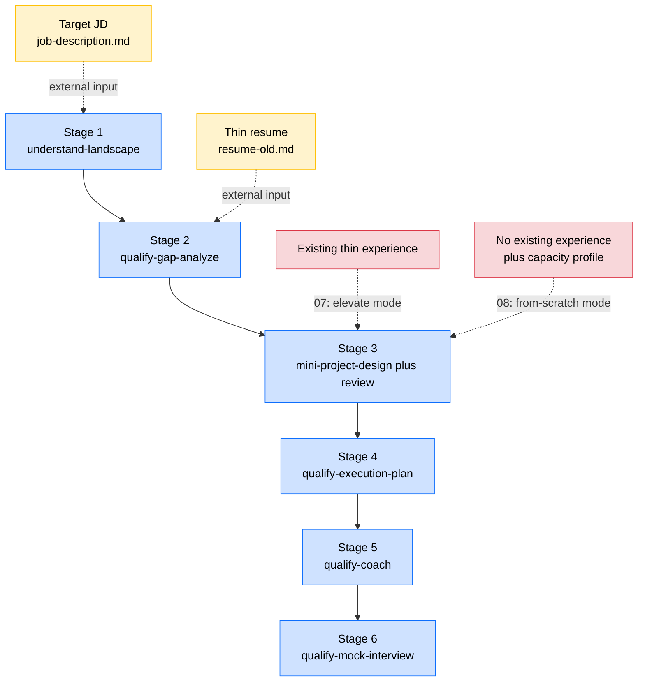

# Designing a Project from Scratch, Starting with the JD and Ending Interview Ready

> This is the eighth piece in the examples series. Prerequisite: read [07-elevate-existing-project](../07-elevate-existing-project/README.md) first. This piece reuses the same workflow as 07 and only swaps one mode in stage 3. If 07 made sense, most of this will already be familiar.

## 1. Course Overview

Piece 06 split project-prep into three tracks. Method two (elevate an existing project) was the subject of 07: you have a thin piece of experience and you redesign it deeper. Method three (design a mini project from scratch) is what 08 covers: you have **no** relevant experience yet, but you have your eye on a specific JD, so you anchor on that JD and work backwards to design a project you are going to build.

The key claim of this piece is simple. The 6-stage workflow from 07 carries over to 08 unchanged. The only thing that shifts is how stage 3 (`mini-project-design`) gets called. In 07 it runs in `elevate` mode (rewriting under the constraints of an existing experience). In 08 it runs in `from-scratch` mode (no existing experience, designing a brand new project forward in time).

Put differently, if you already understand how the pipeline accumulates context in 07, the only new thing in 08 is this: when you have no experience to start from, the pipeline still works, and only the input and output shape of stage 3 changes a little.

---

## 2. The Workflow at Its Core, Same as 07 with a Different Starting Point

To restate the 6-stage chain from [07 §2](../07-elevate-existing-project/README.md#2-工作流的本质输入叠加): landscape → gap analysis → project case → fill plan → coach → mock. 08 reuses this exact chain, only swapping the calling mode in stage 3 (from `elevate` to `from-scratch`).

Before looking at the diagram, quickly walk through the artifacts on the 08 path. This section assumes you have **already read** [07 §2](../07-elevate-existing-project/README.md#2-工作流的本质输入叠加) (which lays out all 9 artifact types). The 08 artifact list is nearly identical to 07, with only 3 differences:

- **No "original thin experience" file**: the starting point is a blank slate, with no relevant existing experience to elevate. Stage 3's input list is correspondingly shorter by one item.
- **[`case.md`](../../students/john-doe/experiences/from-2026-04-to-2026-09-pulse-social-feed-ranker/qualify-for-Pulse-Social-Backend-Engineer-Intern/case.md) is a "forward-looking version"**: the document uses "I plan to / I will" voice rather than the "I did / I built" voice of 07, because this is a design draft written before execution.
- **One extra [`executed-case.md`](../../students/john-doe/experiences/from-2026-04-to-2026-09-pulse-social-feed-ranker/executed-case.md)**: a "mature version" case written 12 weeks later, after the project has actually been executed, recording what really happened. 08 has this extra artifact (07 does not) because this path involves actually executing the project, so the design → execution → mature arc has real shape changes. See §6.

The diagram below draws the whole workflow as "main trunk plus side-channel inputs". Stages 1 through 6 form the top-to-bottom trunk (blue), and the dashed arrows coming in from the side are external inputs each stage needs. **Stage 3 is the one place where 07 and 08 diverge in shape**, so two candidate inputs are drawn: 07 takes the "existing experience" path (`elevate` mode), and 08 takes the "no existing experience plus capacity profile" path (`from-scratch` mode).

The pipeline itself does not change. Every stage is "take everything produced so far plus one new input, and produce one new thing". The total volume of material accumulated by stage 6 matches what you saw in 07: resume plus JD plus 5 landscape pieces plus gap analysis plus case plus learning plan plus POC hands-on plus mock interview transcripts.

The only shape difference is in stage 3. In 07, the inputs to `mini-project-design` include a "locked business context" item: same company, same time window, same mentor, and the design skill can only recombine facts inside those constraints. In 08 that item is gone. The skill switches to `from-scratch` mode, and the case it produces is forward-looking: it describes "what you **are going to** do", not "what you have done".

Same skeleton, different parameters. That is the relationship between 06, 07, and 08.

---

## 3. John's Starting Point, JD plus Capacity Profile and No Existing Experience

Switch to a different slice of John's timeline. This time it is late January to early February 2026, the last hiring window before his Summer 2026 internship search closes.

His resume is still [resume-old.md](../../students/john-doe/resume-old.md). The thin Cedar Ridge SQL reporting internship just wrapped, plus a few course projects. The Summary reads "interested in data systems and applied ML", as generic as 99 percent of his CS-master cohort.

This time he wants to switch directions. Cedar Ridge was data plus BI. He would rather do backend engineering. On January 15, 2026 Pulse Social posted a Backend Engineer Intern role, and the JD lives at [job-description.md](../../students/john-doe/experiences/from-2026-04-to-2026-09-pulse-social-feed-ranker/qualify-for-Pulse-Social-Backend-Engineer-Intern/job-description.md). The JD is blunt: Go, SQL, microservices, gRPC, Kubernetes, Redis, message queues.

John takes stock of what he actually has. He has never written Go. He has only taken a distributed systems course and never touched industrial practice. He has never used gRPC. He has played with minikube locally once. In short, **he has done almost nothing the JD asks for**.

The 07 playbook breaks down here. He has zero "Pulse-style backend internship" experience to elevate. He has to flip the question: **assume I actually land the Pulse internship in June. What do I plan to do during those 12 weeks so that looking back, this experience clicks perfectly into this JD?** That is the starting point for 08.

---

## 4. Six Stages, Same Skeleton as 07

The table below is nearly identical to the one in [07 §4](../07-elevate-existing-project/README.md), with one difference: row 3's skill switches to `from-scratch` mode, the input drops "existing experience", and the output is a "forward-looking version" case. All file paths point to the actual Pulse example.

| Stage | Explanation | Input documents | Output documents |
|---|---|---|---|
| Stage 1 `understand-landscape` | Treat the target JD as due-diligence material and research industry plus company plus role plus market | [`job-description.md`](../../students/john-doe/experiences/from-2026-04-to-2026-09-pulse-social-feed-ranker/qualify-for-Pulse-Social-Backend-Engineer-Intern/job-description.md) | [`landscape/`](../../students/john-doe/experiences/from-2026-04-to-2026-09-pulse-social-feed-ranker/qualify-for-Pulse-Social-Backend-Engineer-Intern/landscape/) 5 pieces (this repo only expands `00-title.md`) |
| Stage 2 `qualify-gap-analyze` | Honestly diagnose where the current resume falls short against JD and landscape | All of the above plus [`resume-old.md`](../../students/john-doe/resume-old.md) | [`gap-analysis.md`](../../students/john-doe/experiences/from-2026-04-to-2026-09-pulse-social-feed-ranker/qualify-for-Pulse-Social-Backend-Engineer-Intern/gap-analysis.md) (stub) |
| Stage 3 `mini-project-design` plus `mini-project-review` (**from-scratch mode**) | Use the gap analysis as a guide and forward-design a case with no existing-experience constraint, 3 iteration rounds | All of the above plus gap analysis plus capacity profile (**no existing experience**) | [`case.md`](../../students/john-doe/experiences/from-2026-04-to-2026-09-pulse-social-feed-ranker/qualify-for-Pulse-Social-Backend-Engineer-Intern/case.md) forward-looking version |
| Stage 4 `qualify-execution-plan` | Take gap analysis plus forward-looking case as input and derive a weekly plan plus POCs plus tutorials | All of the above plus [`case.md`](../../students/john-doe/experiences/from-2026-04-to-2026-09-pulse-social-feed-ranker/qualify-for-Pulse-Social-Backend-Engineer-Intern/case.md) | [`execution-plan.md`](../../students/john-doe/experiences/from-2026-04-to-2026-09-pulse-social-feed-ranker/qualify-for-Pulse-Social-Backend-Engineer-Intern/execution-plan.md) plus [`pocs/`](../../students/john-doe/experiences/from-2026-04-to-2026-09-pulse-social-feed-ranker/qualify-for-Pulse-Social-Backend-Engineer-Intern/pocs/) plus [`tutorials/`](../../students/john-doe/experiences/from-2026-04-to-2026-09-pulse-social-feed-ranker/qualify-for-Pulse-Social-Backend-Engineer-Intern/tutorials/) |
| Stage 5 `qualify-coach` | Learn concepts and write POCs one gap at a time while feeling out case difficulty | All of the above | `coach-notes/` generated dynamically inside [the qualify-for folder](../../students/john-doe/experiences/from-2026-04-to-2026-09-pulse-social-feed-ranker/qualify-for-Pulse-Social-Backend-Engineer-Intern/) |
| Stage 6 `qualify-mock-interview` | Use AI as an unfamiliar interviewer for live pressure-testing | All of the above | `mock-interview-{n}.md` generated dynamically inside [the qualify-for folder](../../students/john-doe/experiences/from-2026-04-to-2026-09-pulse-social-feed-ranker/qualify-for-Pulse-Social-Backend-Engineer-Intern/) |

All outputs land in [`from-2026-04-to-2026-09-pulse-social-feed-ranker/qualify-for-Pulse-Social-Backend-Engineer-Intern/`](../../students/john-doe/experiences/from-2026-04-to-2026-09-pulse-social-feed-ranker/qualify-for-Pulse-Social-Backend-Engineer-Intern/). The folder name encodes "which experience is being qualified, for which role". Note that the experience folder uses the project's execution window (2026-04 to 2026-09). Even though John starts designing in February, the folder name already reserves a slot for the execution period.

> Note: the `understand-landscape` skill used in stage 1 is **covered in the prerequisite career_planning course** and is not expanded here. This course assumes you already know how to use it to reverse-engineer a JD into 4 research reports (industry / company / role / market) plus 1 index. If you have not learned it, go back and pick it up before continuing. This course starts expanding from stage 2.

---

## 5. A Closer Look at the Artifacts, What 08 Specific Pieces Look Like

§2 listed the artifacts and their differences, and §4 gave you the links, but file names alone do not convey how 08 actually differs from 07. This section walks you into a few of the key files where **08 differs in shape from 07** so you get a feel for the from-scratch mode.

**[landscape `00-title.md`](../../students/john-doe/experiences/from-2026-04-to-2026-09-pulse-social-feed-ranker/qualify-for-Pulse-Social-Backend-Engineer-Intern/landscape/00-title.md)** (this repo only expands the index): same effort as 07. Pulse is a 200-person, 8M MAU consumer social company whose main battlefield is the Home Feed. These details, its engineering culture, and its position in the consumer-social subsegment all come out of the landscape stage. Once you dig them up, you understand that the JD line "we treat the feed as a craft" is not fluff. They really are betting heavily on Feed engineering.

**Stage 2 gap analysis** (stub in this repo): John compares resume-old.md against the Pulse JD and breaks 9 gaps into red / yellow / orange tiers. The red Core tier holds at least 5 items: Go engineering ability, gRPC, hands-on Redis, microservice design, and real Kubernetes deployment. This step is exactly the same shape as 07: honest audit, no padding.

**[Forward-looking `case.md`](../../students/john-doe/experiences/from-2026-04-to-2026-09-pulse-social-feed-ranker/qualify-for-Pulse-Social-Backend-Engineer-Intern/case.md) vs [mature `executed-case.md`](../../students/john-doe/experiences/from-2026-04-to-2026-09-pulse-social-feed-ranker/executed-case.md)**: this is the pair worth opening side by side for 08. The forward-looking version uses "I plan to" and "I will" voice, describing "assuming I land this Pulse internship, here is how I plan to build the feed-ranking microservice". It is John's pre-execution mental dry run of the project. The mature version uses "I did" and "I built" voice, written after 4 months of the actual Pulse internship as a retrospective. Reading them together shows you what the "design draft → execution → mature case" arc looks like on the from-scratch path. This pair is unique to 08 (07 has no equivalent).

**Stage 4 artifacts** (fill plan and POCs are also stubs in this repo): same shape as 07. Each red and yellow gap maps to one mini-POC. For instance, Go engineering ability becomes a small Wikipedia QA service written in Go. gRPC becomes a 3-RPC contract defined in protobuf with a homegrown client and server. Hands-on Redis becomes a "recently seen" filter built on Sorted Set. Each POC is **a small project for learning a skill**, not a pretend business project. 07 already covered this and 08 follows the same rule.

**Stage 5 and 6 artifacts**: same as 07. Two or three rounds of "learn → test → learn → test" until all 4 or 5 red Core gaps can be "explained on the spot when shown the JD". This repo does not expand them either (they are generated dynamically inside the qualify-for folder).

---

## 6. From "Design" to "Post-Execution Retrospective", What Happens in Between

This section is unique to 08. In 07, John will never redo the Cedar Ridge internship. What he does is **re-understand it** more deeply in his head, and the resume and interview ride on that re-understanding. In 08 it is completely different. **John actually goes and builds this project**.

The timeline looks roughly like this:

| Time | What happens | case file state |
|---|---|---|
| Mid-to-late January 2026 | Pulse JD goes live, John locks it as target | Does not exist yet |
| February 2026 | Run stages 1 to 4: landscape, gap, case design, learning plan | **Forward-looking** `case.md` produced, describes "here is what I plan to do" |
| March to April 2026 | Run stages 5 and 6: POC hands-on plus 2 to 3 rounds of mock interview | Forward-looking case stays put, learning artifacts accumulate in `pocs/` |
| April 2026 | Pulse interview, lands offer | Forward-looking case gets retold across interview rounds |
| June to September 2026 | Actually executes the 12-week Pulse internship | Forward-looking case becomes the design draft used to align with the mentor in week 1 |
| Post-September 2026 | Project wraps, retrospective | Case matures into [`executed-case.md`](../../students/john-doe/experiences/from-2026-04-to-2026-09-pulse-social-feed-ranker/executed-case.md), recording what actually happened |

Understanding this section matters for 08 students. **A "design draft" with no real execution behind it is fantasy**. That is what 08 has on top of 07, and it has to be flagged.

The execution "venue" is critical. A project designed in 08 must have a credible execution channel: landing the matching internship, contributing to an open-source project long-term, or finding an apprenticeship. In the Pulse example, John's venue is the Pulse internship itself. Without a venue, do not write it. A project you have 0 percent chance of doing in the next 6 months, no matter how beautifully designed, carries no weight when you put it on a resume. Any interviewer who asks "did you actually do this or did you just think it through" instantly blows up the whole story.

Because the venue requirement is strict, stage 3 review in 08 has to ask one question that 07 does not need: **do you actually have a channel to build this?** If not, you either switch venues (find a smaller open-source slice you can really ship) or trim scope to something doable mentorless in 6 months. This is the feasibility constraint unique to 08.

---

## 7. A Note from the Mentor

Pieces 06, 07, and 08 form a triangle.

- **Method one (mentor designed)**: the project is handed to you. Your job is to execute well. John's NovaRisk winter contractor stint is an example.
- **Method two (elevate, 07)**: you already have a thin experience and your job is to **re-understand it deeper**. The Cedar Ridge → Cascadia line is this path.
- **Method three (from-scratch, 08)**: you have nothing, only a JD you want to land, and your job is to **work backwards from the JD to a design worth building**, and then actually build it. The Pulse line is this path.

All three paths converge downstream. They run the same 6-stage workflow, the same `qualify-gap-analyze`, `qualify-execution-plan`, `qualify-coach`, `qualify-mock-interview`, and walk into the same interview room. `mini-project-design` is the one skill that fuses elevate and from-scratch into a single tool, unifying the three paths in engineering.

I often get students asking "I have no internship and no project, what do I do". Half the time the reaction is "I guess I will grind LeetCode again", which is the wrong answer. The right answer is: pick a specific JD, run the 08 pipeline, get the design through, then figure out an execution venue. Even if you do not land that JD's internship, the landscape research, gap analysis, case design, and POC hands-on you produced are all real, all transferable to the next target JD.

The workflow's leverage comes from being **lenient at the start and strict at the finish**. The start can be "you have nothing", but the finish must be "you can walk into the interview room and explain every decision". 08 teaches you how to start from the hardest possible starting point and arrive at the same strict finish.

By this point you have a complete project asset library (one elevated case or from-scratch case plus the accompanying landscape, gap analysis, fill plan, POC hands-on, and mock interview transcripts). The next piece, [09-write-bullets](../09-write-bullets/README.md), teaches you **how to compress this ten-thousand-word case document into 3 or 4 resume bullets** that hold up to interviewer probing.

---

## 9. Section Recap, What Pieces 06, 07, and 08 Actually Solve

Having walked through pieces 06, 07, and 08, you have also reached the halfway mark of the 01-to-08 sequence. It is a good moment to pause and recap before diving into bullet writing. The core proposition is simple:

> I have a resume that is not good enough, and I have my eye on a target role. How do I plan a project (one that both thickens the resume and genuinely raises my ability) so that I can submit, walk into the interview room, and explain every decision?

The full pipeline broken down is the 7 steps below. The corresponding skill or prerequisite content is noted in parentheses for easy lookup.

1. Align on the starting point. You hold a resume that is not good enough plus a clearly defined target role. This is what "career positioning" does and is covered in the prerequisite career_planning course.
2. Deep research. Fully map the industry, company, role family, and market behind the target role. This step uses the prerequisite course's `understand-landscape` skill.
3. Diagnose gaps. Analyze "where am I short against this role" based on the research. This step uses `qualify-gap-analyze`, which only produces an honest diagnostic document (no POCs and no weekly plan).
4. Design the project. Use the previous step's gap analysis as a guide to design a project that is neither too hard nor too easy and that closes exactly those gaps. This step uses `mini-project-design` plus `mini-project-review` in an iterative pairing.
5. Detail execution. Break the project into "what to actually do, what learning material to fill in, and which mini-POCs to practice on". This step uses `qualify-execution-plan`, taking the gap analysis plus case as input and producing the weekly plan plus POC plus tutorial stubs.
6. Try to actually handle it. Take the learning material and POCs and actually do them, feeling out whether you can hold it within 3 to 6 months. If not, return to step 4 and redesign the case at lower difficulty. If yes, finalize the case document.
7. Write the resume and submit. By now you have enough material to write a solid resume. Follow [09-write-bullets](../09-write-bullets/README.md) to write the bullets, [10-write-summary](../10-write-summary/README.md) to write the Summary, and [11-submit-and-collaborate](../11-submit-and-collaborate/README.md) to send it out.

As for "from submission to landing an interview, use AI to deep-learn each piece of material plus AI as a mock interviewer for stress testing", that is what `qualify-coach` and `qualify-mock-interview` handle, covering the "submission to walking into the interview room" period. It is not on the shortest path to "produce a submission-ready resume". Those two steps matter, but they are decoupled from "write a usable resume".

### 9.1 What Role Do These Skills Actually Play

You may have noticed that the 7 steps above use 6 skills total: `qualify-gap-analyze`, `mini-project-design`, `mini-project-review`, `qualify-execution-plan`, `qualify-coach`, and `qualify-mock-interview`. These are the "trunk 6 skills" of the workflow across pieces 06, 07, and 08.

The full set of resume-related skills is actually 10. The remaining 4 (`bullet-writer`, `bullet-reviewer`, `summary-writer`, `summary-reviewer`) are taught in 09 and 10 and handle "compress case into bullet" and "reverse-derive Summary from bullets". So the "6 skills" you see in 06, 07, and 08 means "trunk 6", not "all 6".

More importantly, these skills are not the main character of this story. They are engineered wrappers around "the inputs and outputs of each stage plus a few quality floors".

Do not fixate on how these skills are currently written. Each skill is essentially a prompt-engineered definition of "what this stage's input is, what its output is, and what pitfalls to watch for", arranged so its quality stays consistent across different students. Once you have internalized the logic of all 7 steps above, you can absolutely:

- Use a single skill on its own (for example, run only `qualify-gap-analyze` for a gap diagnosis without running the rest).
- Layer extra requirements, background, or special constraints onto a skill (for example, "I only have 4 weeks instead of 12, please compress the learning plan" or "I am a PM not a SWE, switch POC shape to product case decomposition").
- Skip a skill and hand-write its input or output (for example, do landscape as a reading group or take the case from a mentor's manuscript).
- Run it in reverse (for example, start from the project case and reverse-derive the gap analysis).
- Merge multiple skills' outputs into one document you reorganize yourself.

> What these skills guarantee is not "doing it this way is optimal" but "doing it this way keeps quality above a usable floor". Treat skills as a quality floor, not as scripture, and you are using them right. The point is always the 7-step pipeline and the inputs and outputs of each step, not the specific way a skill is invoked. The pipeline is the bones and the skills are the meat. The bones are this course's real asset.
