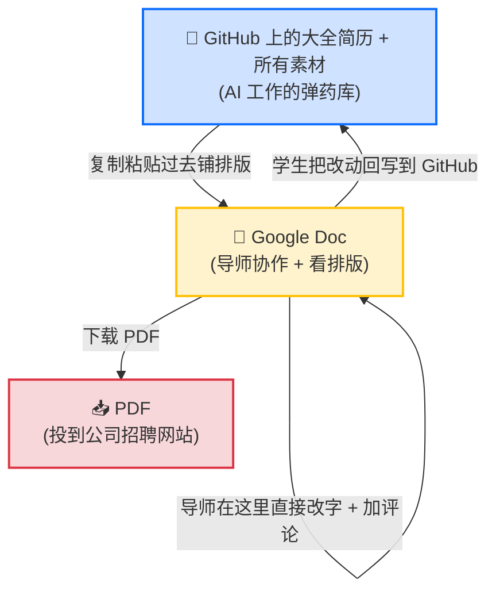
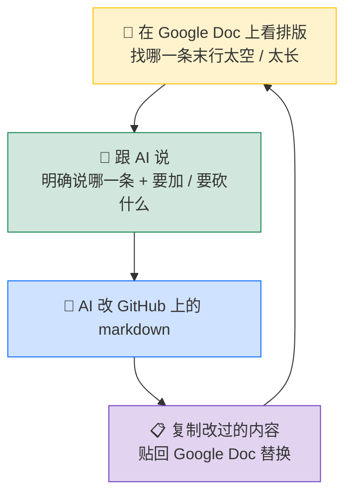

# 真正去投: 派生一份针对性简历, 跟导师在 Google Doc 上协作, 最后导出 PDF

> 这是 examples 系列里的第十一篇。前置: [09-write-bullets](../09-write-bullets/README-cn.md) 和 [10-write-summary](../10-write-summary/README-cn.md) 已经跑完, 你那份大全简历 ([students/john-doe/resume.md](../../students/john-doe/resume.md) 这种结构) 里已经有好几段经历的 bullet, 也已经有针对几个不同方向 (AI 工程师 / 数据分析师 / 后端工程师) 的 Summary。这一节讲怎么把这份大全简历真正变成投到公司招聘网站上的那一份 **PDF**, 以及怎么跟导师在 Google Doc 上协作改, 还有大多数学生最后栽跟头的地方: **排版微调**。

## 1. 课程导读

跑完 09 和 10 之后, 你那份大全简历的内容写完了, 但**还不能直接投**。从一份大全简历到能投出去的那份 PDF, 中间还差三件事:

- **派生**: 大全简历里同时挂着多个方向的 Summary 和多段经历, 投一个具体岗位的时候要按这个岗位删减, 只留对得上的那份 Summary 和对得上的那几段经历, 拼出一份针对性版本
- **跟导师协作**: 导师不可能上 GitHub 给你逐字逐句改简历, 他要的是一个像 Word 一样能直接划字、加评论的工具。这个工具就是 Google Doc
- **排版微调**: 派生出的内容塞进 Google Doc 上的简历模板之后, 一行一行调长度, 让招聘官扫下来视觉上紧凑、干净、专业, 最后下载成 PDF

这一节是整个简历工程里**最不起眼**也**最容易丢分**的一节。前面 9 节都在讲怎么把内容做好, 这一节讲怎么把做好的内容**不在最后一步崩**。

很多学生前 10 节都做得很好, 然后死在排版上: 一条 bullet 末行只占了 30% 的宽度, Summary 飘在那里, 字体一会儿粗一会儿细, Education 段占了半页, 招聘官 6 秒扫一眼觉得这人不专业, 内容多硬都白搭。这一节就专门把这个最后一公里讲透。

---

## 2. 最后投到公司的那个文件是 PDF, 每个岗位单独一份

先把目的地说清楚, 后面所有工作流都是为了这个目的地服务的。

最终投到公司招聘网站的那个文件:

- **必须是 PDF**, 不能是 Word 文件, 不能是 Markdown, 不能是一个 Google Doc 链接。原因很简单: PDF 是定格的, 招聘官在任何设备上打开看到的就是你想让他看到的样子, 字体、间距、对齐都不会跑
- **每个岗位单独一份 PDF**。这是 05 教的「一份大全 + 多份针对性派生」的最终落地点: 大全简历只有一份, 但投到不同公司、不同岗位方向的派生 PDF 可以有好多份
- **应届生 / 学生一律 1 页**, 多 1 行都不行; 1 到 3 年工作经验也优先 1 页, 经历实在多到值得展开偶尔可以 2 页; 3 年以上 2 页 OK, 但 3 页就过分了

PDF 是终点, 那 PDF 是怎么来的? Google Doc 导出。Google Doc 里的内容又是怎么来的? 从大全简历复制过来再按目标岗位删减。所以整条链路是:

**GitHub 上的大全简历 (内容源头) → Google Doc (排版 + 跟导师协作) → 派生 PDF (投到公司)**

---

## 3. 为什么要 GitHub 和 Google Doc 两个地方都用

学生第一反应通常是: 我用一个工具搞定不就行了吗? 为什么要在 GitHub 和 Google Doc 之间倒腾?

这一节先把这两个工具各自负责什么、为什么缺一不可讲清楚, 然后给一张极简的流程图。

### 3.1 GitHub 上有简历所需要的所有素材, 这是无可替代的

GitHub 上你的仓库目录长这样 (参考 John 的 [students/john-doe/](../../students/john-doe/)):

```
students/john-doe/
  resume.md                                  # 大全简历, 1 份
  resume-role-1.md, resume-role-2.md, ...    # 针对不同岗位的派生简历, 多份
  experiences/
    from-2025-06-to-2025-09-CedarRidge-maternity-bi-agent/
      README-cn.md                           # 这段经历的总览
      qualify-for-Cascadia-Health-Insights-AI-Solutions-Engineer/
        job-description.md                   # 目标 JD
        case-cn.md                           # 拔高后的案例文档
        landscape/                           # 行业背景研究
        ...
    from-2025-12-to-2026-01-NovaRisk-fraud-aml-bi-agent/
    from-2026-04-to-2026-09-pulse-social-feed-ranker/
```

具体可以看 John 的 [resume.md](../../students/john-doe/resume.md)、4 份派生简历 [resume-role-1.md](../../students/john-doe/resume-role-1.md) 到 [resume-role-4.md](../../students/john-doe/resume-role-4.md), 以及 [Cedar Ridge 经历目录](../../students/john-doe/experiences/from-2025-06-to-2025-09-CedarRidge-maternity-bi-agent/)。

GitHub 上有什么:

- 大全简历的 markdown 源
- 针对不同岗位的派生简历
- 每段经历背后**完整的素材** (case 文档、目标 JD、行业研究、技术笔记...)

这些素材为什么必须 push 到 GitHub, 有两个原因。

**第一, AI 改你简历的时候要用**。你跟 AI 说「帮我把这条 bullet 改一下, 突出医疗领域的 AI 落地」, AI 不会凭空写, 它需要去翻你的 case 文档看你到底做了什么。这些素材是 AI 的弹药库, 没有这些素材, AI 只能瞎编。

**第二, 导师也要看这些素材**。导师评审你的简历的时候, 看到一条 bullet 会很自然地想知道「这条 bullet 背后到底是个什么项目?」, 他会去 GitHub 翻对应的 case 文档、目标 JD、行业调研。如果这些素材没 push 上去, 导师手里只有一份孤零零的简历, 没法判断你这段经历做得到底扎不扎实, 也没法给你有意义的反馈。

更进一步: **导师有时候要改的不只是简历文字, 而是项目设计本身**。比如他看了你的 case 文档觉得「这个项目深度不够, 多加一个评估环节」, 或者「这个 JD 调研漏了一个关键竞品」, 他会直接给你提 case 文档或调研文档的修改意见。这种改动改的是简历背后的项目本身, 是更深层次的提升, 也只能在 GitHub 上发生 (Google Doc 上只有简历, 没有这些项目素材)。

所以**简历的内容源头必须留在 GitHub, 而且每次改完都要 push 上去**: 不是因为 git 多酷, 是因为只有这里同时是 AI 的工作上下文和导师的参考资料库。这一点没得商量。

### 3.2 Google Doc 是用来跟导师协作和排版的

接下来你会问: 那为什么不直接在 GitHub 上改简历, 还非要再拉一份到 Google Doc 上?

两个原因, 都跟「人」有关:

**第一, 导师不会上 GitHub 给你改简历。** 导师要看你的简历, 要直接划字、删句、加评论、对着某一行说「这里不行」, 他要的工具就是 Word 那种感觉。这个感觉的最大公约数是 **Google Doc**: 几乎每个导师都有 Google 账号, 共享一个链接就能看, 评论 / 建议 / 历史版本全是开箱即用。

**第二, PDF 的排版要在 Google Doc 上看才准。** Markdown 在 GitHub 上渲染出来是网页排版, 跟招聘官打开 PDF 看到的字体、行宽、折行点完全不一样。同一句话, 在 GitHub 上你觉得长度刚好, 在 PDF 里可能末尾还空着半行。要看准, 必须在 Google Doc 上铺出来。

所以 Google Doc 在这里做两件事:

- **跟导师协作改字**: 导师直接在 Google Doc 上划改, 加评论, 这是最自然的姿势
- **看排版 + 导出 PDF**: 选个简洁模板, 把内容铺上去, 一行一行调长度, 最后下载 PDF

### 3.3 学生的关键动作: 把 Google Doc 上的改动同步回 GitHub

这一点是这一节的核心规矩, 单独拎出来讲。

导师在 Google Doc 上改了字 (这是好事, 也是你想要的), **你有责任把这些改动复制粘贴回 GitHub 上的大全简历 `resume.md`**, 让 GitHub 上的内容跟得上 Google Doc 上的最新版。

为什么要回写? 因为下次你再让 AI 帮你改简历的时候, AI 读的是 GitHub 上的版本。如果 GitHub 落后了, AI 看到的就是旧版, 改出来的东西也是基于旧版, 等于把导师上一轮的改进抹掉了。

所以学生的关键动作就一句话:

> **导师在 Google Doc 上改了什么, 你就把那部分文字回写到 GitHub 上的大全简历里。**

回写的成本很低, 复制粘贴几句话而已; 但漏了回写, 后面就会出现「Google Doc 版本和 GitHub 版本不一致, AI 帮我改还基于旧版」这种麻烦。

### 3.4 PDF 的角色: 定格输出, 谁看都一样

PDF 没什么神奇的地方。它的唯一作用就是: **把 Google Doc 里你看到的样子定格下来**, 招聘官在任何设备上打开, 看到的样子跟你下载时一模一样。仅此而已。

所以投递流程就是: 你在 Google Doc 上把派生简历调到满意 → File → Download → PDF Document → 投到公司招聘网站。

### 3.5 一张极简的流程图

把上面三件事画出来就是这个样子:



记住三件事:

- GitHub 上的素材是 AI 的弹药库, 缺一不可
- Google Doc 是跟导师协作和看排版的地方
- 改动在 Google Doc 上发生, 学生有责任回写 GitHub

---

## 4. Google Doc 上的多 Tab 结构: 一份 doc 里同时挂多份简历

Google Doc 有个 **Tab 功能**, 一个 doc 的左侧栏可以建多个 tab, 每个 tab 是独立的一份文档。这个功能正好对应我们「一份大全 + 多份针对性派生」的玩法。

一份 Google Doc 里同时挂 **1 份大全 tab + N 份派生 tab**:

- **大全 tab (1 个)**: 跟 GitHub 上的大全简历 [resume.md](../../students/john-doe/resume.md) 内容一一对应, 把所有方向的 Summary、所有经历的 bullet、所有技能都堆在一起, 长度可能超过 1 页 (因为是全的)。这个 tab 是工作 tab, 不会用来投
- **派生 tab (N 个)**: 每个对应一个具体岗位方向, 比如「AI 工程师」「数据分析师」「Cascadia AI Solutions Engineer」「NovaRisk Data Analyst」。每个派生 tab 都是从大全 tab 复制一份过来, 按目标 JD 删减后剩下的那 1 页内容, 这才是真的拿去投的版本

一个派生 tab 怎么生成 (操作步骤):

1. 在 Google Doc 里点开大全 tab, 全选, 复制
2. 左侧栏点 「+ Add tab」 新建一个 tab, 命名比如「Cascadia AI Solutions Engineer」
3. 粘贴大全简历全文进去
4. 按目标 JD 删: 留对得上方向的那一份 Summary (比如只留 AI 工程师那一份), 删多余方向的 Summary; 留对得上的那几段经历的 bullet, 删其他方向的; 技能段删掉跟这个岗位不相关的几行
5. 检查长度: 应届生必须 1 页, 不到 1 页是空、超 1 页是塞太满
6. 微调排版 (见 §7 和 §10)

到了真投递的那一刻, 流程是这样:

1. 在 Google Doc 左侧栏点中要投的那个派生 tab (比如 Cascadia 那个)
2. **File → Download → PDF Document (.pdf)**, Google Doc 会只导出当前选中 tab 的内容, 其他 tab 不会一起进 PDF
3. 改文件名成 `<Your Name>_Resume.pdf` 或 `<Your Name>_Resume_<Company>.pdf`, 投到公司招聘网站

> **不用做副本, 也不用删其他 tab**: Google Doc 的 PDF 导出是按当前选中的 tab 来的, 你选哪个 tab 就只导出哪个 tab。所以你的工作 doc 完全不用动, 1 + N 个 tab 长期都在那里, 投的时候点一下要投的那个 tab、下载 PDF 就完事。

> **文件命名小细节**: 投递的 PDF 文件名**一定**要带你的名字, 比如 `John_Doe_Resume.pdf`。不要叫 `resume.pdf` 或 `final_v3.pdf`, 招聘官下载下来一堆 `resume.pdf` 都不知道是谁的, 第一印象就掉档次。

---

## 5. 内容流向的规矩: 改动从 Google Doc 回 GitHub, 不要让源头跑偏

这一节的核心规矩, §3.3 已经说过, 这里再展开讲讲为什么这个规矩这么重要, 还有怎么具体做。

### 5.1 反例: 在 Google Doc 上改了字, 没回写 GitHub

最常见的崩盘场景:

- 周一: 你跑完 09 和 10, GitHub 上的大全简历 `resume.md` 写完了, 复制粘贴到 Google Doc 大全 tab。导师拿到链接看
- 周三: 导师在 Google Doc 大全 tab 上直接划改了几条 bullet 的用词, 觉得读起来更顺。同时也在派生 tab 上微调了 Summary 的用词
- 周三晚上: 你没回 GitHub, 觉得「反正改完了, 就这样吧」
- 两周后: 你做了个新项目, 想让 AI 帮你把这段新经历也写成 bullet 加进大全简历。AI 打开 GitHub 上的大全简历看, 看到的是**周一那份没改过的旧版本**
- AI 基于旧版给你出一个整体方案, 你贴回 Google Doc, 发现自己用旧版本盖掉了导师两周前的改进, 全废了

这就是不回写的代价: **GitHub 跟 Google Doc 渐渐脱节**, AI 干活基于落后的版本, 你做的每一轮改进都可能被下一轮 AI 输出抹掉。

### 5.2 正确姿势: 导师改完, 学生马上回写

正确的节奏:

1. 导师在 Google Doc 上直接改字 / 加评论, 你看到通知
2. 你打开 Google Doc 仔细看每一条改动, 接受 (Accept) 或拒绝 (Reject)
3. 接受的改动**马上**复制对应的文字, 回 GitHub 上的 `resume.md` 里把对应位置替换掉
4. git commit 一下: `chore: 同步导师 X 月 Y 日的 Google Doc 改动`

回写的工作量其实很小, 一般一次 review 最多改 5 到 10 处, 复制粘贴 + commit 也就 5 分钟。但这 5 分钟是**不能省**的, 省了就出现 §5.1 的崩盘。

记住一句话:

> **简历的内容只有一处源头, 就是 GitHub 上的大全简历。Google Doc 上的改动必须最终回流到这里, 不然下一轮 AI 帮你改的时候, 会基于落后的源头。**

### 5.3 例外: 纯排版的改动不用回写

例外: 如果导师在 Google Doc 上调的是字号、行距、bullet 之间的空行、对齐这种**排版**, 不是改字, 那不用回写。原因很简单: markdown 本来也表达不了字号和行距, 没法回写。这些纯排版的调整只在 Google Doc 上活着就行。

但只要导师改了**字**, 哪怕只改了一个词, 就必须回 GitHub。

---

## 6. 完整工作流串一遍 (John 投 Cascadia AI Solutions Engineer)

把 §3 到 §5 串成一个具体的 7 步流程, 用 John 投 Cascadia 当例子。Cascadia 的 JD 在 [job-description.md](../../students/john-doe/experiences/from-2025-06-to-2025-09-CedarRidge-maternity-bi-agent/qualify-for-Cascadia-Health-Insights-AI-Solutions-Engineer/job-description.md)。

**Step 1: 确认大全简历完工**

John 跑完 09 和 10, 大全简历 [resume.md](../../students/john-doe/resume.md) 已经写满: §1 挂了 3 份不同方向的 Summary (AI 工程师 / 数据分析师 / 后端工程师); §3 是全套技能表; §4 是 6 段经历的 bullet (其中 Cedar Ridge 这段经历分别从 AI 角度和数据分析角度写了两组 bullet)。

**Step 2: 决定投哪家, 用哪个方向**

John 看到 Cascadia 在招 AI Solutions Engineer。他从大全简历里挑出 AI 工程师方向的那一份 Summary, 和能撑得起这个方向的几段经历的 bullet 当素材。

**Step 3: 在 GitHub 上派生一份针对性 markdown**

`cp resume.md resume-cascadia-ai-solutions-engineer.md`, 然后在副本里:

- §1 留 AI 工程师方向的那一份 Summary, 删掉数据分析师和后端工程师那两份
- §4 留 Cedar Ridge (AI 角度) + NovaRisk (AI 角度) + Pulse Social, 删掉两段经历的数据分析角度版本
- §3 技能表只留 AI/ML、云、数据基础设施这几行, 删掉跟 AI 工程师方向无关的几行

参考 [resume-role-1.md](../../students/john-doe/resume-role-1.md) 这种已经派生好的样子。这份 markdown 派生文件以后投这个岗位就用它, 不要每次都重新派生。

**Step 4: 同步到 Google Doc 派生 tab**

打开跟导师共享的 Google Doc, 找 Cascadia 那个派生 tab (没有就新建一个), 把 Step 3 派生 markdown 的内容复制粘贴进去。粘贴后排版可能错乱, 一行一行检查 (字体、字号、对齐、bullet 符号)。

**Step 5: 排版微调 (反复迭代)**

看每一条 bullet 在 Google Doc 里渲染成几行、末行占了多少宽度, 把不对的反馈给 AI 让它改 markdown, 然后复制改过的部分回 Google Doc 替换。这一步是这一节最核心的工作流, 见 §10。

**Step 6: 跟导师协作过一轮**

把 Google Doc 链接发给导师, 导师在 Cascadia 派生 tab 上直接划字加评论。你收到改动后:

- 排版类改动 (字号、间距、对齐): 接受, 留在 Google Doc 上, 不用回写
- 改字类改动 (措辞、加词、删词): 接受, 然后**回 GitHub 上的 [resume.md](../../students/john-doe/resume.md) 和 resume-cascadia-ai-solutions-engineer.md 把对应位置替换掉**, commit 一下

**Step 7: 导出 PDF 投递**

按 §4 末尾的 3 步: 在 Google Doc 左侧栏点中 Cascadia 派生 tab → File → Download → PDF Document → 改文件名成 `John_Doe_Resume.pdf` → 投到 Cascadia 招聘网站。

下次投 NovaRisk 重复 Step 2 到 7, 但 Step 3 派生时选数据分析师方向那一份 Summary, 留 Cedar Ridge (数据角度) + NovaRisk (数据角度), 技能表留数据分析相关那几行。

---

## 7. 排版铁律 (最容易丢分, 最少有人教)

学生写简历最常见的崩盘不是内容不好, 是**排版让招聘官第一眼觉得不专业**。下面是几条铁律, 跟你用什么模板无关 (模板自己选, 我们不管), 但全部要遵守。

### 7.1 页数

- **应届生 / 学生**: **1 页, 不容商量**, 多 1 行都不行
- **1 到 3 年工作经验**: 1 页优先, 经历实在多到值得展开偶尔可以 2 页
- **3 年以上**: 2 页 OK, 但 3 页就过分了

应届生为什么死磕 1 页: 招聘官扫应届生简历的预期就是 1 页, 你给 2 页他会觉得「这人不会取舍, 把无关内容也塞进来」, 反而扣分。

### 7.2 一致性 > 个性 (最重要的一条)

招聘官 6 秒扫简历, 他先看的不是内容, 是**视觉的整齐感**。一份排版一致的简历, 哪怕模板很普通, 看上去就**专业**; 一份排版不一致的简历, 哪怕用了花哨的模板, 看上去就**业余**。

不一致最常见的形式:

- 公司名字: 一处加粗一处不加粗
- 日期: 一处写 `2025-06`, 一处写 `Jun 2025`, 一处写 `2025/06`
- bullet 符号: 一处实心圆点, 一处空心圆点, 一处破折号
- 缩进: 第 1 段经历缩进 0.3 寸, 第 2 段经历缩进 0.5 寸
- 段落间距: Education 段 8pt, Experience 段 12pt
- 字体: 标题用 Arial, 正文用 Calibri

铁律一句话: **不怕你有个性, 就怕你不一致**。

### 7.3 信息密度: 末行占满 70% 以上

bullet、Summary、技能段这种多行文本, 末行占了多少宽度直接决定视觉密度。

- bullet 占 1 行: OK
- bullet 占 2 行, 末行占了 70% 以上的宽度: OK, 视觉饱满
- bullet 占 2 行, 末行只占 30% 到 50% 的宽度: **空洞**, 这是你最该改的地方
- bullet 占 2 行, 末行占到接近 100% 的宽度: OK, 满格也不会折行, PDF 是定格的, 一旦下载下来不同设备打开都一样

为什么末行 70% 是底线: 末行如果只占 30%, 这条 bullet 视觉上「半行没用」, 这点空间不如塞进一个具体技术名词或一个数字, 信息密度直接翻倍。

同样的规则也适用 **Summary** 和 **技能段**:

- Summary 占 2 到 3 行, 末行也要占满 70% 以上
- 技能段每一类 (比如「AI/ML」「云」「数据基础设施」) 各占 1 行, 这 1 行的末尾要填到接近行末, 不要只列 3 个技术名词然后留半行空白, 那空间太可惜

### 7.4 没有照片

美国简历铁律: **不放照片**, 哪怕你长得好看。

原因: 美国招聘流程严格规避无意识偏见, 简历上有照片会让招聘官陷入「我不能因为长相判断」的合规问题。很多公司的内部规则就是「带照片的简历直接拒」, 不是冒犯你, 是流程要求。

(欧洲一些国家文化不同, 但本课程的目标是美国市场, 一律不放。)

### 7.5 绿卡 / 签证状态: 该说就明确说

- **如果你是绿卡 / 公民**: 在 Summary 末尾或者简历头部明确写 **"No sponsorship required"** 或 **"Authorized to work in the U.S. without sponsorship"**, 这一行能 1 秒帮你过签证筛选, 极大加分
- **如果你是国际生需要 sponsorship**: **不用主动写**, 招聘流程会问。但心里要清楚, 哪些公司愿意 sponsor、哪些不愿意 (这是另外一个话题, 跟简历无关)

### 7.6 联系方式: 邮箱 + LinkedIn + GitHub, 不要电话

简历头部:

- 姓名 (用大字号)
- 邮箱 (用一个看起来正经的, 不要 `cooldude2002@hotmail.com` 这种)
- LinkedIn 链接 (用短链, 比如 `linkedin.com/in/your-handle`)
- GitHub 链接 (如果你的 GitHub 有内容)
- (可选) 个人网站 / 作品集
- **不要放电话**: 招聘官第一轮根本不会打电话, 后面 recruiter 要电话会从邮件里要; 放电话只是占空间, 还暴露隐私

### 7.7 字体和字号

- 字体: **Calibri** 或 **Arial** 或 **Helvetica** 或 **Times New Roman**, 选 1 个全文不要换
- 正文字号: **10 到 11 磅**
- 标题字号: 比正文大 1 到 2 磅
- 姓名 (头部): 比正文大 4 到 6 磅
- 不要用花体 / 手写体, 不要用彩色 (除了招聘官眼熟的深色)

---

## 8. Education 段最多 2 行, 不要塞课程作业

Education 是排版上最容易被浪费的段落。

学生常见错误 (薪资分析师风格的简历会这么写):

```
Education
University of Washington                                            2024-09 - 2026-12
M.S. Computer Science, GPA: 3.8/4.0

Relevant Coursework: Machine Learning, Algorithms, Distributed Systems,
Computer Networks, Database Systems, Operating Systems, Software Engineering,
Natural Language Processing, Computer Vision, Cloud Computing, ...
```

3 行学校 + 4 行课程作业 = **7 行**, 占了简历近 1/4 的空间。

问题:

- **课程作业列表给的信号是「我没有项目经验, 只能靠课程作业撑」**, 招聘官扫到这一段, 心里直接给你打折
- 招聘官根本不在乎你修过哪门课, 美国 CS 硕士修过这些课是默认假设
- 课程作业占的空间, 应该让给 Experience 段 (bullet 和 case)

正确写法:

```
Education
University of Washington, Seattle, WA                              2024-09 - 2026-12
M.S. Computer Science, GPA: 3.8/4.0
```

2 行封顶。GPA 高就放 (3.5+), 不高就不放 (空着也比写一个低 GPA 强)。

例外: **如果你完全没有项目经验、没有实习、连一个 case 都做不出来**, 这时候 1 行课程作业占着不丢人 (没有别的可填了)。但只要你跑完了 07 或 08 的 6 阶段产出 1 个 case, **立刻砍掉课程作业**。

---

## 9. 竞赛 / 奖项 / 个人项目: 拿 JD 问 AI 加不加分再决定放不放

竞赛、奖项、个人开源项目这种「锦上添花」的内容, 处理原则:

### 9.1 GitHub 上的大全简历里全部放

大全简历是你的资料库, 后面派生要用, 所以**全部放**:

- ACM 区域赛奖牌
- Kaggle 比赛名次
- 个人开源项目 (GitHub stars 多的)
- 黑客松奖项
- 学生干部 / 助教 (如果对你想投的方向加分)

### 9.2 派生针对性版本之前, 每一项拿 JD 问 AI

派生针对性 PDF 之前, 每一项都拿 JD 问 AI:

> 「这个 JD 是 `<贴 JD 内容>`, 我简历上有这一项 `<贴竞赛 / 奖项 / 项目>`, 这一项对这个 JD 加不加分?」

AI 会给你判断:

- **加分 → 留**
- **可有可无 → 看长度, 1 页够就留, 不够删**
- **不加分甚至跟方向错位 → 一定删**

具体例子:

| 项目 | 投后端工程师 | 投数据分析师 | 投市场分析师 |
|---|---|---|---|
| ACM 区域赛银牌 | ✅ 加分 (算法能力) | ✅ 加分 (数据感) | ❌ 错位 (太技术, 不对口) |
| Kaggle 银牌 | 中性 | ✅ 加分 (建模能力) | ✅ 加分 (数据敏感度) |
| 黑客松创意奖 | 中性 | 中性 | ✅ 加分 (创意 / 商业敏感度) |
| 个人 GitHub 开源工具 (1000 stars) | ✅ 加分 | 中性 | ❌ 错位 |

错位的项目留在派生简历里**不是中性, 是负的**: 招聘官扫到觉得「这人定位不清楚, 什么都做点」, 比删掉更糟。

### 9.3 派生出去的那份 PDF 只留加分项

派生 markdown 删一遍, Google Doc 派生 tab 再删一遍, 导出的 PDF 里**只剩加分项**。

---

## 10. 排版微调反馈环: 大多数学生绊倒的地方

这一节讲这一篇**第二个最核心**的工作流: 一行一行调长度。

### 10.1 为什么 AI 直接帮不了你

AI 改 markdown 没问题, 但 AI **看不到** Google Doc 里渲染后的字体、字号、行宽、折行点。同样一句话:

- 在 Calibri 11 磅、行宽 6.5 寸的版面里折成 2 行, 末行占 65% 宽度
- 换成 Arial 10 磅同样行宽里就折成 1 行了
- 换成 Times New Roman 11 磅又折成 2 行, 末行占 85% 宽度

AI 不知道你用的什么字体、什么字号、行宽多少, 它给的字数估计永远不准。所以**AI 不能直接告诉你「这句话在简历上会有多长」**。

你要做的是: 自己看 Google Doc 渲染出来的样子, 把视觉判断**反馈**给 AI 让它改 markdown。

### 10.2 反馈环的标准说法

打开 Google Doc 派生 tab, 一行一行检查, 看到不对的就一条条跟 AI 说。常用句式:

**末行太空型** (这是最常见的):

> 「Cedar Ridge 那段经历的第 3 条 bullet 在 Google Doc 里末行只占了 25% 宽度, 太空。帮我加 1 到 2 个具体技术名词或者一个数字, 别让信息变水。」

AI 会改 markdown, 加点东西 (比如「加上 Bedrock Knowledge Base 和 prompt evaluation harness」或「补上 93% accuracy on 50-question eval set 这个数字」), 你复制改过的那条 bullet 贴回 Google Doc。

**整体过长型**:

> 「NovaRisk 那段经历的第 1 条 bullet 在 Google Doc 里占了 3 行, 太长, 帮我砍到 2 行。优先砍掉冗余形容词、合并同义短语, 不要砍掉数字。」

AI 改完你贴回去。

**Summary 太短型**:

> 「AI 工程师那一份 Summary 在 Google Doc 里只占了 1.5 行, 末行占 40% 宽度, 太空。帮我补 1 到 2 个具体技术名词进去, 让末行至少占 70%。」

每一条 bullet / Summary 这样调 1 到 3 轮就到位, **全篇调下来 30 分钟左右**。

### 10.3 黄金循环



一条 bullet 1 到 3 轮, 一篇简历 30 分钟。

### 10.4 这一步不要躲

很多学生看到「自己肉眼看排版、一条一条说、复制粘贴」这种工作流就觉得「这也太手工了, AI 不能自动化吗」, 然后躲掉这一步, 直接拿 markdown 渲染的 PDF 投。

后果: 招聘官扫到的 PDF 不是你想象的那一份, 字号、行宽、折行点完全不一样, 你 9 节课打磨的内容**死在最后一公里**。

排版微调反馈环是这一节最重要的能力。**这一步躲不掉, 也不该躲**。

> **注**: 严格来说, AI 能直接操作 Google Doc 排版 (走 Google Doc 的 API + 授权, 让 agent 直接读 Google Doc 看渲染结果再改 markdown)。但这需要你懂一些接口集成, 超出本课程范围, 后面会专门开一门「自动化 Google Doc 排版」课。对 99% 的学生来说, 手动复制粘贴这个反馈环就够了, 而且这个过程也帮你建立对**排版**的直觉, 以后看一份简历能 3 秒判断「这份排版做没做好」。

---

## 11. 跟导师协作的节奏建议

双轨制下导师协作怎么排时间, 这里给一个**典型 2 周的节奏**, 学生可以参考。

| 时间 | 你做 | 导师做 |
|---|---|---|
| 第 1 天 | GitHub 上的大全简历写完 (跑完 09 和 10), 复制到 Google Doc 大全 tab | 等 |
| 第 2 天 | 把 Google Doc 链接发给导师, 招呼一声「请帮我看大全 tab」 | 收到通知 |
| 第 2 到 4 天 | 等 | 在 Google Doc 大全 tab 上直接划改字、加评论 (主要看内容: bullet 措辞、Summary 定位、技能覆盖) |
| 第 4 天 | 收到导师改动, 接受 / 拒绝, **接受的改字部分回写到 GitHub 上的 [resume.md](../../students/john-doe/resume.md), 提交 commit** | 等 |
| 第 5 天 | 选一个具体目标 JD, 派生一个新 tab (比如 Cascadia 派生 tab), 排好版, 招呼一声「请帮我看 Cascadia 这个派生 tab」 | 收到通知 |
| 第 5 到 7 天 | 等 | 在 Google Doc 派生 tab 上加评论 (主要看排版: 长度、密度、Education 段太占空间等) |
| 第 7 天 | 收到改动, 排版类的接受, 改字类的接受后**回写 GitHub** | 等 |
| 第 8 到 9 天 | 自己跑 §10 的排版微调反馈环, 把派生 tab 调到 1 页紧凑 | 终审 |
| 第 10 天 | 导出 PDF, 投递 | 完成 |

后续每加一个目标 JD, 在 Google Doc 上新建 1 个派生 tab, 5 天迭代 1 轮就够 (大全没有大改的话)。

如果导师 review 节奏快, 全流程可以压到 1 周; 如果导师只能周末看, 拖到 3 到 4 周也正常。

---

## 12. 这一步在整套工作流里的位置

到这里你已经走完了 05 到 11:

- 05 教「一份大全 + 多份派生」的简历法
- 06 教项目素材三条路
- 07 / 08 跑完 6 阶段链路, 拿到 case 文档
- 09 把 case 压成 bullet, 直接写进大全简历 §4 Experience
- 10 从已经写好的 bullet 反推不同方向的 Summary, 直接写进大全简历 §1 Summary
- 11 (本节) **从大全派生针对一个 JD 的 markdown 和 Google Doc 派生 tab, 调排版, 导 PDF, 投到公司**

到这里你已经能完整跑通 **「设计 case → 写 case → 写 bullet → 写 Summary → 派生针对性版本 → 投递 PDF」** 整条链路了。

下一节 [12-maintain-new-projects](../12-maintain-new-projects/README-cn.md) 讲: 你投出去 PDF 之后, 几个月后又做了**新的项目** (新实习、新 side project), 怎么把新经历**接入**到现有大全里, 多个 `qualify-for-<JD>` 子目录怎么共存。这是简历进入「持续维护期」的第一节。

---

## 13. 导师寄语

很多学生跑完 09 和 10 觉得简历做完了, 直接拿 markdown 渲染的 PDF 投, 然后投了 50 家 0 回复, 回来问「我前 10 节课做得这么细, 为什么投出去没回应」。

打开他的 PDF 一看: 一条 bullet 末行只占了 20% 宽度, Summary 飘在那里, Education 占了 1/3 页, 字体一会儿 Arial 一会儿 Calibri, 技能段一行只列了 4 个技术名词剩下 70% 空白。**内容好得不得了, 排版业余得没法看**, 招聘官扫一眼就过, 根本扫不到你打磨的 bullet 内容。

排版不是装饰, 排版是**让你的内容被看到**的工程。这一节讲的所有规则 (1 页、一致性、末行 70%、Education 2 行、双轨协作、反馈环) 全是为了这一件事服务。

记住: **简历的最终形态是 PDF, PDF 的最终形态是 1 页紧凑、视觉一致、信息密度高**。前 10 节做的所有内容工作, 在这一节最后一公里里, **要么被排版放大、要么被排版埋没**。

不要在最后一公里躺平。下一节继续。
