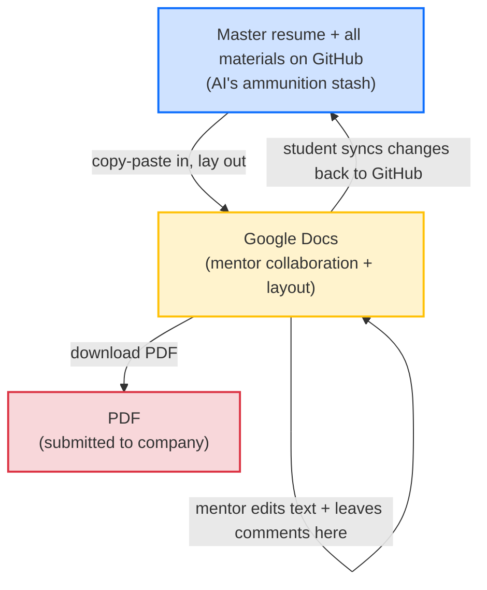
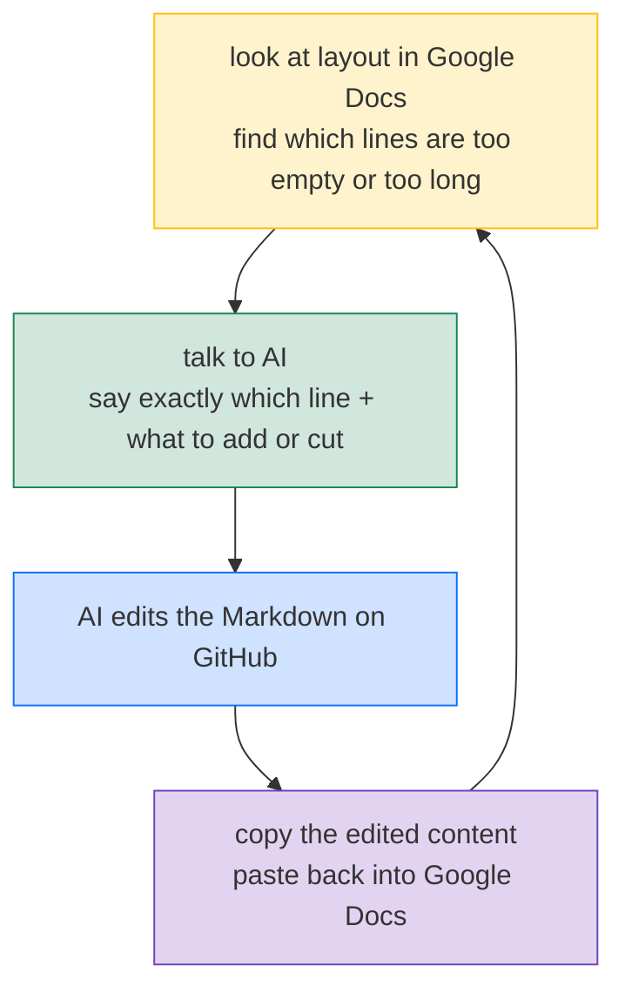

# Actually Apply: Derive a Targeted Resume, Collaborate With Your Mentor in Google Docs, Then Export a PDF

> This is the eleventh post in the examples series. Prerequisites: you have finished [09-write-bullets](../09-write-bullets/README.md) and [10-write-summary](../10-write-summary/README.md), so your master resume (the [students/john-doe/resume.md](../../students/john-doe/resume.md) structure) already has bullets for several experiences and Summary variants for a few different directions (AI Engineer, Data Analyst, Backend Engineer). This section covers how to turn that master resume into the actual **PDF** you submit on a company's careers site, how to collaborate with your mentor in Google Docs, and the spot where most students stumble at the very end: **layout polishing**.
>
> **Quick glossary**: the "master resume" used in this section and every section after is the same thing the 09 and 10 sections called the "master `resume.md`". It is the source document in the 1 + N resume method (the `students/john-doe/resume.md` file), and you never submit it directly. Earlier versions of this course occasionally called it the "catch-all resume", but the term was standardized to "master resume". Any leftover variations in the repo refer to the same file.

## 1. What This Section Covers

After 09 and 10 your master resume is written, but **it is not ready to send out yet**. Three things still stand between a master resume and a PDF you can submit:

- **Derivation**: your master resume holds multiple Summary variants and many experiences at once. When you apply to a specific role you trim it down, keeping only the matching Summary and the experiences that line up, and produce one targeted version
- **Mentor collaboration**: your mentor is not going to hop onto GitHub to mark up your resume word by word. They want something that feels like Word, where they can highlight text and leave comments directly. That tool is Google Docs
- **Layout polishing**: once the derived content is poured into a resume template in Google Docs, you tune it line by line so the recruiter's eye sees something compact, clean, and professional, then download it as a PDF

This is the **least glamorous** and **easiest-to-lose-points** section of the whole resume pipeline. The first 9 sections were about making the content strong. This section is about making sure that strong content **does not collapse at the final step**.

Plenty of students nail the first 10 sections and then die on layout: one bullet ends with a line that fills only 30% of the page width, the Summary floats in space, the font weight shifts mid-document, the Education block eats half a page, and the recruiter's 6-second scan decides this person looks unprofessional. No matter how solid the content is, none of it lands. This section is about closing that last mile.

---

## 2. The File You Submit Is a PDF, and Each Role Gets Its Own

Let's name the destination first, because everything else exists to serve it.

The file you upload to a company's careers site:

- **Must be a PDF**. Not a Word file, not Markdown, not a Google Docs link. The reason is simple: a PDF is locked in place. A recruiter opening it on any device sees exactly what you wanted them to see, with font, spacing, and alignment all preserved
- **One PDF per role**. This is where the "one master + many targeted derivations" idea from section 05 finally lands. There is only one master resume, but the derived PDFs you submit across different companies and different role directions can be many
- **New grads and students always 1 page**, not one line over. With 1 to 3 years of experience, also aim for 1 page. If your experience genuinely warrants two pages, two is acceptable. With 3+ years, 2 pages is fine. Three pages is too much

If the PDF is the destination, where does it come from? You export it from Google Docs. Where does the content in Google Docs come from? You copy it over from the master resume and trim down to the target role. So the full pipeline is:

**Master resume on GitHub (content source) -> Google Docs (layout + mentor collaboration) -> Derived PDF (submitted to company)**

---

## 3. Why You Need Both GitHub and Google Docs

The first reaction students usually have is: can't I just use one tool? Why shuffle things between GitHub and Google Docs?

Let's pin down what each tool is responsible for, why neither can be skipped, and then look at a minimal flow diagram.

### 3.1 GitHub Holds All the Source Material, Which Is Irreplaceable

Your GitHub repo looks like this (see John's [students/john-doe/](../../students/john-doe/) for reference):

```
students/john-doe/
  resume.md                                  # master resume, 1 file
  resume-role-1.md, resume-role-2.md, ...    # derived resumes for different roles, multiple files
  experiences/
    from-2025-06-to-2025-09-CedarRidge-maternity-bi-agent/
      README-cn.md                           # overview of this experience
      qualify-for-Cascadia-Health-Insights-AI-Solutions-Engineer/
        job-description.md                   # target JD
        case-cn.md                           # elevated case document
        landscape/                           # landscape research
        ...
    from-2025-12-to-2026-01-NovaRisk-fraud-aml-bi-agent/
    from-2026-04-to-2026-09-pulse-social-feed-ranker/
```

You can look at John's [resume.md](../../students/john-doe/resume.md), the four derived resumes [resume-role-1.md](../../students/john-doe/resume-role-1.md) through [resume-role-4.md](../../students/john-doe/resume-role-4.md), and the [Cedar Ridge experience folder](../../students/john-doe/experiences/from-2025-06-to-2025-09-CedarRidge-maternity-bi-agent/).

What lives on GitHub:

- The Markdown source of your master resume
- Derived resumes for different roles
- The **full source material** behind each experience (case documents, target JDs, landscape research, technical notes...)

These materials have to be pushed to GitHub for two reasons.

**First, AI uses them when rewriting your resume.** When you tell AI "rewrite this bullet to emphasize my AI work in healthcare", it does not make things up out of thin air. It has to dig through your case document to see what you actually did. These materials are AI's ammunition stash. Without them, AI can only fabricate.

**Second, your mentor also needs to look at these materials.** When your mentor reviews your resume and reads a bullet, the natural question is "what project does this bullet actually come from?" They will go to GitHub and pull up the matching case document, target JD, and landscape research. If those materials are not pushed, your mentor is left with an isolated resume, with no way to judge whether the experience is solid, and no way to give meaningful feedback.

Going one level deeper: **sometimes what your mentor needs to change is not the resume text, but the project design itself**. For instance, after reading your case document they might decide "this project lacks depth, add an evaluation stage", or "this JD research missed a key competitor", and propose edits directly on the case document or landscape doc. Those changes touch the project behind the resume, not the resume itself. They are a deeper level of improvement, and they can only happen on GitHub (Google Docs only holds the resume, not the project material).

So **the content source for your resume must live on GitHub, and you must push after every edit**. Not because git is cool, but because GitHub is the one place that serves as both AI's working context and your mentor's reference library. This is non-negotiable.

### 3.2 Google Docs Is for Mentor Collaboration and Layout

The next question: why not just edit the resume on GitHub? Why pull a copy into Google Docs?

Two reasons, both about people:

**First, your mentor will not go to GitHub to mark up your resume.** When a mentor reviews your resume they want to highlight text, delete sentences, leave comments, and point at a line and say "this doesn't work". They want something that feels like Word. The lowest common denominator for that experience is **Google Docs**. Almost every mentor has a Google account, sharing a link is one click, and comments, suggestions, and version history are all built in.

**Second, you can only see PDF layout correctly in Google Docs.** Markdown rendered on GitHub is web typography, which is nothing like the font, line width, and line breaks a recruiter sees in a PDF. The same sentence might look like it fits perfectly on GitHub but leave half a line empty in a PDF. To see it accurately, you have to lay it out in Google Docs.

So Google Docs handles two jobs here:

- **Mentor collaboration on the text**: your mentor edits directly in Google Docs and leaves comments. This is the most natural setup
- **Layout review and PDF export**: pick a clean template, pour your content in, tune line by line, and download the PDF

**The student's key job: sync changes from Google Docs back to GitHub.** When your mentor edits text in Google Docs (which is what you want), **it is your responsibility to copy those changes back into the master `resume.md` on GitHub** so the GitHub copy stays current with the latest Google Docs version. Why bother? Because the next time you ask AI to revise your resume, AI reads the GitHub version. If GitHub is stale, AI sees the old version, and whatever AI suggests is built on the old version, effectively erasing your mentor's last round of improvements. The cost of syncing back is tiny (a few sentences of copy-paste), but skipping it leads to the painful situation of "the Google Docs version and the GitHub version are out of sync, and AI is helping me based on the old one".

One line to remember:

> **Whatever your mentor changes in Google Docs, copy that text back into the master resume on GitHub.**

### 3.3 The PDF's Role: Locked Output That Looks the Same to Everyone

There is nothing magical about a PDF. Its one job is to **freeze what you see in Google Docs** so the recruiter, on any device, sees exactly what you saw when you downloaded it. That's it.

So the submission flow is: tune your derived resume in Google Docs until you're happy, then File -> Download -> PDF Document, and upload it to the company's careers site.

### 3.4 A Minimal Flow Diagram

Here's what the three pieces look like together:



Three things to remember:

- The material on GitHub is AI's ammunition stash and cannot be skipped
- Google Docs is where mentor collaboration and layout happen
- Changes happen in Google Docs, and it is the student's responsibility to sync them back to GitHub

---

## 4. The Multi-Tab Setup in Google Docs: One Doc Holding Many Resumes

Google Docs has a **Tabs feature**. The left sidebar of a single doc can hold multiple tabs, and each tab is an independent document. That maps perfectly to the "one master + many targeted derivations" pattern.

One Google Doc holds **1 master tab + N derived tabs**:

- **Master tab (1)**: matches the master resume [resume.md](../../students/john-doe/resume.md) on GitHub one-to-one. All Summary variants, all experience bullets, and all skills stacked together. Length may go over 1 page (because it has everything). This tab is the working tab and never gets submitted
- **Derived tabs (N)**: each one targets a specific role direction, for example "AI Engineer", "Data Analyst", "Cascadia AI Solutions Engineer", "NovaRisk Data Analyst". Each derived tab starts as a copy of the master tab, then gets trimmed against the target JD until it's the 1 page of content you actually submit

How to create a derived tab (operational steps):

1. Open the master tab in Google Docs, select all, copy
2. Click "+ Add tab" in the left sidebar to create a new tab, name it (e.g. "Cascadia AI Solutions Engineer")
3. Paste the full master resume in
4. Trim against the target JD: keep the one Summary that matches the direction (e.g. only the AI Engineer Summary), delete the others. Keep the bullets from experiences that line up, delete bullets from off-direction angles. In the skills section, delete the rows that aren't relevant to this role
5. Check length: new grads must be 1 page. Under 1 page feels empty, over 1 page feels stuffed
6. Polish layout (see section 7 and section 10)

When it's time to actually submit, the flow is:

1. In the left sidebar of Google Docs, click the derived tab you want to submit (e.g. the Cascadia one)
2. **File -> Download -> PDF Document (.pdf)**. Google Docs exports only the content of the currently selected tab. Other tabs do not get included in the PDF
3. Rename the file to `<Your Name>_Resume.pdf` or `<Your Name>_Resume_<Company>.pdf` and upload it to the company's careers site

> **No need to duplicate the doc or delete other tabs**. Google Docs exports the PDF based on the currently selected tab, so whichever tab you click is the one you get. Your working doc stays untouched. The 1 + N tabs live there long term. When you want to submit, click the right tab, download the PDF, done.

> **Small detail on file naming**: the PDF you submit **must** include your name, e.g. `John_Doe_Resume.pdf`. Do not call it `resume.pdf` or `final_v3.pdf`. The recruiter ends up with a pile of `resume.pdf` files and no idea who's who, and your first impression is already discounted.

---

## 5. The Rule for Content Flow: Changes Go From Google Docs Back to GitHub, Don't Let the Source Drift

The core rule of this section was already stated at the end of section 3.2. Here we go deeper into why the rule matters and exactly how to follow it.

### 5.1 What Goes Wrong: Edits in Google Docs Never Make It Back to GitHub

The most common breakdown:

- Monday: you finish 09 and 10, the master resume `resume.md` on GitHub is complete, and you copy-paste it into the Google Docs master tab. Your mentor gets the link
- Wednesday: your mentor edits a few bullets in the Google Docs master tab to make the wording flow better. They also touch up the Summary wording in a derived tab
- Wednesday evening: you don't sync anything back to GitHub, thinking "the edits are done, let's move on"
- Two weeks later: you wrap up a new project and ask AI to add bullets for the new experience to the master resume. AI opens the master resume on GitHub and sees **the unchanged Monday version**
- AI builds an integrated plan on that old version. You paste it back into Google Docs and realize you just overwrote two weeks of your mentor's improvements with the old version. All gone

That's the cost of not syncing: **GitHub and Google Docs drift apart**, AI works against the stale version, and every round of improvement you make can be wiped out by the next round of AI output.

### 5.2 The Right Cadence: Mentor Edits, Student Syncs Back Immediately

The correct rhythm:

1. Your mentor edits text or leaves comments in Google Docs, and you get a notification
2. You open Google Docs and walk through each edit, Accept or Reject
3. For accepted edits, **immediately** copy the matching text and replace the corresponding spot in `resume.md` on GitHub
4. Make a git commit: `chore: sync mentor's Google Docs edits from X/Y`

The actual sync work is small. A single review round usually has 5 to 10 spots at most, so copy-paste plus commit takes about 5 minutes. But those 5 minutes are **not optional**. Skip them and you end up in the section 5.1 breakdown.

One line to remember:

> **There is only one source for resume content, and that's the master resume on GitHub. Edits made in Google Docs must flow back there, or the next round of AI work will be built on a stale source.**

### 5.3 Exception: Pure Layout Tweaks Don't Need a Sync

Exception: if your mentor adjusts font size, line spacing, blank lines between bullets, or alignment (anything that's **layout** rather than text), you don't need to sync. The reason is simple: Markdown can't express font size or line spacing in the first place, so there's nothing to sync. These pure layout tweaks live only in Google Docs.

But the moment your mentor changes a **word**, even just one, it has to go back to GitHub.

---

## 6. The Full Workflow End to End (John Applies to Cascadia AI Solutions Engineer)

Here we string sections 3 to 5 into a concrete 7-step flow, using John's Cascadia application as the example. The Cascadia JD is at [job-description.md](../../students/john-doe/experiences/from-2025-06-to-2025-09-CedarRidge-maternity-bi-agent/qualify-for-Cascadia-Health-Insights-AI-Solutions-Engineer/job-description.md).

**Step 1: Confirm the master resume is done**

John finishes 09 and 10. The master resume [resume.md](../../students/john-doe/resume.md) is fully populated. Section 1 has 3 Summary variants for different directions (AI Engineer, Data Analyst, Backend Engineer). Section 3 is the full skills table. Section 4 holds bullets for 6 experiences (with the Cedar Ridge experience written as two separate bullet groups, one from the AI angle and one from the data analysis angle).

**Step 2: Pick the company and direction**

John spots Cascadia hiring an AI Solutions Engineer. From the master resume he picks the AI Engineer Summary and the experience bullets strong enough to support that direction.

**Step 3: Derive a targeted Markdown file on GitHub**

`cp resume.md resume-cascadia-ai-solutions-engineer.md`, then in the copy:

- In section 1, keep the AI Engineer Summary, delete the Data Analyst and Backend Engineer ones
- In section 4, keep Cedar Ridge (AI angle) + NovaRisk (AI angle) + Pulse Social, delete the data analysis angle versions for the experiences
- In section 3, keep only the AI/ML, cloud, and data infrastructure rows. Delete rows unrelated to the AI Engineer direction

See [resume-role-1.md](../../students/john-doe/resume-role-1.md) as a reference for what a derived file looks like. From now on, this derived Markdown is what you use for this role. Don't re-derive every time.

**Step 4: Sync to the Google Docs derived tab**

Open the Google Doc you share with your mentor, find the Cascadia derived tab (create one if it doesn't exist), and paste in the content from the Step 3 derived Markdown. After pasting, layout may be scrambled. Walk through line by line to check font, font size, alignment, and bullet markers.

**Step 5: Polish the layout (iterate)**

Look at each bullet in Google Docs to see how many lines it renders into and how much width the last line takes up. Feed anything off to AI to fix in the Markdown, then copy the fixed parts back to Google Docs. This step is the core workflow of this section. See section 10.

**Step 6: Run a mentor collaboration round**

Send the Google Docs link to your mentor. The mentor edits and leaves comments directly on the Cascadia derived tab. When you receive the changes:

- Layout edits (font size, spacing, alignment): accept, leave them in Google Docs, no sync needed
- Text edits (word choice, additions, deletions): accept, then **go to GitHub, replace the matching spot in both [resume.md](../../students/john-doe/resume.md) and resume-cascadia-ai-solutions-engineer.md**, and commit

**Step 7: Export the PDF and submit**

Follow the 3 steps from the end of section 4: click the Cascadia derived tab in the Google Docs sidebar -> File -> Download -> PDF Document -> rename to `John_Doe_Resume.pdf` -> upload to Cascadia's careers site.

Next time, applying to NovaRisk, repeat Steps 2 through 7, but in Step 3 pick the Data Analyst Summary, keep Cedar Ridge (data angle) + NovaRisk (data angle), and trim the skills table to the data analysis rows.

---

## 7. Layout Rules (The Most Points Lost, the Least Often Taught)

The most common way students wreck their resume isn't bad content. It's **layout that makes the recruiter instantly think this looks unprofessional**. Below are the iron rules. They are independent of which template you use (pick whichever, we don't care), but you have to follow all of them.

> **How to read this**: read the 7 rules below end to end once, then come back for reference when you're actually laying out. Rule **7.2 consistency** is the most important. The other 6 are essentially specific applications of it. If you only have time for one, read 7.2.

### 7.1 Page Count

- **New grads / students**: **1 page, no exceptions**, not one line over
- **1 to 3 years of experience**: 1 page preferred. Two pages is acceptable only if your experience genuinely warrants the space
- **3+ years**: 2 pages is fine, 3 pages is too much

Why new grads must hold 1 page: a recruiter's expectation for a new grad resume is 1 page. Give them 2 and they think "this person can't prioritize, they crammed irrelevant stuff in", which actually costs you points.

### 7.2 Consistency > Personality (The Most Important One)

A recruiter scans a resume in 6 seconds. The first thing they take in isn't content, it's the **visual evenness**. A consistent resume looks **professional** even with a plain template. An inconsistent resume looks **amateur** even with a fancy template.

The most common forms of inconsistency:

- Company names: bold in one spot, not bold in another
- Dates: `2025-06` in one spot, `Jun 2025` in another, `2025/06` somewhere else
- Bullet markers: solid dot, hollow dot, dash, all mixed
- Indentation: first experience indented 0.3 inches, second indented 0.5 inches
- Paragraph spacing: 8pt around Education, 12pt around Experience
- Fonts: Arial for headings, Calibri for body

In one line: **personality is fine, inconsistency is not**.

### 7.3 Information Density: Last Line Fills 70% or More

For multi-line text (bullets, Summary, skills section), how much of the page width the last line takes up directly drives visual density.

- Bullet on 1 line: OK
- Bullet on 2 lines, last line 70%+ wide: OK, visually full
- Bullet on 2 lines, last line 30% to 50% wide: **empty**, this is the first thing you should fix
- Bullet on 2 lines, last line close to 100% wide: OK. A line at full width won't wrap because a PDF is locked. Once downloaded it looks the same on any device

Why 70% is the floor: if the last line is only 30%, half a line is visually wasted. That space could hold a specific tech term or a number instead, doubling the information density.

The same rule applies to **Summary** and the **skills section**:

- A Summary spans 2 to 3 lines. The last line should fill 70%+
- Each row in the skills section (e.g. "AI/ML", "Cloud", "Data Infrastructure") takes 1 line. That line should run close to the right edge. Don't list 3 tech terms and leave half a line blank, that space is too valuable to waste

### 7.4 No Photo

US resume rule: **no photo**, even if you're good-looking.

Why: the US hiring process actively guards against unconscious bias, and a photo on the resume puts the recruiter in the "I can't judge based on appearance" compliance bind. Many companies have an internal rule that resumes with photos get auto-rejected. It isn't personal, it's process.

(Some European countries do this differently, but this course targets the US market, so no photos.)

### 7.5 Green Card / Visa Status: Say So Clearly When It Helps

- **If you're a green card holder or citizen**: write **"No sponsorship required"** or **"Authorized to work in the U.S. without sponsorship"** at the end of your Summary or at the top of your resume. This one line lets you clear visa screening in a second and is a big plus
- **If you're an international student who needs sponsorship**: **don't bring it up proactively**. The hiring process will ask. But you should know which companies sponsor and which don't (that's a separate topic, unrelated to the resume)

### 7.6 Contact Info: Email + LinkedIn + GitHub, No Phone

At the top of your resume:

- Your name (large font)
- Email (use something that looks professional, not `cooldude2002@hotmail.com`)
- LinkedIn URL (use the short form, e.g. `linkedin.com/in/your-handle`)
- GitHub URL (if your GitHub has actual content)
- (Optional) personal website or portfolio
- **No phone number**: recruiters don't make calls in the first round. When a recruiter wants your phone later, they'll ask over email. Putting it on the resume only wastes space and exposes private info

### 7.7 Font and Font Size

- Font: **Calibri**, **Arial**, **Helvetica**, or **Times New Roman**. Pick one and stick with it across the whole document
- Body size: **10 to 11 pt**
- Heading size: 1 to 2 pt larger than body
- Name (header): 4 to 6 pt larger than body
- No script or handwriting fonts. No color (other than a dark shade the recruiter is used to)

---

## 8. Education Block Is 2 Lines Max, No Coursework

Education is the block most often wasted on layout.

A common student mistake:

```
Education
University of Washington 2024-09 - 2026-12
M.S. Computer Science, GPA: 3.8/4.0

Relevant Coursework: Machine Learning, Algorithms, Distributed Systems,
Computer Networks, Database Systems, Operating Systems, Software Engineering,
Natural Language Processing, Computer Vision, Cloud Computing, ...
```

3 lines of school + 4 lines of coursework = **7 lines**, taking up close to a quarter of the resume.

Problems:

- **A coursework list signals "I have no project experience, I have to lean on coursework"**. The recruiter scans it and silently discounts you
- The recruiter doesn't care which courses you took. A US CS master's program is assumed to cover these
- The space that coursework eats should go to the Experience block (bullets and cases)

The right version:

```
Education
University of Washington, Seattle, WA 2024-09 - 2026-12
M.S. Computer Science, GPA: 3.8/4.0
```

2 lines, period. List your GPA if it's high (3.5+). If it's not, leave it off (empty beats showing a low GPA).

Exception: **if you have no project experience, no internships, and not even one case yet**, then 1 line of coursework holding the spot is not embarrassing (there's nothing else to fill in). But the moment you finish the 6-stage pipeline in 07 or 08 and produce 1 case, **cut the coursework immediately**.

---

## 9. Competitions, Awards, Personal Projects: Take the JD to AI Before Deciding to Keep Them

For "nice to have" content like competitions, awards, and personal open-source projects, the rule is:

### 9.1 The Master Resume on GitHub Keeps Everything

The master resume is your archive, and you'll need everything for downstream derivations, so **keep it all**:

- ACM regional medals
- Kaggle competition rankings
- Personal open-source projects (the GitHub-starred ones)
- Hackathon awards
- Student leadership / TA roles (if it helps the direction you're targeting)

### 9.2 Before Deriving a Targeted Version, Run Each Item Past AI With the JD

Before you derive the targeted PDF, run each item past AI with the JD:

> "This JD is `<paste JD>`. My resume has this item `<paste competition / award / project>`. Does it help for this JD?"

AI will tell you:

- Helps: keep it
- Neutral: depends on length. Keep it if 1 page allows, cut it otherwise
- Doesn't help, or off-direction: definitely cut

A concrete example:

| Item | Backend Engineer | Data Analyst | Market Analyst |
|---|---|---|---|
| ACM regional silver | Helps (algorithm skill) | Helps (numerical sense) | Off-direction (too technical) |
| Kaggle silver | Neutral | Helps (modeling skill) | Helps (data sense) |
| Hackathon creativity award | Neutral | Neutral | Helps (creativity / business sense) |
| Personal open-source tool (1000 GitHub stars) | Helps | Neutral | Off-direction |

An off-direction item left in the derived resume is **not neutral, it's negative**. The recruiter scans it and thinks "this person doesn't know what they want, they're spread thin". Worse than cutting.

### 9.3 The Derived PDF Only Keeps the Items That Help

Trim once in the derived Markdown, trim again in the Google Docs derived tab, and the exported PDF **only carries the items that help**.

---

## 10. The Layout Polish Feedback Loop: Where Most Students Trip

This section walks through the **second most central** workflow of this post: tuning the resume line by line.

### 10.1 Why AI Can't Just Do This For You

AI is fine at editing Markdown, but AI **cannot see** the rendered font, font size, line width, and line-break points in Google Docs. The same sentence might:

- Wrap to 2 lines in Calibri 11pt at 6.5 inch line width, with the last line at 65%
- Fit on 1 line in Arial 10pt at the same line width
- Wrap to 2 lines in Times New Roman 11pt, with the last line at 85%

AI doesn't know your font, your font size, or your line width, so its character-count estimates are never accurate. So **AI cannot directly tell you "this sentence will be this long in the resume"**.

What you do instead: look at the rendered version in Google Docs and **feed your visual judgment back** to AI so it can edit the Markdown.

### 10.2 Standard Phrasing for the Feedback Loop

Open the Google Docs derived tab, walk through line by line, and call out the issues to AI one at a time. Common phrasings:

**Last line too empty** (the most common):

> "The 3rd bullet in the Cedar Ridge experience has a last line that fills only 25% width in Google Docs, too empty. Add 1 to 2 specific tech terms or a number, and don't let the content get watered down."

AI edits the Markdown and adds something (e.g. "add Bedrock Knowledge Base and a prompt evaluation harness", or "add the 93% accuracy on 50-question eval set figure"). You copy that revised bullet back into Google Docs.

**Too long overall**:

> "The 1st bullet in the NovaRisk experience spans 3 lines in Google Docs, too long. Trim it to 2 lines. Cut redundant adjectives and merge synonymous phrases first. Don't cut the numbers."

AI edits, you paste back.

**Summary too short**:

> "The AI Engineer Summary spans only 1.5 lines in Google Docs, with the last line at 40%, too empty. Add 1 to 2 specific tech terms so the last line fills at least 70%."

Each bullet or Summary takes 1 to 3 rounds to settle, and **the whole document takes about 30 minutes**.

### 10.3 The Golden Loop



1 to 3 rounds per bullet, 30 minutes per resume.

### 10.4 Do Not Skip This Step

Plenty of students see this workflow (look at layout with your own eyes, call out lines one at a time, copy-paste) and think "this is way too manual, can't AI automate it?", then they skip the step and submit a PDF rendered straight from the Markdown.

What happens: the PDF the recruiter sees is not the one you imagined. Font, line width, line breaks, all different. The content you polished across 9 sections **dies at the last mile**.

The layout polish feedback loop is the most important skill of this section. **You can't skip it, and you shouldn't.** And the manual process actually builds your **layout** intuition. Down the road you'll be able to look at any resume and judge in 3 seconds whether the layout was done well.

---

## 11. Suggested Rhythm for Mentor Collaboration

Under the dual-track setup, here's a **typical 2-week rhythm** to use as a reference.

| Time | You do | Mentor does |
|---|---|---|
| Day 1 | Master resume on GitHub is done (09 and 10 finished), copy into Google Docs master tab | Wait |
| Day 2 | Send the Google Docs link to your mentor, ask them to "please review the master tab" | Get notified |
| Day 2 to 4 | Wait | Edit text and leave comments directly on the master tab (focus on content: bullet wording, Summary positioning, skills coverage) |
| Day 4 | Receive mentor's edits, accept or reject. **For accepted text edits, sync back to [resume.md](../../students/john-doe/resume.md) on GitHub and commit** | Wait |
| Day 5 | Pick a specific target JD, derive a new tab (e.g. the Cascadia derived tab), lay it out, ask them to "please review the Cascadia derived tab" | Get notified |
| Day 5 to 7 | Wait | Leave comments on the derived tab (focus on layout: length, density, Education taking too much space, etc.) |
| Day 7 | Receive edits, accept layout ones, accept text ones and **sync back to GitHub** | Wait |
| Day 8 to 9 | Run the section 10 layout polish feedback loop yourself, get the derived tab to 1 compact page | Final review |
| Day 10 | Export PDF, submit | None (mentor finalized on day 8 to 9) |

For each additional target JD, create one more derived tab in Google Docs. A 5-day iteration is enough (assuming no major changes to the master).

If the mentor's review cadence is fast, the whole thing can compress to 1 week. If the mentor is only available on weekends, dragging it out to 3 or 4 weeks is normal.

---

## 12. Where This Step Sits in the Full Workflow

By now you've walked through 05 to 11:

- 05 covered the "one master + many derivations" resume method
- 06 covered the three routes for project source material
- 07 / 08 walked through the 6-stage pipeline to land a case document
- 09 compressed the case into bullets, dropped directly into section 4 Experience of the master resume
- 10 reverse-engineered Summary variants for different directions from the bullets, dropped directly into section 1 Summary of the master resume
- 11 (this section) **derives a JD-targeted Markdown and Google Docs derived tab from the master, tunes the layout, exports a PDF, submits**

At this point you can run the full pipeline **"design the case -> write the case -> write the bullets -> write the Summary -> derive the targeted version -> submit the PDF"** end to end.

The next section [12-maintain-new-projects](../12-maintain-new-projects/README.md) covers: after you submit the PDF, a few months later you finish **new projects** (new internships, new side projects). How do you **integrate** the new experience into your existing master, and how do multiple `qualify-for-<JD>` subfolders coexist? That's the first section of the resume "maintenance phase".

---

## 13. A Note From Your Mentor

Plenty of students finish 09 and 10, think the resume is done, submit a PDF rendered straight from the Markdown, send out 50 applications, get 0 responses, then come back asking "I worked so carefully on the first 10 sections, why no replies?"

Open their PDF and you see: one bullet ends with a line at 20% width, the Summary floats in space, Education eats a third of the page, the font shifts between Arial and Calibri, the skills row lists 4 tech terms and leaves 70% of the line blank. **Content is excellent, layout is amateur**. The recruiter scans once and moves on, never even reaching the bullet content you polished.

Layout is not decoration. Layout is the engineering that **lets your content be seen**. Every rule in this section (1 page, consistency, last line 70%, Education at 2 lines, dual-track collaboration, feedback loop) serves that one purpose.

Remember: **the final form of a resume is a PDF. The final form of a PDF is 1 compact page with consistent visuals and high information density**. All the content work from the first 10 sections, in this section's last mile, **either gets amplified by layout or buried by it**.

Don't lie down at the last mile. See you in the next section.
