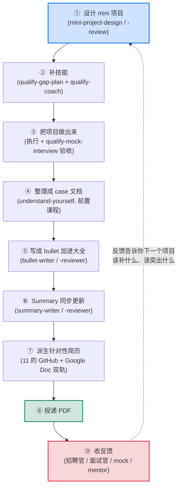
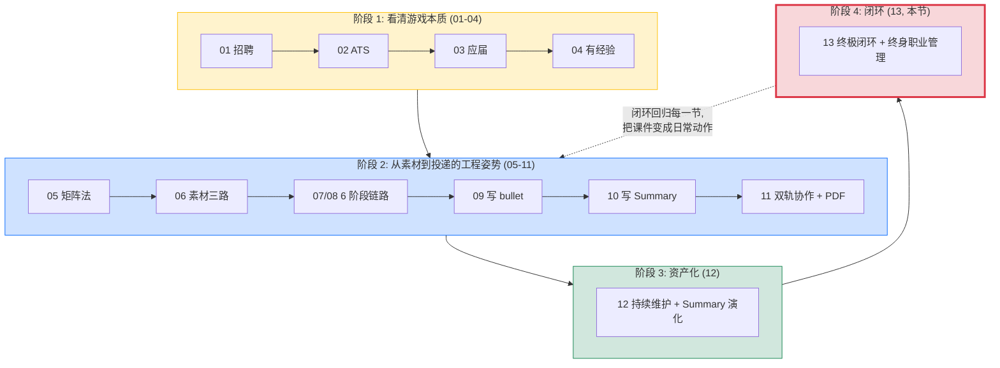

# 终极闭环: 13 节课串成一个不断转的飞轮, 简历是终身职业管理的副产品

> 这是 examples 系列里的第十三篇, 也是最后一篇。前置: 01 到 12 全部跑完。这一节没有新工具、没有新 skill, 它的任务只有一件: **把前 12 节学的所有东西串成一个能持续运转的闭环**, 让你以后职业生涯里改简历不再是焦虑事件, 而是一个稳定运转的飞轮。

## 1. 课程导读: 13 不是新内容, 是把前面 12 节扣成一个环

前 12 节像是一堆零件: 招聘理论、ATS、6 阶段链路、5 个 skill、写 bullet、写 Summary、Google Doc 协作、PDF 导出、弹药库维护、Summary 演化。每个零件单独看都有用, 但**真正让它们威力 1 + 1 > 2 的是把它们扣成一个能自循环的环**。

13 就讲这个环长什么样、怎么转、转一圈你身上发生了什么变化。

读完 13, 你应该建立这个心智模型: **整套工作流不是「找工作时跑一次的脚本」, 是工程师终身职业管理的飞轮**。每一圈让你弹药库更厚一格、人设更深一层、下一次投递更轻一点。

---

## 2. 13 节课的递进关系: 从理论到实操到资产化到闭环

把 01 到 13 串一遍, 你会发现它们是 4 个递进的阶段, 不是 13 个孤立的话题。

### 阶段 1: 看清简历游戏的本质 (01 到 04)

| 节 | 主题 |
|---|---|
| [01-hiring](../01-hiring/) | 招聘流程 + 简历给谁看 |
| [02-ats](../02-ats/) | ATS 系统 + AI 时代的筛选 |
| [03-new-grad](../03-new-grad/) | 应届生简历的 Action+Tech+Impact |
| [04-experienced](../04-experienced/) | 有经验简历的「做成了什么」 |

这一阶段的本质: **简历不是个人传记, 是 6 秒扫描 + 给具体岗位看的工程产物**。理论先到位, 后面的所有动作才有意义。

### 阶段 2: 学会从素材到针对性简历的整套工程姿势 (05 到 11)

| 节 | 主题 |
|---|---|
| [05-resume-matrix](../05-resume-matrix/) | 1 + N 简历法 |
| [06-prepare-project-material](../06-prepare-project-material/) | 项目素材三条路 |
| [07-elevate-existing-project](../07-elevate-existing-project/) | 拔高现有薄经历的 6 阶段链路 |
| [08-design-new-project](../08-design-new-project/) | 从 0 设计新项目的 6 阶段链路 |
| [09-write-bullets](../09-write-bullets/) | case 压成 bullet |
| [10-write-summary](../10-write-summary/) | 从 bullet 反推 Summary |
| [11-submit-and-collaborate](../11-submit-and-collaborate/) | 双轨协作 + 排版微调 + PDF 投递 |

这一阶段的本质: **从一个目标 JD 出发, 用 AI + 5 个 skill, 4 到 8 周, 把一段经历变成扎实的 case, 然后 case 变成 bullet, bullet 反推 Summary, 派生针对性 PDF 投出去**。这是从 0 到 1 的「重投入」, 是矩阵法的奠基性动作。

### 阶段 3: 让简历变成长期资产 (12)

| 节 | 主题 |
|---|---|
| [12-maintain-new-projects](../12-maintain-new-projects/) | 持续维护, 弹药库越积越厚, Summary 随职业阶段演化 |

这一阶段的本质: **简历不是一次性产物, 是越积越厚的弹药库**。从 1 到 N 的状态下, 每加一段新经历是 1 到 2 天投入, 投每家是 30 到 60 分钟。Summary 的人设跟着职业阶段从技能型 → 能力型 → 领域专家型 → 重大业内成就型一路演化。

### 阶段 4: 把所有动作合成一个闭环 (13, 本节)

到了这一节, 你已经有了所有零件。接下来要做的就是**把这些零件扣成一个能自循环的环**, 让弹药库在你工作的每一天都在加厚, 让你每一次投递都比上一次更轻。

---

## 3. 终极闭环图: mini-project 驱动的小循环

把整个工作流串成图, 长这样:

注意⑨那条**虚线回到①**: 反馈不是闭环的终点, 它是下一圈的起点。

---

## 4. 闭环里每个节点对应哪节课、哪个 skill

| 节点 | 对应 skill | 在哪节学 |
|---|---|---|
| ① 设计 mini 项目 | `mini-project-design` + `mini-project-review` | 06 / 07 / 08 |
| ② 补技能 | `qualify-gap-plan` + `qualify-coach` | 07 / 08 |
| ③ 项目做出来 (执行 + 验收) | (执行靠自己) + `qualify-mock-interview` | 07 / 08 |
| ④ 整理成 case 文档 | `understand-yourself` (来自前置课程 career_planning, 跟 `understand-landscape` 是姊妹篇) | 12 引用 |
| ⑤ 写成 bullet | `bullet-writer` + `bullet-reviewer` | 09 |
| ⑥ Summary 同步更新 | `summary-writer` + `summary-reviewer` | 10 |
| ⑦ 派生针对性简历 | (无新 skill, 是 §05 矩阵法 + §11 的 Google Doc 工作流) | 05 / 11 |
| ⑧ 投递 PDF | (无 skill, 操作动作) | 11 |
| ⑨ 收反馈 | (无 skill, 信息收集) | 13 (本节) |

跟改简历有关的 skill 全套一共 9 个, 全在本仓库的 `.claude/skills/` 下: `mini-project-design`, `mini-project-review`, `qualify-gap-plan`, `qualify-coach`, `qualify-mock-interview`, `bullet-writer`, `bullet-reviewer`, `summary-writer`, `summary-reviewer`。前 5 个是 06 / 07 / 08 教的「准备项目素材」工作流主干, 后 4 个是 09 / 10 教的「写 bullet 加 Summary」工具。另外还引用了 2 个前置课程 (career_planning) 的 skill: `understand-landscape` 和 `understand-yourself`, 这两个不在本仓库实现。9 + 2 = 11 个 skill 拼出上面这个 9 节点闭环。

---

## 5. 反馈是闭环的关键: 没有⑨, 整个环就停转

⑨「收反馈」是这个闭环里最容易被忽略的一环, 但它是**把闭环变成螺旋上升**的关键。没有反馈, 你只是在原地重复 8 步动作; 有了反馈并且**让反馈驱动下一轮**, 你才是在螺旋上升。

### 5.1 反馈从哪里来

至少 5 个来源:

- **招聘官的回复**: 拒信 / 面试邀请 / offer 本身就是信号
- **面试官的提问**: 他追问的方向 = 这个岗位真正关心的能力, 你下次该突出什么
- **导师 review**: 11 教的 Google Doc 双轨协作, 导师在简历上的评论本身就是反馈
- **mock-interview**: 07 / 08 教的 `qualify-mock-interview` 的 debrief 报告就是反馈
- **自己的复盘**: 投了 50 家 0 回复, 反思 Summary 定位是不是错了 / Bullet 没说服力 / Skills 错位

### 5.2 反馈怎么驱动下一轮

具体几个例子:

| 反馈 | 下一轮该做什么 |
|---|---|
| 招聘官说「我们要找有 Kubernetes 经验的」, 但你没有 | 下一个 mini 项目设计成「用 K8s 部署 LLM agent」, 同时补 K8s 技能 |
| 面试官追问「你这个 agent 的 eval 怎么做的」, 你答得磕巴 | 你 case 在 eval 上深度不够, 下一个项目要重点做 eval, 同时回去把现有 case 的 eval 部分补深 |
| 导师说「你的 Summary 还是技能型, 你都 3 年经验了该升级了」 | 跑 10 的 `summary-writer` 重审, 升级到能力型或领域专家型 (12 §6 的演化) |
| 投了 50 家 healthcare AI 0 回复, 但投了 5 家 backend 都有面试 | 你的 evidence 在 backend 方向更强, 反思 healthcare AI 这个方向是不是该砍掉 (或者反过来, healthcare 这边项目深度还不够) |

反馈不是被动接收, 是**主动收集 + 主动用**。每收一份反馈, 都要问自己: 「下一圈我要在①设计 mini 项目这一步做哪个不一样的选择?」

---

## 6. 闭环运转的节奏: 一年转几圈

不同职业阶段, 这个闭环转的速度不一样:

| 阶段 | 一年转几圈 | 每圈大概多重 |
|---|---|---|
| 学生 / 应届, 找第一份工作前 | 1 到 2 圈 | 每圈很重, 4 到 8 周, 因为每个 mini 项目都是从 0 开始 |
| 1 到 3 年, 早期工作 | 一年 2 到 4 圈 | 每圈轻, 1 到 2 个月一段实习 / 一个 side project, 弹药库快速扩容 |
| 3 到 7 年, 中期 | 一年 1 到 2 圈 | 项目周期变长, 但每圈分量重, 出的都是「领域专家级」的 bullet |
| 8 年以上 | 不一定跑完整圈 | 已经不广撒网投递, 但还在做项目就还在加弹药, 反馈来源从「投出去」变成「同行评议 / 社区认可」 |

转得快不一定好, 转得慢不一定差。**关键是每一圈结束时, 弹药库厚了, 人设深了, 下一圈的设计比这一圈聪明**。

---

## 7. 闭环不是原地打转, 是螺旋上升

13 最重要的心智模型: **这个环每转一圈不是回到原点, 是螺旋上升一格**。

每一圈跟上一圈相比:

- **弹药库厚一格**: experiences/ 多了一个 folder, resume.md §4 多了一段 Bullet Set
- **Summary 人设深一层**: 从技能型往能力型走, 从能力型往领域专家型走
- **mini 项目难一档**: 上一圈做的是「学 Bedrock 写 agent」, 这一圈是「在 HIPAA 合规约束下设计 agent」, 难度天然递增
- **反馈质量高一级**: 上一圈是初筛拒信, 这一圈是 onsite 反馈; 上一圈是同学 review, 这一圈是行业资深人士 review
- **投递的复利更明显**: 上一圈投 10 家用 5 小时, 这一圈投 10 家可能就 3 小时, 因为弹药库已经足够厚, 派生越来越轻

5 年后回看, 你的简历不是「5 年前那份简历 + 一些胡乱追加」, 而是**5 年的螺旋上升资产**。GitHub 上一目了然: experiences/ 加了几段、Summary 升了几级、Skills 收敛了多少、出现了几个里程碑级别的项目。

这就是为什么 12 的导师寄语说: **简历是工程师职业的版本控制资产**。13 这里再说一遍, 因为这是整套课的最终结论。

---

## 8. 13 节课的关系图: 一张图看全部

最后给一张总览, 让你对 13 节课的结构有个全局的画面:

13 节课不是 13 块独立内容, 是 4 个递进阶段, 最后落在一个能持续运转的闭环上。

---

## 9. 工程师终身职业管理的起点

13 是 13 节课的终点, 但是真正的起点是: **工程师终身职业管理**。

简历只是这个事的副产品。你真正在做的事是:

- **每隔一段时间设计一个让自己变强的 mini 项目** (而不是被动地等公司分配活)
- **每做完一个项目就把它整理成可追溯的 case** (而不是做完就忘)
- **每收一份反馈都用来设计下一个 mini 项目** (而不是被动接受评价)
- **每年回看自己的 GitHub repo, 看到弹药库变厚、人设变深** (而不是「时间过得真快, 又老了一岁」)

这才是工程师该有的职业姿势: 用工程的方式管理自己, 用版本控制留下自己的成长痕迹, 让每一年的自己都看得见比去年厉害。

**简历**是这一切的最直接产物, 但**这一切**远比简历重要。

---

## 10. 离开课程之前的最后一句

> 这是 13 节课的终点, 也是工程师终身职业管理的起点。

你已经有了所有零件。

跑起来。
