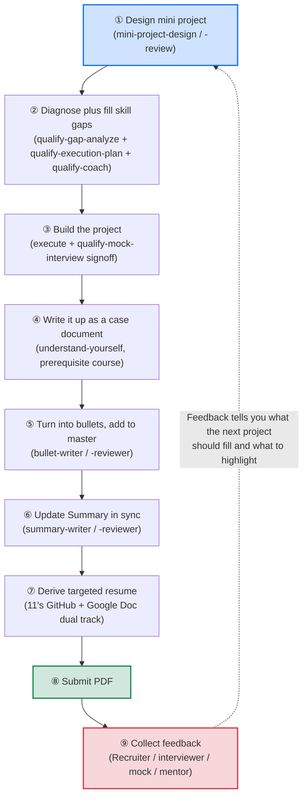
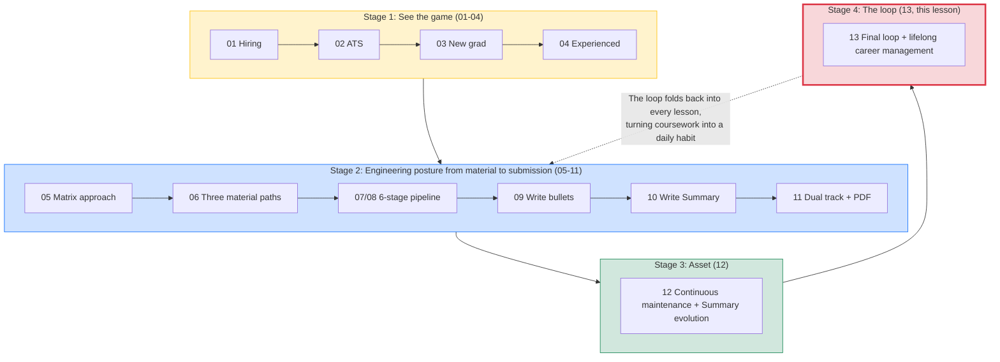

# The Final Loop, 13 Lessons Stitched Into a Flywheel That Keeps Spinning, Your Resume as a Byproduct of Lifelong Career Management

> This is the thirteenth and final piece in the examples series. Prerequisite: you have worked through 01 to 12. There are no new tools here and no new skills. This lesson has exactly one job: **stitch everything from the previous 12 lessons into a self-sustaining loop**, so that updating your resume stops being an anxiety event and becomes a stable flywheel for the rest of your career.

## 1. Course Orientation, Lesson 13 Is Not New Content, It Closes the Previous 12 Into a Ring

The first 12 lessons feel like a pile of parts: hiring theory, ATS, the 6-stage pipeline, 10 skills, writing bullets, writing Summary, Google Doc collaboration, PDF export, ammo-depot maintenance, Summary evolution. Each part is useful on its own, but **what really makes them deliver 1 + 1 > 2 is closing them into a self-circulating ring**.

Lesson 13 is about what that ring looks like, how it turns, and what changes in you after one full revolution.

After reading 13, you should walk away with this mental model: **the whole workflow is not "a script you run once when job hunting" but a flywheel for an engineer's lifelong career management**. Each turn thickens your ammo depot by one notch, deepens your persona by one layer, and makes the next application a little lighter.

---

## 2. How the 13 Lessons Build on Each Other, From Theory to Practice to Asset to Loop

Walk through 01 to 13 in sequence and you will see that they form 4 progressive stages, not 13 isolated topics.

### Stage 1: See the Resume Game for What It Is (01 to 04)

| Lesson | Topic |
|---|---|
| [01-hiring](../01-hiring/) | Hiring process plus who actually reads the resume |
| [02-ats](../02-ats/) | ATS systems plus filtering in the AI era |
| [03-new-grad](../03-new-grad/) | New grad resume Action+Tech+Impact |
| [04-experienced](../04-experienced/) | Experienced resume, what you actually shipped |

The essence of this stage: **a resume is not a personal biography, it is a 6-second scan plus an engineering artifact built for one specific role**. The theory has to land first, or none of the later moves make sense.

### Stage 2: Learn the Full Engineering Posture From Raw Material to Targeted Resume (05 to 11)

| Lesson | Topic |
|---|---|
| [05-resume-matrix](../05-resume-matrix/) | The 1 + N resume approach |
| [06-prepare-project-material](../06-prepare-project-material/) | Three paths to project material |
| [07-elevate-existing-project](../07-elevate-existing-project/) | 6-stage pipeline for elevating a thin existing experience |
| [08-design-new-project](../08-design-new-project/) | 6-stage pipeline for designing a project from scratch |
| [09-write-bullets](../09-write-bullets/) | Compressing a case into bullets |
| [10-write-summary](../10-write-summary/) | Reverse-engineering Summary from bullets |
| [11-submit-and-collaborate](../11-submit-and-collaborate/) | Dual-track collaboration plus layout tuning plus PDF submission |

The essence of this stage: **start from one target JD, use AI plus the 10 skills, spend 4 to 8 weeks, turn an experience into a solid case, then turn the case into bullets, reverse-engineer the Summary from those bullets, derive a targeted PDF, and submit it**. This is the heavy "0 to 1" lift, the foundational move of the matrix approach.

### Stage 3: Turn the Resume Into a Long-Term Asset (12)

| Lesson | Topic |
|---|---|
| [12-maintain-new-projects](../12-maintain-new-projects/) | Continuous maintenance, ammo depot growing thicker, Summary evolving with career stage |

The essence of this stage: **your resume is not a one-shot artifact, it is an ammo depot that keeps thickening**. Once you are in the "1 to N" state, adding a new experience takes 1 to 2 days and applying to each company takes 30 to 60 minutes. The Summary persona evolves alongside your career stage from skill-focused to capability-focused to domain expert to major industry achievement.

### Stage 4: Combine Every Move Into One Loop (13, This Lesson)

By this lesson, you already have all the parts. What remains is to **close those parts into a self-circulating ring**, so that your ammo depot thickens with every working day, and each new application is lighter than the last.

---

## 3. The Final Loop Diagram, a Small Cycle Driven by Mini Projects

Drawn out as a diagram, the whole workflow looks like this:

Notice the dotted line from ⑨ **back to ①**. Feedback is not the end of the loop, it is the starting point of the next turn.

---

## 4. Which Lesson and Which Skill Each Node Maps To

| Node | Skill | Where you learn it |
|---|---|---|
| ① Design mini project | `mini-project-design` + `mini-project-review` | 06 / 07 / 08 |
| ② Diagnose plus fill skill gaps | `qualify-gap-analyze` + `qualify-execution-plan` + `qualify-coach` | 07 / 08 |
| ③ Build the project (execute + signoff) | (execution is on you) + `qualify-mock-interview` | 07 / 08 |
| ④ Write it up as a case document | `understand-yourself` (from the prerequisite career_planning course, sibling to `understand-landscape`) | Referenced in 12 |
| ⑤ Turn into bullets | `bullet-writer` + `bullet-reviewer` | 09 |
| ⑥ Update Summary in sync | `summary-writer` + `summary-reviewer` | 10 |
| ⑦ Derive targeted resume | (no new skill, just §05 matrix approach + §11 Google Doc workflow) | 05 / 11 |
| ⑧ Submit PDF | (no skill, mechanical step) | 11 |
| ⑨ Collect feedback | (no skill, information gathering) | 13 (this lesson) |

The full set of resume-related skills is 10 total, all living under this repo's `.claude/skills/`: `qualify-gap-analyze`, `mini-project-design`, `mini-project-review`, `qualify-execution-plan`, `qualify-coach`, `qualify-mock-interview`, `bullet-writer`, `bullet-reviewer`, `summary-writer`, `summary-reviewer`. The first 6 are the "prepare project material" workflow backbone taught in 06 / 07 / 08, and the last 4 are the "write bullets and Summary" tools taught in 09 / 10. Two more skills from the prerequisite career_planning course also get referenced: `understand-landscape` and `understand-yourself`, neither of which is implemented in this repo. 10 + 2 = 12 skills stitch together the 9-node loop above.

---

## 5. Feedback Is the Hinge of the Loop, Without ⑨ the Ring Stops Turning

Step ⑨ "collect feedback" is the easiest step to skip in this loop, and it is also the step that **turns the loop into a rising spiral**. Without feedback you are just repeating 8 mechanical moves in place. With feedback that **drives the next turn**, you start spiraling upward.

### 5.1 Where Feedback Comes From

At least 5 sources:

- **Recruiter responses**: rejection letters, interview invitations, and offers are all signals
- **Interviewer questions**: the direction they keep probing equals what the role actually cares about, which tells you what to highlight next time
- **Mentor reviews**: under the Google Doc dual-track collaboration from 11, mentor comments on the resume are themselves feedback
- **Mock interviews**: the debrief report from `qualify-mock-interview` (taught in 07 / 08) is feedback
- **Your own retrospective**: 50 applications and 0 responses, reflect on whether the Summary positioning is off, the bullets lack punch, or the Skills section is misaligned

### 5.2 How Feedback Drives the Next Turn

A few concrete examples:

| Feedback | What to do on the next turn |
|---|---|
| Recruiter says "we want someone with Kubernetes experience," and you do not have it | Design the next mini project as "deploy an LLM agent on K8s" and pick up K8s along the way |
| Interviewer keeps probing "how did you do eval for this agent," and you stumbled on the answer | Your case lacks depth on eval, the next project should center on eval, and you should go back and strengthen the eval portion of the existing case |
| Mentor says "your Summary is still skill-focused, but you have 3 years of experience now, time to upgrade" | Run 10's `summary-writer` again, upgrade to capability-focused or domain expert (see 12 §6 on evolution) |
| 50 applications to healthcare AI got 0 responses, but 5 backend applications all landed interviews | Your evidence is stronger in the backend direction, reflect on whether to drop healthcare AI (or alternatively, whether the project depth on the healthcare side is still too shallow) |

Feedback is not something you receive passively, it is **actively collected and actively used**. Each piece of feedback should make you ask yourself: "On the next turn, what different choice should I make at step ① when designing the next mini project?"

---

## 6. The Tempo of the Loop, How Many Turns Per Year

The loop runs at different speeds depending on your career stage:

| Stage | Turns per year | Weight of each turn |
|---|---|---|
| Student or new grad, before the first job | 1 to 2 turns | Each turn is heavy, 4 to 8 weeks, since every mini project starts from zero |
| 1 to 3 years, early career | 2 to 4 turns per year | Each turn is light, 1 to 2 months per internship or side project, ammo depot expands quickly |
| 3 to 7 years, mid-career | 1 to 2 turns per year | Project cycles get longer, but each turn carries more weight and produces "domain expert" caliber bullets |
| 8+ years | May not complete a full turn | You are no longer spraying applications widely, but as long as you keep building projects you keep adding ammo, and the feedback source shifts from "submitting applications" to "peer review and community recognition" |

Spinning fast is not necessarily better, spinning slow is not necessarily worse. **What matters is that by the end of each turn the ammo depot is thicker, the persona is deeper, and the next turn's design is smarter than this one's**.

---

## 7. The Loop Does Not Spin in Place, It Spirals Upward

The most important mental model from 13: **each turn of this ring does not return to the origin, it spirals up by one notch**.

Compared to the previous turn, each turn delivers:

- **Ammo depot one notch thicker**: experiences/ gains another folder, resume.md §4 gains another Bullet Set
- **Summary persona one layer deeper**: from skill-focused toward capability-focused, from capability-focused toward domain expert
- **Mini project one difficulty step harder**: last turn was "learn Bedrock and write an agent," this turn is "design an agent under HIPAA compliance constraints," difficulty rises naturally
- **Feedback one grade higher quality**: last turn was early-screen rejections, this turn is onsite feedback. Last turn was peer review, this turn is industry veteran review
- **Compounding on applications more visible**: last turn took 5 hours to apply to 10 companies, this turn might take 3 hours for the same 10, because the ammo depot is already thick enough that derivation gets lighter and lighter

Five years on, your resume is not "that resume from 5 years ago plus some random additions." It is **a 5-year asset that has spiraled upward**. GitHub makes it obvious at a glance: how many experiences got added under experiences/, how many levels the Summary climbed, how much the Skills section consolidated, how many milestone-tier projects emerged.

This is why the mentor note in 12 says: **a resume is an engineer's version-controlled career asset**. Lesson 13 says it again, because this is the final conclusion of the whole course.

---

## 8. The 13-Lesson Relationship Diagram, One Picture for the Whole Thing

One last overview, so you can hold the structure of all 13 lessons in your head at once:

The 13 lessons are not 13 standalone modules. They are 4 progressive stages, landing finally on a loop that keeps running.

---

## 9. The Starting Point of an Engineer's Lifelong Career Management

Lesson 13 is the end of the 13 lessons, but the true starting point is: **an engineer's lifelong career management**.

The resume is just a byproduct of that practice. What you are actually doing is:

- **Every so often, design a mini project that makes you stronger** (instead of passively waiting for work to be assigned)
- **After every finished project, write it up as a traceable case** (instead of finishing and forgetting)
- **Use every piece of feedback to design the next mini project** (instead of passively absorbing criticism)
- **Each year, look back at your GitHub repo and see the ammo depot thicker and the persona deeper** (instead of "wow, time flies, another year older")

This is the posture an engineer should take toward their career: manage yourself the way you manage engineering, leave a version-controlled trace of your growth, and make sure each year's you is visibly stronger than last year's.

**The resume** is the most direct artifact of all this, but **all this** matters far more than the resume.

---

## 10. One Last Line Before You Leave the Course

> This is the end of the 13 lessons, and the starting point of an engineer's lifelong career management.

You already have every part.

Now spin it up.
