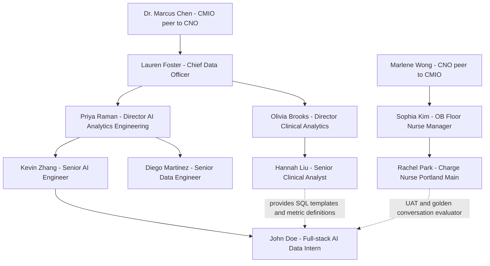

# 02 — 团队与协作

## 一、组织架构与汇报关系

MaternaPulse BI Agent 由 Cedar Ridge Women's Health 的 **AI / Analytics Engineering** 小组负责，组在 Engineering & Data 大部门下，与 **Clinical Analytics** 团队是兄弟单位（Clinical Analytics 是上游需求方与口径来源）。下游 stakeholder 是分布在 6 家分院的 OB 临床与护理团队。

**关于汇报线的两条注解**：

1. **Sophia 走 CNO 不走 CMIO**：CMIO Dr. Chen 负责 medical informatics 方向（病历、医嘱、临床决策支持），不是 nursing operations 方向。Cedar Ridge 的护理线条由 CNO (Chief Nursing Officer) Marlene Wong 统辖，Floor Nurse Manager Sophia Kim 汇报到她。CNO 与 CMIO 在 Cedar Ridge 都是 C-suite 平级，对 CEO 汇报（CEO 节点本图省略，因为与本项目执行无关）。本项目 CMIO 介入的是"自助查询率 OKR 战略"，CNO 介入的是"pilot 上线对一线护士工作流影响"，两条线在 Sophia + Priya 那里汇合。
2. **John Doe 的实线汇报链**：**John Doe → Kevin Zhang → Priya Raman → Lauren Foster → Marcus Chen**。日常 90% 的对接发生在 Kevin 和 John Doe 之间，Priya 只在 Phase 入口 / 出口节点参与 review。CMIO Dr. Chen 只在 2026-09 最终 demo 这一次直接见到 John Doe。

---

## 二、核心团队成员

### 2.1 John Doe — Full-stack AI / Data Intern

**Level**：Intern (Summer/Fall 2026)，上一段学期还没结束，预计 2027-05 毕业。

**Previous Experience（这一段决定 John Doe 是怎么被招进 Cedar Ridge 的）**：

- 在校期间一段 9 周的 fintech 实习（位于 Seattle 的支付 SaaS 创业公司 SwiftLedger），用 Python + FastAPI 写过一组报销审批的内部工具，自己搭过 PostgreSQL，第一次接触 AWS Lambda + S3
- 在校的 capstone 项目里做过一个"Slack-bot 自动汇总每日 Github PR" 的小工具，用 OpenAI API 调过 prompt，跑过本地的 SQLite + sqlite-utils
- 自学过 AWS Cloud Practitioner 与 Solutions Architect Associate 两张证，对 IAM / VPC / Secrets Manager / CloudWatch 这一套基础概念熟悉，写过几个小 CDK demo stack
- **没有用过** Strand Agents、AWS Bedrock 系列、Snowflake 生产环境、production-grade RAG。这些都是项目内学的

Cedar Ridge 招 John Doe 的判断是："**他能扛 Python + 基础 AWS，有过被 prod ticket 追着跑的经验，剩下的栈 (Strand / Bedrock / Snowflake / Semantic Layer) 我们能 ramp up 他**"。

**岗位职责**（在本项目里）：
- 写 Strand Agent 的 orchestrator 代码 + system prompt
- 写 MCP server 与三个 tool（Snowflake Query / Knowledge Retrieval / Visualization）的 Python 实现
- 把 Hannah 给的 20 条 SQL 模板拆成 semantic layer YAML 与 KB corpus
- 写 AWS CDK stacks 部署到 Cedar Ridge 的 staging 与 pilot 账户
- 写 evaluation harness 与 CloudWatch dashboard
- 写 Demo Chat UI（Next.js on Vercel）

**不负责的事**：技术选型决策（Kevin 拍板）、Snowflake schema 变更与权限策略（Diego owner）、口径定义与 SQL 模板（Hannah owner）、CMIO demo 排练话术（Priya 主持）。

### 2.2 Kevin Zhang — Senior AI Engineer

8 年经验，前 Tableau + AWS Solutions Architect 背景，2024 年从 AWS Pro Serve 跳进 Cedar Ridge 带头组建 AI 小组。Kevin 在工业界**Senior AI Engineer 这个 title 通常做**：把 AI / agent 框架引入到业务系统中、决定 LLM 选型与 prompt 策略、负责 production agent 的稳定性。在本项目中：

- 是 John Doe 的**直接 mentor 与 tech reviewer**——所有 PR 都要 Kevin 批
- 拍板架构骨架（已经在 2026-05 与 Priya 一起锁定了 Snowflake + Strand + AgentCore + Bedrock KB 的组合）
- 决定 LLM provider 切换的具体实现方式
- 与 John Doe 1:1 频率 30 分钟 × 每周 2 次（周一周四下午）

### 2.3 Priya Raman — Director, AI / Analytics Engineering

12 年经验，曾在 Microsoft Cloud + Health 部门做过 healthcare data product，2025 年加入 Cedar Ridge 组建小组。**Director 这个 title 通常做**：管小组人头、与跨部门 stakeholder 谈优先级、向 C-suite 汇报项目状态。在本项目中：

- 是 John Doe 的**间接 manager**——批假、月度 1:1、绩效评估
- 与 CMIO 对接 demo 演示安排与 Q3 OKR 进展
- Phase 入口出口 review 时参与，平时不进 1:1
- 拒绝 scope creep（如果 Hannah 想加 P3 / P5 到 MVP，Priya 会出来挡）

### 2.4 Diego Martinez — Senior Data Engineer

6 年经验，前 Snowflake + dbt 顾问，2024 年加入 Cedar Ridge 主导 Snowflake 现代化项目。**Senior Data Engineer 通常做**：data warehouse 设计、pipeline 维护、data contract 与权限治理。在本项目中：

- **Snowflake `CEDAR_RIDGE_OB` 数据库的 owner**——所有 RAW / STAGING / ANALYTICS schema 的 DDL 由他签字
- 为本项目开 Snowflake service account `MATERNAPULSE_AGENT_RO`（仅 SELECT 权限）
- 与 John Doe 共同 review semantic layer YAML，重点看是否符合 Snowflake 性能 best practice
- 一周 1 次 30 分钟 office hour 给 John Doe

### 2.5 Hannah Liu — Senior Clinical Analyst（上游对接人 ①）

7 年经验，Cedar Ridge 内部 OB 业务知识的活字典。**Senior Clinical Analyst 通常做**：从临床团队收集 ad-hoc 报表请求、写 SQL 把答案捞出来、做季度 trend 分析。在本项目中：

- **提供 20 条核心 SQL 模板**（已经在内部口径会议上审核过）
- **定义所有 metric 口径**（如"active census"是否含 `discharged`、"产后 LOS"从哪个 timestamp 起算）
- 与 John Doe 共同 review semantic layer YAML 与 KB corpus
- 是 SQL accuracy 评估的最终裁判——agent 生成的 SQL 与她写的语义是否一致
- 一周 1 次 60 分钟 working session 给 John Doe（周三下午）

> Hannah 在原 Halcyon POC 故事里就是那个被称为"你"的数据分析师。本项目把她从"自己写 SQL 出报表"reframe 成"为 agent 提供口径与模板"的上游 enabler。

### 2.6 Rachel Park — Charge Nurse, Portland Main OB Ward（下游对接人 ①）

11 年妇产科一线护理经验，过去 4 年是 Portland Main 院妇产 ward 的 day-shift Charge Nurse。**Charge Nurse 通常做**：交班、找床、派活、处理一线突发。在本项目中：

- 是**首要 stakeholder persona**——agent 的回答风格、术语、信息密度都按她的工作习惯调
- 提供 30 条 golden conversation（她过去 6 个月最高频的提问）
- 做 UAT — **Phase 3 集中 UAT 阶段**每周 2 次 60 分钟集中演练（详见 Doc 05 Phase 3 Week 3）；**pilot 上线后稳态**每周 1 次 60 分钟用 agent 跑真实交班流程
- 是 8 周后业务指标的主要打分人

### 2.7 Sophia Kim — OB Floor Nurse Manager（下游对接人 ②）

9 年护理管理经验，管 Portland Main 院妇产科 ward 的整体排班、绩效与人力。本项目里：

- 与 Priya 共同签字批准 pilot 上线
- 提供 ward-level KPI 的口径与目标值（如"自助查询率 ≥ 40%"的认定方法）
- 协调 Charge Nurse 团队的 UAT 时间安排

### 2.8 Dr. Marcus Chen — CMIO（Executive sponsor）

15 年医疗信息学经验，Cedar Ridge 的最终医疗信息官。在本项目中只出现两次：
- 2026-06 kickoff 时与 Priya 一起对齐战略目标
- 2026-09 第二周最终 demo 时做 go/no-go 决策

### 2.9 Marlene Wong — CNO（Pilot 上线签字方）

20 年护理管理经验，Cedar Ridge 的首席护理官，统辖全网 6 家分院的护理团队。在本项目中主要在 Phase 3 末出现一次：与 Priya、Sophia 联签批准 pilot 上线（保证 agent 介入不会打断 Portland Main 妇产 ward 的日常护理工作流）。日常不参与开发，但 Sophia 的 UAT 反馈通过她背书才有重量。

---

## 三、上游与下游 Stakeholder

| 方向 | 角色 | 提供什么 / 期望什么 |
|------|------|---------------------|
| **上游** | Hannah Liu（Senior Clinical Analyst） | 提供 20 条 SQL 模板、metric 口径、术语表；期望 agent 在 SQL 语义上严格对得上她的模板 |
| **上游** | Diego Martinez（Senior Data Engineer） | 提供 Snowflake schema、service account、性能边界；期望 agent 查询不拖垮 warehouse |
| **下游** | Rachel Park（Charge Nurse） | 期望在 6 秒内拿到准确的病房状态、术语贴一线护士口语 |
| **下游** | Sophia Kim（Nurse Manager） | 期望 pilot 阶段不打断病房日常工作、有清晰的"出错怎么办"应急路径 |
| **Sign-off authority** | Marlene Wong（CNO） | 期望 agent 介入不影响 Portland Main 妇产 ward 一线护理工作流；Phase 3 末与 Priya + Sophia 联签 pilot ready |
| **Executive sponsor** | Dr. Marcus Chen（CMIO） | 期望 2026-09 demo 上看到端到端可工作的链路，3 个明确的 KPI 改善证据 |

---

## 四、协作模式与会议节奏

| 节奏 | 形式 | 参与人 | 目的 |
|------|------|--------|------|
| **每周 1:1 × 2 次** | 30 min, 周一 + 周四 14:00 PT | John Doe + Kevin | Tech 进展、blocker、PR review 排期 |
| **每周 working session** | 60 min, 周三 14:00 PT | John Doe + Hannah | 口径澄清、SQL 模板 walk-through、golden set 审稿 |
| **每周 office hour** | 30 min, 周二 11:00 PT | John Doe + Diego | Snowflake 性能、schema 问题、service account 权限 |
| **双周 demo** | 30 min, 隔周五 15:00 PT | John Doe + Kevin + Priya + Hannah | 当周进展演示、下双周计划对齐 |
| **每周 stakeholder check-in** | 30 min, 周五 10:00 PT | John Doe + Rachel + Sophia（Phase 3 起加入） | UAT 反馈、行为调整需求 |
| **Async (Slack)** | 实时 | 全员 | `#maternapulse-dev` 频道 |
| **PR review** | Async + 必要时 sync | Kevin 必 review，Diego 在涉及 SQL / schema 时 review | 所有 merge 到 main 的 PR 需要 Kevin 显式 approve |

---

## 五、关键决策与升级路径

| 决策类型 | 决策者 | 升级路径 |
|----------|--------|----------|
| 技术架构骨架 | Kevin + Priya | 已锁定，本项目不再改 |
| LLM provider 切换实现 | Kevin | Kevin 缺席时升级到 Priya |
| Semantic layer metric 口径 | Hannah | 不一致升级到 Hannah 的 manager Olivia Brooks |
| Snowflake schema / 权限变更 | Diego | 升级到 CDO Lauren Foster |
| Scope 变更（加业务问题、加 ward） | Priya | 升级到 Lauren / Marcus |
| Pilot 上线 go/no-go | Sophia + Priya + Marlene 联签 | 升级到 Marcus |
| 最终 demo 通过与否 | Marcus | 终审 |

John Doe 遇到 blocker 的标准路径：
1. 先 Slack 问 Kevin（< 2 小时回复）
2. Kevin 不在或问题超出范围 → Slack `#maternapulse-dev` 频道 @group
3. 还是没人 → 等下次 1:1 / office hour 提出
4. 紧急（影响 pilot UAT 进度）→ 直接电话 Priya

---

## 六、项目治理

| 维度 | 约定 |
|------|------|
| **代码仓** | `github.com/cedar-ridge-internal/maternapulse`（Cedar Ridge GitHub Enterprise），Kevin 是 admin，John Doe 是 maintainer |
| **PR 规则** | 任何 main 分支变更需要至少 1 个 approver；涉及 Snowflake schema / semantic layer 需要 Diego 或 Hannah 额外 approve |
| **Sprint 长度** | 2 周一个 sprint，每个 Phase 对应 1-2 个 sprint |
| **需求变更** | 新需求由 Priya 在 sprint 入口 review，超出当前 Phase scope 的变更默认进 backlog，由 Priya 仲裁是否插队 |
| **风险升级阈值** | 任何 milestone 延期 > 5 个工作日，John Doe 必须当天向 Kevin & Priya 同时同步 |
| **文档归档** | 项目文档（含本系列 Doc 01-05）存在仓库 `docs/` 目录，由 Kevin 在每个 Phase 出口签字 |
