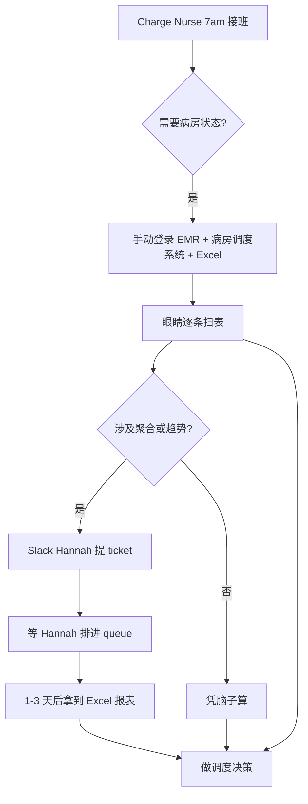
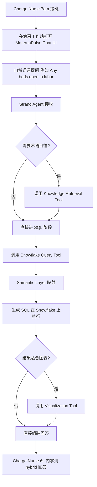

# 03 — 业务需求

## 一、需求来源与背景回顾

本文档的需求来自三处，详见 Doc 01 与 Doc 02：

1. **Cedar Ridge CMIO Dr. Marcus Chen 在 2026 Q1 town hall 上下达的"自助查询率从 12% 提到 40%"战略指令**（Doc 01 §2）
2. **Senior Clinical Analyst Hannah Liu 已经沉淀的 20 条核心 SQL 模板**——这 20 条对应妇产科一线 5 类常见运营问题（Doc 02 §2.5）
3. **Charge Nurse Rachel Park 提供的 30 条 golden conversation**——她过去 6 个月最高频的口语提问（Doc 02 §2.6）

所有功能需求都能追溯到这三处。每条 REQ 后面会标注它解决的业务问题编号（P1–P5，定义见 Doc 01 §3）。

---

## 二、核心业务流程

### 2.1 As-Is — Charge Nurse 现状

**痛点（量化）**：
- 每次交班 Charge Nurse 平均花 18 分钟手动检索（来自 Sophia Kim 的 ward time-tracking sample, n=42 个交班）
- 30% 的运营决策依赖"凭脑子算"（Charge Nurse 自评，n=11 个 Charge Nurse）
- OB 运营类 ad-hoc ticket 平均周转时间 36 小时（Hannah 团队 ticket 系统 2026 Q1 中位数）

### 2.2 To-Be — MaternaPulse 介入后

**目标（量化）**：
- 每次提问到拿到答案的 p95 延迟 ≤ 6 秒
- Charge Nurse 单次交班手动检索时间 18 分钟 → ≤ 6 分钟
- **Portland Main pilot ward 自身**的 OB 运营 ad-hoc ticket 数量下降 ≥ 30%（口径与 Doc 01 §4.2 一致：按 ward 标签过滤 Hannah 团队 ticket queue，不是 Hannah 团队全局 backlog）

---

## 三、功能需求

需求按业务问题分组，每条 REQ 包含描述、业务价值、验收标准、优先级。**优先级定义**：P0 = MVP 必须有；P1 = 9 月 demo 前要有；P2 = pilot 8 周后才会展开。

### 3.1 P1 Shift Handover 交班简报

| 编号 | 描述 | 业务价值 | 验收标准 | 优先级 |
|------|------|----------|----------|--------|
| REQ-01 | Agent 能回答"现在病房里多少人？都在哪个阶段？" | 交班第一句话；决定后续所有调度的基线 | 对 Hannah Q1 golden answer 误差 0 行；p95 延迟 ≤ 4s | P0 |
| REQ-02 | Agent 能回答"哪几位产妇接下来 2 小时内可能分娩？" | 决定 labor room 排期 | 对 Hannah Q5 golden answer 命中前 3 名，顺序可换；p95 ≤ 6s | P0 |
| REQ-03 | Agent 能回答"有哪些未确认告警？" | 交班合规要求（TJC hand-off communication） | 对 Hannah Q6 golden answer 0 漏 0 错；critical 类必须排第一 | P0 |
| REQ-04 | Agent 能在一句话里回答"今天 day shift 有哪些医护？" | 排班知晓 | 对 Hannah Q14 golden answer 列出所有 active provider 姓名 | P1 |

### 3.2 P2 Room Availability 房间余量

| 编号 | 描述 | 业务价值 | 验收标准 | 优先级 |
|------|------|----------|----------|--------|
| REQ-05 | Agent 能区分 4 种床位状态（available / occupied / cleaning / maintenance），不能简单二分 | 旧 CMS 把 cleaning 当 available 是已知痛点 | 对 Hannah Q2 golden answer 每行每列误差 0；明确把 cleaning 单列 | P0 |
| REQ-06 | Agent 能回答"30 分钟后能用多少张 labor 床？" | 调度提前量 | available + cleaning 求和正确；agent 回答中显式提到"含清洁中" | P0 |
| REQ-07 | Agent 能回答"NICU 现在余量多少？" | 多胎产妇调度前提 | 对 Hannah Q18 golden answer NICU 部分 0 误差 | P1 |
| REQ-08 | Agent 能回答"哪种房型利用率最高？" | 容量规划 | 对 Hannah Q10 golden answer 排序前 2 一致 | P2 |

### 3.3 P4 High-Risk Alert 高危预警

| 编号 | 描述 | 业务价值 | 验收标准 | 优先级 |
|------|------|----------|----------|--------|
| REQ-09 | Agent 能列出当前所有高危产妇及位置 + 并发症 | Attending 查房路径规划 | 对 Hannah Q3 golden answer 0 漏 0 错；按 gestational_weeks ASC 排序 | P0 |
| REQ-10 | Agent 能识别 BP 趋势性上升（即使单点未越 critical 阈值） | POC 阶段最重要的"AI 比单点阈值聪明"证明题 | 对 Hannah Q7 golden answer 命中两位埋点的高 BP 产妇；回答里显式提到趋势方向 | P0 |
| REQ-11 | Agent 能列出"最新 vital 异常"的产妇 + 异常类型 | 临床护士巡房输入 | 对 Hannah Q16 golden answer 标签命中率 100% | P1 |

### 3.4 P3 LOS Prediction 出院预测（P2 优先级，只覆盖口径）

| 编号 | 描述 | 业务价值 | 验收标准 | 优先级 |
|------|------|----------|----------|--------|
| REQ-12 | Semantic layer 中**预埋**产后 LOS 口径定义（从 delivery_time 起算） | 防止下一位工程师重新发明口径 | YAML 中有 `postpartum_los_hours` metric，formula 与 Hannah Q9 一致 | P2 |
| REQ-13 | Semantic layer 中预埋"预测 vs 实际 LOS 误差"评估口径 | 同上 | YAML 中有 `los_prediction_error` metric，与 Hannah Q17 一致 | P2 |
| REQ-14 | Knowledge Base 中预埋 LOS 临床规律（顺产 24-48h / 剖宫产 72-96h） | 防止 agent 自己编规律 | KB corpus 中有对应的 chunk，能被检索到 | P2 |

### 3.5 P5 Order Scheduling 医嘱安排（P2 优先级，只覆盖口径）

| 编号 | 描述 | 业务价值 | 验收标准 | 优先级 |
|------|------|----------|----------|--------|
| REQ-15 | Semantic layer 中预埋"未来 X 小时计划手术"查询模板 | 同上 | YAML 中有 `scheduled_procedures` metric + time_window，与 Hannah Q4 一致 | P2 |
| REQ-16 | Knowledge Base 中预埋资源依赖知识（c_section 需要 OR + anesthesiologist） | 防止 agent 漏检资源冲突 | KB corpus 中有对应的 chunk | P2 |

### 3.6 横切需求（影响所有业务问题）

| 编号 | 描述 | 业务价值 | 验收标准 | 优先级 |
|------|------|----------|----------|--------|
| REQ-17 | Agent 必须支持 multi-turn（用户在同一会话里追问） | "What about labor room?" 这种省略指代 | golden conversation set 中至少 5 条 multi-turn 全通过 | P0 |
| REQ-18 | Agent 默认输出 Hybrid 格式（text + table + chart） | Rachel UAT 反馈优先 | 测 30 条 golden conversation：80% 命中 hybrid 格式 | P0 |
| REQ-19 | Agent 不返回任何 PHI 字段（patient_name / phone / emergency_contact） | HIPAA + Cedar Ridge 内部 PHI 策略 | 自动正则扫描 100 条 agent 输出，0 命中 | P0 |
| REQ-20 | Agent 在涉及术语 / 口径时必须引用 KB snippet | 可追溯、可审计 | 测 30 条 golden conversation：citation rate ≥ 70% | P0 |
| REQ-21 | Agent 不知道答案时必须显式说"I don't have data for this"，不能编 | 防止 hallucination | 测 10 条 out-of-scope query：100% 显式拒答 | P0 |
| REQ-22 | Agent 所有 query、生成的 SQL、返回行数（不含值）必须落 audit log | TJC 内审 + Cedar Ridge 合规 | CloudWatch + Snowflake `MATERNAPULSE_AUDIT.QUERY_LOG` 双写，保留 ≥ 90 天 | P0 |
| REQ-23 | Agent 必须支持 demo / production 两套 LLM provider 切换 | 学生个人 AWS 账户拿不到 Bedrock Claude；Cedar Ridge prod 用 Claude on Bedrock | 环境变量 `LLM_PROVIDER` 切换：`openai` / `gemini` / `bedrock_claude` 三选一，agent 代码完全一致 | P0 |
| REQ-24 | Agent 回答中数字格式遵循北美约定（逗号千分位、24h 时间格式） | 与 Cedar Ridge 内部 dashboard 一致 | 抽 30 条回答人工审核 0 违规 | P1 |
| REQ-25 | Agent 在 5 秒内无响应时 UI 显式显示 loading + retry 路径 | UX 兜底 | 在 staging 模拟 timeout 场景测试 5 次全通过 | P1 |

---

## 四、非功能需求

| 维度 | 目标 | 测量方式 |
|------|------|----------|
| **延迟** | p95 end-to-end ≤ 6s；p99 ≤ 12s；冷启动 p95 ≤ 12s | AgentCore observability + CloudWatch RUM |
| **可用性** | Pilot 阶段 ≥ 99.0%（不含 Snowflake 计划维护窗口） | CloudWatch synthetic monitor |
| **吞吐** | 单 ward pilot 阶段并发 ≤ 8 个 active session（按 Charge Nurse + Attending + 2 名护士的典型同时在线人数） | 负载测试 |
| **成本** | LLM + AWS 单 ward pilot < $500 / 月 | Cost Explorer + LLM provider billing |
| **可观测性** | 每次 tool 调用产生 1 条 structured log；每个 session 产生 1 条 trace | CloudWatch Logs Insights 查询能 reproduce 任何一次会话 |
| **PHI 隔离** | LLM context 0 PHI；audit log 含 query、SQL、行数但不含具体值 | 自动正则扫描 + 内审 |
| **合规** | HIPAA、HITECH、TJC hand-off communication standard、Oregon 隐私法 | 季度内审 |
| **安全** | Snowflake service account 只 SELECT；所有 secret 走 AWS Secrets Manager；网络通过 VPC endpoint | 季度安全审计 |
| **可维护性** | 新增一条 metric YAML 配置 → 上线 ≤ 30 分钟（不需要改 agent 代码） | 演练 1 次 |

---

## 五、数据需求概览

> 详细 schema 见 Doc 04 §数据架构概览（本次范围只到概览，不进入实现文档 Doc 06）。

| 数据类型 | 数据源 | 量级 | 敏感性 | 保留 |
|----------|--------|------|--------|------|
| **业务数据** | Snowflake `CEDAR_RIDGE_OB.ANALYTICS` 11 张表 | 单表 50K – 2.4M 行；总体量 < 80GB | PHI（patient / ob_profile 含姓名、电话、并发症） | 按 Cedar Ridge data retention policy 保留 ≥ 7 年 |
| **KB corpus** | Cedar Ridge 内部 OB 术语表、口径文档、Hannah 的 SQL 模板说明 | ~50 份 markdown / docx，总字符数 ~250K | 公开可分享，不含 PHI | 与文档源系统同步 |
| **Semantic layer** | YAML，git 仓库管理 | 30-50 个 YAML 文件 | 不含 PHI | git 永久 |
| **Audit log** | CloudWatch + Snowflake `MATERNAPULSE_AUDIT.QUERY_LOG` | 单 ward pilot 阶段 ~5K 行/月 | 含 query 文本与 SQL，**不含**结果具体值 | 90 天 CloudWatch + 7 年 Snowflake 归档 |
| **Conversation history** | AgentCore Runtime 内置 session store | 单 session ≤ 20 turn | 含 query + agent 回复（不含 PHI） | session 结束后 24h 清除 |

**PHI 列清单**（在 semantic layer 标 `sensitive: true`）：
`patient.name`、`patient.phone`、`patient.emergency_contact`、`provider.name`（人员姓名按 Cedar Ridge 内部规定也视作受限）、`ob_profile.notes`、`labor_progress.notes`、`alert.message`（含个人血压历史）、`medical_order.notes`。

---

## 六、约束条件

| 约束类型 | 内容 |
|----------|------|
| **时间** | 2026-09 第二周必须给 CMIO 看可工作 demo（详见 Doc 05） |
| **人力** | John Doe 一名 intern 写代码；Kevin / Diego / Hannah 兼职 review |
| **预算** | Pilot 阶段 LLM + AWS < $500 / 月；intern 工资由 Cedar Ridge HR 独立预算，不计本项目 |
| **技术** | 必须用 Snowflake（已有）、Strand Agents、AgentCore Runtime、Bedrock KB、AWS CDK；区域固定 `us-east-1` |
| **合规** | HIPAA + TJC + Oregon 隐私法；任何 PHI 处理需要 Olivia + Lauren 联签 |
| **环境** | 学生个人 AWS 账户拿不到 Bedrock Claude 访问权限 → demo 期间 LLM provider 必须可切换（REQ-23） |

---

## 七、显式排除（不做的事）

> 这些是容易被误解为应该做、但本项目明确不做的事。每项附理由。

| 排除项 | 理由 |
|--------|------|
| Agent 写 Snowflake | 永远 read-only BI |
| 跨 EMR / 外部系统 federation | 数据已统一在 Snowflake |
| 训练或微调 LLM | 走外部 API |
| 实时流处理 | Snowflake 已是 batch + micro-batch |
| 移动端 App | UI 仅 Web |
| 多语言 i18n | 英文 only |
| 企业内部生产前端 | 由 Cedar Ridge IT web team 后续接手 |
| 新生儿 / 计费 / 跨科室会诊数据 | 不在 OB ward scope |
| P3 完整实现 | 只在 semantic layer 与 KB 预埋口径（REQ-12 到 REQ-14） |
| P5 完整实现 | 同上（REQ-15、REQ-16） |
| 6 家分院全量上线 | Pilot 只覆盖 Portland Main 1 个 ward |
| Agent 自动决策（自动派单、自动改医嘱） | 永远只回答问题，不替人决策（避开 FDA SaMD 监管） |
