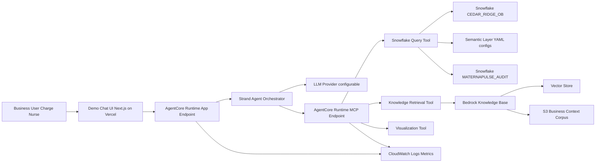
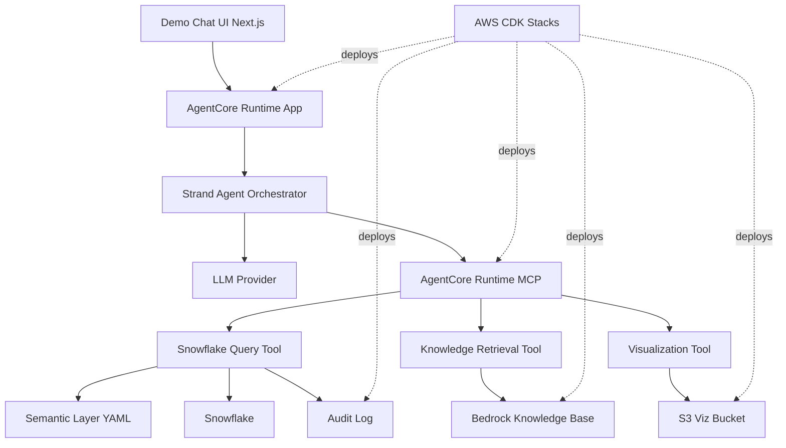
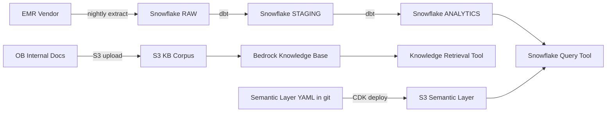

# 04 — 架构与技术栈

## 一、系统架构总览

MaternaPulse 是一个**内部 BI agent**：用户（Charge Nurse 一线护理）在 Demo Chat UI 用自然语言提问，agent 在背后调度 Snowflake 查询、知识库检索与可视化，返回 hybrid 文字 + 表格 + 必要图表。整个系统部署在 Cedar Ridge 的 AWS `us-east-1` 账户里，Snowflake 通过 PrivateLink 连接。



**读图要点**：
- Charge Nurse 在病房工作站打开 Demo Chat UI（Next.js + Vercel），用自然语言提问
- UI 通过 HTTPS 调用 AgentCore Runtime 的 **App Endpoint**，后面跑 Strand Agent
- Strand Agent 自己做 reasoning（调 LLM），需要外部能力时通过 MCP 协议调用 **MCP Endpoint**
- MCP Endpoint 也由 AgentCore Runtime 托管，里面跑 3 个 tool：Snowflake Query、Knowledge Retrieval、Visualization
- 业务数据在 Snowflake `CEDAR_RIDGE_OB`，背景知识通过 Bedrock Knowledge Base 做 RAG
- Semantic Layer YAML + Snowflake INFORMATION_SCHEMA 一起喂给 Snowflake Query Tool，帮 LLM 把自然语言翻成正确口径的 SQL
- 所有 query / SQL / 行数落 CloudWatch + Snowflake `MATERNAPULSE_AUDIT` 做审计

### 1.1 Chat UI 的双轨叙事（重要）

- **John Doe 简历上讲这个项目时，主轴是后端**（Strand Agent + MCP + AgentCore Runtime + Snowflake + KB + CDK）
- Chat UI 是 **John Doe 自己用 Next.js + Vercel 做的 demo 层**，**贯穿 Phase 1-4** 用于本地调试、staging 验证、Rachel/Sophia UAT 与 CMIO demo——是项目的"测试驾驶舱"
- 但**它不进入 Cedar Ridge 真实生产环境**：在 Cedar Ridge 真实生产环境里，前端会由 IT 的 web team 用企业内部 stack 重写（项目文档**不展开**），与 AgentCore App endpoint 对接的契约由本项目敲定
- 这层区分要在面试时清楚讲：**"Chat UI 是我用来调试与展示的 throw-away demo，整个项目签字交付的真正契约是 AgentCore App endpoint 的 API"**

### 1.2 LLM 的双轨叙事（重要）

- **Demo 阶段**（John Doe 自己的开发账户 + Cedar Ridge staging 账户）：LLM provider 配成 **OpenAI 或 Google Gemini 的官方 API**，通过 Strand Agents 的 multi-provider 支持
- **Production 阶段**（Cedar Ridge pilot 账户 + 未来 prod 账户）：LLM provider 配成 **Anthropic Claude on Amazon Bedrock**，`us-east-1`，初步选 `claude-sonnet-4-5` 平衡延迟与成本（具体版本由 Kevin 在 2026-08 中根据 Bedrock 当时可用模型再确认）
- Strand Agent 的 provider 通过环境变量 `LLM_PROVIDER` 切换，**demo 与 production 共用同一份 agent 代码**——这是面试讲架构成熟度的好素材

---

## 二、组件清单与职责

| 组件 | 技术选择 | 一句话职责 | 不做什么 |
|------|----------|------------|----------|
| Demo Chat UI | Next.js 14 + Vercel（demo-only） | 给 Charge Nurse 与 CMIO demo 展示自然语言查询效果 | **不是企业生产前端**；不实现 SSO、不支持移动端 |
| AgentCore Runtime - App | AWS Bedrock AgentCore Runtime | 托管 Strand Agent 进程、提供 HTTPS endpoint、管理 session state | 不写业务逻辑、不直接连 Snowflake |
| Strand Agent | `strands-agents` Python 框架 | 理解 query → 决定调哪些 tool → 拼最终回答 | 不直接执行 SQL、不直接做向量检索 |
| AgentCore Runtime - MCP | AWS Bedrock AgentCore Runtime（独立部署） | 托管 MCP server，给 Strand Agent 暴露统一 tool interface | 不持久化业务数据 |
| Snowflake Query Tool | MCP tool（Python） | 接收 NL 意图 + 上下文，结合 semantic layer + schema 生成 SQL，在 Snowflake 执行并返回结果 | 不做权限决策（依赖 Snowflake role）、不渲染图表 |
| Knowledge Retrieval Tool | MCP tool（Python） | 调用 Bedrock Knowledge Base 的 retrieve / retrieve_and_generate API | 不重新写 embedding 逻辑 |
| Visualization Tool | MCP tool（Python） | 接收数据 + 图表意图，生成图（matplotlib + Pillow → PNG）以 S3 URL 返回 | 不做交互式 dashboard |
| Bedrock Knowledge Base | Amazon Bedrock Knowledge Base | 把 S3 上的 OB 业务上下文文档切片、embed、入库 | 不存业务数据（只存背景知识） |
| Vector Store | OpenSearch Serverless（Bedrock KB 默认后端） | 向量与元数据存储 | 不做行级权限 |
| Snowflake | Snowflake (`CEDAR_RIDGE_OB`) | 存所有妇产业务表 | 不做向量检索 |
| Semantic Layer | YAML 文件（部署时由 MCP runtime 加载到 in-memory） | 给 NL→SQL 提供口径地图（metric / dimension / time_window / glossary） | 不存业务数据 |
| LLM | Demo: OpenAI GPT-4o 或 Google Gemini 1.5 Pro；Production: Anthropic Claude on Bedrock | Strand Agent 的 reasoning engine，按环境变量切换 | 模型具体版本由 Kevin 最终确认 |
| 基础设施 | AWS CDK 2.x（Python） | IaC 部署所有 AWS 资源 | 不部署 Snowflake 自身（Snowflake 资源由 Diego 用 Snowflake 自带 CLI 手动 setup） |
| Audit | Snowflake `MATERNAPULSE_AUDIT.QUERY_LOG` + CloudWatch Logs | 审计 trail | 不存结果具体值 |
| Observability | CloudWatch Logs + Metrics + AgentCore traces | 监控、告警、性能分析 | 不引入第三方 APM |

---

## 三、Semantic Layer 是什么、为什么必要

如果跳过这一层，自然语言 → SQL 会直接撞上两面墙：**LLM 不知道 Cedar Ridge 怎么定义指标，也不知道临床说法对应哪张表的哪一列**。Semantic Layer 把这两件事提前以结构化方式写下来。

**举例**：Charge Nurse 问 "active census on the third floor"。

1. **"active census" 怎么算？** Hannah 的口径是 `COUNT(admission WHERE status != 'discharged')`。LLM 自己想可能把 `delivered` 误判成"已分娩 = 走了"。
2. **"third floor" 是哪张表的哪一列？** Cedar Ridge 的 schema 里是 `room.floor`，不是 `ward.level`。LLM 不知道公司的真实命名。
3. **"现在" 是哪一刻？** Cedar Ridge 的约定是 query 发起时的 `CURRENT_TIMESTAMP()`，不是 Hannah 在 SQL 里用的 demo 字面量 `'2026-02-13 08:00'`。这条要在 semantic layer 里把字面量参数化。

YAML 示例（详细 schema 留给后续 Doc 07 实现文档）：

```yaml
# semantic_layer/metrics/active_census.yml
name: active_census
display_name: Active Patient Census
formula: COUNT(*) FROM admission WHERE status != 'discharged'
table: admission
synonyms: [active census, census, patients on the floor, who is here now]
```

**为什么用 YAML 而不是 dbt metric / Cube**：MVP 优先 YAML，因为人类可读、可 git diff、Hannah 能直接审稿；进入生产规模后可平滑迁移，本项目不实现迁移。

---

## 四、模块拆分与依赖关系



| 模块 | 输入 | 输出 | 依赖 |
|------|------|------|------|
| Demo Chat UI | User text | HTTPS POST to App endpoint | AgentCore App URL（env var） |
| AgentCore App | HTTP request | Strand Agent invocation | Strand Agent container |
| Strand Agent | Query + session history | Tool calls + final text | LLM Provider、MCP endpoint |
| AgentCore MCP | MCP tool call | Tool result | 3 个 tool 实现 |
| Snowflake Query Tool | NL intent + context | SQL + result rows + warning | Semantic Layer YAML、Snowflake connection、Audit |
| Knowledge Retrieval Tool | NL query | Snippets + citations | Bedrock KB ID |
| Visualization Tool | Data + chart hint | S3 URL of PNG | S3 viz bucket |
| Semantic Layer | YAML files in S3 | In-memory metric / dimension dict | S3 |
| Audit Log | tool call event | Row in Snowflake + CloudWatch log | Snowflake `MATERNAPULSE_AUDIT` schema |

---

## 五、技术选型与理由

### 5.1 为什么 Snowflake 而不是 Redshift / BigQuery
- 北美企业里 Snowflake 是 modern data warehouse 的事实标准之一，对 John Doe 简历关键词价值高
- Cedar Ridge 已经在用，不存在选型重做的机会
- 多 cluster 计算 + 存储分离适合 BI 场景；原生 VARIANT 适合 JSON-ish 字段（complications、assigned_room_ids）

### 5.2 为什么 Strand Agents 而不是 LangChain / LangGraph
- AWS 官方力推，与 Bedrock / AgentCore Runtime 集成最顺
- Decorator-based tool 定义，代码量少
- 简历上"Strand Agents on AgentCore Runtime"比通用 LangChain 项目稀缺

### 5.3 为什么 AgentCore Runtime 而不是 ECS Fargate / Lambda
- 自带 session isolation、observability、identity，省掉自建
- App + MCP 用同一种 runtime 托管，部署模式统一
- AWS 的企业级 agent 官方答案，hiring manager 喜欢看到

### 5.4 为什么 Bedrock Knowledge Base 而不是 OpenSearch Serverless / S3 Vectors 单独搭
- 默认选它是因为把数据接入、embedding、retrieval API 全包了，最少 moving parts
- Corpus 体量小（~250K 字符），不需要 hybrid search 或 fine-grained filter
- 如果未来 corpus > 10MB 或需要 hybrid search，可平滑迁到 OpenSearch Serverless（Bedrock KB 本来就用它做后端）

### 5.5 为什么 AWS CDK 而不是 Terraform / SAM
- Python CDK 让 John Doe 用同一种语言写 infra + 应用代码
- 简历上"AWS CDK for production agent deployment"是 keyword
- 与 Cedar Ridge IT 现有 IaC 标准（CDK）一致

### 5.6 为什么 LLM 走外部 API 而不是自部署
- 自部署 LLM 不在 Cedar Ridge 当前能力范围
- 外部 API 成本可预测，HIPAA BAA 与 OpenAI / Anthropic / Google 都谈过（Cedar Ridge IT 法务已确认 demo 用 OpenAI 不传 PHI 是合规的）

---

## 六、数据架构概览

### 6.1 Snowflake 三层 schema

| Schema | 内容 | 数据来源 | 谁能写 |
|--------|------|----------|--------|
| `RAW` | EMR / patient flow / shift 系统的原始抽数，per-source 分表 | EMR vendor 的 nightly extract + intraday micro-batch | Diego 的 ingestion pipeline |
| `STAGING` | 清洗去重、统一类型、外键检查后的标准化层 | dbt 模型（Diego 维护） | dbt CI |
| `ANALYTICS` | 业务消费层，11 张表对应 Hannah 的 SQL 模板（patient、ob_profile、room、bed、provider、shift、admission、labor_progress、vital_sign、medical_order、alert） | dbt 模型 | dbt CI |

**MaternaPulse Agent 只读 `ANALYTICS` schema**。`RAW` / `STAGING` 对 agent 不可见。

### 6.2 数据流转



### 6.3 数据一致性策略

- **Read-only**：Agent 永不写业务表，避免双写一致性问题
- **缓存 TTL**：Knowledge Base 检索结果在 agent 内存缓存 60 秒（同 session 内同 query 不重复检索）
- **Snowflake 事务**：每条 query 在单独 statement 中执行，不跨 statement
- **Audit log 写入**：fire-and-forget 异步写，失败不阻塞用户响应，但触发 CloudWatch alarm

详细 schema 与 DDL 留给 Doc 06（Snowflake Data Layer）实现文档，本次范围不展开。

---

## 七、全局设计约定

| 维度 | 约定 |
|------|------|
| **代码语言** | Python 3.12（agent / MCP / CDK）；TypeScript 5.x + Next.js 14（UI） |
| **目录结构** | `agent/`、`mcp_server/`、`semantic_layer/`、`kb_corpus/`、`cdk/`、`ui/`、`eval/`、`docs/`、`scripts/` |
| **命名规范** | snake_case（Python）、camelCase（TS）；类用 PascalCase；YAML 文件用 kebab-case |
| **I/O 校验** | 所有 tool 的 input / output 用 Pydantic v2 BaseModel 定义 |
| **配置管理** | 所有环境变量定义在 `agent/config.py` 的 Pydantic Settings 类里，禁止 hardcoded magic value |
| **日志** | structured JSON log via `structlog`；每条 log 必须含 `session_id`、`tool_name`、`latency_ms` |
| **错误处理** | tool 内部异常一律捕获并转为结构化 ToolError，agent orchestrator 决定是 retry / 道歉 / 升级 |
| **Secret 管理** | 所有 secret（Snowflake credentials、LLM API key、KB ID）走 AWS Secrets Manager，CDK 部署时自动注入 |
| **测试** | pytest；单元测试覆盖率目标 70%；evaluation harness 覆盖 30 条 golden conversation |

---

## 八、John Doe 的技术职责范围

| 模块 | John Doe 负责？ |
|------|----------------|
| Strand Agent orchestrator | ✅ 主写 |
| MCP server + 3 个 tool 实现 | ✅ 主写 |
| Semantic Layer YAML | ✅ 主写（与 Hannah 共同审稿） |
| KB corpus 准备 + Bedrock KB 配置 | ✅ 主写 |
| AWS CDK stacks | ✅ 主写（Kevin review） |
| Demo Chat UI（Next.js） | ✅ 主写 |
| Evaluation harness | ✅ 主写 |
| CloudWatch dashboard | ✅ 主写（Kevin review） |
| Snowflake schema / dbt model | ❌ Diego owner |
| Snowflake service account 权限策略 | ❌ Diego owner |
| 20 条 SQL 模板与口径定义 | ❌ Hannah owner |
| 企业生产前端 | ❌ Cedar Ridge IT web team（不在本项目 scope） |
| LLM 选型最终拍板 | ❌ Kevin owner |

---

## 九、实现文档规划（本次只规划、不撰写）

> **范围声明**：根据用户在 skill 启动时的指令，本次产出**只包含 Doc 01-05**，下表所列的 Doc 06+ 实现文档**不在本次撰写范围内**。下表用于让架构拆分自然涌现成实现文档骨架，作为后续接手的工程师（无论是 John Doe 在 Phase 1 之后继续写，还是下一位 intern 接手）的路线图。

| 编号 | 标题 | 一句话范围 | 优先级（决定下一轮写作时的顺序）|
|------|------|------------|--------------------------------|
| 06 | Snowflake Data Layer | `CEDAR_RIDGE_OB.ANALYTICS` 11 张表 DDL、ER 图、`MATERNAPULSE_AUDIT` schema、service account 权限、加载策略 | P1（Diego owner） |
| 07 | Semantic Layer & Metric Definitions | YAML schema、metric / dimension / time_window / glossary 完整示例、加载策略 | **P0**（学生选了 Snowflake/NL-to-SQL 亮点） |
| 08 | Knowledge Base Corpus & Retrieval | KB corpus 构成、chunking 策略、Bedrock KB 配置、retriever 调参 | P2（学生没选 RAG 亮点） |
| 09 | MCP Server & Tools | MCP server 结构、3 个 tool 的 input/output schema、错误处理 | **P0**（端到端 agent 链路核心） |
| 10 | Strand Agent Orchestrator | system prompt、tool registry、planner 策略、对话 state、LLM provider 切换 | **P0**（学生选了 Agent on AWS 亮点） |
| 11 | AgentCore Runtime Deployment | App / MCP 两个 endpoint 配置、session、identity、autoscaling、observability hooks | **P0**（学生选了 Agent on AWS 亮点） |
| 12 | AWS CDK Infrastructure | stack 拆分、IAM、网络、Secrets、CI/CD | **P0**（学生选了 CDK Observability 亮点） |
| 13 | Demo Chat UI (Next.js on Vercel) | UI 页面、API 协议、Session 管理、Vercel 部署 | P2（throw-away demo） |
| 14 | Evaluation & Observability | golden set、accuracy / hallucination eval、CloudWatch dashboard、告警 | **P0**（学生选了 Agent on AWS + CDK Observability 亮点） |

**说明**：P0 标记的 6 篇文档（07、09、10、11、12、14）对应本项目锁定的三个简历亮点：**End-to-end Agent on AWS（Strand + AgentCore + Bedrock）**、**Snowflake + Semantic Layer + NL-to-SQL**、**AWS CDK Production Deployment & Observability**。如果本项目继续推进 Doc 06+ 的撰写，按 09 → 10 → 07 → 11 → 12 → 14 → 06 → 08 → 13 的顺序进行——先打通端到端 agent 链路（09 → 10），再加 semantic layer（07），再做部署（11 → 12），再做评估与观测（14），最后补底层数据层（06）、RAG（08）、UI（13）。
