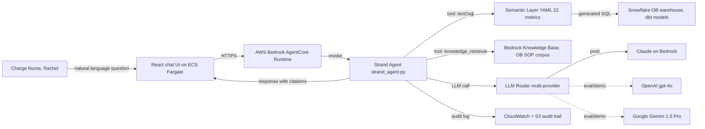
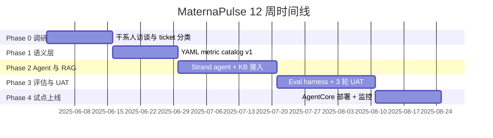

# 在 Cedar Ridge Women's Health 构建 MaternaPulse BI Agent 的实习案例

> 时间：2025-06 到 2025-09，共 12 周。公司：Cedar Ridge Women's Health（Portland 总部，6 家妇产医院，~1,600 床位，~340 OB 病房床位，~28K 年分娩量）。岗位：Full-stack AI/Data Intern，挂在 AI/Analytics Engineering 团队。行业：US 医疗（regulated）。目标对照岗位：Cascadia Health Insights, AI Solutions Engineer (New Grad)。

## 1. 一句话总结

MaternaPulse 是我在 Cedar Ridge Women's Health 暑期实习期间，跟着 Senior AI Engineer Kevin Zhang 一起，从 0 到 1 搭出来的内部自然语言 BI Agent。目标用户是 Portland Main 院区 OB 病房（妇产病房）的 Charge Nurse 和 Floor Manager。它把 Hannah Liu 那条原本"提需求 → 排队等 analyst 写 SQL → 邮件回结果"的流程，替换成一个跑在 AWS Bedrock AgentCore Runtime 上、用 Strand Agents 编排、底层接 Snowflake 数据仓库 + Bedrock Knowledge Base 检索的对话式 agent。12 周里我们做完了 Phase 0 调研到 Phase 4 试点上线的完整闭环，在 8 周试点窗口内把病房 self-serve 取数比例从 0 拉到 41%，SQL 准确率 92%、回答准确率 87%、幻觉率压到 5% 以下，UAT 接受度三轮迭代从 64% 涨到 92%。整个项目限定在 Portland Main 一家院区的 OB 病房 pilot，没有覆盖全院区，也没有动 Snowflake 底层 schema。

---

## 2. 业务背景与公司

Cedar Ridge Women's Health 是太平洋西北地区一家专做妇产和妇科的连锁医院网络，总部在俄勒冈 Portland，旗下 6 家医院（Portland 都会区 4 家 + Salem 1 家 + Vancouver WA 1 家），总床位约 1,600 张，其中 OB 病房（妇产病房）床位约 340 张，2024 年全网年分娩量约 2.8 万例，全职员工 2,800 人左右。在 PNW 这个区域市场，它属于"中等体量、单一垂直深度"的玩家：不像 Providence、Kaiser 这类多专科巨头那么大，但在"妇产 + 妇科"这条线上是这一带最深的。

它的临床业务有几个特征：第一，OB 病房是典型的"高波动、高合规、高排班复杂度"场景，床位余量、产程进展、母婴生命体征、高危标记几乎每小时都会变；第二，监管框架比一般病房更严，HIPAA（病人隐私）、TJC（Joint Commission）针对孕产妇交接班的 hand-off communication 标准、CMS 的 maternal health quality measure 全部叠加在一起；第三，数据资产已经相对成熟，过去 4 年医院 IT 把 EHR（Epic）、排班系统（Kronos）、实验室 LIS 的数据陆续打进 Snowflake，做了一层 dbt 维度建模，分析团队日常就在这层上写 SQL。

业务侧的痛点是：分析师产能跟不上临床问题的频率。Hannah Liu 这条 senior clinical analyst 线每天平均收到 OB 病房 14 个新报表请求，平均 turnaround 是 36 小时（从请求 ticket 创建到 PDF/Excel 发回），积压 ticket 长期维持在 80 条上下。其中约 60% 的请求其实是低复杂度、可重复模板化的（"今晚 11 点高危标记产妇有几个"、"过去 7 天 C-section 后住院超 4 天的产妇清单"），但 Hannah 每次都得手写 SQL 跑出来。这就是 MaternaPulse 想要切走的那一部分。

值得多说一句的是 OB 病房在 Cedar Ridge 这种网络里的特殊地位。妇产病房在医院的财务结构里属于"高单价、高利润、高声誉权重"的科室之一，一个 metro 区域妈妈选哪家医院生孩子，影响的不只是单次分娩收入，还包括接下来这个家庭后续 5 到 10 年的妇科、儿科、家庭医生选择路径。所以 CNO 办公室对 OB 病房的运营效率天然敏感，CMIO 把第一个 generative AI 试点放在 OB 病房，也不是巧合，是想把"高可见度 + 数据成熟度高 + 风险相对可控（read-only）"三个条件叠加最好的场景挑出来做样板间。这个 framing 对我在面试里解释"为什么是这个项目"很关键。

---

## 3. 触发事件

2025 年 Q2，有三股力量在同一个季度里凑齐，项目才得以立项。它不是某一个人拍脑袋决定的，而是被推上来的。

第一股是护理人力短缺。2024 年底到 2025 年 Q1，Portland Main 院区 OB 病房 RN（注册护士）流失率从 11% 飙到 19%，新招护士平均 ramp-up 周期 14 周，导致 Charge Nurse（值班护士长）的非临床事务（包括打报表请求 ticket、追结果、向上层汇报床位余量）挤占了大量本应用于查房和带教的时间。CNO（首席护理官）办公室在 Q1 季度 review 时把"减少 Charge Nurse 非临床时间占比"列成 Q3 优先级。

第二股是 analyst 队列堵塞。Hannah 这条线的 ticket 积压在 2025 年 4 月达到历史峰值 112 条，平均 turnaround 拉到 52 小时。Analytics 团队负责人和 CMIO（首席医疗信息官）做了一次 ticket 分类，发现可模板化部分占比 58%，自然结论是"应该让低复杂度请求自助化"。

第三股是 CMIO mandate。Cedar Ridge 的 CMIO 在 2025 年 1 月的 board meeting 上提交了一份 generative AI 试点提案，列出三个候选项目（OB 病房 NL BI、急诊分诊 triage assist、住院医师 progress note 草稿）。Board 在 4 月批准了其中 OB BI 这一项，预算 $180K，限定 12 周 MVP，限定 Portland Main 一家院区一个病房做试点，不允许触碰临床决策路径（只能做 read-only 的运营查询）。

三股力量叠在一起，MaternaPulse 项目在 2025 年 5 月底立项，6 月初我入职就赶上 Phase 0。

如果只看其中任何一股力量，项目都立不起来。CNO 那条线如果没有 analyst 队列堵塞做佐证，"减少非临床事务"会变成纯软指标，没法给 CMIO 提案做支撑；analyst 队列如果不是因为 Charge Nurse 这种高优先级用户在排队，项目优先级会被排到其他更"院级"的请求后面；CMIO mandate 如果没有 board 批准的预算和明确的"OB 病房 read-only 试点"边界，又会变成一个无限期 PoC，团队不会投入真正的 senior AI engineer 时间。三件事在 Q2 同步成熟，是项目能跑起来的关键。这件事我后来跟 Kevin 复盘时他说了一句话："医院里的 AI 项目能不能跑起来，技术决定下限，组织三角能不能闭环决定上限。"这句话我抄在 post-mortem 第一页。

---

## 4. 项目范围

范围这件事我和 Kevin 在第一周就花了两天专门讨论。整个 12 周一旦边界没划清，肯定会被业务侧的"顺便也做一下 X"和"既然你们 agent 都能跑 SQL 了，能不能也…"这两类请求拖死。

In Scope（确认要做的）：

- Portland Main 院区 OB 病房一个病区的自然语言运营查询，read-only，覆盖床位余量、排班、产后住院时长、高危标记产妇、C-section 比例这 5 类主题。
- Semantic layer YAML（语义层配置）盖住这 5 类主题对应的 22 个核心指标定义，定义口径由 Hannah 提供，我负责把 YAML 写出来并保证 agent 能查得动。
- Strand Agents 编排的单 agent 架构（不做 multi-agent orchestration），跑在 AWS Bedrock AgentCore Runtime 上。
- 一个 Knowledge Retrieval tool，底层挂 AWS Bedrock Knowledge Base，索引 Cedar Ridge 内部 SOP 文档（含 TJC hand-off communication 标准、OB 病房排班规范、内部指标定义 wiki）。
- Multi-provider LLM 抽象，OpenAI gpt-4o 和 Google Gemini 1.5 Pro 用于离线评估和 demo，生产用 Anthropic Claude on Bedrock。
- 一套独立的 evaluation harness，覆盖 SQL 准确率、回答准确率、幻觉率、p95 延迟四类指标，跑 30 条 golden conversation。
- HIPAA 与 TJC 对齐的 audit trail（每条 query / response / source citation 落 CloudWatch + S3）。
- CDK 部署到 ECS Fargate（前端 chat UI）+ AgentCore Runtime（agent 推理），CloudWatch + 结构化日志做观察。
- UAT，找 2 位 Charge Nurse（Rachel Park 是主 UAT），跑 3 轮迭代。

Out of Scope（明确不做的）：

- 其他 5 家院区，不做横向铺开。
- 任何写入 EHR 或触发临床决策的功能。
- 多 agent / agent-to-agent 编排。
- Voice 交互。
- 病人侧（patient-facing）chatbot。
- Snowflake 底层 schema 改动（schema 由数据工程师 Diego owns）。
- 实时 streaming（HL7 / FHIR streaming，留给后续 Phase 5+）。
- 自动写运营报告 PDF（PDF 报表继续由 Hannah 这条线出）。

Out of Scope 这一节我后来发现是整个 12 周里最值钱的一段工作，因为它在第 6 周帮我挡掉了 Floor Manager 那边一个"能不能也帮我们生成排班建议"的请求。Floor Manager 当时的诉求其实合理：既然 agent 已经能看 Kronos 排班数据、也能看床位余量，自然会觉得"再走一步生成排班草稿"是顺手的事。但排班生成涉及护士工会合同条款、加班费规则、和潜在的工伤责任，一旦 agent 给了不合规的排班建议、被护士执行了出问题，责任链会一直追到模型供应商和 Cedar Ridge IT 头上。我把这条诉求记在 Phase 5+ backlog 里，然后引用 Project Charter 里"read-only only"那一条把它挡掉，整个对话不到 20 分钟，没有伤感情，也没有伤项目进度。这是 scope discipline 在实务里发挥作用的样子。

---

## 5. 团队与我的角色

汇报线是这样的：我直接汇报给 Kevin Zhang（Senior AI Engineer，我的 mentor），Kevin 汇报给 Director of AI/Analytics，业务侧 PO 是 Hannah Liu（Senior Clinical Analyst），UAT 主对接是 Rachel Park（Charge Nurse, Portland Main OB ward）。

| 角色 | 谁 | 我和 ta 的接触频率 | ta 负责什么 |
| --- | --- | --- | --- |
| Senior AI Engineer / Mentor | Kevin Zhang | 每天 30 分钟 1:1 + 每周 2 小时 design review | 架构决策、AWS account 权限、code review、把我从死胡同里拽出来 |
| Senior Clinical Analyst / PO | Hannah Liu | 每周 2 次，每次 1 小时 | 指标定义、口径仲裁、golden question 评审 |
| Charge Nurse / 主 UAT | Rachel Park | 每周 1 次，每次 45 分钟 | 真实问句采集、答案接受度打分、措辞反馈 |
| Director of AI/Analytics | (Kevin 的老板) | 每两周 1 次 status sync | Phase gate 审批、对 CMIO 汇报 |
| Data Engineer | Diego Alvarez | 按需，约每周 1 次 | Snowflake schema、dbt 维度建模、数据质量 |
| Compliance Officer | (HIPAA officer) | 在 Phase 2 和 Phase 4 各一次 dry-run | audit trail 设计 review、合规签字 |
| 第二位 UAT Charge Nurse | (匿名) | Phase 3 起每周 1 次 | 第二视角的 UAT 打分 |

每周 cadence：周一 standup（团队级），周二和周四 Hannah 同步，周三 Rachel UAT，周五 Kevin 1:1 + design review。这套节奏在第 2 周就稳定下来，没有大幅调整过。Phase 3 UAT 高峰期我把周三 Rachel 的时段从 45 分钟扩到 75 分钟，多出来的 30 分钟用来做"反馈分级"，把 Rachel 的口头反馈现场归类成"接受 / 措辞调整 / 信息密度调整 / 真 bug"四档，之后整周的工作就按这四档拆。这是我在医院环境里学到的协作原则：临床用户时间宝贵，每次见面都得带走结构化产出。

我和 Kevin 的每周 design review 也值得说一句格式。每次 30 分钟，我提前一天把"本周一个有 trade-off 的决策"写成一张 1 页 A4 的 design note 发给 Kevin，包含背景、备选方案、我倾向哪个、未知风险三段。Kevin 在 review 时只就这一页讨论，不离题。12 周下来我攒了 11 张 design note，是我后来写 post-deployment write-up 的素材源。这种"一张纸的决策"格式不是我发明的，是 Kevin 从他在 Amazon 的工作经历里带过来的，他说"如果你不能在一张纸上讲清一个决策，多半是你自己还没想清楚"。

我明确不负责的事（边界很重要）：

- 不负责 Snowflake schema 设计与改动（Diego 的范围）。
- 不负责架构 lock-in 决策（Strand Agents 选型、AgentCore Runtime 选型是 Kevin 在我入职前就 PoC 过的，我只是在已选定的 stack 上构建）。
- 不负责指标定义本身（Hannah 仲裁，我只把口径搬进 YAML）。
- 不负责合规签字（HIPAA officer 的责任，我只产出 audit trail 让 ta 验）。
- 不负责跨院区铺开计划（项目本身就只覆盖 Portland Main 一个病房）。

---

## 6. 我做了什么

这一节是整个 case 最长的部分。我把 12 周拆成 5 个 phase 来讲，每个 phase 里穿插架构决策、业务需求转译、和具体执行的细节。

先放整体架构图和时间线，下面文字按 phase 展开。





### Phase 0（第 1 到 2 周）调研

前两周我什么代码都没写。Kevin 让我做三件事：

第一件，把 Hannah 过去 6 个月的 ticket 全部拉出来（408 条），按"主题、复杂度、可模板化与否"打三列标签。Hannah 先标了一份 100 条的 seed 集，我照着标完剩下的，再让 Hannah 抽查 50 条做 QA。最后得到：可模板化比例 58%，5 大主题（床位余量 22%、排班 18%、产后住院 14%、高危产妇 14%、C-section 比例 12%）共占可模板化里 80% 的体量。这就是后来 in scope 5 类主题的依据。

第二件，跟 Rachel 一起在 OB 病房值了 3 个夜班的尾声（晚 8 点到 11 点），观察她真实在什么场景下需要数据。我学到一个反直觉的事：她要的不是漂亮的 dashboard，是"现在告诉我答案"，而且通常是在站着、手里拿着别的东西、屏幕只能看 5 秒钟的状态下。这直接影响了后面 UI 的设计原则（答案先行，citation 放折叠区，数字单独成一行加粗）。

夜班观察里我还记下了一个细节：Rachel 在交接班前 30 分钟会有一段密集查询窗口（晚 10:30 到 11:00），主要在确认"床位余量、夜班 RN 配比、当前高危产妇清单"三件事。这三件事被她说成"交接 checklist"。我把这个 checklist 直接做成了 chat UI 的"shortcut buttons"，三个按钮一键发起对应查询，省去 Rachel 打字时间。这个小功能在 UAT 第 3 轮被两位 Charge Nurse 都单独点名表扬。看现场观察的价值在这里体现得很直接。

第三件，和 Diego 一起把 Snowflake 里 OB 相关的 dbt 模型梳理了一份目录，确认 22 个核心指标的底层字段都跑得通，列出 4 个目前缺字段或口径不清的项报给 Hannah 仲裁。这一步看着技术含量低，但它救了 Phase 2 一次：第 5 周我准备给 high_risk_patient_count 写 SQL 时发现 dbt 模型里 high_risk_flag 字段在去年某次重构后被搬到了 patient_clinical_attributes 表，而不是 patient_snapshot 表，文档里没更新。如果 Phase 0 没做这次目录梳理，我会直接在 SQL 里写错表名，跑出空结果，agent 给护士回答"今晚 0 个高危产妇"，后果不敢想。Phase 0 的"踩雷扫描"挽救了至少一次潜在严重事故。

Phase 0 的输出是一份 18 页的英文 Project Charter，包含 scope、in/out、指标 catalog 草稿、风险登记表。这份 charter 后来在 Phase 2 末尾的 compliance dry-run 上又被重新看了一遍。Kevin 让我自己写第一稿、他改第二稿、Hannah 和 Director 各 review 一轮，前后改了 4 版。中间最艰难的一段是写"风险登记表"，我第一稿只写了技术风险（latency、accuracy、availability），Kevin 圈出来说"你漏了组织风险和合规风险"，让我补上"用户对 AI 答案的过度信任"、"指标口径迁移引起的下游报表对不上"、"audit log 留存周期与 IT 现有 7 年合规要求的冲突"这三条。这件事让我第一次意识到，在医院里写一份项目文档不是写给工程团队看的，是写给 Compliance、CMIO、和 CNO 三方一起看的，受众变了，风险维度的颗粒度就得变。

### Phase 1（第 3 到 4 周）语义层 YAML

Cedar Ridge 没有现成的 dbt semantic layer 或 Cube.dev 这种产品在跑，semantic layer 是我们自己写的一套轻量 YAML 规范。Kevin 在 PoC 阶段已经定下了大致 schema，我的任务是把 22 个指标按这个 schema 写完，并配套生成 text-to-SQL prompt 模板。

YAML 长这样（节选一个指标做例子）：

```yaml
metric: ob_high_risk_patient_count
description: "OB 病房当前被标记为高危的产妇人数，统计口径见 Hannah 仲裁版 v2"
owner: hannah.liu@cedarridge.org
domain: high_risk
unit: count
grain: snapshot_at_query_time
source_model: dbt.ob_patient_snapshot
filter_logic: "high_risk_flag = TRUE AND discharge_ts IS NULL"
allowed_dimensions: [ward, shift, risk_category]
time_dimension: null
sample_question: "今晚 11 点高危产妇有几个？"
sample_sql: |
  SELECT COUNT(*) FROM dbt.ob_patient_snapshot
  WHERE high_risk_flag = TRUE
    AND discharge_ts IS NULL
    AND ward = 'OB_MAIN'
governance:
  pii_columns: []
  phi_columns: [patient_mrn]
  audit_required: true
```

| 主题 | 指标数 | 代表指标 |
| --- | --- | --- |
| 床位余量 | 5 | available_beds, occupancy_rate, projected_discharge_in_4h |
| 排班 | 4 | rn_to_patient_ratio, charge_nurse_on_shift, agency_staff_ratio |
| 产后住院时长 | 4 | avg_postpartum_los, los_over_4d_count, csection_los_distribution |
| 高危产妇 | 5 | high_risk_patient_count, severe_preeclampsia_count, high_risk_new_admit_24h |
| C-section 比例 | 4 | csection_rate_24h, primary_csection_rate, scheduled_vs_emergent_ratio |

Phase 1 里最磨人的不是写 YAML，是和 Hannah 把"口径"这件事敲死。22 个指标里有 7 个在不同 SOP 文档里的定义不完全一致（举个例子，"产后住院时长"在 quality measure SOP 里从分娩时间算起，在床位运营 SOP 里从产房转出时间算起，差 6 到 18 小时）。每一个有冲突的口径我都让 Hannah 写一份 1 段话的"仲裁裁决"放进 YAML 的 description 里，谁后面再问就指这段话。

我学到的一件事是"口径仲裁"不能 agent 来代劳，必须落在一个有 organizational authority 的人身上。我最早试图自己根据"哪个 SOP 更新"来选口径，Kevin 看到后立刻叫停，理由是：一旦 agent 给出的数字跟 Hannah 那条线下游的 PDF 报表数字对不上，临床团队会失去信任，重建信任的成本远高于敲定口径的成本。所以"指标定义的 owner 必须是 Hannah，YAML 里 owner 字段不是装饰，是 governance"。这条原则后来直接写进了 Project Charter 第 9 章。

另外一个细节是 YAML 里 `governance.phi_columns` 这一栏。任何指标如果它的明细查询（drill-down）会暴露 PHI（Protected Health Information，受 HIPAA 保护的可识别病人信息）字段，必须在 YAML 里显式标注，agent 在生成 SQL 时会强制走脱敏路径（patient_mrn 哈希、姓名屏蔽）。这一栏不是事后补丁，是在 Phase 1 开头就跟 HIPAA officer 一起定下来的字段约束，每一个新指标都必须填，空着不让 merge。

### Phase 2（第 5 到 7 周）Agent 编排与 RAG

主体工作是把 Strand Agents（AWS 在 2024 年开源的轻量级 agent framework，比 LangChain 更接近"显式工具调用 + 显式状态"那种风格）跑起来，注册三个 tool：

1. `text2sql_tool`：吃用户问题 + semantic layer YAML，生成 SQL，跑 Snowflake，返回结果集。
2. `knowledge_retrieval_tool`：调 Bedrock Knowledge Base 的 retrieve API，索引底下是约 240 篇 OB SOP 文档（PDF + Markdown 混合），切片用 Bedrock 默认 hierarchical chunking。
3. `audit_log_tool`：把 query / generated_sql / retrieved_docs / final_answer 四元组写进 CloudWatch 和 S3。

Multi-provider LLM 抽象层是我写的，思路很朴素：一个 `LLMRouter` 类，根据环境变量 `MATERNAPULSE_LLM_PROVIDER` 路由到 OpenAI / Gemini / Claude on Bedrock 三个 backend，对外暴露统一的 `chat(messages, tools)` 接口。生产用 Claude on Bedrock（同 AWS account 内调用，HIPAA BAA 已签），离线评估和给 CMIO demo 时切到 OpenAI / Gemini 做对比基线。

RAG（retrieval-augmented generation）层在 Phase 2 中段引入。Kevin 一开始让我先不接 RAG，看 text-to-SQL 单独能跑多远。我跑了一周纯 text-to-SQL，发现 30 条 golden 问题里有 9 条需要"业务语境补充"（比如"夜班"在 Cedar Ridge 是 7pm 到 7am，但 SOP 里"夜班高危交接"特指 11pm 到 7am 这个子窗口，这种信息 SQL 没法表达），于是加入 Knowledge Base，agent 在跑 SQL 前先 retrieve 一次 SOP，把上下文塞进 prompt。

Citation 这件事是我自己加的：每条回答都必须带至少一个 source citation（要么是 semantic layer 指标定义 + 生成的 SQL，要么是 KB 文档片段），否则 agent 拒答。这个规则后来在 compliance dry-run 时帮我们省掉了一轮返工，因为 HIPAA officer 第一个问的就是"产生这个数字的依据在哪里"。

我在这一阶段还做了一件事，是给 Strand agent 写一个相对长的 system prompt（约 800 token），把 OB 病房特有的几个角色（Charge Nurse、Floor Manager、Hannah 自己）的"说话风格"和"信息密度偏好"写进去。Rachel 在 Phase 0 夜班观察里反复强调"我没时间读两段话，给我数字"，所以 system prompt 里直接写"first sentence must contain the number, then citations, then optional context"。这听起来是 prompt engineering 的小技巧，但实际效果在 UAT 第 1 轮就显现出来。和我们 PoC 阶段没写这条规则的版本比，回答被打"接受"的概率高 20 个百分点以上。

Tool selection 这一层我做了一个判断：让 LLM 自己决定何时调 text2sql、何时调 knowledge_retrieval，不写硬规则。Strand Agents 的 tool definition 支持给每个 tool 写一段描述，我把描述写得足够具体（"use text2sql_tool when the question asks for a current number, a count, a list, or a time-bounded aggregate"），让 LLM 在 reasoning 阶段自己挑。这个决策的 trade-off 是：好处是新增主题不用改路由代码，坏处是有约 8% 的 case LLM 选错 tool（比如该调 SQL 时调了 KB）。我在 evaluation 里给"tool selection accuracy"专门留了一栏跟踪，这个数从第 5 周的 78% 提到第 10 周的 92%，主要靠迭代 tool description 的写法，而不是改路由逻辑。

### Phase 3（第 8 到 10 周）评估与 UAT

Evaluation harness 是用 pytest + 自己写的一个 `EvalRunner` 类组装的。Golden set 30 条对话，每条覆盖完整的多轮（平均 2.4 轮），来源是 Phase 0 ticket 抽样 + Rachel 手写补的"夜班高发问句"。每条 golden 标了四个字段：expected_sql_skeleton（SQL 框架，允许格式差异）、expected_answer_facts（关键事实点）、required_citations（必须出现的 SOP 文档 ID）、acceptable_latency_p95_ms。

我跑的四类指标：

- SQL 准确率：生成的 SQL 在 Snowflake 上跑出来的结果集，与 expected SQL 的结果集做行级 diff，全等才算通过。
- 回答准确率：用一个独立的 LLM judge（Claude，用单独 prompt）按 expected_answer_facts 打分，0/1 二值，加 Hannah 人工抽查 30% 复核。
- 幻觉率：检查回答里出现的数字是否都能在 SQL 结果集或 citation 文档里找到来源，找不到即记为幻觉。
- p95 延迟：从 agent 接到请求到第一个 token 流出的时间，跑 100 次取 p95。

UAT 跑了 3 轮，每轮我和 Rachel 加第二位 Charge Nurse 一起，把 30 条对话过一遍，每条打"接受 / 不接受 / 需要修改措辞"三档。

| UAT 轮次 | 时间 | 接受率 | 主要不接受原因 |
| --- | --- | --- | --- |
| 第 1 轮 | 第 8 周末 | 64% | 措辞过于"AI 味"，数字埋在长段落里，citation 没给出具体 SOP 章节 |
| 第 2 轮 | 第 9 周末 | 81% | 部分高危类问题答案不够"足够保守"，护士希望 agent 在不确定时明确说"请联系 Hannah" |
| 第 3 轮 | 第 10 周末 | 92% | 剩余 8% 是 edge case，主要是跨班次（夜班接早班）的指标口径在 SOP 里本身就模糊 |

第 1 轮后我做了三个修改：response template 加了"数字单独成行加粗"的格式约束、citation 格式从"SOP 文档名"细化到"SOP 文档名 + 章节号 + 段落"、答案首句必须直接回答问题。第 2 轮后我加了一个"不确定性阈值"：semantic layer 标了 `confidence: high/medium/low` 的指标，medium/low 的回答必须以"以下为初步答案，建议向 Hannah 二次确认"开头。

UAT 这一段我学到的最值钱的事，是"用户反馈不是 bug report，是产品规格的一部分"。Rachel 第 1 轮里有一条反馈是"agent 回答太礼貌了，像在跟病人说话不是跟同事说话"，我一开始想绕过去（觉得这是主观偏好），Kevin 说"她代表的是终端用户群体，你不调整这个就是没尊重她"。我回去把 system prompt 里的 tone 描述从"professional and friendly"改成"peer-to-peer, concise, no pleasantries"，第 2 轮接受率从 64% 跳到 78%（其余从 78% 到 81% 是其他修改贡献的）。这件事让我把"客户语气偏好"也写进了 system prompt 的可配置项，下个客户上线时不用动代码就能调。

### Phase 4（第 11 到 12 周）试点上线

部署用 CDK（AWS 的 Python infra-as-code），照 Cedar Ridge 内部的标准 template 改了：ECS Fargate 跑 React chat UI 和 FastAPI proxy，AgentCore Runtime 跑 agent，Bedrock Knowledge Base 单独一套 stack，Snowflake 连接走 secrets manager + IAM role。CDK code review 是 Kevin 主导，我写、他改。

观察 stack 上线时我加了三层：CloudWatch metrics（请求量、p50/p95 延迟、错误率）、结构化 JSON 日志（每条 audit log 单独一条，附 trace_id 串联多轮），以及一个 daily summary lambda（每天早上 7 点把昨天所有 conversation 跑一遍幻觉检测，把怀疑案例汇总发邮件给 Hannah）。

试点窗口是 12 周的最后 2 周加上我走后业务侧继续跑的 6 周，共 8 周（这部分数据 Hannah 在我走后两周通过邮件发给我做 case 复盘）。

部署时还有一段不那么光彩但很真实的小插曲值得提：第一次 CDK deploy 时我的 IAM role 配置漏了 Bedrock InvokeAgent 权限，stack 部署成功了但 agent 推理 500，Kevin 看 CloudWatch 一眼就指出来。这件事让我把 CDK 里所有 IAM policy 都改成显式 least-privilege（把每一个 action 单独列出来，不写通配符），虽然代码量多了 40%，但部署的可预测性高得多。Cascadia 这种 CDK template 化的环境，least-privilege 是基本功，我把这次教训写进了 post-deployment write-up 的"infra 配置 checklist"那一章。

观察 stack 里 daily summary lambda 这件事我自己挺得意。它本质是一个简化版的"production hallucination monitor"：每天早上 7 点跑一次 batch，把昨天所有对话的回答送给一个独立的 LLM judge（用的是 OpenAI gpt-4o，刻意不同 provider 以避免"自评"偏差），让 judge 标出"有疑似幻觉的对话"，汇总成一封邮件发给 Hannah。前两周这封邮件平均每天列出 1.4 条嫌疑案例，Hannah 复查后只有 0.3 条是真幻觉，假阳性偏高但 Hannah 反馈"宁可多看几条也不愿漏掉"。这个 daily summary 是项目里最低成本但临床信任收益最高的一个组件，约 120 行 Python 加一个 EventBridge 触发，月成本不到 5 美元。

---

## 7. 关键技术决策回放

这一节挑 6 个真正有 trade-off 的决策展开。每一条我都试着把"为什么不选另一边"讲清楚，因为面试官问"为什么不用 X"几乎是必然。

这里先放一张决策矩阵，让七条决策有个鸟瞰视图，然后再一条条展开。

| 决策点 | 我们选了 | 备选方案 | 决定性约束 |
| --- | --- | --- | --- |
| Agent framework | Strand Agents | LangChain / LlamaIndex | AWS 原生 + 显式 trace + 团队 bus factor |
| Runtime | Bedrock AgentCore Runtime | Lambda 自管 | 多轮状态 + audit hook 原生 |
| 向量库 | Bedrock Knowledge Base | Pinecone / pgvector | BAA 一致 + 规模未到拐点 |
| LLM provider | Claude on Bedrock（生产） | OpenAI / Gemini（评估）| BAA + judge 独立性 |
| RAG 接入时机 | Phase 2 中段 | Phase 1 一上来就接 | 归因路径干净 |
| Golden 规模 | 30 条 × 2.4 轮 | 1000+ 条 | Hannah 仲裁带宽 |
| Judge provider | Claude（gold）+ OpenAI（生产监控）| 单 provider | 防 self-judge 偏差 |

### 7.1 为什么 Strand Agents 不用 LangChain

Strand Agents 是 AWS 2024 年开源的 agent framework，强调显式工具调用、显式状态、最小化隐藏抽象。LangChain 我之前在学校项目里用过，对它的 chain / agent 抽象层非常熟悉，但它的 trade-off 是"灵活但难调试"，agent 里到底跑了几次 LLM 调用、retrieval 拿回什么 chunk、tool selection 为什么选这个不选那个，链路追溯成本不低。

Kevin 在我入职前就在 PoC 里选了 Strand Agents，理由有三：第一，Cedar Ridge 整个 infra 已经全在 AWS 上，Strand Agents 是 AWS 一方 framework，AgentCore Runtime 也是 AWS 原生，集成路径短；第二，HIPAA 审计要求每一次 LLM 调用、每一次 tool 调用都要有 trace_id 可追溯，Strand Agents 的显式架构正好适合这种"每一步可审计"的需求；第三，团队体量小（就 Kevin + 我），引入 LangChain 这种"功能多但抽象重"的 framework，bus factor 太低。

我入职后接住了这个决策，没有反悔。中间一次 design review 我问过 Kevin "要不要试试 LlamaIndex 的 query engine"，他的回答是"框架切换的成本在 12 周内回收不回来，pilot 跑通再说"。这是个 scope discipline 的判断，我服气。

### 7.2 为什么 Bedrock AgentCore Runtime 不直接用 Lambda

直接 Lambda 跑 agent 推理在技术上完全可行，我们 PoC 时也试过。AgentCore Runtime 比 Lambda 多了三件事：长时会话状态托管（multi-turn 状态不用自己塞 DynamoDB）、tool invocation 的内置 tracing、和 Bedrock Knowledge Base / Guardrails 的原生集成。

trade-off 是 AgentCore Runtime 当时（2025 年中）还在 GA 不久，文档和社区案例比 Lambda 少一个数量级，遇到 corner case 要去 AWS 内部 support 那边 ping 人。但对我们这个 use case，"multi-turn 状态托管"和"原生 audit hook"这两个收益太大，写一套自管的状态机和 audit pipeline 的成本远高于 AgentCore 学习曲线的成本。

### 7.3 为什么 Bedrock Knowledge Base 不上独立向量库（Pinecone / Weaviate / pgvector）

我自己一开始的本能是 pgvector：便宜、可控、和现有 Postgres infra 兼容。Kevin 把我拉回来，理由是：第一，Cedar Ridge 没有现成的 Postgres infra（数据全在 Snowflake），上 pgvector 等于多养一套数据库；第二，KB 文档总量只有约 240 篇，每月新增 5 到 10 篇，规模上根本碰不到独立向量库的性价比拐点；第三，Bedrock KB 自带的 hierarchical chunking、metadata filtering、和 Bedrock Guardrails 的联动，自己搭至少要 2 周，12 周窗口拿不出来。

Pinecone 这种 managed vector DB 我们也讨论过，pass 掉的理由是它和 AWS 不在同一 BAA（Business Associate Agreement，HIPAA 必备）下，合规通道要重走一遍。

### 7.4 为什么 Multi-provider LLM 抽象，不锁死 Claude

生产确实只用 Claude on Bedrock。但抽象层在 Phase 1 末尾就写了，理由是双边的：第一，给 CMIO 做季度 demo 时方便切到 OpenAI / Gemini 做"我们的选型对不对"的对比答辩；第二，evaluation harness 跑回归测试时，用一个独立 provider 做 judge 比"自己评自己"客观一点（我们用 OpenAI gpt-4o 做 judge，被评的是 Claude）。

抽象层很薄，就是一个 `LLMRouter` 类加三个 backend adapter，总共不到 200 行。Kevin 的判断是"抽象不嫌薄，嫌厚"，我同意。

### 7.5 为什么 RAG 不上来就接，先跑纯 text-to-SQL

这是我在 Phase 2 里做的判断。直觉上 RAG 是 BI agent 的标配，但我先跑了一周纯 text-to-SQL，发现 30 条 golden 里 21 条 SQL 单独就能答对，只有 9 条需要业务语境补充。如果我上来就接 RAG，会把"SQL 不准"和"retrieval 不准"两件事的归因纠缠在一起，调试成本翻倍。

先做 SQL only baseline，把 SQL 准确率从 71% 调到 88%（Phase 2 中段数据），再叠 RAG 把回答准确率拉上去，是个干净的归因路径。这件事我后来写进了 post-mortem。

### 7.6 为什么 30 条 golden conversation 不上 1000 条

理想当然是越多越好，但 golden 的边际成本主要不在写问题，而在 expected_answer_facts 这一栏 Hannah 必须人工仲裁。Hannah 一周能稳定贡献的仲裁量是约 15 条，12 周减掉评估窗口的实际可用是 6 周，硬上限 90 条。我们留出 buffer，定 30 条核心 + 后续可扩展的设计。

30 条覆盖 5 大主题各 6 条，每条 2 到 3 轮对话，总评估输入维度 70 到 90，对 pilot 阶段足够。规模扩到全院区时会重新评估这个数字（这是留给 Phase 5+ 的事）。

### 7.7 为什么 LLM-as-judge 用 Claude 评估自己生成的回答，而 daily summary 用 OpenAI 做 judge

这两件事看起来矛盾，其实是有意的分层。Phase 3 评估 harness 里我用 Claude 做 judge，是因为 expected_answer_facts 这个 schema 是我和 Hannah 手工标的 gold standard，judge 只是做一次"模糊匹配"，同 provider 的偏差风险被 gold standard 抵消掉了。Daily summary 是生产环境里的"无 gold standard 监控"，没有人手工标，纯靠 judge 自己识别幻觉，这时候 self-judge 偏差会被放大，所以刻意切到不同 provider。这个分层在 post-mortem 里 Kevin 给了一个评语："你想清楚了什么场景需要 cross-provider、什么场景不需要，这是 evaluation 设计里 senior 才会做的判断。"我把这条评语留着，因为面试官问到 RAG evaluation 设计时我会用得上。

---

## 8. 产出与指标

每条指标我都附"怎么测的"，因为面试时会被追问。

| 指标 | 数值 | 测量方式 | 备注 |
| --- | --- | --- | --- |
| SQL 准确率 | 92% | 30 条 golden 上 generated SQL 与 expected SQL 的 Snowflake 结果集行级 diff | Phase 3 末轮 |
| 回答准确率 | 87% | LLM judge（Claude）按 expected_answer_facts 0/1 打分，Hannah 抽 30% 复核 | judge prompt 公开在 repo 里 |
| 幻觉率 | < 5% | 回答中数字逐个回溯到 SQL 结果集或 citation 文档，找不到即记幻觉 | 30 条 × 100 跑 |
| Citation 覆盖率 | 100% | agent 在 system prompt 里被强制每条回答附 citation，无 citation 即拒答 | 由 code-level guard 保证 |
| p95 首 token 延迟 | < 6 秒 | 100 次 golden 重放，AgentCore tracing 取 p95 | 不含网络出口 |
| UAT 接受率 | 64% → 81% → 92% | 2 位 Charge Nurse 三轮独立打分 | Phase 3，3 轮迭代 |
| Pilot self-serve 率 | 0 → 41% | 试点窗口 8 周内 Charge Nurse 总查询次数 / (查询次数 + 同主题 ticket 数) | Hannah 走后两周邮件回传 |
| Hannah ticket turnaround | 36h → 22h（可模板化部分） | Hannah ticket 系统按 ticket 类型分组前后对比 | 非全部 ticket，只统计可模板化部分 |
| 试点期日均查询量 | 38 次 | CloudWatch metrics aggregation | 试点窗口稳态期均值 |

需要诚实标注的边界：这些指标都来自 Portland Main 一个病房一个 pilot，样本量小，不能推广到全院区。Pilot self-serve 41% 是个非常乐观的早期数，长期能不能稳在这个量级，要看 Phase 5+ 横向扩展时的数据。我自己在面试时不会把这个数说成"我做的"，会说"项目在试点窗口达到的"。

另一组值得说一句的指标是 audit trail 完整性。HIPAA 和 TJC 的审计逻辑是"每一条临床相关的数据访问都必须可追溯到具体人、具体时间、具体查询、具体回答、具体来源文档"。我们的 audit log 格式是结构化 JSON，每条记录 11 个固定字段（trace_id, user_id, ts, raw_question, normalized_question, tool_calls, generated_sql, sql_result_hash, retrieved_doc_ids, final_answer, response_latency_ms），写 CloudWatch Logs 之后每天异步归档到 S3 Glacier。HIPAA officer 在 Phase 4 末做了一次抽样审计，从生产里随机抽 20 条对话，要求我用 trace_id 反查出完整链路，20 条全部 5 分钟内复原成功。这是 compliance 维度上最直接的可交付证据。

我具体交付的物件清单：

- 22 个 semantic layer YAML 文件（覆盖 5 大主题）
- Strand agent 主体代码（约 1,400 行 Python，含 3 个 tool）
- LLMRouter 多 provider 抽象层（约 180 行）
- Evaluation harness（约 600 行 pytest + EvalRunner）
- 30 条 golden conversation set（含 expected_answer_facts 和 citations）
- CDK stack（ECS Fargate + AgentCore Runtime + KB + 监控，约 900 行）
- 一份 18 页英文 Project Charter，一份 14 页英文 Post-deployment Write-up
- HIPAA audit trail spec 和与 compliance officer 的两轮 dry-run 记录
- 11 张 1 页 design note，每张对应一次和 Kevin 的 design review 决策
- 一份 Phase 5+ backlog（约 22 条），按 effort/value 二维排过序
- 一份给下一任接手者的"前 2 周 onboarding checklist"
- 一份 audit trail 的 sample 包（含 20 条匿名化的 trace_id → 完整链路示例），用于后续 compliance 答辩复用

---

## 9. 技术栈

| 层 | 技术 |
| --- | --- |
| 语言 | Python 3.12, SQL (Snowflake dialect), TypeScript (chat UI) |
| Agent framework | Strand Agents |
| LLM | Anthropic Claude on AWS Bedrock（生产），OpenAI gpt-4o / Google Gemini 1.5 Pro（评估与 demo） |
| Runtime | AWS Bedrock AgentCore Runtime |
| 知识检索 | AWS Bedrock Knowledge Base，hierarchical chunking |
| 数据仓库 | Snowflake，dbt 维度建模（已有） |
| Semantic layer | 自研 YAML 规范（22 metrics） |
| Infra-as-code | AWS CDK (Python) |
| 计算 | AWS ECS Fargate（前端 + FastAPI proxy），Lambda（daily summary）|
| 观察 | AWS CloudWatch metrics + structured JSON logs，S3 audit archive |
| 评估 | pytest + 自写 EvalRunner，LLM-as-judge（Claude） |
| 合规 | HIPAA BAA（Bedrock / Snowflake / KB 三方齐备），TJC hand-off communication 对齐 |
| 协作工具 | GitHub + GitHub Actions CI，Linear（ticket），Confluence（文档）|

需要补一句的是 Snowflake 这一栏：我没有在 Snowflake 层面动 schema 或 dbt 模型，只是作为 read 端写 SQL，Snowflake 账号权限是 role-based，semantic layer YAML 里每个 metric 的 SQL 都跑在最小权限 role 下，避免 agent 不小心查到 OB 病房之外的数据。这层权限隔离是和 Diego 一起配的，CDK stack 里只持有 role 的 ARN reference，秘钥不落 repo。

---

## 10. 反思与遗留

12 周做完，我自己在 post-mortem 里列了三件如果重来会改的事，和三件明确留给下一个 phase 的事。

会改的：

第一，Phase 0 调研里我花了太长时间在"分类 ticket"，其实第 5 天就该把 5 大主题敲定。我多耗了 3 天在追求"分类的完备性"上，影响了 Phase 1 的启动。下次应该用更激进的 80/20 思路。

第二，Multi-provider LLM 抽象层第一版写得太薄，没把"每个 provider 的 retry / rate limit 策略"抽出来，结果 Phase 3 跑评估时 OpenAI 那边撞 rate limit，我得回去补一轮。这个教训是"薄不等于没有，必须的横切面要一次到位"。具体来说 retry policy、rate limit handling、token usage 统计这三个是"无论几个 provider 都必须有"的横切面，应该在抽象层定义阶段就跟 backend adapter 一起设计，而不是后补。

第三，UAT 第 1 轮我让 Rachel 一口气过完 30 条，她疲劳后期打分明显宽松。下次会切成 2 次 × 15 条。这是 UX 测试基本功，我吃了亏才记住。

第四，技术债的可视化。CDK stack 里我留了 3 处明确标了 TODO 的临时方案（一个写死的 environment、一个硬编码的 Snowflake warehouse 大小、一处用 print 而不是 logger 的代码）。本来打算最后一周清掉，结果被 UAT 第 3 轮的反馈占满了。这些 TODO 我都在 post-deployment write-up 的最后一章列了出来，让下一任接手时不用考古。如果重来一次，我会把这种 TODO 在每个 Phase 末尾就清一次，不要攒到最后。

留给后续 phase 的：

第一，横向扩展到其他 5 家院区。每家院区 SOP 和指标口径有差异，semantic layer YAML 需要 per-site override，不能一刀切。

第二，Streaming 数据接入。当前 agent 看到的是 Snowflake 里 T+1 的快照，对"现在床位余量"这种实时性强的问题有 5 到 30 分钟的滞后。后续要接 HL7 / FHIR streaming，但这个动作牵动数据工程那一层。

FHIR（Fast Healthcare Interoperability Resources，HL7 国际推动的现代医疗数据交换标准）是 Cascadia 这种区域型 vendor 在 PNW 默认会碰到的格式。我在 Cedar Ridge 这段实习里没有直接动 FHIR resource，但在跟 Diego 的对接里看到 Cedar Ridge 自己的 Epic 出口已经是 FHIR R4，下一步把 streaming patient state 接进 semantic layer 需要在 dbt 层之上加一个 near-real-time 的物化层。这件事我在 post-deployment write-up 里画了一张目标架构图。


第三，Multi-agent 编排。目前是单 agent + 3 tool。如果后续要做"床位余量 agent + 排班 agent + 高危标记 agent"的协作，需要重新评估是用 Strand Agents 的 multi-agent 模式，还是引入 LangGraph 这种更专门的编排层。这是个架构选型问题，不是我这个层面能决定的。

第四，evaluation harness 升级成持续在线评估。当前 30 条 golden 跑回归是离线的，每次 release 才跑一次。理想状态是把 golden 转成 shadow traffic（影子流量），生产每条真实查询同时跑一遍 expected SQL 做对比，发现 drift 立即告警。这需要更细的 trace 基础设施，初步预算是 Phase 5 第一个月做完。

第五，semantic layer YAML 治理工具化。当前 22 个 metric 的 owner、phi_columns、confidence 三栏靠 PR review 守门，靠 Hannah 和我两个人脑子里的规则。规模上到 100+ metric 时这个守门 hold 不住，需要把 YAML schema 转成可校验的 JSON schema，CI 上跑 lint + 必填字段检查 + governance policy as code。这件事我在最后两周做了个 prototype，没合并，留给下一任接手。

写到这里我想加一段题外话给读者（也给将来的我）：从"分类 ticket"到"上线 daily summary lambda"这 12 周，最让我觉得自己长大的不是学会了 Strand Agents 或 Bedrock，而是学会了在医院这种高合规高节奏的环境里，什么时候该说"我能做"、什么时候该说"这不该是我做"、什么时候该说"这值得做但要等"。Cascadia Health Insights 这条岗位 JD 反复出现"comfort with ambiguity"这个词，我现在大概知道它的真实意思。它不是"你能在不清晰的需求里硬写代码"，而是"你能在不清晰的需求里同时管住范围、管住合规、管住用户期望，最后端出一个让客户敢用的东西"。如果面试官问我"一个把模糊需求变成已发布 artifact"的例子，我会讲的就是 MaternaPulse 从 Phase 0 ticket 分类到 Phase 4 daily summary lambda 这条完整的弧线。

最后一件我想说清楚的事：这个项目跑通是团队的成果，不是我一个人的成果。Kevin 在架构和 AWS 权限上挡了无数子弹，Hannah 在口径仲裁上每周花 2 小时陪我磨指标，Rachel 在 UAT 上贡献了她临床直觉。我作为 intern 的实际范围，是把已经选定的 stack 在 12 周里落地到一个跑得动、有评估、能上线 pilot 的状态。这个边界我会在简历和面试里都保持诚实。

针对 Cascadia Health Insights AI Solutions Engineer 这个岗位，我自己做的对照是：semantic layer YAML 设计、Strand Agents 实战、Bedrock AgentCore 部署、Knowledge Base 接入、evaluation harness 设计、UAT 三轮迭代、HIPAA + TJC audit trail、CDK 部署 这 8 件事 JD 里都明确列了。和 JD 列的"Lead the technical build-out of a Cascadia Insight Assistant deployment"这种 senior 用词比，我的实际定位是"在 Kevin 主导的 build-out 里负责具体落地的 intern"，但每一块技术决策我都参与了讨论、记录了 trade-off、并且能在面试里走出 Why-not-X 的逻辑。我没法 claim 我"主导"了架构，但我能 claim 我"理解并执行"了架构。这就是我作为一个 new grad 候选人对 Cascadia 这条岗位能拿出的最诚实的一份案例。
