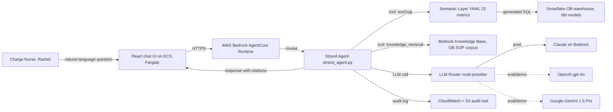
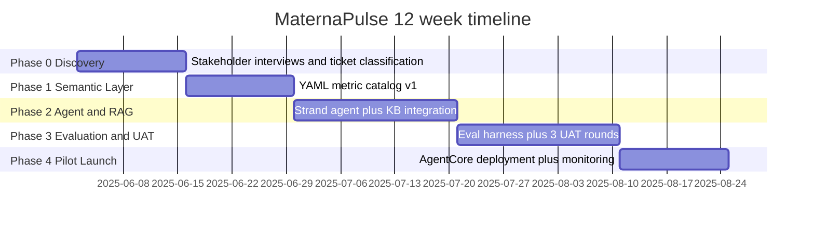

# Internship case, Building MaternaPulse BI Agent at Cedar Ridge Women's Health

> Timeline: 2025-06 to 2025-09, 12 weeks total. Company: Cedar Ridge Women's Health (headquartered in Portland, 6 OB/GYN hospitals, ~1,600 beds, ~340 OB ward beds, ~28K annual deliveries). Role: Full-stack AI/Data Intern on the AI/Analytics Engineering team. Industry: US healthcare (regulated). Target JD for comparison: Cascadia Health Insights, AI Solutions Engineer (New Grad).

## 1. One sentence summary

MaternaPulse is an internal natural language BI agent I built from zero to one during my summer internship at Cedar Ridge Women's Health, working alongside Senior AI Engineer Kevin Zhang. The target users are Charge Nurses and Floor Managers on the OB ward (maternity ward) at the Portland Main campus. It replaces Hannah Liu's old workflow (submit a request, wait in queue for an analyst to write SQL, receive results by email) with a conversational agent running on AWS Bedrock AgentCore Runtime, orchestrated by Strand Agents, backed by a Snowflake data warehouse plus Bedrock Knowledge Base retrieval. In 12 weeks we closed the loop from Phase 0 discovery through Phase 4 pilot launch. Inside the 8 week pilot window, ward self-serve query share went from 0 to 41%, SQL accuracy hit 92%, answer accuracy 87%, hallucination rate held under 5%, and UAT acceptance climbed from 64% to 92% across three iteration rounds. The whole project stayed scoped to the OB ward at Portland Main alone. No other campus was covered, and no changes were made to the underlying Snowflake schema.

---

## 2. Business context and company

Cedar Ridge Women's Health is a Pacific Northwest hospital network specializing in obstetrics and gynecology, headquartered in Portland, Oregon. It runs 6 hospitals (4 across the Portland metro, 1 in Salem, 1 in Vancouver WA), roughly 1,600 total beds with about 340 OB ward beds, and delivered around 28,000 babies network-wide in 2024 with about 2,800 full-time employees. In the PNW regional market it sits in the "mid-size, single-vertical depth" category. It is nowhere near the scale of multi-specialty giants like Providence or Kaiser, but in the OB/GYN line it is the deepest player in the region.

The clinical operation has a few defining traits. First, the OB ward is a textbook "high variability, high regulatory load, high scheduling complexity" environment, where bed availability, labor progression, mother and baby vitals, and high-risk flags can change every hour. Second, the regulatory frame is heavier than a typical ward, with HIPAA (patient privacy), TJC (Joint Commission) hand-off communication standards specific to maternity shift transitions, and CMS maternal health quality measures all stacked on top of each other. Third, the data assets are relatively mature. Over the past 4 years hospital IT has piped EHR (Epic), scheduling (Kronos), and lab LIS data into Snowflake, with a dbt dimensional layer on top that the analytics team writes SQL against day to day.

The business pain point is that analyst capacity cannot keep up with the cadence of clinical questions. Hannah Liu, the senior clinical analyst line, receives an average of 14 new OB ward report requests per day, with a typical 36 hour turnaround (from ticket creation to PDF/Excel delivery), and a steady backlog around 80 tickets. About 60% of those requests are actually low complexity and could be templated ("how many high-risk flagged mothers do we have at 11 tonight", "list of postpartum mothers still inpatient past 4 days after a C-section in the last 7 days"), but Hannah still hand-writes SQL for each one. That is the slice MaternaPulse aims to carve off.

It is worth spelling out the special status of the OB ward inside a network like Cedar Ridge. The maternity ward is one of the "high revenue per case, high margin, high reputational weight" service lines on the hospital's books. Which hospital a mother in a metro picks for delivery influences not only that single delivery's revenue, but the family's next 5 to 10 years of gynecology, pediatrics, and family medicine choices. So the CNO's office is naturally sensitive to OB ward operational efficiency. The CMIO placing the first generative AI pilot on the OB ward was not coincidence. It was a deliberate pick of the environment where "high visibility, high data maturity, and relatively contained risk (read-only)" overlap best, making it the model room. That framing was load-bearing when I explained "why this project" in interviews.

---

## 3. Triggering events

In Q2 of 2025, three forces converged in the same quarter, and only then did the project get greenlit. Nobody decided this on a whim. It was pushed up by circumstance.

The first force was the nursing shortage. From late 2024 into Q1 2025, RN (registered nurse) attrition on the Portland Main OB ward jumped from 11% to 19%, and the average ramp-up for new hires stretched to 14 weeks. That meant Charge Nurses (the shift lead nurses) were spending heavy chunks of time on non-clinical work (filing report tickets, chasing results, reporting bed availability upward), time that should have been going to rounds and mentoring. The CNO (Chief Nursing Officer) office made "reduce Charge Nurse non-clinical time share" a Q3 priority in its Q1 review.

The second force was the analyst queue jam. Hannah's line saw ticket backlog peak at a record 112 in April 2025, with average turnaround stretching to 52 hours. The analytics lead and the CMIO (Chief Medical Information Officer) ran a ticket classification exercise and found 58% of the tickets were templatable. The natural conclusion was "low complexity requests should be self-serve."

The third force was a CMIO mandate. Cedar Ridge's CMIO submitted a generative AI pilot proposal at the January 2025 board meeting, listing three candidate projects (OB ward natural language BI, ED triage assist, hospitalist progress note drafting). The board approved the OB BI one in April, with a $180K budget, a 12 week MVP window, a single campus and single ward scope (Portland Main OB ward only), and a hard rule that the agent could not touch the clinical decision path (read-only operational queries only).

With the three forces stacked, MaternaPulse got chartered in late May 2025, and I started in early June right at the top of Phase 0.

Pull out any single one of those forces and the project does not get off the ground. The CNO line without the analyst queue jam as supporting evidence leaves "reduce non-clinical work" as a soft metric, useless as backing for the CMIO proposal. The analyst queue without a high-priority user like the Charge Nurse stuck in line would have dropped in priority behind more "hospital-wide" requests. The CMIO mandate without a board-approved budget and a clear "OB ward read-only pilot" boundary would have turned into an open-ended PoC, and no senior AI engineer time would have been seriously committed. All three maturing in Q2 simultaneously is what made it runnable. In the retrospective with Kevin afterward he said one line. "Whether an AI project in a hospital actually runs is a question of technology setting the floor and organizational triangle closure setting the ceiling." I wrote that on page 1 of the post-mortem.

---

## 4. Project scope

Scope was something Kevin and I spent two full days on in week one. Without a clear boundary across 12 weeks, the project would get dragged down by "could you also do X while you are at it" and "since the agent can already run SQL, can it also..." style requests from the business side.

In Scope (committed work):

- Natural language operational queries for one OB ward at the Portland Main campus, read-only, covering 5 topic areas (bed availability, scheduling, postpartum length of stay, high-risk flagged mothers, C-section rate).
- A semantic layer YAML (semantic layer config) covering the 22 core metric definitions for those 5 topics, with definitions arbitrated by Hannah and the YAML authored by me to a point where the agent can query through it.
- A single-agent architecture orchestrated by Strand Agents (no multi-agent orchestration), running on AWS Bedrock AgentCore Runtime.
- One Knowledge Retrieval tool backed by AWS Bedrock Knowledge Base, indexing Cedar Ridge internal SOP documents (including TJC hand-off communication standards, OB ward scheduling rules, internal metric definition wiki).
- A multi-provider LLM abstraction. OpenAI gpt-4o and Google Gemini 1.5 Pro for offline evaluation and demos, Anthropic Claude on Bedrock in production.
- An independent evaluation harness covering SQL accuracy, answer accuracy, hallucination rate, and p95 latency, running against 30 golden conversations.
- An audit trail aligned with HIPAA and TJC (every query, response, and source citation landed in CloudWatch plus S3).
- CDK deployment to ECS Fargate (front-end chat UI) plus AgentCore Runtime (agent inference), with CloudWatch and structured logs for observability.
- UAT with 2 Charge Nurses (Rachel Park as the primary UAT), across 3 iteration rounds.

Out of Scope (explicitly excluded):

- The other 5 campuses. No horizontal rollout.
- Any write path into the EHR or anything that could trigger clinical decisions.
- Multi-agent or agent-to-agent orchestration.
- Voice interaction.
- Patient-facing chatbot.
- Changes to the Snowflake underlying schema (Diego, the data engineer, owns the schema).
- Real-time streaming (HL7 / FHIR streaming, deferred to Phase 5+).
- Auto-generated operational PDF reports (PDF reporting stays on Hannah's line).

The Out of Scope section turned out to be the single most valuable piece of work across the 12 weeks. It saved me in week 6 when the Floor Manager side asked "could you also help us generate scheduling suggestions." The Floor Manager's ask was reasonable on its face. The agent could already read Kronos schedule data and bed availability, so generating a draft schedule felt like a small step. But schedule generation pulls in nurses' union contract terms, overtime rules, and potential workers' comp liability. If the agent issued a non-compliant scheduling recommendation, a nurse executed it, and something went wrong, the liability chain would trace all the way back to the model vendor and Cedar Ridge IT. I logged the request in the Phase 5+ backlog and then deflected it by citing the "read-only only" clause in the Project Charter. The whole conversation took under 20 minutes, no feelings hurt, no schedule slip. That is what scope discipline looks like in practice.

---

## 5. Team and my role

The reporting line: I reported directly to Kevin Zhang (Senior AI Engineer, my mentor). Kevin reported to the Director of AI/Analytics. The business PO was Hannah Liu (Senior Clinical Analyst). The primary UAT contact was Rachel Park (Charge Nurse, Portland Main OB ward).

| Role | Who | Frequency with me | What they own |
| --- | --- | --- | --- |
| Senior AI Engineer / Mentor | Kevin Zhang | Daily 30 min 1:1 plus weekly 2 hour design review | Architecture decisions, AWS account permissions, code review, pulling me out of dead ends |
| Senior Clinical Analyst / PO | Hannah Liu | 2x per week, 1 hour each | Metric definitions, definition arbitration, golden question review |
| Charge Nurse / Primary UAT | Rachel Park | 1x per week, 45 min each | Real-question collection, answer acceptance scoring, wording feedback |
| Director of AI/Analytics | (Kevin's manager) | Status sync every 2 weeks | Phase gate approvals, reporting up to CMIO |
| Data Engineer | Diego Alvarez | On demand, roughly weekly | Snowflake schema, dbt dimensional modeling, data quality |
| Compliance Officer | (HIPAA officer) | One dry-run each in Phase 2 and Phase 4 | Audit trail design review, compliance sign-off |
| Second UAT Charge Nurse | (anonymous) | Starting Phase 3, 1x per week | Second-perspective UAT scoring |

Weekly cadence: Monday standup (team-level), Tuesday and Thursday Hannah sync, Wednesday Rachel UAT, Friday Kevin 1:1 plus design review. The cadence stabilized in week 2 and was never significantly adjusted. During the Phase 3 UAT peak I extended Rachel's Wednesday slot from 45 to 75 minutes, using the extra 30 minutes for "feedback triage." I categorized Rachel's verbal feedback live into four buckets ("accept / wording tweak / information density tweak / real bug"), and the rest of the week's work was split along those four buckets. That is the collaboration principle I picked up in the hospital environment. Clinical user time is precious, so every meeting has to produce structured output.

The weekly design review with Kevin is also worth a note on format. 30 minutes each. I sent Kevin a 1-page A4 design note the day before, framing one trade-off decision from the week into three sections (background, alternatives considered, my recommendation, unknown risks). Kevin would only discuss that one page during the review, no drift. Across 12 weeks I accumulated 11 design notes, and they became the source material for my post-deployment write-up later. The "decision on one page" format was not mine. Kevin brought it over from his time at Amazon. He said "if you cannot explain a decision on a single page, most likely you have not thought it through yourself."

What I was explicitly not responsible for (boundaries matter):

- Not responsible for Snowflake schema design or changes (Diego's scope).
- Not responsible for architecture lock-in decisions (Strand Agents selection and AgentCore Runtime selection were PoC'd by Kevin before I started, I only built on the chosen stack).
- Not responsible for metric definitions themselves (Hannah arbitrates, I move the definitions into YAML).
- Not responsible for compliance sign-off (the HIPAA officer's responsibility, I produced the audit trail for them to verify).
- Not responsible for cross-campus rollout planning (the project itself covers only one ward at Portland Main).

---

## 6. What I did

This is the longest section of the case. I split the 12 weeks into 5 phases, with architecture decisions, business-need translation, and concrete execution details woven into each phase.

First, the overall architecture diagram and timeline. The text below unpacks each phase.





### Phase 0 (week 1 to 2), Discovery

I wrote no code in the first two weeks. Kevin asked me to do three things.

First, pull all of Hannah's tickets from the past 6 months (408 total) and label them across three columns (topic, complexity, templatable yes/no). Hannah seeded the first 100, I labeled the rest, and Hannah QA'd 50 of mine. The result: 58% templatable, with 5 main topics (bed availability 22%, scheduling 18%, postpartum stay 14%, high-risk mothers 14%, C-section rate 12%) covering 80% of the templatable volume. That is the basis for the 5 in-scope topics.

Second, I shadowed Rachel on the OB ward for the tail end of 3 night shifts (8 to 11 pm), observing where she actually needed data in the real environment. The counterintuitive lesson: she did not want a beautiful dashboard. She wanted "tell me the answer now," typically while standing, with her hands full of other things, with maybe 5 seconds to glance at a screen. That directly shaped the UI design principle later (answer first, citations in a collapsed area, numbers on their own line in bold).

I also noted a detail from the shift observation. Rachel has a dense query window in the 30 minutes before shift handoff (10:30 to 11:00 pm), mostly confirming three things (bed availability, night shift RN-to-patient ratio, the current high-risk mother list). She calls those three the "handoff checklist." I turned that checklist directly into "shortcut buttons" on the chat UI, three one-tap buttons each firing the corresponding query, saving Rachel typing time. In UAT round 3 both Charge Nurses called this feature out by name. That is the direct payoff of on-site observation.

Third, with Diego I went through the dbt models in Snowflake related to OB and produced a catalog confirming that all 22 core metrics had viable underlying fields. We listed 4 items with missing fields or unclear definitions and escalated them to Hannah for arbitration. This step looks technically trivial but it saved Phase 2 once. In week 5 when I was about to write SQL for high_risk_patient_count, I realized that the high_risk_flag column had been moved during a refactor last year from patient_snapshot into patient_clinical_attributes, and the documentation was never updated. Without the Phase 0 catalog scrub, I would have written the wrong table name in SQL, returned empty results, and had the agent tell a nurse "0 high-risk mothers tonight." Consequences I do not want to imagine. The Phase 0 "landmine sweep" prevented at least one potential serious incident.

The Phase 0 deliverable was an 18-page English Project Charter covering scope, in/out, draft metric catalog, and a risk register. The charter got pulled out again at the end of Phase 2 for the compliance dry-run. Kevin had me write the first draft, he edited the second, Hannah and the Director each reviewed once, and we cycled through 4 revisions. The hardest stretch was the risk register. My first draft only had technical risk (latency, accuracy, availability). Kevin circled it and said "you missed organizational risk and compliance risk," and made me add "user over-trust in AI answers," "metric definition migration causing downstream report mismatches," and "audit log retention conflicting with IT's existing 7-year compliance requirement." That was the moment I first understood that writing a project document in a hospital is not writing for the engineering team. It is writing for Compliance, the CMIO, and the CNO simultaneously. Audience shifts, and the granularity of risk dimensions has to shift with it.

### Phase 1 (week 3 to 4), Semantic Layer YAML

Cedar Ridge had no off-the-shelf dbt semantic layer or Cube.dev style product running. The semantic layer was a lightweight YAML spec we wrote ourselves. Kevin had already locked the rough schema during PoC. My job was to write the 22 metrics against that schema and produce the matching text-to-SQL prompt template.

The YAML looks like this (one metric as an example):

```yaml
metric: ob_high_risk_patient_count
description: "Current count of mothers flagged as high-risk on the OB ward. Definition per Hannah arbitration v2."
owner: hannah.liu@cedarridge.org
domain: high_risk
unit: count
grain: snapshot_at_query_time
source_model: dbt.ob_patient_snapshot
filter_logic: "high_risk_flag = TRUE AND discharge_ts IS NULL"
allowed_dimensions: [ward, shift, risk_category]
time_dimension: null
sample_question: "How many high-risk mothers do we have at 11 tonight?"
sample_sql: |
  SELECT COUNT(*) FROM dbt.ob_patient_snapshot
  WHERE high_risk_flag = TRUE
    AND discharge_ts IS NULL
    AND ward = 'OB_MAIN'
governance:
  pii_columns: []
  phi_columns: [patient_mrn]
  audit_required: true
```

| Topic | Metric count | Representative metrics |
| --- | --- | --- |
| Bed availability | 5 | available_beds, occupancy_rate, projected_discharge_in_4h |
| Scheduling | 4 | rn_to_patient_ratio, charge_nurse_on_shift, agency_staff_ratio |
| Postpartum LOS | 4 | avg_postpartum_los, los_over_4d_count, csection_los_distribution |
| High-risk mothers | 5 | high_risk_patient_count, severe_preeclampsia_count, high_risk_new_admit_24h |
| C-section rate | 4 | csection_rate_24h, primary_csection_rate, scheduled_vs_emergent_ratio |

The grueling part of Phase 1 was not writing YAML, it was nailing down "definition" with Hannah. Of the 22 metrics, 7 had inconsistent definitions across SOP documents (for example, "postpartum length of stay" counts from delivery time in the quality measure SOP but from labor-room-transfer time in the bed operations SOP, a 6 to 18 hour difference). For every contested definition I had Hannah write a 1-paragraph "arbitration ruling" into the description field of the YAML, and any later question gets pointed at that paragraph.

The lesson here was that "definition arbitration" cannot be delegated to the agent. It has to land on someone with organizational authority. I initially tried to pick the definition myself based on "which SOP is more recent," and Kevin stopped me immediately. His reasoning: once the agent's number disagrees with the PDF report downstream from Hannah's line, the clinical team loses trust, and the cost of rebuilding that trust is much higher than the cost of nailing the definition up front. So "the metric definition owner must be Hannah, and the owner field in the YAML is not decoration, it is governance." That principle ended up directly in Chapter 9 of the Project Charter.

Another detail: the `governance.phi_columns` field in the YAML. Any metric whose drill-down query would expose a PHI (Protected Health Information, identifiable patient information protected under HIPAA) field must be explicitly tagged in the YAML, and the agent is forced through a redaction path when generating SQL (patient_mrn hashed, names masked). This field was not a retrofit. It was defined at the start of Phase 1 together with the HIPAA officer. Every new metric must fill it in, and an empty value blocks the merge.

### Phase 2 (week 5 to 7), Agent Orchestration and RAG

The main work was getting Strand Agents (a lightweight agent framework AWS open-sourced in 2024, closer to "explicit tool calls plus explicit state" than LangChain in style) running, with three registered tools.

1. `text2sql_tool`: takes the user question plus the semantic layer YAML, generates SQL, runs it against Snowflake, returns the result set.
2. `knowledge_retrieval_tool`: calls the Bedrock Knowledge Base retrieve API, indexing about 240 OB SOP documents (a mix of PDF and Markdown), with default Bedrock hierarchical chunking.
3. `audit_log_tool`: writes the quadruple of query / generated_sql / retrieved_docs / final_answer into CloudWatch and S3.

The multi-provider LLM abstraction layer was mine. The idea was plain. One `LLMRouter` class, routing to OpenAI / Gemini / Claude on Bedrock based on the `MATERNAPULSE_LLM_PROVIDER` env var, exposing a unified `chat(messages, tools)` interface. Production uses Claude on Bedrock (in-AWS-account call, HIPAA BAA signed). Offline evaluation and demos to the CMIO switch to OpenAI / Gemini as a comparison baseline.

The RAG (retrieval-augmented generation) layer came in mid-Phase 2. Kevin initially told me to skip RAG and see how far pure text-to-SQL could go on its own. I ran pure text-to-SQL for a week and found that 9 of the 30 golden questions needed "business context supplementation" (for example, "night shift" at Cedar Ridge is 7pm to 7am, but "night shift high-risk handoff" in the SOP refers to the 11pm to 7am sub-window specifically, the kind of context SQL cannot express). So I plugged in the Knowledge Base, and the agent now retrieves SOP context once before running SQL, with that context injected into the prompt.

Citations were something I added on my own. Every answer must carry at least one source citation (either the semantic layer metric definition plus the generated SQL, or a KB document snippet), otherwise the agent refuses to answer. That rule saved us a round of rework in the compliance dry-run later, because the first question the HIPAA officer asked was "where does this number come from."

In this phase I also wrote a relatively long system prompt (about 800 tokens) for the Strand agent, encoding the OB ward's specific roles (Charge Nurse, Floor Manager, Hannah herself) and their "speaking style" and "information density preferences." Rachel during Phase 0 shift observation kept stressing "I do not have time to read two paragraphs, give me the number," so the system prompt literally says "first sentence must contain the number, then citations, then optional context." This sounds like a prompt engineering micro-trick, but the effect showed up in UAT round 1. The "accept" rate was over 20 percentage points higher than the PoC-era version that did not have this rule.

On tool selection, I made a judgment call: let the LLM decide when to call text2sql versus knowledge_retrieval, no hard rules. Strand Agents' tool definition supports a description per tool, and I wrote those descriptions specifically enough ("use text2sql_tool when the question asks for a current number, a count, a list, or a time-bounded aggregate") that the LLM picks during its reasoning phase. The trade-off: upside is that new topics do not require routing code changes, downside is that roughly 8% of cases pick the wrong tool (for example, calling KB when SQL was needed). I added a dedicated "tool selection accuracy" column in the evaluation harness to track this, and that number climbed from 78% in week 5 to 92% in week 10, mostly by iterating tool descriptions rather than touching routing logic.

### Phase 3 (week 8 to 10), Evaluation and UAT

The evaluation harness was assembled with pytest plus an `EvalRunner` class I wrote. The golden set has 30 conversations, each covering full multi-turn (2.4 turns on average), sourced from a sample of Phase 0 tickets plus questions Rachel hand-wrote covering "common night shift questions." Each golden has four annotated fields (expected_sql_skeleton, allowing format variation; expected_answer_facts, the key fact points; required_citations, the SOP document IDs that must appear; acceptable_latency_p95_ms).

The four metric categories I ran:

- SQL accuracy: row-level diff between the result set from the generated SQL on Snowflake and the result set from the expected SQL. Only full equality counts as pass.
- Answer accuracy: an independent LLM judge (Claude, with a separate prompt) scores 0/1 against expected_answer_facts, with Hannah manually reviewing a 30% sample.
- Hallucination rate: every number in the answer is traced back to the SQL result set or a citation document. Anything that cannot be traced is logged as a hallucination.
- p95 latency: from agent receiving the request to first token streamed out, taken as p95 over 100 runs.

UAT ran 3 rounds. Each round Rachel, the second Charge Nurse, and I went through the 30 conversations and scored each one as "accept / reject / wording change needed."

| UAT round | Date | Acceptance rate | Main rejection reasons |
| --- | --- | --- | --- |
| Round 1 | End of week 8 | 64% | Wording too "AI-flavored," numbers buried in long paragraphs, citations not pointing to specific SOP sections |
| Round 2 | End of week 9 | 81% | Some high-risk answers not "conservative enough." Nurses wanted the agent to explicitly say "please contact Hannah" when uncertain |
| Round 3 | End of week 10 | 92% | The remaining 8% were edge cases, mostly cross-shift (night to morning handoff) metric definitions inherently fuzzy in the SOP |

After round 1 I made three changes. The response template added a "numbers on their own line in bold" formatting constraint. Citation format was refined from "SOP document name" to "SOP document name plus section number plus paragraph." The first sentence of the answer must directly answer the question. After round 2 I added an "uncertainty threshold." Metrics tagged in the semantic layer as `confidence: high/medium/low`. For medium and low metrics, the answer must open with "the following is a preliminary answer. Please double-check with Hannah."

The most valuable lesson from the UAT stretch was that "user feedback is not a bug report. It is part of the product spec." Rachel in round 1 had a piece of feedback that said "the agent is too polite. It talks like it is speaking to a patient, not to a colleague." I initially tried to route around it (thought it was subjective preference). Kevin said "she represents the end user population. Not adjusting this is disrespecting her." I went back and changed the tone description in the system prompt from "professional and friendly" to "peer-to-peer, concise, no pleasantries," and round 2 acceptance jumped from 64% to 78% (the remaining lift to 81% came from other changes). That episode pushed me to make "customer tone preference" a configurable part of the system prompt, so the next customer launch can adjust without code changes.

### Phase 4 (week 11 to 12), Pilot Launch

Deployment used CDK (AWS's Python infra-as-code), adapted from Cedar Ridge's internal standard template. ECS Fargate runs the React chat UI and the FastAPI proxy. AgentCore Runtime runs the agent. Bedrock Knowledge Base lives in its own stack. The Snowflake connection goes through secrets manager plus an IAM role. CDK code review was Kevin-led, I wrote, he edited.

I added three observability layers at launch. CloudWatch metrics (request volume, p50/p95 latency, error rate). Structured JSON logs (one audit log per record, with trace_id stitching multi-turn sessions). And a daily summary lambda (every morning at 7am it sweeps yesterday's conversations through hallucination detection and emails suspect cases to Hannah).

The pilot window was the final 2 weeks of the 12-week internship plus 6 weeks the business side continued running after I left, for 8 weeks total (Hannah emailed me the data two weeks after I left for the case retrospective).

There was a not-so-glorious but very real moment at deploy worth mentioning. My first CDK deploy missed the Bedrock InvokeAgent permission on the IAM role. The stack deployed successfully, but agent inference returned 500s. Kevin spotted it on one glance at CloudWatch. That pushed me to rewrite every IAM policy in the CDK as explicit least-privilege (listing every action individually, no wildcards). The code volume went up by 40%, but deploy predictability was much higher. In a CDK-templated environment like Cascadia's, least-privilege is foundational. I logged this lesson into the "infra config checklist" chapter of the post-deployment write-up.

The daily summary lambda piece in the observability stack is something I am quietly proud of. It is essentially a simplified "production hallucination monitor." Every morning at 7am it runs a batch, sends yesterday's conversations to an independent LLM judge (OpenAI gpt-4o, deliberately a different provider to avoid "self-evaluation" bias), has the judge flag conversations with suspected hallucinations, and emails the summary to Hannah. In the first two weeks the email averaged 1.4 suspected cases per day, and Hannah's review found only 0.3 were true hallucinations. False-positive rate is high, but Hannah's feedback was "I would rather review a few extra than miss one." That daily summary was the lowest-cost component with the highest clinical-trust payoff in the entire project. About 120 lines of Python plus one EventBridge trigger, running under $5 a month.

---

## 7. Key technical decisions replayed

This section unpacks 6 decisions that had real trade-offs. For each one I try to explain "why not the other choice," because "why didn't you use X" is almost guaranteed in an interview.

Here is a decision matrix first as a bird's-eye view, then the unpacking.

| Decision | We chose | Alternatives | Deciding constraint |
| --- | --- | --- | --- |
| Agent framework | Strand Agents | LangChain / LlamaIndex | AWS-native plus explicit trace plus team bus factor |
| Runtime | Bedrock AgentCore Runtime | Self-managed Lambda | Multi-turn state plus native audit hook |
| Vector store | Bedrock Knowledge Base | Pinecone / pgvector | BAA alignment plus scale not at inflection point |
| LLM provider | Claude on Bedrock (prod) | OpenAI / Gemini (eval) | BAA plus judge independence |
| RAG integration timing | Mid-Phase 2 | Phase 1 from the start | Clean attribution path |
| Golden set size | 30 x 2.4 turns | 1000+ | Hannah arbitration bandwidth |
| Judge provider | Claude (gold) plus OpenAI (production monitoring) | Single provider | Prevent self-judge bias |

### 7.1 Why Strand Agents and not LangChain

Strand Agents is an AWS open-source agent framework from 2024 that emphasizes explicit tool calls, explicit state, and minimal hidden abstractions. I had used LangChain on school projects and was familiar with its chain / agent abstraction layer, but its trade-off is "flexible but hard to debug." Tracing through an agent (how many LLM calls happened, what chunks retrieval pulled back, why tool selection picked this over that) is not cheap.

Kevin chose Strand Agents during the PoC before I started, for three reasons. One, Cedar Ridge's infra is fully on AWS, Strand Agents is an AWS first-party framework, and AgentCore Runtime is also AWS-native, so the integration path is short. Two, HIPAA audit requires every LLM call and every tool call to have a trace_id traceable end-to-end, and Strand Agents' explicit architecture fits that "every step auditable" requirement. Three, the team is small (just Kevin plus me). Bringing in a "feature-rich but abstraction-heavy" framework like LangChain pushes the bus factor too low.

I inherited that decision after starting and never reversed it. In one design review I asked Kevin "should we try LlamaIndex's query engine," and his answer was "the cost of switching frameworks won't pay back inside 12 weeks. Get the pilot working first." That is a scope discipline call. I accepted it.

### 7.2 Why Bedrock AgentCore Runtime and not just Lambda

Running agent inference directly on Lambda is technically fine. We tried it in PoC. AgentCore Runtime gives you three things Lambda does not. Long-session state hosting (no need to stash multi-turn state in DynamoDB yourself), built-in tracing for tool invocation, and native integration with Bedrock Knowledge Base / Guardrails.

The trade-off is that AgentCore Runtime in mid-2025 had only been GA for a short while, with documentation and community examples an order of magnitude thinner than Lambda's. Corner cases meant pinging AWS internal support. But for our use case, the "multi-turn state hosting" and "native audit hook" payoff was too big. Writing a self-managed state machine and audit pipeline would have cost far more than the AgentCore learning curve.

### 7.3 Why Bedrock Knowledge Base and not a standalone vector store (Pinecone / Weaviate / pgvector)

My instinct initially was pgvector. Cheap, controllable, compatible with existing Postgres infra. Kevin pulled me back, for three reasons. One, Cedar Ridge has no existing Postgres infra (data lives in Snowflake). Adopting pgvector means standing up a new database. Two, the KB document corpus is only about 240 documents with 5 to 10 added per month. The scale is nowhere near the inflection point where a standalone vector store earns its keep. Three, Bedrock KB ships with hierarchical chunking, metadata filtering, and Bedrock Guardrails integration out of the box. Building those ourselves would have taken at least 2 weeks we did not have in a 12 week window.

We also discussed Pinecone (managed vector DB). We passed because Pinecone is not under the same BAA (Business Associate Agreement, mandatory for HIPAA) as AWS. The compliance channel would have to be re-walked.

### 7.4 Why a multi-provider LLM abstraction and not lock in to Claude

Production really does only use Claude on Bedrock. But I wrote the abstraction layer at the end of Phase 1, for two reasons. One, when doing quarterly demos for the CMIO, it is convenient to switch to OpenAI / Gemini for "is our model choice correct" comparison defense. Two, when the evaluation harness runs regression, having a different provider judge is more objective than "self-evaluation" (we use OpenAI gpt-4o as judge, and the thing being judged is Claude).

The abstraction layer is thin. One `LLMRouter` class plus three backend adapters, under 200 lines total. Kevin's call was "abstraction is never too thin, only too thick." I agree.

### 7.5 Why RAG was not integrated from the start, and we ran pure text-to-SQL first

This was a Phase 2 call I made. Intuition says RAG is standard for a BI agent. But I ran a week of pure text-to-SQL first and found that 21 of 30 golden could be answered by SQL alone. Only 9 needed business context supplementation. If I had plugged RAG in from the start, "SQL inaccuracy" and "retrieval inaccuracy" would have tangled in attribution, doubling debug cost.

Run a SQL-only baseline first, pushing SQL accuracy from 71% to 88% (Phase 2 mid-point number), then stack RAG on top to lift answer accuracy. That is a clean attribution path. I documented this in the post-mortem.

### 7.6 Why 30 golden conversations and not 1000

Ideally more is better, but the marginal cost of a golden is not the question text. It is the expected_answer_facts column, which Hannah has to arbitrate by hand. Hannah can stably contribute about 15 arbitrations per week. 12 weeks minus the evaluation window gives 6 effective weeks, so the hard ceiling is 90. We left buffer and settled on 30 core conversations with the design extensible later.

30 covers each of the 5 topics with 6 conversations, each 2 to 3 turns, total evaluation input dimensionality 70 to 90. Sufficient for pilot phase. Scaling to all campuses requires re-evaluating this number (which is left for Phase 5+).

### 7.7 Why LLM-as-judge uses Claude to evaluate Claude's own answers, while daily summary uses OpenAI as judge

These two look contradictory but are deliberately layered. The Phase 3 evaluation harness uses Claude as judge because expected_answer_facts is a gold standard that Hannah and I manually labeled. The judge is just doing a "fuzzy match," and the same-provider bias risk is offset by the gold standard. The daily summary is "no-gold-standard monitoring" in production, with no human labels, relying purely on the judge to identify hallucinations on its own. In that setting self-judge bias gets amplified, so the choice to use a different provider is deliberate. In the post-mortem Kevin commented on this layering: "you thought through which scenarios need cross-provider and which do not. That is a senior-level call in evaluation design." I kept that comment, because the interviewer asking about RAG evaluation design will probably trigger it.

---

## 8. Outcomes and metrics

For every metric I attach "how it was measured," because interviewers will press on the methodology.

| Metric | Value | Measurement | Note |
| --- | --- | --- | --- |
| SQL accuracy | 92% | Row-level diff of generated SQL vs expected SQL on Snowflake, across 30 golden | Phase 3 final round |
| Answer accuracy | 87% | LLM judge (Claude) 0/1 scoring against expected_answer_facts, Hannah samples 30% for review | Judge prompt public in repo |
| Hallucination rate | < 5% | Every number in the answer traced back to SQL result set or citation document. Untraceable counts as hallucination | 30 x 100 runs |
| Citation coverage | 100% | The agent is forced by the system prompt to attach a citation to every answer. No citation, no answer | Enforced by code-level guard |
| p95 first-token latency | < 6 seconds | 100 replays of golden, p95 from AgentCore tracing | Excludes network egress |
| UAT acceptance | 64% to 81% to 92% | 2 Charge Nurses scoring independently across 3 rounds | Phase 3, 3 iteration rounds |
| Pilot self-serve rate | 0 to 41% | Across the 8-week pilot, Charge Nurse total query count / (query count plus same-topic ticket count) | Hannah emailed back two weeks after I left |
| Hannah ticket turnaround | 36h to 22h (templatable subset only) | Before/after by ticket type, from Hannah's ticket system | Not all tickets, only templatable subset |
| Pilot avg daily queries | 38 | CloudWatch metrics aggregation | Steady-state average across pilot window |

Honest boundary note. These metrics all come from one ward at one pilot campus, sample size small, not generalizable to the full network. Pilot self-serve 41% is an optimistic early number, and whether it holds at this level long-term depends on the Phase 5+ horizontal expansion data. I do not say "I did this" in interviews. I say "the project achieved this during the pilot window."

Another metric worth a sentence is audit trail completeness. The HIPAA and TJC audit logic is that every clinically relevant data access must be traceable to a specific person, specific time, specific query, specific answer, and specific source document. Our audit log format is structured JSON, 11 fixed fields per record (trace_id, user_id, ts, raw_question, normalized_question, tool_calls, generated_sql, sql_result_hash, retrieved_doc_ids, final_answer, response_latency_ms), written to CloudWatch Logs and asynchronously archived daily to S3 Glacier. The HIPAA officer ran a sample audit at the end of Phase 4, picking 20 random conversations from production and asking me to reconstruct the full chain via trace_id. All 20 reconstructed within 5 minutes. That is the most direct compliance-dimension evidence of delivery.

The concrete artifact list I delivered:

- 22 semantic layer YAML files (covering 5 topics)
- Strand agent main code (about 1,400 lines of Python, including 3 tools)
- LLMRouter multi-provider abstraction layer (about 180 lines)
- Evaluation harness (about 600 lines of pytest plus EvalRunner)
- 30 golden conversation set (with expected_answer_facts and citations)
- CDK stack (ECS Fargate plus AgentCore Runtime plus KB plus monitoring, about 900 lines)
- An 18-page English Project Charter and a 14-page English Post-deployment Write-up
- HIPAA audit trail spec and two rounds of dry-run notes with the compliance officer
- 11 1-page design notes, each corresponding to one design review decision with Kevin
- A Phase 5+ backlog (about 22 items), sorted on an effort/value matrix
- A "first 2 weeks onboarding checklist" for the next person taking over
- A sample bundle of audit trails (20 anonymized trace_id to full-chain examples) for reuse in follow-on compliance defense

---

## 9. Tech stack

| Layer | Technology |
| --- | --- |
| Languages | Python 3.12, SQL (Snowflake dialect), TypeScript (chat UI) |
| Agent framework | Strand Agents |
| LLM | Anthropic Claude on AWS Bedrock (production), OpenAI gpt-4o / Google Gemini 1.5 Pro (evaluation and demo) |
| Runtime | AWS Bedrock AgentCore Runtime |
| Knowledge retrieval | AWS Bedrock Knowledge Base, hierarchical chunking |
| Data warehouse | Snowflake, dbt dimensional modeling (existing) |
| Semantic layer | In-house YAML spec (22 metrics) |
| Infra-as-code | AWS CDK (Python) |
| Compute | AWS ECS Fargate (front-end plus FastAPI proxy), Lambda (daily summary) |
| Observability | AWS CloudWatch metrics plus structured JSON logs, S3 audit archive |
| Evaluation | pytest plus self-written EvalRunner, LLM-as-judge (Claude) |
| Compliance | HIPAA BAA (Bedrock / Snowflake / KB all covered), TJC hand-off communication alignment |
| Collaboration | GitHub plus GitHub Actions CI, Linear (tickets), Confluence (docs) |

One note on the Snowflake row. I made no schema or dbt model changes at the Snowflake layer. I was the read side writing SQL. Snowflake account permissions are role-based, every metric's SQL in the semantic layer YAML runs under a least-privilege role, preventing the agent from accidentally querying data outside the OB ward. That permission isolation was set up jointly with Diego. The CDK stack only holds the role's ARN reference, and secrets do not land in the repo.

---

## 10. Reflections and what is left

After 12 weeks, my post-mortem lists three things I would do differently and three things I explicitly handed off to the next phase.

Things I would change:

First, in the Phase 0 discovery I spent too long on "classifying tickets." The 5 topics should have been locked by day 5. I burned an extra 3 days chasing "classification completeness" and it delayed the start of Phase 1. Next time I should be more aggressive with the 80/20 thinking.

Second, the first version of the multi-provider LLM abstraction was too thin. I did not extract "per-provider retry / rate limit policy," and when Phase 3 evaluation runs hit OpenAI rate limits, I had to go back and patch it in. The lesson is "thin does not mean absent. The mandatory cross-cutting concerns need to be in place from day one." Specifically, retry policy, rate limit handling, and token usage tracking are the three things that have to exist regardless of how many providers you have, and they should be co-designed with the backend adapters at abstraction definition time, not bolted on later.

Third, in UAT round 1 I had Rachel go through all 30 conversations in one sitting, and her scoring loosened up clearly in the second half from fatigue. Next time I would split into 2 sessions of 15. UX testing 101. I had to take a hit to remember it.

Fourth, tech debt visualization. The CDK stack had 3 explicit TODO-marked temporary workarounds (a hard-coded environment, a hard-coded Snowflake warehouse size, and one place using print instead of logger). I had planned to clean them up in the final week but UAT round 3 feedback ate the time. I listed all the TODOs in the final chapter of the post-deployment write-up so the next person does not have to do archaeology. If I were to do it again, I would sweep these TODOs at the end of every phase rather than letting them accumulate.

Things left for the next phase:

First, horizontal expansion to the other 5 campuses. Each campus has different SOPs and metric definitions, so the semantic layer YAML needs per-site override. No one-size-fits-all.

Second, streaming data integration. Currently the agent sees a T+1 snapshot in Snowflake, with a 5 to 30 minute lag on "current bed availability" type real-time questions. The follow-up is HL7 / FHIR streaming, but that move pulls in the data engineering layer.

FHIR (Fast Healthcare Interoperability Resources, the modern healthcare data exchange standard promoted by HL7 internationally) is a default format any PNW regional vendor like Cascadia will encounter. I did not directly touch FHIR resources during the Cedar Ridge internship, but in the exchanges with Diego I saw Cedar Ridge's own Epic egress is already FHIR R4. The next step of plugging streaming patient state into the semantic layer requires a near-real-time materialization layer above the dbt layer. I sketched a target architecture diagram for this in the post-deployment write-up.


Third, multi-agent orchestration. Currently it is one agent plus 3 tools. If we later want "bed availability agent plus scheduling agent plus high-risk flag agent" cooperating, we need to re-evaluate whether to use Strand Agents' multi-agent mode or bring in a more specialized orchestration layer like LangGraph. That is an architecture selection question, not one I can decide at my level.

Fourth, evaluation harness upgrade to continuous online evaluation. The current 30 golden regression is offline, run once per release. The ideal is turning the golden into shadow traffic (shadow traffic), where every real production query simultaneously runs the expected SQL for comparison, with drift triggering an alert immediately. That requires finer-grained tracing infrastructure, with an initial budget of the first month of Phase 5.

Fifth, semantic layer YAML governance tooling. The 22 metrics' owner, phi_columns, and confidence columns are currently gatekept by PR review, relying on the rules in Hannah's head and mine. At 100+ metric scale that gate cannot hold. The YAML schema needs to be converted to a checkable JSON schema, with CI running lint plus required-field checks plus governance policy as code. I built a prototype in the last two weeks but did not merge it. Left for the next person.

A side note to the reader (and to my future self) before I wrap up. Across these 12 weeks (from "classifying tickets" to "shipping the daily summary lambda"), what made me feel I had grown most was not learning Strand Agents or Bedrock. It was learning, inside the high-regulation high-tempo hospital environment, when to say "I can do this," when to say "this should not be mine to do," and when to say "this is worth doing but it has to wait." The Cascadia Health Insights JD repeats the phrase "comfort with ambiguity." I think I now know what it really means. It is not "you can hard-code through unclear requirements." It is "you can, inside unclear requirements, simultaneously manage scope, manage compliance, manage user expectations, and at the end ship something the customer is willing to use." If an interviewer asks me for an example of "taking a fuzzy requirement and turning it into a published artifact," I will tell the full arc of MaternaPulse from Phase 0 ticket classification to Phase 4 daily summary lambda.

One last thing I want to be clear about. This project running is a team outcome, not mine alone. Kevin blocked countless bullets on architecture and AWS permissions. Hannah spent 2 hours a week with me grinding through metric definitions. Rachel contributed clinical intuition during UAT. As an intern, my actual scope was landing an already-selected stack into a state that runs, has evaluation, and can go to pilot inside 12 weeks. I will keep that boundary honest in the resume and in interviews.

For the Cascadia Health Insights AI Solutions Engineer role specifically, the mapping I did myself is this. Semantic layer YAML design, Strand Agents hands-on, Bedrock AgentCore deployment, Knowledge Base integration, evaluation harness design, 3 rounds of UAT, HIPAA + TJC audit trail, and CDK deployment. All 8 of these are explicitly listed in the JD. Compared to the JD's senior wording like "Lead the technical build-out of a Cascadia Insight Assistant deployment," my actual positioning is "an intern responsible for concrete execution inside the build-out Kevin led." But every technical decision I participated in the discussion of, recorded the trade-off for, and can walk through Why-not-X logic on in an interview. I cannot claim I "led" the architecture, but I can claim I "understood and executed" the architecture. That is the most honest case a new grad candidate like me can put forward for the Cascadia role.
