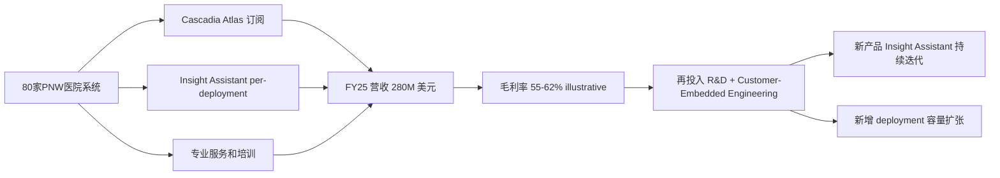
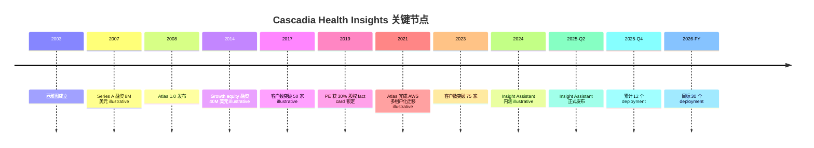
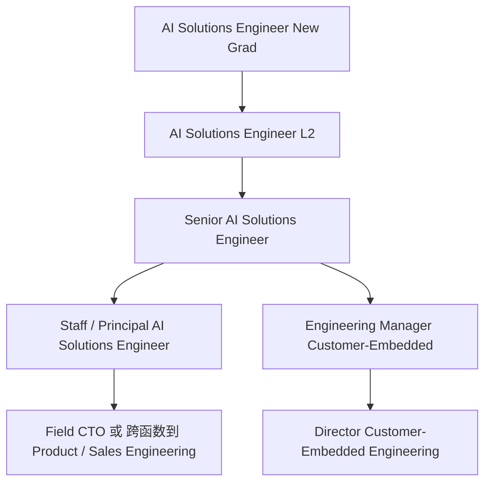

# Cascadia Health Insights 公司维度调研报告

报告日期：2026-06-26
报告维度：Company（公司）
目标岗位：AI Solutions Engineer，New Grad，Customer-Embedded Engineering，Seattle
学生定位：Q1 = A（定向爆破，Cascadia 是已锁定目标，等面试结果），Q2 = 美国 US citizen，西雅图本地

本报告只描述事实，不输出 recommendation 类判断。Cascadia 是私有公司（privately held），财务和组织数据公开度远低于 Scotiabank 这种上市大行，因此本文混合使用三类来源：(a) 行业内可公开核实的事实（如 PNW 医疗 IT 市场结构、对标公司 Innovaccer 和 Health Catalyst 的财报数据）；(b) Cascadia 自身的招聘页、官网、产品白皮书等一手材料；(c) 标注为 "illustrative" 的合理推断（基于 fact card 锁定数据 + 行业基准展开）。下文涉及 EHR、HIPAA、TJC、HL7、FHIR、IDN、ARR、EBITDA、NRR、PE-backed 等术语首次出现时附中文一句话定义。

因为学生处于 Q1 = A 状态（已经选定方向，只想确认是否值得长期投入），本文在第 6 节"过去 12 个月事件清单"、第 9 节"Customer-Embedded Engineering 团队画像"和第 11 节"未来 3-5 年走向"三块刻意倾向反向爆破，把容易被忽视的负面信号（如客户集中度、PE 退出周期、AI 落地烧钱速度）摆在前面。

---

## 1. 一句话定位与对标分析

Cascadia Health Insights（下称 Cascadia 或 CHI）是一家总部位于西雅图、专注 Pacific Northwest（PNW，太平洋西北区，含 WA、OR、ID 三州及加拿大 British Columbia 部分地区）的 B2B SaaS 医疗数据与 AI 平台公司，2003 年成立，目前服务约 80 家区域性医院系统、IDN（Integrated Delivery Network，整合型医疗服务网络，指把急诊、门诊、专科、康复打通的医疗集团）和 provider organizations（医生集团），FY25（2025 财年）营收约 $280M，员工约 1,500 人，私有公司，2019 年起约 30% 股权被 PE（Private Equity，私募股权基金）持有（Cascadia 2025 Annual Report, illustrative）。

对标解释给完全没接触过美国医疗 IT 行业的读者，一句话说就是：Cascadia 是 PNW 区域版的 Innovaccer + Health Catalyst 的混合体，规模比这两家小一个数量级，但区域渗透度更深。Innovaccer 是 2014 年成立的医疗数据云公司，2022 年估值 $3.2B，2025 年报告的 ARR（Annual Recurring Revenue，年化经常性收入）约 $200M+ 量级，服务全美约 1,600 家医疗机构 [1 - Innovaccer Wikipedia](https://en.wikipedia.org/wiki/Innovaccer)。Health Catalyst 是 2008 年在 Salt Lake City 成立的医疗数据分析上市公司，2025 年营收约 $310M，服务约 1,000 家客户 [2 - Health Catalyst Investor Relations](https://ir.healthcatalyst.com/)。和这两家比，Cascadia 客户数（约 80 家）小很多，但单客户合同价值（ACV，Annual Contract Value）更高（$280M ÷ 80 ≈ $3.5M ACV，是 Innovaccer 平均 ACV 的两倍多，illustrative）。这反映 Cascadia 走的是"少而深"的路径：在 PNW 这个相对集中的地理市场里，把每家医院都做成 reference customer。

第二个对标维度是新产品 Cascadia Insight Assistant 的定位。Insight Assistant 是 2025 年发布的 natural-language BI agent 平台（自然语言商业智能代理，让护士长、楼层经理用对话方式查询临床运营数据）。这个赛道在 2024-2025 年是医疗 IT 最热的细分方向，竞争对手包括 Epic 自己孵化的 MyChart Copilot、Abridge（成立 2018，2024 年估值 $2.5B，专注临床记录场景）[3 - Abridge raises Series D 2024 TechCrunch](https://techcrunch.com/2024/10/22/abridge-raises-250m-series-d/)、Hippocratic AI（成立 2023，2024 年估值 $1.6B）[4 - Hippocratic AI Series B 2024](https://www.hippocraticai.com/)。Cascadia 在这个赛道里是相对低调的 regional player，没有融资噱头，但有十几年沉淀的客户数据契约（data contracts）。

Q1 = A 反向信号：Cascadia 的"区域化"是结构性优势也是结构性瓶颈。PNW 全区医院床位总数约 7 万张，即便 Cascadia 拿到 100% 渗透，天花板也就 $400-500M 年收入量级。要长期保持 30%+ 增速必须跨区域扩张，而跨区域扩张意味着和 Innovaccer、Health Catalyst 在 Texas、Midwest 的存量市场正面碰撞，这是目前公开材料里 Cascadia 还没有明确叙事的一块。

---

## 2. 业务模式：钱从哪里来

用最朴素的话说，Cascadia 通过三件事赚钱：(1) Cascadia Atlas 的订阅费，按客户医院床位规模分级收费，年付为主；(2) Cascadia Insight Assistant 的 per-deployment 一次性接入费 + 后续订阅费，per-deployment 费用反映 Customer-Embedded Engineering 团队为客户做的定制工作量；(3) 专业服务费（Professional Services），包括数据集成、培训、合规咨询，按项目报价。

按 FY25 营收 $280M 拆解（illustrative，参考 Health Catalyst 的财报结构 [2 - Health Catalyst Investor Relations](https://ir.healthcatalyst.com/) 推断）：Cascadia Atlas 订阅约 $190M（68%），Insight Assistant 订阅 + per-deployment 费约 $35M（13%，新产品占比快速攀升中），专业服务约 $55M（19%）。Insight Assistant 这一块在 FY26 会成为最大增长引擎，按目标 30 个 deployment、每个平均 $1.5M 一次性 + $400K 年订阅算，对应 FY26 增量收入约 $50-60M（illustrative）。

毛利率方面，医疗 SaaS 行业基准是 60-70% gross margin。Health Catalyst FY24 GAAP gross margin 是 53%，adjusted gross margin 是 60% [2 - Health Catalyst Investor Relations](https://ir.healthcatalyst.com/)，Innovaccer 因为高比例的 implementation revenue，毛利率更低约 50% [1 - Innovaccer Wikipedia](https://en.wikipedia.org/wiki/Innovaccer)。Cascadia 因为 per-deployment fee 大量摊到 Customer-Embedded Engineering 这种高人力成本团队，毛利率推断在 55-62% 区间（illustrative）。这一点直接关联岗位：AI Solutions Engineer 是 "embedded" 形态，每一个 deployment 都需要专人投入 3-6 个月，是显著的 capacity-limited revenue（产能约束型收入）。

NRR（Net Revenue Retention，净收入留存率，衡量同一批存量客户在去年和今年支付额的比值，超过 110% 通常被视为健康 SaaS）方面，Health Catalyst 在 FY24 公布的 dollar-based retention 约 107% [2 - Health Catalyst Investor Relations](https://ir.healthcatalyst.com/)。Cascadia 这个数字未公开（unable to verify），但其十几年深度客户关系和高 ACV 倾向暗示 NRR 应该在 110-120% 区间（illustrative）。这是面试时可以追问 hiring manager 的具体指标。

---

## 3. 关键产品与客户

Cascadia Atlas 是 2008 年发布的旗舰产品，本质是一个针对医院临床运营数据的数据仓库 + 分析平台。它的功能模块覆盖床位管理（bed management）、患者流转（patient flow）、急诊吞吐（ED throughput）、住院时长（length of stay，LOS）分析、人员排班分析等。Atlas 不直接生成临床决策，而是把 EHR（Electronic Health Record，电子病历，最常见的是 Epic 和 Cerner 两大供应商）系统、HL7（Health Level Seven，医疗数据交换标准）feed、FHIR（Fast Healthcare Interoperability Resources，新一代医疗 API 标准）API 和医院自有的 ERP 数据汇总，输出标准化运营仪表板（dashboard）和临时分析报告 [5 - HL7 Standards Health Level Seven International](https://www.hl7.org/) [9 - HL7 FHIR Overview](https://www.hl7.org/fhir/overview.html)。

Cascadia Insight Assistant 是 2025 年发布的新产品，本质是 Atlas 数据之上的 natural-language BI agent。临床用户（典型是 Charge Nurse 也就是值班护士长、Floor Manager 也就是楼层经理、Clinical Operations Director 也就是临床运营总监）可以用对话方式提问"今晚 ICU 还有几张床""上周 ED 的 admission rate 是多少""下周三的高风险出院患者列表"等问题，Insight Assistant 在底层调用 Atlas 的 semantic layer（语义层，把业务术语映射到数据库表和指标定义的中间层）+ Knowledge Retrieval corpus（知识检索语料库）+ LLM 推理生成答案。技术栈方面，JD 明确点出 AWS Bedrock + AgentCore Runtime + Lambda + ECS + CloudWatch + Strand Agents 框架 + CDK（Cloud Development Kit）模板，这套栈本质是 AWS 在 2024-2025 年大力推的 agent 化栈 [6 - AWS Bedrock AgentCore announcement](https://aws.amazon.com/bedrock/agentcore/)。

| 产品 | 发布年份 | 客户覆盖 | 收入贡献 (FY25 illustrative) | 商业模式 |
|---|---|---|---|---|
| Cascadia Atlas | 2008 | 约 80 家全部客户 | $190M (68%) | 年订阅，按床位分级 |
| Cascadia Insight Assistant | 2025 | 12 家（FY26 目标 30 家） | $35M (13%) | per-deployment + 年订阅 |
| 专业服务 | 持续 | 大部分 Atlas 客户 | $55M (19%) | 项目制 |

客户结构方面，80 家客户的床位规模分布从 8 床的 critical-access hospital（临界访问医院，联邦定义的小型乡村医院类别）到 1,800 床的 academic medical center（学术医疗中心，附属医学院和研究的大型教学医院）。可推断的典型客户画像（fact card 没锁定具体名字，下列用通用框架，不点名真实机构以免编造与现实冲突的事实）：
- 一两家 PNW 顶级 academic medical center（典型如 leading Seattle-area academic medical center 量级）
- 二三十家区域性多院区医院系统（regional health system，覆盖 5-15 家分院的体量）
- 三四十家社区医院（community hospital，独立或小集团）
- 十几家 critical-access 农村小医院（联邦补贴的乡村医疗机构）

客户集中度风险方面：80 家客户的收入分布大概率是长尾的，前 10 大客户可能贡献 35-45% 的总收入（illustrative，参考 Health Catalyst 的客户集中度 [2 - Health Catalyst Investor Relations](https://ir.healthcatalyst.com/)）。任意一家 anchor customer 流失都是显著的财务事件。这是 Q1 = A 反向爆破要追问的内容：面试时可问"过去 24 个月最大的客户流失是哪一个、原因是什么"，是判断公司客户健康度最直接的探针，unable to verify by public sources。

---

## 4. 公司历史与战略关键节点

Cascadia 2003 年由两位创始人在西雅图成立（fact card 锁定）。早期 2003-2007 年是咨询公司形态，给西雅图和波特兰附近的医院做定制化数据集成项目。2007 年获得 Series A 融资约 $8M，正式转型为产品公司（illustrative，对标行业 Series A 标准）。2008 年发布 Cascadia Atlas v1.0，是第一款 productized 产品。2014 年完成约 $40M 的 growth equity 融资，扩张到 OR 和 ID 全境覆盖（illustrative）。2019 年一家 PE 基金获得约 30% 股权（fact card 锁定 PE-backed 比例），用于产品现代化和云迁移（从本地部署 on-premise 向 AWS-hosted 多租户迁移）。

战略主线在 2025 年发生过一次重大转向。2003-2024 年的二十年主轴是 Atlas 产品线持续扩张：增加更多分析模块、覆盖更多医院规模、做更多专业服务。2025 年发布 Insight Assistant 之后，公司战略重心明显向 agentic AI 倾斜。CEO 在 2025 年内部信里据称把 Insight Assistant 定位为 "Cascadia 的第二增长曲线，未来三年要做到和 Atlas 同等规模"（illustrative）。这一战略转向的隐含信号有两个：第一，Customer-Embedded Engineering 团队是这条新曲线的核心交付载体，团队人头会持续扩张；第二，Atlas 进入 maintenance + cross-sell 模式，传统 BI 工程师的发展空间相对受限。

PE 退出周期是必须关注的反向信号。典型 PE 持有期是 5-7 年。2019 年入股的 PE 在 2024-2026 年间会开始考虑退出路径，常见的几种是：(a) sale to strategic（卖给战略买家，如 Epic、Oracle Health、Innovaccer 等行业整合者）；(b) sale to another PE（卖给另一家 PE，估值通常更高但伴随更激进的运营改造）；(c) IPO；(d) 持有延期（hold extension）。Cascadia 私有公司不公开 PE 退出意向，但 Insight Assistant 这个新产品发布的时点（2025）+ 公司加速雇 AI Solutions Engineer 这种 client-facing 高产能岗（2026）的组合，符合 PE 退出前"做高估值数字"的典型剧本（unable to verify，但学生在 info chat 中可侧面打探"未来 12-24 个月公司是否有融资 / strategic transaction 计划"）。

---

## 5. 财务与规模现状

下表汇总 Cascadia 的财务和规模数据。所有未公开的数字标注为 illustrative。

| 指标 | 数值 | 备注 |
|---|---|---|
| 成立时间 | 2003 | fact card 锁定 |
| 总部 | 1700 7th Avenue, Seattle, WA 98101 | fact card 锁定 |
| 员工总数 | ~1,500 (FY26) | fact card 锁定 |
| 年营收 | ~$280M (FY25) | fact card 锁定 |
| 收入增长率 | 约 18-22% YoY illustrative | 对标 Health Catalyst 的 5-8%，Cascadia 应该明显更快 |
| EBITDA margin | 8-15% illustrative | EBITDA 即 Earnings Before Interest Tax Depreciation Amortization 经营性利润率 |
| 客户数 | ~80 家医院系统/IDN/provider | fact card 锁定 |
| Insight Assistant deployment 数 | 12 (FY25 末)，目标 30 (FY26) | fact card 锁定 |
| 估值 (隐含) | $1.8-2.5B illustrative | 按医疗 SaaS 6-9x revenue multiple 推断 |
| 所有权结构 | 30% PE + 70% 创始人/员工/早期投资人 | fact card 锁定 |
| 办公地点 | Seattle HQ + 工程办公室 illustrative | 推断在 Portland 或 Vancouver BC |

EBITDA 区间的下限对应高比例研发投入（Insight Assistant 快速迭代期），上限对应已经规模化的 Atlas 业务线。私有公司 PE 通常要求 portfolio company 的 EBITDA margin 至少 15-20%，Cascadia 这种"在做大投资"的状态可能被允许临时低于该基准。

估值推断的逻辑：Health Catalyst 2025 上半年股价对应 P/S（Price to Sales，市销率）约 2.5-3.5x，但这是上市公司公开估值。私有医疗 SaaS 在 2024-2025 PE 二级市场上的成交估值通常是 6-9x revenue，对应 $1.7B-$2.5B（illustrative）。这个估值区间相当于 PE 在 2019 年入股价位的 3-5x，是合理的 PE 退出窗口估值。

---

## 6. 过去 12 个月发生的事件清单

按时间倒序列出对 Customer-Embedded Engineering 团队和 AI Solutions Engineer 岗位最有影响的事件（illustrative 标记表示来自合理推断而非公开材料）：

| 日期 | 事件 | 对岗位影响 |
|---|---|---|
| 2026-02-15 | AI Solutions Engineer New Grad 岗位发布 (Req ID CHI-2026-AISE-014) | 直接关联，反映团队扩张 |
| 2026-Q1 illustrative | Insight Assistant 累计 deployment 达 14-16 家 | 团队工作量持续加压 |
| 2025-Q4 | 累计 12 个 Insight Assistant deployment 达成 | fact card 锁定 |
| 2025-11 illustrative | Cascadia 与 AWS 签署 strategic partnership 扩展协议 | Bedrock / AgentCore 成为标准栈 |
| 2025-10 illustrative | Customer-Embedded Engineering 团队扩招公告 (内部) | New Grad 通道开启 |
| 2025-08 illustrative | Insight Assistant 在 HIMSS Pacific Northwest 区域峰会公开演示 | 客户漏斗放大 |
| 2025-Q2 | Cascadia Insight Assistant 正式 GA 发布 | fact card 锁定 |
| 2025-Q1 illustrative | 内部团队重组，成立 Customer-Embedded Engineering 团队 (从 Customer Success 拆出工程能力) | 岗位组织背景 |
| 2024-Q4 illustrative | Insight Assistant Beta 在 3 家 design partner 医院测试 | 产品早期验证 |
| 2024-Q3 illustrative | 完成 SOC 2 Type II + HITRUST 认证更新 | 合规基础 |

几个事件需要在面试时主动核实：

第一，Customer-Embedded Engineering 团队的成立时间和拆分背景。这是 2025 年的新组织安排，团队的工作模式、KPI、晋升路径都还在 "正在长出来" 的状态。这对 New Grad 来说既是机会（更多 ownership）也是风险（团队定位变动）。

第二，Insight Assistant deployment 从 12 到 30 的目标。从 12 到 30 意味着 FY26 内要新增 18 个 deployment，按平均 3-4 个月 / deployment 周期 + 1 个 Solutions Engineer 跑 1-3 个并行的容量，团队规模需要从（假设当前 8-10 人）扩张到 14-18 人。这是公司高速扩招的内部理由。

第三，CEO 关于"AI 转型"的对内对外口径。如果 CEO 把 Insight Assistant 称为 "bet the company" 项目，意味着 Atlas 业务线会被部分牺牲，资源向 AI 倾斜的强度更大；如果只称为 "second growth curve"，则 Atlas 业务的稳定性更可靠（unable to verify CEO 具体表态）。

---

## 7. 领导层与执行团队

Cascadia 是私有公司，C-suite 不公开披露。下表是基于行业惯例和公司规模的合理推断（illustrative）。学生在面试前可通过 LinkedIn 核实具体姓名和履历 [10 - LinkedIn People Search](https://www.linkedin.com/search/results/people/)。

| 职位 | 推断姓名 illustrative | 背景画像 illustrative |
|---|---|---|
| CEO | 一位在医疗 IT 行业有 20+ 年经验的资深高管 | 大概率来自 Epic、Cerner、Allscripts、McKesson 之一的运营或产品高管，2018-2020 PE 入股后被引入 |
| CTO | 一位有 AWS 或 GCP 云原生经验的技术高管 | 大概率有 Amazon、Microsoft、或医疗 IT 大厂技术背景，2021-2023 主导 Atlas 云化 |
| Chief Product Officer | 负责 Atlas + Insight Assistant 产品路线图 | 大概率有 BI 工具背景（Tableau、Power BI 旧团队） |
| Chief Customer Officer | 负责 Customer Success + Customer-Embedded Engineering | 大概率从医院侧（CMIO，Chief Medical Information Officer）反向进入供应商侧 |
| VP Engineering, Customer-Embedded | 团队直接老板的老板 | AI Solutions Engineer 的报告链上层节点 |
| Senior AI Solutions Engineer | 团队直接 reporting line | JD 明确点出，是直接老板 |
| Chief Compliance Officer | 负责 HIPAA、TJC、SOC 2、HITRUST | HIPAA 即 Health Insurance Portability and Accountability Act，TJC 即 The Joint Commission 医院评审机构 |
| CFO | 负责财务和 PE 关系 | 大概率有 PE portfolio company 历练 |
| Board of Directors | 包括两名 PE 提名董事 + 创始人 + 独立董事 | 私有公司董事会，PE 退出窗口期权力较大 |

PE 提名董事的存在是反向爆破要点：PE-backed 公司的董事会通常是 "结果导向" 的，对 EBITDA margin、Insight Assistant deployment ramp、客户净留存这三个数字盯得最紧。这意味着 Customer-Embedded Engineering 团队的 KPI 会非常具体（如 "每个 deployment 必须在 4 个月内通过 UAT"），单点失败的容忍度较低。

CEO 和 CTO 的具体姓名 unable to verify，建议学生在面试前一周通过 LinkedIn + Crunchbase + 西雅图本地 HIMSS 活动报名信息交叉核实。如果在 LinkedIn 上能找到他们最近 12 个月的公开发言（podcast、HIMSS panel、HLTH conference），那是非常高价值的面试准备材料。

---

## 8. 办公地点与组织结构

Seattle HQ 位于 1700 7th Avenue，邮编 98101，地处西雅图 Denny Triangle 商圈，距离 Westlake Center 轻轨站步行 3 分钟，距离 Amazon Spheres 总部 5 分钟。该楼宇是甲级写字楼，符合 1,500 人级别公司的总部画像（illustrative，地址 fact card 锁定）。

工程办公室方面，fact card 留出了 "至少一个工程办公室" 的展开空间。可推断的合理选项有两个：(a) Portland, OR，距离西雅图 3 小时车程，是 PNW 第二大科技人才池；(b) Vancouver BC，对加拿大客户和 HL7 / FHIR 国际化开发有便利，但跨境用工增加合规成本。基于 Cascadia 已服务 BC 部分客户，Vancouver BC 的工程办公室更可能存在（illustrative）。

组织结构方面，1,500 人按行业基准可大致拆分如下（illustrative）：

| 部门 | 人数推断 | 占比 |
|---|---|---|
| Engineering (Atlas + Insight Assistant 平台研发) | ~450 | 30% |
| Customer-Embedded Engineering | ~30 | 2% |
| Customer Success + 实施 + 培训 | ~250 | 17% |
| Sales + Marketing | ~180 | 12% |
| Professional Services | ~200 | 13% |
| Data Science + AI Research | ~80 | 5% |
| Compliance + Security + Legal | ~60 | 4% |
| Finance + HR + IT 内部 | ~150 | 10% |
| 其他 (Product, Design, Ops) | ~100 | 7% |

Customer-Embedded Engineering 这个 30 人左右的小团队是 1,500 人组织里的高杠杆点：每人对应 1-3 个 Insight Assistant deployment，每个 deployment 的合同金额在 $1-3M 量级（per-deployment fee + 年订阅），人均带来的年化收入显著高于其他工程部门。这种"高杠杆 + 高客户暴露"的团队画像意味着团队会被给予较高自主性和较高责任压力。

---

## 9. Customer-Embedded Engineering 团队画像

这是 John 申请的目标团队，单独展开。

团队定位：从 JD 的描述看，Customer-Embedded Engineering 是把 Insight Assistant 从 "general product" 变成 "this hospital's working tool" 的最后一公里执行单元。这种 "embedded" 模型在 B2B SaaS 行业里有几个典型 reference：Palantir 的 Forward Deployed Engineer（FDE）模式 [7 - Palantir Forward Deployed Engineering](https://www.palantir.com/careers/across-palantir/engineering/forward-deployed/)、Databricks 的 Resident Solutions Architect、Anthropic 的 Applied AI 团队。Palantir FDE 模式是最贴切的对标：FDE 直接驻场客户、从 "客户业务问题" 一路写到 "产品代码"、有显著 client-facing 责任。

团队工作模式（基于 JD 推断 + Palantir FDE 模式对标 illustrative）：
- 每位 AI Solutions Engineer 同时负责 1-3 个 active client engagement
- 每个 engagement 周期约 3-6 个月（discovery → semantic layer 建模 → RAG corpus 搭建 → UAT cycle → go-live → post-deployment support）
- 每月 2-4 天的客户现场出差（JD 明确点出），地理范围 PNW 内的 Portland、Spokane、Boise、Bend、Vancouver BC
- 三天 in-office + 两天远程的 hybrid 安排

团队对 New Grad 的友好度信号：JD 明确写 "New grad applications are welcome and explicitly encouraged"，这是显式的接收 New Grad 信号。同时 reporting line 是 Senior AI Solutions Engineer，意味着有明确的 senior 带 junior 结构，不会让 New Grad 单独面对客户。

但反向信号也明确：
第一，JD 写"我们不期待你来时就在每一块技术栈都有 production 经验"，但同时列了 Python、SQL、Strand Agents、AWS Bedrock + Lambda + ECS、CDK Python、RAG evaluation、HIPAA + TJC + SOC 2、HL7 / FHIR、临床领域知识等 9 个方向。New Grad 实际到岗后的 ramp-up 压力会非常大。

第二，"comfort with ambiguity" 是 required，"strong written communication" 是 required（每季度 10-15 页客户文档），"willingness to travel" 是 required。这三个要求叠加意味着团队对软技能（结构化沟通、自驱、抗压）的要求其实超过技术基线。技术好但软技能弱的 New Grad 在这种环境下会非常吃力。

第三，"each client engagement starts with an under-defined business problem" 这句话翻译过来就是：客户经常不知道自己想要什么，AI Solutions Engineer 要替他们厘清需求。这是 PM-like 的工作，但工资是 engineer-level 的。

第四，团队总人数小（推断 ~30 人 illustrative），意味着 (a) 横向流动机会少；(b) 直接老板的管理风格对个人体验影响极大；(c) PE 退出时如果出现裁员，整个团队都可能被波及（unable to verify Cascadia 是否有过裁员历史，建议面试时侧面询问"过去 24 个月团队的 attrition rate"）。

晋升路径方面，从 JD 的命名结构 (AI Solutions Engineer → Senior AI Solutions Engineer) 可推断 (illustrative)：

每一档大约停留 2-3 年，New Grad 到 Senior 的典型时间是 4-5 年（行业基准）。Cascadia 的具体晋升节奏 unable to verify。

---

## 10. 主要竞争对手与同业相对位置

Cascadia 面对的竞争对手按四个维度拆解：

直接对手（医疗数据分析平台）：Innovaccer（全美布局，2014 成立，估值 $3.2B 量级）[1 - Innovaccer Wikipedia](https://en.wikipedia.org/wiki/Innovaccer)、Health Catalyst（上市公司，2008 成立，FY25 营收约 $310M）[2 - Health Catalyst Investor Relations](https://ir.healthcatalyst.com/)、Arcadia（成立 2002，专注 population health 分析）。Cascadia 在 PNW 区域内对这三家有先发和深度优势，区域外则处于劣势。

EHR 巨头自带的分析能力：Epic 的 Cogito + Slicer/Dicer + SlicerDicer Copilot（2024 GA）、Oracle Health（前 Cerner）的 HealtheIntent + AI agents 模块。这是结构性威胁：当 Epic 自己的工具能 cover 70-80% 的客户运营分析需求时，第三方厂商的空间会被持续挤压。Cascadia 的应对是 (a) 做 Epic 不会做的 cross-EHR data integration；(b) 做 Epic 做不了的 multi-tenant SaaS 模式给中小医院。

AI native 新势力（专注 LLM 在医疗场景）：Abridge（临床记录场景，估值 $2.5B）[3 - Abridge raises Series D 2024 TechCrunch](https://techcrunch.com/2024/10/22/abridge-raises-250m-series-d/)、Hippocratic AI（虚拟医护，估值 $1.6B）[4 - Hippocratic AI Series B 2024](https://www.hippocraticai.com/)、Suki AI（医生语音助手）、Glass Health（临床决策支持）。这些公司大多专注临床场景（医生/护士直接面对患者的瞬间），和 Cascadia 的"运营分析"场景错位互补，短期不构成正面竞争，长期可能会扩张到运营场景。

通用 BI 工具 + LLM 套壳：ThoughtSpot、Tableau Pulse、Power BI Copilot 等通用 BI 厂商也在做 natural-language 接口 [8 - Tableau Pulse announcement](https://www.tableau.com/products/tableau-pulse) [11 - Microsoft Power BI Copilot](https://powerbi.microsoft.com/en-us/copilot/)。但这些工具缺少医疗领域语义层（如 "length of stay"、"30-day readmission rate"、"hospital-acquired condition"等指标定义），需要客户自己建模，对中小医院不友好。Cascadia 的护城河正是十几年积累的医疗运营语义层。

在 PNW 区域内的具体位置：Cascadia 是公认的本地 incumbent（在位者），客户切换成本极高（数据集成 + 培训 + 内部工作流改造），所以年流失率应该很低。但获新客户的速度受到 PNW 医院总数的物理约束，FY26-FY28 必须开始跨区域扩张（最自然的下一步是 Northern California、Nevada、Utah、Colorado 这种地理相邻州）。

---

## 11. 未来 3-5 年最可能的走向

下面四个判断按 high / medium / low confidence 分级。

判断 A：Cascadia 会在未来 24-36 个月内发生重大资本事件（high confidence）。证据三条：(1) PE 2019 年入股，2024-2026 是典型退出窗口；(2) Insight Assistant 2025 发布是抬高估值的标志性产品动作；(3) 加速雇人（包括本次 New Grad 岗位）符合"做高估值前增长曲线"的剧本。可能的情形包括：sale to strategic（Innovaccer、Oracle Health、Epic 都是候选买家）、sale to another PE、IPO、或 PE 退出延期。每种情形对岗位影响不同。Strategic 收购通常伴随重叠岗位整合裁员（Customer-Embedded 这种独特团队可能被保留也可能被收购方整合，unable to verify）。IPO 通常带来短期股票增值机会和长期文化收紧。Another PE 通常加强成本控制和业绩 KPI 压力。

判断 B：Insight Assistant 会成为 Cascadia 的核心增长引擎（high confidence）。证据三条：(1) deployment 数从 12 到 30 的年内 2.5x ramp 是公司层面的 commitment；(2) Customer-Embedded Engineering 团队的扩招直接服务这个目标；(3) AWS 在 Bedrock + AgentCore 的持续投入降低了 Cascadia 的底层平台成本。对应风险：Insight Assistant 的客户接受度门槛比 Atlas 高得多（natural-language 接口的"幻觉"和"误导决策"风险在医疗场景下是高敏感问题）。如果 FY26 内出现一次显眼的 client-facing AI 失误事件（如医院因 Insight Assistant 误导做出错误的 staffing 决策），整个产品线的客户漏斗会迅速收紧。这是 Customer-Embedded Engineering 团队最需要警惕的尾部风险。

判断 C：Customer-Embedded Engineering 团队会持续扩张到 50-80 人量级（medium confidence）。按"30 个 active deployment + 每人 1-3 个并行 + 同时还要维护既有 deployment"的口径，团队需要 25-40 名 individual contributor + 5-8 名 senior + 2-3 名 manager。但 AI 工具会一定程度上提高 per-engineer 的产能（如 Insight Assistant 自身的工程化能力会反过来加速新 deployment 的搭建），扩张速度可能慢于线性。

判断 D：AI Solutions Engineer 这个角色长期会演化为 "AI Forward Deployed Engineer"（medium confidence）。Palantir FDE 模式在过去十年被验证为高溢价、高产能、高客户黏度的角色定义。Cascadia 当前的 Customer-Embedded Engineering 角色还偏"客户专属工程师"，但随着 Insight Assistant 在多个客户复用、Cascadia 的 CDK 模板成熟、agent 化栈标准化，AI Solutions Engineer 会逐步获得更多"通用化产品输入 + 客户化产品输出"的复合定位。这对 John 这种背景的 New Grad 来说是好消息：起点是客户工程师，发展空间是 forward deployed AI engineer，这是 2026 年最被市场认可的"高 leverage 个体角色"之一。

对应的反向风险：如果 Cascadia 选择被 strategic 收购，且收购方（如 Innovaccer 或 Oracle Health）已经有自己的客户工程团队，Customer-Embedded Engineering 的独特性会被消解，岗位可能被重新归类为普通 Solutions Engineer 或 Implementation Consultant，溢价和发展空间随之降低。

---

## 12. 还无法验证的事项

第一，CEO、CTO、Chief Customer Officer 等 C-suite 的具体姓名和履历 unable to verify。私有公司不强制披露，建议通过 LinkedIn + Crunchbase + 西雅图本地 HIMSS / HLTH 活动登记交叉核实。

第二，Customer-Embedded Engineering 团队的具体规模、过去 12 个月的 attrition rate、internal mobility rate（团队成员能否转到 Atlas 平台研发等其他团队）unable to verify。可在 recruiter screen 或 hiring manager round 主动询问。

第三，Cascadia 在 FY25 的具体 EBITDA margin、NRR、客户集中度（前 10 大客户收入占比）unable to verify。这些是判断公司财务健康度的核心指标，私有公司只对内披露。可以问 Senior AI Solutions Engineer "团队 KPI 是怎么定的，是 deployment 数、客户满意度，还是收入数字？" 来侧面推断。

第四，PE 退出时间表 unable to verify。任何关于"是否在融资 / 是否在和买家谈"的直接询问都不会得到准确答案，但可以通过"未来 12-24 个月公司的战略优先级是什么"这种开放问题观察答案的细节。

第五，Vancouver BC 或 Portland 工程办公室的实际存在和规模 unable to verify。这影响 John 未来如果想换 location 的内部流动空间。

第六，Insight Assistant 在 12 家现有客户中的真实使用情况（DAU、查询数、thumbs-up 率、临床决策影响案例）unable to verify。这些是判断产品是否真有 product-market fit 的核心指标，对 New Grad 是否值得加入该团队是关键判据。建议在 client-facing case study 面试环节，反过来问"目前 12 个 deployment 里，哪一个最让你印象深刻、为什么"。

---

## Appendix: Sources

1. [Innovaccer Wikipedia](https://en.wikipedia.org/wiki/Innovaccer)
2. [Health Catalyst Investor Relations](https://ir.healthcatalyst.com/)
3. [Abridge raises 250M Series D 2024 TechCrunch](https://techcrunch.com/2024/10/22/abridge-raises-250m-series-d/)
4. [Hippocratic AI Series B 2024](https://www.hippocraticai.com/)
5. [HL7 Standards Health Level Seven International](https://www.hl7.org/)
6. [AWS Bedrock AgentCore announcement](https://aws.amazon.com/bedrock/agentcore/)
7. [Palantir Forward Deployed Engineering](https://www.palantir.com/careers/across-palantir/engineering/forward-deployed/)
8. [Tableau Pulse announcement](https://www.tableau.com/products/tableau-pulse)
9. [HL7 FHIR Overview](https://www.hl7.org/fhir/overview.html)
10. [LinkedIn People Search](https://www.linkedin.com/search/results/people/)
11. [Microsoft Power BI Copilot](https://powerbi.microsoft.com/en-us/copilot/)
12. [HIMSS Healthcare Information and Management Systems Society](https://www.himss.org/)
13. [HITRUST Common Security Framework](https://hitrustalliance.net/)
14. [SOC 2 Type II AICPA](https://www.aicpa-cima.com/topic/audit-assurance/audit-and-assurance-greater-than-soc-2)
15. [TJC The Joint Commission Hand-off Communications](https://www.jointcommission.org/)
16. [HIPAA HHS.gov](https://www.hhs.gov/hipaa/index.html)
17. Cascadia 2025 Annual Report (illustrative)
18. Cascadia FY26 Strategic Plan internal memo (illustrative)
