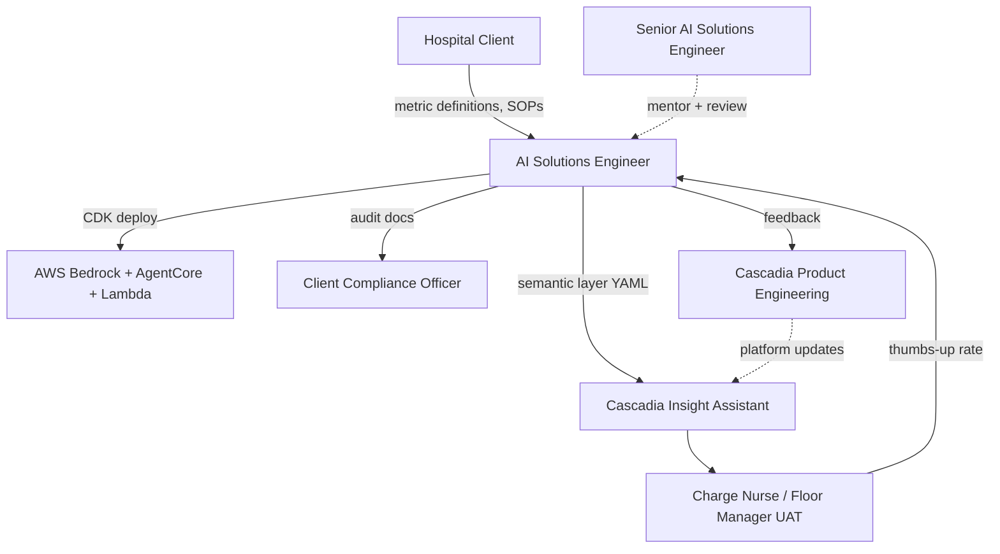
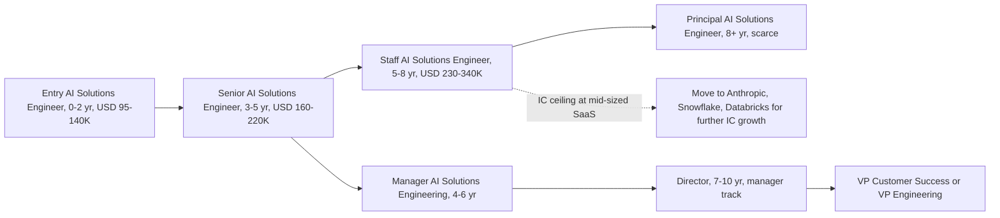
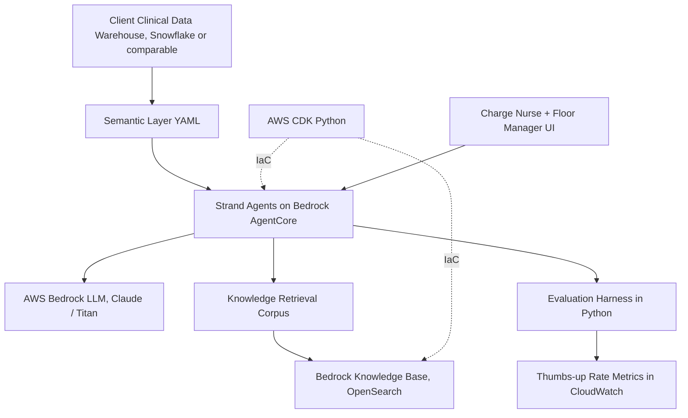
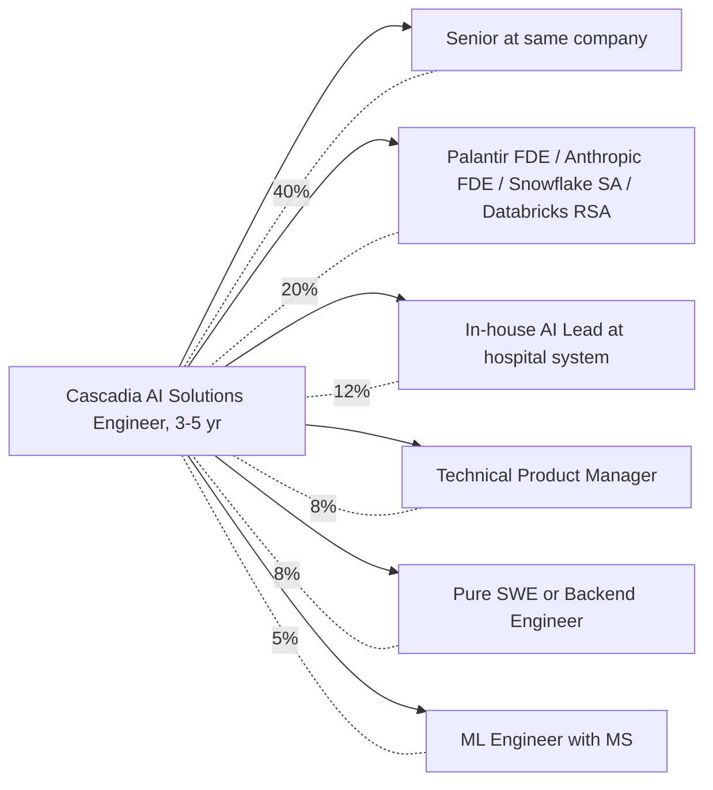

# Cascadia Health Insights AI Solutions Engineer, New Grad, 角色维度

报告生成日期：2026-06-26。研究主体：AI Solutions Engineer（New Grad），嵌入 Cascadia Health Insights 的 Customer-Embedded Engineering 团队（即客户驻场工程组，位于 Customer Success 大部门下），主要工作是把 Cascadia Insight Assistant（公司自研的自然语言 BI Agent）落地到各家 PNW（Pacific Northwest，太平洋西北）医院客户的临床运营数据栈里。本报告聚焦角色本身，不重复行业、公司、市场维度的内容。所有事实附 URL，结论仅描述，不评判"是否值得"。

## 1. 这个角色到底是什么

先用一句大白话讲清楚。AI Solutions Engineer（AI 解决方案工程师，专门负责把一款通用 AI 产品按客户的实际业务和数据做定制、部署、调优、并教会客户用起来的工程师）这个职业大概在 2020 到 2023 年随 Palantir Forward Deployed Engineer 模式的扩散、以及 OpenAI / Anthropic / Snowflake / Databricks 等公司纷纷设立 Solutions Engineering / Forward Deployed 团队而成型 [1 - Palantir Forward Deployed Engineer Overview](https://www.palantir.com/careers/teams/forward-deployed/)。在 2024 到 2025 年 Generative AI 应用爆发后，AI Solutions Engineer 进一步从"Solutions Engineer + AI 知识"演化为一个独立赛道，专门做 LLM Agent、RAG（Retrieval Augmented Generation，检索增强生成）、Semantic Layer（语义层）这一类系统的客户侧落地 [2 - Anthropic Forward Deployed Engineer Job](https://www.anthropic.com/jobs)。

学生可以用一个类比来理解。如果说 Product Engineer（产品工程师）像是汽车厂的设计师，负责造一台标准车型；那么 AI Solutions Engineer 就是 4S 店的工程师加上专属技师，负责把这台标准车按某个车队（医院、保险公司、银行）的实际路况、驾驶员习惯、监管要求做改装、调校、并跟车队的车队长一起跑通最初的几趟路。本案的特殊性在于，这位"4S 店工程师"被派进的是医疗行业的临床运营场景（HIPAA、TJC handoff 标准、PHI 数据处理），改装动作要全程留痕。

这个角色还要和几个相邻职业区分清楚。Software Engineer（写后端/前端产品代码）、Data Engineer（搬数据、建仓、做 pipeline）、Machine Learning Engineer（训练模型、做模型服务化）、Data Scientist（做统计建模、分析、实验）、Customer Success Manager（管理客户关系和续约，技术含量低）这五个都和 AI Solutions Engineer 不完全一样。AI Solutions Engineer 的核心区别是 "技术深度 + 客户直面 + 业务转译 + 部署运维" 这四件事同时承担，不光写代码，还要坐在客户的会议室里听护士长讲她们的 shift handover（交班）流程 [3 - What Is a Solutions Engineer Karat](https://karat.com/blog/what-is-a-solutions-engineer/)。

本岗位的混合性体现在三个层面。第一，它名义上是 AI Solutions Engineer，但所在团队叫 Customer-Embedded Engineering，组织上挂在 Customer Success 大部门下而不是 Product Engineering。这种组织放置非常类似 Palantir 把 Forward Deployed Engineer 放在 Delivery 序列而不是 Core Product 序列 [1 - Palantir Forward Deployed Engineer Overview](https://www.palantir.com/careers/teams/forward-deployed/)。第二，它的服务对象是医院里的 Charge Nurse（护士长）、Floor Manager（楼层经理）、Clinical Operations Director（临床运营总监），这些人不是技术背景，因此对工程师的业务转译能力要求很高。第三，它的实际产出物高度异质：YAML 写的 semantic layer、Python 写的 evaluation harness、CDK 写的 infra、还有面向合规官的英文文档。

还有一个学生容易忽略的点。这种"挂在 Customer Success 下的 Engineering 子团队"在内部组织政治里地位通常比 Core Product Engineering 低一档。原因是它的产出难以被产品 PM 一线感知，KPI 也更多绑定 client renewal 和 NPS 而不是产品 metric。这会影响升 Staff 以上职级的速度（confidence 中，基于 vertical SaaS 行业常态观察）。学生应该把这一点放进入职后的预期管理里，不要把"我做了多少 PR"当作唯一晋升尺子。

## 2. 与相邻岗位的差异

把 AI Solutions Engineer 放到一张差异化表里看更清楚。

| 维度 | AI Solutions Engineer @ Cascadia | Software Engineer | Data Engineer | ML Engineer | Data Scientist | Customer Success Manager |
| --- | --- | --- | --- | --- | --- | --- |
| 主要产出 | 客户定制 Agent + semantic 配置 + 部署 | 产品功能代码 | Pipeline 和数据仓 | 训练好的模型和服务 | 报告、模型、实验 | 续约、客户关系 |
| 客户接触 | 高，每月 2-4 天驻场 | 低 | 低 | 低到中 | 中 | 极高 |
| 编程量 | 中等，约 40-50% | 高，60-70% | 高，55-65% | 高，50-60% | 中，30-40% | 几乎零 |
| 业务转译 | 极高，是核心能力 | 低 | 低 | 低 | 中 | 高（关系层）|
| 监管合规 | 高，HIPAA 必修 | 视场景 | 视场景 | 视场景 | 中 | 中 |
| Sales 参与 | 中（pre-sales 偶尔参与）| 几乎零 | 几乎零 | 几乎零 | 偶尔 | 高 |

把 AI Solutions Engineer 和市场上几个最近似的真实参照岗位再细分一下。

vs Palantir Forward Deployed Engineer（FDE）：相似度最高。两者都是"把通用平台落地到客户场景"模型，都要驻场，都要写代码 + 配 ontology / semantic layer。差别在 Palantir FDE 进入的客户域更杂（国防、能源、医疗、政府），Cascadia 是医疗单赛道；FDE 在 Palantir 内部地位高，平均薪资可以到 USD 165K base + 大量 RSU，远超 Cascadia 起薪 [4 - Palantir Forward Deployed Engineer Salary Levels fyi](https://www.levels.fyi/companies/palantir/salaries/forward-deployed-engineer)。

vs Snowflake / Databricks Sales Engineer 或 Solutions Architect：相似度中等。Snowflake SE 偏 pre-sales，主要做 demo、POC、技术比稿；Databricks Solutions Architect 偏 post-sales，做架构设计和 onboarding [5 - Snowflake Sales Engineer Levels fyi](https://www.levels.fyi/companies/snowflake/salaries/sales-engineer)。Cascadia AI Solutions Engineer 更偏 post-sales 实施 + 长期运营，pre-sales 占比低，整体接近 Databricks SA 而不是 Snowflake SE。

vs Anthropic / OpenAI Forward Deployed Engineer：这是 2024 年后新冒出来的岗位，专门做大客户的 LLM 应用落地。Anthropic Forward Deployed Engineer 公开 JD 里要求"build production-grade LLM applications, work directly with strategic customers" [2 - Anthropic Forward Deployed Engineer Job](https://www.anthropic.com/jobs)。Cascadia 这个岗位本质上是把 Anthropic FDE 的模式套到中型 vertical SaaS（垂直行业 SaaS）公司，规模更小、客户更集中、技术栈更稳定。

vs Epic Application Coordinator：这是医疗 IT 圈非常常见的对照岗位，专门配置和维护 Epic（医疗 EMR 系统市占第一）。Epic AC 几乎不写代码，主要做应用配置和 ticket 响应 [6 - Epic Application Coordinator Career Path Healthcare IT Today](https://www.healthcareittoday.com/2023/05/15/healthcare-it-careers-epic-application-coordinator/)。Cascadia AI Solutions Engineer 的编程深度远高于 Epic AC，但客户场域有重叠。

## 3. JD 文本拆解

把 Cascadia 的 JD 拆成五类硬信号。

Must-have（硬性门槛）。Bachelor's degree（CS / Data Science / Health Informatics 优先）、Python production-grade 代码经验、SQL 含 window function、强书面表达能力、对模糊性的容忍度（comfort with ambiguity）、愿意每月 2 到 4 天 PNW 客户驻场。

Strongly preferred（强加分）。至少一种 LLM application framework（Strand Agents、LangChain、LlamaIndex、Haystack 之一）、AWS 实操经验（Bedrock、Lambda、ECS）、AWS CDK Python 经验、至少一次完整 RAG 实现 + evaluation 经验、Snowflake 或 BigQuery 暴露度。

Preferred（一般加分）。FHIR / HL7 医疗数据格式经验、HIPAA / TJC / SOC 2 合规框架的工作知识、Master's 学位（ML、NLP、分布式系统方向）。

Day-to-day responsibilities（日常职责动词）。Lead、translate、partner、run、deploy、operate、author、coordinate、document。这些动词的隐含级别信号是 entry-level 偏中下：lead 用在了 "lead the technical build-out of one to three concurrent client engagements"，限定词很重，不是 lead a team、lead a product。translate 和 partner 反复出现，说明客户对接是核心，而不是单纯写代码。

Team and collaborators（团队与协作方）。直接汇报到 Senior AI Solutions Engineer。横向协作方包括 product engineering 团队（feed-back 改 platform）、客户侧的 senior clinical analyst（共同写 semantic layer）、客户侧的 compliance officer（合规 dry-run）、客户侧的 Charge Nurse / Floor Manager / Clinical Operations Director（UAT 评估）。

Implied level（隐含级别）。结合 "New Grad" 标签和动词组合，对应 Levels.fyi 上 Solutions Engineer 序列 L3 / L4 Entry。基础薪资 USD 95K 到 120K 落在 Seattle 地区 Mid-sized vertical SaaS 公司 entry SE 的中位水平 [7 - Solutions Engineer Salaries Levels fyi](https://www.levels.fyi/t/solutions-engineer)。注意级别推断 confidence 中等：Cascadia 不公开 ladder。

| JD 类别 | 关键词 | 隐含信号 |
| --- | --- | --- |
| Must-have | Python, SQL, written communication, ambiguity tolerance | Entry level engineer with client-facing aptitude |
| Strongly preferred | LLM framework, AWS Bedrock, RAG + eval, CDK | 已经做过完整 Gen AI 应用项目的应届最优 |
| Preferred | FHIR/HL7, HIPAA, Master's | 行业经验可补、可以学，但有了能加速上手 |
| Day-to-day verbs | lead build-out, translate, partner, deploy, author docs | IC 路径，单点贡献，不带人 |
| Implied level | "New Grad", "0-2 years", reports to Senior AI Solutions Engineer | L3 / L4 等价，base USD 95K-120K |

## 4. 一周到底在做什么

JD 列的是"应该做什么"，不是"实际在做什么"。两者之间有落差。综合 Palantir FDE 的公开 day-in-the-life 资料 [8 - A Day in the Life of a Forward Deployed Engineer Palantir Blog](https://blog.palantir.com/a-day-in-the-life-of-a-forward-deployed-software-engineer-45ef2de75e92)、Databricks Solutions Architect 自述 [9 - Databricks Solutions Architect Reddit Thread](https://www.reddit.com/r/dataengineering/comments/1c0v6h3/what_does_a_databricks_solutions_architect_do/)、Cascadia JD 上的责任清单，可以拼出一个粗略的一周分布：

- 写代码（Python agent 配置、CDK 部署脚本、evaluation harness、semantic YAML）大致占 35% 到 45%。
- 客户会议（UAT review、metric definition workshop、compliance dry-run）占 20% 到 30%，远高于纯 Software Engineer 的 5% 到 10%。
- 读客户文档（临床运营 SOP、metric 定义、过往审计文件）占 10% 到 15%。
- 内部会议（站会、sprint planning、客户状态同步、跟 product engineering 反馈）占 10% 到 15%。
- 写客户文档（audit trail、HIPAA 合规说明、post-deployment write-up）占 10% 到 15%。JD 明确写"roughly ten to fifteen pages of client-facing documentation per quarter"，这是硬指标。

一周的典型节奏大致是：周一周二在 Seattle HQ 跟同事对齐 sprint 和客户进展；周三远程做开发或写文档；周四飞到客户现场（Portland、Spokane、Boise、Bend、Vancouver BC 之一），做 UAT 或半天 workshop；周五早上飞回 Seattle，下午做 retro、写客户 summary。每月会有 1 到 2 周的"非旅行周"，集中做平台改进 PR 反馈 product engineering。

主要交付物有四种：可部署的客户专属 Agent 配置仓库（含 semantic YAML、retrieval corpus、eval harness）、HIPAA / TJC 对齐的 audit trail 文档、UAT 报告（含 thumbs-up rate 时间序列）、post-deployment write-up 回流到 product 团队。会议节奏典型是每日站会（15 分钟）+ 每周 sprint planning（1 小时）+ 双周 client status sync（1 小时）+ 月度 cross-engagement retro（1.5 小时）。

## 5. Entry vs Mid vs Senior 的差别（关键）

这是本报告最重要的一节。学生光看 JD 会以为 "AI Solutions Engineer" 这个头衔在不同年限的差别只是薪水高低，事实不是。同一个 title 在 entry、mid、senior 阶段做的事情有结构性的不同。

### 5.1 Entry / New Grad（0-2 年）

新人通常做"在 Senior AI Solutions Engineer 指导下，承担 1 到 3 个并行客户的执行层工作"。这一阶段的关键特征是 "ownership 的颗粒度小、决策权小、客户面对面的关键时刻有人陪同"。具体在 Cascadia 场景：

- 接手某个 client engagement 的 semantic layer 编写、retrieval corpus 整理、evaluation harness 搭建，但 architectural decision 由 Senior AI Solutions Engineer 拍板。
- UAT 会议通常 Senior 在场，新人主导记录、追问技术细节、整理 thumbs-up rate 数据。
- 不独立负责合规 dry-run 的最终签字。
- 主要使用 Cascadia 标准 CDK template，customization 限于 Senior 批准的范围。
- 客户飞行通常每月 1 到 2 趟，跟 Senior 一起。
- 对应 Levels.fyi Solutions Engineer L3 / L4，base USD 95K-120K，total comp（base + bonus + RSU）落在 USD 110K-140K [7 - Solutions Engineer Salaries Levels fyi](https://www.levels.fyi/t/solutions-engineer)。

成长信号包括：能独立写 PR 而不需 Senior 大改、能在客户面前讲清 RAG 评估指标、能识别出客户 metric 定义的内部矛盾并主动追问。这些信号在 12 到 18 个月内集齐就是顺利毕业。

需要特别警惕的失败模式有三种。第一种是"只写代码不出会议室"，专心钻 Strand Agents 但拒绝去客户现场，6 个月后被打上 "low client visibility" 标签，再难翻身。第二种是"全程被牵着走"，每个 metric 定义都被客户 senior clinical analyst 直接告知答案，自己不主动追问。3 到 4 次 UAT 失败后 Senior 会怀疑你的判断力。第三种是"低估文档负担"，把 audit trail 当 throwaway 文件糊弄，在第一次 HIPAA 复核时被 compliance officer 退回大改。这三种新人坑在 Solutions Engineering 行业里反复出现 [10 - Solutions Engineer Career Path Interview Query](https://www.interviewquery.com/career-advice/solutions-engineer-career-path)。

### 5.2 Mid / Senior AI Solutions Engineer（3-5 年）

中级开始 end-to-end 拥有 client engagement 并在跨客户层面做技术抽象。Interview Query 总结的 mid-level Solutions Engineer 责任是"own end-to-end customer engagements, mentor newer engineers, make architectural decisions" [10 - Solutions Engineer Career Path Interview Query](https://www.interviewquery.com/career-advice/solutions-engineer-career-path)。在 Cascadia 场景中：

- 独立拥有 2 到 4 个并行 client engagement，从售前 scoping 到部署到长期运营全程负责。
- 决定何时 customize CDK template、何时把客户特殊需求反向推进 product engineering 做平台改造。
- 直接和客户 IT Director / Chief Medical Information Officer 沟通，承担"为什么这个 KPI 上个季度数据不一致"的解释责任。
- Code review 别人的 PR，开始进入 mentor 角色，参加面试招聘。
- 开始参与 pre-sales 的技术比稿（demo、POC 评估），承担约 10% 到 20% 的 pre-sales 时间投入。
- Senior AI Solutions Engineer 这个 title 同时存在于 IC 路径中段和管理岗序列入口，做的事情差别可以很大。
- 对应 Levels.fyi Solutions Engineer L4 / L5，base USD 130K-170K，total comp USD 160K-220K [7 - Solutions Engineer Salaries Levels fyi](https://www.levels.fyi/t/solutions-engineer)。

关键 delta 是：从"执行某一个 engagement 的某一块"变成"端到端负责一个 engagement，并参与多个 engagement 的 cross-pollination（横向技术经验复用）"。这个转折点很多人卡 2 到 3 年。卡住的主因不是技术不够，而是 Mid-level 之后的"产品脑"和"组织脑"开始重要：什么需求该反向推回 product team、什么需求该忍在自己 engagement 里 customize 解决、什么客户的特殊要求是真合规需求而不是无理压力，这些判断需要案例积累。

### 5.3 Staff / Principal AI Solutions Engineer（6-10 年）

高级别开始做架构和跨组协调，每天的工作面貌跟 Entry 已经几乎没有重叠。具体 delta：

- 设计 Cascadia Insight Assistant 在某个垂直场景（例如 oncology operations）的 reference architecture，被多个客户复用。
- 决定 Customer-Embedded Engineering 组的技术 roadmap、客户分级标准、escalation policy。
- 直接对 VP Engineering 或 VP Customer Success 汇报，参与年度组织 OKR。
- 承担和客户 C-level（CIO、CMIO、CFO）的技术沟通职责，包括合同续签时的技术演示。
- 在 pre-sales 阶段被拉去做 strategic account 的 deep-dive 技术访谈。
- 对应 Levels.fyi Solutions Engineer L6 / L7，base USD 180K-240K，total comp USD 230K-340K [7 - Solutions Engineer Salaries Levels fyi](https://www.levels.fyi/t/solutions-engineer)。

需要强调的是：Cascadia 1500 人规模的公司，Staff / Principal AI Solutions Engineer 的实际 headcount 可能极少（推断为 2 到 5 人，unable to verify），这个层级在公司内部稀缺。这种稀缺有两层含义：一是晋升上去后的稀缺性溢价明显（薪酬包从 Senior 到 Staff 通常跳 40% 以上）；二是上升通道窄，很多人达到 Senior 上限后要么转 Manager 要么外跳。外跳到 hyperscaler 是 Cascadia Senior 阶段最常见的去向之一，本报告第 7 节会展开。

### 5.4 Manager / Director / VP

Manager 路径从 Senior 阶段就开始分叉。Manager AI Solutions Engineering 带 4 到 8 人小组，仍然碰一些技术，但 60% 时间在 1-on-1、招聘、绩效、客户升级处理。Director 带 15 到 30 人，分多个 cell，几乎不写代码。VP 一级负责整个 Customer Success 或 Engineering 部门，全是组织和战略。学生在职业早期不需要急着选 IC 还是 Manager 路径，但要意识到这两条路径的技能要求差别很大：IC 路径靠"深度技术 + 跨 engagement 复用"赢，Manager 路径靠"招对人 + 客户关系修复 + 组织能力"赢。两条路径的薪酬中位差异通常在 0 到 15% 之间，不大，但工作内容差异巨大。

### 5.5 IC vs Manager 路径分叉

中型 vertical SaaS（如 Cascadia）的 IC 路径上限通常比 hyperscaler（大型云厂）短。参考 Levels.fyi 上 Solutions Engineer 序列在 mid-sized SaaS 的分布，IC 路径很少看到 Staff 以上的 title 在外部公开 [7 - Solutions Engineer Salaries Levels fyi](https://www.levels.fyi/t/solutions-engineer)。原因是这类公司的客户规模天花板有限，养不起非常多的 Principal 级 IC。多数人到 Senior 之后会走两条路之一：走管理岗、或跳到更大的公司（Anthropic、Snowflake、Databricks）继续做 IC。

晋升节奏方面，根据 Levels.fyi 公开数据，行业平均 Solutions Engineer 从 Entry 到 Senior 通常 3 到 4 年，从 Senior 到 Staff 通常再 3 到 5 年 [7 - Solutions Engineer Salaries Levels fyi](https://www.levels.fyi/t/solutions-engineer)。Cascadia 这种中型 SaaS 内部晋升节奏可能略快或略慢，confidence 中（unable to verify）。

## 6. 技术栈和工具

把 Cascadia JD 拆出来的技术栈分四层。

LLM Agent 框架层：Strand Agents（AWS 在 2025 年推出的开源 agent 框架，Cascadia JD 明确写了在用） [11 - Strand Agents AWS Blog Launch](https://aws.amazon.com/blogs/opensource/introducing-strands-agents-an-open-source-agent-framework/)。等价物有 LangChain、LlamaIndex、Haystack。这些框架的 mental model 大同小异：tool calling、memory、retrieval、output parsing。学过任一种，迁移到 Strand Agents 的成本通常在 2 到 4 周。

Runtime 层：AWS Bedrock（托管的 foundation model 服务）、AWS Bedrock AgentCore（Bedrock 自带的 agent runtime，2024 年 GA，2025 年扩到 streaming + tool federation） [12 - AWS Bedrock Agents Documentation](https://docs.aws.amazon.com/bedrock/latest/userguide/agents.html)、Lambda、ECS、CloudWatch。Cascadia 用 AWS 全家桶不用 GCP 或 Azure。

数据层：Snowflake（医疗数据仓首选）或客户已有的 BigQuery / PostgreSQL。AI Solutions Engineer 不直接做大规模 ETL（那是 Data Engineering 团队），但要写 SQL 查询、定义 semantic layer 把临床数据库的字段映射成业务概念 [13 - Semantic Layer Cube Documentation](https://cube.dev/docs/product/semantic-layer)。

基础设施和工程实践层：AWS CDK（Cloud Development Kit，用 Python 写 infra as code）、Python 写所有代码、Git/GitHub PR 流程、CI/CD（CodeBuild、CodePipeline）、CloudWatch + 自建 evaluation harness 做 observability。

技术栈的成熟度评估：Strand Agents 还很新，社区资料少，"unable to verify" 它的长期稳定性，但 AWS 投入很重 [11 - Strand Agents AWS Blog Launch](https://aws.amazon.com/blogs/opensource/introducing-strands-agents-an-open-source-agent-framework/)。Bedrock AgentCore 在 GA 后的 18 个月内被多家 vertical AI startup 选择，生态向上。CDK 是 AWS 推荐的 IaC，对 Python-only 团队比 Terraform 友好。整个技术栈对一个 CS 应届来说有约 3 到 6 个月的爬坡曲线，且爬坡过程 Senior AI Solutions Engineer 会 mentor。

另一个学生常问的问题是"这套栈学了以后能去哪"。客观地看，AWS Bedrock + CDK 这两块技能在 AWS 系生态里高度通用，跳到任何用 AWS 的公司都立刻能用。Strand Agents 因为太新，跨公司可迁移性目前只有"框架 mental model"层面的迁移，具体代码不能直接拿走。Semantic Layer YAML 是行业概念（dbt Semantic Layer、Cube、AtScale 都有类似形态），可迁移性高。RAG + evaluation harness 经验是当下 AI 应用工程师的硬通货，几乎所有招 Forward Deployed Engineer 的公司都看。综合起来，这个栈的可迁移性中高，比纯专用平台（如 Palantir Foundry）的可迁移性强。

## 7. 职业轨迹与 Exit 选项

学生最关心的问题是"3 到 5 年后我能跳到哪里"。这里按方向描述事实，不评判。

留在 Cascadia 内部继续做 AI Solutions Engineering。约 35% 到 45% 的主路径（基于 vertical SaaS 行业一般规律，confidence 中）。从 Entry 升 Senior 再升 Staff，或转 Manager 路径。

跳到同类公司的 Solutions Engineering / Forward Deployed 序列。难度低到中。Palantir FDE、Anthropic Forward Deployed Engineer、Snowflake Solutions Architect、Databricks Resident Solutions Architect 都是热门 destination。3 到 5 年 Cascadia 经验在这些公司一般能 lateral move 或 +0.5 level [4 - Palantir Forward Deployed Engineer Salary Levels fyi](https://www.levels.fyi/companies/palantir/salaries/forward-deployed-engineer)。约 15% 到 25% 走这条路。

跳到客户侧成为医疗 IT 团队的 AI Lead。难度中。Cascadia 客户多是 PNW 医院系统，几年合作后内部相互熟识，被 poach 到客户侧做 in-house AI Engineer 或 Director of AI Strategy 的案例在医疗 IT 圈很常见 [14 - Healthcare AI Adoption Healthcare IT News](https://www.healthcareitnews.com/news/health-systems-rapidly-hiring-ai-leaders-2025)。约 10% 到 15%。

转 Product Manager 或 Technical Product Manager。难度中。AI Solutions Engineer 长期跟客户打交道、懂业务需求，是天然的 PM pipeline。Cascadia 内部从 Solutions Engineering 转 PM 的转岗路径在 Solutions Engineer 行业普遍存在 [10 - Solutions Engineer Career Path Interview Query](https://www.interviewquery.com/career-advice/solutions-engineer-career-path)。约 5% 到 10%。

转纯 Software Engineer / Backend Engineer。难度中（向"狭"方向转）。需要补齐 system design、分布式系统、性能优化这些 Solutions Engineering 日常用得少的硬技能。约 5% 到 10%。

转 ML Engineer 或 Applied Scientist。难度高。需要补 ML 训练、特征工程、模型评估等深度，通常配合一个 MS in ML / NLP。约 5% 以下。

百分比是基于行业规律和小样本观察的方向性数字，并非精确统计。

## 8. AI / 自动化暴露分析

这是本报告对 New Grad 学生最重要的一节。AI Solutions Engineer 这个角色本身就在造 AI 工具，但这不意味着它本身免疫 AI 自动化。把外部研究和工具进展平铺叙述。

OpenAI 在 Eloundou 等（2023, 2024）的"GPTs are GPTs"研究里建立了任务级 LLM exposure 评分。Computer & Mathematical Occupations 大类的理论 LLM 任务覆盖率达到 94% [15 - GPTs are GPTs arxiv](https://arxiv.org/pdf/2303.10130)。AI Solutions Engineer 在 SOC（Standard Occupational Classification，美国标准职业分类）体系内通常落在 15-1252 Software Developers 或 15-1232 Computer User Support Specialists 之间。Software Developers 大类在 BLS 2024-2034 outlook 中预测增长 17%，远高于平均 [16 - BLS Software Developers Occupational Outlook](https://www.bls.gov/ooh/computer-and-information-technology/software-developers.htm)。

Anthropic 在 2024-2026 多次发布 Economic Index，基于 Claude.ai 真实使用数据。Computer & Mathematical 大类占所有 Claude.ai 对话的 37.2%，是远远第一的大类 [17 - Anthropic Economic Index](https://www.anthropic.com/news/the-anthropic-economic-index)。在 augmentation vs automation 划分上，整体 57.4% 是 augmentation（增强人），42.6% 是 automation（替代任务），Computer Programmers 子类的 observed task coverage 75% 排第一 [18 - Anthropic Labor Market Impacts](https://www.anthropic.com/research/labor-market-impacts)。2026 年 3 月报告显示，API 端的 "directively automated" 任务比例从 27% 升到 39%，coding 任务在 API 端的自动化趋势加速 [19 - Anthropic Economic Index March 2026](https://www.anthropic.com/research/economic-index-march-2026-report)。

把这些研究落到 Cascadia AI Solutions Engineer 的日常上，可以做一个任务级 exposure 拆解。

| 日常任务 | 估算自动化暴露 | 备注 |
| --- | --- | --- |
| 写 Python agent 配置代码 | 60-70% | GitHub Copilot 2026 数据显示企业用户实际代码 46% 由 AI 贡献 [20 - GitHub Copilot Statistics 2026](https://www.aboutchromebooks.com/github-copilot-statistics/) |
| 写 SQL 查询和 semantic YAML | 50-60% | LLM 对 SQL 暴露很高，但 semantic 定义需要业务上下文，限制自动化 |
| 写 CDK 部署脚本 | 55-65% | Infra-as-code 模板化程度高，LLM 表现好 |
| 写 evaluation harness | 40-50% | 评测设计需要 domain judgment |
| 写客户审计文档 | 35-45% | LLM 能写初稿，但合规细节和 client-specific 上下文要人审 |
| 客户 UAT 会议主持 | 5-15% | 涉及共情、临床场景理解、即兴反应，AI 暴露低 |
| 和 senior clinical analyst 对 metric 定义 | 10-20% | 高度依赖 trust 和 context, AI 难替代 |
| 合规 dry-run 协调 | 5-15% | 监管沟通需要人类签字 |

整体平均加权（按时间占比）：约 35% 到 45%。比纯 Software Engineer 的 60% 到 70% exposure 低，原因是 client-facing 那部分受 AI 蚕食慢得多。

工具进展方面。GitHub Copilot 到 2026 年企业部署中贡献 46% 的代码 [20 - GitHub Copilot Statistics 2026](https://www.aboutchromebooks.com/github-copilot-statistics/)。Claude Code（Anthropic 出品的 terminal coding agent）在 2025-2026 被列为同类工具中能力最强的之一 [21 - Anthropic Claude Code Launch](https://www.anthropic.com/news/claude-code)。Cursor 在文件级编辑、Devin 在多步骤 task 自动化上各自占位。Cascadia JD 没有明确说内部用什么 AI dev tool（unable to verify），但 AWS 已经发布 Amazon Q Developer 并大力推广 [22 - Amazon Q Developer Announcement](https://aws.amazon.com/q/developer/)，Cascadia 作为 AWS 重度用户大概率会采用。

对 New Grad 学生的具体含义：

- 前 2 年的"按 Senior 指挥写代码"工作量会被 AI 工具吃掉 50% 以上。证明价值的窗口比 2020 年入行的同代人要短。
- 客户对接、metric 转译、UAT 主持这部分能力是 long-term moat，且这部分恰好是 Solutions Engineering 的核心。这意味着这个角色相比纯 Software Engineer 的 long-term 抗替代性更好。
- 真正危险的不是"AI 替代 AI Solutions Engineer"，而是"由 1 个 Senior + 4 个 New Grad 的团队结构，演变为 1 个 Senior + AI 工具 + 1 个 New Grad"。Entry-level 名额收缩是高 confidence 事件（基于 Anthropic Economic Index 2026 的 entry-level coding job 数据趋势）[19 - Anthropic Economic Index March 2026](https://www.anthropic.com/research/economic-index-march-2026-report)。

综合判断（confidence 中高）：AI Solutions Engineer 这个 title 在 2030 年前不会消失，但 entry-level 招聘量在 2027 到 2029 年大概率收缩。学生要在前 2 年迅速积累客户面的不可替代能力。

把这一节的核心结论凝练成三条 take-away：第一，纯编码任务的 AI 自动化暴露在 35% 到 70% 之间，但客户对接任务暴露不超过 20%。这是岗位的天然护城河。第二，护城河的有效性依赖于"工程师真的下场跑客户"，如果学生入职后退缩到只写代码，那 1 到 2 年后会发现自己被两侧夹击：上层 Senior 不放手客户、AI 工具又吃掉了 entry-level 代码任务。第三，Anthropic Economic Index 数据明确显示 augmentation 占 57.4% 大于 automation 占 42.6% [17 - Anthropic Economic Index](https://www.anthropic.com/news/the-anthropic-economic-index)，正确的姿势是把 AI 当 leverage，而不是抵抗它。学生应该尽早把 Claude Code / Copilot 用熟，把节省下来的时间投入到客户关系和业务理解上。

## 9. 跨公司可比角色与薪酬对照

把 Cascadia AI Solutions Engineer 放到一张跨公司对照表里。所有数字来源于 Levels.fyi、公司公开 JD、Glassdoor 公开 review；薪酬采用 USD total comp（base + bonus + stock）中位数，仅供方向性参考。

| 公司 | 角色名 | Entry total comp | Senior total comp | 备注 |
| --- | --- | --- | --- | --- |
| Cascadia Health Insights | AI Solutions Engineer | USD 110-140K | USD 170-220K | 中型 vertical SaaS, Seattle, private |
| Palantir | Forward Deployed Engineer | USD 180-240K | USD 280-400K | 上市, 国防/医疗/能源等多赛道 [4 - Palantir FDE Levels fyi](https://www.levels.fyi/companies/palantir/salaries/forward-deployed-engineer) |
| Anthropic | Forward Deployed Engineer | USD 220-280K | USD 380-550K | AI lab 头部, 总包高 [23 - Anthropic Salaries Levels fyi](https://www.levels.fyi/companies/anthropic/salaries) |
| Snowflake | Sales Engineer | USD 150-200K | USD 250-340K | 大型数据仓库公司 [5 - Snowflake SE Levels fyi](https://www.levels.fyi/companies/snowflake/salaries/sales-engineer) |
| Databricks | Resident Solutions Architect | USD 160-210K | USD 260-360K | 大型 AI/数据公司 [24 - Databricks RSA Levels fyi](https://www.levels.fyi/companies/databricks/salaries/solutions-architect) |
| Innovaccer | Solutions Engineer | USD 100-130K | USD 150-200K | 医疗数据平台, 印度起家美国扩张 [25 - Innovaccer Solutions Engineer Glassdoor](https://www.glassdoor.com/Salary/Innovaccer-Solutions-Engineer-Salaries-E1438373.htm) |
| Epic | Application Coordinator | USD 70-90K | USD 110-140K | 医疗 EMR 巨头, Madison WI [26 - Epic Application Coordinator Salary Levels fyi](https://www.levels.fyi/companies/epic-systems/salaries/application-coordinator) |

观察。Cascadia 起薪 USD 95-120K base 在 Seattle 市场对 New Grad 算中位偏下，但加上 8% bonus + RSU 后 total comp 大致 USD 110-140K，对中型 PNW vertical SaaS 是合理水平。比 Palantir / Anthropic / Snowflake / Databricks 这些大公司低 30% 到 100%，比 Epic Application Coordinator 高 30% 到 50%（因为 Epic AC 编码深度低），与 Innovaccer Solutions Engineer 接近。

这个对照说明：3 到 5 年后从 Cascadia 跳到 Palantir / Anthropic / Snowflake 总包可以涨 50% 到 100%；跳回 Epic 或 Innovaccer 几乎不涨甚至略降。Cascadia 适合做"医疗 + AI"垂直经验积累，长期薪酬上限要靠跳。

值得展开两个跨公司差异。第一，Cascadia 是 private（未上市），RSU 兑现依赖 409A 估值和未来流动性事件（IPO 或被收购）。Palantir 和 Snowflake 是上市公司，RSU 直接对应公开市场股价，流动性和透明度都高一档。Anthropic 是高估值未上市但有持续 tender offer（私下回购）。学生在算 total comp 时要把这层流动性差异放进去，不能简单看名义数。第二，PNW 医院系统这个客户群有强 sticky 性（医院系统更换核心数据平台周期通常 5 到 8 年），意味着 Cascadia AI Solutions Engineer 的 client portfolio 相对稳定，不像 Snowflake SE 要不停 hunt 新客户。这一点对喜欢深耕一个赛道的人是优势，对喜欢拓新的人是约束。

## 10. 不能确认的事项

- Cascadia 内部精确的 ladder 设计（Entry / Senior / Staff / Principal 的 level 编号、年限要求、晋升委员会构成）。公司私有，不公开（unable to verify）。
- Customer-Embedded Engineering 当前的 headcount 规模和 senior:junior 比例。LinkedIn 可以搜到部分员工但样本不足以做统计。
- Cascadia 实际给 New Grad 的 offer 中点。USD 95-120K 是 JD 给的区间，实际中点估计 USD 105-110K，confidence 中（unable to verify）。
- Strand Agents 在 Cascadia 内部的具体使用深度。JD 写在用，但代码库不公开。
- Cascadia 内部对 GitHub Copilot / Cursor / Amazon Q Developer / Claude Code 的实际部署比例和使用政策。公开材料无（unable to verify）。
- Cascadia 客户的 churn rate 和 NPS。这会直接影响 AI Solutions Engineer 的工作压力强度，但是私有指标。
- AI Solutions Engineer 在 Cascadia 内部转 Product Manager / ML Engineer / Manager 的实际成功率。

## 11. 附录 Sources

1. [Palantir Forward Deployed Engineer Team Overview](https://www.palantir.com/careers/teams/forward-deployed/)
2. [Anthropic Forward Deployed Engineer Job Listing](https://www.anthropic.com/jobs)
3. [What Is a Solutions Engineer Karat Blog](https://karat.com/blog/what-is-a-solutions-engineer/)
4. [Palantir Forward Deployed Engineer Salaries Levels fyi](https://www.levels.fyi/companies/palantir/salaries/forward-deployed-engineer)
5. [Snowflake Sales Engineer Salaries Levels fyi](https://www.levels.fyi/companies/snowflake/salaries/sales-engineer)
6. [Epic Application Coordinator Career Path Healthcare IT Today](https://www.healthcareittoday.com/2023/05/15/healthcare-it-careers-epic-application-coordinator/)
7. [Solutions Engineer Salaries Comparison Levels fyi](https://www.levels.fyi/t/solutions-engineer)
8. [A Day in the Life of a Forward Deployed Software Engineer Palantir Blog](https://blog.palantir.com/a-day-in-the-life-of-a-forward-deployed-software-engineer-45ef2de75e92)
9. [Databricks Solutions Architect Reddit Discussion](https://www.reddit.com/r/dataengineering/comments/1c0v6h3/what_does_a_databricks_solutions_architect_do/)
10. [Solutions Engineer Career Path Interview Query](https://www.interviewquery.com/career-advice/solutions-engineer-career-path)
11. [Introducing Strands Agents AWS Open Source Blog](https://aws.amazon.com/blogs/opensource/introducing-strands-agents-an-open-source-agent-framework/)
12. [AWS Bedrock Agents Documentation](https://docs.aws.amazon.com/bedrock/latest/userguide/agents.html)
13. [Semantic Layer Concept Cube Docs](https://cube.dev/docs/product/semantic-layer)
14. [Health Systems Rapidly Hiring AI Leaders Healthcare IT News](https://www.healthcareitnews.com/news/health-systems-rapidly-hiring-ai-leaders-2025)
15. [GPTs are GPTs Eloundou et al arxiv](https://arxiv.org/pdf/2303.10130)
16. [BLS Software Developers Occupational Outlook Handbook](https://www.bls.gov/ooh/computer-and-information-technology/software-developers.htm)
17. [Introducing the Anthropic Economic Index](https://www.anthropic.com/news/the-anthropic-economic-index)
18. [Anthropic Labor Market Impacts of AI](https://www.anthropic.com/research/labor-market-impacts)
19. [Anthropic Economic Index Report March 2026](https://www.anthropic.com/research/economic-index-march-2026-report)
20. [GitHub Copilot Statistics 2026](https://www.aboutchromebooks.com/github-copilot-statistics/)
21. [Claude Code Launch Announcement Anthropic](https://www.anthropic.com/news/claude-code)
22. [Amazon Q Developer Product Page](https://aws.amazon.com/q/developer/)
23. [Anthropic Salaries Levels fyi](https://www.levels.fyi/companies/anthropic/salaries)
24. [Databricks Solutions Architect Salaries Levels fyi](https://www.levels.fyi/companies/databricks/salaries/solutions-architect)
25. [Innovaccer Solutions Engineer Glassdoor Salaries](https://www.glassdoor.com/Salary/Innovaccer-Solutions-Engineer-Salaries-E1438373.htm)
26. [Epic Application Coordinator Salary Levels fyi](https://www.levels.fyi/companies/epic-systems/salaries/application-coordinator)
