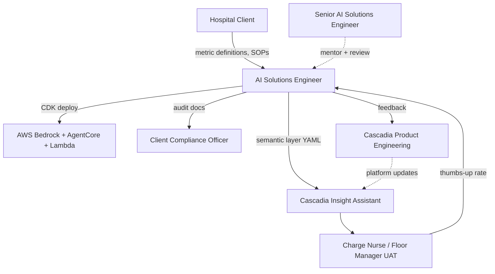
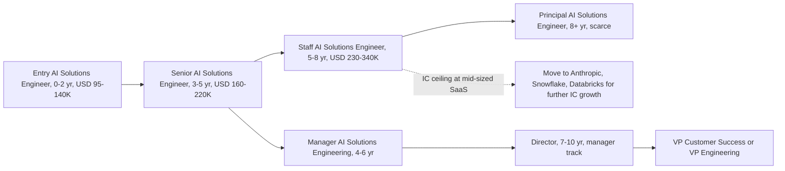
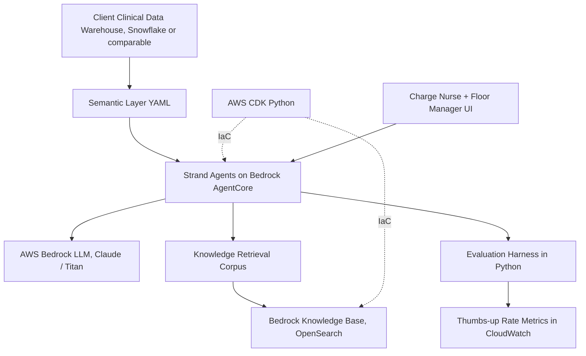
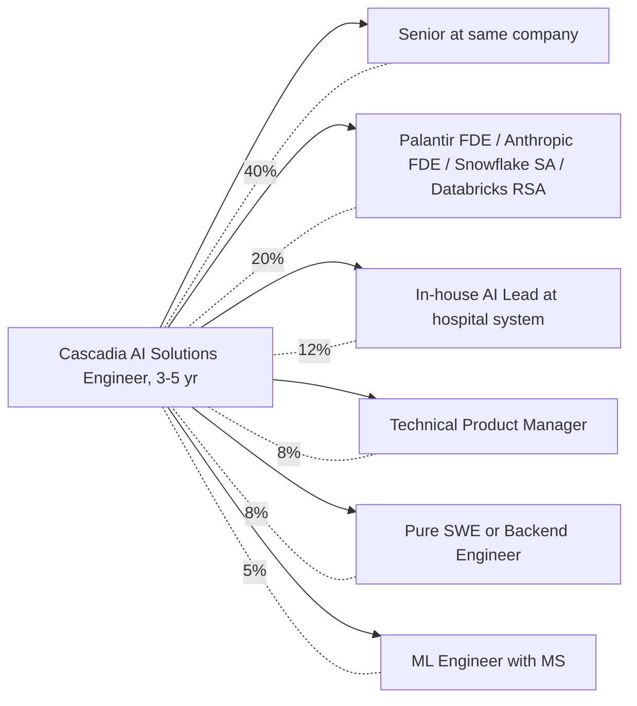

# Cascadia Health Insights AI Solutions Engineer, New Grad, Role Dimension

Report date: 2026-06-26. Subject: AI Solutions Engineer (New Grad) embedded in Cascadia Health Insights' Customer-Embedded Engineering team (a customer-facing engineering group sitting inside the broader Customer Success organization). The primary job is rolling out Cascadia Insight Assistant (the company's in-house natural-language BI agent) into the clinical operations data stacks of hospital clients across the PNW (Pacific Northwest). This report focuses on the role itself and does not repeat content from the industry, company, or market dimensions. Every fact has a URL attached. Conclusions describe, they do not pass judgment on whether the role is "worth it."

## 1. What This Role Actually Is

Start with a plain-language description. An AI Solutions Engineer (an engineer responsible for customizing, deploying, tuning, and onboarding clients onto a general-purpose AI product against the client's real business and data) emerged as a recognizable profession roughly between 2020 and 2023. That happened as the Palantir Forward Deployed Engineer model spread and companies like OpenAI, Anthropic, Snowflake, and Databricks set up their own Solutions Engineering or Forward Deployed teams [1 - Palantir Forward Deployed Engineer Overview](https://www.palantir.com/careers/teams/forward-deployed/). After the Generative AI application boom of 2024 to 2025, AI Solutions Engineer evolved further from "Solutions Engineer plus AI knowledge" into its own track, specifically for client-side rollout of LLM Agent, RAG (Retrieval Augmented Generation), and Semantic Layer systems [2 - Anthropic Forward Deployed Engineer Job](https://www.anthropic.com/jobs).

A useful analogy for students. If a Product Engineer is like the designer at the auto plant who builds the standard model, then an AI Solutions Engineer is the dealership engineer plus the dedicated mechanic who modifies that standard car for a particular fleet (hospital, insurer, bank) based on actual driving conditions, driver habits, and regulatory requirements, then rides along with the fleet manager for the first few runs. What makes this specific role distinctive is that the "dealership engineer" is being sent into a clinical operations setting in healthcare (HIPAA, TJC handoff standards, PHI data handling), and every modification has to be documented end to end.

A few neighboring jobs are worth distinguishing. Software Engineer (writes backend or frontend product code), Data Engineer (moves data, builds warehouses, runs pipelines), Machine Learning Engineer (trains models and ships them as services), Data Scientist (statistical modeling, analysis, experiments), and Customer Success Manager (manages client relationships and renewals, low technical content). None of these are quite the same as an AI Solutions Engineer. The core distinction is that an AI Solutions Engineer carries all four of these at once: technical depth, direct client contact, business translation, and deployment operations. They write code, but they also sit in the client's conference room listening to the charge nurse describe her unit's shift handover process [3 - What Is a Solutions Engineer Karat](https://karat.com/blog/what-is-a-solutions-engineer/).

The hybrid nature of this role shows up at three levels. First, the title is AI Solutions Engineer, but the team is called Customer-Embedded Engineering and sits inside Customer Success rather than Product Engineering. This placement closely mirrors how Palantir puts Forward Deployed Engineers in the Delivery track rather than the Core Product track [1 - Palantir Forward Deployed Engineer Overview](https://www.palantir.com/careers/teams/forward-deployed/). Second, the people being served are Charge Nurses, Floor Managers, and Clinical Operations Directors inside hospitals. None of them are technical, so the bar for business translation is high. Third, the actual deliverables are wildly heterogeneous: semantic layers in YAML, evaluation harnesses in Python, infra in CDK, and English-language documentation for compliance officers.

One more point students often miss. An "Engineering sub-team inside Customer Success" usually sits a notch below Core Product Engineering in internal politics. The reason is that its output is hard for product PMs to feel firsthand, and its KPIs are tied more to client renewal and NPS than to product metrics. That affects how quickly people move past Staff level (medium confidence, based on observations of typical vertical SaaS patterns). Students should fold this into their expectations after joining, and not treat "how many PRs I shipped" as the only yardstick for promotion.

## 2. Differences From Neighboring Roles

Putting AI Solutions Engineer into a differentiation table makes the picture clearer.

| Dimension | AI Solutions Engineer @ Cascadia | Software Engineer | Data Engineer | ML Engineer | Data Scientist | Customer Success Manager |
| --- | --- | --- | --- | --- | --- | --- |
| Primary output | Custom Agent, semantic config, deployment | Product feature code | Pipelines and warehouses | Trained models and services | Reports, models, experiments | Renewals, client relationships |
| Client contact | High, 2 to 4 days on site per month | Low | Low | Low to medium | Medium | Very high |
| Coding share | Moderate, around 40 to 50% | High, 60 to 70% | High, 55 to 65% | High, 50 to 60% | Medium, 30 to 40% | Almost none |
| Business translation | Very high, the core skill | Low | Low | Low | Medium | High (relationship layer) |
| Regulatory compliance | High, HIPAA required | Depends | Depends | Depends | Medium | Medium |
| Sales involvement | Medium (occasional pre-sales) | Almost none | Almost none | Almost none | Occasional | High |

Now compare AI Solutions Engineer to the closest real-world reference roles in the market.

vs Palantir Forward Deployed Engineer (FDE). The closest match. Both follow the "land a general platform inside a client's context" model, both involve travel, both require writing code plus configuring ontology or semantic layer. The differences: Palantir FDEs work across more diverse client verticals (defense, energy, healthcare, government) while Cascadia is healthcare only. FDEs are also high-status inside Palantir, with average base around USD 165K plus heavy RSU, well above Cascadia's starting band [4 - Palantir Forward Deployed Engineer Salary Levels fyi](https://www.levels.fyi/companies/palantir/salaries/forward-deployed-engineer).

vs Snowflake or Databricks Sales Engineer or Solutions Architect. Moderate match. Snowflake SEs lean pre-sales, running demos, POCs, and technical bake-offs. Databricks Solutions Architects lean post-sales, doing architecture design and onboarding [5 - Snowflake Sales Engineer Levels fyi](https://www.levels.fyi/companies/snowflake/salaries/sales-engineer). Cascadia AI Solutions Engineer skews more toward post-sales implementation plus long-term operations, with a small pre-sales share. Closer to Databricks SA than Snowflake SE overall.

vs Anthropic or OpenAI Forward Deployed Engineer. A newer role that appeared after 2024, dedicated to LLM application rollout for large customers. The Anthropic Forward Deployed Engineer JD specifies "build production-grade LLM applications, work directly with strategic customers" [2 - Anthropic Forward Deployed Engineer Job](https://www.anthropic.com/jobs). The Cascadia role essentially ports the Anthropic FDE model into a mid-sized vertical SaaS (industry-specific SaaS) company, with smaller scale, more concentrated customers, and a more stable tech stack.

vs Epic Application Coordinator. A very common comparison role in healthcare IT, dedicated to configuring and maintaining Epic (the top EMR system by market share). Epic ACs write almost no code; they configure applications and respond to tickets [6 - Epic Application Coordinator Career Path Healthcare IT Today](https://www.healthcareittoday.com/2023/05/15/healthcare-it-careers-epic-application-coordinator/). The Cascadia AI Solutions Engineer goes much deeper on coding, but the client field overlaps.

## 3. JD Text Breakdown

Cascadia's JD breaks into five categories of hard signal.

Must-have (hard floor). Bachelor's degree (CS, Data Science, or Health Informatics preferred), Python production-grade coding experience, SQL including window functions, strong written communication, comfort with ambiguity, and willingness to spend 2 to 4 days per month on site with PNW clients.

Strongly preferred (heavy plus). At least one LLM application framework (Strand Agents, LangChain, LlamaIndex, or Haystack), hands-on AWS experience (Bedrock, Lambda, ECS), AWS CDK Python experience, at least one full RAG implementation with evaluation, and exposure to Snowflake or BigQuery.

Preferred (general plus). FHIR or HL7 healthcare data formats, working knowledge of HIPAA, TJC, or SOC 2 compliance frameworks, and a Master's in ML, NLP, or distributed systems.

Day-to-day responsibilities (the verbs). Lead, translate, partner, run, deploy, operate, author, coordinate, document. The implied level from these verbs is lower-middle entry. "Lead" appears in "lead the technical build-out of one to three concurrent client engagements," which is heavily qualified. Not lead a team, not lead a product. "Translate" and "partner" show up repeatedly, signaling that client interface is core rather than pure coding.

Team and collaborators. Reports directly to a Senior AI Solutions Engineer. Lateral partners include the product engineering team (feeding back platform improvements), the client's senior clinical analyst (co-authoring the semantic layer), the client's compliance officer (compliance dry-run), and the client's Charge Nurse, Floor Manager, and Clinical Operations Director (UAT evaluation).

Implied level. Combining the "New Grad" tag and the verb mix maps to L3 or L4 Entry on the Levels.fyi Solutions Engineer ladder. Base USD 95K to 120K sits at the median for entry SE roles in Seattle-area mid-sized vertical SaaS [7 - Solutions Engineer Salaries Levels fyi](https://www.levels.fyi/t/solutions-engineer). Level inference is medium confidence since Cascadia does not publish its ladder.

| JD category | Keywords | Implied signal |
| --- | --- | --- |
| Must-have | Python, SQL, written communication, ambiguity tolerance | Entry level engineer with client-facing aptitude |
| Strongly preferred | LLM framework, AWS Bedrock, RAG + eval, CDK | New grad who has already shipped a full Gen AI app is the ideal |
| Preferred | FHIR/HL7, HIPAA, Master's | Industry experience can be learned, but having it accelerates ramp |
| Day-to-day verbs | lead build-out, translate, partner, deploy, author docs | IC path, individual contribution, no direct reports |
| Implied level | "New Grad", "0-2 years", reports to Senior AI Solutions Engineer | L3 or L4 equivalent, base USD 95K to 120K |

## 4. What a Week Actually Looks Like

The JD lists "what you should do," not "what actually happens." There is a gap between the two. Combining the public day-in-the-life material on Palantir FDE [8 - A Day in the Life of a Forward Deployed Engineer Palantir Blog](https://blog.palantir.com/a-day-in-the-life-of-a-forward-deployed-software-engineer-45ef2de75e92), Databricks Solutions Architect self-reports [9 - Databricks Solutions Architect Reddit Thread](https://www.reddit.com/r/dataengineering/comments/1c0v6h3/what_does_a_databricks_solutions_architect_do/), and the responsibilities list in the Cascadia JD, a rough weekly split looks like this:

- Writing code (Python agent configuration, CDK deployment scripts, evaluation harness, semantic YAML) takes roughly 35 to 45%.
- Client meetings (UAT review, metric definition workshop, compliance dry-run) take 20 to 30%, much higher than the 5 to 10% typical for a pure Software Engineer.
- Reading client documentation (clinical operations SOPs, metric definitions, prior audit files) takes 10 to 15%.
- Internal meetings (standup, sprint planning, client status syncs, feedback to product engineering) take 10 to 15%.
- Writing client documentation (audit trail, HIPAA compliance notes, post-deployment write-ups) takes 10 to 15%. The JD explicitly states "roughly ten to fifteen pages of client-facing documentation per quarter," which is a hard target.

A typical week tends to look like this. Monday and Tuesday in Seattle HQ aligning with coworkers on sprint and client progress. Wednesday remote, doing development or writing documentation. Thursday flying to a client site (Portland, Spokane, Boise, Bend, or Vancouver BC), running UAT or a half-day workshop. Friday morning flying back to Seattle, afternoon retro and writing the client summary. One or two "non-travel weeks" per month are reserved for platform improvement PRs and product engineering feedback.

There are four main deliverables: a deployable client-specific Agent configuration repo (semantic YAML, retrieval corpus, eval harness), HIPAA and TJC aligned audit trail documentation, UAT reports (with a thumbs-up rate time series), and a post-deployment write-up that flows back to the product team. The meeting rhythm is typically a daily standup (15 minutes), weekly sprint planning (1 hour), bi-weekly client status sync (1 hour), and a monthly cross-engagement retro (1.5 hours).

## 5. The Difference Between Entry, Mid, and Senior (Key)

This is the most important section of the report. Reading the JD alone, students assume the title "AI Solutions Engineer" differs across years of experience only by salary. It does not. The same title, at entry, mid, and senior, involves structurally different work.

### 5.1 Entry / New Grad (0-2 years)

A new hire typically does "execution-layer work on 1 to 3 concurrent clients under the guidance of a Senior AI Solutions Engineer." The defining traits at this stage are small ownership grain, limited decision authority, and someone alongside you during the critical client-facing moments. Specifically in the Cascadia setting:

- Take ownership of writing the semantic layer for a client engagement, curating the retrieval corpus, and setting up the evaluation harness, but architectural decisions are made by the Senior AI Solutions Engineer.
- The Senior is usually in the room for UAT meetings. The new hire leads note-taking, follows up on technical details, and organizes thumbs-up rate data.
- Does not own the final sign-off on the compliance dry-run.
- Mostly uses the Cascadia standard CDK template, with customization limited to what the Senior has approved.
- Travels to clients about 1 to 2 trips per month, with the Senior.
- Maps to Solutions Engineer L3 or L4 on Levels.fyi, base USD 95K to 120K, total comp (base + bonus + RSU) USD 110K to 140K [7 - Solutions Engineer Salaries Levels fyi](https://www.levels.fyi/t/solutions-engineer).

Growth signals include the ability to ship PRs without heavy rewrites from the Senior, the ability to explain RAG evaluation metrics in front of a client, and the ability to spot internal contradictions in a client's metric definitions and proactively follow up. Hitting these signals within 12 to 18 months is graduating on time.

Three failure modes are worth watching out for. The first is "code-only, no conference rooms": digging into Strand Agents but refusing to travel to client sites. After six months you get labeled "low client visibility," which is hard to come back from. The second is "led by the nose": every metric definition gets fed to you directly by the client's senior clinical analyst, with no follow-up questions from you. After 3 or 4 UAT failures the Senior starts to doubt your judgment. The third is "underestimating the documentation load": treating the audit trail as a throwaway file, then getting it kicked back for a major rewrite by the compliance officer at the first HIPAA review. These three new-hire traps recur throughout the Solutions Engineering field [10 - Solutions Engineer Career Path Interview Query](https://www.interviewquery.com/career-advice/solutions-engineer-career-path).

### 5.2 Mid / Senior AI Solutions Engineer (3-5 years)

At the mid level you start owning client engagements end to end and abstracting technically across clients. Interview Query summarizes the mid-level Solutions Engineer responsibilities as "own end-to-end customer engagements, mentor newer engineers, make architectural decisions" [10 - Solutions Engineer Career Path Interview Query](https://www.interviewquery.com/career-advice/solutions-engineer-career-path). In the Cascadia setting:

- Independently own 2 to 4 concurrent client engagements, from pre-sales scoping through deployment to long-term operation.
- Decide when to customize the CDK template and when to push a client-specific need back to product engineering for a platform change.
- Talk directly with the client's IT Director or Chief Medical Information Officer and take on the burden of explaining "why this KPI was inconsistent last quarter."
- Code review others' PRs, start playing a mentor role, and participate in hiring interviews.
- Begin participating in pre-sales technical bake-offs (demo, POC evaluation), with roughly 10 to 20% of time on pre-sales.
- The title "Senior AI Solutions Engineer" sits both at the middle of the IC ladder and at the entry of the management track, and the work can differ substantially.
- Maps to Solutions Engineer L4 or L5 on Levels.fyi, base USD 130K to 170K, total comp USD 160K to 220K [7 - Solutions Engineer Salaries Levels fyi](https://www.levels.fyi/t/solutions-engineer).

The key delta is going from "executing one slice of one engagement" to "owning an engagement end to end while cross-pollinating technical experience across engagements." Many people get stuck here for 2 to 3 years. The reason is usually not technical. After mid level the "product brain" and "organization brain" start to matter: which requests should be pushed back to the product team, which should be absorbed and customized inside the engagement, which client-specific requirements are real compliance needs rather than unreasonable pressure. Those judgment calls require case accumulation.

### 5.3 Staff / Principal AI Solutions Engineer (6-10 years)

At higher levels the work shifts to architecture and cross-team coordination. Day to day, there is almost no overlap with entry. Specific deltas:

- Design the reference architecture for Cascadia Insight Assistant in a vertical scenario (for example oncology operations) that is then reused across multiple clients.
- Set the technical roadmap, client tiering criteria, and escalation policy for the Customer-Embedded Engineering team.
- Report directly to a VP Engineering or VP Customer Success and participate in annual organizational OKRs.
- Handle technical communication with client C-level (CIO, CMIO, CFO), including technical presentations during contract renewals.
- Get pulled into strategic-account deep-dive technical interviews during pre-sales.
- Maps to Solutions Engineer L6 or L7 on Levels.fyi, base USD 180K to 240K, total comp USD 230K to 340K [7 - Solutions Engineer Salaries Levels fyi](https://www.levels.fyi/t/solutions-engineer).

Worth emphasizing. At Cascadia's roughly 1500-person scale, the actual headcount of Staff or Principal AI Solutions Engineers is probably very small (estimated 2 to 5 people, unable to verify), and the level is internally scarce. That scarcity cuts two ways. One, the scarcity premium after promotion is meaningful (the comp bump from Senior to Staff is usually 40% or more). Two, the upward channel is narrow, and many people hit the Senior ceiling and either move into management or jump to another company. Jumping to a hyperscaler is one of the most common destinations from Cascadia Senior. Section 7 expands on this.

### 5.4 Manager / Director / VP

The manager track branches off starting at the Senior stage. Manager AI Solutions Engineering runs a 4 to 8 person team, still touches some technology, but spends 60% of time on 1-on-1s, hiring, performance, and client escalation. Director runs 15 to 30 people across multiple cells and writes almost no code. VP runs an entire Customer Success or Engineering organization and lives entirely in organizational strategy. Students do not need to choose IC versus Manager early in their career, but should recognize the skill requirements differ significantly. The IC track wins on deep technology plus cross-engagement reuse. The Manager track wins on hiring the right people, repairing client relationships, and organizational skill. Pay-median differences between the two tracks are usually 0 to 15%, which is not large, but the work content differs greatly.

### 5.5 IC vs Manager Branch

The IC ceiling at a mid-sized vertical SaaS (like Cascadia) is typically shorter than at a hyperscaler. Looking at the Solutions Engineer ladder distribution on Levels.fyi for mid-sized SaaS, public titles above Staff on the IC track are rare [7 - Solutions Engineer Salaries Levels fyi](https://www.levels.fyi/t/solutions-engineer). The reason is that the client-size ceiling at these companies is limited, so they cannot support many Principal-level ICs. Most people, after Senior, take one of two routes: move into management, or jump to a larger company (Anthropic, Snowflake, Databricks) to continue on the IC track.

On promotion cadence, per public Levels.fyi data, the industry average for Solutions Engineer is typically 3 to 4 years from Entry to Senior, and another 3 to 5 years from Senior to Staff [7 - Solutions Engineer Salaries Levels fyi](https://www.levels.fyi/t/solutions-engineer). At a mid-sized SaaS like Cascadia the internal cadence may be slightly faster or slower (medium confidence, unable to verify).

## 6. Tech Stack and Tools

The tech stack pulled from the Cascadia JD splits into four layers.

LLM Agent framework layer: Strand Agents (the open-source agent framework AWS launched in 2025, explicitly named in the Cascadia JD) [11 - Strand Agents AWS Blog Launch](https://aws.amazon.com/blogs/opensource/introducing-strands-agents-an-open-source-agent-framework/). Equivalents include LangChain, LlamaIndex, and Haystack. Mental models across these frameworks are similar: tool calling, memory, retrieval, output parsing. Anyone fluent in one of them can usually migrate to Strand Agents within 2 to 4 weeks.

Runtime layer: AWS Bedrock (managed foundation model service), AWS Bedrock AgentCore (Bedrock's bundled agent runtime, GA in 2024, extended in 2025 to streaming plus tool federation) [12 - AWS Bedrock Agents Documentation](https://docs.aws.amazon.com/bedrock/latest/userguide/agents.html), Lambda, ECS, and CloudWatch. Cascadia is all-in on AWS, no GCP or Azure.

Data layer: Snowflake (the default for healthcare data warehouses) or the client's existing BigQuery or PostgreSQL. AI Solutions Engineers do not run large-scale ETL directly (that is Data Engineering's job), but they write SQL queries and define the semantic layer that maps clinical database fields into business concepts [13 - Semantic Layer Cube Documentation](https://cube.dev/docs/product/semantic-layer).

Infrastructure and engineering practice layer: AWS CDK (Cloud Development Kit, infrastructure-as-code in Python), Python for all code, Git and GitHub PR workflow, CI/CD (CodeBuild, CodePipeline), and CloudWatch plus an in-house evaluation harness for observability.

Tech stack maturity assessment. Strand Agents is still new, with limited community material. Its long-term stability is "unable to verify," though AWS is investing heavily [11 - Strand Agents AWS Blog Launch](https://aws.amazon.com/blogs/opensource/introducing-strands-agents-an-open-source-agent-framework/). Bedrock AgentCore was picked up by multiple vertical AI startups within the first 18 months after GA, with a growing ecosystem. CDK is the AWS-recommended IaC and is friendlier to Python-only teams than Terraform. The entire stack has roughly a 3 to 6 month ramp curve for a CS new grad, with the Senior AI Solutions Engineer mentoring through the climb.

Another common student question: "where can I go after learning this stack?" Objectively, AWS Bedrock and CDK skills are highly portable inside the AWS ecosystem and immediately usable at any AWS-running company. Strand Agents, being too new, currently only ports across at the framework mental-model level; specific code does not transfer. Semantic Layer YAML is an industry concept (dbt Semantic Layer, Cube, AtScale all have similar shapes) and is highly portable. RAG plus evaluation harness experience is the hard currency of AI application engineering right now, and almost every company hiring Forward Deployed Engineers looks for it. Taken together, this stack is moderately to highly portable, more so than purely proprietary platforms like Palantir Foundry.

## 7. Career Trajectory and Exit Options

The student's most important question is "in 3 to 5 years, where can I jump?" Below is a directional description of the facts, no judgment.

Stay at Cascadia and continue in AI Solutions Engineering. Roughly 35 to 45% main path (based on general vertical SaaS patterns, medium confidence). Move from Entry to Senior and then to Staff, or switch to the manager track.

Jump to a Solutions Engineering or Forward Deployed track at a comparable company. Low to medium difficulty. Palantir FDE, Anthropic Forward Deployed Engineer, Snowflake Solutions Architect, and Databricks Resident Solutions Architect are popular destinations. With 3 to 5 years of Cascadia experience, these companies typically allow a lateral move or +0.5 level [4 - Palantir Forward Deployed Engineer Salary Levels fyi](https://www.levels.fyi/companies/palantir/salaries/forward-deployed-engineer). About 15 to 25% take this route.

Jump to the client side as an AI Lead on a healthcare IT team. Medium difficulty. Cascadia's clients are mostly PNW hospital systems, and after years of working together people get to know each other. Getting poached to an in-house AI Engineer or Director of AI Strategy role is common in healthcare IT [14 - Healthcare AI Adoption Healthcare IT News](https://www.healthcareitnews.com/news/health-systems-rapidly-hiring-ai-leaders-2025). About 10 to 15%.

Move into Product Manager or Technical Product Manager. Medium difficulty. AI Solutions Engineers spend extended time with clients and understand business needs, which makes them a natural PM pipeline. Internal transitions from Solutions Engineering to PM are well-established across the Solutions Engineer field [10 - Solutions Engineer Career Path Interview Query](https://www.interviewquery.com/career-advice/solutions-engineer-career-path). About 5 to 10%.

Move into pure Software Engineer or Backend Engineer. Medium difficulty (a move toward "narrower"). Requires filling in system design, distributed systems, and performance optimization, which are not exercised much day to day in Solutions Engineering. About 5 to 10%.

Move into ML Engineer or Applied Scientist. High difficulty. Requires depth in model training, feature engineering, and model evaluation, usually paired with an MS in ML or NLP. Under 5%.

The percentages are directional, based on industry patterns and small-sample observations, not precise statistics.

## 8. AI / Automation Exposure Analysis

This is the most important section of the report for a New Grad student. The AI Solutions Engineer role itself builds AI tools, but that does not mean it is immune to AI automation. The external research and tooling progress are laid out plainly below.

OpenAI established a task-level LLM exposure score in the Eloundou et al. (2023, 2024) "GPTs are GPTs" research. The Computer and Mathematical Occupations major group has 94% theoretical LLM task coverage [15 - GPTs are GPTs arxiv](https://arxiv.org/pdf/2303.10130). AI Solutions Engineer usually falls between SOC (Standard Occupational Classification) 15-1252 Software Developers or 15-1232 Computer User Support Specialists. The Software Developers group is projected to grow 17% in the BLS 2024-2034 outlook, well above average [16 - BLS Software Developers Occupational Outlook](https://www.bls.gov/ooh/computer-and-information-technology/software-developers.htm).

Anthropic has released its Economic Index multiple times from 2024 through 2026, based on real Claude.ai usage data. The Computer and Mathematical major group accounts for 37.2% of all Claude.ai conversations, the largest share by a wide margin [17 - Anthropic Economic Index](https://www.anthropic.com/news/the-anthropic-economic-index). On the augmentation vs automation split, overall 57.4% is augmentation (augmenting humans) and 42.6% is automation (replacing tasks), with the Computer Programmers subgroup having the highest observed task coverage at 75% [18 - Anthropic Labor Market Impacts](https://www.anthropic.com/research/labor-market-impacts). The March 2026 report shows that on the API side, the share of "directively automated" tasks rose from 27% to 39%, with coding-task automation accelerating on the API side [19 - Anthropic Economic Index March 2026](https://www.anthropic.com/research/economic-index-march-2026-report).

Mapping this research onto the daily work of a Cascadia AI Solutions Engineer, here is a task-level exposure breakdown.

| Daily task | Estimated automation exposure | Notes |
| --- | --- | --- |
| Writing Python agent configuration code | 60-70% | GitHub Copilot 2026 data shows enterprise users have 46% of code contributed by AI [20 - GitHub Copilot Statistics 2026](https://www.aboutchromebooks.com/github-copilot-statistics/) |
| Writing SQL queries and semantic YAML | 50-60% | LLM exposure to SQL is high, but semantic definitions require business context, limiting automation |
| Writing CDK deployment scripts | 55-65% | Infra-as-code templating is high, LLM performs well |
| Writing the evaluation harness | 40-50% | Evaluation design requires domain judgment |
| Writing client audit documentation | 35-45% | LLM can draft, but compliance details and client-specific context need human review |
| Hosting client UAT meetings | 5-15% | Requires empathy, clinical context, and improvisation; low AI exposure |
| Aligning metric definitions with the senior clinical analyst | 10-20% | Heavily reliant on trust and context, AI substitutes poorly |
| Coordinating the compliance dry-run | 5-15% | Regulatory communication requires human sign-off |

Weighted average overall (by time share): roughly 35 to 45%. Lower than the 60 to 70% exposure of a pure Software Engineer. The reason is that the client-facing portion is much slower to be eaten by AI.

On tooling progress. By 2026, GitHub Copilot contributes 46% of code in enterprise deployments [20 - GitHub Copilot Statistics 2026](https://www.aboutchromebooks.com/github-copilot-statistics/). Claude Code (Anthropic's terminal coding agent) is regarded in 2025 to 2026 as one of the strongest in its category [21 - Anthropic Claude Code Launch](https://www.anthropic.com/news/claude-code). Cursor holds its position in file-level editing, and Devin in multi-step task automation. The Cascadia JD does not specify which AI dev tools are used internally (unable to verify), but AWS has released Amazon Q Developer and is promoting it heavily [22 - Amazon Q Developer Announcement](https://aws.amazon.com/q/developer/). As a heavy AWS user, Cascadia will likely adopt it.

What this means concretely for a New Grad student:

- The "write code under the Senior's direction" work of the first 2 years will be absorbed 50%+ by AI tooling. The window for proving value is shorter than for the cohort that entered in 2020.
- Client interface, metric translation, and UAT facilitation form the long-term moat, and that part happens to be the core of Solutions Engineering. The role has better long-term resistance to replacement than pure Software Engineer.
- The real danger is not "AI replaces AI Solutions Engineer," but "a team of 1 Senior + 4 New Grads becomes 1 Senior + AI tools + 1 New Grad." Entry-level headcount contraction is a high-confidence event (based on the entry-level coding job trend in the Anthropic Economic Index 2026) [19 - Anthropic Economic Index March 2026](https://www.anthropic.com/research/economic-index-march-2026-report).

Overall judgment (medium-high confidence): the AI Solutions Engineer title will not disappear before 2030, but entry-level hiring volume will likely contract from 2027 to 2029. Students must rapidly accumulate client-facing irreplaceable capability in the first 2 years.

Three takeaways from this section. First, AI automation exposure on pure coding tasks is 35 to 70%, but client-facing task exposure is no higher than 20%. That is the natural moat of the role. Second, the moat's effectiveness depends on "the engineer actually showing up at the client." If the student retreats into code-only after joining, in 1 to 2 years they will find themselves squeezed from both sides: the Senior will not release client ownership, and AI tools will have absorbed the entry-level code work. Third, the Anthropic Economic Index data clearly shows augmentation at 57.4% greater than automation at 42.6% [17 - Anthropic Economic Index](https://www.anthropic.com/news/the-anthropic-economic-index). The right stance is to treat AI as leverage rather than resist it. Students should get fluent with Claude Code or Copilot early and invest the saved time into client relationships and business understanding.

## 9. Cross-Company Comparable Roles and Comp Comparison

Cascadia AI Solutions Engineer in a cross-company comparison table. Numbers come from Levels.fyi, public company JDs, and Glassdoor public reviews. Comp uses USD total comp (base + bonus + stock) median, directional only.

| Company | Role | Entry total comp | Senior total comp | Notes |
| --- | --- | --- | --- | --- |
| Cascadia Health Insights | AI Solutions Engineer | USD 110-140K | USD 170-220K | Mid-sized vertical SaaS, Seattle, private |
| Palantir | Forward Deployed Engineer | USD 180-240K | USD 280-400K | Public, defense, healthcare, energy, multiple tracks [4 - Palantir FDE Levels fyi](https://www.levels.fyi/companies/palantir/salaries/forward-deployed-engineer) |
| Anthropic | Forward Deployed Engineer | USD 220-280K | USD 380-550K | Top-tier AI lab, high total comp [23 - Anthropic Salaries Levels fyi](https://www.levels.fyi/companies/anthropic/salaries) |
| Snowflake | Sales Engineer | USD 150-200K | USD 250-340K | Large data warehouse company [5 - Snowflake SE Levels fyi](https://www.levels.fyi/companies/snowflake/salaries/sales-engineer) |
| Databricks | Resident Solutions Architect | USD 160-210K | USD 260-360K | Large AI/data company [24 - Databricks RSA Levels fyi](https://www.levels.fyi/companies/databricks/salaries/solutions-architect) |
| Innovaccer | Solutions Engineer | USD 100-130K | USD 150-200K | Healthcare data platform, India-origin US expansion [25 - Innovaccer Solutions Engineer Glassdoor](https://www.glassdoor.com/Salary/Innovaccer-Solutions-Engineer-Salaries-E1438373.htm) |
| Epic | Application Coordinator | USD 70-90K | USD 110-140K | Healthcare EMR giant, Madison WI [26 - Epic Application Coordinator Salary Levels fyi](https://www.levels.fyi/companies/epic-systems/salaries/application-coordinator) |

Observations. Cascadia's USD 95-120K base in the Seattle market is below median for a New Grad, but adding 8% bonus and RSU brings total comp to roughly USD 110-140K, reasonable for a mid-sized PNW vertical SaaS. It is 30 to 100% lower than Palantir, Anthropic, Snowflake, and Databricks, 30 to 50% higher than Epic Application Coordinator (because Epic AC coding depth is low), and close to Innovaccer Solutions Engineer.

This comparison suggests that 3 to 5 years out, jumping from Cascadia to Palantir, Anthropic, or Snowflake can bump total comp by 50 to 100%. Jumping back to Epic or Innovaccer means almost no bump or a slight decrease. Cascadia is a good place to accumulate vertical experience in "healthcare + AI." Long-term comp ceiling requires jumping.

Two cross-company differences are worth expanding. First, Cascadia is private (not yet public). RSU realization depends on 409A valuations and future liquidity events (IPO or acquisition). Palantir and Snowflake are public, with RSU directly tied to public market stock prices, much higher liquidity and transparency. Anthropic is a high-valuation private company with ongoing tender offers (private buybacks). When calculating total comp, students need to factor in this liquidity difference and not just compare nominal numbers. Second, the PNW hospital system client base is strongly sticky (hospital systems typically replace core data platforms on a 5 to 8 year cycle), meaning Cascadia AI Solutions Engineers have a relatively stable client portfolio. Unlike Snowflake SEs, they do not need to constantly hunt new clients. This favors people who like to go deep on one vertical and constrains people who like to explore new ones.

## 10. Items Unable to Confirm

- Cascadia's exact internal ladder design (Entry / Senior / Staff / Principal level numbering, year requirements, promotion committee composition). Private and undisclosed (unable to verify).
- Current headcount and senior:junior ratio in Customer-Embedded Engineering. LinkedIn shows some employees but the sample is too small for statistics.
- The actual midpoint of Cascadia's offers to New Grads. USD 95-120K is the JD range; the actual midpoint is estimated at USD 105-110K, medium confidence (unable to verify).
- The specific depth of Strand Agents usage inside Cascadia. The JD says they use it, but the codebase is not public.
- Cascadia's actual deployment ratio and usage policy for GitHub Copilot, Cursor, Amazon Q Developer, and Claude Code. No public material (unable to verify).
- Cascadia's client churn rate and NPS. These directly affect the work pressure on AI Solutions Engineers, but they are private metrics.
- The actual success rate of AI Solutions Engineer internal transitions to Product Manager, ML Engineer, or Manager at Cascadia.

## 11. Appendix Sources

1. [Palantir Forward Deployed Engineer Team Overview](https://www.palantir.com/careers/teams/forward-deployed/)
2. [Anthropic Forward Deployed Engineer Job Listing](https://www.anthropic.com/jobs)
3. [What Is a Solutions Engineer Karat Blog](https://karat.com/blog/what-is-a-solutions-engineer/)
4. [Palantir Forward Deployed Engineer Salaries Levels fyi](https://www.levels.fyi/companies/palantir/salaries/forward-deployed-engineer)
5. [Snowflake Sales Engineer Salaries Levels fyi](https://www.levels.fyi/companies/snowflake/salaries/sales-engineer)
6. [Epic Application Coordinator Career Path Healthcare IT Today](https://www.healthcareittoday.com/2023/05/15/healthcare-it-careers-epic-application-coordinator/)
7. [Solutions Engineer Salaries Comparison Levels fyi](https://www.levels.fyi/t/solutions-engineer)
8. [A Day in the Life of a Forward Deployed Software Engineer Palantir Blog](https://blog.palantir.com/a-day-in-the-life-of-a-forward-deployed-software-engineer-45ef2de75e92)
9. [Databricks Solutions Architect Reddit Discussion](https://www.reddit.com/r/dataengineering/comments/1c0v6h3/what_does_a_databricks_solutions_architect_do/)
10. [Solutions Engineer Career Path Interview Query](https://www.interviewquery.com/career-advice/solutions-engineer-career-path)
11. [Introducing Strands Agents AWS Open Source Blog](https://aws.amazon.com/blogs/opensource/introducing-strands-agents-an-open-source-agent-framework/)
12. [AWS Bedrock Agents Documentation](https://docs.aws.amazon.com/bedrock/latest/userguide/agents.html)
13. [Semantic Layer Concept Cube Docs](https://cube.dev/docs/product/semantic-layer)
14. [Health Systems Rapidly Hiring AI Leaders Healthcare IT News](https://www.healthcareitnews.com/news/health-systems-rapidly-hiring-ai-leaders-2025)
15. [GPTs are GPTs Eloundou et al arxiv](https://arxiv.org/pdf/2303.10130)
16. [BLS Software Developers Occupational Outlook Handbook](https://www.bls.gov/ooh/computer-and-information-technology/software-developers.htm)
17. [Introducing the Anthropic Economic Index](https://www.anthropic.com/news/the-anthropic-economic-index)
18. [Anthropic Labor Market Impacts of AI](https://www.anthropic.com/research/labor-market-impacts)
19. [Anthropic Economic Index Report March 2026](https://www.anthropic.com/research/economic-index-march-2026-report)
20. [GitHub Copilot Statistics 2026](https://www.aboutchromebooks.com/github-copilot-statistics/)
21. [Claude Code Launch Announcement Anthropic](https://www.anthropic.com/news/claude-code)
22. [Amazon Q Developer Product Page](https://aws.amazon.com/q/developer/)
23. [Anthropic Salaries Levels fyi](https://www.levels.fyi/companies/anthropic/salaries)
24. [Databricks Solutions Architect Salaries Levels fyi](https://www.levels.fyi/companies/databricks/salaries/solutions-architect)
25. [Innovaccer Solutions Engineer Glassdoor Salaries](https://www.glassdoor.com/Salary/Innovaccer-Solutions-Engineer-Salaries-E1438373.htm)
26. [Epic Application Coordinator Salary Levels fyi](https://www.levels.fyi/companies/epic-systems/salaries/application-coordinator)
