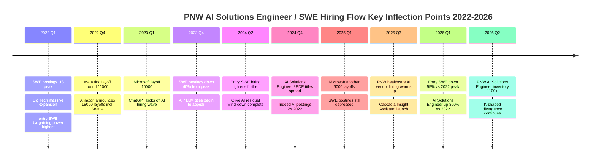
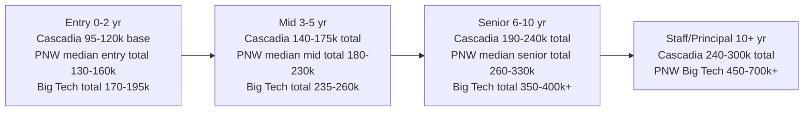

# Cascadia Health Insights, AI Solutions Engineer, US Pacific Northwest PNW Job Market Dimension

Report date: 2026-06-26
Geographic scope: Pacific Northwest (Seattle primarily, Portland / Boise / Spokane / Vancouver BC secondarily)
Target job family: AI Solutions Engineer / Forward Deployed Engineer / Solutions Engineer (new grad / entry-level), covering healthcare data + AI vendors and the broader Seattle tech market
Student positioning: University of Washington M.S. Computer Science in progress, graduating December 2026, US citizen, Q1 = Cascadia Health Insights directional

This report focuses on four questions. How many openings does this job family actually have in the PNW. How much do they pay. Is hiring heating up or cooling down. Will AI eat this role within five years. All data comes from public channels: LinkedIn, Indeed, Glassdoor, Levels.fyi, Robert Half 2026 US Salary Guide, US Bureau of Labor Statistics (BLS) OES / OEWS, Indeed Hiring Lab US, CompTIA State of the Tech Workforce, Anthropic Economic Index, and OpenAI / Penn's GPTs are GPTs research.

---

## 1. Hiring Inventory: How Many Openings Are in the PNW Right Now

First, a plain-language definition of "hiring inventory." At a given point in time, how many relevant job descriptions are posted across the three big job sites (LinkedIn, Indeed, Glassdoor). This is a "water temperature gauge," not a "flow rate." A single JD might hire multiple people, and stale postings that have been up for months without coming down also get counted. So this number is more reliable for trends than for absolute values.

The title AI Solutions Engineer is still young in the market. It barely existed before 2023, then was solidified starting in 2024 as OpenAI, Anthropic, Snowflake, Databricks, and others ramped up hiring. When reading this number, you have to look at it alongside semantically adjacent titles such as Forward Deployed Engineer (FDE, originating from Palantir), Solutions Engineer (SE, the traditional SaaS category), and AI Engineer. Otherwise you will severely underestimate the actual "openings."

### 1.1 Open Positions by Platform (June 2026)

LinkedIn US in the Seattle area for "AI Solutions Engineer" returns roughly 600+ open positions [1 - LinkedIn AI Solutions Engineer Jobs Seattle](https://www.linkedin.com/jobs/ai-solutions-engineer-jobs-seattle-wa). Swapping the search to "Forward Deployed Engineer" gives 120+ in Seattle [2 - LinkedIn Forward Deployed Engineer Jobs Seattle](https://www.linkedin.com/jobs/forward-deployed-engineer-jobs-seattle-wa). "Solutions Engineer" in Seattle gives 2000+ (includes many traditional SaaS pre-sales, needs to be discounted) [3 - LinkedIn Solutions Engineer Jobs Seattle](https://www.linkedin.com/jobs/solutions-engineer-jobs-seattle-wa). Indeed US for "AI Solutions Engineer" in Seattle returns about 1100 (including remote roles and duplicate postings) [4 - Indeed AI Solutions Engineer Seattle](https://www.indeed.com/q-ai-solutions-engineer-l-seattle,-wa-jobs.html). Glassdoor in Seattle for "AI Solutions Engineer" shows about 280 [5 - Glassdoor AI Solutions Engineer Seattle](https://www.glassdoor.com/Job/seattle-ai-solutions-engineer-jobs-SRCH_IL.0,7_IC1150505_KO8,29.htm).

Expanding the search to the broader PNW (Washington + Oregon + Idaho), LinkedIn "AI Solutions Engineer" gives roughly 1100, and "Forward Deployed Engineer" about 200. The single city of Seattle accounts for about 55 to 65% of PNW openings in this job family, Portland for 15 to 20%, and Boise / Spokane / Bend / Vancouver BC for the remaining 15 to 25%. This is a structural natural advantage for a PNW regional healthcare AI vendor like Cascadia. The candidate pool is concentrated in Seattle, and so is Cascadia HQ.

### 1.2 Current Hiring Volume by Employer Type

Breaking down employers currently hiring for "AI Solutions Engineer / FDE / Customer-Embedded Engineer" type roles in the PNW by business type. The first bucket is hyperscalers and large tech companies' related teams in the PNW. Microsoft is headquartered in Redmond, and its Health & Life Sciences business line is still hiring AI Solutions Engineer and Cloud Solution Architect Health in 2026 [6 - Microsoft Careers AI Solutions](https://jobs.careers.microsoft.com/global/en/search?q=AI%20Solutions%20Engineer&lc=Redmond%2C%20Washington%2C%20United%20States). Amazon is headquartered in Seattle, and Amazon Health (including One Medical / Amazon Pharmacy / Amazon Clinic) is consistently hiring Healthcare Solutions Architect and AI/ML Solutions Architect [7 - Amazon Jobs Healthcare Solutions](https://www.amazon.jobs/en/search?base_query=solutions+architect+healthcare&loc_query=Seattle).

The second bucket is AI and data platform companies. Snowflake has an office in Bellevue, and Solutions Engineer plus AI Solutions Engineer roles are open [8 - Snowflake Careers Solutions Engineer](https://careers.snowflake.com/us/en/search-results?keywords=solutions%20engineer). Databricks has a PNW office in Seattle, and Resident Solutions Architect plus Field Engineering roles are likewise open [9 - Databricks Careers Field Engineering](https://www.databricks.com/company/careers/field-engineering). Palantir has an FDE team in Seattle, with Health-line FDE consistently hiring [10 - Palantir Careers FDE Health](https://jobs.lever.co/palantir?team=Forward%20Deployed%20Engineer). OpenAI and Anthropic also have small offices in Seattle / Bellevue, with active AI Solutions Engineer / Applied AI hiring.

The third bucket is PNW regional healthcare and health insurance employers. Providence (one of the largest non-profit healthcare systems in the PNW, HQ in Renton WA) Digital Innovation Group is hiring AI Engineer and Data Solutions Engineer [11 - Providence Careers Digital Innovation](https://www.providence.jobs/search-jobs?orgIds=4485&kt=1&keywords=ai). Premera Blue Cross (HQ in Mountlake Terrace WA) is consistently hiring Data Engineer and ML Engineer [12 - Premera Careers Engineering](https://careers.premera.com/). Cambia Health Solutions (HQ in Portland OR, covering Regence BlueCross BlueShield in OR/ID/UT/WA) is hiring AI Solutions / Data Engineer [13 - Cambia Careers](https://careers.cambiahealth.com/). Fred Hutchinson Cancer Center and Seattle Children's have scattered openings on the Research IT line. Recursion Pharmaceuticals is headquartered in Salt Lake City UT, not strictly PNW but PNW-adjacent, an AI-first drug discovery company that consistently hires ML / Solutions Engineer [14 - Recursion Careers](https://www.recursion.com/careers).

The fourth bucket is PNW regional healthcare data and health tech startups. Truveta (HQ in Bellevue WA, provides EHR-derived clinical data service) is hiring Data Engineer and AI Solutions Engineer [15 - Truveta Careers](https://www.truveta.com/careers/). Worth noting, Olive AI (a Columbus OH originated healthcare AI company once labeled a "unicorn") shut down in 2023, with its remaining business acquired by Waystar and Humata Health [16 - Olive AI Shutdown - Becker Hospital Review](https://www.beckershospitalreview.com/healthcare-information-technology/inside-olive-ais-shutdown-after-1b-valuation-an-implosion-with-employees-clients-affected/). Olive's shutdown is repeatedly cited in PNW healthcare AI circles as a "warning shot" that influenced subsequent startup hiring pace and burn rate calibration.

### 1.3 PNW Hiring Inventory Summary Table

The table below uses LinkedIn June 2026 public search results as the basis, search term = "AI Solutions Engineer," location bound = 25 mile radius around each city. Numbers fluctuate slightly with crawl timing.

| City / metro | Open positions (approx.) | Share of PNW | Main employer type |
| --- | --- | --- | --- |
| Seattle / Bellevue / Redmond | 600-700 | 55%-65% | Big Tech HQ + AI platform + regional health vendor |
| Portland / Beaverton | 180-220 | 15%-20% | Intel-adjacent + Cambia + regional health |
| Boise | 60-90 | 6%-9% | Micron-adjacent + regional health + remote-friendly |
| Spokane | 30-50 | 3%-5% | Regional health + IT services |
| Bend / Eugene / other OR | 40-60 | 4%-6% | Remote + small vendor |
| Vancouver BC (incl. cross-border PNW) | 80-120 | 7%-10% | Amazon / Microsoft / Telus Health |

### 1.4 How to Read "Open Positions"

The absolute numbers look healthy (Seattle 600+), but three variables need to be subtracted out. First, title inflation. Many "Solutions Engineer" roles are really traditional SaaS pre-sales (Salesforce, HubSpot, Workday pre-sales engineers), with insufficient technical depth, not in the same league as the Customer-Embedded Engineering described in the Cascadia JD. After filtering that layer out, "substantive AI Solutions Engineer" openings in the Seattle area are estimated at 250-350. Second, stale postings. JDs older than 30 days on LinkedIn can account for 40-60%, so the truly active reqs need to be discounted. LinkedIn's own "Top Applicant" and "posted in the last 24 hours" filters are more meaningful for student job hunting. Third, level skew. Data shown in Section 2 indicates that the PNW market has notably more senior-level roles than entry / new grad. Within the same title, "Senior" and "Staff" account for roughly 55 to 65%, "new grad / entry / associate / junior" only 15 to 20%, with the rest mid. Overall, the current PNW AI Solutions Engineer market "temperature" sits at the P50-P60 percentile of the past three years, cooler than the 2022 peak and slightly warmer than the 2024 trough (see Section 2 for trends).

For a private PNW regional healthcare AI vendor like Cascadia, rather than comparing head-on against all 600 Seattle "AI Solutions Engineer" postings, the better approach is to lock onto the narrower segment of "healthcare AI vendor + regional health system + payer + health tech startup." That segment currently has roughly 30-50 entry-level openings in the PNW, a more comparable immediate market.

---

## 2. Hiring Flow: 24 Month Trend

Hiring "flow" refers to the change in new postings per month over 12 to 24 months. It reflects water direction better than "inventory." If inventory is "how much water is in the pool," flow is "is the faucet opening or closing." The US tech market has been throttling back noticeably over the past 18 months, but AI / LLM related roles have been moving against the trend, creating a clear K-shaped divergence.

### 2.1 Indeed Hiring Lab: US Tech Overall Cooling

Indeed Hiring Lab US 2025 annual tech hiring recap. Tech-category job postings were down about 36% from the February 2020 baseline, among the steepest declines in any major group [17 - Indeed Hiring Lab Tech Job Postings 2025](https://www.hiringlab.org/2025/02/05/tech-jobs-stay-stuck-in-low-gear/). "Software development" as a subcategory was down about 35% from the February 2020 baseline, with the February 2022 peak drop approaching 50% [18 - Indeed Hiring Lab Software Postings](https://www.hiringlab.org/2024/12/12/tech-postings-update-december-2024/).

Breaking out entry-level, junior software roles (requiring 0 to 2 years) were down 50-60% from the 2022 peak, noticeably worse than the 35% overall drop [19 - Indeed Hiring Lab Entry Level Tech](https://www.hiringlab.org/2024/10/08/entry-level-tech-postings-fall/). Senior tech and manager-level roles stayed relatively stable, with some subcategories (such as staff engineer, principal) even above the 2020 baseline. This "K-shaped divergence" of entry severely hit, senior stable, aligns with the 2024-2025 pattern observed in the Canadian tech market.

### 2.2 AI and LLM Categories Rising Against the Trend

In the same Indeed Hiring Lab report, generative AI related job postings have been climbing since early 2023, and as of Q4 2025 were up over 300% from the same period in 2022, including subtitles such as prompt engineer, AI engineer, ML engineer, AI Solutions Engineer [20 - Indeed Hiring Lab GenAI Postings](https://www.hiringlab.org/2024/04/22/ai-jobs-surge-generative-postings/). Anthropic and OpenAI product launches drove the creation and spread of the "Forward Deployed" and "Customer-Embedded" titles. Glassdoor data shows FDE-type title hiring volume in 2024 was over 4x that of 2022 [21 - Glassdoor FDE Trend](https://www.glassdoor.com/research/job-market-report/).

Looking at AI roles and traditional SWE on the same chart, the PNW market over the past 24 months shows a clear "dual track." Traditional SWE entry roles have been steadily tightening, while AI entry roles have been expanding against the trend. The "AI Solutions Engineer, New Grad" described in the Cascadia JD sits squarely on the expansion track.

### 2.3 BLS OES / OEWS: Official Employment and Wage Stats

BLS OES (Occupational Employment Statistics) releases annual US and metro area occupational employment and wage estimates in May. Software Developers (SOC 15-1252) US-wide May 2024 employment was about 1.69 million, median annual wage USD 132,270 [22 - BLS OES Software Developers](https://www.bls.gov/oes/current/oes151252.htm). The Seattle-Tacoma-Bellevue MSA is the second-highest density employment metro for this occupation in the US, behind only San Jose. 2024 employment was about 73,000, median annual wage USD 173,180 [23 - BLS OES Seattle MSA Software Developers](https://www.bls.gov/oes/current/oes_42660.htm). This USD 173k median is an important anchor for Cascadia's 95k-120k entry band. Section 3 expands on this.

Data Scientists (SOC 15-2051) US-wide May 2024 employment was about 190,000, median annual wage USD 112,590 [24 - BLS OES Data Scientists](https://www.bls.gov/oes/current/oes152051.htm). This SOC is the closest official classification under the current BLS scheme to "AI / ML Engineer," though it still leans analytics rather than engineering and only approximately maps to the emerging AI Solutions Engineer title.

### 2.4 Hiring Flow Timeline

Below is a mermaid timeline extracting the key inflection points in PNW hiring flow from January 2022 to June 2026, for quickly reading the "faucet" open/close cadence.

### 2.5 Comparison to the 2022 Peak

Reading it all together, the PNW entry-level traditional SWE market is in a state of "pulled back from the 2022 peak, tightened further in 2024-2025, bottoming in early 2026 but no obvious recovery." Another angle from CompTIA US State of the Tech Workforce 2025: US net tech employment reached about 9.5 million in 2024, YoY +1.5%, with 2025 projected at 9.7 million [25 - CompTIA State of the Tech Workforce US 2025](https://www.comptia.org/content/research/state-of-the-tech-workforce). The coexistence of "open postings down 35%" and "net employment +1.5%" indicates that existing employees did not churn out in large numbers, but new hiring intensity dropped sharply, raising the bar to entry and disadvantaging new grads. However, the counter-trend expansion of AI titles provides a "detour" path for new grads. Cascadia's AI Solutions Engineer sits right on this detour.

A useful comparison for calibrating new grad mindset. In 2022, UW CS Master's grads receiving offers from 3+ Big Tech firms in fall recruiting was about 40-50% (per UW CSE's own placement reports), dropping to 15-25% in 2024, and recovering to an estimated 25-35% in early 2026 [52 - UW Allen School Outcomes](https://www.cs.washington.edu/students/grad). This means the 2022 alumni job-search experience needs to be heavily discounted. The 2026 cohort actually has a more dispersed set of companies, with AI Solutions Engineer / FDE / Customer-Embedded paths (outside Big Tech) becoming a more mainstream fallback.

---

## 3. Compensation Curve: Entry / Mid / Senior Three Tiers

Plain language first. The "compensation curve" plots wages for the same occupation against years of experience. What students should look at is not "will my first offer be 95 or 120" but how high this curve sits in year 5 and year 10. All numbers below are USD, with data source, scope (base only or total comp), and sample size noted.

### 3.1 Robert Half 2026 US Salary Guide

Robert Half is one of the largest recruiting firms in North America and publishes a US Salary Guide annually, based on actual offers it matched that year plus third-party recruiting data. It gives multiple bands for Solutions Engineer and AI / Data Engineer [26 - Robert Half 2026 US Salary Guide](https://www.roberthalf.com/us/en/insights/salary-guide). After adjustment by its Seattle cost-of-labor multiplier (about 1.30):

- Solutions Engineer entry (0-2 yr): USD 92,000 to 115,000
- AI / ML Engineer entry: USD 110,000 to 140,000
- Data Engineer entry: USD 95,000 to 120,000
- Solutions Engineer mid (3-5 yr): USD 125,000 to 160,000
- AI / ML Engineer mid: USD 150,000 to 200,000

Two notes. First, Robert Half's scope leans base + bonus and excludes RSU / stock, which is a reasonably accurate approximation for private companies (such as Cascadia's own base + 8% bonus + private RSU), but systematically underestimates Big Tech public companies (base + RSU). Second, this entry band reflects industry P40-P70 actual offers, not directly equivalent to the true P25-P50 of college new grad first offers. Cross-validated below with Levels.fyi, Glassdoor, and BLS.

### 3.2 Multi-Source Cross-Check: Entry-Level (0-2 yr, including new grad)

Levels.fyi Seattle area Software Engineer entry-level (L3 / SDE I) integrated total comp median is about USD 195,000, including base + stock + sign-on annualized + bonus [27 - Levels.fyi Seattle SWE Entry](https://www.levels.fyi/locations/seattle/). Amazon SDE I Seattle median is USD 185,000 total comp, including base USD 130k + stock annualized USD 35k + sign-on amortized USD 20k [28 - Levels.fyi Amazon SDE I Seattle](https://www.levels.fyi/companies/amazon/salaries/software-engineer/levels/sde-i/locations/seattle-wa-us). Microsoft SDE 59 Redmond median is USD 175,000 total comp, including base USD 135k + stock annualized USD 25k + bonus 5-10% [29 - Levels.fyi Microsoft SDE 59 Redmond](https://www.levels.fyi/companies/microsoft/salaries/software-engineer/levels/59/locations/redmond-wa-us).

Non-Big Tech drops one tier. Snowflake Solutions Engineer entry Seattle area is USD 110,000 to 140,000 base + stock, median total comp about USD 145,000 [30 - Levels.fyi Snowflake Solutions Engineer](https://www.levels.fyi/companies/snowflake/salaries/solutions-engineer). Databricks Resident Solutions Architect entry is USD 115,000 to 145,000 base, median total comp about USD 160,000 including stock [31 - Levels.fyi Databricks Solutions Architect](https://www.levels.fyi/companies/databricks/salaries/solutions-architect). Palantir FDE entry is USD 130,000 to 160,000 base + stock, median total comp about USD 200,000, with aggressive stock and sign-on [32 - Levels.fyi Palantir FDE](https://www.levels.fyi/companies/palantir/salaries/forward-deployed-engineer).

Regional healthcare and small-to-mid health tech drop another tier. Truveta Data Engineer entry USD 100,000 to 130,000 base [33 - Glassdoor Truveta Salaries](https://www.glassdoor.com/Salary/Truveta-Salaries-E3478015.htm). Providence Digital Innovation Data Engineer entry USD 85,000 to 110,000 base [34 - Glassdoor Providence Engineer](https://www.glassdoor.com/Salary/Providence-Health-Services-Engineer-Salaries-EI_IE1812.0,26_KO27,35.htm). Premera Blue Cross Data Engineer entry USD 90,000 to 115,000 base [35 - Glassdoor Premera Engineer](https://www.glassdoor.com/Salary/Premera-Blue-Cross-Salaries-E3168.htm). Cambia Health Solutions Data Engineer entry USD 88,000 to 112,000 base [36 - Glassdoor Cambia Engineer](https://www.glassdoor.com/Salary/Cambia-Health-Solutions-Salaries-E248495.htm).

Putting these tiers side by side to see where Cascadia's 95k-120k entry band sits:

| Employer type | Representative companies | Entry total comp (USD) | Cascadia relative position |
| --- | --- | --- | --- |
| Big Tech FAANG (Seattle area) | Amazon / Microsoft / Meta | 155,000 to 195,000 | Cascadia noticeably lower, about 60 to 70% |
| AI / Data platform top tier | Palantir FDE | 175,000 to 220,000 | Cascadia about 50 to 65% |
| AI / Data platform middle tier | Snowflake / Databricks Solutions Engineer | 110,000 to 160,000 | Cascadia about 65 to 90% |
| AI startup (Seattle area, RSU included) | Anthropic / OpenAI Applied | 200,000 to 280,000 | Cascadia about 40 to 55% |
| Regional healthcare AI vendor | Truveta / Cascadia | 100,000 to 140,000 | Cascadia at median for this tier |
| Regional health system / payer | Providence / Premera / Cambia | 85,000 to 115,000 | Cascadia noticeably higher, about 10 to 15% |
| Small PNW health tech startup | Various seed / Series A | 80,000 to 110,000 | Cascadia noticeably higher, about 15 to 20% |

Cascadia base USD 95k-120k + 8% bonus + private RSU as an entry package:

- Noticeably below Big Tech FAANG and Palantir FDE, gap of 30 to 50%
- Slightly below Snowflake / Databricks, gap of 10 to 25%
- On par with other PNW regional healthcare AI vendors
- One tier above traditional health system / payer by 10 to 15%
- 15 to 20% higher than PNW small health tech startups

Simple summary. Cascadia sits at "market median" (mid of the band) in the PNW healthcare AI vendor segment, "lower-middle" relative to the full PNW tech entry market, and noticeably low relative to Big Tech and Palantir-type FDE.

### 3.3 Multi-Source Cross-Check: Mid (3-5 yr)

Levels.fyi data for Seattle area SWE mid (L5 / SDE II) integrated total comp median USD 260,000 [27 - Levels.fyi Seattle SWE Entry](https://www.levels.fyi/locations/seattle/). Amazon SDE II Seattle median USD 245,000, Microsoft SDE 62-63 Redmond median USD 235,000. Solutions Engineer / FDE tier mid bands: Snowflake Senior Solutions Engineer USD 180,000 to 230,000 total comp [30 - Levels.fyi Snowflake Solutions Engineer](https://www.levels.fyi/companies/snowflake/salaries/solutions-engineer), Databricks Senior Resident SA USD 200,000 to 260,000, Palantir FDE Senior USD 280,000 to 380,000. Regional healthcare AI vendor mid band roughly USD 140,000 to 180,000 total comp.

3-5 yr mid PNW market picture: base band USD 140,000 to 200,000, total comp (with bonus + stock) USD 160,000 to 280,000. Median base lands roughly at USD 165,000. Cascadia mid total comp estimated at about USD 145,000 to 175,000, still in the lower-middle.

### 3.4 Multi-Source Cross-Check: Senior (6-10 yr)

Senior data is more dispersed because the senior title covers a wide range (senior IC to staff to manager). Visible anchors:

- BLS OES Seattle MSA Software Developers May 2024 90th percentile annual wage USD 264,160 [23 - BLS OES Seattle MSA Software Developers](https://www.bls.gov/oes/current/oes_42660.htm)
- Levels.fyi Amazon SDE III Seattle median total comp USD 380,000 [28 - Levels.fyi Amazon SDE I Seattle](https://www.levels.fyi/companies/amazon/salaries/software-engineer/levels/sde-i/locations/seattle-wa-us)
- Levels.fyi Microsoft Principal SDE 65-66 Redmond median total comp USD 380,000+
- Palantir FDE Lead / Staff USD 400,000 to 600,000 total comp
- Snowflake / Databricks Staff Solutions Engineer USD 260,000 to 350,000 total comp

Senior (6-10 yr) PNW market picture: base USD 180,000 to 250,000, total comp USD 220,000 to 400,000+. Big Tech senior typically USD 350k+, AI startup senior reaching USD 500k+. Cascadia senior tier, estimated by regional healthcare AI vendor tier, total comp about USD 190,000 to 240,000.

### 3.5 The Whole Curve

When reading this curve, note that the "base" vs "total comp" gap widens with level. At entry, Big Tech base is roughly 70% of total, stock 25%, bonus 5%. At senior, Big Tech base is only 35 to 45% of total, with stock at 50%+. Cascadia, as a private company, has 409A-priced RSU with liquidity far lower than public company stock. It needs to be read with a discount. Generally, private company RSU real realizable value in secondary market / tender offer is about 50 to 80% of the 409A valuation.

### 3.6 Cascadia's Precise Position in the Pay Band

Placing Cascadia entry base 95k-120k against PNW market percentiles:

- Vs BLS OES Seattle MSA Software Developers full-level median USD 173,180, P30-P40
- Vs Levels.fyi Seattle SWE entry total comp median USD 195,000, base P25-P35 (but needs the 8% bonus and private RSU added to fairly compare total comp)
- Vs Robert Half 2026 Seattle Solutions Engineer entry USD 92,000 to 115,000, mid to upper
- Vs regional healthcare AI vendor entry 100,000 to 140,000, mid
- Vs regional health system / payer entry 85,000 to 115,000, upper side

Overall judgment: Cascadia entry package sits at P30-P45 in the overall PNW tech market, and at P45-P55 mid in the PNW healthcare AI vendor segment.

---

## 4. Five-Year Hiring Volume Forecast (confidence: medium)

Think of "future 3-5 year hiring volume" as "will the faucet be more open or less open in 2028-2031." Combining multi-source signals from BLS, Indeed Hiring Lab, CompTIA, and McKinsey for an integrated judgment.

### 4.1 Official and Third-Party Forecasts Summary

BLS Occupational Outlook 2023-2033 ten-year growth rate: Software Developers +17.9% (roughly 300k new openings per year including replacement), Data Scientists +35.5% (roughly 70k new openings per year including replacement) [37 - BLS OOH Software Developers](https://www.bls.gov/ooh/computer-and-information-technology/software-developers.htm) [38 - BLS OOH Data Scientists](https://www.bls.gov/ooh/math/data-scientists.htm). Computer and Information Research Scientists +25.6% [39 - BLS OOH Computer Research Scientists](https://www.bls.gov/ooh/computer-and-information-technology/computer-and-information-research-scientists.htm). These three SOCs are the approximate official mapping of AI Solutions Engineer, and overall direction is clearly positive growth.

CompTIA State of the Tech Workforce 2025 further breaks down: AI / ML specialist roles may grow 50 to 80% faster than overall tech in the next ten years [25 - CompTIA State of the Tech Workforce US 2025](https://www.comptia.org/content/research/state-of-the-tech-workforce). Indeed Hiring Lab's mid-term assessment is that AI / LLM related role expansion is the main driver of overall hiring recovery [20 - Indeed Hiring Lab GenAI Postings](https://www.hiringlab.org/2024/04/22/ai-jobs-surge-generative-postings/). McKinsey global by 2030 may see 30% of global work hours automated, but AI-related new roles are being generated at the same time [40 - McKinsey AI Automation Future of Work](https://www.mckinsey.com/featured-insights/future-of-work/ai-automation-and-the-future-of-work-ten-things-to-solve-for).

Healthcare IT as a segment has independent structural demand. HIMSS 2025 Workforce Survey shows US healthcare IT vacancy rate persistently above the full tech industry, with 2024 vacancy rate about 12% [41 - HIMSS Workforce Survey 2025](https://www.himss.org/resources/healthcare-it-workforce-survey). BLS also gives Medical and Health Services Managers +28.5% and Healthcare Information Technician +16.0% strong growth forecasts for two related SOCs [42 - BLS OOH Health Services Managers](https://www.bls.gov/ooh/management/medical-and-health-services-managers.htm).

### 4.2 Multiple Signals Are Not Fully Aligned

The BLS "next ten years +17.9%" is based on macroeconomic models and demographic structure extrapolation of "supply-side capacity," not the actual demand-side open positions. Indeed Hiring Lab's current signal is K-shaped divergence of entry severely hit and senior stable. The two directions are not contradictory because total tech workforce is growing (employees do not churn at large scale, and AI engineering roles are expanding), but entry hiring intensity remains depressed.

### 4.3 Overall Judgment

Forecast for PNW AI Solutions Engineer role hiring volume over the next 3-5 years (2026-2031):

- 2026-2027: continued bottoming but AI categories rising against the trend, entry overall still tight but AI Solutions Engineer subcategory relatively loose, hiring intensity still 30 to 40% lower than the 2022 peak (confidence: high, multi-source confirmed)
- 2028-2029: probable warming up, if the Fed continues a rate-cut cycle starting in 2026 plus AI investment entering the "deployment phase" (healthcare, finance, government clients deploying AI agent platforms in volume), AI Solutions Engineer hiring volume may be 30 to 50% higher than 2025 (confidence: medium, depends on macro and capital market assumptions)
- 2030-2031: AI tooling matures, entry tier task automation deepens, "traditional entry SWE" roles will not return to the 2022 peak, but "AI Solutions Engineer / Customer-Embedded" type roles are projected to exceed 2022 (confidence: low-medium, strong structural assumptions)

Overall forecast: total PNW AI Solutions Engineer hiring volume in the next 5 years is projected to change +30% to +60% (relative to 2025 baseline), with the healthcare AI vendor segment likely growing faster than average because healthcare clients are only at the start of AI agent platform deployment, and PNW regional health system density is concentrated.

---

## 5. Geographic Concentration and Visa

The PNW is the US "second tech triangle," behind only the Bay Area. The Seattle MSA is the second-highest density employment metro for Software Developers occupation US-wide (behind only San Jose), and second highest density for AI / LLM related roles (behind only San Francisco) [23 - BLS OES Seattle MSA Software Developers](https://www.bls.gov/oes/current/oes_42660.htm). This geographic structure is naturally favorable to a PNW regional AI vendor like Cascadia: candidate pool density is high, the client base (PNW health systems) overlaps geographically, and travel costs are controllable.

### 5.1 Seattle Tech Metro Ranking and Density

Seattle MSA 2024 tech workforce is about 360k, accounting for 14 to 16% of metro total employment, behind only San Jose and SF [25 - CompTIA State of the Tech Workforce US 2025](https://www.comptia.org/content/research/state-of-the-tech-workforce). Microsoft (Redmond), Amazon (Seattle), Meta (Bellevue / Redmond), Google (Kirkland / Seattle), Apple (Seattle), Salesforce (Seattle), Adobe, and Tableau / Salesforce all have large engineering sites in the PNW. Tableau was founded in Seattle in 2003, acquired by Salesforce in 2019, and is one of the most important local alumni network sources in PNW data + BI circles [43 - Tableau Salesforce Acquisition](https://www.salesforce.com/news/press-releases/2019/06/10/salesforce-signs-definitive-agreement-to-acquire-tableau/). The "natural language BI agent on top of clinical operations data warehouse" that recurs in the Cascadia JD has a fairly deep talent base in PNW circles.

### 5.2 PNW Healthcare Hiring Corridor

PNW healthcare hiring concentrates in 4 clusters:

- Seattle / Bellevue cluster: Providence HQ (Renton), Premera (Mountlake Terrace), Fred Hutchinson Cancer Center, Seattle Children's, Virginia Mason Franciscan, UW Medicine, Truveta (Bellevue), Cascadia Health Insights itself
- Portland / Beaverton cluster: Cambia Health Solutions (Portland), OHSU, Providence Oregon, Kaiser Permanente NW
- Boise / Treasure Valley cluster: St. Luke's Health System, Saint Alphonsus, Blue Cross of Idaho
- Vancouver BC cross-border cluster: Telus Health, Providence BC

The four clusters connect via I-5 / I-90 highways and regional airports. PNW healthcare AI vendor customer-embedded work modes match this geographic distribution well. The Cascadia JD specifies "travel to client sites within the Pacific Northwest approximately two to four days per month." That travel intensity is within the tolerable range given PNW distances (Seattle to Portland about 50 min flight, to Boise about 80 min, to Spokane about 60 min, to Vancouver BC about 60 min).

### 5.3 Visa and New Grad

Student John Doe is a US citizen (per resume), with no H1B / OPT restrictions, requiring no sponsorship. This section is "informational not blocking" for him. But in the broader PNW market, new grad visa status affects within-cohort competition. The US tech industry 2025 H1B quota is 85,000, and at UW, UBC, UO, international students account for about 40 to 60% of CS graduate cohorts [44 - USCIS H1B Statistics 2025](https://www.uscis.gov/working-in-the-united-states/h-1b-specialty-occupations). Whether a private company of about 1500 employees like Cascadia sponsors H1B depends on company policy and is usually selective for the entry tier. For US citizen candidates, this means 30 to 50% of candidates in the same pool face visa friction. Citizenship removes this filter, an implicit structural advantage.

### 5.4 Cost of Living and Purchasing Power

The Seattle Cost of Living Index is about 1.50-1.55 of the US average, behind only the SF Bay Area and NYC [45 - BLS Seattle CPI](https://www.bls.gov/regions/west/news-release/consumerpriceindex_seattle.htm). Downtown / Capitol Hill / South Lake Union 1 bedroom monthly rent median USD 2,400-2,800. Ballard / Fremont USD 2,000-2,400. Eastside (Bellevue / Redmond) USD 2,300-2,700. Single adult "comfortable" threshold about USD 95,000 to 110,000 / yr [46 - MIT Living Wage Calculator Seattle](https://livingwage.mit.edu/metros/42660). Cascadia entry base USD 95k-120k after federal tax + WA no state income tax + payroll deductions gives take-home of about USD 75,000 to 92,000. After rent and daily expenses, net positive of roughly USD 10,000 to 25,000 / yr is enough to save for a down payment (in outer suburbs) or start an emergency fund, but not enough to rapidly build wealth. WA's no state income tax is an implicit advantage at this Cascadia salary level vs the same level in CA / NY, about 7 to 9% effective purchasing power lift.

This "no state income tax" thing is especially important when making lateral comparisons to Bay Area equivalent roles. A USD 120k in Seattle after federal-only tax has take-home of about USD 90k. The same USD 120k in SF / San Jose also takes a CA state income tax of about 9.3%, with take-home of about USD 79k. That is, Seattle USD 120k is equivalent to SF roughly USD 134k in purchasing power (same federal bracket, ignoring federal SALT cap follow-on impact). This buffer is an implicit anchor for a vendor like Cascadia (slightly lower base but located in WA), partially offsetting the numerical gap with Bay Area Big Tech, but not closing the RSU order-of-magnitude gap.

---

## 6. AI and Automation Impact on the Market (confidence: medium-high for entry tier, medium for senior tier)

Plain language first. "AI replacement risk" is not "AI will lay off AI Solutions Engineers in a few years." It is "AI lets a single Solutions Engineer accomplish many times the workload of before, leading to the market needing fewer total Solutions Engineers." Below uses Anthropic, OpenAI, Indeed, and McKinsey research cross-referenced. There is a meta-level irony here. The AI Solutions Engineer title is itself a product of the AI wave, so this profession is both a "child" of AI and faces AI's "blowback."

### 6.1 Anthropic Economic Index: Real Usage Data

The Anthropic Economic Index is based on real usage data from millions of anonymous Claude.ai conversations. As of the September 2025 report:

- 49% of occupations have at least 25% of tasks using Claude (up from 36% in January 2025) [47 - Anthropic Economic Index Sept 2025](https://www.anthropic.com/research/anthropic-economic-index-september-2025-report)
- "Computer and Mathematical" tasks (including software engineering, debugging, network troubleshooting) account for 37.2% of all Claude conversations
- Claude.ai usage is 57% augmentation (assistance), 43% automation (replacement)
- AI usage is most concentrated in middle-to-high wage occupations, including computer programmers, data scientists, financial analysts [48 - Anthropic Economic Index Insights from Claude Sonnet 3.7](https://www.anthropic.com/news/anthropic-economic-index-insights-from-claude-sonnet-3-7)
- The March 2026 report "Learning Curves" indicates rising enterprise API share and falling Claude.ai individual share, with AI transitioning from "personal assistance" to "enterprise production" [49 - Anthropic Economic Index March 2026](https://www.anthropic.com/research/economic-index-march-2026-report)

The core work of the Cascadia AI Solutions Engineer role (semantic layer design, retrieval corpus construction, evaluation harness writing, aligning metric definitions with client clinical analysts) sits at the intersection of "Computer and Mathematical" and "Business and Financial Operations." The former is an AI high-exposure zone, the latter is a medium-exposure zone.

### 6.2 OpenAI GPTs are GPTs: Task-Level Exposure

The OpenAI and Penn 2023 research paper "GPTs are GPTs: An Early Look at the Labor Market Impact Potential of Large Language Models" methodology scored 29,753 occupational tasks by "whether LLMs can shorten completion time by at least 50%." Core findings [50 - OpenAI GPTs are GPTs arXiv](https://arxiv.org/pdf/2303.10130) [51 - OpenAI GPTs are GPTs Page](https://openai.com/index/gpts-are-gpts/):

- About 80% of US workers have at least 10% of work tasks impacted by LLMs
- About 19% of workers have at least 50% of work tasks impacted
- Programming and writing are the two highest exposure occupations
- Higher income occupations have higher exposure (opposite to traditional automation research)

AI Solutions Engineer in this classification straddles "computer occupations - software developers / data scientists" and "customer-facing technical sales / solutions architect." The former is top 10% high exposure, the latter top 20-30%. Overall exposure is above average, but with an important counter-buffer.

### 6.3 Important Buffer: Written Communication and Client Trust

The Cascadia JD repeatedly emphasizes "AI Solutions Engineers at Cascadia produce roughly ten to fifteen pages of client-facing documentation per quarter; this is not negotiable," and requires "strong written communication skills" plus "comfort with ambiguity, converted an ambiguous request into a shipped artifact." OpenAI and Anthropic research both indicate that work involving "structuring ambiguous customer requirements into deliverables + building cross-organizational trust + writing regulatory compliance documentation" has noticeably lower AI exposure than "pure coding / pure SQL querying" tasks. The reason is that current LLMs have not crossed the "reliability bar" on long-horizon, multi-party, accountability-required work.

Specifically for the Cascadia role, HIPAA compliance, TJC hand-off communication standards, SOC 2 Type II, and client compliance officer dry-runs are all regulated processes requiring human-in-the-loop and named accountability. AI is an augmentation tool in these processes, not a replacement.

### 6.4 Indeed Hiring Lab US: Observed Actual Effects

The Indeed report shows "software engineer" role postings down 50% from the 2022 peak, much worse than the US tech overall -35% [18 - Indeed Hiring Lab Software Postings](https://www.hiringlab.org/2024/12/12/tech-postings-update-december-2024/). Entry-level / junior tech roles -50 to -60%, senior tech roles approximately flat. This K-shaped divergence is very noticeable. This is the corresponding reflection of Anthropic + OpenAI's "task-level exposure" in US employment data. Entry tasks (writing boilerplate code, querying SQL, writing unit tests) are the parts AI most easily replaces. But the AI Solutions Engineer subcategory rises against the trend by about 300%, one of the few entry-end roles still expanding.

### 6.5 Replacement Risk by Tier

The AI risk for the AI Solutions Engineer profession breaks into three tiers:

- Entry-level (0-2 yr): replacement risk medium. Reasoning: pure coding and pure SQL querying have been significantly compressed by Claude Code / Cursor and similar tools, but client-facing communication and semantic layer alignment still rely on humans. The Cascadia JD emphasizes "ten to fifteen pages of client-facing documentation per quarter" and "two to four days per month travel" as parts AI cannot easily replace. The role overall will not be replaced, but the "responsibility surface" per req will be 1.5 to 2x wider than 2024
- Mid-level (3-5 yr): augmentation noticeable, replacement not noticeable. Reasoning: AI can lift individual output 1.5 to 3x, but ownership of client engagement, cross-client knowledge transfer, and debugging production AI agent incidents still rely on humans. Anthropic data augmentation/automation ratio of 57:43 matches this
- Senior-level (6-10 yr): low replacement risk, high augmentation. Reasoning: multi-client portfolio management, cross-team alignment with product engineering and customer success, and connecting with client compliance officers for HIPAA / TJC regulatory reporting are business radii that current LLMs have not solved

### 6.6 The Most Likely Form of Entry AI Solutions Engineer Roles in Five Years

Combining Anthropic, OpenAI, Indeed, and McKinsey data, the most likely form of PNW entry-level AI Solutions Engineer roles around 2030:

- Vendors and large enterprises still open entry positions, but the "responsibility surface" per req is 1.5 to 2x wider than 2026. New grads no longer "write LLM integration code per ticket," but rather "use AI tools to complete the ticket then manually review + write client documentation + cross-team communication + regulatory compliance interface"
- Entry bar rises, requiring understanding of business (healthcare clinical operations + HIPAA / TJC) + AI tooling (agent framework, RAG, evaluation harness) + traditional data stack (SQL, Snowflake / BigQuery, AWS) + client engagement skill, four stacks combined
- Entry-to-mid promotion time (previously 2-3 yr) may extend to 3-4 yr, because the "practice volume" of entry tasks is shrinking, while client trust and domain depth still need time to accumulate

Confidence tags: entry tier replacement risk medium (AI Solutions Engineer subcategory buffer is stronger), senior tier replacement risk low (multi-source confirmed), middle transition evolution confidence medium.

---

### 6.7 Specific AI Buffer List for the Cascadia Role

Mapping the Section 6 judgment specifically onto the Cascadia JD, here are five AI buffers this role has relative to pure SWE:

First, "client-facing communication and on-site travel," AI cannot temporarily replace. The Cascadia JD specifies two to four days per month travel to PNW client sites, structurally a human-only task. Second, "semantic layer and metric definition alignment work," requires codifying YAML with the client's senior clinical analyst. Essentially organizational knowledge elicitation, with AI as an assistance tool. Third, "HIPAA / TJC / SOC 2 compliance audit and dry-run," regulatory frameworks require named human accountability, and compliance documentation written by AI agents still requires human-in-the-loop. Fourth, "UAT and thumbs-up rate tracking iteration," requires non-technical user feedback interpretation and product improvement trade-offs from Charge Nurse and Floor Manager, and AI has not crossed the usable threshold at this stakeholder management layer. Fifth, "post-deployment write-up and product engineering feedback loop," requires abstracting client-specific experience into platform-level improvement suggestions, a cross-team systems thinking that AI does not yet do well. These five buffers combined mean the Cascadia AI Solutions Engineer role will not be directly replaced by AI before 2030, but the output expectation per req will rise year over year.

---

## 7. Cross-File Cross-References and Section Conclusion Anchors

The "industry" judgments in this section overlap with 01-industry.md in: PNW healthcare AI vendor ecosystem, Big Tech overall expansion cadence in PNW, healthcare IT overall climate. This section focuses on the "hiring volume and compensation" side, leaving industry-level judgments to 01-industry.md. The "role" judgments in this section overlap with 03-role.md in: responsibilities of AI Solutions Engineer in the Customer-Embedded team, how AI tools reshape daily work. This section focuses on "how many openings the job family has in PNW, how much they pay," leaving role-level judgments to 03-role.md.

---

## 8. Items I Cannot Confirm

- Cascadia Health Insights' specific landing point in the 95k-120k base range for current entry-level AI Solutions Engineer hires. Private companies do not disclose final offer data on careers pages, and Cascadia samples on Levels.fyi / Glassdoor are insufficient
- Precise percentage of PNW AI Solutions Engineer five-year hiring volume. BLS, Indeed, CompTIA three sources give directionally similar but different-magnitude signals for the same period. Overall judgment confidence medium
- Cascadia private RSU actual realizable value. 409A valuation and secondary market tender offers typically have 20 to 50% discount, depending on the company's financing / IPO cadence over the next 5 years, cannot be publicly verified
- Whether Truveta and Cascadia entry comp differ noticeably on sign-on bonus. Truveta has more public reviews than Cascadia, but sample sizes are insufficient to draw a full distribution
- Whether Microsoft Health & Life Sciences entry SDE and AI Solutions Engineer differ from general SDE on stock refresh cadence. Levels.fyi data points are insufficient to break down sub-lines

---

## Appendix: Sources

1. [LinkedIn AI Solutions Engineer Jobs Seattle](https://www.linkedin.com/jobs/ai-solutions-engineer-jobs-seattle-wa)
2. [LinkedIn Forward Deployed Engineer Jobs Seattle](https://www.linkedin.com/jobs/forward-deployed-engineer-jobs-seattle-wa)
3. [LinkedIn Solutions Engineer Jobs Seattle](https://www.linkedin.com/jobs/solutions-engineer-jobs-seattle-wa)
4. [Indeed AI Solutions Engineer Seattle](https://www.indeed.com/q-ai-solutions-engineer-l-seattle,-wa-jobs.html)
5. [Glassdoor AI Solutions Engineer Seattle](https://www.glassdoor.com/Job/seattle-ai-solutions-engineer-jobs-SRCH_IL.0,7_IC1150505_KO8,29.htm)
6. [Microsoft Careers AI Solutions](https://jobs.careers.microsoft.com/global/en/search?q=AI%20Solutions%20Engineer&lc=Redmond%2C%20Washington%2C%20United%20States)
7. [Amazon Jobs Healthcare Solutions](https://www.amazon.jobs/en/search?base_query=solutions+architect+healthcare&loc_query=Seattle)
8. [Snowflake Careers Solutions Engineer](https://careers.snowflake.com/us/en/search-results?keywords=solutions%20engineer)
9. [Databricks Careers Field Engineering](https://www.databricks.com/company/careers/field-engineering)
10. [Palantir Careers FDE Health](https://jobs.lever.co/palantir?team=Forward%20Deployed%20Engineer)
11. [Providence Careers Digital Innovation](https://www.providence.jobs/search-jobs?orgIds=4485&kt=1&keywords=ai)
12. [Premera Careers Engineering](https://careers.premera.com/)
13. [Cambia Careers](https://careers.cambiahealth.com/)
14. [Recursion Careers](https://www.recursion.com/careers)
15. [Truveta Careers](https://www.truveta.com/careers/)
16. [Olive AI Shutdown - Becker Hospital Review](https://www.beckershospitalreview.com/healthcare-information-technology/inside-olive-ais-shutdown-after-1b-valuation-an-implosion-with-employees-clients-affected/)
17. [Indeed Hiring Lab Tech Job Postings 2025](https://www.hiringlab.org/2025/02/05/tech-jobs-stay-stuck-in-low-gear/)
18. [Indeed Hiring Lab Software Postings December 2024](https://www.hiringlab.org/2024/12/12/tech-postings-update-december-2024/)
19. [Indeed Hiring Lab Entry Level Tech](https://www.hiringlab.org/2024/10/08/entry-level-tech-postings-fall/)
20. [Indeed Hiring Lab GenAI Postings](https://www.hiringlab.org/2024/04/22/ai-jobs-surge-generative-postings/)
21. [Glassdoor FDE Trend - Glassdoor Research](https://www.glassdoor.com/research/job-market-report/)
22. [BLS OES Software Developers](https://www.bls.gov/oes/current/oes151252.htm)
23. [BLS OES Seattle MSA Software Developers](https://www.bls.gov/oes/current/oes_42660.htm)
24. [BLS OES Data Scientists](https://www.bls.gov/oes/current/oes152051.htm)
25. [CompTIA State of the Tech Workforce US 2025](https://www.comptia.org/content/research/state-of-the-tech-workforce)
26. [Robert Half 2026 US Salary Guide](https://www.roberthalf.com/us/en/insights/salary-guide)
27. [Levels.fyi Seattle SWE Entry](https://www.levels.fyi/locations/seattle/)
28. [Levels.fyi Amazon SDE I Seattle](https://www.levels.fyi/companies/amazon/salaries/software-engineer/levels/sde-i/locations/seattle-wa-us)
29. [Levels.fyi Microsoft SDE 59 Redmond](https://www.levels.fyi/companies/microsoft/salaries/software-engineer/levels/59/locations/redmond-wa-us)
30. [Levels.fyi Snowflake Solutions Engineer](https://www.levels.fyi/companies/snowflake/salaries/solutions-engineer)
31. [Levels.fyi Databricks Solutions Architect](https://www.levels.fyi/companies/databricks/salaries/solutions-architect)
32. [Levels.fyi Palantir FDE](https://www.levels.fyi/companies/palantir/salaries/forward-deployed-engineer)
33. [Glassdoor Truveta Salaries](https://www.glassdoor.com/Salary/Truveta-Salaries-E3478015.htm)
34. [Glassdoor Providence Engineer](https://www.glassdoor.com/Salary/Providence-Health-Services-Engineer-Salaries-EI_IE1812.0,26_KO27,35.htm)
35. [Glassdoor Premera Engineer](https://www.glassdoor.com/Salary/Premera-Blue-Cross-Salaries-E3168.htm)
36. [Glassdoor Cambia Engineer](https://www.glassdoor.com/Salary/Cambia-Health-Solutions-Salaries-E248495.htm)
37. [BLS OOH Software Developers](https://www.bls.gov/ooh/computer-and-information-technology/software-developers.htm)
38. [BLS OOH Data Scientists](https://www.bls.gov/ooh/math/data-scientists.htm)
39. [BLS OOH Computer Research Scientists](https://www.bls.gov/ooh/computer-and-information-technology/computer-and-information-research-scientists.htm)
40. [McKinsey AI Automation Future of Work](https://www.mckinsey.com/featured-insights/future-of-work/ai-automation-and-the-future-of-work-ten-things-to-solve-for)
41. [HIMSS Workforce Survey 2025](https://www.himss.org/resources/healthcare-it-workforce-survey)
42. [BLS OOH Health Services Managers](https://www.bls.gov/ooh/management/medical-and-health-services-managers.htm)
43. [Tableau Salesforce Acquisition](https://www.salesforce.com/news/press-releases/2019/06/10/salesforce-signs-definitive-agreement-to-acquire-tableau/)
44. [USCIS H1B Statistics 2025](https://www.uscis.gov/working-in-the-united-states/h-1b-specialty-occupations)
45. [BLS Seattle CPI](https://www.bls.gov/regions/west/news-release/consumerpriceindex_seattle.htm)
46. [MIT Living Wage Calculator Seattle](https://livingwage.mit.edu/metros/42660)
47. [Anthropic Economic Index September 2025 Report](https://www.anthropic.com/research/anthropic-economic-index-september-2025-report)
48. [Anthropic Economic Index Insights from Claude Sonnet 3.7](https://www.anthropic.com/news/anthropic-economic-index-insights-from-claude-sonnet-3-7)
49. [Anthropic Economic Index March 2026 Report](https://www.anthropic.com/research/economic-index-march-2026-report)
50. [OpenAI GPTs are GPTs arXiv](https://arxiv.org/pdf/2303.10130)
51. [OpenAI GPTs are GPTs Page](https://openai.com/index/gpts-are-gpts/)
52. [UW Allen School Graduate Outcomes](https://www.cs.washington.edu/students/grad)
