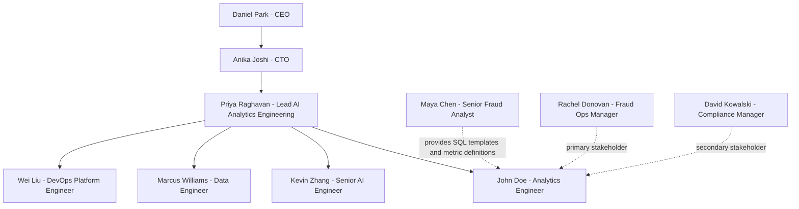

# 01 — 项目背景与业务需求

## 一、一句话总结

为 NovaRisk AI（一家总部位于纽约的实时反欺诈与反洗钱 SaaS 公司）的内部反欺诈运营团队建一个**自然语言 BI Agent**：让 Fraud Ops Manager、CRO、CFO、Compliance Manager 等非技术 stakeholder 直接用英文向系统提问"上周哪条规则的误报率最高""top-3 客户占 ARR 多少""哪些 HIGH 风险评级客户实际没产生确认欺诈"，由 agent 在 Snowflake 上生成可审计的 SQL，并以"文字总结 + 表格 + 必要时图表"的 hybrid 形式回答；目标在 2026 年 Q4 上线生产，覆盖 60% 的 ad-hoc query backlog，并满足 FinCEN 与 SOC2 审计对**口径一致性与 query audit trail** 的要求。

## 二、公司背景：NovaRisk AI 是谁

NovaRisk AI 成立于 2019 年，由两名前支付风控工程师和一名图机器学习研究员在纽约创立，目前**总部位于纽约市曼哈顿**，在**多伦多设有工程与数据科学分部**。公司有约 **180 名员工**，其中近一半是工程师、数据科学家与欺诈领域专家。

**商业模式**是 B2B SaaS。NovaRisk 的客户**不是消费者**，而是银行、信用合作社、digital fintech、BNPL 借贷方与支付处理商。截至 2026 年 Q2，公司有 **12 家付费机构客户**，其中 10 家在美国（包括 Skyline National Bank、Meridian Card Services、Pioneer Federal Credit Union、Northwind Pay 等）、1 家在加拿大（RiverGate Bank）、1 家在新加坡（EquatorPay）。**年经常性收入约 800 万美元**，单客户年合同金额（ACV）落在 **24 万 – 120 万美元** 区间，按订阅 + 用量混合计费。

NovaRisk 的平台能力覆盖：

- **实时打分 API**——客户 POST 一笔交易，平台在 100ms 内返回 0–999 分加建议动作（APPROVE / STEP_UP / REVIEW / DECLINE）
- **模型市场**——无监督聚类（招牌能力）、有监督 GBDT、图异常、深度序列四类模型，按客户部署冠军 + 挑战者
- **规则引擎**——分析师手写硬规则（如 `STRUCTURING_PATTERN`、`KNOWN_MULE_DEVICE`），与 ML 分数并行
- **案件管理工作台**——分析师把告警打包成 case、推到 SAR 阶段
- **Vera AI Agent**——已上线的对话式 agent，分析师在 case 内部对话，已实现 SAR 起草、协同关联探索、设备链路追踪等工具
- **Data Consortium**——跨 NovaRisk 全体客户共享的脱敏欺诈信号

**单位经济速记**：典型 SaaS 75–85% 毛利，最大可变成本是 Vera 背后的 LLM 推理算力（这也是 CFO 关注 token 成本归因的原因）。

**当前业务环境**：监管端，FinCEN 与 OFAC 持续收紧 AML 上报与制裁筛查标准；欧盟 AMLR 自 2027 起生效，跨境客户需要 audit-grade 的 query 可追溯。竞争端，传统规则引擎厂商被 AI 原生玩家蚕食，但客户在采购评估时越来越关注"你们自己用 AI 怎么做内部运营"。

## 三、触发事件：为什么是 2026 年 Q3 启动这个项目

**2026 年 Q2 末两件事同时压到 CEO 桌面：**

1. **FinCEN 现场审查通知**——2027 年 Q1 NovaRisk 将作为客户银行群的 AML 平台供应商，被 FinCEN 与 OCC 抽样核查。核查重点是：所有对外报送（SAR 数量、规则触发明细、风险评级、SLA 报告）背后的数字**能否拿出可重放的 SQL 与一致的口径定义**。
2. **SOC2 Type II 审计准备**——客户群（尤其 Skyline National Bank、Meridian Card Services 两家头部）合同条款要求 NovaRisk 在 2026 年底前完成 SOC2 Type II 认证，审计师明确要求："任何展示给客户与监管的运营 KPI 必须有 query lineage"。

而内部现状是：Fraud Ops Manager **Rachel Donovan**（直接向 CEO 汇报，原因见 Doc 02 §一）每周收到的临时数据请求约 **40 条**，全部转给资深分析师 **Maya Chen** 在 Snowflake 上手写 SQL 回邮件。Maya 每周花 **约 22 小时**写 ad-hoc query，平均响应时长 **3.6 天**，口径定义散落在她个人 Notion + Slack 截图里。审计师在 2026-06-18 走查时随机抽查了一份 "Q1 规则误报率报告"，结果发现：

- 同一指标 `false_positive_rate` 在三个不同版本的报表里**分母口径不一致**（一处是所有告警，一处是已判定告警，一处是排除纯 ML 告警后的剩余）
- 审计师索要"该数字背后的 SQL"，Maya 翻 Slack 翻了 25 分钟才找到，且翻出来的版本与报告里的数字**对不上**

CEO **Daniel Park** 在 06-19 周会上拍板：**"Q3 必须立项一个内部 BI Agent，把分析口径治理 + query audit trail 做扎实，不然 Q1 FinCEN 现场我们要丢脸。"** 06-22，新成立的 **AI / Analytics Engineering 小组** 由 **Priya Raghavan** 出任 Lead，**John Doe** 作为 Analytics Engineer（New Grad）入职，项目正式启动日定为 **2026-07-13**。

## 四、项目范围（Scope）

### In Scope

- **Snowflake 数据层**：NovaRisk 已经在 Snowflake 上半年了，BI Data Mart 已有 20 张表（业务背景与 ER 文档对应）；本项目**不重建**仓库，只在其上加一层 Analytics schema 与 semantic layer
- **自然语言 BI Agent**：覆盖 business context §5 列出的 **8 类核心业务问题**与对应 **20 条 golden SQL queries**（详见 Doc 03 的 P0/P1/P2 划分）
- **首要 stakeholder 路径**：Fraud Ops Manager Rachel Donovan 与她的 6 人 Fraud Ops 小队（4 名分析师含 Maya + 2 名 ops specialist）作为 design partner；secondary 覆盖 Compliance Manager David Kowalski（SAR / structuring 模式 / 制裁名单类问题）
- **Hybrid 输出**：文字总结 + markdown table；趋势 / 分布 / Top-N 类问题自动出图（PNG via S3 URL）
- **Audit trail**：每次 agent 回答必须落盘"NL query → 生成的 SQL → 引用的 KB snippet → 行数（不含具体值）"
- **Demo Chat UI**：John Doe 自己用 Next.js + Vercel 做，简历向 demo 层，给面试官与内部 stakeholder 走查用
- **AWS CDK（Python）部署**：覆盖 AgentCore Runtime（App + MCP 两个 endpoint）、Bedrock Knowledge Base、相关 IAM / Secrets / VPC / 观测

### Out of Scope（显式排除）

- **Agent 不写入 Snowflake**：永远只读，禁止 INSERT/UPDATE/DELETE
- **不接其他数据源**：仅 Snowflake（不做 Postgres / MongoDB federation）
- **不训练 / 不微调 LLM**：demo 走 OpenAI 或 Google Gemini 官方 API，production 走 Bedrock 上 Anthropic Claude，切换由环境变量控制
- **不做企业生产前端**：Demo UI 之外的"企业内 portal"由 NovaRisk 现有 Web Team 后续接手，本项目只交付 AgentCore App Endpoint 契约
- **不做实时流处理**：Snowflake 已是 batch 数据，本项目不引入 Kafka / Flink
- **不做移动端 / 国际化**：英文 only，Web only
- **不替代 Vera**：Vera 是面客分析师工作台内的 case-level agent；本项目的 BI Agent 是面**内部 stakeholder** 的运营/合规分析工具，两者不重叠

### 量化范围

- 覆盖 NovaRisk **现有 12 家客户机构**的全部数据
- 数据量级：约 **4,540 行**跨 20 张表的季度快照（持续每日增量）——这是**刻意压小为 demo / evaluation 讲故事方便的脱敏抽样快照**，生产实际量级高几个数量级，详见 Doc 03 §五
- 业务问题覆盖：business context 的 **8 类核心问题 / 20 条 golden SQL queries**，按 Doc 03 §三划分为 **P0 = 10 条 REQ**（7 功能 REQ 覆盖 7 条 query + REQ-19/20/21 三条横切）、**P1 = 6 条 REQ**（6 条 query）、**P2 = 6 条 REQ**（7 条 query）——20 条 query 全覆盖，详见 Doc 03

## 五、成功标准

### 业务指标（2026-12-15 验收基准日）

| 指标 | 现状（2026-06）| 目标（2026-12）|
|------|-----------------|-----------------|
| Fraud Ops Manager 自助率（不走 Maya 邮件）| 0% | ≥ 60% |
| Maya Chen ad-hoc query 时长占比 | ~22 小时/周 | ≤ 3 小时/周（仅做 semantic layer review）|
| ad-hoc query 平均响应时长 | 3.6 天 | ≤ 4 小时（自助路径） |
| Agent 答复的 audit trail 覆盖率 | N/A | 100%（每答复都有 SQL + KB 引用）|
| 口径冲突报告（不同报表同指标算法不一致）| 季度 ≥ 5 起 | 季度 ≤ 1 起 |

### 技术指标

| 指标 | 目标 |
|------|------|
| SQL accuracy on golden set（生成 SQL 跑出结果与 ground truth 一致）| ≥ 85% |
| Answer accuracy（数字与 golden 在 ±2% 容差内）| ≥ 80% |
| Citation rate（引用了 KB snippet 或 metric YAML 的回答占比）| 100% |
| Hallucination rate（编造不存在的指标 / 表 / 字段）| ≤ 2% |
| End-to-end p95 latency（NL query 提交 → UI 收到完整回复）| ≤ 8 秒 |
| 系统可用性（business hours）| ≥ 99.5% |

成功定义的硬约束：**FinCEN 2027-Q1 现场核查时，能在 5 分钟内对任意 BI 报表上的数字调出对应 SQL + 引用的口径定义**——这是 CEO Daniel Park 的一句话验收标准。

## 六、团队概览

核心团队 5 人，加上游 1 人、下游 2 人。详细人物介绍见 Doc 02。

John Doe 的 manager 是 **Priya Raghavan**。Kevin Zhang 同时担任 John 的 informal mentor，负责 review John 在 semantic layer 与 evaluation 上的设计决策。Maya Chen 是 John 的上游对接人（提供 SQL 模板、做语义层 review），Rachel Donovan 是首要下游 stakeholder，David Kowalski 是次要下游 stakeholder。

## 七、项目时间线概览

项目总时长 **约 20 周**（约 4.6 个月），从 **2026-07-13 启动**，到 **2026-11-30 production GA**。GA 当周（2026-11-23 → 11-30）内含 Thanksgiving 假期与周末，作为 production deploy 后的天然 buffer 应对 SOC2 审计师追加问题；若出现 blocker，最多把 GA 推 1 周到 2026-12-07（详见 Doc 05）。详细 Phase 划分见 Doc 05。

| Phase | 时间 | 核心目标 |
|-------|------|----------|
| Phase 0 — Foundations | 2026-07-13 → 2026-08-09（4 周）| Snowflake schema 接好、KB corpus 接好、CDK skeleton 通 |
| Phase 1 — E2E Happy Path | 2026-08-10 → 2026-09-13（5 周）| 1 个 stakeholder + 5 条 P0 query 端到端打通 |
| Phase 2 — Coverage Expansion | 2026-09-14 → 2026-10-18（5 周）| 加图表、加 multi-turn、扩到 P0 全部 + 部分 P1 |
| Phase 3 — Eval & Audit Hardening | 2026-10-19 → 2026-11-22（5 周）| evaluation 框架、observability、audit trail、UAT |
| GA Rollout & Buffer | 2026-11-23 → 2026-11-30（1 周）| Production cutover + on-call（SOC2 正式 readiness 走查已在 Phase 3 最后工作周完成；本周含 Thanksgiving，按假期 buffer 处理）|

关键 go/no-go 里程碑（详细判定标准在 Doc 05）。**日期约定**：各 Phase 按自然周对齐、名义结束于周日，但每个 Phase-exit 的 review 与 stakeholder demo 实际在该 Phase 最后一个工作日（前一个周五）进行，与 Doc 02 §五"demo 每两周五"的 cadence 一致：

- **M1 (2026-08-07, Fri)**：Phase 0 ready review，CDK 能在干净账户里部署
- **M2 (2026-09-11, Fri)**：E2E demo，Rachel Donovan 第一次用 BI Agent 替代邮件请求
- **M3 (2026-10-16, Fri)**：P0 全覆盖 + Compliance Manager UAT
- **M4 (2026-11-20, Fri)**：Evaluation 通过阈值、audit trail 100% 覆盖
- **GA (2026-11-30, Mon)**：上线给 Fraud Ops 6 人小队 + Compliance Manager David Kowalski
