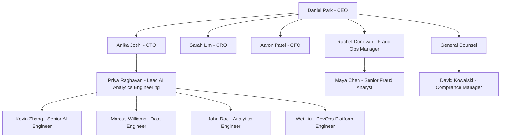

# 02 — 团队与协作

## 一、组织架构与汇报关系

NovaRisk 的产品与工程部门由 **CEO Daniel Park** 统管。2026 年 Q2 末成立的 **AI / Analytics Engineering** 小组挂在 **CTO Anika Joshi** 之下、与原有的 Data Engineering 和 ML Platform 平级。本项目的核心团队就是这个新小组。

图中实线均为直接汇报关系。本项目核心小组（Priya 及其下 Kevin / Marcus / John / Wei）挂在 **CTO Anika Joshi** 之下。两条需要说明的汇报线：

- **Fraud Ops Manager Rachel Donovan 直接向 CEO 汇报**（而非走 CRO）：NovaRisk 本身是一家 fraud detection 公司，内部 Fraud Ops 既是平台能力的 dogfooding 用户、又是对客户银行展示的运营标杆；加之创始 CEO Daniel Park 出身支付风控工程师（Doc 01 §二），亲自盯内部 fraud ops 的 SLA 与误报 KPI，故 Rachel 这条线直达 CEO。**CRO Sarah Lim** 负责的则是企业级 / 平台级风险（client risk posture、监管关系、model risk governance），与内部 fraud 运营是两条线。
- **Compliance Manager David Kowalski 汇报给 General Counsel**（合规独立于业务线，符合金融机构惯例）。

**C-level 速记**：**CTO Anika Joshi**——12 年工程履历、前某北美支付平台 staff engineer，2025 年加入，统管 NovaRisk 全部工程与数据组织；对本项目的架构骨架与 AgentCore 选型有最终否决权，但日常授权给 Priya。**CRO Sarah Lim** 与 **CFO Aaron Patel** 为季度级 stakeholder（见 §三）。Maya Chen 在 Rachel 的 Fraud Ops 小队下（见 §三）。

## 二、核心团队成员

### Priya Raghavan — Lead, AI / Analytics Engineering（John Doe 的 manager）
**资历**：8 年经验。前 5 年在某北美保险科技公司做 Senior Data Engineer，后 3 年在一家湾区 fintech 带过 4 人的 ML platform 小队。2026-04 加入 NovaRisk。

**岗位职责**：在工业界，AI / Analytics Engineering Lead 既要懂数据栈（dbt / Snowflake / Airflow）也要懂 LLM 应用栈（agent 框架 / RAG / evaluation），同时是这个小组对外的 stakeholder 接口——业务方提需求先找她，她拍板范围与优先级后再下分到团队。

**在本项目中**：拍板 BI Agent 的 P0/P1/P2 划分、与 Rachel Donovan / David Kowalski 对齐验收标准、对 SOC2 审计师的所有沟通走她。技术决策上她负责架构骨架的批准（详见 Doc 04），不写代码。

**与 John Doe 的关系**：直接 manager；每周一对一 30 分钟，季度 OKR 由她设。

### Kevin Zhang — Senior AI Engineer（John Doe 的 mentor）
**资历**：6 年经验。曾在某湾区 AI infra 公司做 production RAG 系统，熟悉 Strand Agents 与 LangChain，熟悉 AWS Bedrock、AgentCore Runtime 的部署模式。2026-02 加入 NovaRisk。

**岗位职责**：Senior AI Engineer 负责 LLM 应用层的核心设计——agent orchestration、prompt 工程、tool calling 协议、evaluation 框架。他不是架构师，但在小组里是 prompt / agent 行为的 source of truth。

**在本项目中**：own Strand Agent 的 system prompt 设计、tool 注册方式、LLM provider 切换层。负责 review John Doe 在 evaluation 框架与 semantic layer 接口上的设计决策。

**与 John Doe 的关系**：informal mentor，每周二、四 office hour 各 1 小时；John Doe 的 PR 由 Kevin code review。

### Marcus Williams — Data Engineer
**资历**：5 年经验。从某北美零售集团的 BI Engineer 起步，后做了 3 年的 Snowflake 平台工程。熟悉 dbt、Snowflake 性能调优、row access policy 配置。2025-08 加入 NovaRisk。

**岗位职责**：Data Engineer 在工业界负责数据仓库的 schema、ETL/ELT pipeline、性能与成本管理。在跟 LLM 应用对接时，他还要负责"对 agent 安全的只读 service account + 行级访问策略"。

**在本项目中**：own NovaRisk Snowflake 的 ANALYTICS schema 设计、给 BI Agent 专用的 read-only service account、row access policy（防止 agent 跨客户机构读数据）。

**与 John Doe 的关系**：上游同级。John Doe 写 semantic layer YAML 时要确保字段与 Marcus 的 view 名一致；Snowflake 性能问题第一时间找 Marcus。

### John Doe — Analytics Engineer（本项目的学生角色）
**Level**：New Grad，2026-06 从北美某 CS / DS 项目毕业后入职。简历上的过去经验：
- 一段 Data Engineering 类 internship：用 SQL / dbt / Snowflake 在一家虚构的 fintech 做过指标治理与 dashboard 重构
- 一段 AI / LLM 类 capstone：用 LangChain 做过 RAG + 简单 agent 的论文复现项目

这两段经历的组合正好对得上 NovaRisk 这一岗位的画像——既能跟资深分析师对齐口径，也能看懂 agent 框架在做什么。

**岗位职责（Analytics Engineer 在工业界）**：介于 Data Engineer 与 Data Analyst 之间。负责把分析师手里的"指标公式与口径"沉淀进可复用的 semantic layer（dbt metric / YAML / Looker 等），写 evaluation 与回归测试保证 KPI 数字稳定。这个角色越来越多地承担"AI agent 的数据接口"职责——semantic layer + golden set 就是 agent 与数据仓库之间的契约层。

**在本项目中**：own 三块（详见 Doc 04 §六）——
1. **Semantic Layer & Metric Definitions**：把 Maya Chen 的指标公式（如 `false_positive_rate`、`confirmed_fraud_per_1k_txn`、`decline_rate`）写成结构化 YAML，给 Snowflake Query Tool 与 LLM 当 grounding
2. **Evaluation Golden Set & Eval Harness**：基于 business context §SQL queries 文档的 20 条 query 实际跑出的数字，建 ground truth；pytest 框架对每次 PR 跑全套
3. **Knowledge Base Corpus Engineering**：把 business context、ER 文档、术语表切分、打 metadata、上传 Bedrock KB

**关键决策权**：John Doe 可以决定 semantic layer YAML 的 schema、evaluation 阈值的具体数字、KB chunking 策略——但每个决策都由 Kevin 或 Priya review。他**没有** agent 框架选型权、CDK 架构权、Snowflake 角色权限的最终拍板权。

### Wei Liu — DevOps / Platform Engineer
**资历**：7 年经验。前 4 年在某加拿大 fintech 做 AWS infra，后 3 年在 NovaRisk 负责整个 AWS account 的治理、CI/CD、Bedrock 相关 IAM。

**岗位职责**：DevOps / Platform Engineer 负责 IaC（本项目用 AWS CDK Python）、CI/CD pipeline、observability stack。他是 "production-ready" 这件事的把关人。

**在本项目中**：own 整个 CDK codebase、AgentCore Runtime（App + MCP）的部署、Secrets Manager 配置、CloudWatch dashboard 骨架。John Doe 写的 audit trail logging 也由他 review。

**与 John Doe 的关系**：同级；John Doe 改任何会影响 IAM / 网络的东西必须先跟 Wei 对齐。

## 三、上游与下游 Stakeholder

### 上游：Maya Chen — Senior Fraud Analyst（提供 SQL 模板与口径）
**资历**：12 年欺诈分析经验，前 8 年在某美国大型商业银行做 AML investigator，后 4 年在 NovaRisk 做面客分析师。Maya 直接汇报给 Rachel Donovan，是 Rachel 团队里最资深的一线分析师。

**日常工作**：写 ad-hoc SQL 回答 Fraud Ops / Compliance / CRO / CFO 的临时问题（约 22 小时/周），同时维护一套个人 Notion，记录"这家公司的指标怎么算"。

**为什么 Maya 的工作产生需求**：CEO 决定把 Maya 写 SQL 的活儿"agent 化"，但 Maya 不是被替代——她变成"口径治理人"。John Doe 写的每一条 semantic layer YAML 都需要 Maya review 签字，确认口径与她过去的报表一致。

**对接节奏**：Phase 0 与 John Doe 每周两次 1 小时，把指标公式逐条过；Phase 1 之后每周一次 30 分钟。

### 下游 P1：Rachel Donovan — Fraud Ops Manager（首要 stakeholder）
**资历**：10 年欺诈运营经验，3 年前从 Skyline National Bank 跳到 NovaRisk。直接汇报给 CEO（fraud 是 NovaRisk 立身之本、CEO 亲自盯其 KPI，理由详见 §一图例说明），掌管 NovaRisk 内部一个 **6 人** 的 Fraud Operations 小队（含 Maya 等 **4 名分析师 + 2 名 ops specialist**）。该 6 人小队即 BI Agent 的 design partner 群体，GA 后全员上线使用。

**日常工作**：周一周会过 7 日告警趋势、周三过规则误报率、周五过超期高优案件、季度准备 QBR 材料给客户银行。

**用 agent 做什么**：取代她现在大部分发给 Maya 的临时邮件请求。她不会写 SQL，但需要能问"上周哪条规则误报率最高""哪些 HIGH 优先级案件已开案超过 14 天""昨天每家客户的告警量与前一周对比"。

**对产出的质量要求**：数字必须可信（这是她在 CEO 面前的脸面），每个回答必须能看到来源 SQL 与口径解释（这是审计要求）。

**对接节奏**：Phase 1 之前 John Doe + Priya 一起跟她做 paper prototype 走查；Phase 1 起每两周一次 demo；Phase 2 起 Rachel 在 staging 环境直接用 + 给反馈。

### 下游 P2：David Kowalski — Compliance Manager（次要 stakeholder）
**资历**：15 年合规经验，前 BSA Officer 出身。汇报给 General Counsel。

**用 agent 做什么**：SAR 提交统计、structuring 模式叙述搜索、制裁名单命中的 SAR 追溯、FinCEN 现场核查时实时调数据。

**对接节奏**：Phase 2 起拉进 UAT。Phase 3 内做 SOC2 dry-run 与正式 readiness 走查（详见 Doc 05 §三）。

### 其他 stakeholder（季度级使用，非 design partner）
- **Sarah Lim — CRO**：季度看高风险走廊敞口、CDD 评级有效性
- **Aaron Patel — CFO**：季度看收入集中度、Vera token 成本

## 四、John Doe 的角色定位

John Doe 在本项目中**不是**架构师，**不是**项目经理。他是一个 New Grad Analytics Engineer，负责**3 块明确的交付物**（详见 §二.John Doe 段落）。

他的工作:
- **输入**：Maya Chen 给的指标口径与 SQL 模板，Marcus 给的 ANALYTICS schema，Kevin 给的 agent 架构与 prompt 范式
- **产出**：semantic layer YAML、KB corpus 与 metadata、evaluation golden set 与 pytest harness
- **review**：所有 PR 由 Kevin 做 code review；指标 YAML 由 Maya 业务 review；最终验收由 Priya 签字

升级路径：技术问题 → Kevin；业务/口径问题 → Maya；范围/优先级问题 → Priya；任何会影响 SOC2 审计的事 → Priya 立刻知会 Wei + David。

## 五、协作模式与会议节奏

### 日常协作
- **Slack** 异步沟通：`#proj-bi-agent` 项目频道、`#proj-bi-agent-incidents` 故障频道
- **GitHub** PR review：所有 PR 必须 1 个 approval；涉及 prompt 改动必须 Kevin approve；涉及 schema/IAM 改动必须 Wei + Marcus 两人 approve
- **Notion** 文档：本系列 5+9 篇文档的 source of truth

### 固定会议节奏

> **时区**：NovaRisk 总部 NYC 与多伦多工程分部同属 **US/Canada Eastern Time**，故下表所有时刻统一以 **ET** 记，无需跨时区换算。

| 会议 | 频率 | 参与 | 时长 |
|------|------|------|------|
| Daily standup | 每个工作日 09:30 ET | 核心 5 人 | 15 min |
| Sprint planning | 每两周一 | 核心 5 人 + Maya | 90 min |
| Stakeholder demo | 每两周五 | 核心 5 人 + Rachel + Maya（Phase 2 起 + David）| 60 min |
| Architecture / prompt review | 按需 | Priya + Kevin + John | 60 min |
| 1:1 manager | 每周一 | Priya + John | 30 min |
| Mentor office hour | 每周二、四 | Kevin + John（开放给小组其他人）| 60 min × 2 |

### 关键决策升级路径
1. John Doe 遇到 SQL 准确率不达标 → 找 Kevin 改 prompt / 加 few-shot → 仍不达标 → 找 Maya 补 semantic layer 上下文
2. 遇到 Snowflake 权限被 row access policy 拦 → 找 Marcus
3. 遇到 audit trail 字段不够 → 找 Priya 拉 Wei + David 一起对齐
4. 遇到 stakeholder 提了 P0 之外的新需求 → 不答应、记 backlog、Priya 在下次 sprint planning 上拍板

## 六、项目治理

- **范围变更**：任何把 Doc 03 的 P0 列表往外扩、或往里缩的请求，必须走 Priya 评审，并附 impact 到 Doc 05 时间线
- **技术决策**：架构骨架（Doc 04 §一二）由 Priya + Kevin 锁定，本项目中不再变；模块内的具体选型由对应 owner 决定但需 review
- **风险升级**：M1/M2/M3/M4 任何一个 go/no-go 不通过，Priya 24 小时内向 CEO 汇报
- **SOC2 / FinCEN 合规追踪**：David Kowalski 是合规 owner，所有"会被审计师问到"的事项由他维护一份 checklist 并定期跟 Priya 对齐
