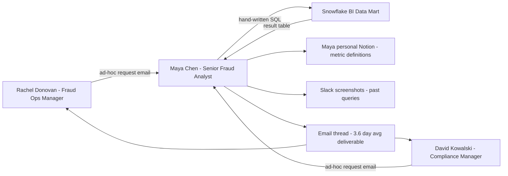
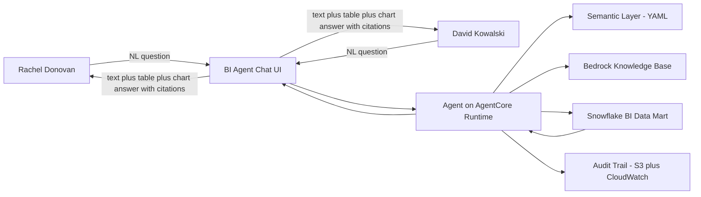

# 03 — 业务需求

## 一、需求来源与背景回顾

本需求清单的来源来自三个层面（详见 Doc 01 §三 触发事件、Doc 02 §三 stakeholder 介绍）：

1. **CEO Daniel Park 的硬约束**：FinCEN 2027-Q1 现场核查能在 5 分钟内对任意运营 KPI 调出 SQL + 口径
2. **首要 stakeholder Rachel Donovan 的痛点清单**：每周收到约 40 条 ad-hoc 数据请求，3.6 天才回，口径与 Maya Chen 的 SQL 不可控
3. **业务背景文档 §5** 的 8 类业务问题 + **20 条 golden SQL queries**（Q1..Q20，已经在 Maya 手里运行了一个季度）

需求的最终形态：把 Maya 手写 SQL 回答的活儿"agent 化"，让 Rachel 与 David 自助提问。需求由 Priya Raghavan 在 2026-06-25 与 Rachel + Maya + David 三方对齐后定稿。

## 二、核心业务流程

### As-Is（项目启动前的现状）

**问题**：响应慢（3.6 天）、口径定义散落、SQL 翻不出来、审计无法追溯。

### To-Be（项目交付后的目标流程）

Maya 退一步成为 semantic layer 的口径治理人，不再做 ad-hoc。

## 三、功能需求

按 P0（必须有，MVP 范围）/ P1（应该有，尽量 GA 前）/ P2（最好有，GA 后迭代）三档划分，与 business context §SQL queries 文档的 20 条 query 一一对应。

### P0 — 端到端必须打通（共 7 条 + 3 条横切）

| REQ | 描述 | 对应 Q | 对应 SQL | 业务价值 | 验收标准 |
|-----|------|---------|----------|----------|----------|
| REQ-01 | Agent 必须能回答规则误报率类问题（按规则代码排序、过滤 sample size、剔除纯 ML 告警）| Q3 | Query 5 | Rachel 周三会议核心议题，决定哪条规则该退役 | NL "上个月哪些规则误报率最高" 返回的 Top-N 顺序与 ground truth 完全一致；FP rate 数字 ±0.5pp 容差 |
| REQ-02 | Agent 必须能回答分析师平均关案时长类问题（按 analyst 聚合，过滤已关案件）| Q3（运营型）| Query 6 | Rachel 每月绩效评估核心数据 | NL "每个分析师本季度平均关案时长" 返回每人小时数 ±5% 容差，行数完全一致 |
| REQ-03 | Agent 必须能列出高优先级超期未关案件（HIGH/CRITICAL 且 opened_at > 14 天且 closed_at IS NULL）| Q3（运营型）| Query 18 | Rachel 每周五 SLA 违约清单，CEO 直接看 | 案件 ID 列表完全一致；天数计算用基准日 2026-06-05 而不是 today |
| REQ-04 | Agent 必须能产出每日交易与告警趋势（按天 group by，含趋势图）| Q3（运营型）| Query 9 | Rachel 周一周会标配看板 | 日期序列完整（含 0 告警的天）；告警率数字 ±0.001 容差；自动生成柱状/折线图 |
| REQ-05 | Agent 必须能回答 SAR 制裁名单命中类问题（在可空 FK 上 inner join，按 filed_at 倒序）| Q5（合规）| Query 12 | David 合规审查每周必查 | SAR filing_reference 列表完全一致 |
| REQ-06 | Agent 必须能搜索 SAR 叙述中含 "structuring"（或其他用户指定关键词）的报告 | Q5（合规）| Query 20 | David FinCEN 现场对答必备 | LIKE 匹配结果集行数完全一致；摘录长度可配置 |
| REQ-07 | Agent 必须能回答首要 stakeholder 视角下 "决策分布" 类问题（每客户 × APPROVE/STEP_UP/REVIEW/DECLINE）| Q3（运营型）| Query 3 | Rachel 季度 QBR 准备客户材料 | 每客户决策计数完全一致 |
| REQ-19 | **Semantic Layer 必须收录 business context §9 全部指标公式**（至少：p99_latency、fp_rate、confirmed_fraud_per_1k_txn、decline_rate、high_risk_exposure_usd、approval_rate、ai_drafted_share、avg_hours_to_close）| §9 | — | 所有数字答案的源头 | YAML 文件存在；每个指标含 formula、synonyms、table、time_window；Maya Chen review 签字 |
| REQ-20 | **每次 agent 回答必须落 audit trail**：包含 user_id、session_id、NL query、生成 SQL、引用的 KB snippet ID 列表、返回行数（不含具体值）、timestamp | — | — | FinCEN + SOC2 硬要求 | 100% 覆盖；S3 + CloudWatch 双写；保留 7 年 |
| REQ-21 | **RAG over business context**：agent 在生成 SQL 前必须先检索 KB 中相关的指标定义与术语解释，并把命中的 snippet ID 写进 audit trail | §1–9 | — | 防止 LLM 凭印象编口径 | 每个数字答案至少引用 1 条 KB snippet；citation rate 100% |

### P1 — 尽量 GA 前完成（共 6 条；REQ-08/10/13 排进 Phase 3，REQ-09/11/12 视工时顺延 GA 后第一个 sprint，详见 Doc 05 §三 Phase 3 与 §四 P1 排期）

| REQ | 描述 | 对应 Q | 对应 SQL | 业务价值 | 验收标准 |
|-----|------|---------|----------|----------|----------|
| REQ-08 | 协同攻击团伙检测（被 2+ 用户共用的设备列表，含 distinct_clients）| Q4 | Query 7 | Rachel 识别 mule network 的设备聚类线索 | device 列表与 ground truth 完全一致；distinct_clients 计数 ±0；按 distinct_clients 倒序 |
| REQ-09 | 各客户高风险走廊敞口（按客户 SUM(amount_usd) WHERE high_risk）| Q7 | Query 8 | CRO 季度看各客户高风险走廊敞口 | 每客户敞口金额 ±0.5% 容差；客户排序完全一致 |
| REQ-10 | CDD 风险评级与实际确认欺诈率对比（按 LOW/MED/HIGH 聚合）| Q5 | Query 11 | David（合规）与 CRO 验证 CDD 风险评级与实际欺诈率是否匹配 | 三档评级齐全；每档 confirmed fraud rate ±0.5pp 容差 |
| REQ-11 | 冠军 vs 挑战者模型决策漂移（每客户 decline rate 对比 + gap）| Q6 | Query 14 | 模型团队判断 challenger 是否可晋升冠军 | 每客户 champion/challenger decline rate 与 gap ±0.5pp 容差；行数完全一致 |
| REQ-12 | Vera 子代理工具的 token 使用与接受率（按 agent_name × tool_called）| Q8 | Query 13 | CFO 归因 Vera 的 LLM 推理成本 | 每 (agent,tool) 组合 token 总量 ±1% 容差、接受率 ±0.5pp；组合数完全一致 |
| REQ-13 | 实时打分 SLA 快照（p50/p95/p99 + SLA 违约率）| Q1 | Query 1 | Rachel 与 CTO 监控实时打分 API 的 SLA 健康度 | p50/p95/p99 分位数与 ground truth 完全一致；SLA 违约率 ±0.1pp 容差 |

### P2 — GA 后迭代（共 6 条）

| REQ | 描述 | 对应 Q | 对应 SQL |
|-----|------|---------|----------|
| REQ-14 | 收入集中度（top-3 客户份额 + 累计百分比）| Q2 | Query 2 + 19 |
| REQ-15 | DECLINE 阻断金额 Top-10 账户 | 运营型 | Query 15 |
| REQ-16 | 每客户 7 自然日滚动告警速率（递归 CTE 补 0）| Q3（运营型）| Query 16 |
| REQ-17 | VPN + 地理国家不符的可疑 session | Q5（合规）| Query 17 |
| REQ-18 | 每客户 Top-5 SAR 提交分析师（窗口函数）| Q5（合规）| Query 10 |
| REQ-22 | 按欺诈类型的告警量（基础聚合）| 运营型 | Query 4 |

**注**：P2 的实现细节由 Priya 在 GA 后单独排期。

## 四、非功能需求

### 性能
| 指标 | 目标 |
|------|------|
| End-to-end p95 latency（NL query → 完整回复 + 图）| ≤ 8 秒 |
| End-to-end p99 latency | ≤ 15 秒 |
| Snowflake query timeout | 60 秒（硬上限，超时 agent 必须道歉并建议缩范围）|
| KB retrieval p95 latency | ≤ 800ms |

### 可靠性
| 指标 | 目标 |
|------|------|
| 系统可用性（NovaRisk business hours 09:00–18:00 ET）| ≥ 99.5% |
| 单次 agent 调用失败自动重试 | 最多 2 次，指数退避 |
| 数据一致性 | Snowflake 是 single source；agent 不缓存查询结果跨会话 |

### 安全与合规
| 维度 | 要求 |
|------|------|
| Snowflake 访问 | Agent 走只读 service account；附加 row access policy 限制 client_institution_id 跨租户读取 |
| LLM context 安全 | 任何业务数据进 LLM 前必须经 Snowflake Query Tool 返回；禁止把 raw KB snippet 中的人名 / 邮箱原文塞进 prompt |
| PII 处理 | end_user.email_hash 已经是 SHA-256 哈希；任何包含 full_name 的查询结果在 audit trail 中字段值脱敏（只保留 hash 前 6 位）|
| 审计追踪 | 每次 agent 回答 100% 落 audit trail（详 REQ-20）；保留 7 年（FinCEN BSA 要求）|
| 访问控制 | Demo UI 走 NovaRisk SSO（Okta）；user_id 透传到 AgentCore Runtime；与 Snowflake row access policy 联动 |
| SOC2 合规 | Type II 要求：所有 IAM role least privilege；所有 secret 在 Secrets Manager；所有日志加密 at rest + in transit |
| FinCEN 合规 | 任何对外报送的 KPI 数字，能在 5 分钟内调出 NL query → SQL → KB citation 的完整链路 |

### 可维护性
| 维度 | 要求 |
|------|------|
| 日志 | 结构化 JSON，包含 trace_id 串联整次 NL 调用涉及的所有 tool / LLM 调用 |
| 监控 | CloudWatch dashboard：tool 调用量、错误率、p95 latency、token 使用量、estimated cost；至少 5 个 widget |
| 告警 | error rate > 5%（5 分钟窗口） / p95 latency > 12 秒（10 分钟窗口） / Snowflake credits/day 超预算 130% → PagerDuty 唤起 Wei |
| Runbook | 每个 P0 故障场景有对应 runbook，存 Notion |

## 五、数据需求概览

- **数据源**：唯一来源是 NovaRisk 的 Snowflake BI Data Mart（已运营半年）。20 张表的 schema 沿用 business context ER 文档。本项目**不引入新数据源**。
- **数据量**：当前快照约 **4,540 行**（90 天季度）；预期生产环境每日增量约 **8–15 笔交易/客户 × 12 客户 ≈ 100–180 笔/日**，配套 risk_score_event / alert / agent_interaction_log 增量
  - **关于数据规模的说明**：当前 90 天 800 笔交易的快照是**刻意压小为了 demo / evaluation 讲故事方便**（详见 ER 文档 §1 与 §8 对 High 复杂度的定义："单表行数不大，方便讲清楚"）。真实 B2B fintech 在 12 家机构客户规模下的实际交易速率会高几个数量级；本项目按 forward-looking 假设规划性能与成本，但所有 evaluation 与 golden answer 仍以**当前快照的实际产出**为 ground truth，不依赖规模外推
- **敏感性分级**：
  - **PII**（email 等）：已在 end_user.email_hash 中哈希
  - **业务敏感**：SAR narrative 含 structuring / wire / mule 等关键词的文本——只展示给 David Kowalski 与 Compliance Officer，row access policy 控制
  - **公开背景**：business context 文档、术语表、指标公式——可以放进 Bedrock KB
- **数据保留**：
  - Snowflake 业务表：7 年（BSA 要求）
  - Agent audit trail：7 年（与上同）
  - Agent session 对话历史（不含 audit trail）：90 天

详细 schema 定义不在本文档展开（属于 Doc 06）。

## 六、约束条件

| 维度 | 约束 |
|------|------|
| **预算** | Dev / staging AWS spend ≤ $800/月；production demo phase ≤ $3,000/月；Snowflake credits ≤ $1,500/月增量 |
| **技术栈** | 必须用 Snowflake（不可换）、Strand Agents、AWS Bedrock AgentCore Runtime、AWS CDK Python；LLM provider demo 走 OpenAI 或 Google Gemini 官方 API（学生个人 AWS 拿不到 Bedrock Claude）、production 走 Bedrock 上 Anthropic Claude |
| **时间** | 2026-11-30 production GA 是**硬截止**（SOC2 Type II 评估窗口 2026-12-01 起算，FinCEN 现场 2027-Q1）|
| **人力** | John Doe 是唯一 full-time 写代码的人；Kevin 每周 2 小时 office hour；Maya 每周 2 小时 semantic review；Marcus / Wei 按需 |
| **合规** | SOC2 Type II + FinCEN BSA + OFAC 制裁筛查（不能在 LLM context 中泄露 SDN List 中明示的人名）|
| **数据驻留** | 所有数据与计算在 AWS us-east-1；Snowflake 在 AWS us-east-1 同区 |

## 七、显式排除（不做的事情）

下面这些常被误认为在范围内但**明确不做**，每条附理由：

1. **Agent 写入 Snowflake**：本项目永远 read-only。**理由**：写入需要走 NovaRisk 的 change management 流程，超出本项目 scope；且 LLM 生成 DDL/DML 风险极高，与 SOC2 审计师对齐不可接受
2. **跨数据源 federation**（Snowflake + Postgres + 第三方 API）：**理由**：NovaRisk 的业务数据已经全部在 Snowflake，引入 federation 是过度设计
3. **训练 / 微调 LLM**：**理由**：本项目走 API 调用模式（demo OpenAI/Gemini，production Claude on Bedrock），训练成本与时间都不允许
4. **实时流处理**：**理由**：Snowflake 已经是 batch（每小时 micro-batch 摄入），上游业务无 sub-minute 决策需求
5. **移动端 / 多语言**：**理由**：内部工具，英文 only，desktop only 即可
6. **替代 Vera AI Agent**：**理由**：Vera 是 case-level analyst 工具（嵌在案件管理工作台内），本项目的 BI Agent 是 stakeholder-level 运营/合规工具，两者用户与场景不重叠
7. **企业生产前端**：**理由**：Demo Chat UI 是 John Doe 的简历向 demo 层（Next.js + Vercel）；上线给所有内部用户使用的"正式 portal"由 NovaRisk Web Team 在 2027-Q1 接手，本项目只交付 AgentCore App Endpoint 契约
8. **跨客户机构看板**：每个查询的结果默认按 row access policy 切到调用者所在权限范围。**理由**：跨租户视图属于 CRO/CFO 的特权 query，需要单独的 IAM 配置与法律审查
9. **金额格式自动本地化**：所有金额按 USD 显示（与 Snowflake 中的 `amount_usd` 字段一致）。**理由**：业务背景文档已经把所有金额归一化到 USD
10. **卡组织与跨境 / 本地监管报送**（PCI-DSS cardholder PAN、GLBA、加拿大 PIPEDA、新加坡 MAS 等）：本 BI Agent 只读已脱敏的 Snowflake BI mart（`email_hash`、`amount_usd`，数据面不含 cardholder PAN），不产生任何对外监管报送。**理由**：客户虽含卡服务机构（Meridian Card Services、Northwind Pay）与加 / 新客户（RiverGate Bank、EquatorPay），但本项目既不触碰 PAN、也不做跨境 / 本地监管报送；PAN 安全（PCI-DSS）与各客户的数据驻留 / 本地报送（PIPEDA、MAS、GLBA）由上游实时打分平台与各客户银行自身承担，不在本期 scope
