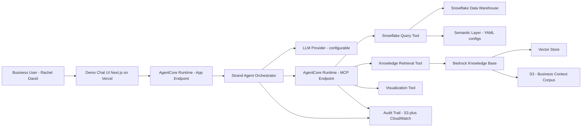
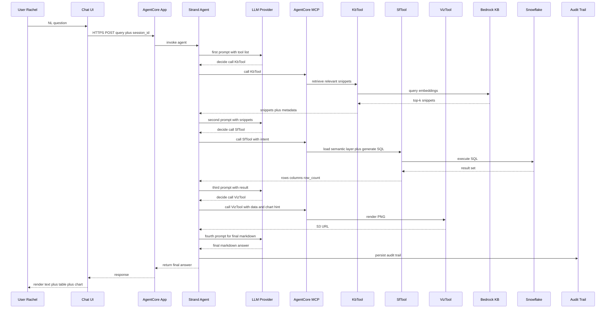
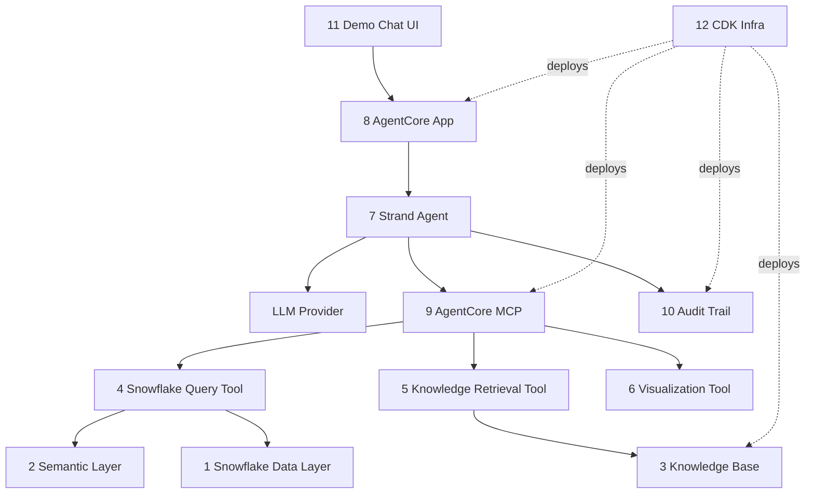
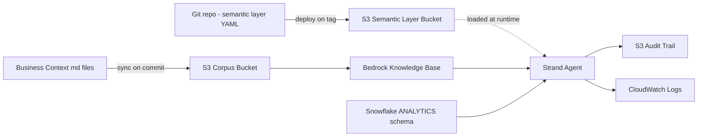

# 04 — 架构与技术栈

## 一、系统架构总览

本项目的高层架构骨架沿用 Offer Forge 的 Snowflake BI Agent canonical architecture，不重新发明：



**读图要点**：
- 用户（Rachel Donovan 主使用，David Kowalski 次使用）从 Demo Chat UI 提自然语言问题
- UI 通过 HTTPS 调用 AgentCore Runtime - App Endpoint
- App Endpoint 后面跑 Strand Agent。Strand Agent 自己做 reasoning（调 LLM），需要外部能力时通过 MCP 协议调用 MCP Endpoint
- MCP Endpoint 是另一个 AgentCore Runtime 实例，托管三个 tool
- 数据从 Snowflake 读出（read-only），口径 grounding 由 semantic layer YAML + Bedrock Knowledge Base 联合提供
- 每次完整调用都写一条 audit trail 到 S3 + CloudWatch（合规硬要求 REQ-20）

### 请求 / 响应数据流（典型 P0 query）



每一步 tool 调用都会单独写一条 trace 到 audit trail，最终在 audit trail 看得到完整 NL→SQL→KB citation 的链路（详 REQ-20 / REQ-21）。

## 二、模块 / 组件拆分

| # | 模块 | 一句话职责 | 输入 | 输出 | 依赖 |
|---|------|-----------|------|------|------|
| 1 | **Snowflake Data Layer** | 存储所有业务表（ER 文档对应），提供 ANALYTICS schema 与 read-only service account | 业务表（已有）| SQL 查询结果 | 无（已有系统） |
| 2 | **Semantic Layer** | 用 YAML 表达 metric / dimension / time_window / glossary 的口径定义 | Maya 的指标公式 + business context §9 | YAML 文件，部署到 S3，MCP runtime 启动时 load | Snowflake schema 命名 |
| 3 | **Knowledge Base** | Bedrock Knowledge Base 托管的 business context corpus + 术语表 + 指标解释 | business context §1–9 文本切片 | 检索接口（retrieve / retrieve_and_generate）| S3 corpus bucket |
| 4 | **Snowflake Query Tool**（MCP）| 接收意图 → 拉 semantic layer → LLM 生成 SQL → 安全校验（只允许 SELECT）→ 执行 → 返回结果 | NL intent + session context | SQL string + columns + rows + row_count + warning | Snowflake、Semantic Layer |
| 5 | **Knowledge Retrieval Tool**（MCP）| 调用 Bedrock KB retrieve API | NL query + topK | snippet list + metadata | Bedrock KB |
| 6 | **Visualization Tool**（MCP）| 把数据 + chart type hint 渲染成 PNG，上传 S3 返回 URL | rows + chart_type | S3 URL | S3 viz bucket |
| 7 | **Strand Agent Orchestrator** | 理解 query → 决定调哪些 tool → 拼最终答复 | NL query + session history | final markdown + 可选 chart URL | LLM Provider, MCP tools |
| 8 | **AgentCore Runtime — App** | 托管 Strand Agent 进程；提供 HTTPS endpoint；管理 session state | UI 请求 | UI 响应 | Strand Agent |
| 9 | **AgentCore Runtime — MCP** | 托管 MCP server，统一暴露 3 个 tool | Strand Agent 的 tool call | tool 响应 | 3 个 MCP tool |
| 10 | **Audit Trail Store** | S3 + CloudWatch 双写；保留 7 年；每条记录可索引 | 每次 Strand Agent 完整调用的全链路 trace | 可被 audit query 检索的 JSON 行 | S3, CloudWatch Logs |
| 11 | **Demo Chat UI** | 简历向 demo 层（Next.js on Vercel）| NL 输入 | text + table + chart 渲染 | AgentCore App endpoint |
| 12 | **AWS CDK Infrastructure** | IaC 部署上述所有 AWS 资源 | CDK code | 部署的 AWS stack | AWS account |

### 模块间依赖



## 三、技术选型与理由

### 核心栈

| 维度 | 选型 | 版本 | 理由 |
|------|------|------|------|
| 数据仓库 | **Snowflake** | 已有 | NovaRisk 已经把 BI Data Mart 落 Snowflake 半年；列存 + 多 cluster + 半结构化（VARIANT）适合 BI agent 查询负载 |
| Agent 框架 | **Strand Agents** | 1.x stable（minor.patch 在 Doc 10 pin）| AWS 官方力推、与 Bedrock / AgentCore Runtime 集成最顺；decorator-based tool 定义；多 LLM provider 切换内置 |
| Agent 部署 | **AWS Bedrock AgentCore Runtime** | GA | 自带 session isolation、observability、identity；App / MCP 双 endpoint 部署模式统一 |
| RAG | **Amazon Bedrock Knowledge Base** | GA | 把数据接入、embedding、retrieval API 全包；最少 moving parts；vector store 后端 OpenSearch Serverless 与 S3 Vectors 作为候选，在 Doc 08 选定 |
| LLM (demo) | **OpenAI GPT-4.1 或 Google Gemini 2.5 Pro** | latest API | John Doe 个人 AWS 账户拿不到 Bedrock Claude，demo 走外部 API；通过 Strand 的 multi-provider 切换 |
| LLM (production) | **Anthropic Claude on Amazon Bedrock** | Sonnet 等级（具体版本由 Doc 10 选定）| NovaRisk 企业账户已有 Bedrock Claude 访问；Sonnet 平衡延迟与质量 |
| 编程语言 | **Python** | 3.12 | Strand / MCP SDK / CDK 都是 Python first |
| IaC | **AWS CDK Python** | CDK v2（≥ 2.150，patch 在 Doc 12 pin）| 同一种语言写 infra + app；类型安全；hiring manager 喜欢看到的 keyword |
| Demo UI | **Next.js + Vercel** | Next 15 | John Doe 独立 own 的简历向 demo 层；与企业前端解耦 |
| 区域 | **AWS us-east-1** | — | Bedrock 模型可用性最全；与 NovaRisk 现有 Snowflake / S3 同区，避免跨区流量费 |
| Eval 框架 | **pytest + 自定义 harness** | pytest ≥ 8.0 | 与 CI/CD（GitHub Actions）天然集成；不引入新工具 |
| 可视化 | **Plotly / matplotlib（在 Visualization Tool 内部）** | Plotly ≥ 5 / matplotlib ≥ 3.8（具体在 Doc 09）| 静态图渲染成 PNG 上传 S3；具体库选型在 Doc 09 决定 |

### 为什么 Snowflake 而不是 Redshift / BigQuery
NovaRisk 已经在 Snowflake 上运营半年，迁移成本与风险大于本项目收益。

### 为什么 Strand Agents 而不是 LangChain / LangGraph
- AWS 官方与 Bedrock / AgentCore 集成最完整
- Decorator-based tool 定义代码量少
- 简历上"Strand Agents on AgentCore Runtime"比 LangChain 更稀缺

### 为什么 AgentCore Runtime 而不是 ECS Fargate / Lambda
- 自带 session isolation / observability / identity，省去自建
- AWS 的企业级 agent 部署官方答案
- App + MCP 共用一种 runtime 形态，部署叙事统一

### 为什么 Bedrock Knowledge Base 而不是直接 OpenSearch / S3 Vectors
- 默认选 Bedrock KB 是因为它把数据接入、embedding、retrieval API 全包了，moving parts 最少
- OpenSearch Serverless / S3 Vectors 作为 vector store 后端候选，在 Doc 08 根据 corpus 大小与查询模式选定

### 为什么 AWS CDK 而不是 Terraform / SAM
- Python CDK 让 John Doe 用同一种语言写 infra + 应用代码
- 简历上"AWS CDK for production agent deployment"是常见 hiring 信号

## 四、数据架构概览

### 数据存储

| 层 | 内容 | 工具 |
|----|------|------|
| **业务数据** | 20 张业务表，sourced from business context ER 文档 | Snowflake schema `NOVARISK_PROD.RAW` + `STAGING` + `ANALYTICS`；**RAW / STAGING 已随 BI Data Mart 存在，本项目只新增 `ANALYTICS` schema**（三层划分细节在 Doc 06）|
| **指标定义** | semantic layer YAML（metric / dimension / time_window / glossary）| Git source-of-truth + S3 部署制品 |
| **背景知识** | business context §1–9 全文 + 术语表 + 指标解释 + ER 注释 | S3 corpus bucket → Bedrock KB |
| **Audit Trail** | 每次 agent 调用的完整 trace（NL → SQL → KB citation → rows）| S3 + CloudWatch Logs（7 年保留）|
| **Session 历史** | 多轮对话上下文 | AgentCore Runtime 自带 session store（90 天保留）|
| **Visualization 输出** | 渲染好的 PNG 图 | S3 viz bucket，pre-signed URL 暴露给 UI |
| **Secrets** | Snowflake credentials、LLM provider API key、KB ID | AWS Secrets Manager |
| **多租户隔离** | row access policy 限制 BI agent 的 read-only service account 只能读调用者授权范围内的 `client_institution_id`，防止 agent 跨客户机构读数（owner: Marcus）| Snowflake row access policy（与 §五 PII 脱敏、Demo UI SSO user_id 透传联动；策略细节在 Doc 06）|

### 数据流转路径



### 数据一致性策略
- **Snowflake**：单一 source-of-truth，agent 永远 read-only；事务一致性由 Snowflake 保障
- **Semantic Layer**：Git 是 source-of-truth，部署到 S3 时打 tag 版本号；MCP runtime 启动时拉指定 tag
- **Knowledge Base**：S3 corpus 改动后 Bedrock KB 自动重新 sync（用其 ingestion job），ingestion 完成前不切流量
- **Audit Trail**：写入失败必须 fail the request（合规要求，绝不能 best-effort）

## 五、全局设计约定

### 代码组织
```
novarisk-bi-agent/
├── cdk/                      # CDK Python stacks（Doc 12 详细）
├── agent/                    # Strand Agent 代码（Doc 10）
├── mcp/                      # MCP tools（Doc 09）
├── semantic_layer/           # YAML 配置（Doc 07）
├── kb_corpus/                # KB 上传的 markdown 切片（Doc 08）
├── eval/                     # pytest evaluation harness（Doc 14）
├── ui/                       # Next.js Demo Chat UI（Doc 13）
└── docs/                     # 5+9 篇文档（本项目）
```

### 通用设计模式
- **所有跨模块 I/O 用 Pydantic 校验**：MCP tool 的 input / output schema 一律 Pydantic class
- **MCP tool 无状态**：每次调用独立，状态由 Strand Agent / AgentCore session 维护
- **Audit trail 同步写**：写失败 fail request（参见上节）
- **Snowflake SQL 强制 SELECT**：MCP tool 内 SQL 安全校验拒绝任何非 SELECT 语句、拒绝 multi-statement
- **PII 不进 LLM context**：任何含 full_name / email 原文（KB 中可能存在的）的检索结果，在喂给 LLM 之前必须脱敏（保留 hash 前 6 位）

### 错误处理通用策略
- **可重试错误**（network、Bedrock throttling）：自动重试 2 次 + 指数退避
- **不可重试错误**（SQL 编译错、KB index 不存在、user 越权）：立即返回用户友好消息 + 落 audit trail
- **降级**：visualization Tool 失败 → 退化为 text + table；KB tool 失败 → 警告用户"未引用 KB 上下文，结果可能口径偏差"并继续

### 日志与监控统一方案
- **结构化 JSON 日志**，每行含 `trace_id` / `session_id` / `module` / `level` / `payload`
- **trace_id** 在 Strand Agent 入口生成，向下游所有 MCP tool 传递
- **CloudWatch Logs** 用 trace_id 串联整次 NL 调用涉及的所有 hop
- **CloudWatch Metrics**：每个 tool 的 latency / error rate / token usage / Snowflake credits

## 六、John Doe 的技术职责范围

John Doe（Analytics Engineer）在本项目中 own 三块：

| Owns | 不负责 |
|------|--------|
| **Semantic Layer**：metric / dimension / time_window / glossary YAML schema 与全部内容（Doc 07）| 不决定 YAML 部署机制（Wei + Marcus）|
| **Knowledge Base Corpus Engineering**：切分策略、metadata 设计、上传脚本（Doc 08）| 不决定 KB 后端（Kevin + Wei）|
| **Evaluation & Golden Set**：pytest harness、golden answer 数据集、accuracy 指标计算（Doc 14）| 不决定 CI/CD 触发（Wei）|

John Doe 跨模块的接口约定：

- 与 **Marcus**（Snowflake）：semantic layer 中的 `table` / `column` 字段必须与 Marcus 的 ANALYTICS view 完全一致；任何字段重命名走 PR + 跨 owner approval
- 与 **Kevin**（Strand Agent）：evaluation harness 暴露的 `run_agent(query)` 接口签名锁定；Kevin 修 prompt 时不改这个签名
- 与 **Wei**（CDK）：audit trail 的 schema 由 John Doe 提案，Wei 决定写入机制；落盘格式锁定后不再改
- 与 **Maya**（Senior Analyst）：semantic layer 中每条 metric YAML 必须 Maya 签字 review

## 七、实现文档规划

> **关于本节的范围说明**：本项目本轮交付**仅 Doc 01–05** 五篇基础文档。下表列出的 9 篇实现文档是"后续若继续展开会按这个清单写"的**标准骨架占位**，不代表本轮要交付，也**不预先标注**任何一篇为"P0 / 写更深"——每一篇的优先级与详细程度都留给未来选定具体方向后再决定。

| 编号 | 标题 | 一句话范围 | 对应模块 |
|------|------|------------|----------|
| 06 | Snowflake Data Layer | RAW / STAGING / ANALYTICS 三层 schema、表 DDL、加载策略、测试数据生成（迁移 business context §04 data generator）| 1 |
| 07 | Semantic Layer & Metric Definitions | metric / dimension / time_window / glossary 的 YAML schema 与全部内容、部署机制、版本管理 | 2 |
| 08 | Knowledge Base Corpus & Retrieval | business context 切分、metadata 设计、Bedrock KB 配置、retriever 调参、评估 Recall@k | 3 |
| 09 | MCP Server & Tools | MCP server 结构、Snowflake Query Tool / Knowledge Retrieval Tool / Visualization Tool 的 input/output Pydantic schema、错误处理枚举 | 4 / 5 / 6 / 9 |
| 10 | Strand Agent Orchestrator | system prompt 全文、tool registry、planner 策略、对话 state、guardrail、LLM provider 切换 | 7 |
| 11 | AgentCore Runtime Deployment | App / MCP 两个 endpoint 的配置、session、identity、autoscaling、observability hooks | 8 / 9 |
| 12 | AWS CDK Infrastructure | stack 拆分、IAM、网络、Secrets、CI/CD | 12 |
| 13 | Demo Chat UI (Next.js on Vercel) | 页面结构、API 协议、Session、Vercel 部署、错误状态 | 11 |
| 14 | Evaluation & Observability | golden set 构造、accuracy / hallucination / citation rate 评估、CloudWatch dashboard、告警 | 10 + 横切 |

实际项目展开实现文档时，**Doc 07 / 08 / 14 由 John Doe 主导**（semantic layer / KB corpus / evaluation 三块 own），**Doc 06（Snowflake Data Layer）是其上游依赖、由 Marcus own**；其余文档分配给 Kevin / Marcus / Wei，由 Priya 在 Sprint planning 时决定。
