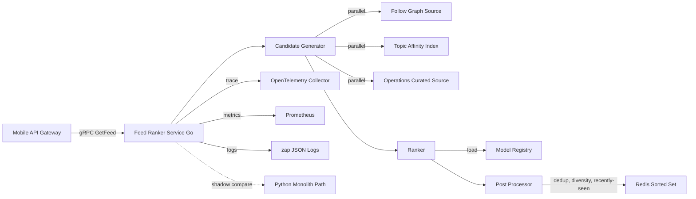

# 申请 Pulse Social 后端实习的 Feed 排序微服务设计

> 写作时间：2026 年 2 月，项目执行前。公司：Pulse Social（Seattle 总部，约 200 人，月活约 800 万的消费社交产品）。目标岗位：Backend Engineer Intern, Summer 2026，挂在 Platform Engineering 团队的 Feed Infrastructure 子组，向一位 Senior Backend Engineer 汇报。这是一份前瞻性项目设计文档，写于 2026 年 2 月、项目执行之前。等到夏天我真正进了 Pulse 把它做出来之后，执行版本会沉淀在 `../executed-case-cn.md` 里。这份文档既是我面试时的论点（说明我为什么有资格做这件事），也是入职头两周和 Mentor 对齐 scope 的初稿。

## 1. 一句话总结

我计划在 Pulse Social 12 周实习里，把 Home Feed 排序逻辑从那个 Python 单体里抽出来、重写成一个独立部署的 Go 微服务，对外暴露 gRPC 接口，按"候选生成 + 排序 + 后处理"三段可组合管道组织业务逻辑，先走两周 Shadow 部署，再按 1% / 5% / 25% 三档灰度上线，目标是在实习结束前把新服务推到 25% 真实流量、p99 延迟从单体的 220ms 压到 60ms 以内，并把数据科学团队"换一次模型"的工程税从一周压到几个小时。这份设计本身限定在排序这一条链路，不动单体的内容审核、不动 Snowflake 之外的任何数据源、不做多 agent 编排、不主动接管 A/B 测试平台。

---

## 2. 业务背景与公司

Pulse Social 是一家位于 Seattle 的消费社交产品，约 200 人规模，月活大约 800 万。它的主战场是 Home Feed，也就是用户打开 App 第一眼看到、然后不断下滑的那条帖子流。公司在 JD 里把自己定位成"不追 Meta scale，但要把 Feed 当成一门手艺做好"的那种玩家，意思是用更聚焦的工程投入，在消费社交这条赛道守住一个可防御的细分市场。这种公司气质对我这种 intern 是个好消息：项目 scope 通常足够具体，能在 12 周里 ship 真东西。

Home Feed 排在前面那几条帖子，决定用户是不是觉得"这个 App 越用越有意思"。决定这个顺序的程序叫 Feed Ranker（排序器）：它从所有可能展示的候选里挑出最相关的几条、打分、排序、再交给手机端。Ranker 的质量直接换算成用户每次会话停留时长、第二天回归率、以及最终的广告变现效率，是 Pulse 这种产品最贴近北极星指标的一段后端代码。

Pulse 内部的 Feed Ranker 是从一个 Python 单体里慢慢长出来的。所谓单体（Monolith），指的是所有功能都挤在同一份代码里、必须作为一个整体一起发布的大型应用。几年下来，排序逻辑、从数据库拉帖子的逻辑、内容审核的逻辑、几个早已没人记得 Owner 的实验代码全部纠缠在一起。这条单体路径现在的症状是可以预见的：高峰期 p99 延迟在 220ms 上下、想换一个新的排序模型要把整个单体一起重新部署、运行一套和排序毫无关系的、包含上百项检查的测试套件，然后人工盯灰度好几天。数据科学团队手里攒了一堆模型想法，但因为这个"发布税"太高，他们一直没法把这些想法上线。

后端 Tech Lead 在 Q4 2025 提出把排序部分从单体里抽出来、做成一个干净微服务的方案，并已经在 board 拿到了下一季度的人力预算。这就是我打算 propose 给我的 Mentor 作为暑期主项目的那块业务。

---

## 3. 触发事件

为什么是 2026 年夏天做这件事，而不是去年、也不是明年。背后有三股力量在同一个季度内凑齐，缺一不可。

第一股是单体延迟。p99 卡在 220ms 上下已经持续了 4 个季度，期间 Feed 的内容运营团队又新加了多样性后处理、敏感词过滤、和一组运营精选规则，每加一层延迟就再涨 5 到 15ms。再过两个季度，p99 会逼近 300ms，那时候用户口中的"刷不动"就会变成投诉量上涨。这是个工程债撞墙的明确信号，必须在 H1 2026 处理。

第二股是数据科学团队的发布频率瓶颈。Pulse 的数据科学团队从 2025 年下半年开始迭代节奏明显加快，按他们 OKR 里的目标是要在 H1 2026 上线至少 4 个新模型做 A/B 对比。但目前的现实是，每换一次模型，要后端工程师花差不多一周时间做对接、跑老单体那套上百项的测试、再人工盯灰度。一年下来"发布税"在数据科学团队的眼里就是一个"为什么要这么贵"的问号。这件事在 Q4 的全员会上被数据科学负责人提了出来，Tech Lead 接住了。

第三股是 leadership 给的明确 deadline。Tech Lead 在 2025 年 12 月的架构 review 里向 VP of Engineering 承诺，老单体的 Feed 路径会在 2027 年 Q1 退役，2026 年内必须有新服务跑到一定灰度比例并稳定运行。这条 deadline 让重写不再是一个"什么时候有空"的项目，而是被纳入了部门季度 OKR。

三股力量叠在一起，2026 年夏天就是这次重写最自然的执行窗口。我作为 intern 拿到的角色定位很关键：这不是一个边角实验，而是部门主押注之一，scope 已经被高层明确过、deadline 已经明确过。一个 intern Own 这件事的代价是：我能拿到远超职级常见水平的信任，但也要承担远超职级常见水平的责任。这是这次实习我打算押的赌。

---

## 4. 项目范围

范围这件事我会在入职头两周和 Mentor 一起再敲一遍。我现在先按对 JD 和已知情报的理解，把 in scope 和 out of scope 写到这份文档里，作为对话起点。这份"边界初稿"在 Cedar Ridge 那次实习里救过我至少一次（替我挡掉了 Floor Manager 一个超出 read-only 边界的请求），所以我会坚持先写下来再讨论。

In Scope（我计划要做的）：

- Home Feed 排序逻辑从 Python 单体里抽离，重写为独立部署的 Go 微服务。
- 三段可组合管道架构：Candidate Generator（候选生成）+ Ranker（排序）+ Post-Processor（后处理）。
- 对外 gRPC 接口，定义三个 RPC：GetFeed、RecordImpression、HealthCheck。
- 内部 Model Registry 抽象，让数据科学团队换模型不再需要后端介入。
- "最近见过"过滤用 Redis Sorted Set 实现，目标单次操作小于 1ms。
- Kubernetes Helm Chart 部署，HPA 同时挂 CPU 和 QPS 指标。
- 用 zap 做结构化 JSON 日志，按 Golden Signals 标准导出 Prometheus 指标。
- OpenTelemetry 链路追踪在每个阶段打通，目标是把 MTTR 从单体的小时级压到分钟级。
- AWS 双区域部署，前面挂 ALB 区域级 Load Balancer。
- 单元测试 + 集成测试，目标行覆盖率 80% 以上。
- k6 负载测试套件，回放两周生产流量并放大到 1.5 倍峰值。
- 两周 Shadow 部署 + 1% / 5% / 25% 三档灰度上线。

Out of Scope（明确不做的）：

- 排序模型本身的训练（数据科学团队的范围，我只 own 模型推理路径）。
- 单体里其他模块的拆分（内容审核、通知、用户图谱接口等都不动）。
- 全量切流到 100%（按 12 周时间表，最高推到 25%，剩下的留给下一季度）。
- A/B 测试平台的接管（A/B 框架已经有团队在 own，我只把新服务接进去）。
- Feed 业务规则改动（去重逻辑、多样性策略、黑名单逻辑沿用单体已有口径，不重新设计）。
- 新数据源接入（候选来源、特征数据全部沿用现有 PostgreSQL + Redis + Kafka 拓扑）。
- Cost optimization 深度调优（先跑通、跑稳，cost 留给下一阶段）。
- 跨地区扩展到 us-east 之外（当前只覆盖 us-west-2 和 us-east-1 两个区域，欧洲不考虑）。

Out of Scope 这一节我后来在 Cedar Ridge 那次实习里学到是最值钱的工作。Pulse 这个项目里我已经能预见到的 scope creep 至少有两个方向：一是数据科学团队会希望"既然你们都在重写了，能不能顺手把特征工程那一块也抽出来"，二是产品团队可能会希望"新服务能不能也接管推送排序"。这两件事我都会按 Out of Scope 挡掉，留给下一个季度。这是 12 周 intern 项目里 scope discipline 唯一可行的方式。

---

## 5. 团队与我的角色

我汇报给一位 Senior Backend Engineer（Feed Infra），ta 也是我的主 Mentor。Tech Lead 是 Mentor 的上级，会参与架构 review 和阶段 gate 评审。在架构决策上我打算和两位资深后端工程师 Pair 工作。

下面这张表是我对协作关系的预期。等真正入职后我会在第一周里和每位干系人对齐节奏，可能会调整。

| 角色 | 我和 ta 的预期接触频率 | ta 负责什么 |
| --- | --- | --- |
| Senior Backend Engineer / Mentor | 每天 30 分钟 1:1 + 每周 2 小时 design review | 架构决策、code review、把我从死胡同里拉出来 |
| Tech Lead | 每两周 1 次 status sync | Phase gate 审批、对 VP of Engineering 汇报 |
| Pair Backend Engineer A | 每周 2 次，每次 1 小时 | gRPC 契约、Helm chart 风格、和老单体的接口对齐 |
| Pair Backend Engineer B | 每周 1 次，每次 1 小时 | Kubernetes 平台、AWS 权限、观察 stack |
| Data Science Lead | 每周 1 次，每次 45 分钟 | Model Registry 接口、特征数据 schema、A/B 实验配置 |
| Mobile API Gateway Owner | 在 Phase 2 和 Phase 4 各一次 dry-run | gRPC 接口在客户端侧的接入路径 |
| SRE / Platform | 按需 | 双区域 Load Balancer、灰度配置、on-call 接入 |

每周节奏我打算照 Cedar Ridge 那套搬过来：周一团队 standup，周二和数据科学 sync，周三和 Pair A 配对，周四 design review 准备，周五 Mentor 1:1 加 design review。每次 design review 我会提前一天把"本周一个有 trade-off 的决策"写成一张一页 A4 的 design note 发给 Mentor。这种"一张纸的决策"格式我在 Cedar Ridge 那次实习里学到，对捋清自己的思路有奇效。

我明确不负责的事（边界很重要，写下来是为了在 Mentor 第一次找我聊范围时可以一起 review）：

- 不负责排序模型本身的算法设计（数据科学团队的范围）。
- 不负责架构选型的最终拍板（Tech Lead 已经定下来用 Go + gRPC + 三段管道，我在已选定的 stack 上构建）。
- 不负责老单体的下线计划（这是 Tech Lead 和 SRE 的事，我只把新服务推到 25% 灰度）。
- 不负责 SRE 平台层的改动（HPA 配置我写，但 EKS 集群本身由 SRE 团队 own）。
- 不负责 A/B 测试框架本身（我只把新服务作为 treatment arm 接进去）。

---

## 6. 我将做什么

这一节是整个 case 最长的部分。我把 12 周拆成 4 个 phase 来讲，每个 phase 里穿插架构决策、和具体执行的细节。先放整体架构图和时间线，下面文字按 phase 展开。

下面是 12 周拆 phase 的预期节奏。

| Phase | 周次 | 主线工作 | 出口标准 |
| --- | --- | --- | --- |
| Phase 0 调研对齐 | 第 1 到 2 周 | 读单体代码、和 Mentor 对齐 scope、写 Design Doc | Design Doc 签字 |
| Phase 1 骨架与契约 | 第 3 到 5 周 | gRPC 契约 + 三段管道骨架 + Helm Chart 雏形 | Staging 环境跑通端到端 |
| Phase 2 业务逻辑 | 第 6 到 8 周 | 三个候选来源 + Model Registry + Redis Sorted Set | 单元 + 集成测试 80% 行覆盖 |
| Phase 3 Shadow 与灰度 | 第 9 到 11 周 | Shadow 部署 + 1% / 5% / 25% 灰度 | 25% 灰度稳定 3 天 |
| Phase 4 收尾文档 | 第 12 周 | 写 Post-deployment Write-up + 文档归档 + 交接 | 文档签字、On-call 演练 |

### Phase 0（第 1 到 2 周）调研对齐

头两周我打算尽量少写代码、多读老单体。具体三件事。

第一件，把老单体的排序代码完整读一遍，画一张当前的请求流图。"重写"这件事最容易踩的雷是漏掉某个边角逻辑，新服务上线后某类用户的 Feed 突然空了。我会按"从入口函数追到所有 SQL 和 Redis 调用"这个粒度梳一遍，列出所有候选来源、所有过滤逻辑、所有特征字段。这份图会作为 Design Doc 的附录。

第二件，跟 Mentor 一起把 Out of Scope 这一节敲死。我会带着这份文档的范围草稿去找 Mentor，开一次 60 分钟的 scope review。预期里 Mentor 会增加一些我现在还想不到的边界（比如"不要碰广告排序"、"不要触发实验框架重构"），也可能会缩小我现在写的 in scope（比如"双区域留到下一季度"）。

第三件，和数据科学团队的 Lead 对齐 Model Registry 的接口。这一件事如果在 Phase 0 没敲下来，Phase 2 写 Ranker 的时候会卡住。我会带一份"我打算让 Model Registry 长什么样"的草稿过去，让数据科学团队 review，确保新接口能覆盖他们手头攒着的那 4 个候选模型的格式。

Phase 0 的预期输出是一份 Design Doc，包含范围、架构图、gRPC 契约草稿、风险登记表、12 周时间线。这份 Doc 我打算让 Mentor 改两版、Tech Lead 改一版、再让 Pair A 和 Pair B 各 review 一轮。如果 Phase 0 末没拿到这份签字，Phase 1 就不开工。

### Phase 1（第 3 到 5 周）骨架与契约

主体工作三件事。

第一件，gRPC 契约落地。我打算用 Protocol Buffers 定义三个 RPC（GetFeed、RecordImpression、HealthCheck），每个 RPC 的请求和响应字段都写注释，明确字段语义。GetFeed 接口要支持"分页 token"和"实验分组 ID"，因为客户端会用同一个接口同时取 baseline 和 treatment 两组结果。

第二件，三段管道骨架先搭起来，但里面只放占位逻辑。Candidate Generator 先返回写死的 100 条候选；Ranker 先按 ID 升序排；Post-Processor 先只做去重。骨架的意义是让 gRPC 接口先跑通，让客户端团队可以提前接入。

第三件，Helm Chart 雏形 + Staging 环境部署。我打算先在 SRE 提供的 staging EKS 集群跑起来，HPA 先不挂指标，scale 写死为 2 个 pod。这一阶段的目标是让"端到端一次请求能跑通并且能在 OpenTelemetry 里看到完整 trace"。

Phase 1 的难点不在代码量，在和客户端团队对齐 gRPC 契约。我会在第 4 周初安排一次"契约 review"，把 Mobile API Gateway Owner、数据科学 Lead、Admin 工具 owner 一起拉到一个 60 分钟的会议里，把契约从头讨论一遍。我打算把每个字段的语义写在 proto 注释里，会上每个字段过一遍，没人反对就标记 lock。一旦 lock 之后，后续改动需要走变更流程。这是我从 Cedar Ridge 那次 semantic layer review 学到的做法。

### Phase 2（第 6 到 8 周）业务逻辑

主体工作三件事，对应三段管道里的核心业务。

第一件，Candidate Generator 三个来源接入。第一个来源是 Follow Graph（关注图谱）：从 PostgreSQL 拉用户关注的人最近 7 天发的帖子，最多 500 条。第二个来源是 Topic Affinity（主题亲和度）：从 Redis 拉用户的 top 5 主题，对每个主题取 top 100 帖子。第三个来源是 Operations Curated（运营精选）：从一个内容运营团队维护的 Kafka topic 消费，目标是让内容团队的小流量精选可以在分钟级生效。三个来源并行执行、各自最多返回几百条候选、然后合并去重。每个来源都实现同一个 Go 接口（包含 `Fetch(ctx, userID) []Candidate` 方法），这样将来加新来源是改一个文件的事。

第二件，Ranker 接 Model Registry。我打算让 Ranker 的接口保持极小：输入一组候选，输出一组带分的候选。模型本体可以是简单的逻辑回归、可以是 GBDT、可以是 TensorFlow Serving，对 Ranker 而言都是黑盒。Model Registry 是一个内部服务，给定模型 ID 返回模型的 endpoint，Ranker 通过 gRPC 调用拉分数。这个抽象的目的是让数据科学团队"换一次模型"完全不再碰后端代码。

第三件，Post-Processor 写完整。包含去重、黑名单过滤、多样性策略、"最近见过"过滤。"最近见过"用 Redis Sorted Set 实现：每条帖子 ID 作为 member、impression 时间作为 score，每次 GetFeed 时先 `ZRANGEBYSCORE` 拉最近 24 小时记录、过滤掉用户最近见过的帖子。这一步的目标是单次操作小于 1ms，要在压测里专门验证。

Phase 2 的关键不是代码量，是测试覆盖率。我打算每个候选来源都写单元测试（mock 上游数据源）+ 集成测试（连真实 staging 数据），Post-Processor 的每个策略都单独测，行覆盖率目标 80% 以上。Cedar Ridge 那次实习里 84% 行覆盖在 Phase 4 灰度时救过我一次（某个边界条件被测试抓到），我打算把这个习惯带过来。

### Phase 3（第 9 到 11 周）Shadow 与灰度

主体工作两件事。

第一件，两周 Shadow 部署。Shadow 部署的意思是：新服务和老服务并行跑，把真实生产流量同时发给新服务，但新服务的响应直接扔掉，给用户的仍然是老服务的返回。这样可以在不影响用户的前提下，用真实流量去测延迟、错误率和输出差异。我会写一个离线 diff 任务，对比两边返回的 Feed，把差异大到值得人工排查的 case 标出来。

预期里 Shadow 会抓到至少两类问题。第一类是冷启动问题：全新注册的用户没有关注、没有主题历史，候选生成会返回空。我打算预先在 Candidate Generator 里加一个"运营冷启动"兜底逻辑，但具体阈值要等真实流量跑出来再调。第二类是长尾延迟：某些用户的特征拉取会走慢路径，模型调用偶尔会超过 200ms。我打算在 Ranker 里加一个单次请求的预算限制 + 并行化特征拉取，但具体怎么并行要看真实 trace 的形状。

第二件，1% / 5% / 25% 三档灰度。每一档先压平一段时间、盯几天 Dashboard、确认延迟、错误率和业务指标都干净了，才推下一档。我和 Mentor 在 Design Doc 里会先约定：无论指标看起来多漂亮，都不在同一天连推两档，因为最严重的事故往往是在变更后一两天、流量结构变化之后才浮出来。25% 这个数字是我对 12 周时间表的现实估计，再激进的灰度推到实习结束就来不及做 on-call 演练了。

### Phase 4（第 12 周）收尾文档

最后一周不写新代码，三件事。

第一件，写 Post-deployment Write-up：包含架构最终态、每个 Phase 的关键决策、所有遗留 TODO、下一任接手的 onboarding checklist。这份 Write-up 是给"6 个月后来接手的工程师"看的。

第二件，On-call 演练。按 JD 里"最后两周参与基本 on-call"的要求，我会和 Pair A 一起做两次模拟事故演练，确保我能独立处理一些常见的告警（pod OOM、Redis 连接池满、模型 endpoint 超时）。

第三件，技术债清单。Phase 2 和 Phase 3 里我预期会留一些"先标 TODO，等灰度稳了再回来"的临时方案。这些 TODO 我会在第 12 周集中清一遍，清不掉的写进交接 Doc。Cedar Ridge 那次实习里我吃过这个亏（最后一周被 UAT 反馈占满，TODO 没清完），这次我打算每个 Phase 末尾就清一次。

---

## 7. 关键技术决策回放

挑 6 个最有 trade-off 的决策，每一条我都试着把"为什么不选另一边"讲清楚。Pulse 这种 12 周 intern 项目，面试官几乎一定会问"为什么不用 X"，所以我现在就把答案写下来。

### 7.1 为什么选 Go 不选 Rust

Go 和 Rust 都能干这件事。Rust 的性能上限更高、内存安全更强，但学习曲线陡、生态对 gRPC + Kubernetes 集成不如 Go 成熟。Go 的优势是：第一，Pulse 内部已经在用 Go，团队 review 我的代码不需要切换 mental model；第二，Go 的 GC 在 Feed 这种 sub-100ms 服务里完全够用，p99 60ms 的目标 Go 的 GC pause 不会成为瓶颈；第三，作为 intern 在 12 周里学 Rust 还要 ship 生产代码，bus factor 太低。我和 Mentor 在 Phase 0 会再确认一遍这个选型，但 JD 里明确写了"Go 是我们用的"，这是一个被锁定的约束。

### 7.2 为什么三段可组合管道，不做单一 Ranker

直觉上把所有逻辑放在一个 Ranker 函数里写起来更快，但 trade-off 是后续维护成本会指数级上升。三段管道（Candidate Generator + Ranker + Post-Processor）的设计是：每一段都可以独立推理、独立测试、独立替换。预期里数据科学团队只会动 Ranker、内容运营团队只会动 Post-Processor 的多样性策略、后端团队只会动 Candidate Generator 的来源。三个角色互不踩脚。这种分层在 12 周的 scope 里看起来"过度设计"，但它换来的是 Phase 2 之后的并行开发可能性，以及更干净的 trace 归因路径。

### 7.3 为什么 gRPC 不用 REST

REST + JSON 是更通用的选择，社区案例多。但 gRPC 在内部服务之间有三个优势：第一，Protocol Buffers 的类型校验比 JSON Schema 严格得多，契约一旦 lock 之后客户端和服务端编译期就能发现不匹配；第二，gRPC 的二进制编码比 JSON 小 30% 到 50%，对每秒几千个请求的内部服务延迟收益显著；第三，gRPC 原生支持 streaming，留作未来扩展（比如 RecordImpression 改成 client-side streaming）。trade-off 是 gRPC 调试比 REST 麻烦（不能直接用 curl），但 Pulse 内部已经标准化了 gRPC 工具链，这个成本可以摊销。

### 7.4 为什么用 Helm 不直接写 Kubernetes Manifests

直接写 YAML manifests 是最低抽象的方式，但 trade-off 是环境差异（staging / production / 双区域）的管理会非常痛苦。Helm Chart 把环境差异抽成 values.yaml，一份 chart 可以渲染出四套不同环境的 manifest。Pulse 内部已经标准化了 Helm 作为部署单元，我作为 intern 用团队既有工具是 scope discipline 的体现。Kustomize 我考虑过，但 Pulse 没有现成的 Kustomize template，引入需要先和 SRE 对齐，12 周窗口拿不出来。

### 7.5 为什么先 Shadow 两周再灰度，不直接 1% 灰度

直接 1% 灰度看起来更快，但 trade-off 是把"新服务到底对不对"和"延迟错误率"两件事的归因纠缠在一起。Shadow 部署的价值是：真实生产流量进新服务、新服务的响应被丢弃、用户完全不受影响。一旦 Shadow 阶段抓到 bug，可以从容修复、再来一轮，不用走任何回滚流程。两周这个长度是我对"足够多种类流量形状"和"intern 时间预算"之间的平衡。预期里 Shadow 第一周会抓到至少 1 个真实 bug（基于 Cedar Ridge 那次实习里 Shadow 部署的经验），第二周会浮出至少 1 个长尾延迟问题。

### 7.6 为什么 Model Registry 接口设计得极小

Ranker 调 Model Registry 的接口只有"输入候选 list、输出带分候选 list"。我刻意不暴露模型特征工程、不暴露模型版本管理、不暴露 A/B 实验配置。trade-off 是 Ranker 调用方需要自己处理这些事情，但收益是数据科学团队换一次模型不再需要后端介入。Cedar Ridge 那次实习里我学到一条原则："抽象不嫌薄，嫌厚"。Mentor 那边可能会推我把接口做得更复杂一点（比如把 A/B 分组逻辑也吃进 Model Registry），我会在 Phase 0 design review 里据理力争"先薄、再厚"。

---

## 8. 预期产出与指标

每一条指标我都写了"打算怎么测"，因为面试时会被追问"你怎么知道你做到了"。

| 指标 | 目标 | 测量方式 | 备注 |
| --- | --- | --- | --- |
| 双区域峰值 QPS | 4,500 | CloudWatch metrics aggregation，取 7 天滚动峰值 | HPA 在此压力下应仍有约 50% 余量 |
| 端到端 p99 延迟 | < 60ms | OpenTelemetry trace 末段统计 | 不含网络出口；单体基线 220ms |
| A/B 测试会话时长提升 | +5% 或以上，p<0.05 | 接入既有 A/B 框架，2 周观察窗口 | 主要驱动力预期是多样性后处理 |
| 灰度比例 | 25% | SRE 灰度配置 + 实际流量监控 | 12 周时间表的现实目标 |
| 行测试覆盖率 | > 80% | Go 自带 cover 工具 | Phase 2 末验收 |
| Shadow diff 收敛率 | > 99% | 离线 diff 任务，每日跑 | Phase 3 末验收 |
| 模型发布工程税 | < 4 小时 | 数据科学团队自助换模型耗时 | 单体基线约 1 周 |
| MTTR | 减少 40% 或以上 | 事故时间统计 | 团队归因为分阶段 trace 让根因定位更快 |

需要诚实标注的边界：这些指标里"A/B 测试会话时长 +5%"和"MTTR 减少 40%"这两条强依赖 Pulse 内部既有的 A/B 框架和事故统计口径，我没办法在自己代码里直接保证。如果实习结束时这两条没达成，原因可能是测量框架本身还没接好，而不是我服务的问题。我会在面试时把"我能 own 的指标"和"我依赖团队的指标"分开讲。

我具体打算交付的物件清单：

- Go 服务主体代码（预估 3,000 到 4,000 行）
- gRPC 契约 .proto 文件
- 三个候选来源各自的接口实现
- Model Registry client + 一个 mock model 用于本地开发
- Helm Chart（含 staging / production 两套 values.yaml）
- HPA + PDB + ServiceMonitor 配置
- 单元测试 + 集成测试 + k6 负载测试用例
- Shadow diff 任务的离线脚本
- 一份 Design Doc（Phase 0 末）
- 一份 Post-deployment Write-up（Phase 4 末）
- 一份 on-call runbook + 常见告警的处理流程
- 一份给下一任接手的 onboarding checklist

---

## 9. 技术栈

| 层 | 计划用什么 |
| --- | --- |
| 语言 | Go 1.22 |
| 接口 | gRPC + Protocol Buffers |
| 缓存 | Redis（AWS ElastiCache，用 Sorted Set 做"最近见过"） |
| 消息队列 | Apache Kafka（消费内容运营 topic） |
| 数据库 | PostgreSQL（AWS RDS，用于读取关注图谱） |
| 容器编排 | Kubernetes（AWS EKS） + Helm |
| 容器镜像 | Docker + GitHub Container Registry |
| 云平台 | AWS（EKS、ElastiCache、RDS、ALB、双区域 us-west-2 + us-east-1） |
| 观察 | Prometheus（metrics） + Grafana（dashboard） + OpenTelemetry（trace） |
| 日志 | zap（结构化 JSON）|
| 测试 | Go 自带 testing + testify，k6 做负载测试 |
| CI/CD | GitHub Actions |
| Infra-as-code | Helm Chart 主导，Terraform 配 ElastiCache 和 RDS（如果需要新建实例） |

需要补一句：AWS infra 大部分已经存在，我作为 intern 主要是写 Helm Chart 和 Kafka consumer 这一层，不打算动 EKS 集群本身的配置。这是 SRE 团队的范围。

---

## 10. 风险与缓解

这一节列我现在能预见的 6 类风险和我打算怎么应对。这一节替换了 Cedar Ridge 那份 case 里的"反思与遗留"，因为项目还没做、没有反思可写。

### 10.1 老单体里有未被发现的隐藏业务规则

最大的风险。重写一个长期演化的系统，最容易踩的雷是漏掉某段没人记得 Owner 的边界逻辑，新服务上线后某类用户的 Feed 突然空了或者突然多了重复内容。缓解策略是：第一，Phase 0 投入两周读单体代码，列出所有候选来源和过滤逻辑；第二，Phase 3 用两周 Shadow 部署，离线 diff 抓出新老服务返回的差异；第三，灰度从 1% 起步，每档观察 3 天以上，给自己留足回滚窗口。

### 10.2 数据科学团队的 Model Registry 接口对齐失败

如果 Phase 0 没把 Model Registry 接口和数据科学团队对齐死，Phase 2 写 Ranker 时会卡壳。最坏情况是接口设计完全不能覆盖他们手头攒的模型格式，要返工 Ranker 那一段。缓解策略是：第一，Phase 0 第一周就和数据科学 Lead 开 60 分钟 sync，带草稿过去 review；第二，让数据科学团队先把他们手头那 4 个候选模型的输入输出 schema 给我，我按"最复杂的那个"设计接口；第三，Phase 2 写 Ranker 时先用 mock model 跑通端到端，再接真实 model registry。

### 10.3 双区域部署的 cross-region 一致性

部署到 us-west-2 和 us-east-1 两个区域之后，"最近见过"过滤的 Redis Sorted Set 在两个区域是不同步的。一个用户的请求可能轮询打到不同区域，结果出现重复推荐。缓解策略是：第一，先确认 Pulse 现有 Load Balancer 是不是 session-affinity（如果是，用户请求会黏在同一区域，问题不存在）；第二，如果是 round-robin，要在 Phase 1 design review 时和 Mentor 讨论是不是把"最近见过"用 cross-region Redis Cluster；第三，如果跨区域同步成本太高，作为 fallback 把"最近见过"窗口从 24 小时缩到 1 小时，降低用户感知概率。

### 10.4 Shadow 部署带来的额外 infra 成本

Shadow 部署意味着 100% 流量同时打到新老两套服务，新服务的 infra 成本会在 Phase 3 那两周显著上升。如果团队对成本敏感，可能要求 Shadow 比例降到 10% 或 20%。缓解策略是：第一，Phase 0 就和 Mentor 对齐 Shadow 期间的 budget 预期；第二，如果 budget 紧，Shadow 比例可以分阶段升（先 10% 一周、再 50% 一周、再 100% 几天）；第三，Shadow 抓 bug 的边际效用其实从 50% 开始就在递减，10% 已经能覆盖大部分常见 corner case。

### 10.5 灰度 25% 推不动

12 周时间表里灰度推到 25% 是一个相对乐观的目标。如果 Phase 2 业务逻辑某一块超期、Phase 3 Shadow 抓到的 bug 比预期多、或者灰度某一档出现告警要回滚，25% 可能推不到。缓解策略是：第一，把 12 周时间表里每个 Phase 都留 buffer（Phase 1 三周、Phase 2 三周本来可以更紧），不在前期省时间；第二，灰度推不上去时降低目标到 5% 或 10%，重点放在"新服务能稳定运行"而不是"灰度比例数字"；第三，预先和 Mentor 对齐"如果 12 周末只到 5%，下一季度回来继续推"的预案，不让"必须达成 25%"绑架 Phase 3 的灰度节奏。

### 10.6 作为 intern 的范围被业务侧拉走

scope creep 几乎一定会发生。最常见的两类是：数据科学团队问"既然你们在重写，能不能顺手把特征工程那一块也抽出来"，产品团队问"新服务能不能也接管推送排序"。缓解策略是：第一，Phase 0 末把 Out of Scope 这一节写进 Design Doc 并让 Mentor 签字；第二，每次有新请求过来，引用 Design Doc 里 Out of Scope 那一条挡掉，记进 Phase 5+ backlog；第三，每两周 Tech Lead status sync 时主动汇报"本周拒绝了哪些 scope creep"，让 Tech Lead 知道我在守边界。Cedar Ridge 那次实习里这个动作救过我至少一次，我打算在 Pulse 继续坚持。

最后一件想说清楚的事：这份设计是我 2026 年 2 月在还没拿到 Pulse offer 之前写的。我对 Pulse 内部具体的代码结构、团队动态、deadline 节奏没有第一手信息，所有内容都基于 JD、对 Pulse 这种规模公司一般做法的合理推测、以及我自己 Cedar Ridge 实习里学到的工程节奏。如果我真的拿到 offer 入职、和 Mentor 第一周 sync 之后，这份文档大概率会调整范围、调整时间表、调整风险登记。但作为面试论点，它的目的是说明："我不是入职后等 Mentor 给我喂任务的 intern，我会带着自己的 design 去和 Mentor 对齐。"这是我对 Pulse 这条 JD 里反复出现的"comfort with a fast-moving small-team environment"那句话的回应。
