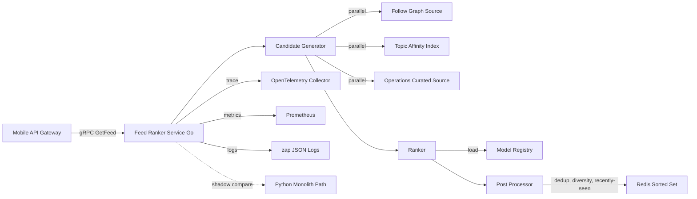

# Feed Ranking Microservice Design for the Pulse Social Backend Internship Application

> Written February 2026, before project execution. Company: Pulse Social (Seattle headquarters, around 200 people, a consumer social product with roughly 8 million monthly active users). Target role: Backend Engineer Intern, Summer 2026, on the Feed Infrastructure subgroup of the Platform Engineering team, reporting to a Senior Backend Engineer. This is a forward-looking project design document written in February 2026, before the project runs. Once I actually get into Pulse over the summer and build it, the executed version will live in `../executed-case.md`. This document serves both as my interview argument (why I am qualified to do this) and as a first draft to align on scope with my Mentor in the first two weeks on the job.

## 1. One-Sentence Summary

Over a 12-week Pulse Social internship, I plan to extract the Home Feed ranking logic from a Python monolith and rewrite it as an independently deployed Go microservice exposing a gRPC interface, organized as a three-stage composable pipeline (candidate generation, ranking, post-processing). I will run two weeks of Shadow deployment, then a 1 / 5 / 25 percent rollout. The targets are reaching 25 percent of real traffic by the end of the internship, p99 latency dropping from the monolith's 220ms to under 60ms, and reducing the data science team's "swap a model" engineering tax from a week to a few hours. The design is scoped to the ranking path. I will not touch the monolith's content moderation, will not add any data source beyond Snowflake, will not do multi-agent orchestration, and will not take over the A/B testing platform.

---

## 2. Business Context and Company

Pulse Social is a Seattle-based consumer social product, around 200 people, roughly 8 million monthly active users. Its main battleground is the Home Feed, the stream of posts users see and scroll the moment they open the app. The JD positions the company as "not chasing Meta scale, but treating Feed as a craft we want to do well." In other words, focused engineering investment to hold a defensible niche in consumer social. That company posture is good news for an intern like me: project scope is usually concrete enough to ship something real in 12 weeks.

The order of the top posts on the Home Feed determines whether users feel the app is getting better or worse. The program that decides that order is the Feed Ranker. It picks the most relevant candidates out of everything that could be shown, scores them, ranks them, and hands them back to the phone. Ranker quality translates directly into session length, next-day return rate, and ad monetization efficiency. It is the backend code closest to the North Star metric for a product like Pulse.

Inside Pulse, the Feed Ranker grew organically out of a Python monolith. A monolith is a large application where every feature lives in one codebase and has to ship as a single unit. After several years, the ranking logic, the post-fetching logic, the content moderation logic, and a handful of experiments with no remembered owner all became tangled together. The symptoms of this monolith path today are predictable: peak-hour p99 latency around 220ms, swapping in a new ranking model requires redeploying the whole monolith, running a hundreds-of-checks test suite unrelated to ranking, then watching the rollout manually for days. The data science team has a backlog of model ideas, but the "release tax" is so high they cannot ship them.

The backend Tech Lead proposed pulling ranking out of the monolith into a clean microservice in Q4 2025 and already secured next quarter's headcount budget from the board. That is the slice of work I plan to propose to my Mentor as my summer main project.

---

## 3. Trigger Event

Why summer 2026, and not last year or next year. Three forces converge in the same quarter, and you need all three.

The first is monolith latency. p99 has sat around 220ms for 4 quarters. During that time the Feed content operations team added a diversity post-processor, sensitive word filtering, and a set of operations-curated rules. Every added layer pushes latency another 5 to 15ms. Two more quarters from now, p99 will approach 300ms, at which point "the app feels stuck" will turn into rising complaint volume. That is a clear signal of engineering debt hitting a wall, and it has to be addressed in H1 2026.

The second is the data science team's release-frequency bottleneck. Pulse's data science team picked up pace in the second half of 2025. Their H1 2026 OKR is to ship at least 4 new models for A/B comparison. The current reality is that every model swap requires about a week of backend engineering work for the integration, plus running the old monolith's hundreds-of-checks test suite, plus babysitting the rollout. Over a year, the "release tax" looks like a "why is this so expensive" question mark to the data science team. The data science lead raised it at the Q4 all-hands, and the Tech Lead caught it.

The third is a hard leadership deadline. At the December 2025 architecture review, the Tech Lead committed to the VP of Engineering that the old monolith Feed path would be retired by Q1 2027, with a new service running at meaningful rollout percentage and stable performance within 2026. That deadline turned the rewrite from a "when we get to it" project into a department-quarter OKR.

Stack these three forces together, and summer 2026 is the natural execution window. My positioning as an intern in this matters. This is not a side experiment. It is one of the department's main bets, scope already approved at the leadership level, deadline already approved. The cost of an intern owning this is that I get trust well beyond what is normal for the level, but I also carry responsibility well beyond what is normal for the level. That is the bet I am placing on this internship.

---

## 4. Project Scope

I will revisit scope with my Mentor in the first two weeks on the job. For now, based on my read of the JD and known information, I am writing out in-scope and out-of-scope here as a conversation starter. This "boundary draft" saved me at least once during the Cedar Ridge internship (it blocked a Floor Manager request that exceeded my read-only boundary), so I will insist on writing it down before discussing.

In Scope (what I plan to do):

- Extract Home Feed ranking logic from the Python monolith and rewrite it as an independently deployed Go microservice.
- Three-stage composable pipeline architecture: Candidate Generator + Ranker + Post-Processor.
- External gRPC interface defining three RPCs: GetFeed, RecordImpression, HealthCheck.
- Internal Model Registry abstraction so the data science team can swap models without backend involvement.
- "Recently seen" filter implemented via Redis Sorted Set, targeting under 1ms per operation.
- Kubernetes Helm Chart deployment, with HPA tied to both CPU and QPS.
- Structured JSON logging via zap, Prometheus metrics following Golden Signals.
- OpenTelemetry tracing wired through every stage, targeting MTTR reduction from monolith's hour scale to minute scale.
- AWS dual-region deployment behind a regional ALB Load Balancer.
- Unit and integration tests, targeting 80 percent line coverage.
- k6 load test suite, replaying two weeks of production traffic at 1.5x peak.
- Two-week Shadow deployment plus 1 / 5 / 25 percent rollout.

Out of Scope (explicitly not doing):

- Ranking model training itself (data science team's scope. I only own the inference path).
- Other module extraction from the monolith (content moderation, notifications, user graph interfaces all untouched).
- Full 100 percent traffic cutover (per the 12-week schedule, top out at 25 percent and leave the rest to next quarter).
- Taking over the A/B testing platform (another team owns the A/B framework. I just plug the new service in).
- Feed business rule changes (dedup logic, diversity policy, blocklist logic reuse the monolith's existing definitions, no redesign).
- New data source onboarding (candidate sources and feature data all reuse the existing PostgreSQL plus Redis plus Kafka topology).
- Deep cost optimization (ship it, stabilize it, push cost optimization to the next phase).
- Cross-region expansion beyond us-east (currently only us-west-2 and us-east-1. Europe is not on the table).

The Out of Scope section was the most valuable work I learned to do during Cedar Ridge. For this Pulse project I can already predict at least two directions of scope creep. One is the data science team asking "since you are already rewriting, can you also pull feature engineering out." The other is the product team asking "can the new service also take over push ranking." I will block both via Out of Scope and push them to next quarter. That is the only realistic way to maintain scope discipline in a 12-week intern project.

---

## 5. Team and My Role

I report to a Senior Backend Engineer (Feed Infra) who is also my primary Mentor. The Tech Lead is my Mentor's manager and will participate in architecture reviews and phase gate evaluations. On architecture decisions I plan to pair with two senior backend engineers.

The table below is my expected collaboration pattern. After actually starting, I will align cadence with each stakeholder in the first week and may adjust.

| Role | Expected contact cadence | What they own |
| --- | --- | --- |
| Senior Backend Engineer / Mentor | Daily 30-minute 1:1 plus weekly 2-hour design review | Architecture decisions, code review, pulling me out of dead ends |
| Tech Lead | Every 2 weeks 1 status sync | Phase gate approval, reporting up to VP of Engineering |
| Pair Backend Engineer A | Twice a week, 1 hour each | gRPC contract, Helm chart style, alignment with old monolith interface |
| Pair Backend Engineer B | Once a week, 1 hour | Kubernetes platform, AWS permissions, observability stack |
| Data Science Lead | Once a week, 45 minutes | Model Registry interface, feature data schema, A/B experiment config |
| Mobile API Gateway Owner | One dry-run in Phase 2 and one in Phase 4 | gRPC interface client-side integration path |
| SRE / Platform | As needed | Dual-region Load Balancer, rollout config, on-call onboarding |

For weekly cadence I plan to carry over the rhythm I used at Cedar Ridge: Monday team standup, Tuesday data science sync, Wednesday paired with Pair A, Thursday design review prep, Friday Mentor 1:1 plus design review. For each design review I will send my Mentor a one-page A4 design note titled "one trade-off decision this week" the day before. This "one-page decision" format I learned during Cedar Ridge does wonders for organizing my thinking.

What I am explicitly not responsible for (boundaries matter, writing them down lets us review together the first time my Mentor brings up scope):

- Not responsible for ranking model algorithm design itself (data science team's scope).
- Not responsible for final architecture selection (Tech Lead has already settled on Go + gRPC + three-stage pipeline. I build on top of the chosen stack).
- Not responsible for the old monolith shutdown plan (that is Tech Lead and SRE's job. I just push the new service to 25 percent rollout).
- Not responsible for SRE platform-layer changes (I write HPA config, but the EKS cluster itself is owned by the SRE team).
- Not responsible for the A/B testing framework itself (I just plug the new service in as the treatment arm).

---

## 6. What I Will Do

This is the longest section of the case. I split 12 weeks into 4 phases, weaving in architecture decisions and execution details. First the overall architecture diagram and timeline, then the text walks through each phase.

Below is the expected cadence of phase-splitting across 12 weeks.

| Phase | Weeks | Main work | Exit criteria |
| --- | --- | --- | --- |
| Phase 0 research and alignment | Weeks 1 to 2 | Read monolith code, align scope with Mentor, write Design Doc | Design Doc signed off |
| Phase 1 skeleton and contract | Weeks 3 to 5 | gRPC contract + three-stage pipeline skeleton + Helm Chart draft | End-to-end run in Staging |
| Phase 2 business logic | Weeks 6 to 8 | Three candidate sources + Model Registry + Redis Sorted Set | Unit + integration tests 80 percent line coverage |
| Phase 3 Shadow and rollout | Weeks 9 to 11 | Shadow deployment + 1 / 5 / 25 percent rollout | 25 percent rollout stable for 3 days |
| Phase 4 wrap-up and docs | Week 12 | Write Post-deployment Write-up + doc archive + handoff | Doc signed off, on-call drill complete |

### Phase 0 (Weeks 1 to 2) Research and Alignment

For the first two weeks I plan to write as little code as possible and read the old monolith. Three concrete things.

First, read the old monolith's ranking code in full and draw the current request flow diagram. The easiest landmine when rewriting is missing some edge logic, then after the new service goes live, some user category's Feed suddenly empties out. I will trace at the "from entry function to every SQL and Redis call" level, listing every candidate source, every filter, and every feature field. The diagram will be an appendix to the Design Doc.

Second, lock down the Out of Scope section together with my Mentor. I will bring this document's scope draft to my Mentor and run a 60-minute scope review. I expect my Mentor to add boundaries I cannot currently anticipate (such as "do not touch ad ranking" or "do not trigger experiment framework refactoring") and may shrink what I have written as in scope (such as "push dual-region to next quarter").

Third, align Model Registry interface with the data science team Lead. If this is not nailed down in Phase 0, writing the Ranker in Phase 2 will get stuck. I will bring a draft of "what I plan to make the Model Registry look like" for data science review, making sure the new interface covers the formats of the 4 candidate models they have queued up.

Phase 0's expected output is a Design Doc covering scope, architecture diagram, gRPC contract draft, risk register, and 12-week timeline. I plan to put it through two Mentor revisions, one Tech Lead revision, and one round of review each from Pair A and Pair B. If the sign-off is not in hand by end of Phase 0, Phase 1 does not start.

### Phase 1 (Weeks 3 to 5) Skeleton and Contract

Main work is three things.

First, gRPC contract landing. I plan to use Protocol Buffers to define three RPCs (GetFeed, RecordImpression, HealthCheck), with comments on every request and response field clarifying semantics. The GetFeed interface must support "pagination token" and "experiment group ID" because clients will use the same interface to fetch baseline and treatment results simultaneously.

Second, stand up the three-stage pipeline skeleton with only placeholder logic inside. Candidate Generator returns a hardcoded 100 candidates. Ranker sorts by ID ascending. Post-Processor only deduplicates. The point of the skeleton is to get the gRPC interface running so the client team can start integrating early.

Third, Helm Chart draft plus Staging deployment. I plan to first get it running on the staging EKS cluster SRE provides, with HPA initially unhooked from metrics and scale hardcoded to 2 pods. The goal of this stage is "one end-to-end request runs through and the complete trace shows up in OpenTelemetry."

The difficulty of Phase 1 is not code volume. It is aligning the gRPC contract with the client team. I will schedule a "contract review" early in Week 4, pulling the Mobile API Gateway Owner, data science Lead, and Admin tool owner into one 60-minute meeting to walk the contract end to end. I plan to put each field's semantics in proto comments, walk each field at the meeting, and lock it if no one objects. Once locked, subsequent changes go through a change process. I learned this from the Cedar Ridge semantic layer review.

### Phase 2 (Weeks 6 to 8) Business Logic

Main work is three things, corresponding to the core business logic in each of the three pipeline stages.

First, integrate three Candidate Generator sources. Source one is Follow Graph: pull posts from the past 7 days by users this user follows from PostgreSQL, capped at 500. Source two is Topic Affinity: pull this user's top 5 topics from Redis, then top 100 posts per topic. Source three is Operations Curated: consume from a Kafka topic maintained by the content operations team, so small-scale curated picks from the content team can take effect at minute granularity. The three sources run in parallel, each returning up to a few hundred candidates, then merge and deduplicate. Each source implements the same Go interface (containing the `Fetch(ctx, userID) []Candidate` method), so adding a new source later is a single-file change.

Second, wire Ranker to Model Registry. I plan to keep the Ranker interface extremely thin: take a list of candidates, return a list of scored candidates. The model itself could be simple logistic regression, GBDT, or TensorFlow Serving. To the Ranker, all are black boxes. The Model Registry is an internal service that, given a model ID, returns the model's endpoint. The Ranker pulls scores via gRPC. The point of this abstraction is to ensure the data science team can swap a model without touching backend code at all.

Third, write Post-Processor in full. Includes dedup, blocklist, diversity, and "recently seen" filtering. "Recently seen" uses Redis Sorted Set: each post ID as member, impression time as score. Every GetFeed first uses `ZRANGEBYSCORE` to pull the last 24 hours of records and filter out posts the user has recently seen. The target for this step is under 1ms per operation, validated in load tests.

The key in Phase 2 is not code volume. It is test coverage. I plan to write unit tests (mocking upstream data sources) plus integration tests (against real staging data) for each candidate source. Each Post-Processor policy gets its own test. Target line coverage 80 percent. At Cedar Ridge, 84 percent line coverage saved me once during Phase 4 rollout (an edge case caught by tests), so I am bringing the habit over.

### Phase 3 (Weeks 9 to 11) Shadow and Rollout

Main work is two things.

First, two-week Shadow deployment. Shadow deployment means the new service and the old service run in parallel. Real production traffic goes to the new service too, but the new service's response is thrown away. Users still get the old service's response. That lets us test latency, error rate, and output differences against real traffic without affecting users. I will write an offline diff job that compares the Feeds returned by both sides and flags cases where the difference is large enough to be worth human review.

I expect Shadow to catch at least two categories of issues. The first is cold-start: brand-new accounts with no follows and no topic history. Candidate generation returns empty. I plan to pre-add an "operations cold-start" fallback in Candidate Generator, but the specific threshold has to be tuned once real traffic runs. The second is long-tail latency: some users' feature fetches hit slow paths, and the model call occasionally exceeds 200ms. I plan to add a per-request budget cap plus parallelized feature fetching in the Ranker, but how to parallelize depends on the shape of real traces.

Second, 1 / 5 / 25 percent rollout. At each step let things settle for a while, watch dashboards for several days, confirm latency, error rate, and business metrics are clean, then push to the next step. My Mentor and I will agree in the Design Doc: no matter how good the numbers look, never push two steps in a single day. The worst incidents usually surface a day or two after a change, once traffic shape shifts. 25 percent is my realistic estimate for the 12-week schedule. Anything more aggressive does not leave time for on-call drills before the internship ends.

### Phase 4 (Week 12) Wrap-up and Docs

The final week has no new code, three things.

First, write the Post-deployment Write-up: covering the architecture's final state, key decisions in each Phase, all leftover TODOs, and an onboarding checklist for the next person taking over. This Write-up is written for "the engineer who picks this up 6 months from now."

Second, on-call drill. Per the JD's "participate in basic on-call in the final two weeks" requirement, I will run two simulated incident drills with Pair A to make sure I can independently handle common alerts (pod OOM, Redis connection pool full, model endpoint timeout).

Third, tech debt cleanup. In Phase 2 and Phase 3 I expect to leave some "mark TODO, come back once rollout stabilizes" temporary fixes. I will sweep them in Week 12 in one pass, with any I cannot finish going into the handoff Doc. I got burned by this at Cedar Ridge (the final week got consumed by UAT feedback, TODOs never finished). This time I plan to sweep at the end of each Phase.

---

## 7. Key Technical Decision Replay

Six decisions with the most trade-off. For each I tried to explain "why not the other side." For a 12-week Pulse intern project, the interviewer almost certainly will ask "why not X," so I want the answers written down now.

### 7.1 Why Go and Not Rust

Go and Rust could both do this. Rust has a higher performance ceiling and stronger memory safety, but the learning curve is steep and the ecosystem for gRPC plus Kubernetes integration is less mature than Go's. Go's advantages: first, Pulse already uses Go internally, so the team reviewing my code does not need to switch mental models; second, Go's GC is more than enough for a sub-100ms Feed service. At a p99 of 60ms, Go's GC pause will not be the bottleneck; third, learning Rust as an intern in 12 weeks while shipping production code has too low a bus factor. My Mentor and I will reconfirm this choice in Phase 0, but the JD clearly states "Go is what we use." That is a locked constraint.

### 7.2 Why a Three-Stage Composable Pipeline, Not a Single Ranker

Intuitively, putting all logic in one Ranker function is faster to write, but the trade-off is that maintenance cost will grow exponentially. The three-stage pipeline (Candidate Generator + Ranker + Post-Processor) is designed so each stage can be reasoned about, tested, and replaced in isolation. I expect the data science team to only touch Ranker, the content operations team to only touch Post-Processor's diversity policy, and the backend team to only touch Candidate Generator's sources. Three roles never step on each other. This layering looks "over-engineered" in a 12-week scope, but it buys parallel development possibilities after Phase 2 and a cleaner trace attribution path.

### 7.3 Why gRPC and Not REST

REST + JSON is the more general choice with more community examples. But gRPC has three advantages for service-to-service calls inside a backend: first, Protocol Buffers' type checking is much stricter than JSON Schema. Once the contract is locked, client and server detect mismatches at compile time; second, gRPC's binary encoding is 30 to 50 percent smaller than JSON, with significant latency gains for an internal service serving thousands of requests per second; third, gRPC natively supports streaming, leaving room for future extensions (such as turning RecordImpression into client-side streaming). The trade-off is gRPC is harder to debug than REST (you cannot just use curl), but Pulse has already standardized its gRPC tooling internally, so the cost is amortized.

### 7.4 Why Helm and Not Raw Kubernetes Manifests

Writing raw YAML manifests is the lowest-abstraction approach, but the trade-off is that managing environment differences (staging / production / dual-region) becomes painful. Helm Chart abstracts environment differences into values.yaml, so one chart can render four different sets of environment manifests. Pulse has already standardized on Helm as the deployment unit. Using the team's existing tooling as an intern reflects scope discipline. I considered Kustomize, but Pulse does not have ready Kustomize templates. Introducing it would require alignment with SRE first, which is not feasible in a 12-week window.

### 7.5 Why Shadow for Two Weeks Before Rollout, Not Direct 1 Percent Rollout

Direct 1 percent rollout looks faster, but the trade-off is that it conflates "is the new service correct" with "latency and error rate." The value of Shadow deployment is that real production traffic enters the new service, the new service's response is discarded, and users are completely unaffected. Once Shadow catches a bug, fix it calmly and run another round, no rollback flow needed. Two weeks balances "enough variety of traffic shape" against "intern time budget." I expect Shadow's first week to catch at least 1 real bug (based on Shadow deployment experience from Cedar Ridge), and the second week to surface at least 1 long-tail latency issue.

### 7.6 Why the Model Registry Interface Is Designed Extremely Thin

The Ranker's interface to Model Registry only does "take a candidate list, return a scored candidate list." I deliberately do not expose model feature engineering, do not expose model version management, and do not expose A/B experiment config. The trade-off is the Ranker caller has to handle these things, but the upside is that the data science team can swap a model without backend involvement. At Cedar Ridge I learned a principle: "abstractions can never be too thin, only too thick." My Mentor may push me to make the interface more complex (such as ingesting A/B grouping logic into Model Registry). I will argue in the Phase 0 design review for "thin first, thick later."

---

## 8. Expected Outputs and Metrics

For each metric I wrote down "how I plan to measure it," because in interviews I will be asked "how do you know you achieved it."

| Metric | Target | Measurement | Notes |
| --- | --- | --- | --- |
| Dual-region peak QPS | 4,500 | CloudWatch metrics aggregation, 7-day rolling peak | HPA should still have about 50 percent headroom at this load |
| End-to-end p99 latency | < 60ms | OpenTelemetry trace endpoint stats | Excludes network egress. Monolith baseline 220ms |
| A/B test session length improvement | +5 percent or more, p<0.05 | Plug into existing A/B framework, 2-week observation window | Main driver expected to be diversity post-processing |
| Rollout percentage | 25 percent | SRE rollout config + real traffic monitoring | Realistic target for the 12-week schedule |
| Line test coverage | > 80 percent | Go built-in cover tool | Phase 2 acceptance |
| Shadow diff convergence rate | > 99 percent | Offline diff job, daily run | Phase 3 acceptance |
| Model release engineering tax | < 4 hours | Data science team self-service model swap time | Monolith baseline about 1 week |
| MTTR | reduce by 40 percent or more | Incident duration stats | Team attributes to per-stage tracing making root cause faster |

A boundary I want to flag honestly: among these metrics, "A/B test session length +5 percent" and "MTTR reduction 40 percent" both depend heavily on Pulse's existing A/B framework and incident statistics conventions. I cannot guarantee them directly in my own code. If those two are not achieved by the end of the internship, the reason may be that the measurement framework was not fully connected, not that my service has a problem. I will separate "metrics I can own" from "metrics I depend on the team for" in interviews.

List of artifacts I plan to deliver:

- Go service main code (estimated 3,000 to 4,000 lines)
- gRPC contract .proto file
- Three candidate source interface implementations
- Model Registry client + a mock model for local development
- Helm Chart (with staging / production values.yaml sets)
- HPA + PDB + ServiceMonitor configs
- Unit + integration + k6 load test suite
- Shadow diff job offline script
- A Design Doc (end of Phase 0)
- A Post-deployment Write-up (end of Phase 4)
- An on-call runbook + common alert handling procedures
- An onboarding checklist for the next person

---

## 9. Tech Stack

| Layer | Planned tooling |
| --- | --- |
| Language | Go 1.22 |
| Interface | gRPC + Protocol Buffers |
| Cache | Redis (AWS ElastiCache, Sorted Set for "recently seen") |
| Message queue | Apache Kafka (consuming content operations topic) |
| Database | PostgreSQL (AWS RDS, for reading follow graph) |
| Container orchestration | Kubernetes (AWS EKS) + Helm |
| Container image | Docker + GitHub Container Registry |
| Cloud platform | AWS (EKS, ElastiCache, RDS, ALB, dual-region us-west-2 + us-east-1) |
| Observability | Prometheus (metrics) + Grafana (dashboard) + OpenTelemetry (trace) |
| Logging | zap (structured JSON) |
| Testing | Go built-in testing + testify, k6 for load testing |
| CI/CD | GitHub Actions |
| Infra-as-code | Helm Chart primary, Terraform for ElastiCache and RDS (if new instances are needed) |

One thing to add: most AWS infra already exists. As an intern I am mainly writing the Helm Chart and Kafka consumer layer. I do not plan to touch EKS cluster configuration itself. That is the SRE team's scope.

---

## 10. Risks and Mitigations

This section lists 6 categories of risk I can currently anticipate and how I plan to respond. It replaces the "reflection and leftover" section from the Cedar Ridge case, because the project has not happened and there are no reflections to write.

### 10.1 Hidden Business Rules in the Old Monolith That Have Not Been Discovered

The biggest risk. Rewriting a long-evolved system, the easiest landmine is missing some edge logic with no remembered owner. Then after the new service goes live, some user category's Feed suddenly empties out or shows duplicate content. Mitigation: first, invest two weeks in Phase 0 reading the monolith code, listing every candidate source and every filter; second, run two weeks of Shadow deployment in Phase 3, with offline diff catching differences between new and old service returns; third, rollout starts at 1 percent, observing at least 3 days per step, leaving rollback windows.

### 10.2 Data Science Team's Model Registry Interface Alignment Fails

If the Model Registry interface is not nailed down with the data science team in Phase 0, writing the Ranker in Phase 2 will get stuck. Worst case is the interface design completely fails to cover the model formats they have queued up, requiring Ranker rework. Mitigation: first, sync with the data science Lead in Week 1 of Phase 0 for 60 minutes, bringing a draft to review; second, have the data science team give me the input and output schemas of their 4 queued candidate models so I can design the interface around "the most complex one"; third, in Phase 2 use a mock model end-to-end first before connecting the real model registry.

### 10.3 Cross-Region Consistency in Dual-Region Deployment

After deploying to us-west-2 and us-east-1, the Redis Sorted Set backing "recently seen" filtering is not synchronized between regions. A user's requests may round-robin across regions, producing duplicate recommendations. Mitigation: first, confirm whether Pulse's existing Load Balancer uses session affinity (if so, requests stick to one region and the problem does not exist); second, if it is round-robin, discuss in the Phase 1 design review whether to back "recently seen" with cross-region Redis Cluster; third, if cross-region sync cost is too high, the fallback is to shrink the "recently seen" window from 24 hours to 1 hour, reducing user perception probability.

### 10.4 Additional Infra Cost From Shadow Deployment

Shadow deployment means 100 percent traffic is hitting both the new and old services simultaneously. New service infra cost will rise noticeably in the two weeks of Phase 3. If the team is cost-sensitive, Shadow percentage may need to drop to 10 percent or 20 percent. Mitigation: first, align Shadow-period budget expectations with my Mentor in Phase 0; second, if budget is tight, stage the Shadow percentage (10 percent for a week, then 50 percent for a week, then 100 percent for a few days); third, the marginal utility of Shadow bug catching actually starts diminishing at 50 percent. 10 percent already covers most common corner cases.

### 10.5 Rollout to 25 Percent Stalls

Pushing rollout to 25 percent in the 12-week schedule is a relatively optimistic target. If some Phase 2 business logic overruns, Shadow catches more bugs than expected in Phase 3, or some rollout step requires rollback after alerts, 25 percent may not be reachable. Mitigation: first, build buffer into every Phase in the 12-week schedule (Phase 1 three weeks and Phase 2 three weeks could be tighter, but I am not saving time up front); second, if rollout stalls, drop the target to 5 or 10 percent and focus on "new service runs stably" rather than "rollout percentage number"; third, pre-align with my Mentor on a "if we only reach 5 percent by end of 12 weeks, continue next quarter" contingency, so "must reach 25 percent" does not hijack the Phase 3 rollout cadence.

### 10.6 Intern Scope Being Pulled by the Business Side

Scope creep is almost guaranteed. The two most common are: the data science team asking "since you are rewriting, can you also pull feature engineering out," and the product team asking "can the new service also take over push ranking." Mitigation: first, end of Phase 0, get Out of Scope written into the Design Doc and signed off by my Mentor; second, whenever a new request comes in, cite the Out of Scope entry in the Design Doc to block it and log it in the Phase 5+ backlog; third, at every two-week Tech Lead status sync, proactively report "what scope creep I declined this week" so the Tech Lead knows I am guarding the boundary. This move saved me at least once at Cedar Ridge. I plan to keep it up at Pulse.

One last thing to make clear: this design was written in February 2026, before I had a Pulse offer. I have no first-hand information about Pulse's actual internal code structure, team dynamics, or deadline cadence. Everything is based on the JD, reasonable inference about how companies at Pulse's scale typically operate, and the engineering rhythm I learned at Cedar Ridge. If I actually get the offer, start, and sync with my Mentor in the first week, this document will almost certainly need scope, timeline, and risk register adjustments. As an interview argument, its purpose is to make clear: "I am not the kind of intern who waits for the Mentor to feed me tasks. I will show up with my own design and align it with my Mentor." That is my response to the line "comfort with a fast-moving small-team environment" that appears repeatedly in the Pulse JD.
