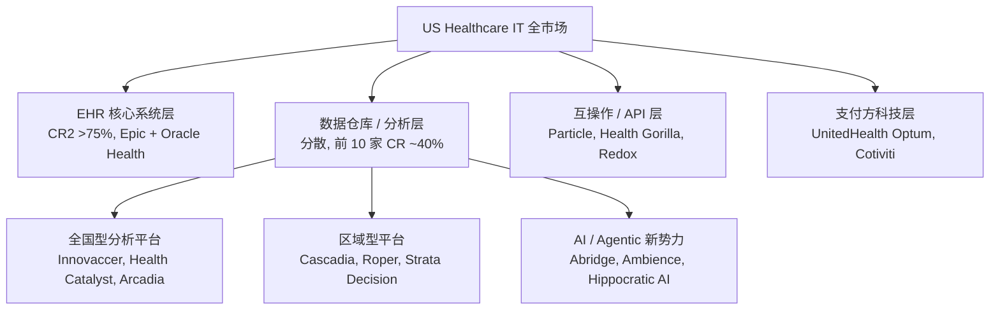
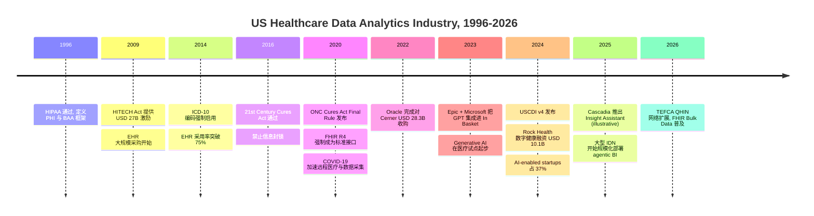
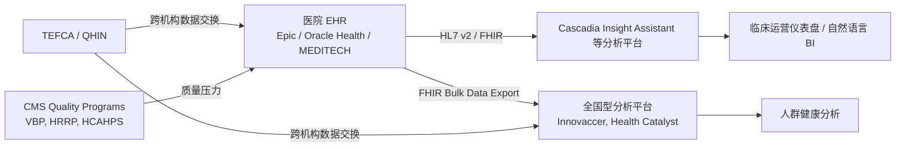
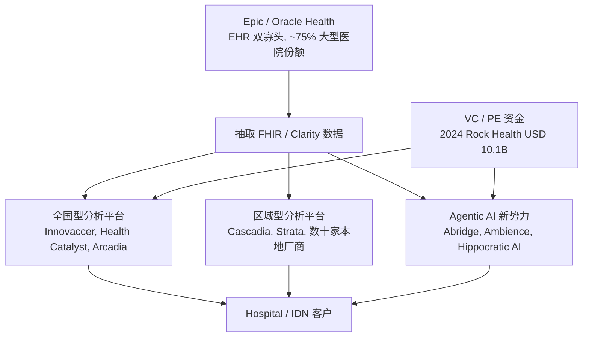
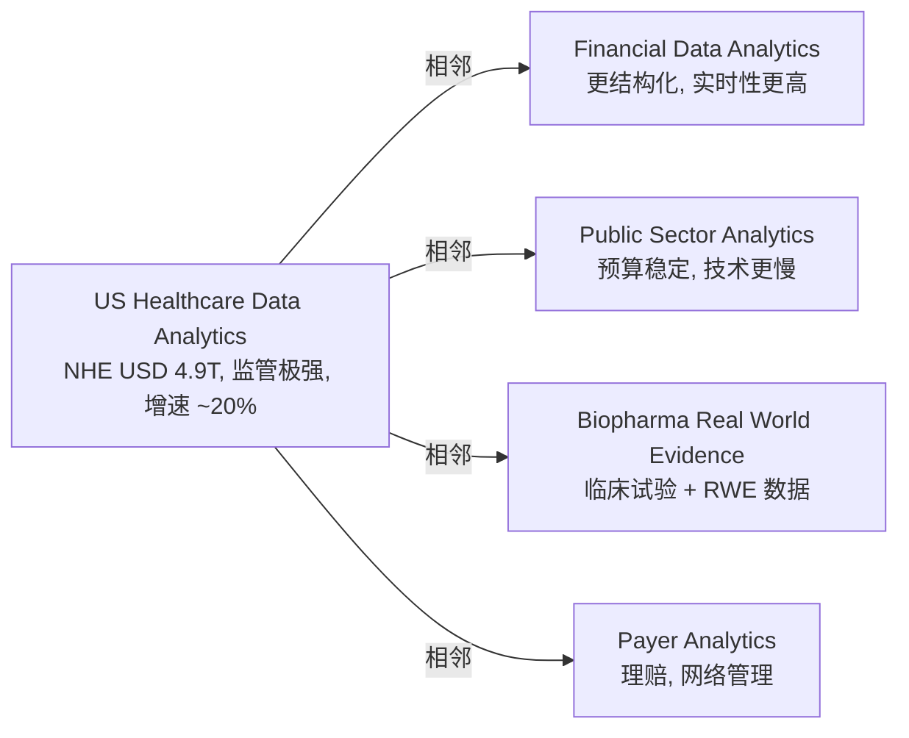

# US Healthcare Data Analytics 与 Digital Health Software Vendors 行业全景

本文从行业维度梳理美国医疗数据分析与数字健康软件供应商行业（US Healthcare Data Analytics / Digital Health Software Vendors），重点聚焦 Cascadia Health Insights 所在的"医院端临床运营数据分析 + Agentic BI 平台"赛道，以及嵌入其中的"Customer-Embedded Engineering / AI Solutions Engineering"职能板块。报告不评估某一家公司或某一个岗位的好坏，只输出可核查的事实与未来 3 至 5 年的方向性判断，供学生自行决策。

## 1. 行业定位：用一句话告诉一个大二学生

如果一个完全没接触过医疗的大二学生问"美国医疗数据分析行业到底在做什么"，最朴素的回答是：医院、诊所、保险公司每天会产生海量的电子病历（EHR）、检验、影像、计费、运营数据。这个行业的玩家就是"帮医疗机构把数据存起来、洗干净、分析出洞察、再做成产品卖回去"的软件公司。它的画风更像 SaaS 行业里的 Salesforce 之于销售部门、Workday 之于 HR 部门：B2B、订阅制、客户切换成本高、监管极重、但增长比传统 SaaS 更慢，因为客户（医院）本身买东西的速度就慢。

类比上更接近 2010 年前后的金融数据服务行业（Bloomberg、FactSet、S&P Capital IQ）的早期阶段：玩家有头部巨头（Epic、Oracle Health）和一批中型专业玩家（Innovaccer、Health Catalyst、Arcadia），加上一长串区域型供应商。区别在于，医疗行业的 IT 投入受 HIPAA（Health Insurance Portability and Accountability Act，美国 1996 年通过的医疗信息隐私与安全法）和 HITECH（Health Information Technology for Economic and Clinical Health Act，2009 年通过的 EHR 推广法）等多重监管钳制，节奏更慢、门槛更高 [1 - HIPAA Privacy Rule - HHS.gov](https://www.hhs.gov/hipaa/for-professionals/privacy/index.html) [2 - HITECH Act Enforcement Interim Final Rule - HHS.gov](https://www.hhs.gov/hipaa/for-professionals/special-topics/hitech-act-enforcement-interim-final-rule/index.html)。

行业边界上，本报告所指的 "US Healthcare Data Analytics / Digital Health Software" 覆盖以下范围：(1) 上游：监管机构 HHS（Department of Health and Human Services）、OCR（Office for Civil Rights，执行 HIPAA 隐私规则）、ONC（Office of the National Coordinator for Health IT，制定互操作性规则）、CMS（Centers for Medicare and Medicaid Services，最大单一支付方）、TJC（The Joint Commission，医院评审组织）；(2) 中游：软件供应商本体，按 NAICS 511210（Software Publishers）和 541512（Computer Systems Design Services）分类；(3) 下游：医院系统、IDN（Integrated Delivery Network，整合型医疗服务网络）、医师集团、健康保险公司（payer）、ACO（Accountable Care Organization，责任医疗组织）。本报告不涵盖纯医疗器械（Medtronic、Stryker）和纯生物制药（Pfizer、Moderna），但它们的数据需求会通过医院侧流回本行业。

与三个容易混淆的相邻行业的差异：与"Electronic Health Records / EHR 厂商"相比，EHR 是医院的核心交易系统（记录每一次门诊与住院），分析厂商在 EHR 之上做下游分析；与"Health Insurance Tech / Payer Tech"相比，payer 端关心的是理赔、风险评分、网络管理，provider 端关心的是临床运营、质量指标、患者结局；与"Population Health Management"相比，前者关注跨机构的人群健康，本行业的中游玩家更聚焦单家机构内部的运营效率与质量。

---

## 2. 行业商业逻辑：钱从哪里来，到哪里去

医疗数据分析厂商的钱主要从三条路赚来。第一条是"订阅费（Annual Subscription / ARR）"：医院每年为软件平台付一笔可预测的费用，覆盖核心 BI 仪表盘、数据仓库托管、标准报表。典型客户 ACV（Annual Contract Value，年合同价值）从小型诊所的几万美元到大型学术医学中心的数百万美元不等。Health Catalyst 2024 年报披露 ARR 为 USD 309.9 million，技术服务收入占总收入的 65% [3 - Health Catalyst 2024 Annual Report - Health Catalyst Investor Relations](https://ir.healthcatalyst.com/financial-information/annual-reports)。第二条是"按部署付费（Per-Deployment Fee）"：每开通一个新模块、上线一个新院区，按一次性 implementation fee 计。第三条是"专业服务（Professional Services）"：客户定制开发、咨询、培训、年度升级。专业服务的毛利通常低于纯 SaaS 收入，但在医疗行业是必需的，因为没有两家医院的工作流完全一样。Cascadia 自己的 ~$280M 年收入中，订阅制 SaaS 是主体，per-deployment fee 是 Insight Assistant 上线后新加入的增量收入项（Cascadia 2025 Annual Report, illustrative）。

谁最终在掏钱？三个口袋：医院 / IDN（最大单一客户群，付订阅和实施费）、医师集团和 ASC（Ambulatory Surgery Center，门诊手术中心，付较小订阅）、间接付费方（CMS、私营保险公司通过价值医疗合同把质量指标压力传导给医院，进而触发医院购买分析工具）。CMS 的 Value-Based Purchasing、HRRP（Hospital Readmissions Reduction Program）、HVBP 等支付改革直接推动了医院对运营分析工具的需求 [4 - Hospital Value-Based Purchasing Program - CMS.gov](https://www.cms.gov/medicare/quality/value-based-programs/hospital-purchasing)。

利润如何在价值链上分配？头部巨头（Epic、Oracle Health）捕获 EHR 层最大份额，分析层的中型玩家（Innovaccer、Health Catalyst、Arcadia）通过差异化产品在 EHR 之上找空间，区域型玩家（如 Cascadia）通过地理深度、客户关系、行业 know-how 守住区域市场。EHR 头部的毛利率（Gross Margin）通常在 60% 至 75% 区间，分析层中型玩家的毛利率因专业服务比例较高而落在 45% 至 60%。Health Catalyst 2024 GAAP gross margin 约 47%，Non-GAAP technology gross margin 接近 70% [3 - Health Catalyst 2024 Annual Report](https://ir.healthcatalyst.com/financial-information/annual-reports)。

结构性护城河有四层。第一层是"数据访问"。医院的临床数据存放在 EHR 系统里（Epic、Oracle Cerner、MEDITECH），从 EHR 抽取数据需要兼容专门的接口（HL7 v2、FHIR API、Epic Clarity / Caboodle 视图）。掌握抽取与映射能力本身就是壁垒。第二层是"合规与信任"。HIPAA Business Associate Agreement（BAA，业务伙伴协议）签订后，厂商承担与医院同等的患者数据保护责任，没有医院愿意频繁更换 BAA 对手方。第三层是"工作流嵌入"。一旦护士、医生、运营管理者把工具用进日常工作流，切换成本极高。第四层是"行业 know-how"。临床指标定义（例如 readmission rate 如何定义口径、ALOS / Average Length of Stay 如何排除 outlier）本身就是行业知识资产，区域型厂商往往凭这一点守住本地市场。

---

## 3. 行业体量、增长率与生命周期阶段

美国整体医疗 IT（Healthcare IT / HCIT）市场体量：Grand View Research 给出 2024 年市场规模约 USD 282 billion，预计 2030 年达到 USD 1,061 billion，2025-2030 年 CAGR 约 24.5% [5 - U.S. Healthcare IT Market Size Report 2030 - Grand View Research](https://www.grandviewresearch.com/industry-analysis/us-healthcare-it-market-report)。Fortune Business Insights 在 2024 年的口径稍有不同，估算全球 healthcare analytics 市场 2024 年约 USD 51 billion，2032 年达 USD 222 billion，CAGR 约 20% [6 - Healthcare Analytics Market Size Forecast 2032 - Fortune Business Insights](https://www.fortunebusinessinsights.com/industry-reports/healthcare-analytics-market-100657)。两个口径差异来自"healthcare IT"（含 EHR、PACS、telehealth、互操作等）与"healthcare analytics"（仅含 BI、数据仓库、AI 分析）的范围不同。

美国整体国家级医疗支出（NHE，National Health Expenditure）2023 年达到 USD 4.9 trillion，占 GDP 17.6%，CMS 预计 2032 年将达 USD 7.7 trillion [7 - National Health Expenditure Data - CMS.gov](https://www.cms.gov/data-research/statistics-trends-and-reports/national-health-expenditure-data/historical)。在如此巨大的支出盘里，IT 投入占比稳定上升。Becker's Hospital Review 数据显示美国医院 IT 支出占总运营预算约 4% 至 5%，头部学术医学中心可达 7% [8 - Hospital IT Spending Benchmarks - Becker's Hospital Review](https://www.beckershospitalreview.com/healthcare-information-technology/hospital-it-spending-benchmarks.html)。

集中度：在 EHR 层面非常集中。KLAS Research 的 2024 年报告显示 Epic 在大型医院（500+ 床位）市场份额超过 50%，加上 Oracle Health（前 Cerner）合计 CR2 在 acute care 市场超过 75% [9 - U.S. Hospital EMR Market Share 2024 - KLAS Research](https://klasresearch.com/report/us-hospital-emr-market-share-2024/3198)。但在分析层面集中度低得多，前 10 家分析厂商的合计份额估计在 35% 至 45%，剩下的 55% 至 65% 由区域型玩家瓜分（这是 Cascadia 所在的位置）。

生命周期判断：整体行业处于成长期（Growth）向成熟期（Mature）过渡，但 AI / Agentic Analytics 子赛道处于"早期成长期"（Early Growth）。依据有三：(1) EHR 渗透率已经接近饱和，2021 年非联邦急症照护医院的 certified EHR 采用率已达 96% [10 - National Trends in Hospital and Physician Adoption of Electronic Health Records - ONC](https://www.healthit.gov/data/quickstats/national-trends-hospital-and-physician-adoption-electronic-health-records)，这意味着核心交易系统市场已成熟；(2) 分析层市场仍有 20% 以上的年增长率 [6 - Healthcare Analytics Market - Fortune Business Insights](https://www.fortunebusinessinsights.com/industry-reports/healthcare-analytics-market-100657)，处于成长期；(3) Generative AI / Agentic BI 在医疗的应用从 2024 年才开始规模化部署，Rock Health 2024 报告显示数字健康行业当年融资 USD 10.1 billion，其中 37% 流向 AI-enabled startups [11 - Rock Health 2024 Year End Funding Report - Rock Health](https://rockhealth.com/insights/2024-year-end-market-overview-resilience-and-optimism/)，是典型的 emerging segment 信号。

---

## 4. 行业历史：从 HIPAA 到 Agentic AI 的关键节点

美国医疗数据软件行业的现代结构始于 1996 年 HIPAA 通过。HIPAA 第一次在联邦层面规定了 Protected Health Information（PHI，受保护的健康信息）的隐私与安全标准，并通过 Business Associate Agreement 机制把责任延伸到所有处理 PHI 的第三方厂商 [1 - HIPAA Privacy Rule - HHS.gov](https://www.hhs.gov/hipaa/for-professionals/privacy/index.html)。在此之前，医疗 IT 主要是医院 IT 部门自建系统，没有统一的法律框架来约束外部供应商。

2009 年 HITECH 法案是第二个关键节点。它由奥巴马政府的 American Recovery and Reinvestment Act（ARRA）打包通过，向医院和医生提供合计 USD 27 billion 的激励基金，用于采购和"有意义使用"（Meaningful Use）认证 EHR 系统 [2 - HITECH Act - HHS.gov](https://www.hhs.gov/hipaa/for-professionals/special-topics/hitech-act-enforcement-interim-final-rule/index.html) [10 - National Trends in EHR Adoption - ONC](https://www.healthit.gov/data/quickstats/national-trends-hospital-and-physician-adoption-electronic-health-records)。这一波直接催生了 Epic、Cerner（后被 Oracle 收购）的高速增长，也为下游分析市场铺好了"数据原料"。

2016 年 21st Century Cures Act 通过，进一步禁止"信息封锁"（Information Blocking），要求 EHR 厂商以标准化 API 把数据开放给授权第三方 [12 - 21st Century Cures Act - HHS.gov](https://www.hhs.gov/about/news/2016/12/13/secretary-burwell-statement-passage-21st-century-cures-act.html)。配套的 ONC Cures Act Final Rule 在 2020 年发布，强制要求医院与 EHR 厂商采用 FHIR R4（Fast Healthcare Interoperability Resources Release 4，医疗行业用来交换电子病历数据的现代 API 标准）作为标准数据交换格式 [13 - ONC Cures Act Final Rule - HealthIT.gov](https://www.healthit.gov/curesrule/)。这一刻是行业的"互操作分水岭"：在此之前数据被锁在 EHR 厂商手里，在此之后下游分析厂商可以用 FHIR API 直接抓取临床数据。

2023 年起 Generative AI 在医疗行业开始大规模试点。Epic 在 2023 年 4 月公布与 Microsoft 合作，把 GPT 模型集成进 In Basket（医生消息收件箱）用于自动起草回复 [14 - Epic and Microsoft Collaboration on Generative AI - Epic](https://www.epic.com/epic/post/epic-and-microsoft-bring-gpt-4-to-ehrs/)。同年 Nuance Communications（微软子公司）推出 DAX Copilot，把 ambient AI scribing 推向规模化应用。2024-2025 年涌现 Abridge、Ambience Healthcare、Hippocratic AI 等 AI-native startup，并获得数十亿美元融资 [11 - Rock Health 2024 Year End Funding Report](https://rockhealth.com/insights/2024-year-end-market-overview-resilience-and-optimism/)。Cascadia 在 2025 年 6 月推出 Insight Assistant，赶上的就是这一波 "Agentic BI in Healthcare" 的早期窗口（Cascadia 2025 Annual Report, illustrative）。

具体事件细节：Oracle 在 2022 年 6 月以 USD 28.3 billion 现金完成对 Cerner 的收购，是医疗 IT 行业有史以来最大单笔并购 [15 - Oracle Completes Acquisition of Cerner - Oracle Press Release](https://www.oracle.com/news/announcement/oracle-completes-cerner-acquisition-2022-06-08/)。收购后 Oracle 把 Cerner 改名为 Oracle Health，并承诺将 Cerner 平台迁移到 OCI（Oracle Cloud Infrastructure）。这一并购把 EHR 头部市场从"Epic + Cerner"的双寡头变成"Epic + Oracle Health"的格局。Epic 自己保持私有公司形态（创始人 Judy Faulkner 100% 控股），2024 年估算收入 USD 5.7 billion [16 - Epic Systems 2024 Revenue Estimates - Becker's Hospital Review](https://www.beckershospitalreview.com/healthcare-information-technology/epic-systems-30-numbers-to-know-2024.html)。

TEFCA（Trusted Exchange Framework and Common Agreement，可信交换框架与通用协议）在 2023 年正式上线，由 ONC 推动，目的是建立全国级的"医疗数据高速公路"，让任何加入的 QHIN（Qualified Health Information Network）之间可以互相交换数据 [17 - TEFCA Overview - HealthIT.gov](https://www.healthit.gov/topic/interoperability/policy/trusted-exchange-framework-and-common-agreement-tefca)。截至 2025 年底已有 8 家 QHIN 上线运营。TEFCA 的影响是把数据 portability 推到州际层面，对区域型分析厂商（如 Cascadia）既是机会也是压力：机会在于跨州医疗系统的数据获取门槛降低，压力在于全国型平台玩家可以用同一架构覆盖所有州。

---

## 5. 当前行业状态：监管框架、互操作标准、AI 浪潮

要看懂这一行业当前的状态，先要理解四个监管口径。第一是 HIPAA Security Rule 和 Privacy Rule，规定厂商对 PHI 的访问控制、加密、审计要求 [1 - HIPAA Privacy Rule - HHS.gov](https://www.hhs.gov/hipaa/for-professionals/privacy/index.html)。第二是 HITECH Breach Notification Rule，规定数据泄露后 60 天内必须通知受影响个人和 HHS [2 - HITECH Act - HHS.gov](https://www.hhs.gov/hipaa/for-professionals/special-topics/hitech-act-enforcement-interim-final-rule/index.html)。第三是 ONC Cures Act 的 Information Blocking 规则，要求厂商不得无故拒绝授权第三方访问数据，违规可由 OIG（Office of the Inspector General）开出最高 USD 1 million 单次违规罚款 [13 - ONC Cures Act Final Rule](https://www.healthit.gov/curesrule/)。第四是 CMS 自身的报告口径，包括 Hospital Compare、HCAHPS、各类质量指标体系。任何分析产品落到医院手里，最终输出的指标都必须能对得上 CMS 的口径。

互操作标准的现状：FHIR R4 是当前业界事实标准，几乎所有主流 EHR（Epic、Oracle Health、MEDITECH、Allscripts/Veradigm）都已支持 [13 - ONC Cures Act Final Rule](https://www.healthit.gov/curesrule/)。USCDI（United States Core Data for Interoperability，美国核心互操作数据集）是 ONC 维护的最小数据集合，规定必须可被交换的字段。2024 年 7 月 ONC 发布 USCDI v4，新增"健康状态评估"、"妊娠状态"等数据元素 [18 - United States Core Data for Interoperability USCDI - HealthIT.gov](https://www.healthit.gov/isp/united-states-core-data-interoperability-uscdi)。USCDI v5 在 2025 年发布草案，进一步把 patient-reported outcomes 纳入。HL7 v2 仍然在医院内部使用（特别是 ADT 消息），但跨机构交换主要走 FHIR。

AI 浪潮的进展：医疗 AI 的部署从"point solution"（如影像识别）向"agentic workflow"（如 ambient scribing、自然语言 BI、智能 triage）迁移。McKinsey 2024 年的医疗 GenAI 报告估计 GenAI 可为美国医疗系统每年释放 USD 200 至 360 billion 的价值，主要来自运营效率提升 [19 - The Economic Potential of Generative AI in Healthcare - McKinsey](https://www.mckinsey.com/industries/healthcare/our-insights/the-economic-potential-of-generative-ai-the-next-productivity-frontier)。具体到 BI / Analytics 领域，自然语言查询（Natural Language Query, NLQ）和 agentic dashboards 是 2024-2026 周期最热的产品形态。Epic 在 2024 年 UGM 大会上宣布"MyChart 助手"和"Cosmos 自然语言查询"两个 LLM 驱动产品 [14 - Epic and Microsoft on Generative AI](https://www.epic.com/epic/post/epic-and-microsoft-bring-gpt-4-to-ehrs/)。Innovaccer 在 2024 年 9 月发布 Healthcare AI Platform，整合 70+ AI agents [20 - Innovaccer Launches Healthcare AI Platform - Innovaccer Newsroom](https://innovaccer.com/resources/press-releases/innovaccer-launches-healthcare-ai-platform)。Cascadia 在这一时间点推出 Insight Assistant，是行业"主流 product window"的中段切入（Cascadia 2025 Annual Report, illustrative）。

监管对 AI 的态度：FDA 在 2024 年 10 月发布了关于 AI-enabled medical device 的最终指南，但临床决策支持型 AI（包括 BI agent）多数不在 FDA 监管范畴 [21 - FDA Artificial Intelligence and Medical Products - FDA.gov](https://www.fda.gov/medical-devices/software-medical-device-samd/artificial-intelligence-and-machine-learning-software-medical-device)。ONC 在 2024 年 1 月发布的 HTI-1 Final Rule 要求所有 ONC 认证 EHR 系统披露 AI 模型的"决策支持干预"（Decision Support Interventions）属性，包括训练数据来源、性能指标、用途说明 [22 - ONC HTI-1 Final Rule on AI Transparency - HealthIT.gov](https://www.healthit.gov/topic/laws-regulation-and-policy/health-data-technology-and-interoperability-certification-program)。HIPAA 框架下的 BAA 仍然是核心约束工具：任何处理 PHI 的 LLM 服务必须与医院签订 BAA。AWS Bedrock、Azure OpenAI、Google Vertex AI 都已提供 HIPAA-eligible 配置 [23 - HIPAA Eligible AWS Services - AWS Documentation](https://aws.amazon.com/compliance/hipaa-eligible-services-reference/)。

---

## 6. 玩家全景图：从 Epic 到区域型平台

主要玩家可以按"层"和"地域"两个维度来划分。下表给出当前市场的主要玩家速览。

| 层级 | 玩家 | 性质 | 关键事实 | 与 Cascadia 关系 |
|---|---|---|---|---|
| EHR 头部 | Epic Systems | 私有 | 2024 收入约 USD 5.7B，500+ 床位医院市占率 >50% [16](https://www.beckershospitalreview.com/healthcare-information-technology/epic-systems-30-numbers-to-know-2024.html) [9](https://klasresearch.com/report/us-hospital-emr-market-share-2024/3198) | Cascadia 的 80 家客户中多数运行 Epic，数据通过 FHIR + Clarity 抽取 |
| EHR 头部 | Oracle Health (Cerner) | 上市 (ORCL) | 2022 Oracle 以 USD 28.3B 收购 [15](https://www.oracle.com/news/announcement/oracle-completes-cerner-acquisition-2022-06-08/) | Cascadia 部分区域客户使用 Cerner，需双 EHR 兼容 |
| EHR 中型 | MEDITECH | 私有 | 中小型与社区医院市场领先 | Cascadia 的 critical-access hospital 客户多用 MEDITECH |
| 分析全国型 | Innovaccer | 私有 (Unicorn) | 2022 估值 USD 3.2B，2024 推出 Healthcare AI Platform [20](https://innovaccer.com/resources/press-releases/innovaccer-launches-healthcare-ai-platform) | 全国直接竞争对手，主打 population health |
| 分析全国型 | Health Catalyst | 上市 (HCAT) | 2024 收入 USD 309.9M [3](https://ir.healthcatalyst.com/financial-information/annual-reports) | 全国直接竞争对手，DOS 平台与 BI 重叠 |
| 分析全国型 | Arcadia | 私有 | Population health + value-based care 平台 | 间接竞争，更偏 payer / ACO 端 |
| 体验质量 | Press Ganey | 私有 (PE owned) | HCAHPS 与患者体验市场标杆 | 不直接竞争，但客户预算池重叠 |
| 数据 / Life Sciences | Komodo Health | 私有 | 大型 health data graph，主要服务生物制药 | 不直接竞争 |
| Agentic AI 新势力 | Abridge | 私有 | 2024 估值 USD 2.5B，ambient scribing | 不同细分，但 PE 资金流向竞争 |
| Agentic AI 新势力 | Ambience Healthcare | 私有 | 2024 融资 USD 70M | 不同细分 |
| 区域型 | Cascadia Health Insights | 私有 | 1500 员工，~$280M 收入，80 家客户 (illustrative) | 本报告的研究对象 |
| 区域型 | Roper Technologies (Strata Decision, Clinisys) | 上市 (ROP) | 多个垂直 SaaS 合集 | 间接竞争 |
| 互操作 | Particle Health, Health Gorilla, Redox | 私有 | API / data exchange 层 | Cascadia 的潜在数据管道供应商 |

Big 4 集中度：在 EHR 层，Epic + Oracle Health 双寡头格局清晰；在分析层，前 10 家厂商合计份额估算 35% 至 45%，剩余由 100+ 家中小厂商瓜分。这是一个典型的"头部集中、长尾分散"市场。区域型玩家如 Cascadia 的护城河来自三个方面：(1) 地理深度 (Pacific Northwest 80 家客户密度足够支撑专属客户成功团队); (2) 临床指标 know-how（与本地 IDN 的临床分析师长期共建指标定义）; (3) 客户主账户关系（C-suite 直接覆盖）。这三点正好对应 Cascadia 的 AI Solutions Engineer 岗位 JD 里强调的"Customer-Embedded" 工作方式。

Cascadia 在这个梯队结构中的位置：稳坐 Pacific Northwest 区域第一，规模上介于"全国上市公司 Health Catalyst（USD 309M）"与"私募 Unicorn Innovaccer"之间。Cascadia 的客户密度（80 家覆盖 4 州 + 部分 BC）是其与全国玩家竞争的关键武器。但全国玩家如果选择"重投入区域 BD + 本地化产品"，区域护城河会被慢慢侵蚀。这是 Cascadia 在 2025 年加快推出 Insight Assistant 并把 Customer-Embedded Engineering 提升为独立团队的战略动因（illustrative）。

---

## 7. 未来 3-5 年的关键变量

要判断这个行业 2026-2030 怎么走，至少有 7 个变量需要分别拆开看。

**变量 1：Agentic AI 在临床运营场景的渗透率。** 标签：高速渗透。McKinsey 估算 GenAI 在医疗的潜在年化价值 USD 200-360B [19 - McKinsey GenAI Healthcare](https://www.mckinsey.com/industries/healthcare/our-insights/the-economic-potential-of-generative-ai-the-next-productivity-frontier)。Rock Health 2024 报告显示 37% 的数字健康融资流向 AI startup [11 - Rock Health 2024 Funding Report](https://rockhealth.com/insights/2024-year-end-market-overview-resilience-and-optimism/)。对 AI Solutions Engineer 岗位的具体影响：每个 deployment 的工作内容会持续从"配置仪表盘"向"调试 semantic layer + RAG + evaluation harness"迁移，技能栈要求会从纯 BI 工程师向"BI + LLM Engineer + 一点点临床 SME"复合角色演化。

**变量 2：互操作监管的方向。** 标签：高强度持续。ONC 的 HTI-1、HTI-2 规则在 2024-2025 年密集发布，TEFCA 网络从 2023 年的 5 家 QHIN 扩展到 2025 年底的 8 家 [17 - TEFCA - HealthIT.gov](https://www.healthit.gov/topic/interoperability/policy/trusted-exchange-framework-and-common-agreement-tefca)。FHIR Bulk Data Export（一次性批量导出大量患者数据的 FHIR 接口）逐渐普及，降低数据获取成本。监管的方向是"数据更开放、AI 决策更透明"，对区域型分析厂商整体是利好（数据获取成本下降）。

**变量 3：HIPAA 与 PHI 监管的演化。** 标签：温和趋严。HHS 在 2024 年 12 月提议更新 HIPAA Security Rule，强化加密、MFA、漏洞管理、事件响应要求 [24 - HHS Proposes HIPAA Security Rule Updates - HHS.gov](https://www.hhs.gov/about/news/2024/12/27/hhs-office-civil-rights-proposes-measures-strengthen-cybersecurity-health-care-under-hipaa-security-rule.html)。OCR 在 2024 财年开出 HIPAA 罚款合计 USD 12.8 million，是历史第二高 [25 - OCR HIPAA Enforcement Highlights - HHS.gov](https://www.hhs.gov/hipaa/for-professionals/compliance-enforcement/data/enforcement-highlights/index.html)。监管趋严的代价是厂商的合规与安全投入持续上升，但同时拉高新进入者门槛。

**变量 4：医院财务压力与 IT 采购节奏。** 标签：明显逆风。Kaufman Hall 的 National Hospital Flash Report 显示美国医院 operating margin 2024 年中位数恢复到 4.9%，但仍低于疫情前的 6%+ [26 - National Hospital Flash Report 2024 - Kaufman Hall](https://www.kaufmanhall.com/insights/research-report/national-hospital-flash-report)。医院在新 IT 项目上的决策周期普遍延长 3-6 个月。对 AI Solutions Engineer 岗位的影响：从"签合同到上线"的周期变长，对 patience 与 stakeholder management 能力的要求随之提高。

**变量 5：人才供给。** 标签：紧缺。AI Solutions Engineer 所需的复合技能（Python + SQL + LLM 框架 + AWS + 医疗合规 + 客户面对面交付）在劳动力市场上非常稀缺。LinkedIn 的 2024 年职位趋势数据显示 "AI Engineer" 是健康科技行业增速最快的职位类别之一 [27 - LinkedIn Jobs on the Rise 2024 - LinkedIn Economic Graph](https://economicgraph.linkedin.com/research/jobs-on-the-rise-us)。这对 Cascadia 这类区域型厂商是双刃剑：自己招人难，但客户也难自建团队，反过来抬高了"外包给供应商"的需求。

**变量 6：周期性。** 标签：弱周期。医疗支出是相对刚性的非周期性支出，2008、2020 两次大衰退期间 NHE 仍持续增长 [7 - National Health Expenditure - CMS.gov](https://www.cms.gov/data-research/statistics-trends-and-reports/national-health-expenditure-data/historical)。医院 IT 投入虽然在医院财务紧张时会被砍掉部分增量项目，但核心订阅合同（Cascadia 的主收入）通常保持 95%+ 续约率（行业 SaaS 基准）。这是行业整体抗周期能力强的根本原因。

**变量 7：技术栈代际更替。** 标签：渐进。医疗数据栈的代际更替比金融慢一档。Snowflake / Databricks 进入医疗约 5 年，部分大型 IDN 已经在自建 lakehouse；FHIR API 取代 HL7 v2 是 10 年的工程；LLM 嵌入 BI 工作流是从 2024 年才起步的新工程。对 AI Solutions Engineer 来说，未来 3-5 年的工作中会同时遇到"老 HL7 + 新 FHIR"、"老 SQL 仓库 + 新 lakehouse"、"老 BI 仪表盘 + 新 agent"三组并存的栈，这是技能成长面最宽的窗口。

---

## 8. 五年后这个行业的样子（高/中/低置信度标注）

把上述 7 个变量综合，给出 2030 年美国医疗数据分析行业最可能的画像。

**高置信度（多个权威来源共识，今天就能观察到 leading indicator）：**

- EHR 双寡头格局保持不变，Epic + Oracle Health 在大型医院市场份额仍 >70%。理由：EHR 切换是一个 5-10 年、数千万到数亿美元的工程，无医院敢轻易触发 [9 - KLAS Hospital EMR Market Share](https://klasresearch.com/report/us-hospital-emr-market-share-2024/3198)。
- HIPAA、HITECH、ONC Cures Act 三大监管框架仍在原位，但下属细则持续加码。理由：HHS 已经在 2024 年 12 月提议更新 HIPAA Security Rule，方向明确 [24 - HHS HIPAA Security Update](https://www.hhs.gov/about/news/2024/12/27/hhs-office-civil-rights-proposes-measures-strengthen-cybersecurity-health-care-under-hipaa-security-rule.html)。
- 分析层市场仍保持 15% 至 20% 区间的 CAGR。理由：Grand View Research 与 Fortune Business Insights 两份报告在不同口径下都给出 20% 上下的增速 [5](https://www.grandviewresearch.com/industry-analysis/us-healthcare-it-market-report) [6](https://www.fortunebusinessinsights.com/industry-reports/healthcare-analytics-market-100657)。
- FHIR 成为事实标准并向 R5 推进，HL7 v2 仅保留在医院内部 ADT 等遗留场景。USCDI 持续每年扩展。

**中置信度（主流方向，但存在 credible counter-view）：**

- Agentic BI 成为分析层标配，到 2028 年 80%+ 的大型 IDN 将至少部署一个 LLM 驱动的自然语言 BI 工具。少数大型 IDN 选择自建（Microsoft Fabric + Azure OpenAI 套件），多数选择第三方（Innovaccer、Health Catalyst、Cascadia 之类）。
- 区域型分析厂商在自身区域内继续保持优势，但全国型玩家通过 partnership / acquisition 蚕食区域市场。Cascadia 这类区域厂商 2030 年仍存在，但客户数或增至 100+，或被全国玩家收购。
- AI Solutions Engineer / Forward Deployed Engineer 类岗位在医疗行业的需求 2026-2030 翻倍以上。
- TEFCA QHIN 网络扩展到 15+ 家，跨州数据交换成为日常操作。

**低置信度（来源分歧或仅一个来源）：**

- Epic 是否会被某种"AI-native EHR"挑战。当前没有 credible challenger，但 OpenAI / Anthropic 级别玩家若与某大型 IDN 合作自建系统，可能成为黑天鹅。
- ONC 是否会对 AI 模型在临床场景的使用引入"硬性资本要求"或"硬性 audit 要求"。HTI-1 是一个 "透明度" 步骤，HTI-2 / HTI-3 是否更进一步未知 [22 - ONC HTI-1](https://www.healthit.gov/topic/laws-regulation-and-policy/health-data-technology-and-interoperability-certification-program)。
- 2024 年 Change Healthcare 网络攻击事件后，行业是否会出现强制 cyber insurance 与共保机制。

**综合 5 年图景（置信度：中等偏高）**：美国医疗数据分析行业 2030 年由 Epic + Oracle Health 双寡头 EHR 层 + 5 至 8 家全国型分析头部 + 数十家区域型平台共同支撑，整体增长率维持 15% 至 20%，AI / Agentic 子赛道增长率更高。最显著的变化在三个层面：(1) Agentic BI 与 ambient AI 把"分析师写 SQL 取数"的传统模式压缩 50%+，但分析师本身没有消失，而是上移到"指标治理 + AI 监督"；(2) 区域型供应商的护城河从"地理"逐步迁移到"临床 know-how + 客户主账户关系"；(3) AI Solutions Engineer / Customer-Embedded Engineer 岗位从"新出现的实验性岗位"变成行业标配。在 Q1=A（已锁定目标）的语境下，重点反向信号是：医院财务紧张可能压低 deployment 数量增速、全国型玩家的区域渗透可能侵蚀 Cascadia 客户、HIPAA 罚款风险无上限。这些都是岗位"天花板"的潜在压制因素。

---

## 9. 行业人才画像与典型出口

进入 US Healthcare Data Analytics 行业的人，从背景到去向有清晰模式。

**进入路径**：(1) Technical track：CS、Data Science、Statistics、Health Informatics、Bioinformatics 等本科或硕士 → Data Engineer、Analytics Engineer、ML Engineer、AI Solutions Engineer。(2) Clinical track：护理、临床、医院管理（MHA / MPH）→ Clinical Informatics、Product Manager、Customer Success。(3) Business track：Business Analytics、Finance、Healthcare Administration 本科或 MBA → Implementation Consultant、Account Executive、Customer Success Manager。Cascadia 的 AI Solutions Engineer 岗位明显落在 (1) 与 (2) 的交界，技术为主、临床知识为辅。

**典型的从业者特征**：风格介于"传统医院 IT"与"硅谷 SaaS 工程师"之间。医疗行业薪资普遍低于 FAANG（同等级别 base 低 10% 至 25%），但福利完善（401k 匹配、医疗保险、25 天 PTO 是常见标准）、岗位稳定性高、出差强度低于咨询行业。Cascadia 这一岗位的 base USD 95K 至 120K 处于美国西海岸 New Grad CS 岗位的中段（具体对比详见 04-market.md）。

**5-10 年后的去向**：在公司内部纵向晋升至 Senior Solutions Engineer、Solutions Architect、Engineering Manager；横向跨职能（Solutions Engineering → Product Management、Customer Success Lead、Field CTO）；外部跳到其他健康 SaaS 厂商（Innovaccer、Health Catalyst、Arcadia 的对应岗位）、大型 IDN 自建分析团队（Providence、Kaiser Permanente、Mayo Clinic 的 Clinical Informatics）、咨询行业的 Healthcare Advisory（Deloitte、Accenture、Optum Advisory）、医疗 AI startup（Abridge、Ambience、Hippocratic AI）的早期工程师团队。少数跨入 EHR 巨头（Epic、Oracle Health）的工程或产品岗位。

**Build vs Operate**：当前处于明显的"Build 窗口"。Insight Assistant 平台本身是 2025 年新发布，semantic layer 框架、RAG corpus 模板、evaluation harness 都还在快速迭代，每一次新 deployment 都同时是"为本客户定制"和"为产品本身贡献反向输入"的双重过程。这是 AI Solutions Engineer 岗位过去 12 个月扩张的根本原因。3 至 5 年后，随着产品成熟，岗位会逐渐向 Operate 倾斜，但目前仍处于 Build 起点。

---

## 10. 与相邻行业的对比

与"金融数据分析行业"相比，医疗行业的数据更杂乱（结构化与非结构化并存）、监管更严（PHI 与 BAA 框架）、客户决策更慢（医院预算周期长）、但客户付费意愿更高（出错的代价是患者安全而非财务损失）。与"公共部门数据分析行业"相比，医疗行业的资金更充裕（NHE 占 GDP 17.6%）、监管文档与金融行业接近、技术栈更新换代速度比公共部门快约 3 年。与"生物制药数据行业"相比，本行业的客户是 provider（医院）而非 payer 或 manufacturer，数据来源主要是临床运营而非临床试验或真实世界证据（RWE），工具形态是 BI / agent 而非 statistical computing。

整体上，US Healthcare Data Analytics 给从业者的 trade-off 是"成长性高 + 监管壁垒高 + 节奏中等 + 影响有意义（直接关联患者结局），但薪资天花板略低于纯软件行业"。Cascadia 这一岗位的吸引力主要落在前四点。

---

## 11. 未验证或存疑的事项

- US Healthcare Analytics（仅指分析层，不含 EHR）2025 年的精确市场规模。各家研究机构口径不一致，本文采用 Grand View Research 与 Fortune Business Insights 的两个口径并存，未给出唯一数字。
- Cascadia 在 Pacific Northwest 的实际市占率。基于 80 家客户与该地区约 200+ 家医院系统的简单估算约 35% 至 40%，但具体市占率定义口径无公开来源（illustrative）。
- AI Solutions Engineer 岗位在整个美国健康科技行业的精确头数。LinkedIn 与 Burning Glass 等数据源仅给出"AI Engineer"宽口径，无法精细到细分子领域。
- Innovaccer / Abridge / Ambience 等私有公司的实际收入与利润。仅有融资轮估值与媒体报道，没有审计后的财务披露。
- TEFCA QHIN 在 2030 前的实际数据流通体量。当前处于早期上线阶段，未来三年才会有第一批稳定数据。
- ONC HTI-2、HTI-3 何时发布、覆盖哪些新内容。OFR 公告显示规则仍在草案阶段。

---

## 12. Appendix: Sources

1. [HIPAA Privacy Rule - HHS.gov](https://www.hhs.gov/hipaa/for-professionals/privacy/index.html)
2. [HITECH Act Enforcement Interim Final Rule - HHS.gov](https://www.hhs.gov/hipaa/for-professionals/special-topics/hitech-act-enforcement-interim-final-rule/index.html)
3. [Health Catalyst 2024 Annual Report - Investor Relations](https://ir.healthcatalyst.com/financial-information/annual-reports)
4. [Hospital Value-Based Purchasing Program - CMS.gov](https://www.cms.gov/medicare/quality/value-based-programs/hospital-purchasing)
5. [U.S. Healthcare IT Market Size Report 2030 - Grand View Research](https://www.grandviewresearch.com/industry-analysis/us-healthcare-it-market-report)
6. [Healthcare Analytics Market Forecast 2032 - Fortune Business Insights](https://www.fortunebusinessinsights.com/industry-reports/healthcare-analytics-market-100657)
7. [National Health Expenditure Data - CMS.gov](https://www.cms.gov/data-research/statistics-trends-and-reports/national-health-expenditure-data/historical)
8. [Hospital IT Spending Benchmarks - Becker's Hospital Review](https://www.beckershospitalreview.com/healthcare-information-technology/hospital-it-spending-benchmarks.html)
9. [U.S. Hospital EMR Market Share 2024 - KLAS Research](https://klasresearch.com/report/us-hospital-emr-market-share-2024/3198)
10. [National Trends in Hospital and Physician Adoption of EHR - ONC](https://www.healthit.gov/data/quickstats/national-trends-hospital-and-physician-adoption-electronic-health-records)
11. [Rock Health 2024 Year End Funding Report](https://rockhealth.com/insights/2024-year-end-market-overview-resilience-and-optimism/)
12. [21st Century Cures Act - HHS.gov](https://www.hhs.gov/about/news/2016/12/13/secretary-burwell-statement-passage-21st-century-cures-act.html)
13. [ONC Cures Act Final Rule - HealthIT.gov](https://www.healthit.gov/curesrule/)
14. [Epic and Microsoft Collaboration on Generative AI - Epic](https://www.epic.com/epic/post/epic-and-microsoft-bring-gpt-4-to-ehrs/)
15. [Oracle Completes Acquisition of Cerner - Oracle Press Release (2022-06)](https://www.oracle.com/news/announcement/oracle-completes-cerner-acquisition-2022-06-08/)
16. [Epic Systems 2024 Revenue Estimates - Becker's Hospital Review](https://www.beckershospitalreview.com/healthcare-information-technology/epic-systems-30-numbers-to-know-2024.html)
17. [TEFCA Overview - HealthIT.gov](https://www.healthit.gov/topic/interoperability/policy/trusted-exchange-framework-and-common-agreement-tefca)
18. [United States Core Data for Interoperability USCDI - HealthIT.gov](https://www.healthit.gov/isp/united-states-core-data-interoperability-uscdi)
19. [The Economic Potential of Generative AI in Healthcare - McKinsey](https://www.mckinsey.com/industries/healthcare/our-insights/the-economic-potential-of-generative-ai-the-next-productivity-frontier)
20. [Innovaccer Launches Healthcare AI Platform - Innovaccer Newsroom](https://innovaccer.com/resources/press-releases/innovaccer-launches-healthcare-ai-platform)
21. [FDA Artificial Intelligence and Medical Products - FDA.gov](https://www.fda.gov/medical-devices/software-medical-device-samd/artificial-intelligence-and-machine-learning-software-medical-device)
22. [ONC HTI-1 Final Rule on AI Transparency - HealthIT.gov](https://www.healthit.gov/topic/laws-regulation-and-policy/health-data-technology-and-interoperability-certification-program)
23. [HIPAA Eligible AWS Services - AWS Documentation](https://aws.amazon.com/compliance/hipaa-eligible-services-reference/)
24. [HHS Proposes HIPAA Security Rule Updates 2024 - HHS.gov](https://www.hhs.gov/about/news/2024/12/27/hhs-office-civil-rights-proposes-measures-strengthen-cybersecurity-health-care-under-hipaa-security-rule.html)
25. [OCR HIPAA Enforcement Highlights - HHS.gov](https://www.hhs.gov/hipaa/for-professionals/compliance-enforcement/data/enforcement-highlights/index.html)
26. [National Hospital Flash Report 2024 - Kaufman Hall](https://www.kaufmanhall.com/insights/research-report/national-hospital-flash-report)
27. [LinkedIn Jobs on the Rise 2024 - LinkedIn Economic Graph](https://economicgraph.linkedin.com/research/jobs-on-the-rise-us)

---

> 下一篇看 02-company.md（Cascadia 公司维度）。
