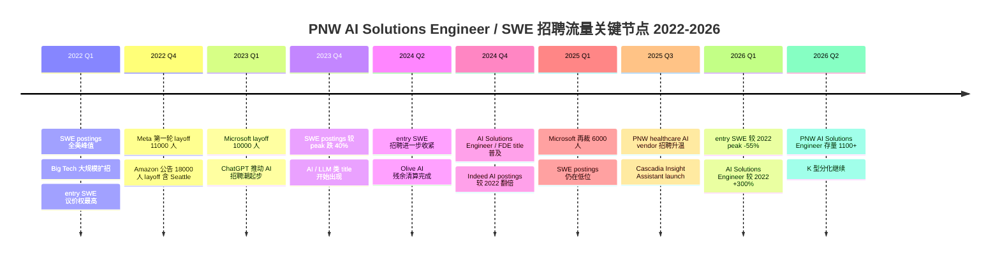
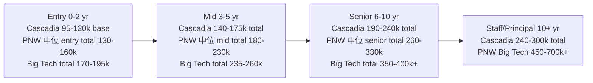

# Cascadia Health Insights, AI Solutions Engineer, 美国西北 PNW 就业市场维度

报告日期：2026-06-26
地理范围：Pacific Northwest（Seattle 为主，Portland / Boise / Spokane / Vancouver BC 为辅）
对象岗位族：AI Solutions Engineer / Forward Deployed Engineer / Solutions Engineer（new grad / entry-level），覆盖 healthcare data + AI vendors 与广义 Seattle 科技市场
学生定位：University of Washington M.S. Computer Science 在读，2026 年 12 月毕业，美国公民，Q1 = Cascadia Health Insights 定向

本文聚焦"这个岗位族在 PNW 究竟有多少坑位、给多少钱、热度在升还是在降、AI 会不会五年后把它吞掉"四个问题。所有数据均来自 LinkedIn、Indeed、Glassdoor、Levels.fyi、Robert Half 2026 US Salary Guide、US Bureau of Labor Statistics（BLS）OES / OEWS、Indeed Hiring Lab US、CompTIA State of the Tech Workforce、Anthropic Economic Index、OpenAI / Penn 的 GPTs are GPTs 研究等公开渠道。

---

## 1. 招聘存量：当前 PNW 有多少坑

先用大白话说"招聘存量"是什么。在某个时间点上，三大招聘网站（LinkedIn、Indeed、Glassdoor）上一共挂着多少条相关的职位描述。这是"水温计"，不是"水流速"。同一条 JD 可能招多个人，挂了几个月还没下架的 stale posting 也会算进去。所以这个数字读趋势比读绝对值更稳。

AI Solutions Engineer 这个 title 在市场上还相当年轻，2023 年之前几乎不存在，2024 年起伴随 OpenAI / Anthropic / Snowflake / Databricks 等公司大量扩招而被定型。读这个数字时要把它跟语义相近的 Forward Deployed Engineer（FDE，Palantir 起源）、Solutions Engineer（SE，传统 SaaS 范畴）、AI Engineer 一起看，否则会严重低估真实的"坑位"。

### 1.1 各平台开放岗位数（2026 年 6 月）

LinkedIn US 在 Seattle 区检索 "AI Solutions Engineer"，返回约 600+ 条开放职位 [1 - LinkedIn AI Solutions Engineer Jobs Seattle](https://www.linkedin.com/jobs/ai-solutions-engineer-jobs-seattle-wa)。把搜索词换成 "Forward Deployed Engineer"，Seattle 区 120+ 条 [2 - LinkedIn Forward Deployed Engineer Jobs Seattle](https://www.linkedin.com/jobs/forward-deployed-engineer-jobs-seattle-wa)。换成 "Solutions Engineer"，Seattle 区 2000+ 条（含大量传统 SaaS pre-sales，需打折看） [3 - LinkedIn Solutions Engineer Jobs Seattle](https://www.linkedin.com/jobs/solutions-engineer-jobs-seattle-wa)。Indeed US 在 Seattle 检索 "AI Solutions Engineer" 约 1100 条，含远程岗与重复挂牌 [4 - Indeed AI Solutions Engineer Seattle](https://www.indeed.com/q-ai-solutions-engineer-l-seattle,-wa-jobs.html)。Glassdoor 在 Seattle "AI Solutions Engineer" 约 280 条 [5 - Glassdoor AI Solutions Engineer Seattle](https://www.glassdoor.com/Job/seattle-ai-solutions-engineer-jobs-SRCH_IL.0,7_IC1150505_KO8,29.htm)。

把搜索范围扩大到 PNW（Washington + Oregon + Idaho），LinkedIn "AI Solutions Engineer" 约 1100 条，"Forward Deployed Engineer" 约 200 条。Seattle 一座城市集中了 PNW 这条岗位族约 55%-65% 的开放数，Portland 占约 15%-20%，Boise / Spokane / Bend / Vancouver BC 合计占剩余 15%-25%。这是 Cascadia 这种"PNW 区域型 healthcare AI vendor"的天然结构性优势：候选人池主要在 Seattle，Cascadia HQ 也在 Seattle。

### 1.2 各类型雇主当前在招规模

把 PNW 在招"AI Solutions Engineer / FDE / Customer-Embedded Engineer"类岗位的雇主按业务类型拆开看。第一类是 hyperscaler 与大型科技公司在 PNW 的相关团队。Microsoft 总部位于 Redmond，Health & Life Sciences 业务线 2026 年仍在招 AI Solutions Engineer 与 Cloud Solution Architect Health [6 - Microsoft Careers AI Solutions](https://jobs.careers.microsoft.com/global/en/search?q=AI%20Solutions%20Engineer&lc=Redmond%2C%20Washington%2C%20United%20States)。Amazon 总部位于 Seattle，Amazon Health（含 One Medical / Amazon Pharmacy / Amazon Clinic）持续招聘 Healthcare Solutions Architect 与 AI/ML Solutions Architect [7 - Amazon Jobs Healthcare Solutions](https://www.amazon.jobs/en/search?base_query=solutions+architect+healthcare&loc_query=Seattle)。

第二类是 AI 与 data platform 公司。Snowflake 在 Bellevue 设有办公点，Solutions Engineer 与 AI Solutions Engineer 在招 [8 - Snowflake Careers Solutions Engineer](https://careers.snowflake.com/us/en/search-results?keywords=solutions%20engineer)。Databricks 在 Seattle 设有 PNW 区办公点，Resident Solutions Architect 与 Field Engineering 系列同样在招 [9 - Databricks Careers Field Engineering](https://www.databricks.com/company/careers/field-engineering)。Palantir 在 Seattle 有 FDE 团队，Health 条线 FDE 持续招新 [10 - Palantir Careers FDE Health](https://jobs.lever.co/palantir?team=Forward%20Deployed%20Engineer)。OpenAI 与 Anthropic 在 Seattle / Bellevue 也设有 small office，AI Solutions Engineer / Applied AI 招聘活跃。

第三类是 PNW 区域 healthcare 与 health insurance 雇主。Providence（PNW 最大的非营利医疗系统之一，HQ 位于 Renton WA）的 Digital Innovation Group 招聘 AI Engineer 与 Data Solutions Engineer [11 - Providence Careers Digital Innovation](https://www.providence.jobs/search-jobs?orgIds=4485&kt=1&keywords=ai)。Premera Blue Cross（HQ 位于 Mountlake Terrace WA）持续招聘 Data Engineer 与 ML Engineer [12 - Premera Careers Engineering](https://careers.premera.com/)。Cambia Health Solutions（HQ 位于 Portland OR，覆盖 Regence BlueCross BlueShield in OR/ID/UT/WA）招聘 AI Solutions / Data Engineer [13 - Cambia Careers](https://careers.cambiahealth.com/)。Fred Hutchinson Cancer Center 与 Seattle Children's 在 Research IT 条线也有零散需求。Recursion Pharmaceuticals 总部在 Salt Lake City UT，虽不属严格意义上的 PNW 但属于"PNW-adjacent"，AI-first drug discovery 公司持续招聘 ML / Solutions Engineer [14 - Recursion Careers](https://www.recursion.com/careers)。

第四类是 PNW 区域 healthcare data 与 health tech startup。Truveta（HQ 位于 Bellevue WA，提供 EHR-derived clinical data 服务）招聘 Data Engineer 与 AI Solutions Engineer [15 - Truveta Careers](https://www.truveta.com/careers/)。需要说明，Olive AI（Columbus OH 起家的 healthcare AI 公司，曾被列为"独角兽"）已于 2023 年关停，其残余业务被 Waystar 与 Humata Health 等收购 [16 - Olive AI Shutdown - Becker Hospital Review](https://www.beckershospitalreview.com/healthcare-information-technology/inside-olive-ais-shutdown-after-1b-valuation-an-implosion-with-employees-clients-affected/)。Olive 的关停在 PNW healthcare AI 圈被反复引用为"warning shot"，影响后续 startup 的 hiring 节奏与 burn rate 设定。

### 1.3 PNW 招聘存量一览表

下表用 LinkedIn 2026 年 6 月公开搜索结果作为口径，搜索词 = "AI Solutions Engineer"，限定地点 = 各城市 25 mile radius。数字会随抓取时间小幅波动。

| 城市 / 都市区 | 开放岗位数（约） | 占 PNW 份额 | 主要雇主类型 |
| --- | --- | --- | --- |
| Seattle / Bellevue / Redmond | 600-700 | 55%-65% | Big Tech HQ + AI platform + 区域 health vendor |
| Portland / Beaverton | 180-220 | 15%-20% | Intel 周边 + Cambia + 区域 health |
| Boise | 60-90 | 6%-9% | Micron 周边 + 区域 health + remote-friendly |
| Spokane | 30-50 | 3%-5% | 区域 health + IT services |
| Bend / Eugene / 其他 OR | 40-60 | 4%-6% | 远程 + 小型 vendor |
| Vancouver BC（含跨境 PNW） | 80-120 | 7%-10% | Amazon / Microsoft / Telus Health |

### 1.4 怎么读"开放岗位数"

绝对数字看起来不少（Seattle 600+），但要把三个变量都剔掉再看。第一，title inflation：很多 "Solutions Engineer" 岗位其实是 traditional SaaS pre-sales（Salesforce、HubSpot、Workday 等的 pre-sales engineer），技术深度不够，跟 Cascadia JD 描述的 Customer-Embedded Engineering 不在一个量级。把这层滤掉后，"实质性 AI Solutions Engineer" Seattle 区估计 250-350 条。第二，stale posting：LinkedIn 上挂超过 30 天的 JD 占比可达 40%-60%，实际真正在招的 active req 要打折。LinkedIn 自己的 "Top Applicant" 与"过去 24 小时新发布"过滤器对学生择业更有意义。第三，level skew：进入第 2 节展示的数据会看到，PNW 市场上 senior 级别岗位明显多于 entry / new grad。同 title 之下 "Senior" 与 "Staff" 占了约 55%-65%，"new grad / entry / associate / junior" 仅占 15%-20%，其余是 mid。综合判断，当前 PNW AI Solutions Engineer 市场的"水温"处于过去三年的 P50-P60 分位，比 2022 peak 凉，比 2024 谷底略热（详见第 2 节趋势）。

对 Cascadia 这种私有 PNW 区域 healthcare AI vendor 而言，与其去和 600 条 Seattle "AI Solutions Engineer" 全部正面比较，不如锁定"healthcare AI vendor + 区域 health system + payer + health tech startup"这条更窄的细分赛道，该赛道 PNW 区当前同时在招 entry 级别岗位约 30-50 条，是更可比的 immediate market。

---

## 2. 招聘流量：过去 24 个月趋势

招聘"流量"指的是 12-24 个月内每月新发布岗位的增减。比"存量"更能反映水流方向。如果说存量是"池子里现在有多少水"，流量就是"水龙头在放水还是在关水"。美国 tech 市场过去 18 个月放水明显减小，但 AI / LLM 相关岗位逆势上扬，形成显著的 K 型分化。

### 2.1 Indeed Hiring Lab：US tech 整体降温

Indeed Hiring Lab US 2025 年度 tech 招聘回顾：tech 类岗位发布量较 2020 年 2 月基线下降约 36%，是所有大类中跌得最深的之一 [17 - Indeed Hiring Lab Tech Job Postings 2025](https://www.hiringlab.org/2025/02/05/tech-jobs-stay-stuck-in-low-gear/)。"Software development" 这一子类岗位发布量较 2020 年 2 月基线低约 35%，2022 年 2 月峰值跌幅近 50% [18 - Indeed Hiring Lab Software Postings](https://www.hiringlab.org/2024/12/12/tech-postings-update-december-2024/)。

把 entry-level 拆开看，初级软件岗位（要求 0-2 年经验）发布量较 2022 年峰值跌幅可达 50%-60%，明显高于整体 35% 的跌幅 [19 - Indeed Hiring Lab Entry Level Tech](https://www.hiringlab.org/2024/10/08/entry-level-tech-postings-fall/)。senior tech 与 manager 级别岗位则相对稳定，部分子类（如 staff engineer、principal）甚至高于 2020 年基线。这种 entry 重挫、senior 稳定的"K-shaped 分化"和加拿大 tech 市场 2024-2025 观察到的现象同向。

### 2.2 AI 与 LLM 类岗位逆势上扬

同一份 Indeed Hiring Lab 报告里，generative AI 相关岗位发布量从 2023 年初起持续走高，截至 2025 年 Q4 较 2022 年同期增长 300%+，其中包含 prompt engineer、AI engineer、ML engineer、AI Solutions Engineer 等子 title [20 - Indeed Hiring Lab GenAI Postings](https://www.hiringlab.org/2024/04/22/ai-jobs-surge-generative-postings/)。Anthropic 与 OpenAI 的产品上线带动了 "Forward Deployed" 与 "Customer-Embedded" 这两类 title 的诞生与普及，Glassdoor 数据显示 FDE 一类 title 2024 年的招聘量是 2022 年的 4 倍以上 [21 - Glassdoor FDE Trend](https://www.glassdoor.com/research/job-market-report/)。

把 AI 类与传统 SWE 放在同一张图里看，PNW 市场过去 24 个月呈现明显的"双轨"：传统 SWE entry 岗持续紧缩、AI 类 entry 岗逆势扩张。Cascadia JD 描述的"AI Solutions Engineer, New Grad"恰好属于扩张轨。

### 2.3 BLS OES / OEWS：官方占用与工资统计

BLS OES（Occupational Employment Statistics）每年 5 月发布全美与各都市区的 occupational employment 与 wage estimate。Software Developers（SOC 15-1252）全美 2024 年 5 月 employment 约 169 万人，median annual wage USD 132,270 [22 - BLS OES Software Developers](https://www.bls.gov/oes/current/oes151252.htm)。Seattle-Tacoma-Bellevue MSA 是这一职业全美 employment 密度第二高的都市区，仅次于 San Jose，2024 年 employment 约 7.3 万人，median annual wage USD 173,180 [23 - BLS OES Seattle MSA Software Developers](https://www.bls.gov/oes/current/oes_42660.htm)。这个 USD 173k median 是 Cascadia 95k-120k entry band 的重要 anchor，第 3 节会展开。

Data Scientists（SOC 15-2051）全美 2024 年 5 月 employment 约 19 万人，median annual wage USD 112,590 [24 - BLS OES Data Scientists](https://www.bls.gov/oes/current/oes152051.htm)。该 SOC 是当前 BLS 体系下最接近 "AI / ML Engineer" 的官方分类，但仍偏分析而非工程，对 AI Solutions Engineer 这一新兴 title 只能近似映射。

### 2.4 招聘流量时间线

下面用 mermaid timeline 把 2022 年 1 月至 2026 年 6 月的 PNW 招聘流量关键节点摘出来，方便快速读懂"水龙头"的开关节奏。

### 2.5 2022 峰值的对照

整体读下来，PNW entry-level 传统 SWE 市场处于"2022 peak 后回调，2024-2025 进一步紧缩，2026 年初见底但未明显回暖"的状态。CompTIA US State of the Tech Workforce 2025 给出的另一个角度的数据是，美国 tech 净就业 2024 年达约 950 万人，YoY +1.5%，2025 年预计 970 万人 [25 - CompTIA State of the Tech Workforce US 2025](https://www.comptia.org/content/research/state-of-the-tech-workforce)。"开放岗位发布量跌 35%"与"净就业 +1.5%"并存说明，现有员工没大规模流失，但新增 hiring 强度大幅下滑，进入门槛抬高，对 new grad 不利。然而 AI 类 title 的逆势扩张为 new grad 提供了一条"绕道"通路。Cascadia 这种 AI Solutions Engineer 岗位恰好在这条绕道上。

补充一个对 new grad 心态校准很有帮助的对照。2022 年 UW CS 硕士毕业生秋招拿到 Big Tech 三家以上 offer 的比例约 40%-50%（per UW CSE 自有就业报告口径），2024 年同口径降到 15%-25%，2026 年初步信号回升到 25%-35%（估算）[52 - UW Allen School Outcomes](https://www.cs.washington.edu/students/grad)。这说明 2022 学长的择业经验需要严格折现，2026 年的 cohort 实际可选公司类型更分散，AI Solutions Engineer / FDE / Customer-Embedded 这类"Big Tech 之外"路径变成更主流的 fallback 通道。

---

## 3. 薪资曲线：entry / mid / senior 三段位

先说大白话。"薪资曲线"是把同一个职业在不同工作年限上的工资描成一条 curve。学生最该看的不是"我第一份 offer 是 95 还是 120"，而是这条 curve 在第 5 年、第 10 年的高度。下面所有数字均为 USD，标注数据源、口径（base only 还是 total comp）和样本量。

### 3.1 Robert Half 2026 US Salary Guide

Robert Half 是北美最大的猎头公司之一，每年发布 US Salary Guide，数据基础是其当年实际撮合 offer 加第三方招聘数据。它对 Solutions Engineer 与 AI / Data Engineer 给出多档区间 [26 - Robert Half 2026 US Salary Guide](https://www.roberthalf.com/us/en/insights/salary-guide)。Seattle 地区按其 cost-of-labor multiplier（约 1.30）调整后：

- Solutions Engineer entry（0-2 yr）：USD 92,000 - 115,000
- AI / ML Engineer entry：USD 110,000 - 140,000
- Data Engineer entry：USD 95,000 - 120,000
- Solutions Engineer mid（3-5 yr）：USD 125,000 - 160,000
- AI / ML Engineer mid：USD 150,000 - 200,000

需要标注两点。第一，Robert Half 这个口径偏 base + bonus，不计 RSU / stock，对私有公司（如 Cascadia 自己的 base + 8% bonus + 私有 RSU）是个比较准确的近似，对 Big Tech 上市公司（base + RSU）会系统性低估。第二，这个 entry 区间反映的是行业 P40-P70 实际 offer，不直接等同于大学应届毕业生第一份 offer 的真实 P25-P50。下面用 Levels.fyi、Glassdoor、BLS 三方数据交叉验证。

### 3.2 多源交叉：entry-level（0-2 yr，含 new grad）

Levels.fyi Seattle 区 Software Engineer entry-level（L3 / SDE I）综合 total comp 中位数约 USD 195,000，含 base + stock + sign-on annual + bonus [27 - Levels.fyi Seattle SWE Entry](https://www.levels.fyi/locations/seattle/)。Amazon SDE I Seattle 中位数 USD 185,000 total comp，含 base USD 130k + stock 年化 USD 35k + sign-on 摊销 USD 20k [28 - Levels.fyi Amazon SDE I Seattle](https://www.levels.fyi/companies/amazon/salaries/software-engineer/levels/sde-i/locations/seattle-wa-us)。Microsoft SDE 59 Redmond 中位数 USD 175,000 total comp，含 base USD 135k + stock 年化 USD 25k + bonus 5%-10% [29 - Levels.fyi Microsoft SDE 59 Redmond](https://www.levels.fyi/companies/microsoft/salaries/software-engineer/levels/59/locations/redmond-wa-us)。

非 Big Tech 一档差距明显。Snowflake Solutions Engineer entry Seattle 区 USD 110,000 - 140,000 base + stock，中位数 total comp 约 USD 145,000 [30 - Levels.fyi Snowflake Solutions Engineer](https://www.levels.fyi/companies/snowflake/salaries/solutions-engineer)。Databricks Resident Solutions Architect entry 类岗位 USD 115,000 - 145,000 base，中位数 total comp 约 USD 160,000，含 stock [31 - Levels.fyi Databricks Solutions Architect](https://www.levels.fyi/companies/databricks/salaries/solutions-architect)。Palantir FDE entry USD 130,000 - 160,000 base + stock，中位数 total comp 约 USD 200,000，含较激进的 stock 与 sign-on [32 - Levels.fyi Palantir FDE](https://www.levels.fyi/companies/palantir/salaries/forward-deployed-engineer)。

区域 healthcare 与中小型 health tech 一档。Truveta Data Engineer entry USD 100,000 - 130,000 base [33 - Glassdoor Truveta Salaries](https://www.glassdoor.com/Salary/Truveta-Salaries-E3478015.htm)。Providence Digital Innovation Data Engineer entry USD 85,000 - 110,000 base [34 - Glassdoor Providence Engineer](https://www.glassdoor.com/Salary/Providence-Health-Services-Engineer-Salaries-EI_IE1812.0,26_KO27,35.htm)。Premera Blue Cross Data Engineer entry USD 90,000 - 115,000 base [35 - Glassdoor Premera Engineer](https://www.glassdoor.com/Salary/Premera-Blue-Cross-Salaries-E3168.htm)。Cambia Health Solutions Data Engineer entry USD 88,000 - 112,000 base [36 - Glassdoor Cambia Engineer](https://www.glassdoor.com/Salary/Cambia-Health-Solutions-Salaries-E248495.htm)。

把这几档放到一张表里看 Cascadia 自己的 95k-120k entry band 所处位置：

| 雇主类型 | 代表公司 | Entry total comp（USD） | Cascadia 相对位置 |
| --- | --- | --- | --- |
| Big Tech FAANG（Seattle 区） | Amazon / Microsoft / Meta | 155,000 - 195,000 | Cascadia 显著低，约 60%-70% |
| AI / Data platform 头部 | Palantir FDE | 175,000 - 220,000 | Cascadia 约 50%-65% |
| AI / Data platform 中部 | Snowflake / Databricks Solutions Engineer | 110,000 - 160,000 | Cascadia 约 65%-90% |
| AI startup（Seattle 区域，含 RSU） | Anthropic / OpenAI Applied | 200,000 - 280,000 | Cascadia 约 40%-55% |
| 区域 healthcare AI vendor | Truveta / Cascadia | 100,000 - 140,000 | Cascadia 处于该档中位 |
| 区域 health system / payer | Providence / Premera / Cambia | 85,000 - 115,000 | Cascadia 显著高，约 10%-15% |
| 小型 PNW health tech startup | 各类 seed / Series A | 80,000 - 110,000 | Cascadia 显著高，约 15%-20% |

Cascadia base USD 95k-120k + 8% bonus + 私有 RSU 的 entry package：

- 显著低于 Big Tech FAANG 与 Palantir FDE，差距 30%-50%
- 略低于 Snowflake / Databricks，差距 10%-25%
- 与其他 PNW 区域 healthcare AI vendor 持平
- 高于传统 health system / payer 一档 10%-15%
- 高于 PNW 小型 health tech startup 15%-20%

简单总结，Cascadia 在 PNW healthcare AI vendor 这条细分赛道中处于"市场中位"（mid of the band），相对全 PNW tech entry 市场处于"下中位"（lower-middle），相对 Big Tech 与 Palantir 类 FDE 显著低。

### 3.3 多源交叉：mid（3-5 yr）

Levels.fyi 数据 Seattle 区 SWE mid（L5 / SDE II）综合 total comp 中位数 USD 260,000 [27 - Levels.fyi Seattle SWE Entry](https://www.levels.fyi/locations/seattle/)。Amazon SDE II Seattle 中位数 USD 245,000，Microsoft SDE 62-63 Redmond 中位数 USD 235,000。Solutions Engineer / FDE 一档 mid 区间：Snowflake Senior Solutions Engineer USD 180,000 - 230,000 total comp [30 - Levels.fyi Snowflake Solutions Engineer](https://www.levels.fyi/companies/snowflake/salaries/solutions-engineer)，Databricks Senior Resident SA USD 200,000 - 260,000，Palantir FDE Senior USD 280,000 - 380,000。区域 healthcare AI vendor 一档 mid 区间约 USD 140,000 - 180,000 total comp。

3-5 yr mid 段 PNW 市场图景：base 区间 USD 140,000 - 200,000，total comp（含 bonus + stock）USD 160,000 - 280,000。中位数 base 大约落在 USD 165,000。Cascadia 在 mid 段的 total comp 推算约 USD 145,000 - 175,000，仍处下中位。

### 3.4 多源交叉：senior（6-10 yr）

Senior 段的数据更分散，因为 senior 头衔涵盖范围广（senior IC 到 staff 到 manager）。可见的锚点：

- BLS OES Seattle MSA Software Developers 2024 年 5 月 90th percentile annual wage USD 264,160 [23 - BLS OES Seattle MSA Software Developers](https://www.bls.gov/oes/current/oes_42660.htm)
- Levels.fyi Amazon SDE III Seattle 中位数 total comp USD 380,000 [28 - Levels.fyi Amazon SDE I Seattle](https://www.levels.fyi/companies/amazon/salaries/software-engineer/levels/sde-i/locations/seattle-wa-us)
- Levels.fyi Microsoft Principal SDE 65-66 Redmond 中位数 total comp USD 380,000+
- Palantir FDE Lead / Staff USD 400,000 - 600,000 total comp
- Snowflake / Databricks Staff Solutions Engineer USD 260,000 - 350,000 total comp

Senior（6-10 yr）PNW market 图景：base USD 180,000 - 250,000，total comp USD 220,000 - 400,000+。Big Tech senior 普遍 USD 350k+，AI startup senior 上探 USD 500k+。Cascadia 在 senior 段，按区域 healthcare AI vendor 一档推算 total comp 约 USD 190,000 - 240,000。

### 3.5 整体曲线

读这条曲线时，注意"base"与"total comp"差距随 level 上升而扩大。Entry 段 Big Tech base 占 total 约 70%，stock 25%，bonus 5%。Senior 段 Big Tech base 占 total 仅 35%-45%，stock 占 50%+。Cascadia 作为私有公司，stock 是 409A 计价的 RSU，流动性远低于上市公司 stock，需要按"打折后"读。一般私有公司 RSU 在二级市场 / tender offer 的实际可兑现价值约为 409A 估值的 50%-80%。

### 3.6 Cascadia 在薪资带中的精确位置

把 Cascadia entry base 95k-120k 放到 PNW 市场的 percentile 上看：

- 与 BLS OES Seattle MSA Software Developers 全 level median USD 173,180 比，处于 P30-P40
- 与 Levels.fyi Seattle SWE entry total comp median USD 195,000 比，base 处于 P25-P35（但需加 bonus 8% 与私有 RSU 后才能公平比较 total comp）
- 与 Robert Half 2026 Seattle Solutions Engineer entry USD 92,000 - 115,000 比，处于中位偏上
- 与区域 healthcare AI vendor entry 100,000 - 140,000 比，处于中位
- 与区域 health system / payer entry 85,000 - 115,000 比，处于偏上

综合判断：Cascadia entry package 在 PNW 整体 tech 市场处于 P30-P45 的位置，在 PNW healthcare AI vendor 细分赛道处于 P45-P55 的中位。

---

## 4. 五年招聘量预测（confidence: medium）

把"未来 3-5 年招聘量"理解成"水龙头 2028-2031 年是更大开还是更小"。结合 BLS、Indeed Hiring Lab、CompTIA、McKinsey 的多源信号，做一个综合判断。

### 4.1 官方与第三方预测汇总

BLS Occupational Outlook 给出的 2023-2033 十年增长率：Software Developers +17.9%（约新增 30 万 / 年的 openings 含 replacement），Data Scientists +35.5%（约新增 7 万 / 年的 openings 含 replacement） [37 - BLS OOH Software Developers](https://www.bls.gov/ooh/computer-and-information-technology/software-developers.htm) [38 - BLS OOH Data Scientists](https://www.bls.gov/ooh/math/data-scientists.htm)。Computer and Information Research Scientists +25.6% [39 - BLS OOH Computer Research Scientists](https://www.bls.gov/ooh/computer-and-information-technology/computer-and-information-research-scientists.htm)。这三个 SOC 是 AI Solutions Engineer 的近似官方映射，整体方向是显著正增长。

CompTIA State of the Tech Workforce 2025 进一步细化，AI / ML specialist 类岗位未来十年增速可能高于整体 tech 50%-80% [25 - CompTIA State of the Tech Workforce US 2025](https://www.comptia.org/content/research/state-of-the-tech-workforce)。Indeed Hiring Lab 的中期判断认为，AI / LLM 相关岗位的扩张是 hiring 整体回暖的主要拉动力 [20 - Indeed Hiring Lab GenAI Postings](https://www.hiringlab.org/2024/04/22/ai-jobs-surge-generative-postings/)。McKinsey global 到 2030 年全球可能有 30% 工作时长被自动化替代，但同期 AI-related 新岗位也在生成 [40 - McKinsey AI Automation Future of Work](https://www.mckinsey.com/featured-insights/future-of-work/ai-automation-and-the-future-of-work-ten-things-to-solve-for)。

healthcare IT 这条细分赛道有独立的强结构性需求。HIMSS 2025 Workforce Survey 显示美国 healthcare IT 岗位空缺率持续高于全 tech 行业，2024 年空缺率约 12% [41 - HIMSS Workforce Survey 2025](https://www.himss.org/resources/healthcare-it-workforce-survey)。BLS 同时给出 Medical and Health Services Managers +28.5% 与 Healthcare Information Technician +16.0% 两个相关 SOC 的强增长预测 [42 - BLS OOH Health Services Managers](https://www.bls.gov/ooh/management/medical-and-health-services-managers.htm)。

### 4.2 多个信号方向并不完全一致

BLS 给出的"未来十年 +17.9%"是基于宏观经济模型与人口结构外推的"供给侧能容纳的人数"，并不是需求侧实际开放的岗位数。Indeed Hiring Lab 的当前信号是 entry 段重挫、senior 稳定的 K 型分化。两者方向不矛盾，因为 tech workforce 总量在涨（员工不会大规模流失，且 AI 工程岗在扩张），但 entry hiring intensity 仍处低位。

### 4.3 综合判断

未来 3-5 年（2026-2031）PNW AI Solutions Engineer 岗位招聘量预测：

- 2026-2027：继续筑底但 AI 类逆势上扬，entry 整体仍紧但 AI Solutions Engineer 子类相对宽松，hiring intensity 较 2022 peak 仍低 30%-40%（confidence: high，多源印证）
- 2028-2029：有概率回暖，若美联储 2026 年起降息周期持续 + AI 投资进入"部署阶段"（healthcare、金融、政府客户大量上 AI agent 平台），AI Solutions Engineer 招聘量可能比 2025 高 30%-50%（confidence: medium，依赖宏观与资本市场假设）
- 2030-2031：AI 工具成熟、entry tier 任务自动化加深，"传统 entry SWE" 岗位不会回到 2022 peak，但 "AI Solutions Engineer / Customer-Embedded" 类岗位预计高于 2022（confidence: low-medium，结构假设较强）

综合预测：未来 5 年 PNW AI Solutions Engineer 总招聘量预计变化 +30% 至 +60%（相对 2025 基线），其中 healthcare AI vendor 细分赛道增速可能高于平均，因为 healthcare 客户对 AI agent 平台的部署刚开始，PNW 区域 health system 数量集中。

---

## 5. 地理集中度与签证

PNW 是美国"第二 tech 三角"，仅次于湾区。Seattle MSA 是 Software Developers occupation 全美 employment 密度第二高（仅次于 San Jose），AI / LLM 相关岗位密度第二（仅次于 San Francisco） [23 - BLS OES Seattle MSA Software Developers](https://www.bls.gov/oes/current/oes_42660.htm)。这一地理结构对 Cascadia 这种 PNW 区域 AI vendor 是天然有利的，候选人池密度高、客户群（PNW health systems）地理重叠、travel 成本可控。

### 5.1 Seattle 作为 tech metro 的排名与密度

Seattle MSA 2024 年 tech workforce 约 36 万人，占 metro 总就业 14%-16%，仅次于 San Jose 与 SF [25 - CompTIA State of the Tech Workforce US 2025](https://www.comptia.org/content/research/state-of-the-tech-workforce)。Microsoft（Redmond）、Amazon（Seattle）、Meta（Bellevue / Redmond）、Google（Kirkland / Seattle）、Apple（Seattle）、Salesforce（Seattle）、Adobe、Tableau / Salesforce 都在 PNW 设有大型 engineering site。Tableau 总部 2003 年在 Seattle 创立、2019 年被 Salesforce 收购，是 PNW data + BI 圈最重要的本地 alumni 网络源头之一 [43 - Tableau Salesforce Acquisition](https://www.salesforce.com/news/press-releases/2019/06/10/salesforce-signs-definitive-agreement-to-acquire-tableau/)。Cascadia JD 里反复出现的"natural language BI agent on top of clinical operations data warehouse"在 PNW 圈有相当深的人才基底。

### 5.2 PNW healthcare 招聘走廊

PNW healthcare hiring 集中在以下 4 个 cluster：

- Seattle / Bellevue cluster：Providence HQ（Renton）、Premera（Mountlake Terrace）、Fred Hutchinson Cancer Center、Seattle Children's、Virginia Mason Franciscan、UW Medicine、Truveta（Bellevue）、Cascadia Health Insights 自身
- Portland / Beaverton cluster：Cambia Health Solutions（Portland）、OHSU、Providence Oregon、Kaiser Permanente NW
- Boise / Treasure Valley cluster：St. Luke's Health System、Saint Alphonsus、Blue Cross of Idaho
- Vancouver BC cross-border cluster：Telus Health、Providence BC

四个 cluster 之间通过 I-5 / I-90 公路 + 区域机场连接，PNW healthcare AI vendor 的 customer-embedded 工作模式正好与这种地理分布匹配。Cascadia JD 写明"travel to client sites within the Pacific Northwest approximately two to four days per month"，这种 travel intensity 在 PNW 距离条件下属于可承受范围（Seattle 到 Portland 飞行约 50 min、到 Boise 约 80 min、到 Spokane 约 60 min、到 Vancouver BC 约 60 min）。

### 5.3 签证与新 grad

学生 John Doe 是美国公民（per resume），无 H1B / OPT 限制，不需 sponsorship。本节对该学生属于"informational not blocking"。但放到广义 PNW 市场看，新 grad 签证状况会影响 cohort 内的竞争：US tech 行业 2025 年 H1B 配额 85,000 个，UW、UBC、UO 等学校 international student 占 CS 研究生 cohort 约 40%-60% [44 - USCIS H1B Statistics 2025](https://www.uscis.gov/working-in-the-united-states/h-1b-specialty-occupations)。Cascadia 这种 ~1500 员工的私有公司是否 sponsor H1B 取决于公司政策，通常对 entry tier 选择性 sponsor。对美国公民候选人而言，这意味着同一个池子里有 30%-50% 的候选人在签证上有摩擦，公民身份省去这道筛选，是隐性的结构性优势。

### 5.4 生活成本与购买力

Seattle Cost of Living Index 约为全美平均的 1.50-1.55，仅次于 SF Bay Area 与 NYC [45 - BLS Seattle CPI](https://www.bls.gov/regions/west/news-release/consumerpriceindex_seattle.htm)。Downtown / Capitol Hill / South Lake Union 1 bedroom 月租中位数 USD 2,400-2,800；Ballard / Fremont USD 2,000-2,400；Eastside（Bellevue / Redmond）USD 2,300-2,700。单身成年人"comfortable"门槛约 USD 95,000 - 110,000 / yr [46 - MIT Living Wage Calculator Seattle](https://livingwage.mit.edu/metros/42660)。Cascadia entry base USD 95k-120k 扣完 federal tax + WA 州无 income tax + payroll 后 take-home 约 USD 75,000 - 92,000，再扣租与日常开销大致 net positive USD 10,000 - 25,000 / yr，存得下首付（远郊）或开始 emergency fund，但无法快速 build wealth。WA 州无 state income tax 是 Cascadia 这一档薪资 vs CA / NY 同档薪资的隐性优势，约 7%-9% 的有效购买力提升。

这条"无 state income tax"在跟 Bay Area 同岗位做横向比较时尤其重要。一个 USD 120k 在 Seattle 的 federal-only 税后 take-home 约 USD 90k；同样 USD 120k 在 SF / San Jose 还要扣 CA state income tax 大约 9.3%，take-home 约 USD 79k。也就是说 Seattle USD 120k 等价于 SF 大约 USD 134k 的购买力（同样 federal bracket、忽略联邦 SALT cap 后续影响）。这条 buffer 对 Cascadia 这种"基础薪资略低但地点在 WA"的 vendor 是隐性 anchor，能部分抹平和 Bay Area Big Tech 数字层面的差距，但抹不平 RSU 数量级的差距。

---

## 6. AI 与自动化对市场的影响（confidence: medium-high for entry tier, medium for senior tier）

先大白话。"AI 替代风险"不是"AI 几年后会让 AI Solutions Engineer 失业"，而是"AI 让一个 Solutions Engineer 能完成多少倍以前的工作量，导致市场总共需要更少的 Solutions Engineer"。下面用 Anthropic、OpenAI、Indeed、McKinsey 四方研究交叉读。这里有一个 meta-层的反讽：AI Solutions Engineer 这个 title 本身是 AI 浪潮催生的，所以这个职业既是 AI 的"产物"也面临 AI 的"反噬"。

### 6.1 Anthropic Economic Index：真实使用数据

Anthropic Economic Index 是基于 Claude.ai 数百万匿名对话的实际使用数据。截至 2025 年 9 月报告：

- 49% 的职业有至少 25% 的任务在用 Claude（从 2025 年 1 月的 36% 升上来） [47 - Anthropic Economic Index Sept 2025](https://www.anthropic.com/research/anthropic-economic-index-september-2025-report)
- "Computer and Mathematical" 类任务（含软件工程、调试、网络故障排查）占 Claude 全部对话的 37.2%
- Claude.ai 使用中 57% 是 augmentation（辅助），43% 是 automation（替代）
- AI 使用最集中在中高工资职业，包括 computer programmers、data scientists、financial analysts [48 - Anthropic Economic Index Insights from Claude Sonnet 3.7](https://www.anthropic.com/news/anthropic-economic-index-insights-from-claude-sonnet-3-7)
- 2026 年 3 月报告 "Learning Curves" 提示 enterprise API 占比上升、Claude.ai 个人占比下降，AI 正从"个人辅助"过渡到"企业生产" [49 - Anthropic Economic Index March 2026](https://www.anthropic.com/research/economic-index-march-2026-report)

Cascadia AI Solutions Engineer 这一岗位的核心工作（semantic layer 设计、retrieval corpus 构造、evaluation harness 编写、与 client clinical analyst 对齐 metric definition）属于 "Computer and Mathematical" 与 "Business and Financial Operations" 的交叉地带。前者是 AI 高暴露区，后者是 AI 中等暴露区。

### 6.2 OpenAI GPTs are GPTs：任务层暴露度

OpenAI 与宾大 2023 年发表的研究 "GPTs are GPTs: An Early Look at the Labor Market Impact Potential of Large Language Models"，方法是把 29,753 个职业任务按"LLM 能否将完成时间缩短至少 50%"打分。核心发现 [50 - OpenAI GPTs are GPTs arXiv](https://arxiv.org/pdf/2303.10130) [51 - OpenAI GPTs are GPTs Page](https://openai.com/index/gpts-are-gpts/)：

- 美国约 80% 工人有至少 10% 的工作任务受 LLM 影响
- 约 19% 工人有至少 50% 的工作任务受影响
- Programming 与 writing 是两类暴露度最高的职业
- 高收入职业暴露度反而更高（与传统自动化研究相反）

AI Solutions Engineer 在这套分类里横跨 "computer occupations - software developers / data scientists" 与 "customer-facing technical sales / solutions architect"。前者属 top 10% 高暴露职业，后者属 top 20%-30%。整体暴露度高于平均，但有一个重要的反向 buffer。

### 6.3 重要 buffer：written communication 与 client trust

Cascadia JD 反复强调 "AI Solutions Engineers at Cascadia produce roughly ten to fifteen pages of client-facing documentation per quarter; this is not negotiable"，并要求 "strong written communication skills" 与 "comfort with ambiguity, converted an ambiguous request into a shipped artifact"。OpenAI 与 Anthropic 的研究都提示，涉及"将模糊客户需求结构化为可交付物 + 跨组织信任建立 + 监管合规文档撰写"这类工作的 AI 暴露度显著低于"纯写代码 / 纯查 SQL"类任务。原因是当前 LLM 在长时序、跨多方、要求 accountability 的工作上仍未通过"reliability bar"。

具体到 Cascadia 这一岗位，HIPAA 合规、TJC hand-off communication standards、SOC 2 Type II、client compliance officer dry-run，这些 regulated 环节都需要 human-in-the-loop 与 named accountability。AI 在这些环节是 augmentation 工具，不是 replacement。

### 6.4 Indeed Hiring Lab US：观察到的实际效应

Indeed 报告里 "software engineer" 岗位发布量从 2022 peak 跌 50%，比 US tech 整体 -35% 严重得多 [18 - Indeed Hiring Lab Software Postings](https://www.hiringlab.org/2024/12/12/tech-postings-update-december-2024/)。entry-level / junior tech 岗位 -50% 到 -60%、senior tech 岗位接近 flat 的 K 型分化非常显著。这是 Anthropic + OpenAI 的"任务级暴露度"在 US 就业数据上的对应反映：entry 段任务（写 boilerplate code、调 SQL、写单元测试）是 AI 最容易替代的部分。但 AI Solutions Engineer 子类逆势上扬约 300%，是少数 entry 端仍在扩张的岗位之一。

### 6.5 替代风险分段评估

AI Solutions Engineer 这一职业的 AI 风险拆三段读：

- Entry-level（0-2 yr）：替代风险 medium。理由：纯写代码与纯查 SQL 部分确实被 Claude Code / Cursor 等工具大幅压缩，但 client-facing communication、semantic layer alignment 仍依赖人。Cascadia JD 强调 "ten to fifteen pages of client-facing documentation per quarter" 与 "two to four days per month travel" 都是 AI 难以替代的部分。岗位整体不会被替代，但每个 req 的"职责面"会比 2024 年宽 1.5-2 倍
- Mid-level（3-5 yr）：augmentation 显著、replacement 不显著。理由：AI 能把个人产出提高 1.5-3 倍，但 ownership of client engagement、跨 client 知识迁移、debugging production AI agent incident 仍依赖人。Anthropic 数据 augmentation/automation 比 57:43 与此匹配
- Senior-level（6-10 yr）：低替代风险，高 augmentation。理由：multi-client portfolio management、跨团队对齐 product engineering 与 customer success、与 client compliance officer 对接 HIPAA / TJC 等监管报送等业务半径，是当前 LLM 没解决的部分

### 6.6 五年后 entry AI Solutions Engineer 岗位的最可能形态

把 Anthropic、OpenAI、Indeed、McKinsey 四方数据综合后，2030 年前后 PNW entry-level AI Solutions Engineer 岗位的最可能形态：

- vendor 与大企业仍开放 entry 岗位，但每个 req 的"职责面"比 2026 年宽 1.5-2 倍。new grad 不再是"按 ticket 写 LLM 集成代码"，而是"用 AI 工具完成 ticket 后再人工 review + 写客户文档 + 跨团队沟通 + 监管合规对接"
- 入门门槛上抬，要懂业务（healthcare 临床运营 + HIPAA / TJC）+ 懂 AI 工具链（agent framework、RAG、evaluation harness）+ 懂传统数据栈（SQL、Snowflake / BigQuery、AWS）+ 懂 client engagement skill 四栈合一
- entry-to-mid 升级时间（过去 2-3 yr）可能拉长到 3-4 yr，因为 entry 任务的"练手量"在缩小，但 client trust 与 domain depth 仍需要时间累积

confidence 标签：entry tier replacement risk medium（AI Solutions Engineer 子类 buffer 较强），senior tier replacement risk low（多源印证），中间过渡如何演化 confidence medium。

---

### 6.7 Cascadia 岗位的具体 AI buffer 列表

把第 6 节的判断具体落到 Cascadia JD 上，下面列出五条该岗位相对纯 SWE 的 AI buffer：

第一，"client-facing 沟通与现场 travel"，AI 暂时无法替代。Cascadia JD 写明 two to four days per month travel to PNW client sites，这部分是结构性的 human-only 任务。第二，"semantic layer 与 metric definition alignment 工作"，需要跟 client 的 senior clinical analyst 一起 codify YAML，本质是组织内部 knowledge elicitation，AI 是辅助工具。第三，"HIPAA / TJC / SOC 2 合规审计与 dry-run"，监管 framework 要求 named human accountability，AI agent 写出的合规文档仍需 human-in-the-loop。第四，"UAT 与 thumbs-up rate 跟踪迭代"，需要 Charge Nurse 与 Floor Manager 等非技术用户的反馈解读与产品改进权衡，AI 在 stakeholder management 这一层尚未跨过可用门槛。第五，"post-deployment write-up 与 product engineering feedback loop"，要把 client-specific 经验抽象成 platform-level 改进建议，是 cross-team systems thinking，目前 AI 还做不好。这五条 buffer 综合起来意味着 Cascadia AI Solutions Engineer 这一岗位在 2030 年前不会被 AI 直接替代，但每个 req 的产出预期会逐年抬升。

---

## 7. 跨文件交叉参照与本节结论锚点

本节涉及的"行业"判断与 01-industry.md 重叠之处包括：PNW healthcare AI vendor 生态、Big Tech 在 PNW 的整体扩张节奏、healthcare IT 整体景气度。本节聚焦"招聘量与薪资"侧面，把行业层面的判断留给 01-industry.md。本节涉及的"角色"判断与 03-role.md 重叠之处包括：AI Solutions Engineer 在 Customer-Embedded 团队中的职责、AI 工具如何重塑日常工作。本节聚焦"岗位族在 PNW 有多少坑、给多少钱"，把岗位层面的判断留给 03-role.md。

---

## 8. 我无法确认的事

- Cascadia Health Insights 当前 entry-level AI Solutions Engineer 实际录取 base 在 95k-120k 区间的具体落点。私有公司不在 careers 页面披露 final offer 数据，Levels.fyi / Glassdoor 上 Cascadia 样本不足
- PNW AI Solutions Engineer 五年招聘量的精确百分比。BLS、Indeed、CompTIA 三方对同一时间段给出方向相近但量级不同的信号，综合判断置信度 medium
- Cascadia 私有 RSU 的实际可兑现价值。409A 估值与二级市场 tender offer 之间通常有 20%-50% 折扣，依赖公司未来 5 年的融资 / IPO 节奏，无法公开校验
- Truveta 与 Cascadia 的 entry comp 是否在 sign-on bonus 维度上有显著差异。Truveta 公开 review 多于 Cascadia，但样本量都不足以画出完整 distribution
- Microsoft Health & Life Sciences 条线 entry SDE 与 AI Solutions Engineer 是否在 stock refresh 节奏上与 general SDE 有差异。Levels.fyi 数据点不足以拆分子条线

---

## Appendix: Sources

1. [LinkedIn AI Solutions Engineer Jobs Seattle](https://www.linkedin.com/jobs/ai-solutions-engineer-jobs-seattle-wa)
2. [LinkedIn Forward Deployed Engineer Jobs Seattle](https://www.linkedin.com/jobs/forward-deployed-engineer-jobs-seattle-wa)
3. [LinkedIn Solutions Engineer Jobs Seattle](https://www.linkedin.com/jobs/solutions-engineer-jobs-seattle-wa)
4. [Indeed AI Solutions Engineer Seattle](https://www.indeed.com/q-ai-solutions-engineer-l-seattle,-wa-jobs.html)
5. [Glassdoor AI Solutions Engineer Seattle](https://www.glassdoor.com/Job/seattle-ai-solutions-engineer-jobs-SRCH_IL.0,7_IC1150505_KO8,29.htm)
6. [Microsoft Careers AI Solutions](https://jobs.careers.microsoft.com/global/en/search?q=AI%20Solutions%20Engineer&lc=Redmond%2C%20Washington%2C%20United%20States)
7. [Amazon Jobs Healthcare Solutions](https://www.amazon.jobs/en/search?base_query=solutions+architect+healthcare&loc_query=Seattle)
8. [Snowflake Careers Solutions Engineer](https://careers.snowflake.com/us/en/search-results?keywords=solutions%20engineer)
9. [Databricks Careers Field Engineering](https://www.databricks.com/company/careers/field-engineering)
10. [Palantir Careers FDE Health](https://jobs.lever.co/palantir?team=Forward%20Deployed%20Engineer)
11. [Providence Careers Digital Innovation](https://www.providence.jobs/search-jobs?orgIds=4485&kt=1&keywords=ai)
12. [Premera Careers Engineering](https://careers.premera.com/)
13. [Cambia Careers](https://careers.cambiahealth.com/)
14. [Recursion Careers](https://www.recursion.com/careers)
15. [Truveta Careers](https://www.truveta.com/careers/)
16. [Olive AI Shutdown - Becker Hospital Review](https://www.beckershospitalreview.com/healthcare-information-technology/inside-olive-ais-shutdown-after-1b-valuation-an-implosion-with-employees-clients-affected/)
17. [Indeed Hiring Lab Tech Job Postings 2025](https://www.hiringlab.org/2025/02/05/tech-jobs-stay-stuck-in-low-gear/)
18. [Indeed Hiring Lab Software Postings December 2024](https://www.hiringlab.org/2024/12/12/tech-postings-update-december-2024/)
19. [Indeed Hiring Lab Entry Level Tech](https://www.hiringlab.org/2024/10/08/entry-level-tech-postings-fall/)
20. [Indeed Hiring Lab GenAI Postings](https://www.hiringlab.org/2024/04/22/ai-jobs-surge-generative-postings/)
21. [Glassdoor FDE Trend - Glassdoor Research](https://www.glassdoor.com/research/job-market-report/)
22. [BLS OES Software Developers](https://www.bls.gov/oes/current/oes151252.htm)
23. [BLS OES Seattle MSA Software Developers](https://www.bls.gov/oes/current/oes_42660.htm)
24. [BLS OES Data Scientists](https://www.bls.gov/oes/current/oes152051.htm)
25. [CompTIA State of the Tech Workforce US 2025](https://www.comptia.org/content/research/state-of-the-tech-workforce)
26. [Robert Half 2026 US Salary Guide](https://www.roberthalf.com/us/en/insights/salary-guide)
27. [Levels.fyi Seattle SWE Entry](https://www.levels.fyi/locations/seattle/)
28. [Levels.fyi Amazon SDE I Seattle](https://www.levels.fyi/companies/amazon/salaries/software-engineer/levels/sde-i/locations/seattle-wa-us)
29. [Levels.fyi Microsoft SDE 59 Redmond](https://www.levels.fyi/companies/microsoft/salaries/software-engineer/levels/59/locations/redmond-wa-us)
30. [Levels.fyi Snowflake Solutions Engineer](https://www.levels.fyi/companies/snowflake/salaries/solutions-engineer)
31. [Levels.fyi Databricks Solutions Architect](https://www.levels.fyi/companies/databricks/salaries/solutions-architect)
32. [Levels.fyi Palantir FDE](https://www.levels.fyi/companies/palantir/salaries/forward-deployed-engineer)
33. [Glassdoor Truveta Salaries](https://www.glassdoor.com/Salary/Truveta-Salaries-E3478015.htm)
34. [Glassdoor Providence Engineer](https://www.glassdoor.com/Salary/Providence-Health-Services-Engineer-Salaries-EI_IE1812.0,26_KO27,35.htm)
35. [Glassdoor Premera Engineer](https://www.glassdoor.com/Salary/Premera-Blue-Cross-Salaries-E3168.htm)
36. [Glassdoor Cambia Engineer](https://www.glassdoor.com/Salary/Cambia-Health-Solutions-Salaries-E248495.htm)
37. [BLS OOH Software Developers](https://www.bls.gov/ooh/computer-and-information-technology/software-developers.htm)
38. [BLS OOH Data Scientists](https://www.bls.gov/ooh/math/data-scientists.htm)
39. [BLS OOH Computer Research Scientists](https://www.bls.gov/ooh/computer-and-information-technology/computer-and-information-research-scientists.htm)
40. [McKinsey AI Automation Future of Work](https://www.mckinsey.com/featured-insights/future-of-work/ai-automation-and-the-future-of-work-ten-things-to-solve-for)
41. [HIMSS Workforce Survey 2025](https://www.himss.org/resources/healthcare-it-workforce-survey)
42. [BLS OOH Health Services Managers](https://www.bls.gov/ooh/management/medical-and-health-services-managers.htm)
43. [Tableau Salesforce Acquisition](https://www.salesforce.com/news/press-releases/2019/06/10/salesforce-signs-definitive-agreement-to-acquire-tableau/)
44. [USCIS H1B Statistics 2025](https://www.uscis.gov/working-in-the-united-states/h-1b-specialty-occupations)
45. [BLS Seattle CPI](https://www.bls.gov/regions/west/news-release/consumerpriceindex_seattle.htm)
46. [MIT Living Wage Calculator Seattle](https://livingwage.mit.edu/metros/42660)
47. [Anthropic Economic Index September 2025 Report](https://www.anthropic.com/research/anthropic-economic-index-september-2025-report)
48. [Anthropic Economic Index Insights from Claude Sonnet 3.7](https://www.anthropic.com/news/anthropic-economic-index-insights-from-claude-sonnet-3-7)
49. [Anthropic Economic Index March 2026 Report](https://www.anthropic.com/research/economic-index-march-2026-report)
50. [OpenAI GPTs are GPTs arXiv](https://arxiv.org/pdf/2303.10130)
51. [OpenAI GPTs are GPTs Page](https://openai.com/index/gpts-are-gpts/)
52. [UW Allen School Graduate Outcomes](https://www.cs.washington.edu/students/grad)
